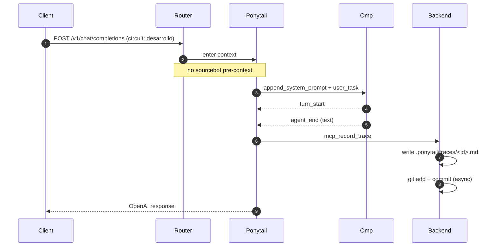

# 🔍 Traza Ponytail: `tr-37066b0aa710`

Modo: `DESARROLLO` | Estado: 🔴 **ERROR** | Fecha: `2026-07-01T13:09:53-0300`

## 🗺️ Flujo de Ejecución

Este diagrama se renderiza automáticamente en GitHub:

## 💬 Mensajes

## ❌ Errors

1. `Custom failure`
