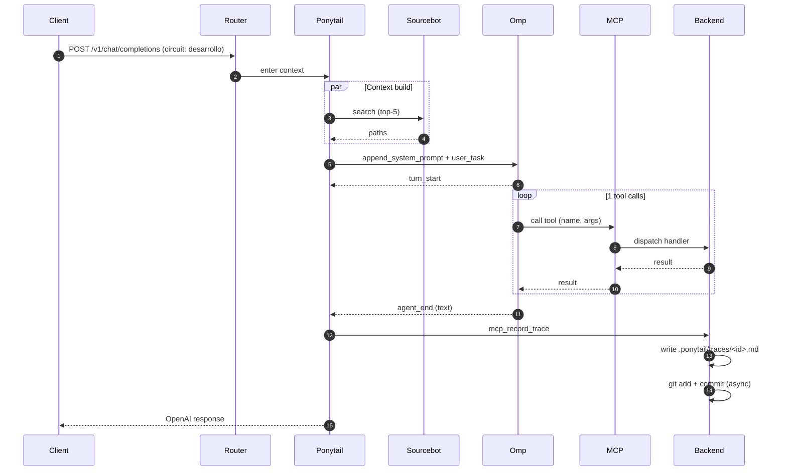

# 🔍 Traza Ponytail: `tr-52a1eeaf0728`

Modo: `DESARROLLO` | Estado: 🔴 **ERROR** | Fecha: `2026-07-01T13:08:04-0300`

## 🗺️ Flujo de Ejecución

Este diagrama se renderiza automáticamente en GitHub:



## 💬 Mensajes

### User (input)
```
test
```

## 🔧 Tool Calls (1)

### 1. `run_salvar`
- **status:** success
- **latency:** 100ms
- **args:**
```json
{"x": 1}
```
- **result:**
```json
{"ok": true}
```

## 📡 Sourcebot Hits

- `app/main.py:1`

## ❌ Errors

1. `AssertionError: assert 1 == 3
 +  where 1 = len([{'data': {'text': 'hi'}, 'timestamp': 1782922084809, 'type': 'omp_message_update'}])
 +    where [{'data': {'text': 'hi'}, 'timestamp': 1782922084809, 'type': 'omp_message_update'}] = <app.openhands_agent.ponytail.PonytailTrace object at 0x7c13fd991cd0>.events`
