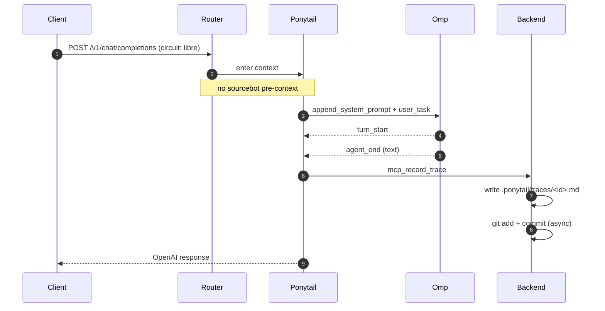

# 🔍 Traza Ponytail: `tr-7e66b5687b46`

Modo: `LIBRE` | Estado: 🟡 **TIMEOUT** | Fecha: `2026-07-01T13:09:53-0300`

## 🗺️ Flujo de Ejecución

Este diagrama se renderiza automáticamente en GitHub:

## 💬 Mensajes

## ❌ Errors

1. `Request timed out`
