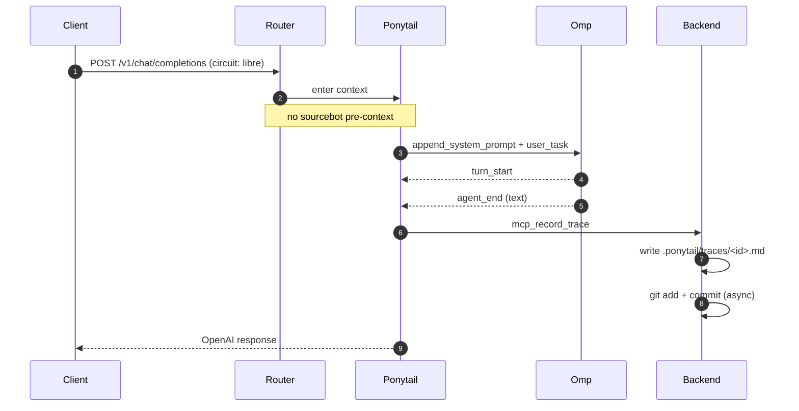

# 🔍 Traza Ponytail: `tr-d9c314a1d967`

Modo: `LIBRE` | Estado: 🟢 **SUCCESS** | Fecha: `2026-07-01T13:09:53-0300`

## 🗺️ Flujo de Ejecución

Este diagrama se renderiza automáticamente en GitHub:

## 💬 Mensajes
