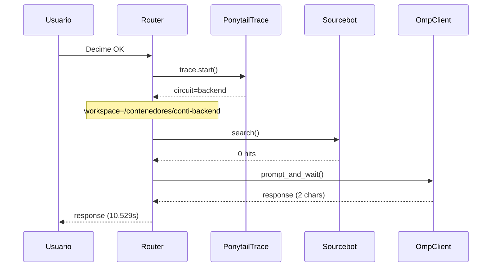

# Traza: Decime OK

- **Circuito**: `backend`
- **Workspace**: `/contenedores/conti-backend`
- **Inicio**: 2026-07-02T17:16:55.457650
- **Fin**: 2026-07-02T17:17:06.007470
- **Duración**: 10.55s
- **Eventos**: 5

## Diagrama de Secuencia



## Eventos Detallados

### 1. `start` (2026-07-02T17:16:55.457759)

```json
{
  "task": "Decime OK",
  "payload_keys": [
    "messages",
    "circuit",
    "_circuit"
  ],
  "circuit": "backend",
  "traces_dir": "/app/logs/ponytail"
}
```

### 2. `circuit_selected` (2026-07-02T17:16:55.466041)

```json
{
  "id": "backend",
  "workspace": "/contenedores/conti-backend"
}
```

### 3. `sourcebot_search` (2026-07-02T17:16:55.610140)

```json
{
  "hits": 0
}
```

### 4. `openhands_invoke` (2026-07-02T17:17:05.986543)

```json
{
  "circuit": "backend",
  "len": 2
}
```

### 5. `end` (2026-07-02T17:17:05.986574)

```json
{
  "duration_s": 10.529
}
```
