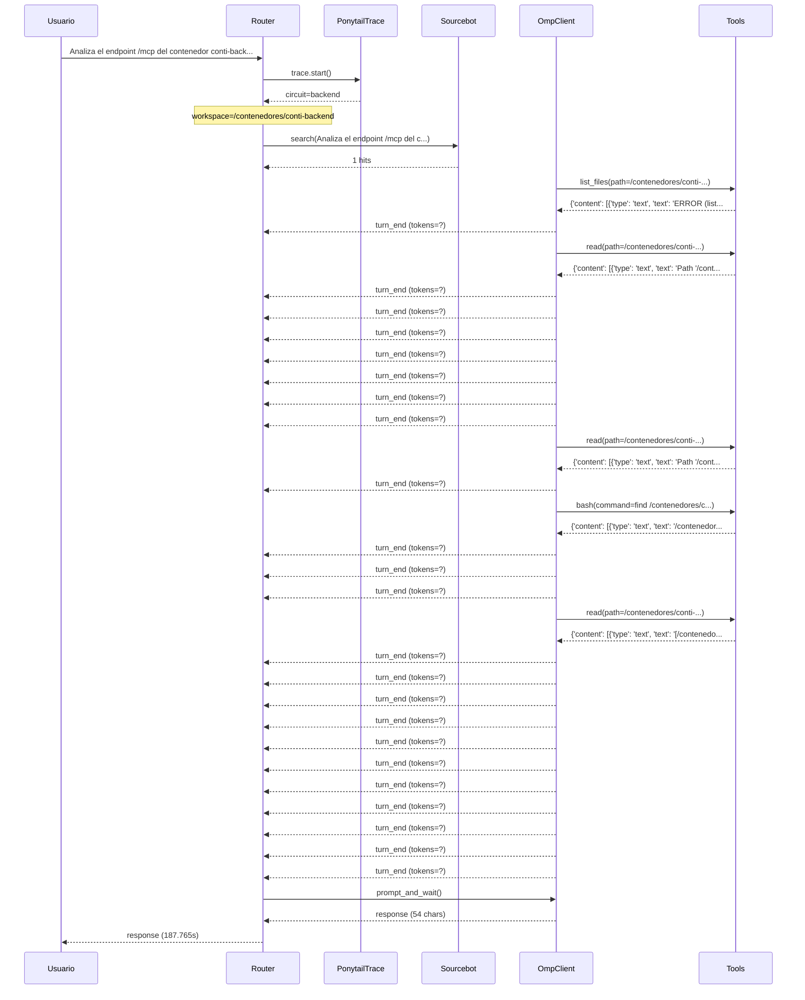

# Traza: Analiza el endpoint /mcp del contenedor conti-backend y documenta todas las tools en un documento mcp_tools_doc.md

- **Circuito**: `backend`
- **Workspace**: `/contenedores/conti-backend`
- **Inicio**: 2026-07-02T21:12:48.850762
- **Fin**: 2026-07-02T21:15:56.619181
- **Duración**: 187.768s
- **Eventos**: 81

## Diagrama de Secuencia



## Eventos Detallados

### 1. `start` (2026-07-02T21:12:48.851470)

```json
{
  "task": "Analiza el endpoint /mcp del contenedor conti-backend y documenta todas las tools en un documento mcp_tools_doc.md",
  "payload_keys": [
    "messages",
    "circuit",
    "_circuit"
  ],
  "circuit": "backend",
  "traces_dir": "/app/logs/ponytail"
}
```

### 2. `circuit_selected` (2026-07-02T21:12:48.853984)

```json
{
  "id": "backend",
  "workspace": "/contenedores/conti-backend"
}
```

### 3. `sourcebot_search` (2026-07-02T21:12:49.088211)

```json
{
  "query": "Analiza el endpoint /mcp del contenedor conti-backend y documenta todas las tools en un documento mcp_tools_doc.md",
  "matches_requested": 5,
  "hits": 1,
  "results_preview": [
    {
      "repo": "?",
      "path": "docs/ESTADO_REAL.md",
      "fileName": "docs/ESTADO_REAL.md"
    }
  ]
}
```

### 4. `omp_message_update` (2026-07-02T21:13:00.143611)

```json
{
  "event_type": "message_update",
  "role": "assistant",
  "text": "",
  "model": "?",
  "provider": "?",
  "stop_reason": null,
  "usage": null
}
```

### 5. `omp_message_update` (2026-07-02T21:13:00.143825)

```json
{
  "event_type": "message_update",
  "role": "assistant",
  "text": "",
  "model": "?",
  "provider": "?",
  "stop_reason": null,
  "usage": null
}
```

### 6. `omp_message_update` (2026-07-02T21:13:00.143978)

```json
{
  "event_type": "message_update",
  "role": "assistant",
  "text": "",
  "model": "?",
  "provider": "?",
  "stop_reason": null,
  "usage": null
}
```

### 7. `omp_message_update` (2026-07-02T21:13:00.144127)

```json
{
  "event_type": "message_update",
  "role": "assistant",
  "text": "",
  "model": "?",
  "provider": "?",
  "stop_reason": null,
  "usage": null
}
```

### 8. `omp_message_update` (2026-07-02T21:13:00.144276)

```json
{
  "event_type": "message_update",
  "role": "assistant",
  "text": "",
  "model": "?",
  "provider": "?",
  "stop_reason": null,
  "usage": null
}
```

### 9. `omp_message_update` (2026-07-02T21:13:00.144442)

```json
{
  "event_type": "message_update",
  "role": "assistant",
  "text": "",
  "model": "?",
  "provider": "?",
  "stop_reason": null,
  "usage": null
}
```

### 10. `omp_message_update` (2026-07-02T21:13:00.144591)

```json
{
  "event_type": "message_update",
  "role": "assistant",
  "text": "",
  "model": "?",
  "provider": "?",
  "stop_reason": null,
  "usage": null
}
```

### 11. `omp_message_update` (2026-07-02T21:13:00.144767)

```json
{
  "event_type": "message_update",
  "role": "assistant",
  "text": "",
  "model": "?",
  "provider": "?",
  "stop_reason": null,
  "usage": null
}
```

### 12. `omp_message_update` (2026-07-02T21:13:00.159075)

```json
{
  "event_type": "message_update",
  "role": "assistant",
  "text": "",
  "model": "?",
  "provider": "?",
  "stop_reason": null,
  "usage": null
}
```

### 13. `omp_message_update` (2026-07-02T21:13:00.184851)

```json
{
  "event_type": "message_update",
  "role": "assistant",
  "text": "",
  "model": "?",
  "provider": "?",
  "stop_reason": null,
  "usage": null
}
```

### 14. `omp_message_update` (2026-07-02T21:13:00.185083)

```json
{
  "event_type": "message_update",
  "role": "assistant",
  "text": "",
  "model": "?",
  "provider": "?",
  "stop_reason": null,
  "usage": null
}
```

### 15. `omp_message_update` (2026-07-02T21:13:00.185225)

```json
{
  "event_type": "message_update",
  "role": "assistant",
  "text": "",
  "model": "?",
  "provider": "?",
  "stop_reason": null,
  "usage": null
}
```

### 16. `omp_message_update` (2026-07-02T21:13:00.185349)

```json
{
  "event_type": "message_update",
  "role": "assistant",
  "text": "",
  "model": "?",
  "provider": "?",
  "stop_reason": null,
  "usage": null
}
```

### 17. `omp_message_update` (2026-07-02T21:13:00.261125)

```json
{
  "event_type": "message_update",
  "role": "assistant",
  "text": "",
  "model": "?",
  "provider": "?",
  "stop_reason": null,
  "usage": null
}
```

### 18. `omp_message_update` (2026-07-02T21:13:00.309515)

```json
{
  "event_type": "message_update",
  "role": "assistant",
  "text": "",
  "model": "?",
  "provider": "?",
  "stop_reason": null,
  "usage": null
}
```

### 19. `omp_message_update` (2026-07-02T21:13:00.309682)

```json
{
  "event_type": "message_update",
  "role": "assistant",
  "text": "",
  "model": "?",
  "provider": "?",
  "stop_reason": null,
  "usage": null
}
```

### 20. `omp_message_update` (2026-07-02T21:13:00.309839)

```json
{
  "event_type": "message_update",
  "role": "assistant",
  "text": "",
  "model": "?",
  "provider": "?",
  "stop_reason": null,
  "usage": null
}
```

### 21. `omp_message_update` (2026-07-02T21:13:00.310575)

```json
{
  "event_type": "message_update",
  "role": "assistant",
  "text": "",
  "model": "?",
  "provider": "?",
  "stop_reason": null,
  "usage": null
}
```

### 22. `omp_message_update` (2026-07-02T21:13:00.310741)

```json
{
  "event_type": "message_update",
  "role": "assistant",
  "text": "",
  "model": "?",
  "provider": "?",
  "stop_reason": null,
  "usage": null
}
```

### 23. `omp_message_update` (2026-07-02T21:13:00.310969)

```json
{
  "event_type": "message_update",
  "role": "assistant",
  "text": "",
  "model": "?",
  "provider": "?",
  "stop_reason": null,
  "usage": null
}
```

### 24. `omp_message_update` (2026-07-02T21:13:00.311863)

```json
{
  "event_type": "message_update",
  "role": "assistant",
  "text": "",
  "model": "?",
  "provider": "?",
  "stop_reason": null,
  "usage": null
}
```

### 25. `omp_message_update` (2026-07-02T21:13:00.447491)

```json
{
  "event_type": "message_update",
  "role": "assistant",
  "text": "",
  "model": "?",
  "provider": "?",
  "stop_reason": null,
  "usage": null
}
```

### 26. `omp_message_update` (2026-07-02T21:13:00.447804)

```json
{
  "event_type": "message_update",
  "role": "assistant",
  "text": "",
  "model": "?",
  "provider": "?",
  "stop_reason": null,
  "usage": null
}
```

### 27. `omp_message_update` (2026-07-02T21:13:00.447938)

```json
{
  "event_type": "message_update",
  "role": "assistant",
  "text": "",
  "model": "?",
  "provider": "?",
  "stop_reason": null,
  "usage": null
}
```

### 28. `omp_message_update` (2026-07-02T21:13:00.448059)

```json
{
  "event_type": "message_update",
  "role": "assistant",
  "text": "",
  "model": "?",
  "provider": "?",
  "stop_reason": null,
  "usage": null
}
```

### 29. `omp_message_update` (2026-07-02T21:13:00.448181)

```json
{
  "event_type": "message_update",
  "role": "assistant",
  "text": "",
  "model": "?",
  "provider": "?",
  "stop_reason": null,
  "usage": null
}
```

### 30. `omp_message_update` (2026-07-02T21:13:00.448394)

```json
{
  "event_type": "message_update",
  "role": "assistant",
  "text": "",
  "model": "?",
  "provider": "?",
  "stop_reason": null,
  "usage": null
}
```

### 31. `omp_message_update` (2026-07-02T21:13:00.753470)

```json
{
  "event_type": "message_update",
  "role": "assistant",
  "text": "",
  "model": "?",
  "provider": "?",
  "stop_reason": null,
  "usage": null
}
```

### 32. `omp_message_update` (2026-07-02T21:13:00.783232)

```json
{
  "event_type": "message_update",
  "role": "assistant",
  "text": "",
  "model": "?",
  "provider": "?",
  "stop_reason": null,
  "usage": null
}
```

### 33. `omp_message_update` (2026-07-02T21:13:00.784023)

```json
{
  "event_type": "message_update",
  "role": "assistant",
  "text": "",
  "model": "?",
  "provider": "?",
  "stop_reason": null,
  "usage": null
}
```

### 34. `omp_message_update` (2026-07-02T21:13:00.784297)

```json
{
  "event_type": "message_update",
  "role": "assistant",
  "text": "",
  "model": "?",
  "provider": "?",
  "stop_reason": null,
  "usage": null
}
```

### 35. `omp_tool_start` (2026-07-02T21:13:00.801930)

```json
{
  "tool": "list_files",
  "args": {
    "path": "/contenedores/conti-backend"
  },
  "result": null,
  "error": null,
  "ok": true
}
```

### 36. `omp_tool_end` (2026-07-02T21:13:31.638294)

```json
{
  "tool": "list_files",
  "args": {},
  "result": {
    "content": [
      {
        "type": "text",
        "text": "ERROR (list_files): timeout después de 30.0s"
      }
    ],
    "details": {}
  },
  "error": null,
  "ok": true
}
```

### 37. `omp_turn_end` (2026-07-02T21:13:31.716231)

```json
{
  "event_type": "message_update",
  "role": "assistant",
  "text": "",
  "model": "?",
  "provider": "?",
  "stop_reason": null,
  "usage": null
}
```

### 38. `omp_message_update` (2026-07-02T21:13:33.998284)

```json
{
  "event_type": "message_update",
  "role": "assistant",
  "text": "",
  "model": "?",
  "provider": "?",
  "stop_reason": null,
  "usage": null
}
```

### 39. `omp_message_update` (2026-07-02T21:13:33.998568)

```json
{
  "event_type": "message_update",
  "role": "assistant",
  "text": "",
  "model": "?",
  "provider": "?",
  "stop_reason": null,
  "usage": null
}
```

### 40. `omp_message_update` (2026-07-02T21:13:33.998758)

```json
{
  "event_type": "message_update",
  "role": "assistant",
  "text": "",
  "model": "?",
  "provider": "?",
  "stop_reason": null,
  "usage": null
}
```

### 41. `omp_tool_start` (2026-07-02T21:13:34.114346)

```json
{
  "tool": "read",
  "args": {
    "path": "/contenedores/conti-backend/mcp.json"
  },
  "result": null,
  "error": null,
  "ok": true
}
```

### 42. `omp_tool_end` (2026-07-02T21:13:35.119287)

```json
{
  "tool": "read",
  "args": {},
  "result": {
    "content": [
      {
        "type": "text",
        "text": "Path '/contenedores/conti-backend/mcp.json' not found"
      }
    ],
    "details": {}
  },
  "error": null,
  "ok": true
}
```

### 43. `omp_turn_end` (2026-07-02T21:13:35.137203)

```json
{
  "event_type": "message_update",
  "role": "assistant",
  "text": "",
  "model": "?",
  "provider": "?",
  "stop_reason": null,
  "usage": null
}
```

### 44. `omp_turn_end` (2026-07-02T21:13:35.645032)

```json
{
  "event_type": "message_update",
  "role": "assistant",
  "text": "",
  "model": "?",
  "provider": "?",
  "stop_reason": null,
  "usage": null
}
```

### 45. `omp_turn_end` (2026-07-02T21:13:36.520071)

```json
{
  "event_type": "message_update",
  "role": "assistant",
  "text": "",
  "model": "?",
  "provider": "?",
  "stop_reason": null,
  "usage": null
}
```

### 46. `omp_turn_end` (2026-07-02T21:13:38.315056)

```json
{
  "event_type": "message_update",
  "role": "assistant",
  "text": "",
  "model": "?",
  "provider": "?",
  "stop_reason": null,
  "usage": null
}
```

### 47. `omp_turn_end` (2026-07-02T21:13:40.916223)

```json
{
  "event_type": "message_update",
  "role": "assistant",
  "text": "",
  "model": "?",
  "provider": "?",
  "stop_reason": null,
  "usage": null
}
```

### 48. `omp_turn_end` (2026-07-02T21:13:44.933915)

```json
{
  "event_type": "message_update",
  "role": "assistant",
  "text": "",
  "model": "?",
  "provider": "?",
  "stop_reason": null,
  "usage": null
}
```

### 49. `omp_turn_end` (2026-07-02T21:13:53.018531)

```json
{
  "event_type": "message_update",
  "role": "assistant",
  "text": "",
  "model": "?",
  "provider": "?",
  "stop_reason": null,
  "usage": null
}
```

### 50. `omp_message_update` (2026-07-02T21:14:02.424682)

```json
{
  "event_type": "message_update",
  "role": "assistant",
  "text": "",
  "model": "?",
  "provider": "?",
  "stop_reason": null,
  "usage": null
}
```

### 51. `omp_message_update` (2026-07-02T21:14:02.425354)

```json
{
  "event_type": "message_update",
  "role": "assistant",
  "text": "",
  "model": "?",
  "provider": "?",
  "stop_reason": null,
  "usage": null
}
```

### 52. `omp_message_update` (2026-07-02T21:14:02.425601)

```json
{
  "event_type": "message_update",
  "role": "assistant",
  "text": "",
  "model": "?",
  "provider": "?",
  "stop_reason": null,
  "usage": null
}
```

### 53. `omp_tool_start` (2026-07-02T21:14:02.430019)

```json
{
  "tool": "read",
  "args": {
    "path": "/contenedores/conti-backend/config/mcp.json"
  },
  "result": null,
  "error": null,
  "ok": true
}
```

### 54. `omp_tool_end` (2026-07-02T21:14:02.533562)

```json
{
  "tool": "read",
  "args": {},
  "result": {
    "content": [
      {
        "type": "text",
        "text": "Path '/contenedores/conti-backend/config/mcp.json' not found"
      }
    ],
    "details": {}
  },
  "error": null,
  "ok": true
}
```

### 55. `omp_turn_end` (2026-07-02T21:14:02.561970)

```json
{
  "event_type": "message_update",
  "role": "assistant",
  "text": "",
  "model": "?",
  "provider": "?",
  "stop_reason": null,
  "usage": null
}
```

### 56. `omp_message_update` (2026-07-02T21:14:04.683022)

```json
{
  "event_type": "message_update",
  "role": "assistant",
  "text": "",
  "model": "?",
  "provider": "?",
  "stop_reason": null,
  "usage": null
}
```

### 57. `omp_message_update` (2026-07-02T21:14:04.683557)

```json
{
  "event_type": "message_update",
  "role": "assistant",
  "text": "",
  "model": "?",
  "provider": "?",
  "stop_reason": null,
  "usage": null
}
```

### 58. `omp_message_update` (2026-07-02T21:14:04.683729)

```json
{
  "event_type": "message_update",
  "role": "assistant",
  "text": "",
  "model": "?",
  "provider": "?",
  "stop_reason": null,
  "usage": null
}
```

### 59. `omp_tool_start` (2026-07-02T21:14:04.694144)

```json
{
  "tool": "bash",
  "args": {
    "command": "find /contenedores/conti-backend -type f -name \"*.json\" -o -name \"*.py\" -o -name \"*.toml\" | grep -i mcp | head -20"
  },
  "result": null,
  "error": null,
  "ok": true
}
```

### 60. `omp_tool_end` (2026-07-02T21:14:56.822632)

```json
{
  "tool": "bash",
  "args": {},
  "result": {
    "content": [
      {
        "type": "text",
        "text": "/contenedores/conti-backend/conti_home/.npm-global/lib/node_modules/@openhands/agent-canvas/node_modules/@openhands/extensions/integrations/catalog/browser-mcp.json\n/contenedores/conti-backend/conti_home/.openhands/cache/skills/public-skills/integrations/catalog/browser-mcp.json\n/contenedores/conti-backend/conti_home/.cache/uv/archive-v0/VWJFdIse4rrjODNA7fLi6/openhands/agent_server/mcp_router.py\n/contenedores/conti-backend/conti_home/.cache/uv/archive-v0/zBRa_WNu52igXLFGrCayj/lib/python3.12/site-packages/mcp/types.py\n/contenedores/conti-backend/conti_home/.cache/uv/archive-v0/zBRa_WNu52igXLFGrCayj/lib/python3.12/site-packages/mcp/client/sse.py\n/contenedores/conti-backend/conti_home/.cache/uv/archive-v0/zBRa_WNu52igXLFGrCayj/lib/python3.12/site-packages/mcp/client/auth/extensions/client_credentials.py\n/contenedores/conti-backend/conti_home/.cache/uv/archive-v0/zBRa_WNu52igXLFGrCayj/lib/python3.12/site-packages/mcp/client/auth/extensions/__init__.py\n/contenedores/conti-backend/conti_home/.cache/uv/archive-v0/zBRa_WNu52igXLFGrCayj/lib/python3.12/site-packages/mcp/client/auth/oauth2.py\n/contenedores/conti-backend/conti_home/.cache/uv/archive-v0/zBRa_WNu52igXLFGrCayj/lib/python3.12/site-packages/mcp/client/auth/utils.py\n/contenedores/conti-backend/conti_home/.cache/uv/archive-v0/zBRa_WNu52igXLFGrCayj/lib/python3.12/site-packages/mcp/client/auth/__init__.py\n/contenedores/conti-backend/conti_home/.cache/uv/archive-v0/zBRa_WNu52igXLFGrCayj/lib/python3.12/site-packages/mcp/client/auth/exceptions.py\n/contenedores/conti-backend/conti_home/.cache/uv/archive-v0/zBRa_WNu52igXLFGrCayj/lib/python3.12/site-packages/mcp/client/experimental/task_handlers.py\n/contenedores/conti-backend/conti_home/.cache/uv/archive-v0/zBRa_WNu52igXLFGrCayj/lib/python3.12/site-packages/mcp/client/experimental/__init__.py\n/contenedores/conti-backend/conti_home/.cache/uv/archive-v0/zBRa_WNu52igXLFGrCayj/lib/python3.12/site-packages/mcp/client/experimental/tasks.py\n/contenedores/conti-backend/conti_home/.cache/uv/archive-v0/zBRa_WNu52igXLFGrCayj/lib/python3.12/site-packages/mcp/client/streamable_http.py\n/contenedores/conti-backend/conti_home/.cache/uv/archive-v0/zBRa_WNu52igXLFGrCayj/lib/python3.12/site-packages/mcp/client/__init__.py\n/contenedores/conti-backend/conti_home/.cache/uv/archive-v0/zBRa_WNu52igXLFGrCayj/lib/python3.12/site-packages/mcp/client/stdio/__init__.py\n/contenedores/conti-backend/conti_home/.cache/uv/archive-v0/zBRa_WNu52igXLFGrCayj/lib/python3.12/site-packages/mcp/client/__main__.py\n/contenedores/conti-backend/conti_home/.cache/uv/archive-v0/zBRa_WNu52igXLFGrCayj/lib/python3.12/site-packages/mcp/client/session_group.py\n/contenedores/conti-backend/conti_home/.cache/uv/archive-v0/zBRa_WNu52igXLFGrCayj/lib/python3.12/site-packages/mcp/client/websocket.py\n/contenedores/conti-backend/conti_home/.cache/uv/archive-v0/zBRa_WNu52igXLFGrCayj/lib/python3.12/site-packages/mcp/client/session.py\n/contenedores/conti-backend/conti_home/.cache/uv/archive-v0/zBRa_WNu52igXLFGrCayj/lib/python3.12/site-packages/mcp/shared/metadata_utils.py\n/contenedores/conti-backend/conti_home/.cache/uv/archive-v0/zBRa_WNu52igXLFGrCayj/lib/python3.12/site-packages/mcp/shared/_httpx_utils.py\n/contenedores/conti-backend/conti_home/.cache/uv/archive-v0/zBRa_WNu52igXLFGrCayj/lib/python3.12/site-packages/mcp/shared/experimental/__init__.py\n/contenedores/conti-backend/conti_home/.cache/uv/archive-v0/zBRa_WNu52igXLFGrCayj/lib/python3.12/site-packages/mcp/shared/experimental/tasks/resolver.py\n/contenedores/conti-backend/conti_home/.cache/uv/archive-v0/zBRa_WNu52igXLFGrCayj/lib/python3.12/site-packages/mcp/shared/experimental/tasks/message_queue.py\n/contenedores/conti-backend/conti_home/.cache/uv/archive-v0/zBRa_WNu52igXLFGrCayj/lib/python3.12/site-packages/mcp/shared/experimental/tasks/store.py\n/contenedores/conti-backend/conti_home/.cache/uv/archive-v0/zBRa_WNu52igXLFGrCayj/lib/python3.12/site-packages/mcp/shared/experimental/tasks/context.py\n/contenedores/conti-backend/conti_home/.cache/uv/archive-v0/zBRa_WNu52igXLFGrCayj/lib/python3.12/site-packages/mcp/shared/experimental/tasks/helpers.py\n/contenedores/conti-backend/conti_home/.cache/uv/archive-v0/zBRa_WNu52igXLFGrCayj/lib/python3.12/site-packages/mcp/shared/experimental/tasks/polling.py\n/contenedores/conti-backend/conti_home/.cache/uv/archive-v0/zBRa_WNu52igXLFGrCayj/lib/python3.12/site-packages/mcp/shared/experimental/tasks/__init__.py\n/contenedores/conti-backend/conti_home/.cache/uv/archive-v0/zBRa_WNu52igXLFGrCayj/lib/python3.12/site-packages/mcp/shared/experimental/tasks/capabilities.py\n/contenedores/conti-backend/conti_home/.cache/uv/archive-v0/zBRa_WNu52igXLFGrCayj/lib/python3.12/site-packages/mcp/shared/experimental/tasks/in_memory_task_store.py\n/contenedores/conti-backend/conti_home/.cache/uv/archive-v0/zBRa_WNu52igXLFGrCayj/lib/python3.12/site-packages/mcp/shared/message.py\n/contenedores/conti-backend/conti_home/.cache/uv/archive-v0/zBRa_WNu52igXLFGrCayj/lib/python3.12/site-packages/mcp/shared/progress.py\n/contenedores/conti-backend/conti_home/.cache/uv/archive-v0/zBRa_WNu52igXLFGrCayj/lib/python3.12/site-packages/mcp/shared/context.py\n/contenedores/conti-backend/conti_home/.cache/uv/archive-v0/zBRa_WNu52igXLFGrCayj/lib/python3.12/site-packages/mcp/shared/memory.py\n/contenedores/conti-backend/conti_home/.cache/uv/archive-v0/zBRa_WNu52igXLFGrCayj/lib/python3.12/site-packages/mcp/shared/auth_utils.py\n/contenedores/conti-backend/conti_home/.cache/uv/archive-v0/zBRa_WNu52igXLFGrCayj/lib/python3.12/site-packages/mcp/shared/__init__.py\n/contenedores/conti-backend/conti_home/.cache/uv/archive-v0/zBRa_WNu52igXLFGrCayj/lib/python3.12/site-packages/mcp/shared/tool_name_validation.py\n/contenedores/conti-backend/conti_home/.cache/uv/archive-v0/zBRa_WNu52igXLFGrCayj/lib/python3.12/site-packages/mcp/shared/response_router.py\n/contenedores/conti-backend/conti_home/.cache/uv/archive-v0/zBRa_WNu52igXLFGrCayj/lib/python3.12/site-packages/mcp/shared/exceptions.py\n/contenedores/conti-backend/conti_home/.cache/uv/archive-v0/zBRa_WNu52igXLFGrCayj/lib/python3.12/site-packages/mcp/shared/auth.py\n/contenedores/conti-backend/conti_home/.cache/uv/archive-v0/zBRa_WNu52igXLFGrCayj/lib/python3.12/site-packages/mcp/shared/session.py\n/contenedores/conti-backend/conti_home/.cache/uv/archive-v0/zBRa_WNu52igXLFGrCayj/lib/python3.12/site-packages/mcp/shared/version.py\n/contenedores/conti-backend/conti_home/.cache/uv/archive-v0/zBRa_WNu52igXLFGrCayj/lib/python3.12/site-packages/mcp/__init__.py\n/contenedores/conti-backend/conti_home/.cache/uv/archive-v0/zBRa_WNu52igXLFGrCayj/lib/python3.12/site-packages/mcp/server/sse.py\n/contenedores/conti-backend/conti_home/.cache/uv/archive-v0/zBRa_WNu52igXLFGrCayj/lib/python3.12/site-packages/mcp/server/auth/errors.py\n/contenedores/conti-backend/conti_home/.cache/uv/archive-v0/zBRa_WNu52igXLFGrCayj/lib/python3.12/site-packages/mcp/server/auth/provider.py\n/contenedores/conti-backend/conti_home/.cache/uv/archive-v0/zBRa_WNu52igXLFGrCayj/lib/python3.12/site-packages/mcp/server/auth/settings.py\n/contenedores/conti-backend/conti_home/.cache/uv/archive-v0/zBRa_WNu52igXLFGrCayj/lib/python3.12/site-packages/mcp/server/auth/middleware/client_auth.py\n/contenedores/conti-backend/conti_home/.cache/uv/archive-v0/zBRa_WNu52igXLFGrCayj/lib/python3.12/site-packages/mcp/server/auth/middleware/__init__.py\n/contenedores/conti-backend/conti_home/.cache/uv/archive-v0/zBRa_WNu52igXLFGrCayj/lib/python3.12/site-packages/mcp/server/auth/middleware/auth_context.py\n/contenedores/conti-backend/conti_home/.cache/uv/archive-v0/zBRa_WNu52igXLFGrCayj/lib/python3.12/site-packages/mcp/server/auth/middleware/bearer_auth.py\n/contenedores/conti-backend/conti_home/.cache/uv/archive-v0/zBRa_WNu52igXLFGrCayj/lib/python3.12/site-packages/mcp/server/auth/__init__.py\n/contenedores/conti-backend/conti_home/.cache/uv/archive-v0/zBRa_WNu52igXLFGrCayj/lib/python3.12/site-packages/mcp/server/auth/handlers/register.py\n/contenedores/conti-backend/conti_home/.cache/uv/archive-v0/zBRa_WNu52igXLFGrCayj/lib/python3.12/site-packages/mcp/server/auth/handlers/metadata.py\n/contenedores/conti-backend/conti_home/.cache/uv/archive-v0/zBRa_WNu52igXLFGrCayj/lib/python3.12/site-packages/mcp/server/auth/handlers/revoke.py\n/contenedores/conti-backend/conti_home/.cache/uv/archive-v0/zBRa_WNu52igXLFGrCayj/lib/python3.12/site-packages/mcp/server/auth/handlers/__init__.py\n/contenedores/conti-backend/conti_home/.cache/uv/archive-v0/zBRa_WNu52igXLFGrCayj/lib/python3.12/site-packages/mcp/server/auth/handlers/authorize.py\n/contenedores/conti-backend/conti_home/.cache/uv/archive-v0/zBRa_WNu52igXLFGrCayj/lib/python3.12/site-packages/mcp/server/auth/handlers/token.py\n/contenedores/conti-backend/conti_home/.cache/uv/archive-v0/zBRa_WNu52igXLFGrCayj/lib/python3.12/site-packages/mcp/server/auth/json_response.py\n/contenedores/conti-backend/conti_home/.cache/uv/archive-v0/zBRa_WNu52igXLFGrCayj/lib/python3.12/site-packages/mcp/server/auth/routes.py\n/contenedores/conti-backend/conti_home/.cache/uv/archive-v0/zBRa_WNu52igXLFGrCayj/lib/python3.12/site-packages/mcp/server/experimental/task_result_handler.py\n/contenedores/conti-backend/conti_home/.cache/uv/archive-v0/zBRa_WNu52igXLFGrCayj/lib/python3.12/site-packages/mcp/server/experimental/request_context.py\n/contenedores/conti-backend/conti_home/.cache/uv/archive-v0/zBRa_WNu52igXLFGrCayj/lib/python3.12/site-packages/mcp/server/experimental/session_features.py\n/contenedores/conti-backend/conti_home/.cache/uv/archive-v0/zBRa_WNu52igXLFGrCayj/lib/python3.12/site-packages/mcp/server/experimental/task_support.py\n/contenedores/conti-backend/conti_home/.cache/uv/archive-v0/zBRa_WNu52igXLFGrCayj/lib/python3.12/site-packages/mcp/server/experimental/task_scope.py\n/contenedores/conti-backend/conti_home/.cache/uv/archive-v0/zBRa_WNu52igXLFGrCayj/lib/python3.12/site-packages/mcp/server/experimental/__init__.py\n/contenedores/conti-backend/conti_home/.cache/uv/archive-v0/zBRa_WNu52igXLFGrCayj/lib/python3.12/site-packages/mcp/server/experimental/task_context.py\n/contenedores/conti-backend/conti_home/.cache/uv/archive-v0/zBRa_WNu52igXLFGrCayj/lib/python3.12/site-packages/mcp/server/streamable_http_manager.py\n/contenedores/conti-backend/conti_home/.cache/uv/archive-v0/zBRa_WNu52igXLFGrCayj/lib/python3.12/site-packages/mcp/server/lowlevel/helper_types.py\n/contenedores/conti-backend/conti_home/.cache/uv/archive-v0/zBRa_WNu52igXLFGrCayj/lib/python3.12/site-packages/mcp/server/lowlevel/func_inspection.py\n/contenedores/conti-backend/conti_home/.cache/uv/archive-v0/zBRa_WNu52igXLFGrCayj/lib/python3.12/site-packages/mcp/server/lowlevel/__init__.py\n/contenedores/conti-backend/conti_home/.cache/uv/archive-v0/zBRa_WNu52igXLFGrCayj/lib/python3.12/site-packages/mcp/server/lowlevel/server.py\n/contenedores/conti-backend/conti_home/.cache/uv/archive-v0/zBRa_WNu52igXLFGrCayj/lib/python3.12/site-packages/mcp/server/lowlevel/experimental.py\n/contenedores/conti-backend/conti_home/.cache/uv/archive-v0/zBRa_WNu52igXLFGrCayj/lib/python3.12/site-packages/mcp/server/stdio.py\n/contenedores/conti-backend/conti_home/.cache/uv/archive-v0/zBRa_WNu52igXLFGrCayj/lib/python3.12/site-packages/mcp/server/models.py\n/contenedores/conti-backend/conti_home/.cache/uv/archive-v0/zBRa_WNu52igXLFGrCayj/lib/python3.12/site-packages/mcp/server/fastmcp/resources/templates.py\n/contenedores/conti-backend/conti_home/.cache/uv/archive-v0/zBRa_WNu52igXLFGrCayj/lib/python3.12/site-packages/mcp/server/fastmcp/resources/types.py\n/contenedores/conti-backend/conti_home/.cache/uv/archive-v0/zBRa_WNu52igXLFGrCayj/lib/python3.12/site-packages/mcp/server/fastmcp/resources/resource_manager.py\n/contenedores/conti-backend/conti_home/.cache/uv/archive-v0/zBRa_WNu52igXLFGrCayj/lib/python3.12/site-packages/mcp/server/fastmcp/resources/base.py\n/contenedores/conti-backend/conti_home/.cache/uv/archive-v0/zBRa_WNu52igXLFGrCayj/lib/python3.12/site-packages/mcp/server/fastmcp/resources/__init__.py\n/contenedores/conti-backend/conti_home/.cache/uv/archive-v0/zBRa_WNu52igXLFGrCayj/lib/python3.12/site-packages/mcp/server/fastmcp/__init__.py\n/contenedores/conti-backend/conti_home/.cache/uv/archive-v0/zBRa_WNu52igXLFGrCayj/lib/python3.12/site-packages/mcp/server/fastmcp/server.py\n/contenedores/conti-backend/conti_home/.cache/uv/archive-v0/zBRa_WNu52igXLFGrCayj/lib/python3.12/site-packages/mcp/server/fastmcp/prompts/base.py\n/contenedores/conti-backend/conti_home/.cache/uv/archive-v0/zBRa_WNu52igXLFGrCayj/lib/python3.12/site-packages/mcp/server/fastmcp/prompts/__init__.py\n/contenedores/conti-backend/conti_home/.cache/uv/archive-v0/zBRa_WNu52igXLFGrCayj/lib/python3.12/site-packages/mcp/server/fastmcp/prompts/manager.py\n/contenedores/conti-backend/conti_home/.cache/uv/archive-v0/zBRa_WNu52igXLFGrCayj/lib/python3.12/site-packages/mcp/server/fastmcp/exceptions.py\n/contenedores/conti-backend/conti_home/.cache/uv/archive-v0/zBRa_WNu52igXLFGrCayj/lib/python3.12/site-packages/mcp/server/fastmcp/utilities/context_injection.py\n/contenedores/conti-backend/conti_home/.cache/uv/archive-v0/zBRa_WNu52igXLFGrCayj/lib/python3.12/site-packages/mcp/server/fastmcp/utilities/types.py\n/contenedores/conti-backend/conti_home/.cache/uv/archive-v0/zBRa_WNu52igXLFGrCayj/lib/python3.12/site-packages/mcp/server/fastmcp/utilities/__init__.py\n/contenedores/conti-backend/conti_home/.cache/uv/archive-v0/zBRa_WNu52igXLFGrCayj/lib/python3.12/site-packages/mcp/server/fastmcp/utilities/func_metadata.py\n/contenedores/conti-backend/conti_home/.cache/uv/archive-v0/zBRa_WNu52igXLFGrCayj/lib/python3.12/site-packages/mcp/server/fastmcp/utilities/logging.py\n/contenedores/conti-backend/conti_home/.cache/uv/archive-v0/zBRa_WNu52igXLFGrCayj/lib/python3.12/site-packages/mcp/server/fastmcp/tools/tool_manager.py\n/contenedores/conti-backend/conti_home/.cache/uv/archive-v0/zBRa_WNu52igXLFGrCayj/lib/python3.12/site-packages/mcp/server/fastmcp/tools/base.py\n/contenedores/conti-backend/conti_home/.cache/uv/archive-v0/zBRa_WNu52igXLFGrCayj/lib/python3.12/site-packages/mcp/server/fastmcp/tools/__init__.py\n/contenedores/conti-backend/conti_home/.cache/uv/archive-v0/zBRa_WNu52igXLFGrCayj/lib/python3.12/site-packages/mcp/server/streamable_http.py\n/contenedores/conti-backend/conti_home/.cache/uv/archive-v0/zBRa_WNu52igXLFGrCayj/lib/python3.12/site-packages/mcp/server/validation.py\n/contenedores/conti-backend/conti_home/.cache/uv/archive-v0/zBRa_WNu52igXLFGrCayj/lib/python3.12/site-packages/mcp/server/__init__.py\n/contenedores/conti-backend/conti_home/.cache/uv/archive-v0/zBRa_WNu52igXLFGrCayj/lib/python3.12/site-packages/mcp/server/elicitation.py\n/contenedores/conti-backend/conti_home/.cache/uv/archive-v0/zBRa_WNu52igXLFGrCayj/lib/python3.12/site-packages/mcp/server/transport_security.py\n/contenedores/conti-backend/conti_home/.cache/uv/archive-v0/zBRa_WNu52igXLFGrCayj/lib/python3.12/site-packages/mcp/server/__main__.py\n/contenedores/conti-backend/conti_home/.cache/uv/archive-v0/zBRa_WNu52igXLFGrCayj/lib/python3.12/site-packages/mcp/server/websocket.py\n/contenedores/conti-backend/conti_home/.cache/uv/archive-v0/zBRa_WNu52igXLFGrCayj/lib/python3.12/site-packages/mcp/server/session.py\n/contenedores/conti-backend/conti_home/.cache/uv/archive-v0/zBRa_WNu52igXLFGrCayj/lib/python3.12/site-packages/mcp/os/win32/utilities.py\n/contenedores/conti-backend/conti_home/.cache/uv/archive-v0/zBRa_WNu52igXLFGrCayj/lib/python3.12/site-packages/mcp/os/win32/__init__.py\n/contenedores/conti-backend/conti_home/.cache/uv/archive-v0/zBRa_WNu52igXLFGrCayj/lib/python3.12/site-packages/mcp/os/posix/utilities.py\n/contenedores/conti-backend/conti_home/.cache/uv/archive-v0/zBRa_WNu52igXLFGrCayj/lib/python3.12/site-packages/mcp/os/posix/__init__.py\n/contenedores/conti-backend/conti_home/.cache/uv/archive-v0/zBRa_WNu52igXLFGrCayj/lib/python3.12/site-packages/mcp/os/__init__.py\n/contenedores/conti-backend/conti_home/.cache/uv/archive-v0/zBRa_WNu52igXLFGrCayj/lib/python3.12/site-packages/mcp/cli/cli.py\n/contenedores/conti-backend/conti_home/.cache/uv/archive-v0/zBRa_WNu52igXLFGrCayj/lib/python3.12/site-packages/mcp/cli/__init__.py\n/contenedores/conti-backend/conti_home/.cache/uv/archive-v0/zBRa_WNu52igXLFGrCayj/lib/python3.12/site-packages/mcp/cli/claude.py\n/contenedores/conti-backend/conti_home/.cache/uv/archive-v0/zBRa_WNu52igXLFGrCayj/lib/python3.12/site-packages/anthropic/types/beta/beta_managed_agents_mcp_toolset.py\n/contenedores/conti-backend/conti_home/.cache/uv/archive-v0/zBRa_WNu52igXLFGrCayj/lib/python3.12/site-packages/anthropic/types/beta/beta_managed_agents_mcp_server_url_definition.py\n/contenedores/conti-backend/conti_home/.cache/uv/archive-v0/zBRa_WNu52igXLFGrCayj/lib/python3.12/site-packages/anthropic/types/beta/beta_managed_agents_mcp_toolset_default_config_params.py\n/contenedores/conti-backend/conti_home/.cache/uv/archive-v0/zBRa_WNu52igXLFGrCayj/lib/python3.12/site-packages/anthropic/types/beta/beta_managed_agents_url_mcp_server_params.py\n/contenedores/conti-backend/conti_home/.cache/uv/archive-v0/zBRa_WNu52igXLFGrCayj/lib/python3.12/site-packages/anthropic/types/beta/sessions/beta_managed_agents_agent_mcp_tool_result_event.py\n/contenedores/conti-backend/conti_home/.cache/uv/archive-v0/zBRa_WNu52igXLFGrCayj/lib/python3.12/site-packages/anthropic/types/beta/sessions/beta_managed_agents_mcp_connection_failed_error.py\n/contenedores/conti-backend/conti_home/.cache/uv/archive-v0/zBRa_WNu52igXLFGrCayj/lib/python3.12/site-packages/anthropic/types/beta/sessions/beta_managed_agents_agent_mcp_tool_use_event.py\n/contenedores/conti-backend/conti_home/.cache/uv/archive-v0/zBRa_WNu52igXLFGrCayj/lib/python3.12/site-packages/anthropic/types/beta/sessions/beta_managed_agents_mcp_authentication_failed_error.py\n/contenedores/conti-backend/conti_home/.cache/uv/archive-v0/zBRa_WNu52igXLFGrCayj/lib/python3.12/site-packages/anthropic/types/beta/beta_managed_agents_mcp_tool_config.py\n/contenedores/conti-backend/conti_home/.cache/uv/archive-v0/zBRa_WNu52igXLFGrCayj/lib/python3.12/site-packages/anthropic/types/beta/beta_managed_agents_mcp_tool_config_params.py\n/contenedores/conti-backend/conti_home/.cache/uv/archive-v0/zBRa_WNu52igXLFGrCayj/lib/python3.12/site-packages/anthropic/types/beta/beta_mcp_tool_use_block.py\n/contenedores/conti-backend/conti_home/.cache/uv/archive-v0/zBRa_WNu52igXLFGrCayj/lib/python3.12/site-packages/anthropic/types/beta/beta_mcp_toolset_param.py\n/contenedores/conti-backend/conti_home/.cache/uv/archive-v0/zBRa_WNu52igXLFGrCayj/lib/python3.12/site-packages/anthropic/types/beta/beta_managed_agents_mcp_toolset_params.py\n/contenedores/conti-backend/conti_home/.cache/uv/archive-v0/zBRa_WNu52igXLFGrCayj/lib/python3.12/site-packages/anthropic/types/beta/beta_request_mcp_server_tool_configuration_param.py\n/contenedores/conti-backend/conti_home/.cache/uv/archive-v0/zBRa_WNu52igXLFGrCayj/lib/python3.12/site-packages/anthropic/types/beta/beta_request_mcp_server_url_definition_param.py\n/contenedores/conti-backend/conti_home/.cache/uv/archive-v0/zBRa_WNu52igXLFGrCayj/lib/python3.12/site-packages/anthropic/types/beta/beta_request_mcp_tool_result_block_param.py\n/contenedores/conti-backend/conti_home/.cache/uv/archive-v0/zBRa_WNu52igXLFGrCayj/lib/python3.12/site-packages/anthropic/types/beta/beta_mcp_tool_default_config_param.py\n/contenedores/conti-backend/conti_home/.cache/uv/archive-v0/zBRa_WNu52igXLFGrCayj/lib/python3.12/site-packages/anthropic/types/beta/beta_managed_agents_mcp_egress_blocked_run_error.py\n/contenedores/conti-backend/conti_home/.cache/uv/archive-v0/zBRa_WNu52igXLFGrCayj/lib/python3.12/site-packages/anthropic/types/beta/beta_managed_agents_mcp_egress_blocked_deployment_paused_reason_error.py\n/contenedores/conti-backend/conti_home/.cache/uv/archive-v0/zBRa_WNu52igXLFGrCayj/lib/python3.12/site-packages/anthropic/types/beta/beta_mcp_tool_use_block_param.py\n/contenedores/conti-backend/conti_home/.cache/uv/archive-v0/zBRa_WNu52igXLFGrCayj/lib/python3.12/site-packages/anthropic/types/beta/beta_mcp_tool_result_block.py\n/contenedores/conti-backend/conti_home/.cache/uv/archive-v0/zBRa_WNu52igXLFGrCayj/lib/python3.12/site-packages/anthropic/types/beta/beta_mcp_tool_config_param.py\n/contenedores/conti-backend/conti_home/.cache/uv/archive-v0/zBRa_WNu52igXLFGrCayj/lib/python3.12/site-packages/anthropic/types/beta/vaults/beta_managed_agents_mcp_oauth_refresh_response.py\n/contenedores/conti-backend/conti_home/.cache/uv/archive-v0/zBRa_WNu52igXLFGrCayj/lib/python3.12/site-packages/anthropic/types/beta/vaults/beta_managed_agents_mcp_oauth_auth_response.py\n/contenedores/conti-backend/conti_home/.cache/uv/\n[…2721ln elided…]\nenhands/lib/python3.12/site-packages/fastmcp/server/auth/providers/debug.py\n/contenedores/conti-backend/conti_home/.local/share/uv/tools/openhands/lib/python3.12/site-packages/fastmcp/server/auth/providers/discord.py\n/contenedores/conti-backend/conti_home/.local/share/uv/tools/openhands/lib/python3.12/site-packages/fastmcp/server/auth/providers/workos.py\n/contenedores/conti-backend/conti_home/.local/share/uv/tools/openhands/lib/python3.12/site-packages/fastmcp/server/auth/providers/propelauth.py\n/contenedores/conti-backend/conti_home/.local/share/uv/tools/openhands/lib/python3.12/site-packages/fastmcp/server/auth/providers/github.py\n/contenedores/conti-backend/conti_home/.local/share/uv/tools/openhands/lib/python3.12/site-packages/fastmcp/server/auth/providers/supabase.py\n/contenedores/conti-backend/conti_home/.local/share/uv/tools/openhands/lib/python3.12/site-packages/fastmcp/server/auth/providers/oci.py\n/contenedores/conti-backend/conti_home/.local/share/uv/tools/openhands/lib/python3.12/site-packages/fastmcp/server/auth/providers/__init__.py\n/contenedores/conti-backend/conti_home/.local/share/uv/tools/openhands/lib/python3.12/site-packages/fastmcp/server/auth/providers/aws.py\n/contenedores/conti-backend/conti_home/.local/share/uv/tools/openhands/lib/python3.12/site-packages/fastmcp/server/auth/providers/introspection.py\n/contenedores/conti-backend/conti_home/.local/share/uv/tools/openhands/lib/python3.12/site-packages/fastmcp/server/auth/providers/jwt.py\n/contenedores/conti-backend/conti_home/.local/share/uv/tools/openhands/lib/python3.12/site-packages/fastmcp/server/auth/providers/descope.py\n/contenedores/conti-backend/conti_home/.local/share/uv/tools/openhands/lib/python3.12/site-packages/fastmcp/server/auth/providers/clerk.py\n/contenedores/conti-backend/conti_home/.local/share/uv/tools/openhands/lib/python3.12/site-packages/fastmcp/server/auth/providers/google.py\n/contenedores/conti-backend/conti_home/.local/share/uv/tools/openhands/lib/python3.12/site-packages/fastmcp/server/auth/providers/azure.py\n/contenedores/conti-backend/conti_home/.local/share/uv/tools/openhands/lib/python3.12/site-packages/fastmcp/server/auth/providers/in_memory.py\n/contenedores/conti-backend/conti_home/.local/share/uv/tools/openhands/lib/python3.12/site-packages/fastmcp/server/auth/oauth_proxy/ui.py\n/contenedores/conti-backend/conti_home/.local/share/uv/tools/openhands/lib/python3.12/site-packages/fastmcp/server/auth/oauth_proxy/models.py\n/contenedores/conti-backend/conti_home/.local/share/uv/tools/openhands/lib/python3.12/site-packages/fastmcp/server/auth/oauth_proxy/__init__.py\n/contenedores/conti-backend/conti_home/.local/share/uv/tools/openhands/lib/python3.12/site-packages/fastmcp/server/auth/oauth_proxy/proxy.py\n/contenedores/conti-backend/conti_home/.local/share/uv/tools/openhands/lib/python3.12/site-packages/fastmcp/server/auth/oauth_proxy/consent.py\n/contenedores/conti-backend/conti_home/.local/share/uv/tools/openhands/lib/python3.12/site-packages/fastmcp/server/auth/handlers/__init__.py\n/contenedores/conti-backend/conti_home/.local/share/uv/tools/openhands/lib/python3.12/site-packages/fastmcp/server/auth/handlers/authorize.py\n/contenedores/conti-backend/conti_home/.local/share/uv/tools/openhands/lib/python3.12/site-packages/fastmcp/server/auth/auth.py\n/contenedores/conti-backend/conti_home/.local/share/uv/tools/openhands/lib/python3.12/site-packages/fastmcp/server/auth/authorization.py\n/contenedores/conti-backend/conti_home/.local/share/uv/tools/openhands/lib/python3.12/site-packages/fastmcp/server/apps.py\n/contenedores/conti-backend/conti_home/.local/share/uv/tools/openhands/lib/python3.12/site-packages/fastmcp/server/lifespan.py\n/contenedores/conti-backend/conti_home/.local/share/uv/tools/openhands/lib/python3.12/site-packages/fastmcp/server/app.py\n/contenedores/conti-backend/conti_home/.local/share/uv/tools/openhands/lib/python3.12/site-packages/fastmcp/server/context.py\n/contenedores/conti-backend/conti_home/.local/share/uv/tools/openhands/lib/python3.12/site-packages/fastmcp/server/event_store.py\n/contenedores/conti-backend/conti_home/.local/share/uv/tools/openhands/lib/python3.12/site-packages/fastmcp/server/mixins/lifespan.py\n/contenedores/conti-backend/conti_home/.local/share/uv/tools/openhands/lib/python3.12/site-packages/fastmcp/server/mixins/__init__.py\n/contenedores/conti-backend/conti_home/.local/share/uv/tools/openhands/lib/python3.12/site-packages/fastmcp/server/mixins/mcp_operations.py\n/contenedores/conti-backend/conti_home/.local/share/uv/tools/openhands/lib/python3.12/site-packages/fastmcp/server/mixins/transport.py\n/contenedores/conti-backend/conti_home/.local/share/uv/tools/openhands/lib/python3.12/site-packages/fastmcp/server/middleware/response_limiting.py\n/contenedores/conti-backend/conti_home/.local/share/uv/tools/openhands/lib/python3.12/site-packages/fastmcp/server/middleware/dereference.py\n/contenedores/conti-backend/conti_home/.local/share/uv/tools/openhands/lib/python3.12/site-packages/fastmcp/server/middleware/error_handling.py\n/contenedores/conti-backend/conti_home/.local/share/uv/tools/openhands/lib/python3.12/site-packages/fastmcp/server/middleware/middleware.py\n/contenedores/conti-backend/conti_home/.local/share/uv/tools/openhands/lib/python3.12/site-packages/fastmcp/server/middleware/caching.py\n/contenedores/conti-backend/conti_home/.local/share/uv/tools/openhands/lib/python3.12/site-packages/fastmcp/server/middleware/ping.py\n/contenedores/conti-backend/conti_home/.local/share/uv/tools/openhands/lib/python3.12/site-packages/fastmcp/server/middleware/__init__.py\n/contenedores/conti-backend/conti_home/.local/share/uv/tools/openhands/lib/python3.12/site-packages/fastmcp/server/middleware/timing.py\n/contenedores/conti-backend/conti_home/.local/share/uv/tools/openhands/lib/python3.12/site-packages/fastmcp/server/middleware/tool_injection.py\n/contenedores/conti-backend/conti_home/.local/share/uv/tools/openhands/lib/python3.12/site-packages/fastmcp/server/middleware/rate_limiting.py\n/contenedores/conti-backend/conti_home/.local/share/uv/tools/openhands/lib/python3.12/site-packages/fastmcp/server/middleware/logging.py\n/contenedores/conti-backend/conti_home/.local/share/uv/tools/openhands/lib/python3.12/site-packages/fastmcp/server/middleware/authorization.py\n/contenedores/conti-backend/conti_home/.local/share/uv/tools/openhands/lib/python3.12/site-packages/fastmcp/server/__init__.py\n/contenedores/conti-backend/conti_home/.local/share/uv/tools/openhands/lib/python3.12/site-packages/fastmcp/server/http.py\n/contenedores/conti-backend/conti_home/.local/share/uv/tools/openhands/lib/python3.12/site-packages/fastmcp/server/proxy.py\n/contenedores/conti-backend/conti_home/.local/share/uv/tools/openhands/lib/python3.12/site-packages/fastmcp/server/server.py\n/contenedores/conti-backend/conti_home/.local/share/uv/tools/openhands/lib/python3.12/site-packages/fastmcp/server/sampling/sampling_tool.py\n/contenedores/conti-backend/conti_home/.local/share/uv/tools/openhands/lib/python3.12/site-packages/fastmcp/server/sampling/run.py\n/contenedores/conti-backend/conti_home/.local/share/uv/tools/openhands/lib/python3.12/site-packages/fastmcp/server/sampling/__init__.py\n/contenedores/conti-backend/conti_home/.local/share/uv/tools/openhands/lib/python3.12/site-packages/fastmcp/server/openapi/__init__.py\n/contenedores/conti-backend/conti_home/.local/share/uv/tools/openhands/lib/python3.12/site-packages/fastmcp/server/openapi/routing.py\n/contenedores/conti-backend/conti_home/.local/share/uv/tools/openhands/lib/python3.12/site-packages/fastmcp/server/openapi/server.py\n/contenedores/conti-backend/conti_home/.local/share/uv/tools/openhands/lib/python3.12/site-packages/fastmcp/server/openapi/components.py\n/contenedores/conti-backend/conti_home/.local/share/uv/tools/openhands/lib/python3.12/site-packages/fastmcp/server/elicitation.py\n/contenedores/conti-backend/conti_home/.local/share/uv/tools/openhands/lib/python3.12/site-packages/fastmcp/server/telemetry.py\n/contenedores/conti-backend/conti_home/.local/share/uv/tools/openhands/lib/python3.12/site-packages/fastmcp/server/providers/filesystem.py\n/contenedores/conti-backend/conti_home/.local/share/uv/tools/openhands/lib/python3.12/site-packages/fastmcp/server/providers/skills/_common.py\n/contenedores/conti-backend/conti_home/.local/share/uv/tools/openhands/lib/python3.12/site-packages/fastmcp/server/providers/skills/vendor_providers.py\n/contenedores/conti-backend/conti_home/.local/share/uv/tools/openhands/lib/python3.12/site-packages/fastmcp/server/providers/skills/directory_provider.py\n/contenedores/conti-backend/conti_home/.local/share/uv/tools/openhands/lib/python3.12/site-packages/fastmcp/server/providers/skills/__init__.py\n/contenedores/conti-backend/conti_home/.local/share/uv/tools/openhands/lib/python3.12/site-packages/fastmcp/server/providers/skills/skill_provider.py\n/contenedores/conti-backend/conti_home/.local/share/uv/tools/openhands/lib/python3.12/site-packages/fastmcp/server/providers/skills/claude_provider.py\n/contenedores/conti-backend/conti_home/.local/share/uv/tools/openhands/lib/python3.12/site-packages/fastmcp/server/providers/prefab_synthesis.py\n/contenedores/conti-backend/conti_home/.local/share/uv/tools/openhands/lib/python3.12/site-packages/fastmcp/server/providers/fastmcp_provider.py\n/contenedores/conti-backend/conti_home/.local/share/uv/tools/openhands/lib/python3.12/site-packages/fastmcp/server/providers/filesystem_discovery.py\n/contenedores/conti-backend/conti_home/.local/share/uv/tools/openhands/lib/python3.12/site-packages/fastmcp/server/providers/base.py\n/contenedores/conti-backend/conti_home/.local/share/uv/tools/openhands/lib/python3.12/site-packages/fastmcp/server/providers/__init__.py\n/contenedores/conti-backend/conti_home/.local/share/uv/tools/openhands/lib/python3.12/site-packages/fastmcp/server/providers/proxy.py\n/contenedores/conti-backend/conti_home/.local/share/uv/tools/openhands/lib/python3.12/site-packages/fastmcp/server/providers/openapi/provider.py\n/contenedores/conti-backend/conti_home/.local/share/uv/tools/openhands/lib/python3.12/site-packages/fastmcp/server/providers/openapi/__init__.py\n[…28369B elided…]\n/contenedores/conti-backend/conti_home/.local/share/uv/tools/openhands/lib/python3.12/site-packages/openai/types/responses/response_mcp_call_arguments_delta_event.py\n/contenedores/conti-backend/conti_home/.local/share/uv/tools/openhands/lib/python3.12/site-packages/openai/types/realtime/realtime_response_create_mcp_tool_param.py\n/contenedores/conti-backend/conti_home/.local/share/uv/tools/openhands/lib/python3.12/site-packages/openai/types/realtime/response_mcp_call_completed.py\n/contenedores/conti-backend/conti_home/.local/share/uv/tools/openhands/lib/python3.12/site-packages/openai/types/realtime/realtime_mcp_approval_request.py\n/contenedores/conti-backend/conti_home/.local/share/uv/tools/openhands/lib/python3.12/site-packages/openai/types/realtime/realtime_mcp_list_tools_param.py\n/contenedores/conti-backend/conti_home/.local/share/uv/tools/openhands/lib/python3.12/site-packages/openai/types/realtime/response_mcp_call_arguments_delta.py\n/contenedores/conti-backend/conti_home/.local/share/uv/tools/openhands/lib/python3.12/site-packages/openai/types/realtime/mcp_list_tools_failed.py\n/contenedores/conti-backend/conti_home/.local/share/uv/tools/openhands/lib/python3.12/site-packages/openai/types/realtime/realtime_mcp_tool_call_param.py\n/contenedores/conti-backend/conti_home/.local/share/uv/tools/openhands/lib/python3.12/site-packages/openai/types/realtime/realtime_mcp_approval_response.py\n/contenedores/conti-backend/conti_home/.local/share/uv/tools/openhands/lib/python3.12/site-packages/openai/types/realtime/realtime_mcp_tool_execution_error.py\n/contenedores/conti-backend/conti_home/.local/share/uv/tools/openhands/lib/python3.12/site-packages/openai/types/realtime/realtime_response_create_mcp_tool.py\n/contenedores/conti-backend/conti_home/.local/share/uv/tools/openhands/lib/python3.12/site-packages/openai/types/realtime/realtime_mcphttp_error_param.py\n/contenedores/conti-backend/conti_home/.local/share/uv/tools/openhands/lib/python3.12/site-packages/openai/types/realtime/realtime_mcp_list_tools.py\n/contenedores/conti-backend/conti_home/.local/share/uv/tools/openhands/lib/python3.12/site-packages/openai/types/realtime/realtime_mcp_approval_response_param.py\n/contenedores/conti-backend/conti_home/.local/share/uv/tools/openhands/lib/python3.12/site-packages/openai/types/realtime/realtime_mcphttp_error.py\n/contenedores/conti-backend/conti_home/.local/share/uv/tools/openhands/lib/python3.12/site-packages/openai/types/realtime/response_mcp_call_arguments_done.py\n/contenedores/conti-backend/conti_home/.local/share/uv/tools/openhands/lib/python3.12/site-packages/openai/types/realtime/mcp_list_tools_completed.py\n/contenedores/conti-backend/conti_home/.local/share/uv/tools/openhands/lib/python3.12/site-packages/openai/types/realtime/response_mcp_call_in_progress.py\n/contenedores/conti-backend/conti_home/.local/share/uv/tools/openhands/lib/python3.12/site-packages/openai/types/realtime/mcp_list_tools_in_progress.py\n/contenedores/conti-backend/conti_home/.local/share/uv/tools/openhands/lib/python3.12/site-packages/openai/types/realtime/realtime_mcp_protocol_error_param.py\n/contenedores/conti-backend/conti_home/.local/share/uv/tools/openhands/lib/python3.12/site-packages/openai/types/realtime/realtime_mcp_approval_request_param.py\n/contenedores/conti-backend/conti_home/.local/share/uv/tools/openhands/lib/python3.12/site-packages/openai/types/realtime/response_mcp_call_failed.py\n/contenedores/conti-backend/conti_home/.local/share/uv/tools/openhands/lib/python3.12/site-packages/openai/types/realtime/realtime_mcp_protocol_error.py\n/contenedores/conti-backend/conti_home/.local/share/uv/tools/openhands/lib/python3.12/site-packages/openai/types/realtime/realtime_mcp_tool_execution_error_param.py\n/contenedores/conti-backend/conti_home/.local/share/uv/tools/openhands/lib/python3.12/site-packages/openai/types/realtime/realtime_mcp_tool_call.py\n/contenedores/conti-backend/conti_home/.local/share/uv/tools/openhands/lib/python3.12/site-packages/huggingface_hub/inference/_mcp/_cli_hacks.py\n/contenedores/conti-backend/conti_home/.local/share/uv/tools/openhands/lib/python3.12/site-packages/huggingface_hub/inference/_mcp/types.py\n/contenedores/conti-backend/conti_home/.local/share/uv/tools/openhands/lib/python3.12/site-packages/huggingface_hub/inference/_mcp/utils.py\n/contenedores/conti-backend/conti_home/.local/share/uv/tools/openhands/lib/python3.12/site-packages/huggingface_hub/inference/_mcp/cli.py\n/contenedores/conti-backend/conti_home/.local/share/uv/tools/openhands/lib/python3.12/site-packages/huggingface_hub/inference/_mcp/constants.py\n/contenedores/conti-backend/conti_home/.local/share/uv/tools/openhands/lib/python3.12/site-packages/huggingface_hub/inference/_mcp/__init__.py\n/contenedores/conti-backend/conti_home/.local/share/uv/tools/openhands/lib/python3.12/site-packages/huggingface_hub/inference/_mcp/mcp_client.py\n/contenedores/conti-backend/conti_home/.local/share/uv/tools/openhands/lib/python3.12/site-packages/huggingface_hub/inference/_mcp/agent.py\n/contenedores/conti-backend/conti_home/.local/lib/python3.12/site-packages/clawteam/mcp/helpers.py\n/contenedores/conti-backend/conti_home/.local/lib/python3.12/site-packages/clawteam/mcp/__init__.py\n/contenedores/conti-backend/conti_home/.local/lib/python3.12/site-packages/clawteam/mcp/server.py\n/contenedores/conti-backend/conti_home/.local/lib/python3.12/site-packages/clawteam/mcp/__main__.py\n/contenedores/conti-backend/conti_home/.local/lib/python3.12/site-packages/clawteam/mcp/tools/cost.py\n/contenedores/conti-backend/conti_home/.local/lib/python3.12/site-packages/clawteam/mcp/tools/plan.py\n/contenedores/conti-backend/conti_home/.local/lib/python3.12/site-packages/clawteam/mcp/tools/mailbox.py\n/contenedores/conti-backend/conti_home/.local/lib/python3.12/site-packages/clawteam/mcp/tools/team.py\n/contenedores/conti-backend/conti_home/.local/lib/python3.12/site-packages/clawteam/mcp/tools/workspace.py\n/contenedores/conti-backend/conti_home/.local/lib/python3.12/site-packages/clawteam/mcp/tools/__init__.py\n/contenedores/conti-backend/conti_home/.local/lib/python3.12/site-packages/clawteam/mcp/tools/board.py\n/contenedores/conti-backend/conti_home/.local/lib/python3.12/site-packages/clawteam/mcp/tools/task.py\n/contenedores/conti-backend/conti_home/.local/lib/python3.12/site-packages/huggingface_hub/inference/_mcp/_cli_hacks.py\n/contenedores/conti-backend/conti_home/.local/lib/python3.12/site-packages/huggingface_hub/inference/_mcp/types.py\n/contenedores/conti-backend/conti_home/.local/lib/python3.12/site-packages/huggingface_hub/inference/_mcp/utils.py\n/contenedores/conti-backend/conti_home/.local/lib/python3.12/site-packages/huggingface_hub/inference/_mcp/cli.py\n/contenedores/conti-backend/conti_home/.local/lib/python3.12/site-packages/huggingface_hub/inference/_mcp/constants.py\n/contenedores/conti-backend/conti_home/.local/lib/python3.12/site-packages/huggingface_hub/inference/_mcp/__init__.py\n/contenedores/conti-backend/conti_home/.local/lib/python3.12/site-packages/huggingface_hub/inference/_mcp/mcp_client.py\n/contenedores/conti-backend/conti_home/.local/lib/python3.12/site-packages/huggingface_hub/inference/_mcp/agent.py\n/contenedores/conti-backend/Ingesta RAG MCP OCRL Mendoza.json\n/contenedores/conti-backend/Ingesta RAG MCP Catolico.json\n/contenedores/conti-backend/c/Contenedores/conti-backend/conti_home/.local/lib/python3.12/site-packages/clawteam/mcp/helpers.py\n/contenedores/conti-backend/c/Contenedores/conti-backend/conti_home/.local/lib/python3.12/site-packages/clawteam/mcp/__init__.py\n/contenedores/conti-backend/c/Contenedores/conti-backend/conti_home/.local/lib/python3.12/site-packages/clawteam/mcp/server.py\n/contenedores/conti-backend/c/Contenedores/conti-backend/conti_home/.local/lib/python3.12/site-packages/clawteam/mcp/__main__.py\n/contenedores/conti-backend/c/Contenedores/conti-backend/conti_home/.local/lib/python3.12/site-packages/clawteam/mcp/tools/cost.py\n/contenedores/conti-backend/c/Contenedores/conti-backend/conti_home/.local/lib/python3.12/site-packages/clawteam/mcp/tools/plan.py\n/contenedores/conti-backend/c/Contenedores/conti-backend/conti_home/.local/lib/python3.12/site-packages/clawteam/mcp/tools/mailbox.py\n/contenedores/conti-backend/c/Contenedores/conti-backend/conti_home/.local/lib/python3.12/site-packages/clawteam/mcp/tools/team.py\n/contenedores/conti-backend/c/Contenedores/conti-backend/conti_home/.local/lib/python3.12/site-packages/clawteam/mcp/tools/workspace.py\n/contenedores/conti-backend/c/Contenedores/conti-backend/conti_home/.local/lib/python3.12/site-packages/clawteam/mcp/tools/__init__.py\n/contenedores/conti-backend/c/Contenedores/conti-backend/conti_home/.local/lib/python3.12/site-packages/clawteam/mcp/tools/board.py\n/contenedores/conti-backend/c/Contenedores/conti-backend/conti_home/.local/lib/python3.12/site-packages/clawteam/mcp/tools/task.py\n/contenedores/conti-backend/c/Contenedores/conti-backend/conti_home/.local/lib/python3.12/site-packages/huggingface_hub/inference/_mcp/_cli_hacks.py\n/contenedores/conti-backend/c/Contenedores/conti-backend/conti_home/.local/lib/python3.12/site-packages/huggingface_hub/inference/_mcp/types.py\n/contenedores/conti-backend/c/Contenedores/conti-backend/conti_home/.local/lib/python3.12/site-packages/huggingface_hub/inference/_mcp/utils.py\n/contenedores/conti-backend/c/Contenedores/conti-backend/conti_home/.local/lib/python3.12/site-packages/huggingface_hub/inference/_mcp/cli.py\n/contenedores/conti-backend/c/Contenedores/conti-backend/conti_home/.local/lib/python3.12/site-packages/huggingface_hub/inference/_mcp/constants.py\n/contenedores/conti-backend/c/Contenedores/conti-backend/conti_home/.local/lib/python3.12/site-packages/huggingface_hub/inference/_mcp/__init__.py\n/contenedores/conti-backend/c/Contenedores/conti-backend/conti_home/.local/lib/python3.12/site-packages/huggingface_hub/inference/_mcp/mcp_client.py\n/contenedores/conti-backend/c/Contenedores/conti-backend/conti_home/.local/lib/python3.12/site-packages/huggingface_hub/inference/_mcp/agent.py\n/contenedores/conti-backend/c/Contenedores/conti-backend/Ingesta RAG MCP OCRL Mendoza.json\n/contenedores/conti-backend/c/Contenedores/conti-backend/Ingesta RAG MCP Catolico.json\n/contenedores/conti-backend/c/Contenedores/conti-backend/tests/test_mcp_tools.py\n/contenedores/conti-backend/c/Contenedores/conti-backend/app/mcp/router.py\n/contenedores/conti-backend/c/Contenedores/conti-backend/app/mcp/schemas.py\n/contenedores/conti-backend/c/Contenedores/conti-backend/app/mcp/__init__.py\n/contenedores/conti-backend/c/Contenedores/conti-backend/vendor/ponytail/ponytail-mcp/package.json\n/contenedores/conti-backend/c/Contenedores/conti-backend/vendor/oh-my-pi/packages/coding-agent/test/marketplace/fixtures/valid-marketplace/plugins/hello-plugin/.mcp.json\n/contenedores/conti-backend/c/Contenedores/conti-backend/vendor/oh-my-pi/packages/coding-agent/src/config/mcp-schema.json\n/contenedores/conti-backend/c/Contenedores/conti-backend/vendor/OpenHands/tests/unit/mcp/test_mcp_integration.py\n/contenedores/conti-backend/c/Contenedores/conti-backend/vendor/OpenHands/tests/unit/server/routes/test_mcp_routes.py\n/contenedores/conti-backend/c/Contenedores/conti-backend/vendor/OpenHands/openhands/app_server/mcp/mcp_router.py\n/contenedores/conti-backend/c/Contenedores/conti-backend/vendor/OpenHands/enterprise/migrations/versions/036_add_mcp_config_to_user_settings.py\n/contenedores/conti-backend/c/Contenedores/conti-backend/vendor/OpenHands/enterprise/migrations/versions/103_add_mcp_config_to_org_member.py\n/contenedores/conti-backend/tests/test_mcp_tools.py\n/contenedores/conti-backend/app/mcp/router.py\n/contenedores/conti-backend/app/mcp/schemas.py\n/contenedores/conti-backend/app/mcp/__init__.py\n/contenedores/conti-backend/vendor/ponytail/ponytail-mcp/package.json\n/contenedores/conti-backend/vendor/oh-my-pi/packages/coding-agent/test/marketplace/fixtures/valid-marketplace/plugins/hello-plugin/.mcp.json\n/contenedores/conti-backend/vendor/oh-my-pi/packages/coding-agent/src/config/mcp-schema.json\n/contenedores/conti-backend/vendor/oh-my-pi/node_modules/.cache/@oh-my-pi/pi-coding-agent@13.19.0@@@1/src/config/mcp-schema.json\n/contenedores/conti-backend/vendor/OpenHands/tests/unit/mcp/test_mcp_integration.py\n/contenedores/conti-backend/vendor/OpenHands/tests/unit/server/routes/test_mcp_routes.py\n/contenedores/conti-backend/vendor/OpenHands/openhands/app_server/mcp/mcp_router.py\n/contenedores/conti-backend/vendor/OpenHands/enterprise/migrations/versions/036_add_mcp_config_to_user_settings.py\n/contenedores/conti-backend/vendor/OpenHands/enterprise/migrations/versions/103_add_mcp_config_to_org_member.py\n\n\nWall time: 52.10 seconds\n[raw output: artifact://1]\n\n[Showing lines 1-257 and 2979-3235 of 3235; 2,721 middle lines (383.4KB) elided. Read artifact://0 for full output]"
      }
    ],
    "details": {
      "timeoutSeconds": 300,
      "wallTimeMs": 52097.76551,
      "meta": {
        "truncation": {
          "direction": "middle",
          "truncatedBy": "middle",
          "totalLines": 3235,
          "totalBytes": 464321,
          "outputLines": 515,
          "outputBytes": 71703,
          "headRange": {
            "start": 1,
            "end": 257
          },
          "tailRange": {
            "start": 2979,
            "end": 3235
          },
          "elidedBytes": 392641,
          "elidedLines": 2721,
          "artifactId": "0"
        }
      }
    }
  },
  "error": null,
  "ok": true
}
```

### 61. `omp_turn_end` (2026-07-02T21:14:56.846468)

```json
{
  "event_type": "message_update",
  "role": "assistant",
  "text": "",
  "model": "?",
  "provider": "?",
  "stop_reason": null,
  "usage": null
}
```

### 62. `omp_turn_end` (2026-07-02T21:14:57.839169)

```json
{
  "event_type": "message_update",
  "role": "assistant",
  "text": "",
  "model": "?",
  "provider": "?",
  "stop_reason": null,
  "usage": null
}
```

### 63. `omp_turn_end` (2026-07-02T21:14:58.798638)

```json
{
  "event_type": "message_update",
  "role": "assistant",
  "text": "",
  "model": "?",
  "provider": "?",
  "stop_reason": null,
  "usage": null
}
```

### 64. `omp_message_update` (2026-07-02T21:15:02.867173)

```json
{
  "event_type": "message_update",
  "role": "assistant",
  "text": "",
  "model": "?",
  "provider": "?",
  "stop_reason": null,
  "usage": null
}
```

### 65. `omp_message_update` (2026-07-02T21:15:02.868023)

```json
{
  "event_type": "message_update",
  "role": "assistant",
  "text": "",
  "model": "?",
  "provider": "?",
  "stop_reason": null,
  "usage": null
}
```

### 66. `omp_message_update` (2026-07-02T21:15:02.868312)

```json
{
  "event_type": "message_update",
  "role": "assistant",
  "text": "",
  "model": "?",
  "provider": "?",
  "stop_reason": null,
  "usage": null
}
```

### 67. `omp_tool_start` (2026-07-02T21:15:02.874715)

```json
{
  "tool": "read",
  "args": {
    "path": "/contenedores/conti-backend/app/mcp/router.py"
  },
  "result": null,
  "error": null,
  "ok": true
}
```

### 68. `omp_tool_end` (2026-07-02T21:15:03.413830)

```json
{
  "tool": "read",
  "args": {},
  "result": {
    "content": [
      {
        "type": "text",
        "text": "[/contenedores/conti-backend/app/mcp/router.py#8B56]\n1:from __future__ import annotations\n…\n14:from app.services.registry_service import registry_service\n15:\n16:\n17:router = APIRouter(prefix=\"/mcp\", tags=[\"mcp\"])\n18:\n19:\n20:# --- Modelos de Respuesta para Swagger ---\n21:class MCPRootResponse(BaseModel):\n22:    status: str = Field(default=\"ok\")\n…\n26:    tools_count: int = Field(..., description=\"Cantidad de herramientas registradas\")\n27:\n28:class MCPToolItem(BaseModel):\n29:    name: str = Field(..., description=\"Nombre de la herramienta\")\n30:    description: str = Field(default=\"\", description=\"Descripción funcional de la herramienta\")\n31:    inputSchema: dict[str, Any] = Field(..., description=\"JSON Schema de los argumentos esperados\")\n32:\n33:class MCPToolsResponse(BaseModel):\n34:    status: str = Field(default=\"ok\")\n…\n53:    }\n54:\n55:class MCPExecuteResponse(BaseModel):\n56:    success: bool = Field(..., description=\"Indica si la ejecución fue exitosa\")\n57:    result: Any | None = Field(default=None, description=\"Resultado de la ejecución de la herramienta\")\n58:    error: str | None = Field(default=None, description=\"Mensaje de error si la ejecución falló\")\n59:\n60:\n61:def _mcp_root_payload() -> dict:\n62:    registry = registry_service()\n…\n76:    }\n77:\n78:\n79:def _jsonrpc_success(request_id, result: dict | list | str | int | float | None) -> dict:\n80:    return {\"jsonrpc\": \"2.0\", \"id\": request_id, \"result\": result}\n81:\n82:\n83:def _jsonrpc_error(request_id, code: int, message: str, data: dict | None = None) -> JSONResponse:\n84:    payload = {\n…\n94:    return JSONResponse(status_code=200, content=payload)\n95:\n96:\n97:def _mcp_tools_payload() -> list[dict]:\n98:    registry = registry_service()\n…\n108:    return tools\n109:\n110:\n111:def _mcp_tool_result(tool_name: str, result, is_error: bool = False) -> dict:\n112:    text = result if isinstance(result, str) else json.dumps(result, ensure_ascii=False)\n…\n121:    return payload\n122:\n123:\n124:async def _sse_event_stream(request: Request, post_path: str):\n125:    session_id = uuid4().hex\n…\n133:        yield \": keep-alive\\n\\n\"\n134:\n135:\n136:def _sse_response(request: Request, post_path: str = \"/mcp\") -> StreamingResponse:\n137-145:    return StreamingResponse( … )\n146:\n147:\n148-153:@router.get( … )\n154-158:@router.get( … )\n159:def get_mcp_root(request: Request):\n160:    accept = request.headers.get(\"accept\", \"\")\n…\n163:    return _mcp_root_payload()\n164:\n165:\n166-170:@router.post( … )\n171-174:@router.post( … )\n175:def post_mcp_root(request: dict):\n176:    request_id = request.get(\"id\")\n…\n219:    return _jsonrpc_error(request_id, -32601, f\"Método no soportado: {method}\")\n220:\n221:\n222-227:@router.get( … )\n228:def get_mcp_tools() -> dict:\n229-232:    return { … }\n233:\n234:\n235-240:@router.post( … )\n241:def post_mcp_call(request: MCPCallRequest) -> ToolCallResponse:\n242:    registry = registry_service()\n…\n249:        raise HTTPException(status_code=400, detail=str(exc)) from exc\n250:\n251:\n252-257:@router.post( … )\n258:def post_mcp_execute(request: dict):\n259:    tool_name = request.get(\"tool_name\") or request.get(\"tool\") or request.get(\"name\")\n…\n271:        return JSONResponse(status_code=400, content={\"success\": False, \"result\": None, \"error\": str(exc)})\n272:\n273:\n274-278:@router.get( … )\n279-282:@router.get( … )\n283:def get_mcp_sse(request: Request) -> StreamingResponse:\n284:    return _sse_response(request, post_path=\"/mcp\")\n285:\n286:\n287-291:@router.post( … )\n292-295:@router.post( … )\n296:def post_mcp_sse(request: dict):\n297:    return post_mcp_root(request)\n\n[…183ln elided; re-read needed ranges, e.g. /contenedores/conti-backend/app/mcp/router.py:2-13,23-25]"
      }
    ],
    "details": {
      "displayContent": {
        "text": "from __future__ import annotations\n…\nfrom app.services.registry_service import registry_service\n\n\nrouter = APIRouter(prefix=\"/mcp\", tags=[\"mcp\"])\n\n\n# --- Modelos de Respuesta para Swagger ---\nclass MCPRootResponse(BaseModel):\n    status: str = Field(default=\"ok\")\n…\n    tools_count: int = Field(..., description=\"Cantidad de herramientas registradas\")\n\nclass MCPToolItem(BaseModel):\n    name: str = Field(..., description=\"Nombre de la herramienta\")\n    description: str = Field(default=\"\", description=\"Descripción funcional de la herramienta\")\n    inputSchema: dict[str, Any] = Field(..., description=\"JSON Schema de los argumentos esperados\")\n\nclass MCPToolsResponse(BaseModel):\n    status: str = Field(default=\"ok\")\n…\n    }\n\nclass MCPExecuteResponse(BaseModel):\n    success: bool = Field(..., description=\"Indica si la ejecución fue exitosa\")\n    result: Any | None = Field(default=None, description=\"Resultado de la ejecución de la herramienta\")\n    error: str | None = Field(default=None, description=\"Mensaje de error si la ejecución falló\")\n\n\ndef _mcp_root_payload() -> dict:\n    registry = registry_service()\n…\n    }\n\n\ndef _jsonrpc_success(request_id, result: dict | list | str | int | float | None) -> dict:\n    return {\"jsonrpc\": \"2.0\", \"id\": request_id, \"result\": result}\n\n\ndef _jsonrpc_error(request_id, code: int, message: str, data: dict | None = None) -> JSONResponse:\n    payload = {\n…\n    return JSONResponse(status_code=200, content=payload)\n\n\ndef _mcp_tools_payload() -> list[dict]:\n    registry = registry_service()\n…\n    return tools\n\n\ndef _mcp_tool_result(tool_name: str, result, is_error: bool = False) -> dict:\n    text = result if isinstance(result, str) else json.dumps(result, ensure_ascii=False)\n…\n    return payload\n\n\nasync def _sse_event_stream(request: Request, post_path: str):\n    session_id = uuid4().hex\n…\n        yield \": keep-alive\\n\\n\"\n\n\ndef _sse_response(request: Request, post_path: str = \"/mcp\") -> StreamingResponse:\n    return StreamingResponse( … )\n\n\n@router.get( … )\n@router.get( … )\ndef get_mcp_root(request: Request):\n    accept = request.headers.get(\"accept\", \"\")\n…\n    return _mcp_root_payload()\n\n\n@router.post( … )\n@router.post( … )\ndef post_mcp_root(request: dict):\n    request_id = request.get(\"id\")\n…\n    return _jsonrpc_error(request_id, -32601, f\"Método no soportado: {method}\")\n\n\n@router.get( … )\ndef get_mcp_tools() -> dict:\n    return { … }\n\n\n@router.post( … )\ndef post_mcp_call(request: MCPCallRequest) -> ToolCallResponse:\n    registry = registry_service()\n…\n        raise HTTPException(status_code=400, detail=str(exc)) from exc\n\n\n@router.post( … )\ndef post_mcp_execute(request: dict):\n    tool_name = request.get(\"tool_name\") or request.get(\"tool\") or request.get(\"name\")\n…\n        return JSONResponse(status_code=400, content={\"success\": False, \"result\": None, \"error\": str(exc)})\n\n\n@router.get( … )\n@router.get( … )\ndef get_mcp_sse(request: Request) -> StreamingResponse:\n    return _sse_response(request, post_path=\"/mcp\")\n\n\n@router.post( … )\n@router.post( … )\ndef post_mcp_sse(request: dict):\n    return post_mcp_root(request)",
        "startLine": 1
      },
      "summary": {
        "lines": 113,
        "elidedSpans": 25,
        "elidedLines": 183
      },
      "meta": {
        "source": {
          "type": "path",
          "value": "/contenedores/conti-backend/app/mcp/router.py"
        }
      }
    }
  },
  "error": null,
  "ok": true
}
```

### 69. `omp_turn_end` (2026-07-02T21:15:03.441496)

```json
{
  "event_type": "message_update",
  "role": "assistant",
  "text": "",
  "model": "?",
  "provider": "?",
  "stop_reason": null,
  "usage": null
}
```

### 70. `omp_turn_end` (2026-07-02T21:15:04.042645)

```json
{
  "event_type": "message_update",
  "role": "assistant",
  "text": "",
  "model": "?",
  "provider": "?",
  "stop_reason": null,
  "usage": null
}
```

### 71. `omp_turn_end` (2026-07-02T21:15:05.156441)

```json
{
  "event_type": "message_update",
  "role": "assistant",
  "text": "",
  "model": "?",
  "provider": "?",
  "stop_reason": null,
  "usage": null
}
```

### 72. `omp_turn_end` (2026-07-02T21:15:06.516942)

```json
{
  "event_type": "message_update",
  "role": "assistant",
  "text": "",
  "model": "?",
  "provider": "?",
  "stop_reason": null,
  "usage": null
}
```

### 73. `omp_turn_end` (2026-07-02T21:15:09.196630)

```json
{
  "event_type": "message_update",
  "role": "assistant",
  "text": "",
  "model": "?",
  "provider": "?",
  "stop_reason": null,
  "usage": null
}
```

### 74. `omp_turn_end` (2026-07-02T21:15:13.207421)

```json
{
  "event_type": "message_update",
  "role": "assistant",
  "text": "",
  "model": "?",
  "provider": "?",
  "stop_reason": null,
  "usage": null
}
```

### 75. `omp_turn_end` (2026-07-02T21:15:20.819478)

```json
{
  "event_type": "message_update",
  "role": "assistant",
  "text": "",
  "model": "?",
  "provider": "?",
  "stop_reason": null,
  "usage": null
}
```

### 76. `omp_turn_end` (2026-07-02T21:15:28.502166)

```json
{
  "event_type": "message_update",
  "role": "assistant",
  "text": "",
  "model": "?",
  "provider": "?",
  "stop_reason": null,
  "usage": null
}
```

### 77. `omp_turn_end` (2026-07-02T21:15:35.458126)

```json
{
  "event_type": "message_update",
  "role": "assistant",
  "text": "",
  "model": "?",
  "provider": "?",
  "stop_reason": null,
  "usage": null
}
```

### 78. `omp_turn_end` (2026-07-02T21:15:42.337745)

```json
{
  "event_type": "message_update",
  "role": "assistant",
  "text": "",
  "model": "?",
  "provider": "?",
  "stop_reason": null,
  "usage": null
}
```

### 79. `omp_turn_end` (2026-07-02T21:15:49.723492)

```json
{
  "event_type": "message_update",
  "role": "assistant",
  "text": "",
  "model": "?",
  "provider": "?",
  "stop_reason": null,
  "usage": null
}
```

### 80. `openhands_invoke` (2026-07-02T21:15:56.615883)

```json
{
  "circuit": "backend",
  "len": 54
}
```

### 81. `end` (2026-07-02T21:15:56.615921)

```json
{
  "duration_s": 187.765
}
```

## Prompt Completo (input del usuario)

```text
Analiza el endpoint /mcp del contenedor conti-backend y documenta todas las tools en un documento mcp_tools_doc.md
```
