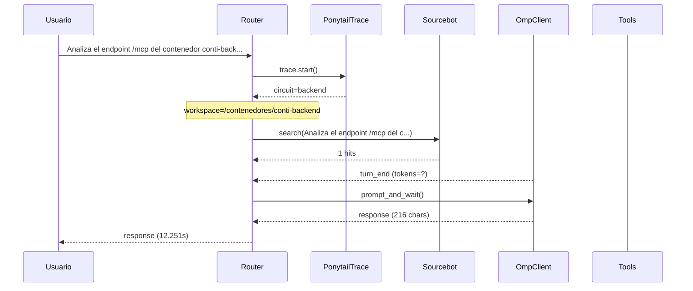

# Traza: Analiza el endpoint /mcp del contenedor conti-backend y documenta todas las tools en un documento mcp_tools_doc.md

- **Circuito**: `backend`
- **Workspace**: `/contenedores/conti-backend`
- **Inicio**: 2026-07-02T22:46:13.730282+00:00
- **Fin**: 2026-07-02T22:46:26.024003+00:00
- **Duración**: 12.294s
- **Eventos**: 6

## Diagrama de Secuencia



## Eventos Detallados

### 1. `start` (2026-07-02T22:46:13.730406+00:00)

```json
{
  "task": "Analiza el endpoint /mcp del contenedor conti-backend y documenta todas las tools en un documento mcp_tools_doc.md",
  "payload_keys": [
    "messages",
    "circuit",
    "_circuit"
  ],
  "circuit": "backend",
  "traces_dir": "/app/logs/ponytail"
}
```

### 2. `circuit_selected` (2026-07-02T22:46:13.744996+00:00)

```json
{
  "id": "backend",
  "workspace": "/contenedores/conti-backend"
}
```

### 3. `sourcebot_search` (2026-07-02T22:46:14.548414+00:00)

```json
{
  "query": "Analiza el endpoint /mcp del contenedor conti-backend y documenta todas las tools en un documento mcp_tools_doc.md",
  "search_query": "conti-backend mcp",
  "matches_requested": 5,
  "hits": 1,
  "results_preview": [
    {
      "repo": "github.com/luisdalmasso/orquestador-contamela",
      "fileName": "docs/ESTADO_REAL.md",
      "language": "Markdown",
      "line": 58,
      "branches": [
        "refs/heads/main"
      ],
      "snippet": "### MCP\n",
      "webUrl": "http://localhost:3010/browse/github.com/luisdalmasso/orquestador-contamela@refs/heads/main/-/blob/docs%2FESTADO_REAL.md"
    }
  ]
}
```

### 4. `omp_turn_end` (2026-07-02T22:46:25.950362+00:00)

```json
{
  "event_type": "turn_end",
  "model": "?",
  "provider": "?"
}
```

### 5. `openhands_invoke` (2026-07-02T22:46:25.981078+00:00)

```json
{
  "circuit": "backend",
  "len": 216
}
```

### 6. `end` (2026-07-02T22:46:25.981123+00:00)

```json
{
  "duration_s": 12.251
}
```

## Prompt Completo (input del usuario)

```text
Analiza el endpoint /mcp del contenedor conti-backend y documenta todas las tools en un documento mcp_tools_doc.md
```
