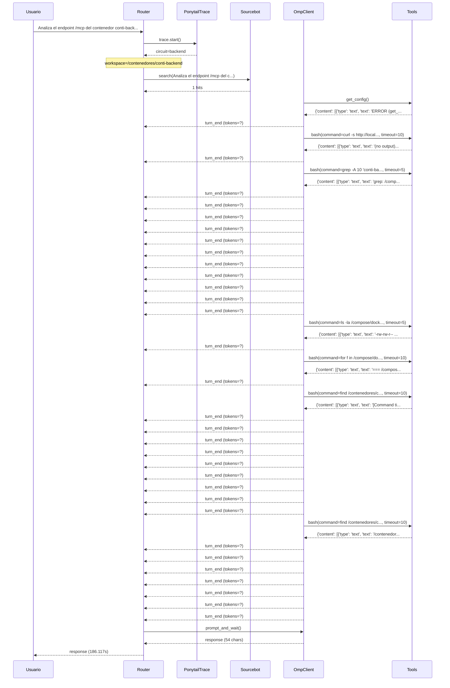

# Traza: Analiza el endpoint /mcp del contenedor conti-backend y documenta todas las tools en un documento mcp_tools_doc.md

- **Circuito**: `backend`
- **Workspace**: `/contenedores/conti-backend`
- **Inicio**: 2026-07-02T22:52:20.936422+00:00
- **Fin**: 2026-07-02T22:55:27.057771+00:00
- **Duración**: 186.121s
- **Eventos**: 50

## Diagrama de Secuencia



## Eventos Detallados

### 1. `start` (2026-07-02T22:52:20.936530+00:00)

```json
{
  "task": "Analiza el endpoint /mcp del contenedor conti-backend y documenta todas las tools en un documento mcp_tools_doc.md",
  "payload_keys": [
    "messages",
    "circuit",
    "_circuit"
  ],
  "circuit": "backend",
  "traces_dir": "/app/logs/ponytail"
}
```

### 2. `circuit_selected` (2026-07-02T22:52:20.938682+00:00)

```json
{
  "id": "backend",
  "workspace": "/contenedores/conti-backend"
}
```

### 3. `sourcebot_search` (2026-07-02T22:52:21.130718+00:00)

```json
{
  "query": "Analiza el endpoint /mcp del contenedor conti-backend y documenta todas las tools en un documento mcp_tools_doc.md",
  "search_query": "conti-backend mcp",
  "matches_requested": 5,
  "hits": 1,
  "results_preview": [
    {
      "repo": "github.com/luisdalmasso/orquestador-contamela",
      "fileName": "docs/ESTADO_REAL.md",
      "language": "Markdown",
      "line": 58,
      "branches": [
        "refs/heads/main"
      ],
      "snippet": "### MCP\n",
      "webUrl": "http://localhost:3010/browse/github.com/luisdalmasso/orquestador-contamela@refs/heads/main/-/blob/docs%2FESTADO_REAL.md"
    }
  ]
}
```

### 4. `omp_tool_start` (2026-07-02T22:52:30.337494+00:00)

```json
{
  "tool": "get_config",
  "args": {},
  "result": null,
  "error": null,
  "ok": true
}
```

### 5. `omp_tool_end` (2026-07-02T22:53:00.423028+00:00)

```json
{
  "tool": "get_config",
  "args": {},
  "result": {
    "content": [
      {
        "type": "text",
        "text": "ERROR (get_config): timeout después de 30.0s"
      }
    ],
    "details": {}
  },
  "error": null,
  "ok": true
}
```

### 6. `omp_turn_end` (2026-07-02T22:53:00.458108+00:00)

```json
{
  "event_type": "turn_end",
  "model": "?",
  "provider": "?"
}
```

### 7. `omp_tool_start` (2026-07-02T22:53:05.654728+00:00)

```json
{
  "tool": "bash",
  "args": {
    "command": "curl -s http://localhost:8000/mcp | head -100",
    "timeout": 10
  },
  "result": null,
  "error": null,
  "ok": true
}
```

### 8. `omp_tool_end` (2026-07-02T22:53:05.980921+00:00)

```json
{
  "tool": "bash",
  "args": {
    "command": "curl -s http://localhost:8000/mcp | head -100",
    "timeout": 10
  },
  "result": {
    "content": [
      {
        "type": "text",
        "text": "(no output)\n\nWall time: 0.31 seconds\n\nCommand exited with code 7"
      }
    ],
    "details": {
      "timeoutSeconds": 10,
      "wallTimeMs": 313.9295409999977,
      "exitCode": 7
    },
    "isError": true
  },
  "error": null,
  "ok": true
}
```

### 9. `omp_turn_end` (2026-07-02T22:53:06.030298+00:00)

```json
{
  "event_type": "turn_end",
  "model": "?",
  "provider": "?"
}
```

### 10. `omp_tool_start` (2026-07-02T22:53:08.981743+00:00)

```json
{
  "tool": "bash",
  "args": {
    "command": "grep -A 10 \"conti-backend:\" /compose/docker-compose.yml | grep -E \"ports|expose\" || echo \"No encontrado en compose, revisando configuración alternativa\"",
    "timeout": 5
  },
  "result": null,
  "error": null,
  "ok": true
}
```

### 11. `omp_tool_end` (2026-07-02T22:53:09.122037+00:00)

```json
{
  "tool": "bash",
  "args": {
    "command": "grep -A 10 \"conti-backend:\" /compose/docker-compose.yml | grep -E \"ports|expose\" || echo \"No encontrado en compose, revisando configuración alternativa\"",
    "timeout": 5
  },
  "result": {
    "content": [
      {
        "type": "text",
        "text": "grep: /compose/docker-compose.yml: No such file or directory (os error 2)\nNo encontrado en compose, revisando configuración alternativa\n\n\nWall time: 0.13 seconds"
      }
    ],
    "details": {
      "timeoutSeconds": 5,
      "wallTimeMs": 125.08351299999777
    }
  },
  "error": null,
  "ok": true
}
```

### 12. `omp_turn_end` (2026-07-02T22:53:09.192347+00:00)

```json
{
  "event_type": "turn_end",
  "model": "?",
  "provider": "?"
}
```

### 13. `omp_turn_end` (2026-07-02T22:53:09.676168+00:00)

```json
{
  "event_type": "turn_end",
  "model": "?",
  "provider": "?"
}
```

### 14. `omp_turn_end` (2026-07-02T22:53:10.600649+00:00)

```json
{
  "event_type": "turn_end",
  "model": "?",
  "provider": "?"
}
```

### 15. `omp_turn_end` (2026-07-02T22:53:11.910142+00:00)

```json
{
  "event_type": "turn_end",
  "model": "?",
  "provider": "?"
}
```

### 16. `omp_turn_end` (2026-07-02T22:53:14.346098+00:00)

```json
{
  "event_type": "turn_end",
  "model": "?",
  "provider": "?"
}
```

### 17. `omp_turn_end` (2026-07-02T22:53:18.614828+00:00)

```json
{
  "event_type": "turn_end",
  "model": "?",
  "provider": "?"
}
```

### 18. `omp_turn_end` (2026-07-02T22:53:26.764745+00:00)

```json
{
  "event_type": "turn_end",
  "model": "?",
  "provider": "?"
}
```

### 19. `omp_turn_end` (2026-07-02T22:53:34.661637+00:00)

```json
{
  "event_type": "turn_end",
  "model": "?",
  "provider": "?"
}
```

### 20. `omp_turn_end` (2026-07-02T22:53:42.165096+00:00)

```json
{
  "event_type": "turn_end",
  "model": "?",
  "provider": "?"
}
```

### 21. `omp_turn_end` (2026-07-02T22:53:48.926163+00:00)

```json
{
  "event_type": "turn_end",
  "model": "?",
  "provider": "?"
}
```

### 22. `omp_turn_end` (2026-07-02T22:53:56.603645+00:00)

```json
{
  "event_type": "turn_end",
  "model": "?",
  "provider": "?"
}
```

### 23. `omp_tool_start` (2026-07-02T22:54:06.346420+00:00)

```json
{
  "tool": "bash",
  "args": {
    "command": "ls -la /compose/docker-compose*.yml 2>/dev/null || ls -la /compose/*.yml 2>/dev/null | head -20",
    "timeout": 5
  },
  "result": null,
  "error": null,
  "ok": true
}
```

### 24. `omp_tool_end` (2026-07-02T22:54:06.431770+00:00)

```json
{
  "tool": "bash",
  "args": {
    "command": "ls -la /compose/docker-compose*.yml 2>/dev/null || ls -la /compose/*.yml 2>/dev/null | head -20",
    "timeout": 5
  },
  "result": {
    "content": [
      {
        "type": "text",
        "text": "-rw-rw-r-- 1 1000 1000   699 Apr  6 20:41 /compose/docker-compose-nano.yml\n-rw-rw-r-- 1 1000 1000  2455 Apr  6 20:41 /compose/docker-compose.conti-fork.yml\n-rw-rw-r-- 1 1000 1000   849 Apr  6 20:41 /compose/docker-compose.conti.yml\n-rw-rw-r-- 1 1000 1000 11929 Apr  6 20:41 /compose/docker-compose160126.yml\n-rw-rw-r-- 1 1000 1000 11472 Apr  6 20:41 /compose/docker-compose_bck.yml\n-rw-rw-r-- 1 1000 1000 17791 Apr  6 20:41 /compose/docker-compose_tiledesk.yml\n\n\nWall time: 0.08 seconds"
      }
    ],
    "details": {
      "timeoutSeconds": 5,
      "wallTimeMs": 75.80614300000889
    }
  },
  "error": null,
  "ok": true
}
```

### 25. `omp_turn_end` (2026-07-02T22:54:06.454625+00:00)

```json
{
  "event_type": "turn_end",
  "model": "?",
  "provider": "?"
}
```

### 26. `omp_tool_start` (2026-07-02T22:54:08.054568+00:00)

```json
{
  "tool": "bash",
  "args": {
    "command": "for f in /compose/docker-compose*.yml; do echo \"=== $f ===\"; grep -A 20 \"conti-backend:\" \"$f\" 2>/dev/null | grep -E \"ports|expose|container_name\" || true; done",
    "timeout": 10
  },
  "result": null,
  "error": null,
  "ok": true
}
```

### 27. `omp_tool_end` (2026-07-02T22:54:08.111932+00:00)

```json
{
  "tool": "bash",
  "args": {
    "command": "for f in /compose/docker-compose*.yml; do echo \"=== $f ===\"; grep -A 20 \"conti-backend:\" \"$f\" 2>/dev/null | grep -E \"ports|expose|container_name\" || true; done",
    "timeout": 10
  },
  "result": {
    "content": [
      {
        "type": "text",
        "text": "=== /compose/docker-compose-nano.yml ===\n=== /compose/docker-compose.conti-fork.yml ===\n=== /compose/docker-compose.conti.yml ===\n=== /compose/docker-compose160126.yml ===\n=== /compose/docker-compose_bck.yml ===\n=== /compose/docker-compose_tiledesk.yml ===\n\n\nWall time: 0.03 seconds"
      }
    ],
    "details": {
      "timeoutSeconds": 10,
      "wallTimeMs": 33.6738320000004
    }
  },
  "error": null,
  "ok": true
}
```

### 28. `omp_turn_end` (2026-07-02T22:54:08.143843+00:00)

```json
{
  "event_type": "turn_end",
  "model": "?",
  "provider": "?"
}
```

### 29. `omp_tool_start` (2026-07-02T22:54:10.535917+00:00)

```json
{
  "tool": "bash",
  "args": {
    "command": "find /contenedores/conti-backend -name \"*.py\" -o -name \"*.json\" -o -name \"*.yml\" -o -name \"*.yaml\" | xargs grep -l \"mcp\\|/mcp\" 2>/dev/null | head -10",
    "timeout": 10
  },
  "result": null,
  "error": null,
  "ok": true
}
```

### 30. `omp_tool_end` (2026-07-02T22:54:20.556850+00:00)

```json
{
  "tool": "bash",
  "args": {
    "command": "find /contenedores/conti-backend -name \"*.py\" -o -name \"*.json\" -o -name \"*.yml\" -o -name \"*.yaml\" | xargs grep -l \"mcp\\|/mcp\" 2>/dev/null | head -10",
    "timeout": 10
  },
  "result": {
    "content": [
      {
        "type": "text",
        "text": "[Command timed out after 10 seconds]\n/contenedores/conti-backend/conti_home/.npm-global/lib/node_modules/@openhands/agent-canvas/build/locales/zh-TW/openhands.json\n/contenedores/conti-backend/conti_home/.npm-global/lib/node_modules/@openhands/agent-canvas/build/locales/es/openhands.json\n/contenedores/conti-backend/conti_home/.npm-global/lib/node_modules/@openhands/agent-canvas/build/locales/ko-KR/openhands.json\n/contenedores/conti-backend/conti_home/.npm-global/lib/node_modules/@openhands/agent-canvas/build/locales/no/openhands.json\n/contenedores/conti-backend/conti_home/.npm-global/lib/node_modules/@openhands/agent-canvas/build/locales/fr/openhands.json\n/contenedores/conti-backend/conti_home/.npm-global/lib/node_modules/@openhands/agent-canvas/build/locales/tr/openhands.json\n/contenedores/conti-backend/conti_home/.npm-global/lib/node_modules/@openhands/agent-canvas/build/locales/ja/openhands.json\n/contenedores/conti-backend/conti_home/.npm-global/lib/node_modules/@openhands/agent-canvas/build/locales/de/openhands.json\n/contenedores/conti-backend/conti_home/.npm-global/lib/node_modules/@openhands/agent-canvas/build/locales/en/openhands.json\n/contenedores/conti-backend/conti_home/.npm-global/lib/node_modules/@openhands/agent-canvas/build/locales/ar/openhands.json\n/contenedores/conti-backend/conti_home/.npm-global/lib/node_modules/@openhands/agent-canvas/build/locales/ca/openhands.json\n/contenedores/conti-backend/conti_home/.npm-global/lib/node_modules/@openhands/agent-canvas/build/locales/it/openhands.json\n/contenedores/conti-backend/conti_home/.npm-global/lib/node_modules/@openhands/agent-canvas/build/locales/zh-CN/openhands.json\n/contenedores/conti-backend/conti_home/.npm-global/lib/node_modules/@openhands/agent-canvas/build/locales/uk/openhands.json\n/contenedores/conti-backend/conti_home/.npm-global/lib/node_modules/@openhands/agent-canvas/build/locales/pt/openhands.json\n/contenedores/conti-backend/conti_home/.npm-global/lib/node_modules/@openhands/agent-canvas/dist/locales/zh-TW/openhands.json\n/contenedores/conti-backend/conti_home/.npm-global/lib/node_modules/@openhands/agent-canvas/dist/locales/es/openhands.json\n/contenedores/conti-backend/conti_home/.npm-global/lib/node_modules/@openhands/agent-canvas/dist/locales/ko-KR/openhands.json\n/contenedores/conti-backend/conti_home/.npm-global/lib/node_modules/@openhands/agent-canvas/dist/locales/no/openhands.json\n/contenedores/conti-backend/conti_home/.npm-global/lib/node_modules/@openhands/agent-canvas/dist/locales/fr/openhands.json\n/contenedores/conti-backend/conti_home/.npm-global/lib/node_modules/@openhands/agent-canvas/dist/locales/tr/openhands.json\n/contenedores/conti-backend/conti_home/.npm-global/lib/node_modules/@openhands/agent-canvas/dist/locales/ja/openhands.json\n/contenedores/conti-backend/conti_home/.npm-global/lib/node_modules/@openhands/agent-canvas/dist/locales/de/openhands.json\n/contenedores/conti-backend/conti_home/.npm-global/lib/node_modules/@openhands/agent-canvas/dist/locales/en/openhands.json\n/contenedores/conti-backend/conti_home/.npm-global/lib/node_modules/@openhands/agent-canvas/dist/locales/ar/openhands.json\n/contenedores/conti-backend/conti_home/.npm-global/lib/node_modules/@openhands/agent-canvas/dist/locales/ca/openhands.json\n/contenedores/conti-backend/conti_home/.npm-global/lib/node_modules/@openhands/agent-canvas/dist/locales/it/openhands.json\n/contenedores/conti-backend/conti_home/.npm-global/lib/node_modules/@openhands/agent-canvas/dist/locales/zh-CN/openhands.json\n/contenedores/conti-backend/conti_home/.npm-global/lib/node_modules/@openhands/agent-canvas/dist/locales/uk/openhands.json\n/contenedores/conti-backend/conti_home/.npm-global/lib/node_modules/@openhands/agent-canvas/dist/locales/pt/openhands.json\n/contenedores/conti-backend/conti_home/.npm-global/lib/node_modules/@openhands/agent-canvas/node_modules/mime-types/node_modules/mime-db/db.json\n/contenedores/conti-backend/conti_home/.npm-global/lib/node_modules/@openhands/agent-canvas/node_modules/@openhands/extensions/skills/github-repo-monitor/scripts/main.py\n/contenedores/conti-backend/conti_home/.npm-global/lib/node_modules/@openhands/agent-canvas/node_modules/@openhands/extensions/skills/github-pr-reviewer/scripts/main.py\n/contenedores/conti-backend/conti_home/.npm-global/lib/node_modules/@openhands/agent-canvas/node_modules/@openhands/extensions/skills/slack-channel-monitor/scripts/main.py\n/contenedores/conti-backend/conti_home/.npm-global/lib/node_modules/@openhands/agent-canvas/node_modules/@openhands/extensions/tests/test_catalogs.py\n/contenedores/conti-backend/conti_home/.npm-global/lib/node_modules/@openhands/agent-canvas/node_modules/@openhands/extensions/integrations/catalog/tavily.json\n/contenedores/conti-backend/conti_home/.npm-global/lib/node_modules/@openhands/agent-canvas/node_modules/@openhands/extensions/integrations/catalog/supabase.json\n/contenedores/conti-backend/conti_home/.npm-global/lib/node_modules/@openhands/agent-canvas/node_modules/@openhands/extensions/integrations/catalog/atlassian.json\n/contenedores/conti-backend/conti_home/.npm-global/lib/node_modules/@openhands/agent-canvas/node_modules/@openhands/extensions/integrations/catalog/neon.json\n/contenedores/conti-backend/conti_home/.npm-global/lib/node_modules/@openhands/agent-canvas/node_modules/@openhands/extensions/integrations/catalog/mongodb.json\n/contenedores/conti-backend/conti_home/.npm-global/lib/node_modules/@openhands/agent-canvas/node_modules/@openhands/extensions/integrations/catalog/linear.json\n/contenedores/conti-backend/conti_home/.npm-global/lib/node_modules/@openhands/agent-canvas/node_modules/@openhands/extensions/integrations/catalog/filesystem.json\n/contenedores/conti-backend/conti_home/.npm-global/lib/node_modules/@openhands/agent-canvas/node_modules/@openhands/extensions/integrations/catalog/github.json\n/contenedores/conti-backend/conti_home/.npm-global/lib/node_modules/@openhands/agent-canvas/node_modules/@openhands/extensions/integrations/catalog/git.json\n/contenedores/conti-backend/conti_home/.npm-global/lib/node_modules/@openhands/agent-canvas/node_modules/@openhands/extensions/integrations/catalog/elevenlabs.json\n/contenedores/conti-backend/conti_home/.npm-global/lib/node_modules/@openhands/agent-canvas/node_modules/@openhands/extensions/integrations/catalog/huggingface.json\n/contenedores/conti-backend/conti_home/.npm-global/lib/node_modules/@openhands/agent-canvas/node_modules/@openhands/extensions/integrations/catalog/browser-mcp.json\n/contenedores/conti-backend/conti_home/.npm-global/lib/node_modules/@openhands/agent-canvas/node_modules/@openhands/extensions/integrations/catalog/paypal.json\n/contenedores/conti-backend/conti_home/.npm-global/lib/node_modules/@openhands/agent-canvas/node_modules/@openhands/extensions/integrations/catalog/redis.json\n/contenedores/conti-backend/conti_home/.npm-global/lib/node_modules/@openhands/agent-canvas/node_modules/@openhands/extensions/integrations/catalog/exa.json\n/contenedores/conti-backend/conti_home/.npm-global/lib/node_modules/@openhands/agent-canvas/node_modules/@openhands/extensions/integrations/catalog/figma.json\n/contenedores/conti-backend/conti_home/.npm-global/lib/node_modules/@openhands/agent-canvas/node_modules/@openhands/extensions/integrations/catalog/obsidian.json\n/contenedores/conti-backend/conti_home/.npm-global/lib/node_modules/@openhands/agent-canvas/node_modules/@openhands/extensions/integrations/catalog/memory.json\n/contenedores/conti-backend/conti_home/.npm-global/lib/node_modules/@openhands/agent-canvas/node_modules/@openhands/extensions/integrations/catalog/everything.json\n/contenedores/conti-backend/conti_home/.npm-global/lib/node_modules/@openhands/agent-canvas/node_modules/@openhands/extensions/integrations/catalog/airtable.json\n/contenedores/conti-backend/conti_home/.npm-global/lib/node_modules/@openhands/agent-canvas/node_modules/@openhands/extensions/integrations/catalog/kagi.json\n/contenedores/conti-backend/conti_home/.npm-global/lib/node_modules/@openhands/agent-canvas/node_modules/@openhands/extensions/integrations/catalog/firecrawl.json\n/contenedores/conti-backend/conti_home/.npm-global/lib/node_modules/@openhands/agent-canvas/node_modules/@openhands/extensions/integrations/catalog/cloudflare-builds.json\n/contenedores/conti-backend/conti_home/.npm-global/lib/node_modules/@openhands/agent-canvas/node_modules/@openhands/extensions/integrations/catalog/time.json\n/contenedores/conti-backend/conti_home/.npm-global/lib/node_modules/@openhands/agent-canvas/node_modules/@openhands/extensions/integrations/catalog/fetch.json\n/contenedores/conti-backend/conti_home/.npm-global/lib/node_modules/@openhands/agent-canvas/node_modules/@openhands/extensions/integrations/catalog/cloudflare-bindings.json\n/contenedores/conti-backend/conti_home/.npm-global/lib/node_modules/@openhands/agent-canvas/node_modules/@openhands/extensions/integrations/catalog/brave-search.json\n/contenedores/conti-backend/conti_home/.npm-global/lib/node_modules/@openhands/agent-canvas/node_modules/@openhands/extensions/integrations/catalog/slack.json\n/contenedores/conti-backend/conti_home/.npm-global/lib/node_modules/@openhands/agent-canvas/node_modules/@openhands/extensions/integrations/catalog/sentry.json\n/contenedores/conti-backend/conti_home/.npm-global/lib/node_modules/@openhands/agent-canvas/node_modules/@openhands/extensions/integrations/catalog/apify.json\n/contenedores/conti-backend/conti_home/.npm-global/lib/node_modules/@openhands/agent-canvas/node_modules/@openhands/extensions/integrations/catalog/stripe.json\n/contenedores/conti-backend/conti_home/.npm-global/lib/node_modules/@openhands/agent-canvas/node_modules/@openhands/extensions/integrations/catalog/notion.json\n/contenedores/conti-backend/conti_home/.npm-global/lib/node_modules/@openhands/agent-canvas/node_modules/@openhands/extensions/integrations/catalog/deepwiki.json\n/contenedores/conti-backend/conti_home/.npm-global/lib/node_modules/@openhands/agent-canvas/node_modules/@openhands/extensions/integrations/catalog/sequential-thinking.json\n/contenedores/conti-backend/conti_home/.npm-global/lib/node_modules/@openhands/agent-canvas/node_modules/@openhands/extensions/integrations/catalog/playwright.json\n/contenedores/conti-backend/conti_home/.npm-global/lib/node_modules/@openhands/agent-canvas/node_modules/@openhands/extensions/integrations/catalog/cloudflare-browser-rendering.json\n/contenedores/conti-backend/conti_home/.npm-global/lib/node_modules/@openhands/agent-canvas/node_modules/@openhands/extensions/integrations/catalog/resend.json\n/contenedores/conti-backend/conti_home/.npm-global/lib/node_modules/@openhands/agent-canvas/node_modules/@openhands/extensions/integrations/catalog/cloudflare-docs.json\n/contenedores/conti-backend/conti_home/.npm-global/lib/node_modules/@openhands/agent-canvas/node_modules/@openhands/extensions/integrations/catalog/clickhouse.json\n/contenedores/conti-backend/conti_home/.npm-global/lib/node_modules/@openhands/agent-canvas/node_modules/@openhands/extensions/integrations/catalog/cloudflare-observability.json\n/contenedores/conti-backend/conti_home/.npm-global/lib/node_modules/@openhands/agent-canvas/node_modules/zod/package.json\n/contenedores/conti-backend/conti_home/.npm-global/lib/node_modules/@openhands/agent-canvas/node_modules/mime-db/db.json\n/contenedores/conti-backend/conti_home/.openhands/settings.json\n/contenedores/conti-backend/conti_home/.openhands/cache/skills/public-skills/skills/github-repo-monitor/scripts/main.py\n/contenedores/conti-backend/conti_home/.openhands/cache/skills/public-skills/skills/github-pr-reviewer/scripts/main.py\n/contenedores/conti-backend/conti_home/.openhands/cache/skills/public-skills/skills/slack-channel-monitor/scripts/main.py\n/contenedores/conti-backend/conti_home/.openhands/cache/skills/public-skills/python/openhands_extensions/integrations.py\n/contenedores/conti-backend/conti_home/.openhands/cache/skills/public-skills/python/openhands_extensions/__init__.py\n/contenedores/conti-backend/conti_home/.openhands/cache/skills/public-skills/tests/test_catalogs.py\n/contenedores/conti-backend/conti_home/.openhands/cache/skills/public-skills/tests/test_integration_catalog_in_sync.py\n/contenedores/conti-backend/conti_home/.openhands/cache/skills/public-skills/integrations/catalog/tavily.json\n/contenedores/conti-backend/conti_home/.openhands/cache/skills/public-skills/integrations/catalog/supabase.json\n/contenedores/conti-backend/conti_home/.openhands/cache/skills/public-skills/integrations/catalog/atlassian.json\n/contenedores/conti-backend/conti_home/.openhands/cache/skills/public-skills/integrations/catalog/neon.json\n/contenedores/conti-backend/conti_home/.openhands/cache/skills/public-skills/integrations/catalog/mongodb.json\n/contenedores/conti-backend/conti_home/.openhands/cache/skills/public-skills/integrations/catalog/linear.json\n/contenedores/conti-backend/conti_home/.openhands/cache/skills/public-skills/integrations/catalog/filesystem.json\n/contenedores/conti-backend/conti_home/.openhands/cache/skills/public-skills/integrations/catalog/github.json\n/contenedores/conti-backend/conti_home/.openhands/cache/skills/public-skills/integrations/catalog/git.json\n/contenedores/conti-backend/conti_home/.openhands/cache/skills/public-skills/integrations/catalog/elevenlabs.json\n/contenedores/conti-backend/conti_home/.openhands/cache/skills/public-skills/integrations/catalog/huggingface.json\n/contenedores/conti-backend/conti_home/.openhands/cache/skills/public-skills/integrations/catalog/datadog.json\n/contenedores/conti-backend/conti_home/.openhands/cache/skills/public-skills/integrations/catalog/browser-mcp.json\n/contenedores/conti-backend/conti_home/.openhands/cache/skills/public-skills/integrations/catalog/paypal.json\n/contenedores/conti-backend/conti_home/.openhands/cache/skills/public-skills/integrations/catalog/redis.json\n/contenedores/conti-backend/conti_home/.openhands/cache/skills/public-skills/integrations/catalog/exa.json\n/contenedores/conti-backend/conti_home/.openhands/cache/skills/public-skills/integrations/catalog/figma.json\n/contenedores/conti-backend/conti_home/.openhands/cache/skills/public-skills/integrations/catalog/obsidian.json\n/contenedores/conti-backend/conti_home/.openhands/cache/skills/public-skills/integrations/catalog/memory.json\n/contenedores/conti-backend/conti_home/.openhands/cache/skills/public-skills/integrations/catalog/everything.json\n/contenedores/conti-backend/conti_home/.openhands/cache/skills/public-skills/integrations/catalog/airtable.json\n/contenedores/conti-backend/conti_home/.openhands/cache/skills/public-skills/integrations/catalog/kagi.json\n/contenedores/conti-backend/conti_home/.openhands/cache/skills/public-skills/integrations/catalog/hubspot.json\n/contenedores/conti-backend/conti_home/.openhands/cache/skills/public-skills/integrations/catalog/firecrawl.json\n/contenedores/conti-backend/conti_home/.openhands/cache/skills/public-skills/integrations/catalog/cloudflare-builds.json\n/contenedores/conti-backend/conti_home/.openhands/cache/skills/public-skills/integrations/catalog/time.json\n/contenedores/conti-backend/conti_home/.openhands/cache/skills/public-skills/integrations/catalog/fetch.json\n/contenedores/conti-backend/conti_home/.openhands/cache/skills/public-skills/integrations/catalog/cloudflare-bindings.json\n/contenedores/conti-backend/conti_home/.openhands/cache/skills/public-skills/integrations/catalog/brave-search.json\n/contenedores/conti-backend/conti_home/.openhands/cache/skills/public-skills/integrations/catalog/slack.json\n/contenedores/conti-backend/conti_home/.openhands/cache/skills/public-skills/integrations/catalog/ordinal.json\n/contenedores/conti-backend/conti_home/.openhands/cache/skills/public-skills/integrations/catalog/sentry.json\n/contenedores/conti-backend/conti_home/.openhands/cache/skills/public-skills/integrations/catalog/apify.json\n/contenedores/conti-backend/conti_home/.openhands/cache/skills/public-skills/integrations/catalog/stripe.json\n/contenedores/conti-backend/conti_home/.openhands/cache/skills/public-skills/integrations/catalog/notion.json\n/contenedores/conti-backend/conti_home/.openhands/cache/skills/public-skills/integrations/catalog/deepwiki.json\n/contenedores/conti-backend/conti_home/.openhands/cache/skills/public-skills/integrations/catalog/sequential-thinking.json\n/contenedores/conti-backend/conti_home/.openhands/cache/skills/public-skills/integrations/catalog/playwright.json\n/contenedores/conti-backend/conti_home/.openhands/cache/skills/public-skills/integrations/catalog/webflow.json\n/contenedores/conti-backend/conti_home/.openhands/cache/skills/public-skills/integrations/catalog/cloudflare-browser-rendering.json\n/contenedores/conti-backend/conti_home/.openhands/cache/skills/public-skills/integrations/catalog/resend.json\n/contenedores/conti-backend/conti_home/.openhands/cache/skills/public-skills/integrations/catalog/cloudflare-docs.json\n/contenedores/conti-backend/conti_home/.openhands/cache/skills/public-skills/integrations/catalog/clickhouse.json\n/contenedores/conti-backend/conti_home/.openhands/cache/skills/public-skills/integrations/catalog/cloudflare-observability.json\n/contenedores/conti-backend/conti_home/.cache/uv/archive-v0/pLOzDXmBwHoS-VlcUhctd/acp/client/connection.py\n/contenedores/conti-backend/conti_home/.cache/uv/archive-v0/pLOzDXmBwHoS-VlcUhctd/acp/interfaces.py\n/contenedores/conti-backend/conti_home/.cache/uv/archive-v0/pLOzDXmBwHoS-VlcUhctd/acp/schema.py\n/contenedores/conti-backend/conti_home/.cache/uv/archive-v0/9XxlcSsHJg4Xgtk8kFi9C/openhands/automation/presets/plugin/sdk_main.py\n/contenedores/conti-backend/conti_home/.cache/uv/archive-v0/9XxlcSsHJg4Xgtk8kFi9C/openhands/automation/presets/prompt/sdk_main.py\n/contenedores/conti-backend/conti_home/.cache/uv/archive-v0/VWJFdIse4rrjODNA7fLi6/openhands/agent_server/api.py\n/contenedores/conti-backend/conti_home/.cache/uv/archive-v0/VWJFdIse4rrjODNA7fLi6/openhands/agent_server/settings_router.py\n/contenedores/conti-backend/conti_home/.cache/uv/archive-v0/VWJFdIse4rrjODNA7fLi6/openhands/agent_server/mcp_router.py\n/contenedores/conti-backend/conti_home/.cache/uv/archive-v0/IgXV7DMbbSVjzgXhx963q/beartype/_conf/decorplace/confplaceenum.py\n/contenedores/conti-backend/conti_home/.cache/uv/archive-v0/IgXV7DMbbSVjzgXhx963q/beartype/claw/_ast/_kind/clawastimport.py\n/contenedores/conti-backend/conti_home/.cache/uv/archive-v0/IgXV7DMbbSVjzgXhx963q/beartype/_data/conf/dataconfblack.py\n/contenedores/conti-backend/conti_home/.cache/uv/archive-v0/IgXV7DMbbSVjzgXhx963q/beartype/_data/conf/dataconfplace.py\n/contenedores/conti-backend/conti_home/.cache/uv/archive-v0/D-5gMFRPjekPV6Zr3IQbK/posthog/ai/openai_agents/processor.py\n/contenedores/conti-backend/conti_home/.cache/uv/archive-v0/wYHoU8TzUPH_p5X28N3EX/googleapiclient/discovery_cache/documents/serviceusage.v1.json\n/contenedores/conti-backend/conti_home/.cache/uv/archive-v0/wYHoU8TzUPH_p5X28N3EX/googleapiclient/discovery_cache/documents/aiplatform.v1beta1.json\n/contenedores/conti-backend/conti_home/.cache/uv/archive-v0/wYHoU8TzUPH_p5X28N3EX/googleapiclient/discovery_cache/documents/networksecurity.v1beta1.json\n/contenedores/conti-backend/conti_home/.cache/uv/archive-v0/wYHoU8TzUPH_p5X28N3EX/googleapiclient/discovery_cache/documents/serviceusage.v1beta1.json\n/contenedores/conti-backend/conti_home/.cache/uv/archive-v0/wYHoU8TzUPH_p5X28N3EX/googleapiclient/discovery_cache/documents/networksecurity.v1.json\n/contenedores/conti-backend/conti_home/.cache/uv/archive-v0/wYHoU8TzUPH_p5X28N3EX/googleapiclient/discovery_cache/documents/agentregistry.v1alpha.json\n/contenedores/conti-backend/conti_home/.cache/uv/archive-v0/wYHoU8TzUPH_p5X28N3EX/googleapiclient/discovery_cache/documents/discoveryengine.v1.json\n/contenedores/conti-backend/conti_home/.cache/uv/archive-v0/wYHoU8TzUPH_p5X28N3EX/googleapiclient/discovery_cache/documents/ces.v1.json\n/contenedores/conti-backend/conti_home/.cache/uv/archive-v0/wYHoU8TzUPH_p5X28N3EX/googleapiclient/discovery_cache/documents/apigee.v1.json\n/contenedores/conti-backend/conti_home/.cache/uv/archive-v0/wYHoU8TzUPH_p5X28N3EX/googleapiclient/discovery_cache/documents/ces.v1beta.json\n/contenedores/conti-backend/conti_home/.cache/uv/archive-v0/wYHoU8TzUPH_p5X28N3EX/googleapiclient/discovery_cache/documents/apihub.v1.json\n/contenedores/conti-backend/conti_home/.cache/uv/archive-v0/wYHoU8TzUPH_p5X28N3EX/googleapiclient/discovery_cache/documents/discoveryengine.v1alpha.json\n/contenedores/conti-backend/conti_home/.cache/uv/archive-v0/IkRZ_t8\n[…2240ln elided…]\nmUvuX/lib/python3.12/site-packages/litellm/litellm_core_utils/litellm_logging.py\n/contenedores/conti-backend/conti_home/.cache/uv/archive-v0/yHJjZdrGzWnCnQWdmUvuX/lib/python3.12/site-packages/litellm/types/agents.py\n/contenedores/conti-backend/conti_home/.cache/uv/archive-v0/yHJjZdrGzWnCnQWdmUvuX/lib/python3.12/site-packages/litellm/types/proxy/management_endpoints/common_daily_activity.py\n/contenedores/conti-backend/conti_home/.cache/uv/archive-v0/yHJjZdrGzWnCnQWdmUvuX/lib/python3.12/site-packages/litellm/types/proxy/management_endpoints/team_endpoints.py\n/contenedores/conti-backend/conti_home/.cache/uv/archive-v0/yHJjZdrGzWnCnQWdmUvuX/lib/python3.12/site-packages/litellm/types/utils.py\n/contenedores/conti-backend/conti_home/.cache/uv/archive-v0/yHJjZdrGzWnCnQWdmUvuX/lib/python3.12/site-packages/litellm/types/interactions/generated.py\n/contenedores/conti-backend/conti_home/.cache/uv/archive-v0/yHJjZdrGzWnCnQWdmUvuX/lib/python3.12/site-packages/litellm/types/access_group.py\n/contenedores/conti-backend/conti_home/.cache/uv/archive-v0/yHJjZdrGzWnCnQWdmUvuX/lib/python3.12/site-packages/litellm/types/llms/openai.py\n/contenedores/conti-backend/conti_home/.cache/uv/archive-v0/yHJjZdrGzWnCnQWdmUvuX/lib/python3.12/site-packages/litellm/types/llms/anthropic.py\n/contenedores/conti-backend/conti_home/.cache/uv/archive-v0/yHJjZdrGzWnCnQWdmUvuX/lib/python3.12/site-packages/litellm/types/llms/custom_http.py\n/contenedores/conti-backend/conti_home/.cache/uv/archive-v0/yHJjZdrGzWnCnQWdmUvuX/lib/python3.12/site-packages/litellm/types/mcp_server/mcp_server_manager.py\n/contenedores/conti-backend/conti_home/.cache/uv/archive-v0/yHJjZdrGzWnCnQWdmUvuX/lib/python3.12/site-packages/litellm/types/mcp.py\n/contenedores/conti-backend/conti_home/.cache/uv/archive-v0/yHJjZdrGzWnCnQWdmUvuX/lib/python3.12/site-packages/litellm/types/guardrails.py\n/contenedores/conti-backend/conti_home/.cache/uv/archive-v0/yHJjZdrGzWnCnQWdmUvuX/lib/python3.12/site-packages/litellm/compression/compress.py\n/contenedores/conti-backend/conti_home/.cache/uv/archive-v0/yHJjZdrGzWnCnQWdmUvuX/lib/python3.12/site-packages/litellm/main.py\n/contenedores/conti-backend/conti_home/.cache/uv/archive-v0/yHJjZdrGzWnCnQWdmUvuX/lib/python3.12/site-packages/litellm/responses/mcp/chat_completions_handler.py\n/contenedores/conti-backend/conti_home/.cache/uv/archive-v0/yHJjZdrGzWnCnQWdmUvuX/lib/python3.12/site-packages/litellm/responses/mcp/litellm_proxy_mcp_handler.py\n/contenedores/conti-backend/conti_home/.cache/uv/archive-v0/yHJjZdrGzWnCnQWdmUvuX/lib/python3.12/site-packages/litellm/responses/mcp/mcp_streaming_iterator.py\n/contenedores/conti-backend/conti_home/.cache/uv/archive-v0/yHJjZdrGzWnCnQWdmUvuX/lib/python3.12/site-packages/litellm/responses/utils.py\n/contenedores/conti-backend/conti_home/.cache/uv/archive-v0/yHJjZdrGzWnCnQWdmUvuX/lib/python3.12/site-packages/litellm/responses/main.py\n/contenedores/conti-backend/conti_home/.cache/uv/archive-v0/yHJjZdrGzWnCnQWdmUvuX/lib/python3.12/site-packages/litellm/responses/litellm_completion_transformation/transformation.py\n/contenedores/conti-backend/conti_home/.cache/uv/archive-v0/yHJjZdrGzWnCnQWdmUvuX/lib/python3.12/site-packages/litellm/experimental_mcp_client/client.py\n/contenedores/conti-backend/conti_home/.cache/uv/archive-v0/yHJjZdrGzWnCnQWdmUvuX/lib/python3.12/site-packages/litellm/experimental_mcp_client/__init__.py\n/contenedores/conti-backend/conti_home/.cache/uv/archive-v0/yHJjZdrGzWnCnQWdmUvuX/lib/python3.12/site-packages/litellm/experimental_mcp_client/tools.py\n/contenedores/conti-backend/conti_home/.cache/uv/archive-v0/yHJjZdrGzWnCnQWdmUvuX/lib/python3.12/site-packages/litellm/llms/databricks/chat/transformation.py\n/contenedores/conti-backend/conti_home/.cache/uv/archive-v0/yHJjZdrGzWnCnQWdmUvuX/lib/python3.12/site-packages/litellm/llms/anthropic/common_utils.py\n/contenedores/conti-backend/conti_home/.cache/uv/archive-v0/yHJjZdrGzWnCnQWdmUvuX/lib/python3.12/site-packages/litellm/llms/anthropic/chat/transformation.py\n/contenedores/conti-backend/conti_home/.cache/uv/archive-v0/yHJjZdrGzWnCnQWdmUvuX/lib/python3.12/site-packages/litellm/llms/anthropic/chat/guardrail_translation/handler.py\n/contenedores/conti-backend/conti_home/.cache/uv/archive-v0/yHJjZdrGzWnCnQWdmUvuX/lib/python3.12/site-packages/litellm/llms/azure_ai/anthropic/transformation.py\n/contenedores/conti-backend/conti_home/.cache/uv/archive-v0/yHJjZdrGzWnCnQWdmUvuX/lib/python3.12/site-packages/litellm/llms/__init__.py\n/contenedores/conti-backend/conti_home/.cache/uv/archive-v0/yHJjZdrGzWnCnQWdmUvuX/lib/python3.12/site-packages/litellm/llms/vertex_ai/vertex_ai_partner_models/anthropic/transformation.py\n/contenedores/conti-backend/conti_home/.cache/uv/archive-v0/yHJjZdrGzWnCnQWdmUvuX/lib/python3.12/site-packages/litellm/llms/bedrock/claude_platform/transformation.py\n/contenedores/conti-backend/conti_home/.cache/uv/archive-v0/yHJjZdrGzWnCnQWdmUvuX/lib/python3.12/site-packages/litellm/llms/bedrock/messages/invoke_transformations/anthropic_claude3_transformation.py\n/contenedores/conti-backend/conti_home/.cache/uv/archive-v0/yHJjZdrGzWnCnQWdmUvuX/lib/python3.12/site-packages/litellm/llms/bedrock/chat/invoke_transformations/anthropic_claude3_transformation.py\n/contenedores/conti-backend/conti_home/.cache/uv/archive-v0/yHJjZdrGzWnCnQWdmUvuX/lib/python3.12/site-packages/litellm/llms/openai/responses/guardrail_translation/handler.py\n/contenedores/conti-backend/conti_home/.cache/uv/archive-v0/yHJjZdrGzWnCnQWdmUvuX/lib/python3.12/site-packages/litellm/anthropic_beta_headers_config.json\n/contenedores/conti-backend/conti_home/.cache/uv/archive-v0/yHJjZdrGzWnCnQWdmUvuX/lib/python3.12/site-packages/litellm/cost_calculator.py\n/contenedores/conti-backend/conti_home/.cache/uv/archive-v0/yHJjZdrGzWnCnQWdmUvuX/lib/python3.12/site-packages/litellm/constants.py\n/contenedores/conti-backend/conti_home/.cache/uv/archive-v0/yHJjZdrGzWnCnQWdmUvuX/lib/python3.12/site-packages/litellm/provider_endpoints_support_backup.json\n/contenedores/conti-backend/conti_home/.cache/uv/archive-v0/yHJjZdrGzWnCnQWdmUvuX/lib/python3.12/site-packages/litellm/__init__.py\n/contenedores/conti-backend/conti_home/.cache/uv/archive-v0/yHJjZdrGzWnCnQWdmUvuX/lib/python3.12/site-packages/litellm/policy_templates_backup.json\n/contenedores/conti-backend/conti_home/.cache/uv/archive-v0/yHJjZdrGzWnCnQWdmUvuX/lib/python3.12/site-packages/litellm/integrations/opentelemetry.py\n/contenedores/conti-backend/conti_home/.cache/uv/archive-v0/yHJjZdrGzWnCnQWdmUvuX/lib/python3.12/site-packages/litellm/integrations/azure_sentinel/example_standard_logging_payload.json\n/contenedores/conti-backend/conti_home/.cache/uv/archive-v0/yHJjZdrGzWnCnQWdmUvuX/lib/python3.12/site-packages/litellm/integrations/custom_logger.py\n/contenedores/conti-backend/conti_home/.cache/uv/archive-v0/yHJjZdrGzWnCnQWdmUvuX/lib/python3.12/site-packages/litellm/integrations/otel/model/spans.py\n/contenedores/conti-backend/conti_home/.cache/uv/archive-v0/yHJjZdrGzWnCnQWdmUvuX/lib/python3.12/site-packages/litellm/integrations/otel/model/semconv.py\n/contenedores/conti-backend/conti_home/.cache/uv/archive-v0/yHJjZdrGzWnCnQWdmUvuX/lib/python3.12/site-packages/litellm/integrations/otel/model/payloads.py\n/contenedores/conti-backend/conti_home/.cache/uv/archive-v0/yHJjZdrGzWnCnQWdmUvuX/lib/python3.12/site-packages/litellm/integrations/otel/__init__.py\n/contenedores/conti-backend/conti_home/.cache/uv/archive-v0/yHJjZdrGzWnCnQWdmUvuX/lib/python3.12/site-packages/litellm/integrations/otel/logger.py\n/contenedores/conti-backend/conti_home/.cache/uv/archive-v0/yHJjZdrGzWnCnQWdmUvuX/lib/python3.12/site-packages/litellm/integrations/otel/emitter.py\n/contenedores/conti-backend/conti_home/.cache/uv/archive-v0/yHJjZdrGzWnCnQWdmUvuX/lib/python3.12/site-packages/litellm/integrations/datadog/datadog_llm_obs.py\n/contenedores/conti-backend/conti_home/.cache/uv/archive-v0/yHJjZdrGzWnCnQWdmUvuX/lib/python3.12/site-packages/litellm/integrations/arize/_utils.py\n/contenedores/conti-backend/conti_home/.cache/uv/archive-v0/yHJjZdrGzWnCnQWdmUvuX/lib/python3.12/site-packages/openhands/sdk/skills/utils.py\n/contenedores/conti-backend/conti_home/.cache/uv/archive-v0/yHJjZdrGzWnCnQWdmUvuX/lib/python3.12/site-packages/openhands/sdk/skills/skill.py\n/contenedores/conti-backend/conti_home/.cache/uv/archive-v0/yHJjZdrGzWnCnQWdmUvuX/lib/python3.12/site-packages/openhands/sdk/tool/schema.py\n/contenedores/conti-backend/conti_home/.cache/uv/archive-v0/yHJjZdrGzWnCnQWdmUvuX/lib/python3.12/site-packages/openhands/sdk/tool/tool.py\n/contenedores/conti-backend/conti_home/.cache/uv/archive-v0/yHJjZdrGzWnCnQWdmUvuX/lib/python3.12/site-packages/openhands/sdk/tool/client_tool.py\n/contenedores/conti-backend/conti_home/.cache/uv/archive-v0/yHJjZdrGzWnCnQWdmUvuX/lib/python3.12/site-packages/openhands/sdk/agent/acp_agent.py\n/contenedores/conti-backend/conti_home/.cache/uv/archive-v0/yHJjZdrGzWnCnQWdmUvuX/lib/python3.12/site-packages/openhands/sdk/agent/base.py\n/contenedores/conti-backend/conti_home/.cache/uv/archive-v0/yHJjZdrGzWnCnQWdmUvuX/lib/python3.12/site-packages/openhands/sdk/agent/agent.py\n/contenedores/conti-backend/conti_home/.cache/uv/archive-v0/yHJjZdrGzWnCnQWdmUvuX/lib/python3.12/site-packages/openhands/sdk/mcp/utils.py\n/contenedores/conti-backend/conti_home/.cache/uv/archive-v0/yHJjZdrGzWnCnQWdmUvuX/lib/python3.12/site-packages/openhands/sdk/mcp/tool.py\n/contenedores/conti-backend/conti_home/.cache/uv/archive-v0/yHJjZdrGzWnCnQWdmUvuX/lib/python3.12/site-packages/openhands/sdk/mcp/client.py\n/contenedores/conti-backend/conti_home/.cache/uv/archive-v0/yHJjZdrGzWnCnQWdmUvuX/lib/python3.12/site-packages/openhands/sdk/mcp/__init__.py\n/contenedores/conti-backend/conti_home/.cache/uv/archive-v0/yHJjZdrGzWnCnQWdmUvuX/lib/python3.12/site-packages/openhands/sdk/mcp/definition.py\n/contenedores/conti-backend/conti_home/.cache/uv/archive-v0/yHJjZdrGzWnCnQWdmUvuX/lib/python3.12/site-packages/openhands/sdk/conversation/impl/local_conversation.py\n/contenedores/conti-backend/conti_home/.cache/uv/archive-v0/yHJjZdrGzWnCnQWdmUvuX/lib/python3.12/site-packages/openhands/sdk/conversation/secret_registry.py\n/contenedores/conti-backend/conti_home/.cache/uv/archive-v0/yHJjZdrGzWnCnQWdmUvuX/lib/python3.12/site-packages/openhands/sdk/conversation/resource_lock_manager.py\n/contenedores/conti-backend/conti_home/.cache/uv/archive-v0/yHJjZdrGzWnCnQWdmUvuX/lib/python3.12/site-packages/openhands/sdk/marketplace/types.py\n/contenedores/conti-backend/conti_home/.cache/uv/archive-v0/yHJjZdrGzWnCnQWdmUvuX/lib/python3.12/site-packages/openhands/sdk/subagent/schema.py\n/contenedores/conti-backend/conti_home/.cache/uv/archive-v0/yHJjZdrGzWnCnQWdmUvuX/lib/python3.12/site-packages/openhands/sdk/subagent/registry.py\n/contenedores/conti-backend/conti_home/.cache/uv/archive-v0/yHJjZdrGzWnCnQWdmUvuX/lib/python3.12/site-packages/openhands/sdk/plugin/loader.py\n/contenedores/conti-backend/conti_home/.cache/uv/archive-v0/yHJjZdrGzWnCnQWdmUvuX/lib/python3.12/site-packages/openhands/sdk/plugin/plugin.py\n/contenedores/conti-backend/conti_home/.cache/uv/archive-v0/yHJjZdrGzWnCnQWdmUvuX/lib/python3.12/site-packages/openhands/sdk/plugin/types.py\n/contenedores/conti-backend/conti_home/.cache/uv/archive-v0/yHJjZdrGzWnCnQWdmUvuX/lib/python3.12/site-packages/openhands/sdk/workspace/remote/base.py\n/contenedores/conti-backend/conti_home/.cache/uv/archive-v0/yHJjZdrGzWnCnQWdmUvuX/lib/python3.12/site-packages/openhands/sdk/llm/message.py\n/contenedores/conti-backend/conti_home/.cache/uv/archive-v0/yHJjZdrGzWnCnQWdmUvuX/lib/python3.12/site-packages/openhands/sdk/__init__.py\n/contenedores/conti-backend/conti_home/.cache/uv/archive-v0/yHJjZdrGzWnCnQWdmUvuX/lib/python3.12/site-packages/openhands/sdk/event/llm_convertible/system.py\n/contenedores/conti-backend/conti_home/.cache/uv/archive-v0/yHJjZdrGzWnCnQWdmUvuX/lib/python3.12/site-packages/openhands/sdk/settings/model.py\n/contenedores/conti-backend/conti_home/.cache/uv/archive-v0/yHJjZdrGzWnCnQWdmUvuX/lib/python3.12/site-packages/openhands/agent_server/api.py\n/contenedores/conti-backend/conti_home/.cache/uv/archive-v0/yHJjZdrGzWnCnQWdmUvuX/lib/python3.12/site-packages/openhands/agent_server/settings_router.py\n/contenedores/conti-backend/conti_home/.cache/uv/archive-v0/yHJjZdrGzWnCnQWdmUvuX/lib/python3.12/site-packages/openhands/agent_server/conversation_router.py\n/contenedores/conti-backend/conti_home/.cache/uv/archive-v0/yHJjZdrGzWnCnQWdmUvuX/lib/python3.12/site-packages/openhands/agent_server/persistence/models.py\n/contenedores/conti-backend/conti_home/.cache/uv/archive-v0/yHJjZdrGzWnCnQWdmUvuX/lib/python3.12/site-packages/openhands/agent_server/mcp_router.py\n/contenedores/conti-backend/conti_home/.cache/uv/archive-v0/yHJjZdrGzWnCnQWdmUvuX/lib/python3.12/site-packages/openhands/agent_server/conversation_service.py\n/contenedores/conti-backend/conti_home/.cache/uv/archive-v0/yHJjZdrGzWnCnQWdmUvuX/lib/python3.12/site-packages/openhands/agent_server/agent_profiles_router.py\n/contenedores/conti-backend/conti_home/.cache/uv/archive-v0/yHJjZdrGzWnCnQWdmUvuX/lib/python3.12/site-packages/openhands/workspace/cloud/workspace.py\n/contenedores/conti-backend/conti_home/.cache/uv/archive-v0/yHJjZdrGzWnCnQWdmUvuX/lib/python3.12/site-packages/openhands/automation/presets/plugin/sdk_main.py\n/contenedores/conti-backend/conti_home/.cache/uv/archive-v0/yHJjZdrGzWnCnQWdmUvuX/lib/python3.12/site-packages/openhands/automation/presets/prompt/sdk_main.py\n/contenedores/conti-backend/conti_home/.cache/uv/archive-v0/yHJjZdrGzWnCnQWdmUvuX/lib/python3.12/site-packages/acp/client/connection.py\n/contenedores/conti-backend/conti_home/.cache/uv/archive-v0/yHJjZdrGzWnCnQWdmUvuX/lib/python3.12/site-packages/acp/interfaces.py\n/contenedores/conti-backend/conti_home/.cache/uv/archive-v0/yHJjZdrGzWnCnQWdmUvuX/lib/python3.12/site-packages/acp/schema.py\n/contenedores/conti-backend/conti_home/.cache/uv/archive-v0/yHJjZdrGzWnCnQWdmUvuX/lib/python3.12/site-packages/opentelemetry/semconv_ai/__init__.py\n/contenedores/conti-backend/conti_home/.cache/uv/archive-v0/yHJjZdrGzWnCnQWdmUvuX/lib/python3.12/site-packages/openai/resources/responses/responses.py\n/contenedores/conti-backend/conti_home/.cache/uv/archive-v0/yHJjZdrGzWnCnQWdmUvuX/lib/python3.12/site-packages/openai/resources/admin/organization/projects/hosted_tool_permissions.py\n/contenedores/conti-backend/conti_home/.cache/uv/archive-v0/yHJjZdrGzWnCnQWdmUvuX/lib/python3.12/site-packages/openai/types/conversations/conversation_item.py\n/contenedores/conti-backend/conti_home/.cache/uv/archive-v0/yHJjZdrGzWnCnQWdmUvuX/lib/python3.12/site-packages/openai/types/responses/responses_client_event_param.py\n/contenedores/conti-backend/conti_home/.cache/uv/archive-v0/yHJjZdrGzWnCnQWdmUvuX/lib/python3.12/site-packages/openai/types/responses/tool_choice_mcp.py\n/contenedores/conti-backend/conti_home/.cache/uv/archive-v0/yHJjZdrGzWnCnQWdmUvuX/lib/python3.12/site-packages/openai/types/responses/response_mcp_list_tools_in_progress_event.py\n/contenedores/conti-backend/conti_home/.cache/uv/archive-v0/yHJjZdrGzWnCnQWdmUvuX/lib/python3.12/site-packages/openai/types/responses/tool_param.py\n/contenedores/conti-backend/conti_home/.cache/uv/archive-v0/yHJjZdrGzWnCnQWdmUvuX/lib/python3.12/site-packages/openai/types/responses/responses_server_event.py\n/contenedores/conti-backend/conti_home/.cache/uv/archive-v0/yHJjZdrGzWnCnQWdmUvuX/lib/python3.12/site-packages/openai/types/responses/tool_choice_allowed.py\n/contenedores/conti-backend/conti_home/.cache/uv/archive-v0/yHJjZdrGzWnCnQWdmUvuX/lib/python3.12/site-packages/openai/types/responses/response_stream_event.py\n/contenedores/conti-backend/conti_home/.cache/uv/archive-v0/yHJjZdrGzWnCnQWdmUvuX/lib/python3.12/site-packages/openai/types/responses/response_mcp_list_tools_failed_event.py\n/contenedores/conti-backend/conti_home/.cache/uv/archive-v0/yHJjZdrGzWnCnQWdmUvuX/lib/python3.12/site-packages/openai/types/responses/response_output_item.py\n/contenedores/conti-backend/conti_home/.cache/uv/archive-v0/yHJjZdrGzWnCnQWdmUvuX/lib/python3.12/site-packages/openai/types/responses/tool.py\n/contenedores/conti-backend/conti_home/.cache/uv/archive-v0/yHJjZdrGzWnCnQWdmUvuX/lib/python3.12/site-packages/openai/types/responses/tool_choice_allowed_param.py\n/contenedores/conti-backend/conti_home/.cache/uv/archive-v0/yHJjZdrGzWnCnQWdmUvuX/lib/python3.12/site-packages/openai/types/responses/response.py\n/contenedores/conti-backend/conti_home/.cache/uv/archive-v0/yHJjZdrGzWnCnQWdmUvuX/lib/python3.12/site-packages/openai/types/responses/response_mcp_call_completed_event.py\n/contenedores/conti-backend/conti_home/.cache/uv/archive-v0/yHJjZdrGzWnCnQWdmUvuX/lib/python3.12/site-packages/openai/types/responses/response_create_params.py\n/contenedores/conti-backend/conti_home/.cache/uv/archive-v0/yHJjZdrGzWnCnQWdmUvuX/lib/python3.12/site-packages/openai/types/responses/response_mcp_list_tools_completed_event.py\n/contenedores/conti-backend/conti_home/.cache/uv/archive-v0/yHJjZdrGzWnCnQWdmUvuX/lib/python3.12/site-packages/openai/types/responses/response_input_item.py\n/contenedores/conti-backend/conti_home/.cache/uv/archive-v0/yHJjZdrGzWnCnQWdmUvuX/lib/python3.12/site-packages/openai/types/responses/__init__.py\n/contenedores/conti-backend/conti_home/.cache/uv/archive-v0/yHJjZdrGzWnCnQWdmUvuX/lib/python3.12/site-packages/openai/types/responses/response_input_item_param.py\n/contenedores/conti-backend/conti_home/.cache/uv/archive-v0/yHJjZdrGzWnCnQWdmUvuX/lib/python3.12/site-packages/openai/types/responses/tool_choice_mcp_param.py\n/contenedores/conti-backend/conti_home/.cache/uv/archive-v0/yHJjZdrGzWnCnQWdmUvuX/lib/python3.12/site-packages/openai/types/responses/response_item.py\n/contenedores/conti-backend/conti_home/.cache/uv/archive-v0/yHJjZdrGzWnCnQWdmUvuX/lib/python3.12/site-packages/openai/types/responses/responses_client_event.py\n/contenedores/conti-backend/conti_home/.cache/uv/archive-v0/yHJjZdrGzWnCnQWdmUvuX/lib/python3.12/site-packages/openai/types/responses/response_mcp_call_failed_event.py\n/contenedores/conti-backend/conti_home/.cache/uv/archive-v0/yHJjZdrGzWnCnQWdmUvuX/lib/python3.12/site-packages/openai/types/responses/input_token_count_params.py\n/contenedores/conti-backend/conti_home/.cache/uv/archive-v0/yHJjZdrGzWnCnQWdmUvuX/lib/python3.12/site-packages/openai/types/responses/response_mcp_call_arguments_done_event.py\n/contenedores/conti-backend/conti_home/.cache/uv/archive-v0/yHJjZdrGzWnCnQWdmUvuX/lib/python3.12/site-packages/openai/types/responses/response_mcp_call_in_progress_event.py\n/contenedores/conti-backend/conti_home/.cache/uv/archive-v0/yHJjZdrGzWnCnQWdmUvuX/lib/python3.12/site-packages/openai/types/responses/response_mcp_call_arguments_delta_event.py\n/contenedores/conti-backend/conti_home/.cache/uv/archive-v0/yHJjZdrGzWnCnQWdmUvuX/lib/python3.12/site-packages/openai/types/responses/response_input_param.py\n/contenedores/conti-backend/conti_home/.cache/uv/archive-v0/yHJjZdrGzWnCnQWdmUvuX/lib/python3.12/site-packages/openai/types/admin/organization/projects/hosted_tool_permission_update_params.py\n/contenedores/conti-backend/conti_home/.cache/uv/archive-v0/yHJjZdrGzWnCnQWdmUvuX/lib/python3.12/site-packages/openai/types/admin/organization/projects/project_hosted_tool_permissions.py\n/contenedores/conti-backend/conti_home/.cache/uv/archive-v0/yHJjZdrGzWnCnQWdmUvuX/lib/python3.12/site-packages/openai/types/realtime/realtime_tools_config_param.py\n/contenedores/conti-backend/conti_home/.cache/uv/archive-v0/yHJjZdrGzWnCnQWdmUvuX/lib/python3.12/site-packages/openai/types/realtime/realtime_response_create_mcp_tool_param.py\n/contenedores/conti-backend/conti_home/.cache/uv/archive-v0/yHJjZdrGzWnCnQWdmUvuX/lib/python3.12/site-packages/openai/types/realtime/realtime_tools_config_union.py\n/contenedores/conti-backend/conti_home/.cache/uv/archive-v0/yHJjZdrGzWnCnQWdmUvuX/lib/python3.12/site-packages/openai/types/realtime/response_mcp_call_completed.py\n/contenedores/conti-backend/conti_home/.cache/uv/archive-v0/yHJjZdrGzWnCnQWdmUvuX/lib/python3.12/site-packages/openai/types/realtime/realtime_mcp_approval_request.py\n/contenedores/conti-backend/conti_home/.cache/uv/archive-v0/yHJjZdrGzWnCnQWdmUvuX/lib/python3.12/site-packages/openai/types/realtime/realtime_mcp_list_tools_param.py\n/contenedores/conti-backend/conti_home/.cache/uv/archive-v0/yHJjZdrGzWnCnQWdmUvuX/lib/python3.12/site-packages/openai/types/realtime/response_mcp_call_arguments_delta.py\n/contenedores/conti-backend/conti_home/.cache/uv/archive-v0/yHJjZdrGzWnCnQWdmUvuX/lib/python3.12/site-packages/openai/types/realtime/mcp_list_tools_failed.py\n/contenedores/conti-backend/conti_home/.cache/uv/archive-v0/yHJjZdrGzWnCnQWdmUvuX/lib/python3.12/site-packages/openai/types/realtime/realtime_mcp_tool_call_param.py\n/contenedores/conti-backend/conti_home/.cache/uv/archive-v0/yHJjZdrGzWnCnQWdmUvuX/lib/python3.12/site-packages/openai/types/realtime/realtime_mcp_approval_response.py\n/contenedores/conti-backend/conti_home/.cache/uv/archive-v0/yHJjZdrGzWnCnQWdmUvuX/lib/python3.12/site-packages/openai/types/realtime/conversation_item_param.py\n/contenedores/conti-backend/conti_home/.cache/uv/archive-v0/yHJjZdrGzWnCnQWdmUvuX/lib/python3.12/site-packages/openai/types/realtime/realtime_response_create_mcp_tool.py\n/contenedores/conti-backend/conti_home/.cache/uv/archive-v0/yHJjZdrGzWnCnQWdmUvuX/lib/python3.12/site-packages/openai/types/realtime/realtime_mcp_list_tools.py\n/contenedores/conti-backend/conti_home/.cache/uv/archive-v0/yHJjZdrGzWnCnQWdmUvuX/lib/python3.12/site-packages/openai/types/realtime/realtime_mcp_approval_response_param.py\n/contenedores/conti-backend/conti_home/.cache/uv/archive-v0/yHJjZdrGzWnCnQWdmUvuX/lib/python3.12/site-packages/openai/types/realtime/realtime_tool_choice_config.py\n/contenedores/conti-backend/conti_home/.cache/uv/archive-v0/yHJjZdrGzWnCnQWdmUvuX/lib/python3.12/site-packages/openai/types/realtime/realtime_response_create_params_param.py\n/contenedores/conti-backend/conti_home/.cache/uv/archive-v0/yHJjZdrGzWnCnQWdmUvuX/lib/python3.12/site-packages/openai/types/realtime/realtime_response_create_params.py\n/contenedores/conti-backend/conti_home/.cache/uv/archive-v0/yHJjZdrGzWnCnQWdmUvuX/lib/python3.12/site-packages/openai/types/realtime/realtime_server_event.py\n/contenedores/conti-backend/conti_home/.cache/uv/archive-v0/yHJjZdrGzWnCnQWdmUvuX/lib/python3.12/site-packages/openai/types/realtime/__init__.py\n/contenedores/conti-backend/conti_home/.cache/uv/archive-v0/yHJjZdrGzWnCnQWdmUvuX/lib/python3.12/site-packages/openai/types/realtime/conversation_item.py\n/contenedores/conti-backend/conti_home/.cache/uv/archive-v0/yHJjZdrGzWnCnQWdmUvuX/lib/python3.12/site-packages/openai/types/realtime/response_mcp_call_arguments_done.py\n/contenedores/conti-backend/conti_home/.cache/uv/archive-v0/yHJjZdrGzWnCnQWdmUvuX/lib/python3.12/site-packages/openai/types/realtime/mcp_list_tools_completed.py\n/contenedores/conti-backend/conti_home/.cache/uv/archive-v0/yHJjZdrGzWnCnQWdmUvuX/lib/python3.12/site-packages/openai/types/realtime/response_mcp_call_in_progress.py\n/contenedores/conti-backend/conti_home/.cache/uv/archive-v0/yHJjZdrGzWnCnQWdmUvuX/lib/python3.12/site-packages/openai/types/realtime/mcp_list_tools_in_progress.py\n/contenedores/conti-backend/conti_home/.cache/uv/archive-v0/yHJjZdrGzWnCnQWdmUvuX/lib/python3.12/site-packages/openai/types/realtime/realtime_mcp_approval_request_param.py\n/contenedores/conti-backend/conti_home/.cache/uv/archive-v0/yHJjZdrGzWnCnQWdmUvuX/lib/python3.12/site-packages/openai/types/realtime/response_mcp_call_failed.py\n/contenedores/conti-backend/conti_home/.cache/uv/archive-v0/yHJjZdrGzWnCnQWdmUvuX/lib/python3.12/site-packages/openai/types/realtime/realtime_tool_choice_config_param.py\n/contenedores/conti-backend/conti_home/.cache/uv/archive-v0/yHJjZdrGzWnCnQWdmUvuX/lib/python3.12/site-packages/openai/types/realtime/realtime_session_create_response.py\n/contenedores/conti-backend/conti_home/.cache/uv/archive-v0/yHJjZdrGzWnCnQWdmUvuX/lib/python3.12/site-packages/openai/types/realtime/realtime_mcp_tool_call.py\n/contenedores/conti-backend/conti_home/.cache/uv/archive-v0/yHJjZdrGzWnCnQWdmUvuX/lib/python3.12/site-packages/openai/types/realtime/realtime_tools_config_union_param.py\n/contenedores/conti-backend/conti_home/.cache/uv/archive-v0/yHJjZdrGzWnCnQWdmUvuX/lib/python3.12/site-packages/openai/lib/_parsing/_responses.py\n/contenedores/conti-backend/conti_home/.cache/uv/archive-v0/yHJjZdrGzWnCnQWdmUvuX/lib/python3.12/site-packages/lmnr/opentelemetry_lib/tracing/instruments.py\n/contenedores/conti-backend/conti_home/.cache/uv/archive-v0/yHJjZdrGzWnCnQWdmUvuX/lib/python3.12/site-packages/lmnr/opentelemetry_lib/tracing/_instrument_initializers.py\n/contenedores/conti-backend/conti_home/.cache/uv/archive-v0/yHJjZdrGzWnCnQWdmUvuX/lib/python3.12/site-packages/lmnr/opentelemetry_lib/opentelemetry/instrumentation/claude_agent/__init__.py\n/contenedores/conti-backend/conti_home/.cache/uv/archive-v0/yHJjZdrGzWnCnQWdmUvuX/lib/python3.12/site-packages/lmnr/opentelemetry_lib/opentelemetry/instrumentation/openai_agents/span_data.py\n/contenedores/conti-backend/conti_home/.cache/uv/archive-v0/yHJjZdrGzWnCnQWdmUvuX/lib/python3.12/site-packages/lmnr/opentelemetry_lib/opentelemetry/instrumentation/openai_agents/helpers.py\n/contenedores/conti-backend/conti_home/.cache/uv/archive-v0/yHJjZdrGzWnCnQWdmUvuX/lib/python3.12/site-packages/huggingface_hub/inference/_mcp/utils.py\n/contenedores/conti-backend/conti_home/.cache/uv/archive-v0/yHJjZdrGzWnCnQWdmUvuX/lib/python3.12/site-packages/huggingface_hub/inference/_mcp/constants.py\n/contenedores/conti-backend/conti_home/.cache/uv/archive-v0/yHJjZdrGzWnCnQWdmUvuX/lib/python3.12/site-packages/huggingface_hub/inference/_mcp/mcp_client.py\n/contenedores/conti-backend/conti_home/.cache/uv/archive-v0/yHJjZdrGzWnCnQWdmUvuX/lib/python3.12/site-packages/huggingface_hub/inference/_mcp/agent.py\n/contenedores/conti-backend/conti_home/.cache/uv/archive-v0/yHJjZdrGzWnCnQWdmUvuX/lib/python3.12/site-packages/huggingface_hub/__init__.py\n/contenedores/conti-backend/conti_home/.cache/uv/archive-v0/yHJjZdrGzWnCnQWdmUvuX/lib/python3.12/site-packages/packaging/licenses/_spdx.py\n/contenedores/conti-backend/conti_home/.cache/uv/archive-v0/ZZHUOxk6gCwbyZQljgDrK/huggingface_hub/inference/_mcp/utils.py\n/contenedores/conti-backend/conti_home/.cache/uv/archive-v0/ZZHUOxk6gCwbyZQljgDrK/huggingface_hub/inference/_mcp/constants.py\n/contenedores/conti-backend/conti_home/.cache/uv/archive-v0/ZZHUOxk6gCwbyZQljgDrK/huggingface_hub/inference/_mcp/mcp_client.py\n/contenedores/conti-backend/conti_home/.cache/uv/archive-v0/ZZHUOxk6gCwbyZQljgDrK/huggingface_hub/inference/_mcp/agent.py\n/contenedores/conti-backend/conti_home/.cache/uv/archive-v0/ZZHUOxk6gCwbyZQljgDrK/huggingface_hub/__init__.py\n/contenedores/conti-backend/conti_home/.cache/uv/archive-v0/PlH2xCk1SWf0SuvO0a4Qn/fastmcp/resources/types.py\n/contenedores/conti-backend/conti_home/.cache/uv/archive-v0/PlH2xCk1SWf0SuvO0a4Qn/fastmcp/resources/function_resource.py\n/contenedores/conti-backend/conti_home/.cache/uv/archive-v0/PlH2xCk1SWf0SuvO0a4Qn/fastmcp/resources/base.py\n/contenedores/conti-backend/conti_home/.cache/uv/archive-v0/PlH2xCk1SWf0SuvO0a4Qn/fastmcp/resources/__init__.py\n/contenedores/conti-backend/conti_home/.cache/uv/archive-v0/PlH2xCk1SWf0SuvO0a4Qn/fastmcp/resources/template.py\n/contenedores/conti-backend/conti_home/.cache/uv/archive-v0/PlH2xCk1SWf0SuvO0a4Qn/fastmcp/types.py\n/contenedores/conti-backend/conti_home/.cache/uv/archive-v0/PlH2xCk1SWf0SuvO0a4Qn/fastmcp/client/auth/bearer.py\n/contenedores/conti-backend/conti_home/.cache/uv/archive-v0/PlH2xCk1SWf0SuvO0a4Qn/fastmcp/client/auth/oauth.py\n/contenedores/conti-backend/conti_home/.cache/uv/archive-v0/PlH2xCk1SWf0SuvO0a4Qn/fastmcp/client/progress.py\n/contenedores/conti-backend/conti_home/.cache/uv/archive-v0/PlH2xCk1SWf0SuvO0a4Qn/fastmcp/client/messages.py\n/contenedores/conti-backend/conti_home/.cache/uv/archive-v0/PlH2xCk1SWf0SuvO0a4Qn/fastmcp/client/client.py\n/contenedores/conti-backend/conti_home/.cache/uv/archive-v0/PlH2xCk1SWf0SuvO0a4Qn/fastmcp/client/mixins/resources.py\n/contenedores/conti-backend/conti_home/.cache/uv/archive-v0/PlH2xCk1SWf0SuvO0a4Qn/fastmcp/client/mixins/prompts.py\n/contenedores/conti-backend/conti_home/.cache/uv/archive-v0/PlH2xCk1SWf0SuvO0a4Qn/fastmcp/client/mixins/__init__.py\n/contenedores/conti-backend/conti_home/.cache/uv/archive-v0/PlH2xCk1SWf0SuvO0a4Qn/fastmcp/client/mixins/task_management.py\n/contenedores/conti-backend/conti_home/.cache/uv/archive-v0/PlH2xCk1SWf0SuvO0a4Qn/fastmcp/client/mixins/tools.py\n/contenedores/conti-backend/conti_home/.cache/uv/archive-v0/PlH2xCk1SWf0SuvO0a4Qn/fastmcp/client/transports/sse.py\n/contenedores/conti-backend/conti_home/.cache/uv/archive-v0/PlH2xCk1SWf0SuvO0a4Qn/fastmcp/client/transports/stdio.py\n/contenedores/conti-backend/conti_home/.cache/uv/archive-v0/PlH2xCk1SWf0SuvO0a4Qn/fastmcp/client/transports/config.py\n/contenedores/conti-backend/conti_home/.cache/uv/archive-v0/PlH2xCk1SWf0SuvO0a4Qn/fastmcp/client/transports/base.py\n/contenedores/conti-backend/conti_home/.cache/uv/archive-v0/PlH2xCk1SWf0SuvO0a4Qn/fastmcp/client/transports/inference.py\n/contenedores/conti-backend/conti_home/.cache/uv/archive-v0/PlH2xCk1SWf0SuvO0a4Qn/fastmcp/client/transports/memory.py\n/contenedores/conti-backend/conti_home/.cache/uv/archive-v0/PlH2xCk1SWf0SuvO0a4Qn/fastmcp/client/transports/__init__.py\n/contenedores/conti-backend/conti_home/.cache/uv/archive-v0/PlH2xCk1SWf0SuvO0a4Qn/fastmcp/client/transports/http.py\n/contenedores/conti-backend/conti_home/.cache/uv/archive-v0/PlH2xCk1SWf0SuvO0a4Qn/fastmcp/client/__init__.py\n/contenedores/conti-backend/conti_home/.cache/uv/archive-v0/PlH2xCk1SWf0SuvO0a4Qn/fastmcp/client/tasks.py\n/contenedores/conti-backend/conti_home/.cache/uv/archive-v0/PlH2xCk1SWf0SuvO0a4Qn/fastmcp/client/sampling/__init__.py\n/contenedores/conti-backend/conti_home/.cache/uv/archive-v0/PlH2xCk1SWf0SuvO0a4Qn/fastmcp/client/sampling/handlers/openai.py\n/contenedores/conti-backend/conti_home/.cache/uv/archive-v0/PlH2xCk1SWf0SuvO0a4Qn/fastmcp/client/sampling/handlers/anthropic.py\n/contenedores/conti-backend/conti_home/.cache/uv/archive-v0/PlH2xCk1SWf0SuvO0a4Qn/fastmcp/client/sampling/handlers/google_genai.py\n/contenedores/conti-backend/conti_home/.cache/uv/archive-v0/PlH2xCk1SWf0SuvO0a4Qn/fastmcp/client/elicitation.py\n/contenedores/conti-backend/conti_home/.cache/uv/archive-v0/PlH2xCk1SWf0SuvO0a4Qn/fastmcp/client/telemetry.py\n/contenedores/conti-backend/conti_home/.cache/uv/archive-v0/PlH2xCk1SWf0SuvO0a4Qn/fastmcp/client/logging.py\n/contenedores/conti-backend/conti_home/.cache/uv/archive-v0/PlH2xCk1SWf0SuvO0a4Qn/fastmcp/client/oauth_callback.py\n/contenedores/conti-backend/conti_home/.cache/uv/archive-v0/PlH2xCk1SWf0SuvO0a4Qn/fastmcp/client/dependencies.py\n/contenedores/conti-backend/conti_home/.cache/uv/archive-v0/PlH2xCk1SWf0SuvO0a4Qn/fastmcp/client/roots.py\n/contenedores/conti-backend/conti_home/.cache/uv/archive-v0/PlH2xCk1SWf0SuvO0a4Qn/fastmcp/experimental/transforms/code_mode.py\n/contenedores/conti-backend/conti_home/.cache/uv/archive-v0/PlH2xCk1SWf0SuvO0a4Qn/fastmcp/experimental/sampling/handlers/openai.py\n/contenedores/conti-backend/conti_home/.cache/uv/archive-v0/PlH2xCk1SWf0SuvO0a4Qn/fastmcp/experimental/sampling/handlers/__init__.py\n/contenedores/conti-backend/conti_home/.cache/uv/archive-v0/PlH2xCk1SWf0SuvO0a4Qn/fastmcp/experimental/server/openapi/__init__.py\n/contenedores/conti-backend/conti_home/.cache/uv/archive-v0/PlH2xCk1SWf0SuvO0a4Qn/fastmcp/experimental/utilities/openapi/__init__.py\n/contenedores/conti-backend/conti_home/.cache/uv/archive-v0/PlH2xCk1SWf0SuvO0a4Qn/fastmcp/mcp_config.py\n/contenedores/conti-backend/conti_home/.cache/uv/archive-v0/PlH2xCk1SWf0SuvO0a4Qn/fastmcp/decorators.py\n/contenedores/conti-backend/conti_home/.cache/uv/archive-v0/PlH2xCk1SWf0SuvO0a4Qn/fastmcp/settings.py\n/contenedores/conti-backend/conti_home/.cache/uv/archive-v0/PlH2xCk1SWf0SuvO0a4Qn/fastmcp/_install_hints.py\n/contenedores/conti-backend/conti_home/.cache/uv/archive-v0/PlH2xCk1SWf0SuvO0a4Qn/fastmcp/__init__.py\n/contenedores/conti-backend/conti_home/.cache/uv/archive-v0/PlH2xCk1SWf0SuvO0a4Qn/fastmcp/prompts/base.py\n/contenedores/conti-backend/conti_home/.cache/uv/archive-v0/PlH2xCk1SWf0SuvO0a4Qn/fastmcp/prompts/__init__.py\n/contenedores/conti-backend/conti_home/.cache/uv/archive-v0/PlH2xCk1SWf0SuvO0a4Qn/fastmcp/prompts/function_prompt.py\n/contenedores/conti-backend/conti_home/.cache/uv/archive-v0/PlH2xCk1SWf0SuvO0a4Qn/fastmcp/server/transforms/version_filter.py\n/contenedores/conti-backend/conti_home/.cache/uv/archive-v0/PlH2xCk1SWf0SuvO0a4Qn/fastmcp/server/transforms/search/base.py\n/contenedores/conti-backend/conti_home/.cache/uv/archive-v0/PlH2xCk1SWf0SuvO0a4Qn/fastmcp/server/transforms/search/__init__.py\n/contenedores/conti-backend/conti_home/.cache/uv/archive-v0/PlH2xCk1SWf0SuvO0a4Qn/fastmcp/server/transforms/search/bm25.py\n/contenedores/conti-backend/conti_home/.cache/uv/archive-v0/PlH2xCk1SWf0SuvO0a4Qn/fastmcp/server/transforms/search/regex.py\n/contenedores/conti-backend/conti_home/.cache/uv/archive-v0/PlH2xCk1SWf0SuvO0a4Qn/fastmcp/server/transforms/tool_transform.py\n/contenedores/conti-backend/conti_home/.cache/uv/archive-v0/PlH2xCk1SWf0SuvO0a4Qn/fastmcp/server/transforms/visibility.py\n/contenedores/conti-backend/conti_home/.cache/uv/archive-v0/PlH2xCk1SWf0SuvO0a4Qn/fastmcp/server/transforms/__init__.py\n/contenedores/conti-backend/conti_home/.cache/uv/archive-v0/PlH2xCk1SWf0SuvO0a4Qn/fastmcp/server/transforms/namespace.py\n/contenedores/conti-backend/conti_home/.cache/uv/archive-v0/PlH2xCk1SWf0SuvO0a4Qn/fastmcp/server/transforms/prompts_as_tools.py\n/contenedores/conti-backend/conti_home/.cache/uv/archive-v0/PlH2xCk1SWf0SuvO0a4Qn/fastmcp/server/transforms/resources_as_tools.py\n/contenedores/conti-backend/conti_home/.cache/uv/archive-v0/PlH2xCk1SWf0SuvO0a4Qn/fastmcp/server/transforms/catalog.py\n/contenedores/conti-backend/conti_home/.cache/uv/archive-v0/PlH2xCk1SWf0SuvO0a4Qn/fastmcp/server/auth/cimd.py\n/contenedores/conti-backend/conti_home/.cache/uv/archive-v0/PlH2xCk1SWf0SuvO0a4Qn/fastmcp/server/auth/middleware.py\n/contenedores/conti-backend/conti_home/.cache/uv/archive-v0/PlH2xCk1SWf0SuvO0a4Qn/fastmcp/server/auth/jwt_issuer.py\n/contenedores/conti-backend/conti_home/.cache/uv/archive-v0/PlH2xCk1SWf0SuvO0a4Qn/fastmcp/server/auth/ssrf.py\n/contenedores/conti-backend/conti_home/.cache/uv/archive-v0/PlH2xCk1SWf0SuvO0a4Qn/fastmcp/server/auth/oidc_proxy.py\n/contenedores/conti-backend/conti_home/.cache/uv/archive-v0/PlH2xCk1SWf0SuvO0a4Qn/fastmcp/server/auth/providers/auth0.py\n/contenedores/conti-backend/conti_home/.cache/uv/archive-v0/PlH2xCk1SWf0SuvO0a4Qn/fastmcp/server/auth/providers/keycloak.py\n/contenedores/conti-backend/conti_home/.cache/uv/archive-v0/PlH2xCk1SWf0SuvO0a4Qn/fastmcp/server/auth/providers/scalekit.py\n/contenedores/conti-backend/conti_home/.cache/uv/archive-v0/PlH2xCk1SWf0SuvO0a4Qn/fastmcp/server/auth/providers/debug.py\n/contenedores/conti-backend/conti_home/.cache/uv/archive-v0/PlH2xCk1SWf0SuvO0a4Qn/fastmcp/server/auth/providers/discord.py\n/contenedores/conti-backend/conti_home/.cache/uv/archive-v0/PlH2xCk1SWf0SuvO0a4Qn/fastmcp/server/auth/providers/workos.py\n/contenedores/conti-backend/conti_home/.cache/uv/archive-v0/PlH2xCk1SWf0SuvO0a4Qn/fastmcp/server/auth/providers/propelauth.py\n/contenedores/conti-backend/conti_home/.cache/uv/archive-v0/PlH2xCk1SWf0SuvO0a4Qn/fastmcp/server/auth/providers/github.py\n/contenedores/conti-backend/conti_home/.cache/uv/archive-v0/PlH2xCk1SWf0SuvO0a4Qn/fastmcp/server/auth/providers/supabase.py\n/contenedores/conti-backend/conti_home/.cache/uv/archive-v0/PlH2xCk1SWf0SuvO0a4Qn/fastmcp/server/auth/providers/oci.py\n/contenedores/conti-backend/conti_home/.cache/uv/archive-v0/PlH2xCk1SWf0SuvO0a4Qn/fastmcp/server/auth/providers/aws.py\n/contenedores/conti-backend/conti_home/.cache/uv/archive-v0/PlH2xCk1SWf0SuvO0a4Qn/fastmcp/server/auth/providers/introspection.py\n/contenedores/conti-backend/conti_home/.cache/uv/archive-v0/PlH2xCk1SWf0SuvO0a4Qn/fastmcp/server/auth/providers/jwt.py\n/contenedores/conti-backend/conti_home/.cache/uv/archive-v0/PlH2xCk1SWf0SuvO0a4Qn/fastmcp/server/auth/providers/descope.py\n/contenedores/conti-backend/conti_home/.cache/uv/archive-v0/PlH2xCk1SWf0SuvO0a4Qn/fastmcp/server/auth/providers/clerk.py\n/contenedores/conti-backend/conti_home/.cache/uv/archive-v0/PlH2xCk1SWf0SuvO0a4Qn/fastmcp/server/auth/providers/google.py\n/contenedores/conti-backend/conti_home/.cache/uv/archive-v0/PlH2xCk1SWf0SuvO0a4Qn/fastmcp/server/auth/providers/azure.py\n/contenedores/conti-backend/conti_home/.cache/uv/archive-v0/PlH2xCk1SWf0SuvO0a4Qn/fastmcp/server/auth/providers/in_memory.py\n/contenedores/conti-backend/conti_home/.cache/uv/archive-v0/PlH2xCk1SWf0SuvO0a4Qn/fastmcp/server/auth/oauth_proxy/ui.py\n/contenedores/conti-backend/conti_home/.cache/uv/archive-v0/PlH2xCk1SWf0SuvO0a4Qn/fastmcp/server/auth/oauth_proxy/models.py\n/contenedores/conti-backend/conti_home/.cache/uv/archive-v0/PlH2xCk1SWf0SuvO0a4Qn/fastmcp/server/auth/oauth_proxy/__init__.py\n/contenedores/conti-backend/conti_home/.cache/uv/archive-v0/PlH2xCk1SWf0SuvO0a4Qn/fastmcp/server/auth/oauth_proxy/proxy.py\n/contenedores/conti-backend/conti_home/.cache/uv/archive-v0/PlH2xCk1SWf0SuvO0a4Qn/fastmcp/server/auth/oauth_proxy/consent.py\n/contenedores/conti-backend/conti_home/.cache/uv/archive-v0/PlH2xCk1SWf0SuvO0a4Qn/fastmcp/server/auth/handlers/authorize.py\n/contenedores/conti-backend/conti_home/.cache/uv/archive-v0/PlH2xCk1SWf0SuvO0a4Qn/fastmcp/server/auth/auth.py\n/contenedores/conti-backend/conti_home/.cache/uv/archive-v0/PlH2xCk1SWf0SuvO0a4Qn/fastmcp/server/auth/authorization.py\n/contenedores/conti-backend/conti_home/.cache/uv/archive-v0/PlH2xCk1SWf0SuvO0a4Qn/fastmcp/server/apps.py\n/contenedores/conti-backend/conti_home/.cache/uv/archive-v0/PlH2xCk1SWf0SuvO0a4Qn/fastmcp/server/lifespan.py\n/contenedores/conti-backend/conti_home/.cache/uv/archive-v0/PlH2xCk1SWf0SuvO0a4Qn/fastmcp/server/app.py\n/contenedores/conti-backend/conti_home/.cache/uv/archive-v0/PlH2xCk1SWf0SuvO0a4Qn/fastmcp/server/context.py\n/contenedores/conti-backend/conti_home/.cache/uv/archive-v0/PlH2xCk1SWf0SuvO0a4Qn/fastmcp/server/event_store.py\n/contenedores/conti-backend/conti_home/.cache/uv/archive-v0/PlH2xCk1SWf0SuvO0a4Qn/fastmcp/server/mixins/lifespan.py\n/contenedores/conti-backend/conti_home/.cache/uv/archive-v0/PlH2xCk1SWf0SuvO0a4Qn/fastmcp/server/mixins/__init__.py\n/contenedores/conti-backend/conti_home/.cache/uv/archive-v0/PlH2xCk1SWf0SuvO0a4Qn/fastmcp/server/mixins/mcp_operations.py\n/contenedores/conti-backend/conti_home/.cache/uv/archive-v0/PlH2xCk1SWf0SuvO0a4Qn/fastmcp/server/mixins/transport.py\n/contenedores/conti-backend/conti_home/.cache/uv/archive-v0/PlH2xCk1SWf0SuvO0a4Qn/fastmcp/server/middleware/response_limiting.py\n/contenedores/conti-backend/conti_home/.cache/uv/archive-v0/PlH2xCk1SWf0SuvO0a4Qn/fastmcp/server/middleware/dereference.py\n/contenedores/conti-backend/conti_home/.cache/uv/archive-v0/PlH2xCk1SWf0SuvO0a4Qn/fastmcp/server/middleware/error_handling.py\n/contenedores/conti-backend/conti_home/.cache/uv/archive-v0/PlH2xCk1SWf0SuvO0a4Qn/fastmcp/server/middleware/middleware.py\n/contenedores/conti-backend/conti_home/.cache/uv/archive-v0/PlH2xCk1SWf0SuvO0a4Qn/fastmcp/server/middleware/caching.py\n/contenedores/conti-backend/conti_home/.cache/uv/archive-v0/PlH2xCk1SWf0SuvO0a4Qn/fastmcp/server/middleware/ping.py\n/contenedores/conti-backend/conti_home/.cache/uv/archive-v0/PlH2xCk1SWf0SuvO0a4Qn/fastmcp/server/middleware/timing.py\n/contenedores/conti-backend/conti_home/.cache/uv/archive-v0/PlH2xCk1SWf0SuvO0a4Qn/fastmcp/server/middleware/tool_injection.py\n/contenedores/conti-backend/conti_home/.cache/uv/archive-v0/PlH2xCk1SWf0SuvO0a4Qn/fastmcp/server/middleware/rate_limiting.py\n/contenedores/conti-backend/conti_home/.cache/uv/archive-v0/PlH2xCk1SWf0SuvO0a4Qn/fastmcp/server/middleware/logging.py\n/contenedores/conti-backend/conti_home/.cache/uv/archive-v0/PlH2xCk1SWf0SuvO0a4Qn/fastmcp/server/middleware/authorization.py\n/contenedores/conti-backend/conti_home/.cache/uv/archive-v0/PlH2xCk1SWf0SuvO0a4Qn/fastmcp/server/__init__.py\n/contenedores/conti-backend/conti_home/.cache/uv/archive-v0/PlH2xCk1SWf0SuvO0a4Qn/fastmcp/server/http.py\n/contenedores/conti-backend/conti_home/.cache/uv/archive-v0/PlH2xCk1SWf0SuvO0a4Qn/fastmcp/server/proxy.py\n/contenedores/conti-backend/conti_home/.cache/uv/archive-v0/PlH2xCk1SWf0SuvO0a4Qn/fastmcp/server/server.py\n/contenedores/conti-backend/conti_home/.cache/uv/archive-v0/PlH2xCk1SWf0SuvO0a4Qn/fastmcp/server/sampling/sampling_tool.py\n/contenedores/conti-backend/conti_home/.cache/uv/archive-v0/PlH2xCk1SWf0SuvO0a4Qn/fastmcp/server/sampling/run.py\n/contenedores/conti-backend/conti_home/.cache/uv/archive-v0/PlH2xCk1SWf0SuvO0a4Qn/fastmcp/server/sampling/__init__.py\n/contenedores/conti-backend/conti_home/.cache/uv/archive-v0/PlH2xCk1SWf0SuvO0a4Qn/fastmcp/server/openapi/__init__.py\n/contenedores/conti-backend/conti_home/.cache/uv/archive-v0/PlH2xCk1SWf0SuvO0a4Qn/fastmcp/server/openapi/routing.py\n/contenedores/conti-backend/conti_home/.cache/uv/archive-v0/PlH2xCk1SWf0SuvO0a4Qn/fastmcp/server/openapi/server.py\n/contenedores/conti-backend/conti_home/.cache/uv/archive-v0/PlH2xCk1SWf0SuvO0a4Qn/fastmcp/server/openapi/components.py\n/contenedores/conti-backend/conti_home/.cache/uv/archive-v0/PlH2xCk1SWf0SuvO0a4Qn/fastmcp/server/elicitation.py\n/contenedores/conti-backend/conti_home/.cache/uv/archive-v0/PlH2xCk1SWf0SuvO0a4Qn/fastmcp/server/telemetry.py\n/contenedores/conti-backend/conti_home/.cache/uv/archive-v0/PlH2xCk1SWf0SuvO0a4Qn/fastmcp/server/providers/filesystem.py\n/contenedores/conti-backend/conti_home/.cache/uv/archive-v0/PlH2xCk1SWf0SuvO0a4Qn/fastmcp/server/providers/skills/vendor_providers.py\n/contenedores/conti-backend/conti_home/.cache/uv/archive-v0/PlH2xCk1SWf0SuvO0a4Qn/fastmcp/server/providers/skills/directory_provider.py\n/contenedores/conti-backend/conti_home/.cache/uv/archive-v0/PlH2xCk1SWf0SuvO0a4Qn/fastmcp/server/providers/skills/__init__.py\n/contenedores/conti-backend/conti_home/.cache/uv/archive-v0/PlH2xCk1SWf0SuvO0a4Qn/fastmcp/server/providers/skills/skill_provider.py\n/contenedores/conti-backend/conti_home/.cache/uv/archive-v0/PlH2xCk1SWf0SuvO0a4Qn/fastmcp/server/providers/skills/claude_provider.py\n/contenedores/conti-backend/conti_home/.cache/uv/archive-v0/PlH2xCk1SWf0SuvO0a4Qn/fastmcp/server/providers/prefab_synthesis.py\n/contenedores/conti-backend/conti_home/.cache/uv/archive-v0/PlH2xCk1SWf0SuvO0a4Qn/fastmcp/server/providers/fastmcp_provider.py\n/contenedores/conti-backend/conti_home/.cache/uv/archive-v0/PlH2xCk1SWf0SuvO0a4Qn/fastmcp/server/providers/filesystem_discovery.py\n/contenedores/conti-backend/conti_home/.cache/uv/archive-v0/PlH2xCk1SWf0SuvO0a4Qn/fastmcp/server/providers/base.py\n/contenedores/conti-backend/conti_home/.cache/uv/archive-v0/PlH2xCk1SWf0SuvO0a4Qn/fastmcp/server/providers/__init__.py\n/contenedores/conti-backend/conti_home/.cache/uv/archive-v0/PlH2xCk1SWf0SuvO0a4Qn/fastmcp/server/providers/proxy.py\n/contenedores/conti-backend/conti_home/.cache/uv/archive-v0/PlH2xCk1SWf0SuvO0a4Qn/fastmcp/server/providers/openapi/provider.py\n/contenedores/conti-backend/conti_home/.cache/uv/archive-v0/PlH2xCk1SWf0SuvO0a4Qn/fastmcp/server/providers/openapi/__init__.py\n/contenedores/conti-backend/conti_home/.cache/uv/archive-v0/PlH2xCk1SWf0SuvO0a4Qn/fastmcp/server/providers/openapi/routing.py\n/contenedores/conti-backend/conti_home/.cache/uv/archive-v0/PlH2xCk1SWf0SuvO0a4Qn/fastmcp/server/providers/openapi/components.py\n/contenedores/conti-backend/conti_home/.cache/uv/archive-v0/PlH2xCk1SWf0SuvO0a4Qn/fastmcp/server/providers/wrapped_provider.py\n/contenedores/conti-backend/conti_home/.cache/uv/archive-v0/PlH2xCk1SWf0SuvO0a4Qn/fastmcp/server/providers/aggregate.py\n/contenedores/conti-backend/conti_home/.cache/uv/archive-v0/PlH2xCk1SWf0SuvO0a4Qn/fastmcp/server/providers/addressing.py\n/contenedores/conti-backend/conti_home/.cache/uv/archive-v0/PlH2xCk1SWf0SuvO0a4Qn/fastmcp/server/providers/local_provider/decorators/resources.py\n/contenedores/conti-backend/conti_home/.cache/uv/archive-v0/PlH2xCk1SWf0SuvO0a4Qn/fastmcp/server/providers/local_provider/decorators/prompts.py\n/contenedores/conti-backend/conti_home/.cache/uv/archive-v0/PlH2xCk1SWf0SuvO0a4Qn/fastmcp/server/providers/local_provider/decorators/tools.py\n/contenedores/conti-backend/conti_home/.cache/uv/archive-v0/PlH2xCk1SWf0SuvO0a4Qn/fastmcp/server/providers/local_provider/local_provider.py\n/contenedores/conti-backend/conti_home/.cache/uv/archive-v0/PlH2xCk1SWf0SuvO0a4Qn/fastmcp/server/providers/local_provider/__init__.py\n/contenedores/conti-backend/conti_home/.cache/uv/archive-v0/PlH2xCk1SWf0SuvO0a4Qn/fastmcp/server/tasks/keys.py\n/contenedores/conti-backend/conti_home/.cache/uv/archive-v0/PlH2xCk1SWf0SuvO0a4Qn/fastmcp/server/tasks/requests.py\n/contenedores/conti-backend/conti_home/.cache/uv/archive-v0/PlH2xCk1SWf0SuvO0a4Qn/fastmcp/server/tasks/context.py\n/contenedores/conti-backend/conti_home/.cache/uv/archive-v0/PlH2xCk1SWf0SuvO0a4Qn/fastmcp/server/tasks/config.py\n/contenedores/conti-backend/conti_home/.cache/uv/archive-v0/PlH2xCk1SWf0SuvO0a4Qn/fastmcp/server/tasks/notifications.py\n/contenedores/conti-backend/conti_home/.cache/uv/archive-v0/PlH2xCk1SWf0SuvO0a4Qn/fastmcp/server/tasks/__init__.py\n/contenedores/conti-backend/conti_home/.cache/uv/archive-v0/PlH2xCk1SWf0SuvO0a4Qn/fastmcp/server/tasks/routing.py\n/contenedores/conti-backend/conti_home/.cache/uv/archive-v0/PlH2xCk1SWf0SuvO0a4Qn/fastmcp/server/tasks/capabilities.py\n/contenedores/conti-backend/conti_home/.cache/uv/archive-v0/PlH2xCk1SWf0SuvO0a4Qn/fastmcp/server/tasks/elicitation.py\n/contenedores/conti-backend/conti_home/.cache/uv/archive-v0/PlH2xCk1SWf0SuvO0a4Qn/fastmcp/server/tasks/handlers.py\n/contenedores/conti-backend/conti_home/.cache/uv/archive-v0/PlH2xCk1SWf0SuvO0a4Qn/fastmcp/server/tasks/subscriptions.py\n/contenedores/conti-backend/conti_home/.cache/uv/archive-v0/PlH2xCk1SWf0SuvO0a4Qn/fastmcp/server/dependencies.py\n/contenedores/conti-backend/conti_home/.cache/uv/archive-v0/PlH2xCk1SWf0SuvO0a4Qn/fastmcp/server/low_level.py\n/contenedores/conti-backend/conti_home/.cache/uv/archive-v0/PlH2xCk1SWf0SuvO0a4Qn/fastmcp/telemetry.py\n/contenedores/conti-backend/conti_home/.cache/uv/archive-v0/PlH2xCk1SWf0SuvO0a4Qn/fastmcp/contrib/component_manager/example.py\n/contenedores/conti-backend/conti_home/.cache/uv/archive-v0/PlH2xCk1SWf0SuvO0a4Qn/fastmcp/contrib/component_manager/component_manager.py\n/contenedores/conti-backend/conti_home/.cache/uv/archive-v0/PlH2xCk1SWf0SuvO0a4Qn/fastmcp/contrib/bulk_tool_caller/bulk_tool_caller.py\n/contenedores/conti-backend/conti_home/.cache/uv/archive-v0/PlH2xCk1SWf0SuvO0a4Qn/fastmcp/contrib/bulk_tool_caller/example.py\n/contenedores/conti-backend/conti_home/.cache/uv/archive-v0/PlH2xCk1SWf0SuvO0a4Qn/fastmcp/contrib/mcp_mixin/example.py\n/contenedores/conti-backend/conti_home/.cache/uv/archive-v0/PlH2xCk1SWf0SuvO0a4Qn/fastmcp/contrib/mcp_mixin/__init__.py\n/contenedores/conti-backend/conti_home/.cache/uv/archive-v0/PlH2xCk1SWf0SuvO0a4Qn/fastmcp/contrib/mcp_mixin/mcp_mixin.py\n/contenedores/conti-backend/conti_home/.cache/uv/archive-v0/PlH2xCk1SWf0SuvO0a4Qn/fastmcp/exceptions.py\n/contenedores/conti-backend/conti_home/.cache/uv/archive-v0/PlH2xCk1SWf0SuvO0a4Qn/fastmcp/utilities/types.py\n/contenedores/conti-backend/conti_home/.cache/uv/archive-v0/PlH2xCk1SWf0SuvO0a4Qn/fastmcp/utilities/versions.py\n/contenedores/conti-backend/conti_home/.cache/uv/archive-v0/PlH2xCk1SWf0SuvO0a4Qn/fastmcp/utilities/ui.py\n/contenedores/conti-backend/conti_home/.cache/uv/archive-v0/PlH2xCk1SWf0SuvO0a4Qn/fastmcp/utilities/lifespan.py\n/contenedores/conti-backend/conti_home/.cache/uv/archive-v0/PlH2xCk1SWf0SuvO0a4Qn/fastmcp/utilities/cli.py\n/contenedores/conti-backend/conti_home/.cache/uv/archive-v0/PlH2xCk1SWf0SuvO0a4Qn/fastmcp/utilities/mcp_server_config/v1/sources/filesystem.py\n/contenedores/conti-backend/conti_home/.cache/uv/archive-v0/PlH2xCk1SWf0SuvO0a4Qn/fastmcp/utilities/mcp_server_config/v1/environments/__init__.py\n/contenedores/conti-backend/conti_home/.cache/uv/archive-v0/PlH2xCk1SWf0SuvO0a4Qn/fastmcp/utilities/mcp_server_config/v1/environments/uv.py\n/contenedores/conti-backend/conti_home/.cache/uv/archive-v0/PlH2xCk1SWf0SuvO0a4Qn/fastmcp/utilities/mcp_server_config/v1/mcp_server_config.py\n/contenedores/conti-backend/conti_home/.cache/uv/archive-v0/PlH2xCk1SWf0SuvO0a4Qn/fastmcp/utilities/mcp_server_config/v1/schema.json\n/contenedores/conti-backend/conti_home/.cache/uv/archive-v0/PlH2xCk1SWf0SuvO0a4Qn/fastmcp/utilities/mcp_server_config/__init__.py\n/contenedores/conti-backend/conti_home/.cache/uv/archive-v0/PlH2xCk1SWf0SuvO0a4Qn/fastmcp/utilities/inspect.py\n/contenedores/conti-backend/conti_home/.cache/uv/archive-v0/PlH2xCk1SWf0SuvO0a4Qn/fastmcp/utilities/tasks.py\n/contenedores/conti-backend/conti_home/.cache/uv/archive-v0/PlH2xCk1SWf0SuvO0a4Qn/fastmcp/utilities/token_cache.py\n/contenedores/conti-backend/conti_home/.cache/uv/archive-v0/PlH2xCk1SWf0SuvO0a4Qn/fastmcp/utilities/mime.py\n/contenedores/conti-backend/conti_home/.cache/uv/archive-v0/PlH2xCk1SWf0SuvO0a4Qn/fastmcp/utilities/openapi/director.py\n/contenedores/conti-backend/conti_home/.cache/uv/archive-v0/PlH2xCk1SWf0SuvO0a4Qn/fastmcp/utilities/openapi/schemas.py\n/contenedores/conti-backend/conti_home/.cache/uv/archive-v0/PlH2xCk1SWf0SuvO0a4Qn/fastmcp/utilities/openapi/models.py\n/contenedores/conti-backend/conti_home/.cache/uv/archive-v0/PlH2xCk1SWf0SuvO0a4Qn/fastmcp/utilities/openapi/parser.py\n/contenedores/conti-backend/conti_home/.cache/uv/archive-v0/PlH2xCk1SWf0SuvO0a4Qn/fastmcp/utilities/openapi/json_schema_converter.py\n/contenedores/conti-backend/conti_home/.cache/uv/archive-v0/PlH2xCk1SWf0SuvO0a4Qn/fastmcp/utilities/components.py\n/contenedores/conti-backend/conti_home/.cache/uv/archive-v0/PlH2xCk1SWf0SuvO0a4Qn/fastmcp/utilities/exceptions.py\n/contenedores/conti-backend/conti_home/.cache/uv/archive-v0/PlH2xCk1SWf0SuvO0a4Qn/fastmcp/utilities/logging.py\n/contenedores/conti-backend/conti_home/.cache/uv/archive-v0/PlH2xCk1SWf0SuvO0a4Qn/fastmcp/utilities/authorization.py\n/contenedores/conti-backend/conti_home/.cache/uv/archive-v0/PlH2xCk1SWf0SuvO0a4Qn/fastmcp/utilities/version_check.py\n/contenedores/conti-backend/conti_home/.cache/uv/archive-v0/PlH2xCk1SWf0SuvO0a4Qn/fastmcp/utilities/tests.py\n/contenedores/conti-backend/conti_home/.cache/uv/archive-v0/PlH2xCk1SWf0SuvO0a4Qn/fastmcp/utilities/skills.py\n/contenedores/conti-backend/conti_home/.cache/uv/archive-v0/PlH2xCk1SWf0SuvO0a4Qn/fastmcp/tools/tool_transform.py\n/contenedores/conti-backend/conti_home/.cache/uv/archive-v0/PlH2xCk1SWf0SuvO0a4Qn/fastmcp/tools/base.py\n/contenedores/conti-backend/conti_home/.cache/uv/archive-v0/PlH2xCk1SWf0SuvO0a4Qn/fastmcp/tools/__init__.py\n/contenedores/conti-backend/conti_home/.cache/uv/archive-v0/PlH2xCk1SWf0SuvO0a4Qn/fastmcp/tools/function_parsing.py\n/contenedores/conti-backend/conti_home/.cache/uv/archive-v0/PlH2xCk1SWf0SuvO0a4Qn/fastmcp/tools/function_tool.py\n/contenedores/conti-backend/conti_home/.cache/uv/archive-v0/PlH2xCk1SWf0SuvO0a4Qn/fastmcp/apps/approval.py\n/contenedores/conti-backend/conti_home/.cache/uv/archive-v0/PlH2xCk1SWf0SuvO0a4Qn/fastmcp/apps/app.py\n/contenedores/conti-backend/conti_home/.cache/uv/archive-v0/PlH2xCk1SWf0SuvO0a4Qn/fastmcp/apps/choice.py\n/contenedores/conti-backend/conti_home/.cache/uv/archive-v0/PlH2xCk1SWf0SuvO0a4Qn/fastmcp/apps/config.py\n/contene"
      }
    ],
    "details": {}
  },
  "error": null,
  "ok": true
}
```

### 31. `omp_turn_end` (2026-07-02T22:54:20.585737+00:00)

```json
{
  "event_type": "turn_end",
  "model": "?",
  "provider": "?"
}
```

### 32. `omp_turn_end` (2026-07-02T22:54:21.115850+00:00)

```json
{
  "event_type": "turn_end",
  "model": "?",
  "provider": "?"
}
```

### 33. `omp_turn_end` (2026-07-02T22:54:22.378325+00:00)

```json
{
  "event_type": "turn_end",
  "model": "?",
  "provider": "?"
}
```

### 34. `omp_turn_end` (2026-07-02T22:54:23.883259+00:00)

```json
{
  "event_type": "turn_end",
  "model": "?",
  "provider": "?"
}
```

### 35. `omp_turn_end` (2026-07-02T22:54:26.339959+00:00)

```json
{
  "event_type": "turn_end",
  "model": "?",
  "provider": "?"
}
```

### 36. `omp_turn_end` (2026-07-02T22:54:30.648230+00:00)

```json
{
  "event_type": "turn_end",
  "model": "?",
  "provider": "?"
}
```

### 37. `omp_turn_end` (2026-07-02T22:54:37.486879+00:00)

```json
{
  "event_type": "turn_end",
  "model": "?",
  "provider": "?"
}
```

### 38. `omp_turn_end` (2026-07-02T22:54:45.817101+00:00)

```json
{
  "event_type": "turn_end",
  "model": "?",
  "provider": "?"
}
```

### 39. `omp_turn_end` (2026-07-02T22:54:52.554931+00:00)

```json
{
  "event_type": "turn_end",
  "model": "?",
  "provider": "?"
}
```

### 40. `omp_tool_start` (2026-07-02T22:55:03.781285+00:00)

```json
{
  "tool": "bash",
  "args": {
    "command": "find /contenedores/conti-backend -maxdepth 3 -type f -name \"*.py\" | grep -v \"__pycache__\" | grep -v \".cache\" | head -30",
    "timeout": 10
  },
  "result": null,
  "error": null,
  "ok": true
}
```

### 41. `omp_tool_end` (2026-07-02T22:55:03.838632+00:00)

```json
{
  "tool": "bash",
  "args": {
    "command": "find /contenedores/conti-backend -maxdepth 3 -type f -name \"*.py\" | grep -v \"__pycache__\" | grep -v \".cache\" | head -30",
    "timeout": 10
  },
  "result": {
    "content": [
      {
        "type": "text",
        "text": "/contenedores/conti-backend/conti_home/generate_error_report.py\n/contenedores/conti-backend/conti_home/fix_prices_v9.py\n/contenedores/conti-backend/conti_home/ingest_container_errors.py\n/contenedores/conti-backend/conti_home/project_ingredients.py\n/contenedores/conti-backend/conti_home/update_prices_v4.py\n/contenedores/conti-backend/conti_home/update_local.py\n/contenedores/conti-backend/conti_home/check_menu_remote.py\n/contenedores/conti-backend/conti_home/add_to_table.py\n/contenedores/conti-backend/conti_home/check_menu.py\n/contenedores/conti-backend/conti_home/ingest_errors_single_ssh.py\n/contenedores/conti-backend/conti_home/fix_prices_v8.py\n/contenedores/conti-backend/conti_home/update_prices_v2.py\n/contenedores/conti-backend/conti_home/fix_prices_pos.py\n/contenedores/conti-backend/conti_home/fix_prices.py\n/contenedores/conti-backend/conti_home/fix_prices_final.py\n/contenedores/conti-backend/conti_home/create_purchase_order_v3.py\n/contenedores/conti-backend/conti_home/fix_prices_v15.py\n/contenedores/conti-backend/conti_home/fix_prices_v16.py\n/contenedores/conti-backend/conti_home/fix_prices_v14.py\n/contenedores/conti-backend/conti_home/fix_prices_jsonrpc.py\n/contenedores/conti-backend/conti_home/update_prices_v3.py\n/contenedores/conti-backend/conti_home/ingest_errors_directo.py\n/contenedores/conti-backend/conti_home/add_fanta.py\n/contenedores/conti-backend/conti_home/fix_prices_v10.py\n/contenedores/conti-backend/conti_home/list_products.py\n/contenedores/conti-backend/conti_home/check_po_fields.py\n/contenedores/conti-backend/conti_home/add_to_table_v2.py\n/contenedores/conti-backend/conti_home/test_odoo_xmlrpc_v3.py\n/contenedores/conti-backend/conti_home/update_prices.py\n/contenedores/conti-backend/conti_home/update_prices_v7.py\n/contenedores/conti-backend/conti_home/check_prices.py\n/contenedores/conti-backend/conti_home/get_orders_v2.py\n/contenedores/conti-backend/conti_home/get_menu.py\n/contenedores/conti-backend/conti_home/find_credentials.py\n/contenedores/conti-backend/conti_home/get_env_details.py\n/contenedores/conti-backend/conti_home/create_purchase_order_v4.py\n/contenedores/conti-backend/conti_home/ingest_errors_v2.py\n/contenedores/conti-backend/conti_home/fix_prices_pos_final.py\n/contenedores/conti-backend/conti_home/email_summary.py\n/contenedores/conti-backend/conti_home/check_product_variants.py\n/contenedores/conti-backend/conti_home/check_db.py\n/contenedores/conti-backend/conti_home/google-workspace/email_summary.py\n/contenedores/conti-backend/conti_home/google-workspace/get_auth.py\n/contenedores/conti-backend/conti_home/get_report_info.py\n/contenedores/conti-backend/conti_home/get_orders.py\n/contenedores/conti-backend/conti_home/create_purchase_order_v2.py\n/contenedores/conti-backend/conti_home/get_active_orders.py\n/contenedores/conti-backend/conti_home/test_odoo.py\n/contenedores/conti-backend/conti_home/ingest_n8n_errors.py\n/contenedores/conti-backend/conti_home/fix_prices_v13.py\n/contenedores/conti-backend/conti_home/create_purchase_order.py\n/contenedores/conti-backend/conti_home/check_stock_projection.py\n/contenedores/conti-backend/conti_home/find_user.py\n/contenedores/conti-backend/conti_home/test_odoo_jsonrpc_v2.py\n/contenedores/conti-backend/conti_home/fix_prices_v6.py\n/contenedores/conti-backend/conti_home/fix_prices_v12.py\n/contenedores/conti-backend/conti_home/fix_prices_v11.py\n/contenedores/conti-backend/conti_home/test_odoo_jsonrpc.py\n/contenedores/conti-backend/conti_home/fix_prices_v5.py\n/contenedores/conti-backend/voice/voice_manager.py\n/contenedores/conti-backend/tests/test_omp_client.py\n/contenedores/conti-backend/tests/test_odoo_tools.py\n/contenedores/conti-backend/tests/test_llm_emulation.py\n/contenedores/conti-backend/tests/test_git_tools_localops.py\n/contenedores/conti-backend/tests/test_nanobot_config_service.py\n/contenedores/conti-backend/tests/test_git_tools.py\n/contenedores/conti-backend/tests/test_circuit_backend.py\n/contenedores/conti-backend/tests/test_health.py\n/contenedores/conti-backend/tests/test_rag_search_tools.py\n/contenedores/conti-backend/tests/test_circuit_desarrollo.py\n/contenedores/conti-backend/tests/test_onboarding_loader.py\n/contenedores/conti-backend/tests/test_web_ui.py\n/contenedores/conti-backend/tests/test_mcp_tools.py\n/contenedores/conti-backend/tests/test_config_loading.py\n/contenedores/conti-backend/tests/test_ponytail_trace.py\n/contenedores/conti-backend/tests/test_container_tools.py\n/contenedores/conti-backend/tests/test_translation_tools.py\n/contenedores/conti-backend/tests/test_tool_bridge.py\n/contenedores/conti-backend/tests/test_code_edit_tools.py\n/contenedores/conti-backend/tests/test_circuit_compose.py\n/contenedores/conti-backend/tests/test_rules_loader.py\n/contenedores/conti-backend/google-workspace/email_summary.py\n/contenedores/conti-backend/app/services/odoo_restaurant_service.py\n/contenedores/conti-backend/app/services/odoo_media_service.py\n/contenedores/conti-backend/app/services/health_service.py\n/contenedores/conti-backend/app/services/odoo_sales_service.py\n/contenedores/conti-backend/app/services/odoo_client_service.py\n/contenedores/conti-backend/app/services/nanobot_config_service.py\n/contenedores/conti-backend/app/services/odoo_rpc.py\n/contenedores/conti-backend/app/services/nanobot_serve_service.py\n/contenedores/conti-backend/app/services/gsheet_client.py\n/contenedores/conti-backend/app/services/tts_service.py\n/contenedores/conti-backend/app/services/onboarding_service.py\n/contenedores/conti-backend/app/services/registry_service.py\n/contenedores/conti-backend/app/services/odoo_catalog_service.py\n/contenedores/conti-backend/app/services/odoo_profiles.py\n/contenedores/conti-backend/app/services/odoo_invoice_service.py\n/contenedores/conti-backend/app/services/llm_service.py\n/contenedores/conti-backend/app/services/__init__.py\n/contenedores/conti-backend/app/services/transcription_service.py\n/contenedores/conti-backend/app/services/odoo_pdf_service.py\n/contenedores/conti-backend/app/services/mercadopago_service.py\n/contenedores/conti-backend/app/services/rules_service.py\n/contenedores/conti-backend/app/openhands_agent/router.py\n/contenedores/conti-backend/app/openhands_agent/trace_serializer.py\n/contenedores/conti-backend/app/openhands_agent/circuits.py\n/contenedores/conti-backend/app/openhands_agent/ponytail.py\n/contenedores/conti-backend/app/openhands_agent/circuit_locks.py\n/contenedores/conti-backend/app/openhands_agent/__init__.py\n/contenedores/conti-backend/app/openhands_agent/service.py\n/contenedores/conti-backend/app/openhands_agent/omp_client.py\n/contenedores/conti-backend/app/openhands_agent/tool_bridge.py\n/contenedores/conti-backend/app/mcp/router.py\n/contenedores/conti-backend/app/mcp/schemas.py\n/contenedores/conti-backend/app/mcp/__init__.py\n/contenedores/conti-backend/app/tenants/context_writer.py\n/contenedores/conti-backend/app/tenants/base.py\n/contenedores/conti-backend/app/tenants/__init__.py\n/contenedores/conti-backend/app/tenants/registry.py\n/contenedores/conti-backend/app/main.py\n/contenedores/conti-backend/app/utils/pdf_to_html.py\n/contenedores/conti-backend/app/utils/__init__.py\n/contenedores/conti-backend/app/utils/security.py\n/contenedores/conti-backend/app/utils/logging.py\n/contenedores/conti-backend/app/utils/paths.py\n/contenedores/conti-backend/app/web/router.py\n/contenedores/conti-backend/app/web/__init__.py\n/contenedores/conti-backend/app/config/loader.py\n/contenedores/conti-backend/app/config/models.py\n/contenedores/conti-backend/app/config/__init__.py\n/contenedores/conti-backend/app/llm_emulation/router.py\n/contenedores/conti-backend/app/llm_emulation/adapters.py\n/contenedores/conti-backend/app/llm_emulation/streaming.py\n/contenedores/conti-backend/app/llm_emulation/nanobot_serve_bridge.py\n/contenedores/conti-backend/app/llm_emulation/models.py\n/contenedores/conti-backend/app/llm_emulation/embeddings.py\n/contenedores/conti-backend/app/llm_emulation/constants.py\n/contenedores/conti-backend/app/llm_emulation/__init__.py\n/contenedores/conti-backend/app/onboarding/loader.py\n/contenedores/conti-backend/app/onboarding/__init__.py\n/contenedores/conti-backend/app/rules/loader.py\n/contenedores/conti-backend/app/rules/__init__.py\n/contenedores/conti-backend/app/hermes_logging_quiet.py\n/contenedores/conti-backend/app/__init__.py\n/contenedores/conti-backend/app/core/categories.py\n/contenedores/conti-backend/app/core/tool_registry.py\n/contenedores/conti-backend/app/core/visibility.py\n/contenedores/conti-backend/app/core/tool_models.py\n/contenedores/conti-backend/app/core/__init__.py\n/contenedores/conti-backend/app/integrations/mercadopago_router.py\n/contenedores/conti-backend/app/tools/filesystem.py\n/contenedores/conti-backend/app/tools/config_tools.py\n/contenedores/conti-backend/app/tools/code_edit_tools.py\n/contenedores/conti-backend/app/tools/catolico_tools.py\n/contenedores/conti-backend/app/tools/sourcebot_tools.py\n/contenedores/conti-backend/app/tools/ponytail_trace_tools.py\n/contenedores/conti-backend/app/tools/translation_tools.py\n/contenedores/conti-backend/app/tools/document_tools.py\n/contenedores/conti-backend/app/tools/git_tools.py\n/contenedores/conti-backend/app/tools/__init__.py\n/contenedores/conti-backend/app/tools/system_status.py\n/contenedores/conti-backend/app/tools/sheet_tools.py\n/contenedores/conti-backend/app/tools/rag_search_tools.py\n/contenedores/conti-backend/app/tools/search_literal.py\n/contenedores/conti-backend/app/tools/container_tools.py\n/contenedores/conti-backend/app/tools/rag_tools.py\n/contenedores/conti-backend/app/tools/odoo_tools.py\n/contenedores/conti-backend/app/chat/router.py\n/contenedores/conti-backend/app/chat/orchestrator.py\n/contenedores/conti-backend/app/chat/memory.py\n/contenedores/conti-backend/app/chat/__init__.py\n/contenedores/conti-backend/docker/conti-omp/omp_bridge.py\n\n\nWall time: 0.06 seconds"
      }
    ],
    "details": {
      "timeoutSeconds": 10,
      "wallTimeMs": 55.31222700001672
    }
  },
  "error": null,
  "ok": true
}
```

### 42. `omp_turn_end` (2026-07-02T22:55:03.865598+00:00)

```json
{
  "event_type": "turn_end",
  "model": "?",
  "provider": "?"
}
```

### 43. `omp_turn_end` (2026-07-02T22:55:04.355514+00:00)

```json
{
  "event_type": "turn_end",
  "model": "?",
  "provider": "?"
}
```

### 44. `omp_turn_end` (2026-07-02T22:55:05.272216+00:00)

```json
{
  "event_type": "turn_end",
  "model": "?",
  "provider": "?"
}
```

### 45. `omp_turn_end` (2026-07-02T22:55:06.742617+00:00)

```json
{
  "event_type": "turn_end",
  "model": "?",
  "provider": "?"
}
```

### 46. `omp_turn_end` (2026-07-02T22:55:08.862054+00:00)

```json
{
  "event_type": "turn_end",
  "model": "?",
  "provider": "?"
}
```

### 47. `omp_turn_end` (2026-07-02T22:55:12.744516+00:00)

```json
{
  "event_type": "turn_end",
  "model": "?",
  "provider": "?"
}
```

### 48. `omp_turn_end` (2026-07-02T22:55:20.394991+00:00)

```json
{
  "event_type": "turn_end",
  "model": "?",
  "provider": "?"
}
```

### 49. `openhands_invoke` (2026-07-02T22:55:27.053355+00:00)

```json
{
  "circuit": "backend",
  "len": 54
}
```

### 50. `end` (2026-07-02T22:55:27.053451+00:00)

```json
{
  "duration_s": 186.117
}
```

## Prompt Completo (input del usuario)

```text
Analiza el endpoint /mcp del contenedor conti-backend y documenta todas las tools en un documento mcp_tools_doc.md
```
