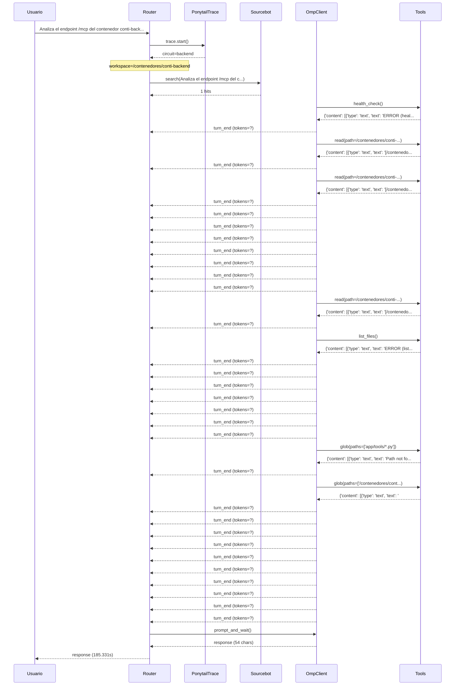

# Traza: Analiza el endpoint /mcp del contenedor conti-backend y documenta todas las tools en un documento mcp_tools_doc.md

- **Circuito**: `backend`
- **Workspace**: `/contenedores/conti-backend`
- **Inicio**: 2026-07-02T22:59:49.739542+00:00
- **Fin**: 2026-07-02T23:02:55.074239+00:00
- **Duración**: 185.335s
- **Eventos**: 48

## Diagrama de Secuencia



## Eventos Detallados

### 1. `start` (2026-07-02T22:59:49.739639+00:00)

```json
{
  "task": "Analiza el endpoint /mcp del contenedor conti-backend y documenta todas las tools en un documento mcp_tools_doc.md",
  "payload_keys": [
    "messages",
    "circuit",
    "_circuit"
  ],
  "circuit": "backend",
  "traces_dir": "/app/logs/ponytail"
}
```

### 2. `circuit_selected` (2026-07-02T22:59:49.741803+00:00)

```json
{
  "id": "backend",
  "workspace": "/contenedores/conti-backend"
}
```

### 3. `sourcebot_search` (2026-07-02T22:59:49.906217+00:00)

```json
{
  "query": "Analiza el endpoint /mcp del contenedor conti-backend y documenta todas las tools en un documento mcp_tools_doc.md",
  "search_query": "conti-backend mcp",
  "matches_requested": 5,
  "hits": 1,
  "results_preview": [
    {
      "repo": "github.com/luisdalmasso/orquestador-contamela",
      "fileName": "docs/ESTADO_REAL.md",
      "language": "Markdown",
      "line": 58,
      "branches": [
        "refs/heads/main"
      ],
      "snippet": "### MCP\n",
      "webUrl": "http://localhost:3010/browse/github.com/luisdalmasso/orquestador-contamela@refs/heads/main/-/blob/docs%2FESTADO_REAL.md"
    }
  ]
}
```

### 4. `omp_tool_start` (2026-07-02T22:59:57.518602+00:00)

```json
{
  "tool": "health_check",
  "args": {},
  "result": null,
  "error": null,
  "ok": true
}
```

### 5. `omp_tool_end` (2026-07-02T23:00:27.649803+00:00)

```json
{
  "tool": "health_check",
  "args": {},
  "result": {
    "content": [
      {
        "type": "text",
        "text": "ERROR (health_check): timeout después de 30.0s"
      }
    ],
    "details": {}
  },
  "error": null,
  "ok": true
}
```

### 6. `omp_turn_end` (2026-07-02T23:00:27.680570+00:00)

```json
{
  "event_type": "turn_end",
  "model": "?",
  "provider": "?"
}
```

### 7. `omp_tool_start` (2026-07-02T23:00:30.037684+00:00)

```json
{
  "tool": "read",
  "args": {
    "path": "/contenedores/conti-backend/docs/ESTADO_REAL.md"
  },
  "result": null,
  "error": null,
  "ok": true
}
```

### 8. `omp_tool_end` (2026-07-02T23:00:30.175096+00:00)

```json
{
  "tool": "read",
  "args": {
    "path": "/contenedores/conti-backend/docs/ESTADO_REAL.md"
  },
  "result": {
    "content": [
      {
        "type": "text",
        "text": "[/contenedores/conti-backend/docs/ESTADO_REAL.md#9892]\n1:# Estado Real — conti-backend\n2:\n3:> Generado por análisis directo del código fuente.  \n4:> Fecha: 2026-05-  \n5:> Fuente: `app/`, `config/`, `entrypoint.sh`, `docker-compose.conti.yml`, `requirements.txt`\n6:\n7:---\n8:\n9:## Resumen ejecutivo\n10:\n11:El backend está completamente implementado y operativo. Cubre las Fases 0–7 del Plan 2 más una Fase 8 (tenant católico) no contemplada en el plan original. El total de tools MCP registradas es **43**.\n12:\n13:---\n14:\n15:## Estructura del proyecto\n16:\n17:```\n18:app/\n19:  main.py              — FastAPI app, routers, endpoints raíz\n20:  config/              — Carga y modelos de configuración (Pydantic)\n21:  core/                — ToolRegistry, ToolDefinition, categorías, visibilidad\n22:  mcp/                 — Router MCP (JSON-RPC 2.0, SSE, REST)\n23:  llm_emulation/       — Proxy OpenAI-compatible hacia nanobot serve\n24:  onboarding/          — Loader de onboarding.md con fallback\n25:  rules/               — Loader de rules.md con fallback\n26:  services/            — Servicios singleton (health, registry, llm, nanobot, config, onboarding, rules)\n27:  tools/               — Implementaciones de todas las tools MCP\n28:  tenants/             — Sistema multi-tenant (base, registry, context_writer)\n29:  chat/                — Orquestador de chat, memoria Redis, router\n30:  web/                 — UI web (Jinja2 + static)\n31:  utils/               — Logging, paths, security\n32:config/\n33:  app_config.json      — Configuración principal del backend\n34:docs/                  — Documentación (onboarding, rules, planes)\n35:tests/                 — Suite de tests pytest\n36:entrypoint.sh          — Arranque multi-proceso con tmux\n37:docker-compose.conti.yml — Compose con healthcheck, puertos y volúmenes\n38:requirements.txt       — Dependencias Python\n39:```\n40:\n41:---\n42:\n43:## Endpoints REST implementados\n44:\n45:### Raíz y configuración\n46:\n47:| Método | Endpoint | Descripción |\n48:|--------|----------|-------------|\n49:| `GET` | `/health` | Estado del backend (versión, uptime, servicios) |\n50:| `GET` | `/config` | Configuración efectiva con secretos redactados |\n51:| `POST` | `/config/reload` | Recarga configuración desde disco |\n52:| `GET` | `/onboarding` | Contenido de onboarding.md. `?brief=true` para resumen |\n53:| `POST` | `/onboarding/reload` | Recarga onboarding desde disco |\n54:| `GET` | `/rules` | Reglas efectivas con checksum y mtime |\n55:| `GET` | `/rules/raw` | Reglas en texto plano |\n56:| `POST` | `/rules/reload` | Recarga rules desde disco |\n57:\n58:### MCP\n59:\n60:| Método | Endpoint | Descripción |\n61:|--------|----------|-------------|\n62:| `GET` | `/mcp` | Info del servidor MCP (JSON) o SSE si `Accept: text/event-stream` |\n63:| `POST` | `/mcp` | JSON-RPC 2.0: `initialize`, `tools/list`, `tools/call`, `ping`, `notifications/initialized` |\n64:| `GET` | `/mcp/tools` | Lista completa de tools con schemas JSON |\n65:| `POST` | `/mcp/call` | Invocar tool por nombre (REST simple) |\n66:| `POST` | `/mcp/execute` | Alias de `/mcp/call` con formato alternativo |\n67:| `GET` | `/mcp/sse` | SSE legacy para Kilocode/Cline |\n68:\n69:### LLM Emulation (OpenAI-compatible)\n70:\n71:| Método | Endpoint | Descripción |\n72:|--------|----------|-------------|\n73:| `GET` | `/v1` | Info del endpoint OpenAI-compatible |\n74:| `GET` | `/v1/models` | Lista modelos disponibles (proxy a nanobot serve) |\n75:| `POST` | `/v1/chat/completions` | Chat completions con streaming opcional (proxy a nanobot serve :8765) |\n76:| `POST` | `/v1/responses` | Emulación de Responses API sobre chat completions. Sin streaming |\n77:| `GET` | `/llm/backend/status` | Estado del nanobot serve |\n78:| `POST` | `/llm/backend/reload` | Recarga configuración del nanobot serve |\n79:\n80:### Chat multi-tenant\n81:\n82:| Método | Endpoint | Descripción |\n83:|--------|----------|-------------|\n84:| `POST` | `/v1/chat` | Procesa mensaje de chat para un tenant específico |\n85:| `GET` | `/v1/chat/tenants` | Lista tenants disponibles |\n86:| `GET` | `/v1/chat/health` | Estado de Redis para el sistema de chat |\n87:| `DELETE` | `/v1/chat/{tenant_id}/{session_id}` | Limpia sesión de chat |\n88:\n89:### UI Web\n90:\n91:| Método | Endpoint | Descripción |\n92:|--------|----------|-------------|\n93:| `GET` | `/` | Redirige a `/ui` |\n94:| `GET` | `/ui` | Panel principal (estado, health, git) |\n95:| `GET` | `/ui/settings` | Configuración activa redactada |\n96:| `GET` | `/ui/tools` | Catálogo MCP con tool runner |\n97:| `GET` | `/ui/rules` | Onboarding y rules efectivos |\n98:| `GET` | `/ui/nanobots` | Editor de config gateway, llm serve y tenant católico |\n99:| `POST` | `/ui/nanobots/gateway` | Guarda config del gateway nanobot |\n100:| `POST` | `/ui/nanobots/llm` | Guarda config del nanobot serve |\n101:| `POST` | `/ui/nanobots/tenant/catolico` | Guarda config del nanobot serve del tenant católico |\n102:\n103:---\n104:\n105:## Tools MCP registradas (43 total)\n106:\n107:### Grupo A — Filesystem (4)\n108:\n109:| Tool | Descripción |\n110:|------|-------------|\n111:| `list_files` | Lista archivos y directorios bajo un root permitido |\n112:| `read_file` | Lee archivo con soporte de rango de líneas (`start_line`, `end_line`) |\n113:| `file_exists` | Informa si un path existe, si es archivo o directorio |\n114:| `get_code_context` | Devuelve N líneas de contexto alrededor de una línea específica |\n115:\n116:### Grupo B — Búsqueda (3)\n117:\n118:| Tool | Descripción |\n119:|------|-------------|\n120:| `search_code_literal` | Busca texto/regex en el repo de desarrollo (`/desarrollo`) |\n121:| `search_docs_literal` | Busca texto/regex en `/app/docs` |\n122:| `grep_workspace` | Busca en el workspace completo permitido |\n123:\n124:### Grupo C — Sistema y Health (2)\n125:\n126:| Tool | Descripción |\n127:|------|-------------|\n128:| `health_check` | Estado del backend (equivalente a `GET /health`) |\n129:| `reload_config` | Recarga configuración desde disco (visibilidad: `internal`) |\n130:\n131:### Grupo D — Configuración y Governance (3)\n132:\n133:| Tool | Descripción |\n134:|------|-------------|\n135:| `get_config` | Configuración efectiva redactada |\n136:| `get_onboarding` | Onboarding efectivo. `brief=true` para solo el resumen |\n137:| `get_rules` | Reglas efectivas del backend |\n138:\n139:### Grupo E — Git / CI-CD local (6)\n140:\n141:| Tool | Descripción |\n142:|------|-------------|\n143:| `get_git_status` | Estado del repo: branch, staged, modified, untracked, ahead/behind |\n144:| `get_git_log` | Historial de commits (default: 10) |\n145:| `diff_with_develop` | Diff HEAD vs develop (remoto o local) con stat |\n146:| `get_pipeline_summary` | Resumen completo: status + log + diff + remotos |\n147:| `run_salvar` | `confirm=false` → preview. `confirm=true` → `git add -A + commit + push develop` |\n148:| `run_promover` | `confirm=false` → preview. `confirm=true` → merge develop→main + push |\n149:\n150:### Grupo F — Docker y Containers (3)\n151:\n152:| Tool | Descripción |\n153:|------|-------------|\n154:| `get_container_health` | Estado de contenedores via Docker socket. Filtra por `env` o `container` |\n155:| `get_container_logs` | Logs con filtros `lines`, `since` (ej: `1h`, `30m`), `level` (`all`/`error`/`warning`) |\n156:| `get_vps_status` | Vista consolidada: Docker + Git pipeline en una sola llamada |\n157:\n158:### Grupo G — Traducción (3)\n159:\n160:| Tool | Descripción |\n161:|------|-------------|\n162:| `start_markdown_translation` | Traduce Markdown en background via `deep_translator`. Devuelve `job_id` |\n163:| `get_translation_job` | Estado y progreso de un job de traducción |\n164:| `list_translation_jobs` | Lista jobs recientes (default: 20) |\n165:\n166:### Grupo H — Documentos y PDF (3)\n167:\n168:| Tool | Descripción |\n169:|------|-------------|\n170:| `start_pdf_to_markdown` | Convierte PDF/DOCX a Markdown via `markitdown`. Guarda en `/compose/documentos_listos/{store}/`. Opcionalmente encadena traducción |\n171:| `get_md_conversion_job` | Estado de un job de conversión |\n172:| `list_md_conversion_jobs` | Lista jobs recientes |\n173:\n174:### Grupo I — RAG Flamehaven — Ingestión (4)\n175:\n176:| Tool | Descripción |\n177:|------|-------------|\n178:| `start_rag_ingest` | Ingesta documento en Flamehaven. Detecta automáticamente 3 casos (MD en listos / no-MD / MD fuera de listos). Control de duplicados con `overwrite` |\n179:| `get_rag_ingest_job` | Estado de un job de ingestión |\n180:| `list_rag_ingest_jobs` | Lista jobs recientes |\n181:| `scan_documentos_nuevos` | Escanea `/compose/documentos_nuevos/{store}/`, mueve a `procesados/` y lanza ingesta. Soporta `dry_run`, `store=all`, `max_files`, `include_procesados` |\n182:\n183:### Grupo J — RAG Flamehaven — Búsqueda (4)\n184:\n185:| Tool | Descripción |\n186:|------|-------------|\n187:| `search_rag` | Búsqueda completa (hybrid/semantic/keyword) con respuesta LLM (Gemini). Devuelve `answer`, `sources`, `search_confidence`, `low_confidence` |\n188:| `search_rag_quick` | Búsqueda keyword sin LLM. Solo `sources` y `matched`. Sin tokens Gemini |\n189:| `search_rag_semantic` | Búsqueda semántica pura (DSP v2.0). Sin BM25. Tolerante a typos y sinónimos |\n190:| `list_rag_store_docs` | Inventario de documentos indexados en un store |\n191:\n192:### Grupo K — Católico (3)\n193:\n194:| Tool | Descripción |\n195:|------|-------------|\n196:| `catolico_lecturas_dia` | Lecturas litúrgicas del día desde dominicos.org. Incluye video YouTube y audio SoundCloud si están disponibles. Consulta info litúrgica desde PostgreSQL si está disponible |\n197:| `catolico_biblia_buscar` | Búsqueda de citas bíblicas. Implementación parcial (esqueleto funcional, sin fuente real) |\n198:| `catolico_leer_documento` | Lee texto completo de un documento del RAG para resumir |\n199:\n200:---\n201:\n202:## Sistema multi-tenant (Fase 8 — no estaba en el plan original)\n203:\n204:### Arquitectura\n205:\n206:```\n207:POST /v1/chat\n208:  → ChatOrchestrator\n209:      → TenantRegistry (descubre /tenants/<id>/config.yaml)\n210:      → RedisSessionManager (DB 10, host: redis_odoo)\n211:          → get_state + get_history\n212:      → Clasificación por keywords (strategy=keyword)\n213:      → ContextWriter → /tenants/<id>/context/{state.json, history.md, rule_context.md}\n214:      → HTTP POST → nanobot serve del tenant (puerto configurable, default: 8766)\n215:      → Guarda respuesta en Redis\n216:```\n217:\n218:### Componentes\n219:\n220:- `app/tenants/base.py` — `TenantConfig` Pydantic: `tenant_id`, `strategy`, `nanobot_port`, `chat_ttl`, `max_history`, `rag_store`, `keywords`, `instructions`\n221:- `app/tenants/registry.py` — Descubre configs desde `/tenants/<id>/config.yaml` (YAML). Singleton con lazy load\n222:- `app/tenants/context_writer.py` — Escribe `state.json`, `history.md`, `rule_context.md` antes de cada llamada al nanobot\n223:- `app/chat/memory.py` — `RedisSessionManager`: historial y estado por `tenant_id/session_id`. TTL configurable\n224:- `app/chat/orchestrator.py` — Orquestador central. Extrae JSON embebido de respuestas nanobot si es necesario\n225:- `app/chat/router.py` — Endpoints `/v1/chat`, `/v1/chat/tenants`, `/v1/chat/health`, `DELETE /v1/chat/{tenant}/{session}`\n226:\n227:### Tenant implementado: `catolico`\n228:\n229:- Config en `/tenants/catolico/config.yaml`\n230:- Nanobot serve en puerto `8766`\n231:- Strategy: `keyword`\n232:- Nanobot home: `/tenants/catolico/`\n233:- Integración con Chainlit en `chatui.contamela.com/?client_id=catolico`\n234:\n235:---\n236:\n237:## Runtime y despliegue\n238:\n239:### Procesos en `entrypoint.sh`\n240:\n241:1. `nanobot gateway` — puerto `18790`, config: `/home/nanobot/.nanobot/config.json`\n242:2. `nanobot serve` — puerto `8765`, config: `/home/nanobot/llm_serve_config.json` (con bootstrap automático desde config legacy si no existe)\n243:3. `uvicorn app.main:app` — puerto `9001`\n244:4. `clawteam board serve` — puerto `8080`\n245:5. `nanobot serve [catolico]` — puerto `8766`, home: `/tenants/catolico/`\n246:\n247:### Puertos publicados (`docker-compose.conti.yml`)\n248:\n249:| Puerto host | Puerto contenedor | Servicio |\n250:|-------------|-------------------|---------|\n251:| `9001` | `9001` | FastAPI backend (principal) |\n252:| `9007` | `9001` | FastAPI backend (alias legacy) |\n253:| `8765` | `8765` | nanobot serve (OpenAI-compatible) |\n254:| `8766` | `8766` | nanobot serve tenant católico |\n255:| `8080` | `8080` | ClawTeam board UI |\n256:| `18790` | `18790` | nanobot gateway |\n257:\n258:### Healthcheck\n259:\n260:```yaml\n261:test: wget -qO- http://127.0.0.1:9001/health && wget -qO- http://127.0.0.1:8765/health\n262:interval: 30s / timeout: 10s / retries: 5 / start_period: 30s\n263:```\n264:\n265:### Volúmenes montados\n266:\n267:| Path en contenedor | Origen | Modo |\n268:|--------------------|--------|------|\n269:| `/home/nanobot/` | `./conti_home` | rw |\n270:| `/desarrollo` | `/desarrollo` | rw |\n271:| `/compose` | `/compose` | ro |\n272:| `/compose/documentos_listos` | `/compose/documentos_listos` | rw |\n273:| `/compose/documentos_nuevos` | `/compose/documentos_nuevos` | rw |\n274:| `/tenants` | `/contenedores/tenants` | rw |\n275:| `/var/run/docker.sock` | `/var/run/docker.sock` | rw |\n276:| `/app/app` | `./app` | rw (hot-reload) |\n277:| `/app/config/team.toml` | `/desarrollo/config/team.toml` | ro |\n278:| `/app/skills` | `/desarrollo/shared_skills` | ro |\n279:\n280:---\n281:\n282:## Configuración (`config/app_config.json`)\n283:\n284:```json\n285:{\n286:  \"server\":         { \"host\": \"0.0.0.0\", \"port\": 9001 },\n287:  \"llm_emulation\":  { \"enabled\": true, \"serve_base_url\": \"http://127.0.0.1:8765\", \"streaming_enabled\": true },\n288:  \"paths\": {\n289:    \"home_root\":          \"/home/nanobot\",\n290:    \"development_repo\":   \"/desarrollo\",\n291:    \"production_repo\":    \"/compose\",\n292:    \"onboarding_file\":    \"/app/docs/onboarding.md\",\n293:    \"rules_file\":         \"/app/docs/rules.md\"\n294:  },\n295:  \"rag\": {\n296:    \"base_url\":       \"http://flamehaven:8000\",\n297:    \"api_key_env\":    \"FLAMEHAVEN_API_KEY\",\n298:    \"default_store\":  \"default\"\n299:  },\n300:  \"ui\": { \"enabled\": true, \"title\": \"Conti MCP Console\" }\n301:}\n302:```\n…\n305:\n…\n384:```\n\n[Showing lines 1-300 of 385. Use :301 to continue]"
      }
    ],
    "details": {
      "truncation": {
        "content": "# Estado Real — conti-backend\n\n> Generado por análisis directo del código fuente.  \n> Fecha: 2026-05-  \n> Fuente: `app/`, `config/`, `entrypoint.sh`, `docker-compose.conti.yml`, `requirements.txt`\n\n---\n\n## Resumen ejecutivo\n\nEl backend está completamente implementado y operativo. Cubre las Fases 0–7 del Plan 2 más una Fase 8 (tenant católico) no contemplada en el plan original. El total de tools MCP registradas es **43**.\n\n---\n\n## Estructura del proyecto\n\n```\napp/\n  main.py              — FastAPI app, routers, endpoints raíz\n  config/              — Carga y modelos de configuración (Pydantic)\n  core/                — ToolRegistry, ToolDefinition, categorías, visibilidad\n  mcp/                 — Router MCP (JSON-RPC 2.0, SSE, REST)\n  llm_emulation/       — Proxy OpenAI-compatible hacia nanobot serve\n  onboarding/          — Loader de onboarding.md con fallback\n  rules/               — Loader de rules.md con fallback\n  services/            — Servicios singleton (health, registry, llm, nanobot, config, onboarding, rules)\n  tools/               — Implementaciones de todas las tools MCP\n  tenants/             — Sistema multi-tenant (base, registry, context_writer)\n  chat/                — Orquestador de chat, memoria Redis, router\n  web/                 — UI web (Jinja2 + static)\n  utils/               — Logging, paths, security\nconfig/\n  app_config.json      — Configuración principal del backend\ndocs/                  — Documentación (onboarding, rules, planes)\ntests/                 — Suite de tests pytest\nentrypoint.sh          — Arranque multi-proceso con tmux\ndocker-compose.conti.yml — Compose con healthcheck, puertos y volúmenes\nrequirements.txt       — Dependencias Python\n```\n\n---\n\n## Endpoints REST implementados\n\n### Raíz y configuración\n\n| Método | Endpoint | Descripción |\n|--------|----------|-------------|\n| `GET` | `/health` | Estado del backend (versión, uptime, servicios) |\n| `GET` | `/config` | Configuración efectiva con secretos redactados |\n| `POST` | `/config/reload` | Recarga configuración desde disco |\n| `GET` | `/onboarding` | Contenido de onboarding.md. `?brief=true` para resumen |\n| `POST` | `/onboarding/reload` | Recarga onboarding desde disco |\n| `GET` | `/rules` | Reglas efectivas con checksum y mtime |\n| `GET` | `/rules/raw` | Reglas en texto plano |\n| `POST` | `/rules/reload` | Recarga rules desde disco |\n\n### MCP\n\n| Método | Endpoint | Descripción |\n|--------|----------|-------------|\n| `GET` | `/mcp` | Info del servidor MCP (JSON) o SSE si `Accept: text/event-stream` |\n| `POST` | `/mcp` | JSON-RPC 2.0: `initialize`, `tools/list`, `tools/call`, `ping`, `notifications/initialized` |\n| `GET` | `/mcp/tools` | Lista completa de tools con schemas JSON |\n| `POST` | `/mcp/call` | Invocar tool por nombre (REST simple) |\n| `POST` | `/mcp/execute` | Alias de `/mcp/call` con formato alternativo |\n| `GET` | `/mcp/sse` | SSE legacy para Kilocode/Cline |\n\n### LLM Emulation (OpenAI-compatible)\n\n| Método | Endpoint | Descripción |\n|--------|----------|-------------|\n| `GET` | `/v1` | Info del endpoint OpenAI-compatible |\n| `GET` | `/v1/models` | Lista modelos disponibles (proxy a nanobot serve) |\n| `POST` | `/v1/chat/completions` | Chat completions con streaming opcional (proxy a nanobot serve :8765) |\n| `POST` | `/v1/responses` | Emulación de Responses API sobre chat completions. Sin streaming |\n| `GET` | `/llm/backend/status` | Estado del nanobot serve |\n| `POST` | `/llm/backend/reload` | Recarga configuración del nanobot serve |\n\n### Chat multi-tenant\n\n| Método | Endpoint | Descripción |\n|--------|----------|-------------|\n| `POST` | `/v1/chat` | Procesa mensaje de chat para un tenant específico |\n| `GET` | `/v1/chat/tenants` | Lista tenants disponibles |\n| `GET` | `/v1/chat/health` | Estado de Redis para el sistema de chat |\n| `DELETE` | `/v1/chat/{tenant_id}/{session_id}` | Limpia sesión de chat |\n\n### UI Web\n\n| Método | Endpoint | Descripción |\n|--------|----------|-------------|\n| `GET` | `/` | Redirige a `/ui` |\n| `GET` | `/ui` | Panel principal (estado, health, git) |\n| `GET` | `/ui/settings` | Configuración activa redactada |\n| `GET` | `/ui/tools` | Catálogo MCP con tool runner |\n| `GET` | `/ui/rules` | Onboarding y rules efectivos |\n| `GET` | `/ui/nanobots` | Editor de config gateway, llm serve y tenant católico |\n| `POST` | `/ui/nanobots/gateway` | Guarda config del gateway nanobot |\n| `POST` | `/ui/nanobots/llm` | Guarda config del nanobot serve |\n| `POST` | `/ui/nanobots/tenant/catolico` | Guarda config del nanobot serve del tenant católico |\n\n---\n\n## Tools MCP registradas (43 total)\n\n### Grupo A — Filesystem (4)\n\n| Tool | Descripción |\n|------|-------------|\n| `list_files` | Lista archivos y directorios bajo un root permitido |\n| `read_file` | Lee archivo con soporte de rango de líneas (`start_line`, `end_line`) |\n| `file_exists` | Informa si un path existe, si es archivo o directorio |\n| `get_code_context` | Devuelve N líneas de contexto alrededor de una línea específica |\n\n### Grupo B — Búsqueda (3)\n\n| Tool | Descripción |\n|------|-------------|\n| `search_code_literal` | Busca texto/regex en el repo de desarrollo (`/desarrollo`) |\n| `search_docs_literal` | Busca texto/regex en `/app/docs` |\n| `grep_workspace` | Busca en el workspace completo permitido |\n\n### Grupo C — Sistema y Health (2)\n\n| Tool | Descripción |\n|------|-------------|\n| `health_check` | Estado del backend (equivalente a `GET /health`) |\n| `reload_config` | Recarga configuración desde disco (visibilidad: `internal`) |\n\n### Grupo D — Configuración y Governance (3)\n\n| Tool | Descripción |\n|------|-------------|\n| `get_config` | Configuración efectiva redactada |\n| `get_onboarding` | Onboarding efectivo. `brief=true` para solo el resumen |\n| `get_rules` | Reglas efectivas del backend |\n\n### Grupo E — Git / CI-CD local (6)\n\n| Tool | Descripción |\n|------|-------------|\n| `get_git_status` | Estado del repo: branch, staged, modified, untracked, ahead/behind |\n| `get_git_log` | Historial de commits (default: 10) |\n| `diff_with_develop` | Diff HEAD vs develop (remoto o local) con stat |\n| `get_pipeline_summary` | Resumen completo: status + log + diff + remotos |\n| `run_salvar` | `confirm=false` → preview. `confirm=true` → `git add -A + commit + push develop` |\n| `run_promover` | `confirm=false` → preview. `confirm=true` → merge develop→main + push |\n\n### Grupo F — Docker y Containers (3)\n\n| Tool | Descripción |\n|------|-------------|\n| `get_container_health` | Estado de contenedores via Docker socket. Filtra por `env` o `container` |\n| `get_container_logs` | Logs con filtros `lines`, `since` (ej: `1h`, `30m`), `level` (`all`/`error`/`warning`) |\n| `get_vps_status` | Vista consolidada: Docker + Git pipeline en una sola llamada |\n\n### Grupo G — Traducción (3)\n\n| Tool | Descripción |\n|------|-------------|\n| `start_markdown_translation` | Traduce Markdown en background via `deep_translator`. Devuelve `job_id` |\n| `get_translation_job` | Estado y progreso de un job de traducción |\n| `list_translation_jobs` | Lista jobs recientes (default: 20) |\n\n### Grupo H — Documentos y PDF (3)\n\n| Tool | Descripción |\n|------|-------------|\n| `start_pdf_to_markdown` | Convierte PDF/DOCX a Markdown via `markitdown`. Guarda en `/compose/documentos_listos/{store}/`. Opcionalmente encadena traducción |\n| `get_md_conversion_job` | Estado de un job de conversión |\n| `list_md_conversion_jobs` | Lista jobs recientes |\n\n### Grupo I — RAG Flamehaven — Ingestión (4)\n\n| Tool | Descripción |\n|------|-------------|\n| `start_rag_ingest` | Ingesta documento en Flamehaven. Detecta automáticamente 3 casos (MD en listos / no-MD / MD fuera de listos). Control de duplicados con `overwrite` |\n| `get_rag_ingest_job` | Estado de un job de ingestión |\n| `list_rag_ingest_jobs` | Lista jobs recientes |\n| `scan_documentos_nuevos` | Escanea `/compose/documentos_nuevos/{store}/`, mueve a `procesados/` y lanza ingesta. Soporta `dry_run`, `store=all`, `max_files`, `include_procesados` |\n\n### Grupo J — RAG Flamehaven — Búsqueda (4)\n\n| Tool | Descripción |\n|------|-------------|\n| `search_rag` | Búsqueda completa (hybrid/semantic/keyword) con respuesta LLM (Gemini). Devuelve `answer`, `sources`, `search_confidence`, `low_confidence` |\n| `search_rag_quick` | Búsqueda keyword sin LLM. Solo `sources` y `matched`. Sin tokens Gemini |\n| `search_rag_semantic` | Búsqueda semántica pura (DSP v2.0). Sin BM25. Tolerante a typos y sinónimos |\n| `list_rag_store_docs` | Inventario de documentos indexados en un store |\n\n### Grupo K — Católico (3)\n\n| Tool | Descripción |\n|------|-------------|\n| `catolico_lecturas_dia` | Lecturas litúrgicas del día desde dominicos.org. Incluye video YouTube y audio SoundCloud si están disponibles. Consulta info litúrgica desde PostgreSQL si está disponible |\n| `catolico_biblia_buscar` | Búsqueda de citas bíblicas. Implementación parcial (esqueleto funcional, sin fuente real) |\n| `catolico_leer_documento` | Lee texto completo de un documento del RAG para resumir |\n\n---\n\n## Sistema multi-tenant (Fase 8 — no estaba en el plan original)\n\n### Arquitectura\n\n```\nPOST /v1/chat\n  → ChatOrchestrator\n      → TenantRegistry (descubre /tenants/<id>/config.yaml)\n      → RedisSessionManager (DB 10, host: redis_odoo)\n          → get_state + get_history\n      → Clasificación por keywords (strategy=keyword)\n      → ContextWriter → /tenants/<id>/context/{state.json, history.md, rule_context.md}\n      → HTTP POST → nanobot serve del tenant (puerto configurable, default: 8766)\n      → Guarda respuesta en Redis\n```\n\n### Componentes\n\n- `app/tenants/base.py` — `TenantConfig` Pydantic: `tenant_id`, `strategy`, `nanobot_port`, `chat_ttl`, `max_history`, `rag_store`, `keywords`, `instructions`\n- `app/tenants/registry.py` — Descubre configs desde `/tenants/<id>/config.yaml` (YAML). Singleton con lazy load\n- `app/tenants/context_writer.py` — Escribe `state.json`, `history.md`, `rule_context.md` antes de cada llamada al nanobot\n- `app/chat/memory.py` — `RedisSessionManager`: historial y estado por `tenant_id/session_id`. TTL configurable\n- `app/chat/orchestrator.py` — Orquestador central. Extrae JSON embebido de respuestas nanobot si es necesario\n- `app/chat/router.py` — Endpoints `/v1/chat`, `/v1/chat/tenants`, `/v1/chat/health`, `DELETE /v1/chat/{tenant}/{session}`\n\n### Tenant implementado: `catolico`\n\n- Config en `/tenants/catolico/config.yaml`\n- Nanobot serve en puerto `8766`\n- Strategy: `keyword`\n- Nanobot home: `/tenants/catolico/`\n- Integración con Chainlit en `chatui.contamela.com/?client_id=catolico`\n\n---\n\n## Runtime y despliegue\n\n### Procesos en `entrypoint.sh`\n\n1. `nanobot gateway` — puerto `18790`, config: `/home/nanobot/.nanobot/config.json`\n2. `nanobot serve` — puerto `8765`, config: `/home/nanobot/llm_serve_config.json` (con bootstrap automático desde config legacy si no existe)\n3. `uvicorn app.main:app` — puerto `9001`\n4. `clawteam board serve` — puerto `8080`\n5. `nanobot serve [catolico]` — puerto `8766`, home: `/tenants/catolico/`\n\n### Puertos publicados (`docker-compose.conti.yml`)\n\n| Puerto host | Puerto contenedor | Servicio |\n|-------------|-------------------|---------|\n| `9001` | `9001` | FastAPI backend (principal) |\n| `9007` | `9001` | FastAPI backend (alias legacy) |\n| `8765` | `8765` | nanobot serve (OpenAI-compatible) |\n| `8766` | `8766` | nanobot serve tenant católico |\n| `8080` | `8080` | ClawTeam board UI |\n| `18790` | `18790` | nanobot gateway |\n\n### Healthcheck\n\n```yaml\ntest: wget -qO- http://127.0.0.1:9001/health && wget -qO- http://127.0.0.1:8765/health\ninterval: 30s / timeout: 10s / retries: 5 / start_period: 30s\n```\n\n### Volúmenes montados\n\n| Path en contenedor | Origen | Modo |\n|--------------------|--------|------|\n| `/home/nanobot/` | `./conti_home` | rw |\n| `/desarrollo` | `/desarrollo` | rw |\n| `/compose` | `/compose` | ro |\n| `/compose/documentos_listos` | `/compose/documentos_listos` | rw |\n| `/compose/documentos_nuevos` | `/compose/documentos_nuevos` | rw |\n| `/tenants` | `/contenedores/tenants` | rw |\n| `/var/run/docker.sock` | `/var/run/docker.sock` | rw |\n| `/app/app` | `./app` | rw (hot-reload) |\n| `/app/config/team.toml` | `/desarrollo/config/team.toml` | ro |\n| `/app/skills` | `/desarrollo/shared_skills` | ro |\n\n---\n\n## Configuración (`config/app_config.json`)\n\n```json\n{\n  \"server\":         { \"host\": \"0.0.0.0\", \"port\": 9001 },\n  \"llm_emulation\":  { \"enabled\": true, \"serve_base_url\": \"http://127.0.0.1:8765\", \"streaming_enabled\": true },\n  \"paths\": {\n    \"home_root\":          \"/home/nanobot\",\n    \"development_repo\":   \"/desarrollo\",\n    \"production_repo\":    \"/compose\",\n    \"onboarding_file\":    \"/app/docs/onboarding.md\",\n    \"rules_file\":         \"/app/docs/rules.md\"\n  },\n  \"rag\": {\n    \"base_url\":       \"http://flamehaven:8000\",\n    \"api_key_env\":    \"FLAMEHAVEN_API_KEY\",\n    \"default_store\":  \"default\"\n  },\n  \"ui\": { \"enabled\": true, \"title\": \"Conti MCP Console\" }",
        "truncated": true,
        "truncatedBy": "lines",
        "totalLines": 385,
        "totalBytes": 13086,
        "outputLines": 300,
        "outputBytes": 13086,
        "lastLinePartial": false,
        "firstLineExceedsLimit": false
      },
      "displayContent": {
        "text": "# Estado Real — conti-backend\n\n> Generado por análisis directo del código fuente.  \n> Fecha: 2026-05-  \n> Fuente: `app/`, `config/`, `entrypoint.sh`, `docker-compose.conti.yml`, `requirements.txt`\n\n---\n\n## Resumen ejecutivo\n\nEl backend está completamente implementado y operativo. Cubre las Fases 0–7 del Plan 2 más una Fase 8 (tenant católico) no contemplada en el plan original. El total de tools MCP registradas es **43**.\n\n---\n\n## Estructura del proyecto\n\n```\napp/\n  main.py              — FastAPI app, routers, endpoints raíz\n  config/              — Carga y modelos de configuración (Pydantic)\n  core/                — ToolRegistry, ToolDefinition, categorías, visibilidad\n  mcp/                 — Router MCP (JSON-RPC 2.0, SSE, REST)\n  llm_emulation/       — Proxy OpenAI-compatible hacia nanobot serve\n  onboarding/          — Loader de onboarding.md con fallback\n  rules/               — Loader de rules.md con fallback\n  services/            — Servicios singleton (health, registry, llm, nanobot, config, onboarding, rules)\n  tools/               — Implementaciones de todas las tools MCP\n  tenants/             — Sistema multi-tenant (base, registry, context_writer)\n  chat/                — Orquestador de chat, memoria Redis, router\n  web/                 — UI web (Jinja2 + static)\n  utils/               — Logging, paths, security\nconfig/\n  app_config.json      — Configuración principal del backend\ndocs/                  — Documentación (onboarding, rules, planes)\ntests/                 — Suite de tests pytest\nentrypoint.sh          — Arranque multi-proceso con tmux\ndocker-compose.conti.yml — Compose con healthcheck, puertos y volúmenes\nrequirements.txt       — Dependencias Python\n```\n\n---\n\n## Endpoints REST implementados\n\n### Raíz y configuración\n\n| Método | Endpoint | Descripción |\n|--------|----------|-------------|\n| `GET` | `/health` | Estado del backend (versión, uptime, servicios) |\n| `GET` | `/config` | Configuración efectiva con secretos redactados |\n| `POST` | `/config/reload` | Recarga configuración desde disco |\n| `GET` | `/onboarding` | Contenido de onboarding.md. `?brief=true` para resumen |\n| `POST` | `/onboarding/reload` | Recarga onboarding desde disco |\n| `GET` | `/rules` | Reglas efectivas con checksum y mtime |\n| `GET` | `/rules/raw` | Reglas en texto plano |\n| `POST` | `/rules/reload` | Recarga rules desde disco |\n\n### MCP\n\n| Método | Endpoint | Descripción |\n|--------|----------|-------------|\n| `GET` | `/mcp` | Info del servidor MCP (JSON) o SSE si `Accept: text/event-stream` |\n| `POST` | `/mcp` | JSON-RPC 2.0: `initialize`, `tools/list`, `tools/call`, `ping`, `notifications/initialized` |\n| `GET` | `/mcp/tools` | Lista completa de tools con schemas JSON |\n| `POST` | `/mcp/call` | Invocar tool por nombre (REST simple) |\n| `POST` | `/mcp/execute` | Alias de `/mcp/call` con formato alternativo |\n| `GET` | `/mcp/sse` | SSE legacy para Kilocode/Cline |\n\n### LLM Emulation (OpenAI-compatible)\n\n| Método | Endpoint | Descripción |\n|--------|----------|-------------|\n| `GET` | `/v1` | Info del endpoint OpenAI-compatible |\n| `GET` | `/v1/models` | Lista modelos disponibles (proxy a nanobot serve) |\n| `POST` | `/v1/chat/completions` | Chat completions con streaming opcional (proxy a nanobot serve :8765) |\n| `POST` | `/v1/responses` | Emulación de Responses API sobre chat completions. Sin streaming |\n| `GET` | `/llm/backend/status` | Estado del nanobot serve |\n| `POST` | `/llm/backend/reload` | Recarga configuración del nanobot serve |\n\n### Chat multi-tenant\n\n| Método | Endpoint | Descripción |\n|--------|----------|-------------|\n| `POST` | `/v1/chat` | Procesa mensaje de chat para un tenant específico |\n| `GET` | `/v1/chat/tenants` | Lista tenants disponibles |\n| `GET` | `/v1/chat/health` | Estado de Redis para el sistema de chat |\n| `DELETE` | `/v1/chat/{tenant_id}/{session_id}` | Limpia sesión de chat |\n\n### UI Web\n\n| Método | Endpoint | Descripción |\n|--------|----------|-------------|\n| `GET` | `/` | Redirige a `/ui` |\n| `GET` | `/ui` | Panel principal (estado, health, git) |\n| `GET` | `/ui/settings` | Configuración activa redactada |\n| `GET` | `/ui/tools` | Catálogo MCP con tool runner |\n| `GET` | `/ui/rules` | Onboarding y rules efectivos |\n| `GET` | `/ui/nanobots` | Editor de config gateway, llm serve y tenant católico |\n| `POST` | `/ui/nanobots/gateway` | Guarda config del gateway nanobot |\n| `POST` | `/ui/nanobots/llm` | Guarda config del nanobot serve |\n| `POST` | `/ui/nanobots/tenant/catolico` | Guarda config del nanobot serve del tenant católico |\n\n---\n\n## Tools MCP registradas (43 total)\n\n### Grupo A — Filesystem (4)\n\n| Tool | Descripción |\n|------|-------------|\n| `list_files` | Lista archivos y directorios bajo un root permitido |\n| `read_file` | Lee archivo con soporte de rango de líneas (`start_line`, `end_line`) |\n| `file_exists` | Informa si un path existe, si es archivo o directorio |\n| `get_code_context` | Devuelve N líneas de contexto alrededor de una línea específica |\n\n### Grupo B — Búsqueda (3)\n\n| Tool | Descripción |\n|------|-------------|\n| `search_code_literal` | Busca texto/regex en el repo de desarrollo (`/desarrollo`) |\n| `search_docs_literal` | Busca texto/regex en `/app/docs` |\n| `grep_workspace` | Busca en el workspace completo permitido |\n\n### Grupo C — Sistema y Health (2)\n\n| Tool | Descripción |\n|------|-------------|\n| `health_check` | Estado del backend (equivalente a `GET /health`) |\n| `reload_config` | Recarga configuración desde disco (visibilidad: `internal`) |\n\n### Grupo D — Configuración y Governance (3)\n\n| Tool | Descripción |\n|------|-------------|\n| `get_config` | Configuración efectiva redactada |\n| `get_onboarding` | Onboarding efectivo. `brief=true` para solo el resumen |\n| `get_rules` | Reglas efectivas del backend |\n\n### Grupo E — Git / CI-CD local (6)\n\n| Tool | Descripción |\n|------|-------------|\n| `get_git_status` | Estado del repo: branch, staged, modified, untracked, ahead/behind |\n| `get_git_log` | Historial de commits (default: 10) |\n| `diff_with_develop` | Diff HEAD vs develop (remoto o local) con stat |\n| `get_pipeline_summary` | Resumen completo: status + log + diff + remotos |\n| `run_salvar` | `confirm=false` → preview. `confirm=true` → `git add -A + commit + push develop` |\n| `run_promover` | `confirm=false` → preview. `confirm=true` → merge develop→main + push |\n\n### Grupo F — Docker y Containers (3)\n\n| Tool | Descripción |\n|------|-------------|\n| `get_container_health` | Estado de contenedores via Docker socket. Filtra por `env` o `container` |\n| `get_container_logs` | Logs con filtros `lines`, `since` (ej: `1h`, `30m`), `level` (`all`/`error`/`warning`) |\n| `get_vps_status` | Vista consolidada: Docker + Git pipeline en una sola llamada |\n\n### Grupo G — Traducción (3)\n\n| Tool | Descripción |\n|------|-------------|\n| `start_markdown_translation` | Traduce Markdown en background via `deep_translator`. Devuelve `job_id` |\n| `get_translation_job` | Estado y progreso de un job de traducción |\n| `list_translation_jobs` | Lista jobs recientes (default: 20) |\n\n### Grupo H — Documentos y PDF (3)\n\n| Tool | Descripción |\n|------|-------------|\n| `start_pdf_to_markdown` | Convierte PDF/DOCX a Markdown via `markitdown`. Guarda en `/compose/documentos_listos/{store}/`. Opcionalmente encadena traducción |\n| `get_md_conversion_job` | Estado de un job de conversión |\n| `list_md_conversion_jobs` | Lista jobs recientes |\n\n### Grupo I — RAG Flamehaven — Ingestión (4)\n\n| Tool | Descripción |\n|------|-------------|\n| `start_rag_ingest` | Ingesta documento en Flamehaven. Detecta automáticamente 3 casos (MD en listos / no-MD / MD fuera de listos). Control de duplicados con `overwrite` |\n| `get_rag_ingest_job` | Estado de un job de ingestión |\n| `list_rag_ingest_jobs` | Lista jobs recientes |\n| `scan_documentos_nuevos` | Escanea `/compose/documentos_nuevos/{store}/`, mueve a `procesados/` y lanza ingesta. Soporta `dry_run`, `store=all`, `max_files`, `include_procesados` |\n\n### Grupo J — RAG Flamehaven — Búsqueda (4)\n\n| Tool | Descripción |\n|------|-------------|\n| `search_rag` | Búsqueda completa (hybrid/semantic/keyword) con respuesta LLM (Gemini). Devuelve `answer`, `sources`, `search_confidence`, `low_confidence` |\n| `search_rag_quick` | Búsqueda keyword sin LLM. Solo `sources` y `matched`. Sin tokens Gemini |\n| `search_rag_semantic` | Búsqueda semántica pura (DSP v2.0). Sin BM25. Tolerante a typos y sinónimos |\n| `list_rag_store_docs` | Inventario de documentos indexados en un store |\n\n### Grupo K — Católico (3)\n\n| Tool | Descripción |\n|------|-------------|\n| `catolico_lecturas_dia` | Lecturas litúrgicas del día desde dominicos.org. Incluye video YouTube y audio SoundCloud si están disponibles. Consulta info litúrgica desde PostgreSQL si está disponible |\n| `catolico_biblia_buscar` | Búsqueda de citas bíblicas. Implementación parcial (esqueleto funcional, sin fuente real) |\n| `catolico_leer_documento` | Lee texto completo de un documento del RAG para resumir |\n\n---\n\n## Sistema multi-tenant (Fase 8 — no estaba en el plan original)\n\n### Arquitectura\n\n```\nPOST /v1/chat\n  → ChatOrchestrator\n      → TenantRegistry (descubre /tenants/<id>/config.yaml)\n      → RedisSessionManager (DB 10, host: redis_odoo)\n          → get_state + get_history\n      → Clasificación por keywords (strategy=keyword)\n      → ContextWriter → /tenants/<id>/context/{state.json, history.md, rule_context.md}\n      → HTTP POST → nanobot serve del tenant (puerto configurable, default: 8766)\n      → Guarda respuesta en Redis\n```\n\n### Componentes\n\n- `app/tenants/base.py` — `TenantConfig` Pydantic: `tenant_id`, `strategy`, `nanobot_port`, `chat_ttl`, `max_history`, `rag_store`, `keywords`, `instructions`\n- `app/tenants/registry.py` — Descubre configs desde `/tenants/<id>/config.yaml` (YAML). Singleton con lazy load\n- `app/tenants/context_writer.py` — Escribe `state.json`, `history.md`, `rule_context.md` antes de cada llamada al nanobot\n- `app/chat/memory.py` — `RedisSessionManager`: historial y estado por `tenant_id/session_id`. TTL configurable\n- `app/chat/orchestrator.py` — Orquestador central. Extrae JSON embebido de respuestas nanobot si es necesario\n- `app/chat/router.py` — Endpoints `/v1/chat`, `/v1/chat/tenants`, `/v1/chat/health`, `DELETE /v1/chat/{tenant}/{session}`\n\n### Tenant implementado: `catolico`\n\n- Config en `/tenants/catolico/config.yaml`\n- Nanobot serve en puerto `8766`\n- Strategy: `keyword`\n- Nanobot home: `/tenants/catolico/`\n- Integración con Chainlit en `chatui.contamela.com/?client_id=catolico`\n\n---\n\n## Runtime y despliegue\n\n### Procesos en `entrypoint.sh`\n\n1. `nanobot gateway` — puerto `18790`, config: `/home/nanobot/.nanobot/config.json`\n2. `nanobot serve` — puerto `8765`, config: `/home/nanobot/llm_serve_config.json` (con bootstrap automático desde config legacy si no existe)\n3. `uvicorn app.main:app` — puerto `9001`\n4. `clawteam board serve` — puerto `8080`\n5. `nanobot serve [catolico]` — puerto `8766`, home: `/tenants/catolico/`\n\n### Puertos publicados (`docker-compose.conti.yml`)\n\n| Puerto host | Puerto contenedor | Servicio |\n|-------------|-------------------|---------|\n| `9001` | `9001` | FastAPI backend (principal) |\n| `9007` | `9001` | FastAPI backend (alias legacy) |\n| `8765` | `8765` | nanobot serve (OpenAI-compatible) |\n| `8766` | `8766` | nanobot serve tenant católico |\n| `8080` | `8080` | ClawTeam board UI |\n| `18790` | `18790` | nanobot gateway |\n\n### Healthcheck\n\n```yaml\ntest: wget -qO- http://127.0.0.1:9001/health && wget -qO- http://127.0.0.1:8765/health\ninterval: 30s / timeout: 10s / retries: 5 / start_period: 30s\n```\n\n### Volúmenes montados\n\n| Path en contenedor | Origen | Modo |\n|--------------------|--------|------|\n| `/home/nanobot/` | `./conti_home` | rw |\n| `/desarrollo` | `/desarrollo` | rw |\n| `/compose` | `/compose` | ro |\n| `/compose/documentos_listos` | `/compose/documentos_listos` | rw |\n| `/compose/documentos_nuevos` | `/compose/documentos_nuevos` | rw |\n| `/tenants` | `/contenedores/tenants` | rw |\n| `/var/run/docker.sock` | `/var/run/docker.sock` | rw |\n| `/app/app` | `./app` | rw (hot-reload) |\n| `/app/config/team.toml` | `/desarrollo/config/team.toml` | ro |\n| `/app/skills` | `/desarrollo/shared_skills` | ro |\n\n---\n\n## Configuración (`config/app_config.json`)\n\n```json\n{\n  \"server\":         { \"host\": \"0.0.0.0\", \"port\": 9001 },\n  \"llm_emulation\":  { \"enabled\": true, \"serve_base_url\": \"http://127.0.0.1:8765\", \"streaming_enabled\": true },\n  \"paths\": {\n    \"home_root\":          \"/home/nanobot\",\n    \"development_repo\":   \"/desarrollo\",\n    \"production_repo\":    \"/compose\",\n    \"onboarding_file\":    \"/app/docs/onboarding.md\",\n    \"rules_file\":         \"/app/docs/rules.md\"\n  },\n  \"rag\": {\n    \"base_url\":       \"http://flamehaven:8000\",\n    \"api_key_env\":    \"FLAMEHAVEN_API_KEY\",\n    \"default_store\":  \"default\"\n  },\n  \"ui\": { \"enabled\": true, \"title\": \"Conti MCP Console\" }\n}\n```\n…\n\n…\n```",
        "startLine": 1,
        "lineNumbers": [
          1,
          2,
          3,
          4,
          5,
          6,
          7,
          8,
          9,
          10,
          11,
          12,
          13,
          14,
          15,
          16,
          17,
          18,
          19,
          20,
          21,
          22,
          23,
          24,
          25,
          26,
          27,
          28,
          29,
          30,
          31,
          32,
          33,
          34,
          35,
          36,
          37,
          38,
          39,
          40,
          41,
          42,
          43,
          44,
          45,
          46,
          47,
          48,
          49,
          50,
          51,
          52,
          53,
          54,
          55,
          56,
          57,
          58,
          59,
          60,
          61,
          62,
          63,
          64,
          65,
          66,
          67,
          68,
          69,
          70,
          71,
          72,
          73,
          74,
          75,
          76,
          77,
          78,
          79,
          80,
          81,
          82,
          83,
          84,
          85,
          86,
          87,
          88,
          89,
          90,
          91,
          92,
          93,
          94,
          95,
          96,
          97,
          98,
          99,
          100,
          101,
          102,
          103,
          104,
          105,
          106,
          107,
          108,
          109,
          110,
          111,
          112,
          113,
          114,
          115,
          116,
          117,
          118,
          119,
          120,
          121,
          122,
          123,
          124,
          125,
          126,
          127,
          128,
          129,
          130,
          131,
          132,
          133,
          134,
          135,
          136,
          137,
          138,
          139,
          140,
          141,
          142,
          143,
          144,
          145,
          146,
          147,
          148,
          149,
          150,
          151,
          152,
          153,
          154,
          155,
          156,
          157,
          158,
          159,
          160,
          161,
          162,
          163,
          164,
          165,
          166,
          167,
          168,
          169,
          170,
          171,
          172,
          173,
          174,
          175,
          176,
          177,
          178,
          179,
          180,
          181,
          182,
          183,
          184,
          185,
          186,
          187,
          188,
          189,
          190,
          191,
          192,
          193,
          194,
          195,
          196,
          197,
          198,
          199,
          200,
          201,
          202,
          203,
          204,
          205,
          206,
          207,
          208,
          209,
          210,
          211,
          212,
          213,
          214,
          215,
          216,
          217,
          218,
          219,
          220,
          221,
          222,
          223,
          224,
          225,
          226,
          227,
          228,
          229,
          230,
          231,
          232,
          233,
          234,
          235,
          236,
          237,
          238,
          239,
          240,
          241,
          242,
          243,
          244,
          245,
          246,
          247,
          248,
          249,
          250,
          251,
          252,
          253,
          254,
          255,
          256,
          257,
          258,
          259,
          260,
          261,
          262,
          263,
          264,
          265,
          266,
          267,
          268,
          269,
          270,
          271,
          272,
          273,
          274,
          275,
          276,
          277,
          278,
          279,
          280,
          281,
          282,
          283,
          284,
          285,
          286,
          287,
          288,
          289,
          290,
          291,
          292,
          293,
          294,
          295,
          296,
          297,
          298,
          299,
          300,
          301,
          302,
          null,
          305,
          null,
          384
        ]
      },
      "meta": {
        "source": {
          "type": "path",
          "value": "/contenedores/conti-backend/docs/ESTADO_REAL.md"
        },
        "truncation": {
          "direction": "head",
          "truncatedBy": "lines",
          "totalLines": 385,
          "totalBytes": 13086,
          "outputLines": 300,
          "outputBytes": 13086,
          "shownRange": {
            "start": 1,
            "end": 300
          },
          "nextOffset": 301
        }
      }
    }
  },
  "error": null,
  "ok": true
}
```

### 9. `omp_turn_end` (2026-07-02T23:00:30.208438+00:00)

```json
{
  "event_type": "turn_end",
  "model": "?",
  "provider": "?"
}
```

### 10. `omp_tool_start` (2026-07-02T23:00:33.360245+00:00)

```json
{
  "tool": "read",
  "args": {
    "path": "/contenedores/conti-backend/app/main.py"
  },
  "result": null,
  "error": null,
  "ok": true
}
```

### 11. `omp_tool_end` (2026-07-02T23:00:33.412349+00:00)

```json
{
  "tool": "read",
  "args": {
    "path": "/contenedores/conti-backend/app/main.py"
  },
  "result": {
    "content": [
      {
        "type": "text",
        "text": "[/contenedores/conti-backend/app/main.py#125F]\n1:from __future__ import annotations\n…\n17:from app.web.router import WEB_DIR, router as web_router\n18:\n19:configure_logging()\n20:\n21:app = FastAPI(title=\"Conti Backend\", version=\"0.1.0\")\n22:onboarding_service = OnboardingService()\n23:rules_service = RulesService()\n24:app.middleware(\"http\")(add_request_id)\n25:app.mount(\"/ui/static\", StaticFiles(directory=str(WEB_DIR / \"static\")), name=\"ui-static\")\n26:app.include_router(web_router)\n27:app.include_router(mcp_router)\n28:app.include_router(llm_router)\n29:app.include_router(chat_router)\n30:app.include_router(mercadopago_router)\n31:app.include_router(openhands_router, prefix=\"/agent\", tags=[\"agent\"])\n32:\n33:\n34:@app.get(\"/health\")\n35:def health() -> dict:\n36:    config = load_config()\n37:    service = HealthService(config)\n38:    return service.build_status()\n39:\n40:\n41:@app.get(\"/config\")\n42:def get_config() -> dict:\n43:    config = load_config()\n…\n48:    }\n49:\n50:\n51:@app.post(\"/config/reload\")\n52:def post_reload_config() -> dict:\n53:    config = reload_config()\n…\n57:    }\n58:\n59:\n60:@app.get(\"/onboarding\")\n61:def get_onboarding(brief: bool = Query(default=False)) -> dict:\n62:    payload = onboarding_service.get_onboarding(brief=brief)\n…\n66:    }\n67:\n68:\n69:@app.post(\"/onboarding/reload\")\n70:def post_reload_onboarding(brief: bool = Query(default=False)) -> dict:\n71:    payload = onboarding_service.reload(brief=brief)\n…\n75:    }\n76:\n77:\n78:@app.get(\"/rules\")\n79:def get_rules() -> dict:\n80:    payload = rules_service.get_rules()\n…\n89:    }\n90:\n91:\n92:@app.get(\"/rules/raw\")\n93:def get_rules_raw() -> dict:\n94:    payload = rules_service.get_rules()\n…\n99:    }\n100:\n101:\n102:@app.post(\"/rules/reload\")\n103:def post_reload_rules() -> dict:\n104:    payload = rules_service.reload()\n…\n113:    }\n\n[…48ln elided; re-read needed ranges, e.g. /contenedores/conti-backend/app/main.py:2-16,44-47]"
      }
    ],
    "details": {
      "displayContent": {
        "text": "from __future__ import annotations\n…\nfrom app.web.router import WEB_DIR, router as web_router\n\nconfigure_logging()\n\napp = FastAPI(title=\"Conti Backend\", version=\"0.1.0\")\nonboarding_service = OnboardingService()\nrules_service = RulesService()\napp.middleware(\"http\")(add_request_id)\napp.mount(\"/ui/static\", StaticFiles(directory=str(WEB_DIR / \"static\")), name=\"ui-static\")\napp.include_router(web_router)\napp.include_router(mcp_router)\napp.include_router(llm_router)\napp.include_router(chat_router)\napp.include_router(mercadopago_router)\napp.include_router(openhands_router, prefix=\"/agent\", tags=[\"agent\"])\n\n\n@app.get(\"/health\")\ndef health() -> dict:\n    config = load_config()\n    service = HealthService(config)\n    return service.build_status()\n\n\n@app.get(\"/config\")\ndef get_config() -> dict:\n    config = load_config()\n…\n    }\n\n\n@app.post(\"/config/reload\")\ndef post_reload_config() -> dict:\n    config = reload_config()\n…\n    }\n\n\n@app.get(\"/onboarding\")\ndef get_onboarding(brief: bool = Query(default=False)) -> dict:\n    payload = onboarding_service.get_onboarding(brief=brief)\n…\n    }\n\n\n@app.post(\"/onboarding/reload\")\ndef post_reload_onboarding(brief: bool = Query(default=False)) -> dict:\n    payload = onboarding_service.reload(brief=brief)\n…\n    }\n\n\n@app.get(\"/rules\")\ndef get_rules() -> dict:\n    payload = rules_service.get_rules()\n…\n    }\n\n\n@app.get(\"/rules/raw\")\ndef get_rules_raw() -> dict:\n    payload = rules_service.get_rules()\n…\n    }\n\n\n@app.post(\"/rules/reload\")\ndef post_reload_rules() -> dict:\n    payload = rules_service.reload()\n…\n    }",
        "startLine": 1
      },
      "summary": {
        "lines": 73,
        "elidedSpans": 8,
        "elidedLines": 48
      },
      "meta": {
        "source": {
          "type": "path",
          "value": "/contenedores/conti-backend/app/main.py"
        }
      }
    }
  },
  "error": null,
  "ok": true
}
```

### 12. `omp_turn_end` (2026-07-02T23:00:33.442835+00:00)

```json
{
  "event_type": "turn_end",
  "model": "?",
  "provider": "?"
}
```

### 13. `omp_turn_end` (2026-07-02T23:00:33.918213+00:00)

```json
{
  "event_type": "turn_end",
  "model": "?",
  "provider": "?"
}
```

### 14. `omp_turn_end` (2026-07-02T23:00:35.059570+00:00)

```json
{
  "event_type": "turn_end",
  "model": "?",
  "provider": "?"
}
```

### 15. `omp_turn_end` (2026-07-02T23:00:36.472023+00:00)

```json
{
  "event_type": "turn_end",
  "model": "?",
  "provider": "?"
}
```

### 16. `omp_turn_end` (2026-07-02T23:00:38.770083+00:00)

```json
{
  "event_type": "turn_end",
  "model": "?",
  "provider": "?"
}
```

### 17. `omp_turn_end` (2026-07-02T23:00:42.349353+00:00)

```json
{
  "event_type": "turn_end",
  "model": "?",
  "provider": "?"
}
```

### 18. `omp_turn_end` (2026-07-02T23:00:50.307160+00:00)

```json
{
  "event_type": "turn_end",
  "model": "?",
  "provider": "?"
}
```

### 19. `omp_turn_end` (2026-07-02T23:00:58.078195+00:00)

```json
{
  "event_type": "turn_end",
  "model": "?",
  "provider": "?"
}
```

### 20. `omp_tool_start` (2026-07-02T23:01:08.271789+00:00)

```json
{
  "tool": "read",
  "args": {
    "path": "/contenedores/conti-backend/app/mcp/router.py"
  },
  "result": null,
  "error": null,
  "ok": true
}
```

### 21. `omp_tool_end` (2026-07-02T23:01:08.321480+00:00)

```json
{
  "tool": "read",
  "args": {
    "path": "/contenedores/conti-backend/app/mcp/router.py"
  },
  "result": {
    "content": [
      {
        "type": "text",
        "text": "[/contenedores/conti-backend/app/mcp/router.py#8B56]\n1:from __future__ import annotations\n…\n14:from app.services.registry_service import registry_service\n15:\n16:\n17:router = APIRouter(prefix=\"/mcp\", tags=[\"mcp\"])\n18:\n19:\n20:# --- Modelos de Respuesta para Swagger ---\n21:class MCPRootResponse(BaseModel):\n22:    status: str = Field(default=\"ok\")\n…\n26:    tools_count: int = Field(..., description=\"Cantidad de herramientas registradas\")\n27:\n28:class MCPToolItem(BaseModel):\n29:    name: str = Field(..., description=\"Nombre de la herramienta\")\n30:    description: str = Field(default=\"\", description=\"Descripción funcional de la herramienta\")\n31:    inputSchema: dict[str, Any] = Field(..., description=\"JSON Schema de los argumentos esperados\")\n32:\n33:class MCPToolsResponse(BaseModel):\n34:    status: str = Field(default=\"ok\")\n…\n53:    }\n54:\n55:class MCPExecuteResponse(BaseModel):\n56:    success: bool = Field(..., description=\"Indica si la ejecución fue exitosa\")\n57:    result: Any | None = Field(default=None, description=\"Resultado de la ejecución de la herramienta\")\n58:    error: str | None = Field(default=None, description=\"Mensaje de error si la ejecución falló\")\n59:\n60:\n61:def _mcp_root_payload() -> dict:\n62:    registry = registry_service()\n…\n76:    }\n77:\n78:\n79:def _jsonrpc_success(request_id, result: dict | list | str | int | float | None) -> dict:\n80:    return {\"jsonrpc\": \"2.0\", \"id\": request_id, \"result\": result}\n81:\n82:\n83:def _jsonrpc_error(request_id, code: int, message: str, data: dict | None = None) -> JSONResponse:\n84:    payload = {\n…\n94:    return JSONResponse(status_code=200, content=payload)\n95:\n96:\n97:def _mcp_tools_payload() -> list[dict]:\n98:    registry = registry_service()\n…\n108:    return tools\n109:\n110:\n111:def _mcp_tool_result(tool_name: str, result, is_error: bool = False) -> dict:\n112:    text = result if isinstance(result, str) else json.dumps(result, ensure_ascii=False)\n…\n121:    return payload\n122:\n123:\n124:async def _sse_event_stream(request: Request, post_path: str):\n125:    session_id = uuid4().hex\n…\n133:        yield \": keep-alive\\n\\n\"\n134:\n135:\n136:def _sse_response(request: Request, post_path: str = \"/mcp\") -> StreamingResponse:\n137-145:    return StreamingResponse( … )\n146:\n147:\n148-153:@router.get( … )\n154-158:@router.get( … )\n159:def get_mcp_root(request: Request):\n160:    accept = request.headers.get(\"accept\", \"\")\n…\n163:    return _mcp_root_payload()\n164:\n165:\n166-170:@router.post( … )\n171-174:@router.post( … )\n175:def post_mcp_root(request: dict):\n176:    request_id = request.get(\"id\")\n…\n219:    return _jsonrpc_error(request_id, -32601, f\"Método no soportado: {method}\")\n220:\n221:\n222-227:@router.get( … )\n228:def get_mcp_tools() -> dict:\n229-232:    return { … }\n233:\n234:\n235-240:@router.post( … )\n241:def post_mcp_call(request: MCPCallRequest) -> ToolCallResponse:\n242:    registry = registry_service()\n…\n249:        raise HTTPException(status_code=400, detail=str(exc)) from exc\n250:\n251:\n252-257:@router.post( … )\n258:def post_mcp_execute(request: dict):\n259:    tool_name = request.get(\"tool_name\") or request.get(\"tool\") or request.get(\"name\")\n…\n271:        return JSONResponse(status_code=400, content={\"success\": False, \"result\": None, \"error\": str(exc)})\n272:\n273:\n274-278:@router.get( … )\n279-282:@router.get( … )\n283:def get_mcp_sse(request: Request) -> StreamingResponse:\n284:    return _sse_response(request, post_path=\"/mcp\")\n285:\n286:\n287-291:@router.post( … )\n292-295:@router.post( … )\n296:def post_mcp_sse(request: dict):\n297:    return post_mcp_root(request)\n\n[…183ln elided; re-read needed ranges, e.g. /contenedores/conti-backend/app/mcp/router.py:2-13,23-25]"
      }
    ],
    "details": {
      "displayContent": {
        "text": "from __future__ import annotations\n…\nfrom app.services.registry_service import registry_service\n\n\nrouter = APIRouter(prefix=\"/mcp\", tags=[\"mcp\"])\n\n\n# --- Modelos de Respuesta para Swagger ---\nclass MCPRootResponse(BaseModel):\n    status: str = Field(default=\"ok\")\n…\n    tools_count: int = Field(..., description=\"Cantidad de herramientas registradas\")\n\nclass MCPToolItem(BaseModel):\n    name: str = Field(..., description=\"Nombre de la herramienta\")\n    description: str = Field(default=\"\", description=\"Descripción funcional de la herramienta\")\n    inputSchema: dict[str, Any] = Field(..., description=\"JSON Schema de los argumentos esperados\")\n\nclass MCPToolsResponse(BaseModel):\n    status: str = Field(default=\"ok\")\n…\n    }\n\nclass MCPExecuteResponse(BaseModel):\n    success: bool = Field(..., description=\"Indica si la ejecución fue exitosa\")\n    result: Any | None = Field(default=None, description=\"Resultado de la ejecución de la herramienta\")\n    error: str | None = Field(default=None, description=\"Mensaje de error si la ejecución falló\")\n\n\ndef _mcp_root_payload() -> dict:\n    registry = registry_service()\n…\n    }\n\n\ndef _jsonrpc_success(request_id, result: dict | list | str | int | float | None) -> dict:\n    return {\"jsonrpc\": \"2.0\", \"id\": request_id, \"result\": result}\n\n\ndef _jsonrpc_error(request_id, code: int, message: str, data: dict | None = None) -> JSONResponse:\n    payload = {\n…\n    return JSONResponse(status_code=200, content=payload)\n\n\ndef _mcp_tools_payload() -> list[dict]:\n    registry = registry_service()\n…\n    return tools\n\n\ndef _mcp_tool_result(tool_name: str, result, is_error: bool = False) -> dict:\n    text = result if isinstance(result, str) else json.dumps(result, ensure_ascii=False)\n…\n    return payload\n\n\nasync def _sse_event_stream(request: Request, post_path: str):\n    session_id = uuid4().hex\n…\n        yield \": keep-alive\\n\\n\"\n\n\ndef _sse_response(request: Request, post_path: str = \"/mcp\") -> StreamingResponse:\n    return StreamingResponse( … )\n\n\n@router.get( … )\n@router.get( … )\ndef get_mcp_root(request: Request):\n    accept = request.headers.get(\"accept\", \"\")\n…\n    return _mcp_root_payload()\n\n\n@router.post( … )\n@router.post( … )\ndef post_mcp_root(request: dict):\n    request_id = request.get(\"id\")\n…\n    return _jsonrpc_error(request_id, -32601, f\"Método no soportado: {method}\")\n\n\n@router.get( … )\ndef get_mcp_tools() -> dict:\n    return { … }\n\n\n@router.post( … )\ndef post_mcp_call(request: MCPCallRequest) -> ToolCallResponse:\n    registry = registry_service()\n…\n        raise HTTPException(status_code=400, detail=str(exc)) from exc\n\n\n@router.post( … )\ndef post_mcp_execute(request: dict):\n    tool_name = request.get(\"tool_name\") or request.get(\"tool\") or request.get(\"name\")\n…\n        return JSONResponse(status_code=400, content={\"success\": False, \"result\": None, \"error\": str(exc)})\n\n\n@router.get( … )\n@router.get( … )\ndef get_mcp_sse(request: Request) -> StreamingResponse:\n    return _sse_response(request, post_path=\"/mcp\")\n\n\n@router.post( … )\n@router.post( … )\ndef post_mcp_sse(request: dict):\n    return post_mcp_root(request)",
        "startLine": 1
      },
      "summary": {
        "lines": 113,
        "elidedSpans": 25,
        "elidedLines": 183
      },
      "meta": {
        "source": {
          "type": "path",
          "value": "/contenedores/conti-backend/app/mcp/router.py"
        }
      }
    }
  },
  "error": null,
  "ok": true
}
```

### 22. `omp_turn_end` (2026-07-02T23:01:08.348647+00:00)

```json
{
  "event_type": "turn_end",
  "model": "?",
  "provider": "?"
}
```

### 23. `omp_tool_start` (2026-07-02T23:01:11.420091+00:00)

```json
{
  "tool": "list_files",
  "args": {},
  "result": null,
  "error": null,
  "ok": true
}
```

### 24. `omp_tool_end` (2026-07-02T23:01:41.500350+00:00)

```json
{
  "tool": "list_files",
  "args": {},
  "result": {
    "content": [
      {
        "type": "text",
        "text": "ERROR (list_files): timeout después de 30.0s"
      }
    ],
    "details": {}
  },
  "error": null,
  "ok": true
}
```

### 25. `omp_turn_end` (2026-07-02T23:01:41.542883+00:00)

```json
{
  "event_type": "turn_end",
  "model": "?",
  "provider": "?"
}
```

### 26. `omp_turn_end` (2026-07-02T23:01:42.292602+00:00)

```json
{
  "event_type": "turn_end",
  "model": "?",
  "provider": "?"
}
```

### 27. `omp_turn_end` (2026-07-02T23:01:43.181467+00:00)

```json
{
  "event_type": "turn_end",
  "model": "?",
  "provider": "?"
}
```

### 28. `omp_turn_end` (2026-07-02T23:01:44.727889+00:00)

```json
{
  "event_type": "turn_end",
  "model": "?",
  "provider": "?"
}
```

### 29. `omp_turn_end` (2026-07-02T23:01:47.086311+00:00)

```json
{
  "event_type": "turn_end",
  "model": "?",
  "provider": "?"
}
```

### 30. `omp_turn_end` (2026-07-02T23:01:51.461953+00:00)

```json
{
  "event_type": "turn_end",
  "model": "?",
  "provider": "?"
}
```

### 31. `omp_turn_end` (2026-07-02T23:01:59.923820+00:00)

```json
{
  "event_type": "turn_end",
  "model": "?",
  "provider": "?"
}
```

### 32. `omp_tool_start` (2026-07-02T23:02:08.263928+00:00)

```json
{
  "tool": "glob",
  "args": {
    "paths": [
      "app/tools/*.py"
    ]
  },
  "result": null,
  "error": null,
  "ok": true
}
```

### 33. `omp_tool_end` (2026-07-02T23:02:08.275101+00:00)

```json
{
  "tool": "glob",
  "args": {
    "paths": [
      "app/tools/*.py"
    ]
  },
  "result": {
    "content": [
      {
        "type": "text",
        "text": "Path not found: app/tools"
      }
    ],
    "details": {}
  },
  "error": null,
  "ok": true
}
```

### 34. `omp_turn_end` (2026-07-02T23:02:08.278110+00:00)

```json
{
  "event_type": "turn_end",
  "model": "?",
  "provider": "?"
}
```

### 35. `omp_tool_start` (2026-07-02T23:02:10.566821+00:00)

```json
{
  "tool": "glob",
  "args": {
    "paths": [
      "/contenedores/conti-backend/app/tools/*.py"
    ]
  },
  "result": null,
  "error": null,
  "ok": true
}
```

### 36. `omp_tool_end` (2026-07-02T23:02:10.637968+00:00)

```json
{
  "tool": "glob",
  "args": {
    "paths": [
      "/contenedores/conti-backend/app/tools/*.py"
    ]
  },
  "result": {
    "content": [
      {
        "type": "text",
        "text": "# /contenedores/conti-backend/app/tools/\nponytail_trace_tools.py\nsourcebot_tools.py\ncode_edit_tools.py\ngit_tools.py\ncontainer_tools.py\ndocument_tools.py\nodoo_tools.py\nrag_search_tools.py\nrag_tools.py\nsheet_tools.py\ntranslation_tools.py\ncatolico_tools.py\n__init__.py\nconfig_tools.py\nfilesystem.py\nsearch_literal.py\nsystem_status.py"
      }
    ],
    "details": {
      "scopePath": "/contenedores/conti-backend/app/tools",
      "fileCount": 17,
      "files": [
        "/contenedores/conti-backend/app/tools/ponytail_trace_tools.py",
        "/contenedores/conti-backend/app/tools/sourcebot_tools.py",
        "/contenedores/conti-backend/app/tools/code_edit_tools.py",
        "/contenedores/conti-backend/app/tools/git_tools.py",
        "/contenedores/conti-backend/app/tools/container_tools.py",
        "/contenedores/conti-backend/app/tools/document_tools.py",
        "/contenedores/conti-backend/app/tools/odoo_tools.py",
        "/contenedores/conti-backend/app/tools/rag_search_tools.py",
        "/contenedores/conti-backend/app/tools/rag_tools.py",
        "/contenedores/conti-backend/app/tools/sheet_tools.py",
        "/contenedores/conti-backend/app/tools/translation_tools.py",
        "/contenedores/conti-backend/app/tools/catolico_tools.py",
        "/contenedores/conti-backend/app/tools/__init__.py",
        "/contenedores/conti-backend/app/tools/config_tools.py",
        "/contenedores/conti-backend/app/tools/filesystem.py",
        "/contenedores/conti-backend/app/tools/search_literal.py",
        "/contenedores/conti-backend/app/tools/system_status.py"
      ],
      "truncated": false,
      "cwd": "/desarrollo"
    }
  },
  "error": null,
  "ok": true
}
```

### 37. `omp_turn_end` (2026-07-02T23:02:10.675859+00:00)

```json
{
  "event_type": "turn_end",
  "model": "?",
  "provider": "?"
}
```

### 38. `omp_turn_end` (2026-07-02T23:02:11.129924+00:00)

```json
{
  "event_type": "turn_end",
  "model": "?",
  "provider": "?"
}
```

### 39. `omp_turn_end` (2026-07-02T23:02:12.014013+00:00)

```json
{
  "event_type": "turn_end",
  "model": "?",
  "provider": "?"
}
```

### 40. `omp_turn_end` (2026-07-02T23:02:13.387532+00:00)

```json
{
  "event_type": "turn_end",
  "model": "?",
  "provider": "?"
}
```

### 41. `omp_turn_end` (2026-07-02T23:02:15.824579+00:00)

```json
{
  "event_type": "turn_end",
  "model": "?",
  "provider": "?"
}
```

### 42. `omp_turn_end` (2026-07-02T23:02:19.821265+00:00)

```json
{
  "event_type": "turn_end",
  "model": "?",
  "provider": "?"
}
```

### 43. `omp_turn_end` (2026-07-02T23:02:28.217267+00:00)

```json
{
  "event_type": "turn_end",
  "model": "?",
  "provider": "?"
}
```

### 44. `omp_turn_end` (2026-07-02T23:02:36.554816+00:00)

```json
{
  "event_type": "turn_end",
  "model": "?",
  "provider": "?"
}
```

### 45. `omp_turn_end` (2026-07-02T23:02:43.167679+00:00)

```json
{
  "event_type": "turn_end",
  "model": "?",
  "provider": "?"
}
```

### 46. `omp_turn_end` (2026-07-02T23:02:50.899824+00:00)

```json
{
  "event_type": "turn_end",
  "model": "?",
  "provider": "?"
}
```

### 47. `openhands_invoke` (2026-07-02T23:02:55.070262+00:00)

```json
{
  "circuit": "backend",
  "len": 54
}
```

### 48. `end` (2026-07-02T23:02:55.070300+00:00)

```json
{
  "duration_s": 185.331
}
```

## Prompt Completo (input del usuario)

```text
Analiza el endpoint /mcp del contenedor conti-backend y documenta todas las tools en un documento mcp_tools_doc.md
```
