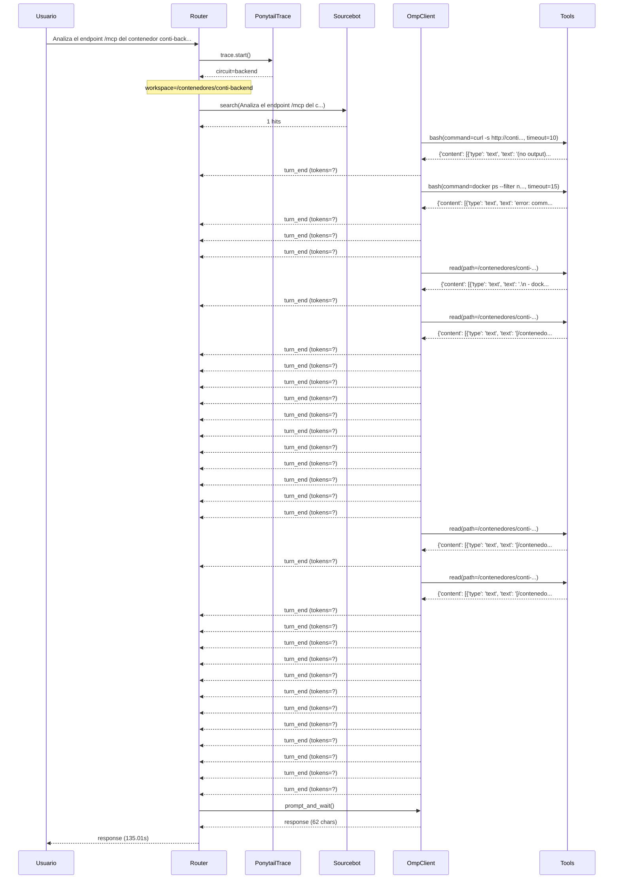

# Traza: Analiza el endpoint /mcp del contenedor conti-backend y documenta todas las tools en un documento mcp_tools_doc.md

- **Circuito**: `backend`
- **Workspace**: `/contenedores/conti-backend`
- **Inicio**: 2026-07-02T20:04:44.065062-03:00
- **Fin**: 2026-07-02T20:06:59.078357-03:00
- **Duración**: 135.013s
- **Eventos**: 46

## Diagrama de Secuencia



## Eventos Detallados

### 1. `start` (2026-07-02T20:04:44.065254-03:00)

```json
{
  "task": "Analiza el endpoint /mcp del contenedor conti-backend y documenta todas las tools en un documento mcp_tools_doc.md",
  "payload_keys": [
    "messages",
    "circuit",
    "_circuit"
  ],
  "circuit": "backend",
  "traces_dir": "/app/logs/ponytail"
}
```

### 2. `circuit_selected` (2026-07-02T20:04:44.067289-03:00)

```json
{
  "id": "backend",
  "workspace": "/contenedores/conti-backend"
}
```

### 3. `sourcebot_search` (2026-07-02T20:04:44.302801-03:00)

```json
{
  "query": "Analiza el endpoint /mcp del contenedor conti-backend y documenta todas las tools en un documento mcp_tools_doc.md",
  "search_query": "conti-backend mcp",
  "matches_requested": 5,
  "hits": 1,
  "results_preview": [
    {
      "repo": "github.com/luisdalmasso/orquestador-contamela",
      "fileName": "docs/ESTADO_REAL.md",
      "language": "Markdown",
      "line": 58,
      "branches": [
        "refs/heads/main"
      ],
      "snippet": "### MCP\n",
      "webUrl": "http://localhost:3010/browse/github.com/luisdalmasso/orquestador-contamela@refs/heads/main/-/blob/docs%2FESTADO_REAL.md"
    }
  ]
}
```

### 4. `omp_tool_start` (2026-07-02T20:04:53.606941-03:00)

```json
{
  "tool": "bash",
  "args": {
    "command": "curl -s http://conti-backend:3000/mcp | head -200",
    "timeout": 10
  },
  "result": null,
  "error": null,
  "ok": true
}
```

### 5. `omp_tool_end` (2026-07-02T20:04:53.813130-03:00)

```json
{
  "tool": "bash",
  "args": {
    "command": "curl -s http://conti-backend:3000/mcp | head -200",
    "timeout": 10
  },
  "result": {
    "content": [
      {
        "type": "text",
        "text": "(no output)\n\nWall time: 0.20 seconds\n\nCommand exited with code 7"
      }
    ],
    "details": {
      "timeoutSeconds": 10,
      "wallTimeMs": 199.8480299999992,
      "exitCode": 7
    },
    "isError": true
  },
  "error": null,
  "ok": true
}
```

### 6. `omp_turn_end` (2026-07-02T20:04:53.831261-03:00)

```json
{
  "event_type": "turn_end",
  "model": "?",
  "provider": "?"
}
```

### 7. `omp_tool_start` (2026-07-02T20:04:57.116196-03:00)

```json
{
  "tool": "bash",
  "args": {
    "command": "docker ps --filter name=conti-backend --format \"{{.Names}} {{.Status}}\" && echo \"---\" && wget -qO- http://conti-backend:3000/mcp || curl -sS http://conti-backend:3000/mcp || echo \"Endpoint no responde\"",
    "timeout": 15
  },
  "result": null,
  "error": null,
  "ok": true
}
```

### 8. `omp_tool_end` (2026-07-02T20:04:57.656540-03:00)

```json
{
  "tool": "bash",
  "args": {
    "command": "docker ps --filter name=conti-backend --format \"{{.Names}} {{.Status}}\" && echo \"---\" && wget -qO- http://conti-backend:3000/mcp || curl -sS http://conti-backend:3000/mcp || echo \"Endpoint no responde\"",
    "timeout": 15
  },
  "result": {
    "content": [
      {
        "type": "text",
        "text": "error: command not found: docker\ncurl: (7) Failed to connect to conti-backend port 3000 after 1 ms: Couldn't connect to server\nEndpoint no responde\n\n\nWall time: 0.47 seconds"
      }
    ],
    "details": {
      "timeoutSeconds": 15,
      "wallTimeMs": 474.74036400000114
    }
  },
  "error": null,
  "ok": true
}
```

### 9. `omp_turn_end` (2026-07-02T20:04:57.690791-03:00)

```json
{
  "event_type": "turn_end",
  "model": "?",
  "provider": "?"
}
```

### 10. `omp_turn_end` (2026-07-02T20:04:58.394155-03:00)

```json
{
  "event_type": "turn_end",
  "model": "?",
  "provider": "?"
}
```

### 11. `omp_turn_end` (2026-07-02T20:04:59.375743-03:00)

```json
{
  "event_type": "turn_end",
  "model": "?",
  "provider": "?"
}
```

### 12. `omp_tool_start` (2026-07-02T20:05:03.019312-03:00)

```json
{
  "tool": "read",
  "args": {
    "path": "/contenedores/conti-backend"
  },
  "result": null,
  "error": null,
  "ok": true
}
```

### 13. `omp_tool_end` (2026-07-02T20:05:03.409699-03:00)

```json
{
  "tool": "read",
  "args": {
    "path": "/contenedores/conti-backend"
  },
  "result": {
    "content": [
      {
        "type": "text",
        "text": ".\n  - docker-compose.conti.yml                       12.7KB    28m ago\n  - tests/                                                   7h ago\n    - __pycache__/                                           7h ago\n    - test_circuit_backend.py                      2.8KB     7h ago\n    - test_circuit_compose.py                      2.8KB     7h ago\n    - test_circuit_desarrollo.py                   3.4KB     7h ago\n    - test_ponytail_trace.py                       20.7KB    1d ago\n    - test_tool_bridge.py                          7.2KB     2d ago\n    - test_omp_client.py                           8.1KB     2d ago\n    - test_code_edit_tools.py                      6.1KB     2d ago\n    - test_git_tools_localops.py                   8.3KB     2d ago\n    - test_git_tools.py                            13.6KB    2d ago\n    - test_rag_search_tools.py                     1.3KB     1w ago\n    - … 10 more\n    - test_rules_loader.py                         1.8KB     2mo ago\n  - docs/                                                    9h ago\n    - rules.md                                     7.2KB     9h ago\n    - onboarding.md                                10.7KB    9h ago\n    - new/                                                   1w ago\n    - hermes-mcp-diagnostico.md                    67.4KB    1w ago\n    - DIAGNOSTICO_CORRECTO_THREADS_15JUN2026.md    23.4KB    1w ago\n    - DIAGNOSTICO_THREADS_CHATUI_15JUN2026.md      13.3KB    1w ago\n    - ESTADO_ACTUAL.md                             6.9KB     1w ago\n    - ESTADO_REAL.md                               16.1KB    1w ago\n    - RESUMEN_PRUEBAS_13JUN2026.md                 3.1KB     1w ago\n    - old/                                                   1mo ago\n    - Odoo-Django-API - Documentación Completa.md  39.8KB    2mo ago\n    - … 1 more\n    - onboarding_brief.md                          75B       2mo ago\n  - sync_upstream.sh                               485B      9h ago\n  - PLAN_3_LLM.md                                  123.5KB   1d ago\n  - .ponytail/                                               1d ago\n    - traces/                                                2m ago\n  - ponytail.md                                    0B        1d ago\n  - docker/                                                  2d ago\n    - conti-omp/                                             1d ago\n  - scripts/                                                 2d ago\n    - e2e/                                                   2d ago\n  - .ruff_cache/                                             2d ago\n    - 0.15.20/                                               7m ago\n    - 0.15.19/                                               1w ago\n    - 0.15.18/                                               1w ago\n    - .gitignore                                   35B       1w ago\n    - CACHEDIR.TAG                                 43B       1w ago\n  - entrypoint_hermes.sh                           8.0KB     2d ago\n  - llm_apis.md                                    0B        5d ago\n  - pase.md                                        25.8KB    1w ago\n  - prompt.md                                      4.8KB     1w ago\n  - requirements.txt                               1.1KB     1w ago\n  - sync_odoo_profiles.sh                          1.4KB     1w ago\n  - google-workspace/                                        1w ago\n    - credentials.json                             643B      1w ago\n    - token.json                                   897B      1w ago\n    - email_summary.py                             13.2KB    3mo ago\n  - hermes-fix.md                                  7.3KB     1w ago\n  - mcp-local.md                                   40.2KB    1w ago\n  - conti_home/                                              1w ago\n    - .ssh/                                                  2h ago\n    - .openhands/                                            6d ago\n    - update_prices_v2.py                          2.5KB     1w ago\n    - update_prices_v3.py                          1.6KB     1w ago\n    - update_prices_v4.py                          1.4KB     1w ago\n    - update_prices_v7.py                          2.6KB     1w ago\n    - update_prices.py                             1.9KB     1w ago\n    - project_ingredients.py                       2.0KB     1w ago\n    - test_odoo_jsonrpc_v2.py                      792B      1w ago\n    - test_odoo_jsonrpc.py                         747B      1w ago\n    - test_odoo_xmlrpc_v3.py                       707B      1w ago\n    - … 71 more\n    - .profile                                     807B      3mo ago\n  - docs.json                                      0B        1w ago\n  - config/                                                  1w ago\n    - app_config.json                              3.5KB     1w ago\n  - app/                                                     1w ago\n    - openhands_agent/                                       9h ago\n    - tools/                                                 1d ago\n    - __pycache__/                                           2d ago\n    - utils/                                                 1w ago\n    - web/                                                   1w ago\n    - services/                                              1w ago\n    - tenants/                                               1w ago\n    - config/                                                1w ago\n    - integrations/                                          1w ago\n    - llm_emulation/                                         1w ago\n    - main.py                                      3.2KB     1w ago\n    - … 7 more\n    - __init__.py                                  31B       2mo ago\n  - Plan_backend.md                                26.9KB    1w ago\n  - USER.md                                        4.2KB     1w ago\n  - Orquestador Chainlitxx.json                    47.7KB    1w ago\n  - PLAN_2_LLM.md                                  43.3KB    1w ago\n  - PLAN_LLM.MD                                    7.9KB     1w ago\n  - Orquestador Chainlit-ant.json                  32.7KB    1w ago\n  - Orquestador Chainlit.json                      59.7KB    1w ago\n  - Orquestador Chainlit0.json                     44.0KB    1w ago\n  - Orquestador Chainlit (7).json                  49.9KB    1w ago\n  - Orquestador Chainlit--.json                    49.7KB    1w ago\n  - CHAT.MD                                        39.6KB    1w ago\n  - Dockerfile                                     4.4KB     1w ago\n  - Ingesta RAG MCP Catolico.json                  15.4KB    1w ago\n  - Ingesta RAG MCP OCRL Mendoza.json              15.4KB    1w ago\n  - .gitignore                                     2.0KB     1w ago\n  - .gitmodules                                    311B      1w ago\n  - CARTA.PY                                       4.1KB     1w ago\n  - sourcebot/                                               1w ago\n    - config.json                                  481B      1w ago\n    - Dockerfile                                   1.1KB     1w ago\n  - vendor/                                                  1w ago\n    - oh-my-pi/                                              2d ago\n    - ponytail/                                              1w ago\n    - OpenHands/                                             1w ago\n  - Dockerfile.old0                                1.5KB     1w ago\n  - config.json                                    1.7KB     1w ago\n  - Dockerfile.old                                 2.6KB     1w ago\n  - docker-compose.yml                             1001B     1w ago\n  - README.md                                      3.6KB     1w ago\n  - chat-catolico.sh.legacy-nanobot                198B      1w ago\n  - entrypoint.sh.legacy-nanobot                   2.8KB     1w ago\n  - docker-compose.conti copy.yml                  2.2KB     1w ago\n  - Dockerfile copy                                3.2KB     1w ago\n  - logterminal.log                                41.0KB    1w ago\n  - backup-entrypoint.sh.legacy-nanobot            4.2KB     1w ago\n  - entrypoint_hermes.sh.pre-nanobot-removal       6.3KB     1w ago\n  - c/                                                       1w ago\n    - Contenedores/                                          1w ago\n  - migration_manifest/                                      1w ago\n    - manifest_catolico.yaml                       392B      1w ago\n    - manifest_contihome.yaml                      652B      1w ago\n    - manifest_mendoza.yaml                        817B      1w ago\n    - manifest_odoo.yaml                           357B      1w ago\n    - manifest_resto.yaml                          473B      1w ago\n    - README.md                                    1.0KB     1w ago\n  - claw_data/                                               1mo ago\n  - chats-plans/                                             1mo ago\n    - reporte_diagnostico_skills_y_odoo.md         13.0KB    1mo ago\n    - reporte_error_gateway.md                     4.0KB     1mo ago\n    - Plan%3A Herramienta visual de recomenda.md   1.8KB     1mo ago\n    - plan_backend_ai_odoo.md                      13.1KB    1mo ago\n    - Plan_mozo_virtual.md                         38.4KB    1mo ago\n    - readme_conti_ai.md                           22.5KB    1mo ago\n    - plan_mozos.md                                6.9KB     1mo ago\n    - Mesa identifier.md                           484B      1mo ago\n    - Pan_Conti_ia.md                              14.0KB    1mo ago\n    - chat_odoo.md                                 15.0KB    1mo ago\n    - Conti_ia.md                                  6.1KB     1mo ago\n    - … 3 more\n    - q-dev-chat-2026-05-12.md                     3.5KB     1mo ago\n  - .sixth/                                                  1mo ago\n    - skills/                                                1mo ago\n  - .pytest_cache/                                           2mo ago\n    - v/                                                     2mo ago\n    - .gitignore                                   37B       2mo ago\n    - CACHEDIR.TAG                                 191B      2mo ago\n    - README.md                                    302B      2mo ago\n  - repo/                                                    2mo ago\n    - nanobot/                                               2mo ago\n  - voice/                                                   3mo ago\n    - voice_ref.wav                                1.1MB     3mo ago\n    - voice_manager.py                             1.8KB     3mo ago\n\n[1 results limit reached. Use limit=2 for more]"
      }
    ],
    "details": {
      "isDirectory": true,
      "resolvedPath": "/contenedores/conti-backend",
      "meta": {
        "source": {
          "type": "path",
          "value": "/contenedores/conti-backend"
        },
        "limits": {
          "resultLimit": {
            "reached": 1,
            "suggestion": 2
          }
        }
      }
    }
  },
  "error": null,
  "ok": true
}
```

### 14. `omp_turn_end` (2026-07-02T20:05:03.449418-03:00)

```json
{
  "event_type": "turn_end",
  "model": "?",
  "provider": "?"
}
```

### 15. `omp_tool_start` (2026-07-02T20:05:06.209940-03:00)

```json
{
  "tool": "read",
  "args": {
    "path": "/contenedores/conti-backend/app/main.py"
  },
  "result": null,
  "error": null,
  "ok": true
}
```

### 16. `omp_tool_end` (2026-07-02T20:05:06.943596-03:00)

```json
{
  "tool": "read",
  "args": {
    "path": "/contenedores/conti-backend/app/main.py"
  },
  "result": {
    "content": [
      {
        "type": "text",
        "text": "[/contenedores/conti-backend/app/main.py#125F]\n1:from __future__ import annotations\n…\n17:from app.web.router import WEB_DIR, router as web_router\n18:\n19:configure_logging()\n20:\n21:app = FastAPI(title=\"Conti Backend\", version=\"0.1.0\")\n22:onboarding_service = OnboardingService()\n23:rules_service = RulesService()\n24:app.middleware(\"http\")(add_request_id)\n25:app.mount(\"/ui/static\", StaticFiles(directory=str(WEB_DIR / \"static\")), name=\"ui-static\")\n26:app.include_router(web_router)\n27:app.include_router(mcp_router)\n28:app.include_router(llm_router)\n29:app.include_router(chat_router)\n30:app.include_router(mercadopago_router)\n31:app.include_router(openhands_router, prefix=\"/agent\", tags=[\"agent\"])\n32:\n33:\n34:@app.get(\"/health\")\n35:def health() -> dict:\n36:    config = load_config()\n37:    service = HealthService(config)\n38:    return service.build_status()\n39:\n40:\n41:@app.get(\"/config\")\n42:def get_config() -> dict:\n43:    config = load_config()\n…\n48:    }\n49:\n50:\n51:@app.post(\"/config/reload\")\n52:def post_reload_config() -> dict:\n53:    config = reload_config()\n…\n57:    }\n58:\n59:\n60:@app.get(\"/onboarding\")\n61:def get_onboarding(brief: bool = Query(default=False)) -> dict:\n62:    payload = onboarding_service.get_onboarding(brief=brief)\n…\n66:    }\n67:\n68:\n69:@app.post(\"/onboarding/reload\")\n70:def post_reload_onboarding(brief: bool = Query(default=False)) -> dict:\n71:    payload = onboarding_service.reload(brief=brief)\n…\n75:    }\n76:\n77:\n78:@app.get(\"/rules\")\n79:def get_rules() -> dict:\n80:    payload = rules_service.get_rules()\n…\n89:    }\n90:\n91:\n92:@app.get(\"/rules/raw\")\n93:def get_rules_raw() -> dict:\n94:    payload = rules_service.get_rules()\n…\n99:    }\n100:\n101:\n102:@app.post(\"/rules/reload\")\n103:def post_reload_rules() -> dict:\n104:    payload = rules_service.reload()\n…\n113:    }\n\n[…48ln elided; re-read needed ranges, e.g. /contenedores/conti-backend/app/main.py:2-16,44-47]"
      }
    ],
    "details": {
      "displayContent": {
        "text": "from __future__ import annotations\n…\nfrom app.web.router import WEB_DIR, router as web_router\n\nconfigure_logging()\n\napp = FastAPI(title=\"Conti Backend\", version=\"0.1.0\")\nonboarding_service = OnboardingService()\nrules_service = RulesService()\napp.middleware(\"http\")(add_request_id)\napp.mount(\"/ui/static\", StaticFiles(directory=str(WEB_DIR / \"static\")), name=\"ui-static\")\napp.include_router(web_router)\napp.include_router(mcp_router)\napp.include_router(llm_router)\napp.include_router(chat_router)\napp.include_router(mercadopago_router)\napp.include_router(openhands_router, prefix=\"/agent\", tags=[\"agent\"])\n\n\n@app.get(\"/health\")\ndef health() -> dict:\n    config = load_config()\n    service = HealthService(config)\n    return service.build_status()\n\n\n@app.get(\"/config\")\ndef get_config() -> dict:\n    config = load_config()\n…\n    }\n\n\n@app.post(\"/config/reload\")\ndef post_reload_config() -> dict:\n    config = reload_config()\n…\n    }\n\n\n@app.get(\"/onboarding\")\ndef get_onboarding(brief: bool = Query(default=False)) -> dict:\n    payload = onboarding_service.get_onboarding(brief=brief)\n…\n    }\n\n\n@app.post(\"/onboarding/reload\")\ndef post_reload_onboarding(brief: bool = Query(default=False)) -> dict:\n    payload = onboarding_service.reload(brief=brief)\n…\n    }\n\n\n@app.get(\"/rules\")\ndef get_rules() -> dict:\n    payload = rules_service.get_rules()\n…\n    }\n\n\n@app.get(\"/rules/raw\")\ndef get_rules_raw() -> dict:\n    payload = rules_service.get_rules()\n…\n    }\n\n\n@app.post(\"/rules/reload\")\ndef post_reload_rules() -> dict:\n    payload = rules_service.reload()\n…\n    }",
        "startLine": 1
      },
      "summary": {
        "lines": 73,
        "elidedSpans": 8,
        "elidedLines": 48
      },
      "meta": {
        "source": {
          "type": "path",
          "value": "/contenedores/conti-backend/app/main.py"
        }
      }
    }
  },
  "error": null,
  "ok": true
}
```

### 17. `omp_turn_end` (2026-07-02T20:05:06.944036-03:00)

```json
{
  "event_type": "turn_end",
  "model": "?",
  "provider": "?"
}
```

### 18. `omp_turn_end` (2026-07-02T20:05:07.467455-03:00)

```json
{
  "event_type": "turn_end",
  "model": "?",
  "provider": "?"
}
```

### 19. `omp_turn_end` (2026-07-02T20:05:08.676898-03:00)

```json
{
  "event_type": "turn_end",
  "model": "?",
  "provider": "?"
}
```

### 20. `omp_turn_end` (2026-07-02T20:05:10.524762-03:00)

```json
{
  "event_type": "turn_end",
  "model": "?",
  "provider": "?"
}
```

### 21. `omp_turn_end` (2026-07-02T20:05:12.809479-03:00)

```json
{
  "event_type": "turn_end",
  "model": "?",
  "provider": "?"
}
```

### 22. `omp_turn_end` (2026-07-02T20:05:17.710707-03:00)

```json
{
  "event_type": "turn_end",
  "model": "?",
  "provider": "?"
}
```

### 23. `omp_turn_end` (2026-07-02T20:05:26.408019-03:00)

```json
{
  "event_type": "turn_end",
  "model": "?",
  "provider": "?"
}
```

### 24. `omp_turn_end` (2026-07-02T20:05:33.500231-03:00)

```json
{
  "event_type": "turn_end",
  "model": "?",
  "provider": "?"
}
```

### 25. `omp_turn_end` (2026-07-02T20:05:40.376823-03:00)

```json
{
  "event_type": "turn_end",
  "model": "?",
  "provider": "?"
}
```

### 26. `omp_turn_end` (2026-07-02T20:05:47.025477-03:00)

```json
{
  "event_type": "turn_end",
  "model": "?",
  "provider": "?"
}
```

### 27. `omp_turn_end` (2026-07-02T20:05:54.333488-03:00)

```json
{
  "event_type": "turn_end",
  "model": "?",
  "provider": "?"
}
```

### 28. `omp_tool_start` (2026-07-02T20:06:04.783008-03:00)

```json
{
  "tool": "read",
  "args": {
    "path": "/contenedores/conti-backend/app/main.py:1-125"
  },
  "result": null,
  "error": null,
  "ok": true
}
```

### 29. `omp_tool_end` (2026-07-02T20:06:04.849452-03:00)

```json
{
  "tool": "read",
  "args": {
    "path": "/contenedores/conti-backend/app/main.py:1-125"
  },
  "result": {
    "content": [
      {
        "type": "text",
        "text": "[/contenedores/conti-backend/app/main.py#125F]\n1:from __future__ import annotations\n2:\n3:from fastapi import FastAPI\n4:from fastapi import Query\n5:from fastapi.staticfiles import StaticFiles\n6:\n7:from app.chat.router import router as chat_router\n8:from app.config.loader import load_config, reload_config\n9:from app.integrations.mercadopago_router import router as mercadopago_router\n10:from app.llm_emulation.router import router as llm_router\n11:from app.mcp.router import router as mcp_router\n12:from app.openhands_agent.router import router as openhands_router\n13:from app.services.health_service import HealthService\n14:from app.services.onboarding_service import OnboardingService\n15:from app.services.rules_service import RulesService\n16:from app.utils.logging import add_request_id, configure_logging\n17:from app.web.router import WEB_DIR, router as web_router\n18:\n19:configure_logging()\n20:\n21:app = FastAPI(title=\"Conti Backend\", version=\"0.1.0\")\n22:onboarding_service = OnboardingService()\n23:rules_service = RulesService()\n24:app.middleware(\"http\")(add_request_id)\n25:app.mount(\"/ui/static\", StaticFiles(directory=str(WEB_DIR / \"static\")), name=\"ui-static\")\n26:app.include_router(web_router)\n27:app.include_router(mcp_router)\n28:app.include_router(llm_router)\n29:app.include_router(chat_router)\n30:app.include_router(mercadopago_router)\n31:app.include_router(openhands_router, prefix=\"/agent\", tags=[\"agent\"])\n32:\n33:\n34:@app.get(\"/health\")\n35:def health() -> dict:\n36:    config = load_config()\n37:    service = HealthService(config)\n38:    return service.build_status()\n39:\n40:\n41:@app.get(\"/config\")\n42:def get_config() -> dict:\n43:    config = load_config()\n44:    return {\n45:        \"status\": \"ok\",\n46:        \"config\": config.redacted_dict(),\n47:        \"paths\": config.resolved_paths(),\n48:    }\n49:\n50:\n51:@app.post(\"/config/reload\")\n52:def post_reload_config() -> dict:\n53:    config = reload_config()\n54:    return {\n55:        \"status\": \"reloaded\",\n56:        \"config\": config.redacted_dict(),\n57:    }\n58:\n59:\n60:@app.get(\"/onboarding\")\n61:def get_onboarding(brief: bool = Query(default=False)) -> dict:\n62:    payload = onboarding_service.get_onboarding(brief=brief)\n63:    return {\n64:        \"status\": \"ok\",\n65:        **payload,\n66:    }\n67:\n68:\n69:@app.post(\"/onboarding/reload\")\n70:def post_reload_onboarding(brief: bool = Query(default=False)) -> dict:\n71:    payload = onboarding_service.reload(brief=brief)\n72:    return {\n73:        \"status\": \"reloaded\",\n74:        **payload,\n75:    }\n76:\n77:\n78:@app.get(\"/rules\")\n79:def get_rules() -> dict:\n80:    payload = rules_service.get_rules()\n81:    return {\n82:        \"status\": \"ok\",\n83:        \"configured_path\": payload[\"configured_path\"],\n84:        \"resolved_path\": payload[\"resolved_path\"],\n85:        \"source_paths\": payload[\"source_paths\"],\n86:        \"checksum\": payload[\"checksum\"],\n87:        \"mtime\": payload[\"mtime\"],\n88:        \"content\": payload[\"content\"],\n89:    }\n90:\n91:\n92:@app.get(\"/rules/raw\")\n93:def get_rules_raw() -> dict:\n94:    payload = rules_service.get_rules()\n95:    return {\n96:        \"status\": \"ok\",\n97:        \"raw\": payload[\"raw\"],\n98:        \"source_paths\": payload[\"source_paths\"],\n99:    }\n100:\n101:\n102:@app.post(\"/rules/reload\")\n103:def post_reload_rules() -> dict:\n104:    payload = rules_service.reload()\n105:    return {\n106:        \"status\": \"reloaded\",\n107:        \"configured_path\": payload[\"configured_path\"],\n108:        \"resolved_path\": payload[\"resolved_path\"],\n109:        \"source_paths\": payload[\"source_paths\"],\n110:        \"checksum\": payload[\"checksum\"],\n111:        \"mtime\": payload[\"mtime\"],\n112:        \"content\": payload[\"content\"],\n113:    }\n114:"
      }
    ],
    "details": {
      "displayContent": {
        "text": "from __future__ import annotations\n\nfrom fastapi import FastAPI\nfrom fastapi import Query\nfrom fastapi.staticfiles import StaticFiles\n\nfrom app.chat.router import router as chat_router\nfrom app.config.loader import load_config, reload_config\nfrom app.integrations.mercadopago_router import router as mercadopago_router\nfrom app.llm_emulation.router import router as llm_router\nfrom app.mcp.router import router as mcp_router\nfrom app.openhands_agent.router import router as openhands_router\nfrom app.services.health_service import HealthService\nfrom app.services.onboarding_service import OnboardingService\nfrom app.services.rules_service import RulesService\nfrom app.utils.logging import add_request_id, configure_logging\nfrom app.web.router import WEB_DIR, router as web_router\n\nconfigure_logging()\n\napp = FastAPI(title=\"Conti Backend\", version=\"0.1.0\")\nonboarding_service = OnboardingService()\nrules_service = RulesService()\napp.middleware(\"http\")(add_request_id)\napp.mount(\"/ui/static\", StaticFiles(directory=str(WEB_DIR / \"static\")), name=\"ui-static\")\napp.include_router(web_router)\napp.include_router(mcp_router)\napp.include_router(llm_router)\napp.include_router(chat_router)\napp.include_router(mercadopago_router)\napp.include_router(openhands_router, prefix=\"/agent\", tags=[\"agent\"])\n\n\n@app.get(\"/health\")\ndef health() -> dict:\n    config = load_config()\n    service = HealthService(config)\n    return service.build_status()\n\n\n@app.get(\"/config\")\ndef get_config() -> dict:\n    config = load_config()\n    return {\n        \"status\": \"ok\",\n        \"config\": config.redacted_dict(),\n        \"paths\": config.resolved_paths(),\n    }\n\n\n@app.post(\"/config/reload\")\ndef post_reload_config() -> dict:\n    config = reload_config()\n    return {\n        \"status\": \"reloaded\",\n        \"config\": config.redacted_dict(),\n    }\n\n\n@app.get(\"/onboarding\")\ndef get_onboarding(brief: bool = Query(default=False)) -> dict:\n    payload = onboarding_service.get_onboarding(brief=brief)\n    return {\n        \"status\": \"ok\",\n        **payload,\n    }\n\n\n@app.post(\"/onboarding/reload\")\ndef post_reload_onboarding(brief: bool = Query(default=False)) -> dict:\n    payload = onboarding_service.reload(brief=brief)\n    return {\n        \"status\": \"reloaded\",\n        **payload,\n    }\n\n\n@app.get(\"/rules\")\ndef get_rules() -> dict:\n    payload = rules_service.get_rules()\n    return {\n        \"status\": \"ok\",\n        \"configured_path\": payload[\"configured_path\"],\n        \"resolved_path\": payload[\"resolved_path\"],\n        \"source_paths\": payload[\"source_paths\"],\n        \"checksum\": payload[\"checksum\"],\n        \"mtime\": payload[\"mtime\"],\n        \"content\": payload[\"content\"],\n    }\n\n\n@app.get(\"/rules/raw\")\ndef get_rules_raw() -> dict:\n    payload = rules_service.get_rules()\n    return {\n        \"status\": \"ok\",\n        \"raw\": payload[\"raw\"],\n        \"source_paths\": payload[\"source_paths\"],\n    }\n\n\n@app.post(\"/rules/reload\")\ndef post_reload_rules() -> dict:\n    payload = rules_service.reload()\n    return {\n        \"status\": \"reloaded\",\n        \"configured_path\": payload[\"configured_path\"],\n        \"resolved_path\": payload[\"resolved_path\"],\n        \"source_paths\": payload[\"source_paths\"],\n        \"checksum\": payload[\"checksum\"],\n        \"mtime\": payload[\"mtime\"],\n        \"content\": payload[\"content\"],\n    }\n",
        "startLine": 1,
        "lineNumbers": [
          1,
          2,
          3,
          4,
          5,
          6,
          7,
          8,
          9,
          10,
          11,
          12,
          13,
          14,
          15,
          16,
          17,
          18,
          19,
          20,
          21,
          22,
          23,
          24,
          25,
          26,
          27,
          28,
          29,
          30,
          31,
          32,
          33,
          34,
          35,
          36,
          37,
          38,
          39,
          40,
          41,
          42,
          43,
          44,
          45,
          46,
          47,
          48,
          49,
          50,
          51,
          52,
          53,
          54,
          55,
          56,
          57,
          58,
          59,
          60,
          61,
          62,
          63,
          64,
          65,
          66,
          67,
          68,
          69,
          70,
          71,
          72,
          73,
          74,
          75,
          76,
          77,
          78,
          79,
          80,
          81,
          82,
          83,
          84,
          85,
          86,
          87,
          88,
          89,
          90,
          91,
          92,
          93,
          94,
          95,
          96,
          97,
          98,
          99,
          100,
          101,
          102,
          103,
          104,
          105,
          106,
          107,
          108,
          109,
          110,
          111,
          112,
          113,
          114
        ]
      },
      "meta": {
        "source": {
          "type": "path",
          "value": "/contenedores/conti-backend/app/main.py"
        }
      }
    }
  },
  "error": null,
  "ok": true
}
```

### 30. `omp_turn_end` (2026-07-02T20:06:04.871549-03:00)

```json
{
  "event_type": "turn_end",
  "model": "?",
  "provider": "?"
}
```

### 31. `omp_tool_start` (2026-07-02T20:06:07.542251-03:00)

```json
{
  "tool": "read",
  "args": {
    "path": "/contenedores/conti-backend/app/mcp/router.py"
  },
  "result": null,
  "error": null,
  "ok": true
}
```

### 32. `omp_tool_end` (2026-07-02T20:06:07.600809-03:00)

```json
{
  "tool": "read",
  "args": {
    "path": "/contenedores/conti-backend/app/mcp/router.py"
  },
  "result": {
    "content": [
      {
        "type": "text",
        "text": "[/contenedores/conti-backend/app/mcp/router.py#8B56]\n1:from __future__ import annotations\n…\n14:from app.services.registry_service import registry_service\n15:\n16:\n17:router = APIRouter(prefix=\"/mcp\", tags=[\"mcp\"])\n18:\n19:\n20:# --- Modelos de Respuesta para Swagger ---\n21:class MCPRootResponse(BaseModel):\n22:    status: str = Field(default=\"ok\")\n…\n26:    tools_count: int = Field(..., description=\"Cantidad de herramientas registradas\")\n27:\n28:class MCPToolItem(BaseModel):\n29:    name: str = Field(..., description=\"Nombre de la herramienta\")\n30:    description: str = Field(default=\"\", description=\"Descripción funcional de la herramienta\")\n31:    inputSchema: dict[str, Any] = Field(..., description=\"JSON Schema de los argumentos esperados\")\n32:\n33:class MCPToolsResponse(BaseModel):\n34:    status: str = Field(default=\"ok\")\n…\n53:    }\n54:\n55:class MCPExecuteResponse(BaseModel):\n56:    success: bool = Field(..., description=\"Indica si la ejecución fue exitosa\")\n57:    result: Any | None = Field(default=None, description=\"Resultado de la ejecución de la herramienta\")\n58:    error: str | None = Field(default=None, description=\"Mensaje de error si la ejecución falló\")\n59:\n60:\n61:def _mcp_root_payload() -> dict:\n62:    registry = registry_service()\n…\n76:    }\n77:\n78:\n79:def _jsonrpc_success(request_id, result: dict | list | str | int | float | None) -> dict:\n80:    return {\"jsonrpc\": \"2.0\", \"id\": request_id, \"result\": result}\n81:\n82:\n83:def _jsonrpc_error(request_id, code: int, message: str, data: dict | None = None) -> JSONResponse:\n84:    payload = {\n…\n94:    return JSONResponse(status_code=200, content=payload)\n95:\n96:\n97:def _mcp_tools_payload() -> list[dict]:\n98:    registry = registry_service()\n…\n108:    return tools\n109:\n110:\n111:def _mcp_tool_result(tool_name: str, result, is_error: bool = False) -> dict:\n112:    text = result if isinstance(result, str) else json.dumps(result, ensure_ascii=False)\n…\n121:    return payload\n122:\n123:\n124:async def _sse_event_stream(request: Request, post_path: str):\n125:    session_id = uuid4().hex\n…\n133:        yield \": keep-alive\\n\\n\"\n134:\n135:\n136:def _sse_response(request: Request, post_path: str = \"/mcp\") -> StreamingResponse:\n137-145:    return StreamingResponse( … )\n146:\n147:\n148-153:@router.get( … )\n154-158:@router.get( … )\n159:def get_mcp_root(request: Request):\n160:    accept = request.headers.get(\"accept\", \"\")\n…\n163:    return _mcp_root_payload()\n164:\n165:\n166-170:@router.post( … )\n171-174:@router.post( … )\n175:def post_mcp_root(request: dict):\n176:    request_id = request.get(\"id\")\n…\n219:    return _jsonrpc_error(request_id, -32601, f\"Método no soportado: {method}\")\n220:\n221:\n222-227:@router.get( … )\n228:def get_mcp_tools() -> dict:\n229-232:    return { … }\n233:\n234:\n235-240:@router.post( … )\n241:def post_mcp_call(request: MCPCallRequest) -> ToolCallResponse:\n242:    registry = registry_service()\n…\n249:        raise HTTPException(status_code=400, detail=str(exc)) from exc\n250:\n251:\n252-257:@router.post( … )\n258:def post_mcp_execute(request: dict):\n259:    tool_name = request.get(\"tool_name\") or request.get(\"tool\") or request.get(\"name\")\n…\n271:        return JSONResponse(status_code=400, content={\"success\": False, \"result\": None, \"error\": str(exc)})\n272:\n273:\n274-278:@router.get( … )\n279-282:@router.get( … )\n283:def get_mcp_sse(request: Request) -> StreamingResponse:\n284:    return _sse_response(request, post_path=\"/mcp\")\n285:\n286:\n287-291:@router.post( … )\n292-295:@router.post( … )\n296:def post_mcp_sse(request: dict):\n297:    return post_mcp_root(request)\n\n[…183ln elided; re-read needed ranges, e.g. /contenedores/conti-backend/app/mcp/router.py:2-13,23-25]"
      }
    ],
    "details": {
      "displayContent": {
        "text": "from __future__ import annotations\n…\nfrom app.services.registry_service import registry_service\n\n\nrouter = APIRouter(prefix=\"/mcp\", tags=[\"mcp\"])\n\n\n# --- Modelos de Respuesta para Swagger ---\nclass MCPRootResponse(BaseModel):\n    status: str = Field(default=\"ok\")\n…\n    tools_count: int = Field(..., description=\"Cantidad de herramientas registradas\")\n\nclass MCPToolItem(BaseModel):\n    name: str = Field(..., description=\"Nombre de la herramienta\")\n    description: str = Field(default=\"\", description=\"Descripción funcional de la herramienta\")\n    inputSchema: dict[str, Any] = Field(..., description=\"JSON Schema de los argumentos esperados\")\n\nclass MCPToolsResponse(BaseModel):\n    status: str = Field(default=\"ok\")\n…\n    }\n\nclass MCPExecuteResponse(BaseModel):\n    success: bool = Field(..., description=\"Indica si la ejecución fue exitosa\")\n    result: Any | None = Field(default=None, description=\"Resultado de la ejecución de la herramienta\")\n    error: str | None = Field(default=None, description=\"Mensaje de error si la ejecución falló\")\n\n\ndef _mcp_root_payload() -> dict:\n    registry = registry_service()\n…\n    }\n\n\ndef _jsonrpc_success(request_id, result: dict | list | str | int | float | None) -> dict:\n    return {\"jsonrpc\": \"2.0\", \"id\": request_id, \"result\": result}\n\n\ndef _jsonrpc_error(request_id, code: int, message: str, data: dict | None = None) -> JSONResponse:\n    payload = {\n…\n    return JSONResponse(status_code=200, content=payload)\n\n\ndef _mcp_tools_payload() -> list[dict]:\n    registry = registry_service()\n…\n    return tools\n\n\ndef _mcp_tool_result(tool_name: str, result, is_error: bool = False) -> dict:\n    text = result if isinstance(result, str) else json.dumps(result, ensure_ascii=False)\n…\n    return payload\n\n\nasync def _sse_event_stream(request: Request, post_path: str):\n    session_id = uuid4().hex\n…\n        yield \": keep-alive\\n\\n\"\n\n\ndef _sse_response(request: Request, post_path: str = \"/mcp\") -> StreamingResponse:\n    return StreamingResponse( … )\n\n\n@router.get( … )\n@router.get( … )\ndef get_mcp_root(request: Request):\n    accept = request.headers.get(\"accept\", \"\")\n…\n    return _mcp_root_payload()\n\n\n@router.post( … )\n@router.post( … )\ndef post_mcp_root(request: dict):\n    request_id = request.get(\"id\")\n…\n    return _jsonrpc_error(request_id, -32601, f\"Método no soportado: {method}\")\n\n\n@router.get( … )\ndef get_mcp_tools() -> dict:\n    return { … }\n\n\n@router.post( … )\ndef post_mcp_call(request: MCPCallRequest) -> ToolCallResponse:\n    registry = registry_service()\n…\n        raise HTTPException(status_code=400, detail=str(exc)) from exc\n\n\n@router.post( … )\ndef post_mcp_execute(request: dict):\n    tool_name = request.get(\"tool_name\") or request.get(\"tool\") or request.get(\"name\")\n…\n        return JSONResponse(status_code=400, content={\"success\": False, \"result\": None, \"error\": str(exc)})\n\n\n@router.get( … )\n@router.get( … )\ndef get_mcp_sse(request: Request) -> StreamingResponse:\n    return _sse_response(request, post_path=\"/mcp\")\n\n\n@router.post( … )\n@router.post( … )\ndef post_mcp_sse(request: dict):\n    return post_mcp_root(request)",
        "startLine": 1
      },
      "summary": {
        "lines": 113,
        "elidedSpans": 25,
        "elidedLines": 183
      },
      "meta": {
        "source": {
          "type": "path",
          "value": "/contenedores/conti-backend/app/mcp/router.py"
        }
      }
    }
  },
  "error": null,
  "ok": true
}
```

### 33. `omp_turn_end` (2026-07-02T20:06:07.700549-03:00)

```json
{
  "event_type": "turn_end",
  "model": "?",
  "provider": "?"
}
```

### 34. `omp_turn_end` (2026-07-02T20:06:08.208533-03:00)

```json
{
  "event_type": "turn_end",
  "model": "?",
  "provider": "?"
}
```

### 35. `omp_turn_end` (2026-07-02T20:06:09.198931-03:00)

```json
{
  "event_type": "turn_end",
  "model": "?",
  "provider": "?"
}
```

### 36. `omp_turn_end` (2026-07-02T20:06:10.598226-03:00)

```json
{
  "event_type": "turn_end",
  "model": "?",
  "provider": "?"
}
```

### 37. `omp_turn_end` (2026-07-02T20:06:12.704449-03:00)

```json
{
  "event_type": "turn_end",
  "model": "?",
  "provider": "?"
}
```

### 38. `omp_turn_end` (2026-07-02T20:06:16.399032-03:00)

```json
{
  "event_type": "turn_end",
  "model": "?",
  "provider": "?"
}
```

### 39. `omp_turn_end` (2026-07-02T20:06:23.400289-03:00)

```json
{
  "event_type": "turn_end",
  "model": "?",
  "provider": "?"
}
```

### 40. `omp_turn_end` (2026-07-02T20:06:30.261858-03:00)

```json
{
  "event_type": "turn_end",
  "model": "?",
  "provider": "?"
}
```

### 41. `omp_turn_end` (2026-07-02T20:06:38.135237-03:00)

```json
{
  "event_type": "turn_end",
  "model": "?",
  "provider": "?"
}
```

### 42. `omp_turn_end` (2026-07-02T20:06:44.769855-03:00)

```json
{
  "event_type": "turn_end",
  "model": "?",
  "provider": "?"
}
```

### 43. `omp_turn_end` (2026-07-02T20:06:52.046966-03:00)

```json
{
  "event_type": "turn_end",
  "model": "?",
  "provider": "?"
}
```

### 44. `omp_turn_end` (2026-07-02T20:06:58.876961-03:00)

```json
{
  "event_type": "turn_end",
  "model": "?",
  "provider": "?"
}
```

### 45. `openhands_invoke` (2026-07-02T20:06:59.075257-03:00)

```json
{
  "circuit": "backend",
  "len": 62
}
```

### 46. `end` (2026-07-02T20:06:59.075294-03:00)

```json
{
  "duration_s": 135.01
}
```

## Prompt Completo (input del usuario)

```text
Analiza el endpoint /mcp del contenedor conti-backend y documenta todas las tools en un documento mcp_tools_doc.md
```
