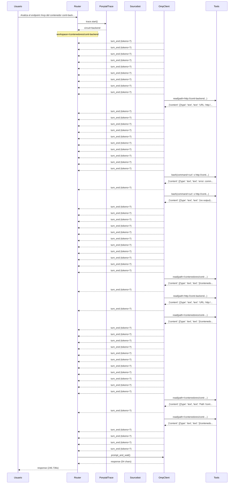

# Traza: Analiza el endpoint /mcp del contenedor conti-backend y documenta todas las tools en un documento mcp_tools_doc.md

- **Circuito**: `backend`
- **Workspace**: `/contenedores/conti-backend`
- **Inicio**: 2026-07-02T21:46:08.750882-03:00
- **Fin**: 2026-07-02T21:50:15.490960-03:00
- **Duración**: 246.74s
- **Eventos**: 73

## Diagrama de Secuencia



## Eventos Detallados

### 1. `start` (2026-07-02T21:46:08.750975-03:00)

```json
{
  "task": "Analiza el endpoint /mcp del contenedor conti-backend y documenta todas las tools en un documento mcp_tools_doc.md",
  "payload_keys": [
    "messages",
    "circuit",
    "_circuit",
    "_session"
  ],
  "circuit": "backend",
  "traces_dir": "/app/logs/ponytail"
}
```

### 2. `circuit_selected` (2026-07-02T21:46:08.752969-03:00)

```json
{
  "id": "backend",
  "workspace": "/contenedores/conti-backend",
  "session_id": "9ffbd5854d7b",
  "is_new_session": true
}
```

### 3. `governance_tool` (2026-07-02T21:46:08.754565-03:00)

```json
{
  "tool": "get_onboarding",
  "chars": 195
}
```

### 4. `governance_tool` (2026-07-02T21:46:08.756058-03:00)

```json
{
  "tool": "get_rules",
  "chars": 438
}
```

### 5. `governance_tool` (2026-07-02T21:46:08.758266-03:00)

```json
{
  "tool": "get_config",
  "chars": 0,
  "warning": "empty"
}
```

### 6. `governance_injected` (2026-07-02T21:46:08.758279-03:00)

```json
{
  "onboarding_len": 671,
  "is_new_session": true
}
```

### 7. `omp_turn_end` (2026-07-02T21:46:16.038093-03:00)

```json
{
  "event_type": "turn_end",
  "model": "?",
  "provider": "?"
}
```

### 8. `omp_turn_end` (2026-07-02T21:46:17.340876-03:00)

```json
{
  "event_type": "turn_end",
  "model": "?",
  "provider": "?"
}
```

### 9. `omp_turn_end` (2026-07-02T21:46:19.177775-03:00)

```json
{
  "event_type": "turn_end",
  "model": "?",
  "provider": "?"
}
```

### 10. `omp_turn_end` (2026-07-02T21:46:22.468728-03:00)

```json
{
  "event_type": "turn_end",
  "model": "?",
  "provider": "?"
}
```

### 11. `omp_turn_end` (2026-07-02T21:46:27.505919-03:00)

```json
{
  "event_type": "turn_end",
  "model": "?",
  "provider": "?"
}
```

### 12. `omp_turn_end` (2026-07-02T21:46:35.534887-03:00)

```json
{
  "event_type": "turn_end",
  "model": "?",
  "provider": "?"
}
```

### 13. `omp_turn_end` (2026-07-02T21:46:42.914080-03:00)

```json
{
  "event_type": "turn_end",
  "model": "?",
  "provider": "?"
}
```

### 14. `omp_turn_end` (2026-07-02T21:46:50.807890-03:00)

```json
{
  "event_type": "turn_end",
  "model": "?",
  "provider": "?"
}
```

### 15. `omp_turn_end` (2026-07-02T21:46:59.742885-03:00)

```json
{
  "event_type": "turn_end",
  "model": "?",
  "provider": "?"
}
```

### 16. `omp_tool_start` (2026-07-02T21:47:10.244392-03:00)

```json
{
  "tool": "read",
  "args": {
    "path": "http://conti-backend:8000/mcp"
  },
  "result": null,
  "error": null,
  "ok": true
}
```

### 17. `omp_tool_end` (2026-07-02T21:47:10.630943-03:00)

```json
{
  "tool": "read",
  "args": {
    "path": "http://conti-backend:8000/mcp"
  },
  "result": {
    "content": [
      {
        "type": "text",
        "text": "URL: http://conti-backend:8000/mcp\nContent-Type: unknown\nMethod: failed\nNotes: Failed to fetch URL; Cause: Unable to connect. Is the computer able to access the url?\n\n---\n\n"
      }
    ],
    "details": {
      "kind": "url",
      "url": "http://conti-backend:8000/mcp",
      "finalUrl": "http://conti-backend:8000/mcp",
      "contentType": "unknown",
      "method": "failed",
      "truncated": false,
      "notes": [
        "Failed to fetch URL",
        "Cause: Unable to connect. Is the computer able to access the url?"
      ],
      "meta": {
        "source": {
          "type": "url",
          "value": "http://conti-backend:8000/mcp"
        }
      }
    }
  },
  "error": null,
  "ok": true
}
```

### 18. `omp_turn_end` (2026-07-02T21:47:10.676548-03:00)

```json
{
  "event_type": "turn_end",
  "model": "?",
  "provider": "?"
}
```

### 19. `omp_turn_end` (2026-07-02T21:47:11.685346-03:00)

```json
{
  "event_type": "turn_end",
  "model": "?",
  "provider": "?"
}
```

### 20. `omp_turn_end` (2026-07-02T21:47:13.560815-03:00)

```json
{
  "event_type": "turn_end",
  "model": "?",
  "provider": "?"
}
```

### 21. `omp_turn_end` (2026-07-02T21:47:15.609357-03:00)

```json
{
  "event_type": "turn_end",
  "model": "?",
  "provider": "?"
}
```

### 22. `omp_turn_end` (2026-07-02T21:47:18.611623-03:00)

```json
{
  "event_type": "turn_end",
  "model": "?",
  "provider": "?"
}
```

### 23. `omp_turn_end` (2026-07-02T21:47:24.194209-03:00)

```json
{
  "event_type": "turn_end",
  "model": "?",
  "provider": "?"
}
```

### 24. `omp_turn_end` (2026-07-02T21:47:31.694779-03:00)

```json
{
  "event_type": "turn_end",
  "model": "?",
  "provider": "?"
}
```

### 25. `omp_turn_end` (2026-07-02T21:47:39.525290-03:00)

```json
{
  "event_type": "turn_end",
  "model": "?",
  "provider": "?"
}
```

### 26. `omp_turn_end` (2026-07-02T21:47:47.148961-03:00)

```json
{
  "event_type": "turn_end",
  "model": "?",
  "provider": "?"
}
```

### 27. `omp_turn_end` (2026-07-02T21:47:54.714227-03:00)

```json
{
  "event_type": "turn_end",
  "model": "?",
  "provider": "?"
}
```

### 28. `omp_tool_start` (2026-07-02T21:48:04.847949-03:00)

```json
{
  "tool": "bash",
  "args": {
    "command": "curl -s http://conti-backend:8000/mcp | jq ."
  },
  "result": null,
  "error": null,
  "ok": true
}
```

### 29. `omp_tool_end` (2026-07-02T21:48:05.642286-03:00)

```json
{
  "tool": "bash",
  "args": {
    "command": "curl -s http://conti-backend:8000/mcp | jq ."
  },
  "result": {
    "content": [
      {
        "type": "text",
        "text": "error: command not found: jq\n\n\nWall time: 0.76 seconds\n\nCommand exited with code 127"
      }
    ],
    "details": {
      "timeoutSeconds": 300,
      "wallTimeMs": 757.2926870000083,
      "exitCode": 127
    },
    "isError": true
  },
  "error": null,
  "ok": true
}
```

### 30. `omp_turn_end` (2026-07-02T21:48:05.670535-03:00)

```json
{
  "event_type": "turn_end",
  "model": "?",
  "provider": "?"
}
```

### 31. `omp_tool_start` (2026-07-02T21:48:07.842253-03:00)

```json
{
  "tool": "bash",
  "args": {
    "command": "curl -s http://conti-backend:8000/mcp"
  },
  "result": null,
  "error": null,
  "ok": true
}
```

### 32. `omp_tool_end` (2026-07-02T21:48:07.990098-03:00)

```json
{
  "tool": "bash",
  "args": {
    "command": "curl -s http://conti-backend:8000/mcp"
  },
  "result": {
    "content": [
      {
        "type": "text",
        "text": "(no output)\n\nWall time: 0.15 seconds\n\nCommand exited with code 7"
      }
    ],
    "details": {
      "timeoutSeconds": 300,
      "wallTimeMs": 146.40035500000522,
      "exitCode": 7
    },
    "isError": true
  },
  "error": null,
  "ok": true
}
```

### 33. `omp_turn_end` (2026-07-02T21:48:08.032609-03:00)

```json
{
  "event_type": "turn_end",
  "model": "?",
  "provider": "?"
}
```

### 34. `omp_turn_end` (2026-07-02T21:48:08.571045-03:00)

```json
{
  "event_type": "turn_end",
  "model": "?",
  "provider": "?"
}
```

### 35. `omp_turn_end` (2026-07-02T21:48:09.529189-03:00)

```json
{
  "event_type": "turn_end",
  "model": "?",
  "provider": "?"
}
```

### 36. `omp_turn_end` (2026-07-02T21:48:11.316879-03:00)

```json
{
  "event_type": "turn_end",
  "model": "?",
  "provider": "?"
}
```

### 37. `omp_turn_end` (2026-07-02T21:48:13.749650-03:00)

```json
{
  "event_type": "turn_end",
  "model": "?",
  "provider": "?"
}
```

### 38. `omp_turn_end` (2026-07-02T21:48:17.649071-03:00)

```json
{
  "event_type": "turn_end",
  "model": "?",
  "provider": "?"
}
```

### 39. `omp_turn_end` (2026-07-02T21:48:25.190439-03:00)

```json
{
  "event_type": "turn_end",
  "model": "?",
  "provider": "?"
}
```

### 40. `omp_turn_end` (2026-07-02T21:48:32.637309-03:00)

```json
{
  "event_type": "turn_end",
  "model": "?",
  "provider": "?"
}
```

### 41. `omp_turn_end` (2026-07-02T21:48:39.965949-03:00)

```json
{
  "event_type": "turn_end",
  "model": "?",
  "provider": "?"
}
```

### 42. `omp_turn_end` (2026-07-02T21:48:46.539450-03:00)

```json
{
  "event_type": "turn_end",
  "model": "?",
  "provider": "?"
}
```

### 43. `omp_turn_end` (2026-07-02T21:48:54.651120-03:00)

```json
{
  "event_type": "turn_end",
  "model": "?",
  "provider": "?"
}
```

### 44. `omp_tool_start` (2026-07-02T21:49:03.286882-03:00)

```json
{
  "tool": "read",
  "args": {
    "path": "/contenedores/conti-backend/README.md"
  },
  "result": null,
  "error": null,
  "ok": true
}
```

### 45. `omp_tool_end` (2026-07-02T21:49:03.393152-03:00)

```json
{
  "tool": "read",
  "args": {
    "path": "/contenedores/conti-backend/README.md"
  },
  "result": {
    "content": [
      {
        "type": "text",
        "text": "[/contenedores/conti-backend/README.md#A042]\n1:# Conti Backend\n2:\n3:Backend incremental para ejecutar el Plan 2 sobre `conti-backend`.\n4:\n5:## Estado actual\n6:\n7:Esta entrega implementa la base de Fase 0, Fase 1, Fase 2, Fase 3, Fase 4 completa y la base funcional de Fase 5:\n8:\n9:- `FastAPI` mínimo en `app/`\n10:- `GET /health`\n11:- `GET /config`\n12:- `GET /onboarding`\n13:- `POST /onboarding/reload`\n14:- `GET /rules`\n15:- `GET /rules/raw`\n16:- `POST /rules/reload`\n17:- `GET /mcp/tools`\n18:- `POST /mcp` (JSON-RPC 2.0 legacy para VS Code/Amazon Q)\n19:- `POST /mcp/call`\n20:- `GET /mcp`\n21:- `POST /mcp/execute`\n22:- `GET /mcp/sse` (SSE legacy para Kilocode/Cline)\n23:- `GET /v1`\n24:- `GET /v1/models`\n25:- `POST /v1/chat/completions`\n26:- `POST /v1/responses`\n27:- `GET /llm/backend/status`\n28:- `POST /llm/backend/reload`\n29:- `GET /ui`\n30:- `GET /ui/settings`\n31:- `GET /ui/tools`\n32:- `GET /ui/rules`\n33:- `GET /ui/nanobots`\n34:- carga de configuración desde `config/app_config.json`\n35:- carga externa de onboarding y reglas con fallback host/contenedor\n36:- registro MCP centralizado con tools read-only\n37:- tools Git read-only sobre `/desarrollo` (`get_git_status`, `get_git_log`, `diff_with_develop`, `get_pipeline_summary`)\n38:- observabilidad Docker local (`get_container_health`, `get_container_logs`, `get_vps_status`) usando el socket Docker montado\n39:- tools Git mutativas con preview+confirmación (`run_salvar`, `run_promover`)\n40:- bridge HTTP hacia `nanobot serve` para emulación OpenAI-compatible\n41:- adaptación de `/v1/responses` sobre `/v1/chat/completions`\n42:- UI mínima operativa del backend en `app/web/`\n43:- edición de config `gateway` y `llm serve` desde la pestaña `Nanobots`\n44:- aliases MCP legacy para compatibilidad con el backend anterior\n45:- `GET /mcp` devuelve `text/event-stream` cuando el cliente envía `Accept: text/event-stream`\n46:- `POST /mcp` acepta `initialize`, `tools/list`, `tools/call` y `ping` en formato JSON-RPC 2.0\n47:- test básico con `pytest`\n48:\n49:## Estado de Fase 5\n50:\n51:- La fachada OpenAI-compatible ya existe en `app/llm_emulation/`.\n52:- `GET /v1/models` y `POST /v1/chat/completions` actúan como proxy hacia `nanobot serve`.\n53:- `POST /v1/responses` se emula a partir de `chat completions` porque el `serve` inspeccionado no expone `/v1/responses` nativo.\n54:- `stream=true` está soportado en `chat completions` y todavía no en `/v1/responses`.\n55:- No se arrancó el backend real ni `nanobot serve` en esta etapa.\n56:\n57:## Estado de Fase 6 y 7\n58:\n59:- El backend ahora expone panel web propio en `http://127.0.0.1:9001/ui`.\n60:- La UI muestra estado, settings, tools, onboarding/rules y estado Git básico.\n61:- La pestaña `Nanobots` permite editar `/home/nanobot/.nanobot/config.json` para `gateway` y `/home/nanobot/llm_serve_config.json` para `nanobot serve`.\n62:- El contenedor unificado expone `gateway`, `clawteam`, `FastAPI` y `nanobot serve`.\n63:- El backend también queda publicado en `http://127.0.0.1:9007` para compatibilidad con clientes del backend anterior.\n64:- La base OpenAI-compatible legacy queda disponible en `http://127.0.0.1:9007/v1`.\n65:- `docker-compose.conti.yml` incluye un `healthcheck` que valida `9001/health` y `8765/health`.\n66:\n67:## Ejecutar localmente\n68:\n69:```bash\n70:cd /contenedores/conti-backend\n71:python3 -m uvicorn app.main:app --host 0.0.0.0 --port 9001\n72:```\n73:\n74:## Ejecutar tests\n75:\n76:```bash\n77:cd /contenedores/conti-backend\n78:PYTHONPATH=/contenedores/conti-backend python3 -m pytest -q tests/test_health.py tests/test_mcp_tools.py tests/test_git_tools.py tests/test_llm_emulation.py\n79:\n80:PYTHONPATH=/contenedores/conti-backend python3 -m pytest -q tests/test_config_loading.py tests/test_web_ui.py\n81:```\n82:\n83:La suite global del workspace incluye `nanobot/tests` upstream y hoy no es un criterio útil para este backend porque depende de módulos y extras no instalados en esta imagen.\n84:"
      }
    ],
    "details": {
      "displayContent": {
        "text": "# Conti Backend\n\nBackend incremental para ejecutar el Plan 2 sobre `conti-backend`.\n\n## Estado actual\n\nEsta entrega implementa la base de Fase 0, Fase 1, Fase 2, Fase 3, Fase 4 completa y la base funcional de Fase 5:\n\n- `FastAPI` mínimo en `app/`\n- `GET /health`\n- `GET /config`\n- `GET /onboarding`\n- `POST /onboarding/reload`\n- `GET /rules`\n- `GET /rules/raw`\n- `POST /rules/reload`\n- `GET /mcp/tools`\n- `POST /mcp` (JSON-RPC 2.0 legacy para VS Code/Amazon Q)\n- `POST /mcp/call`\n- `GET /mcp`\n- `POST /mcp/execute`\n- `GET /mcp/sse` (SSE legacy para Kilocode/Cline)\n- `GET /v1`\n- `GET /v1/models`\n- `POST /v1/chat/completions`\n- `POST /v1/responses`\n- `GET /llm/backend/status`\n- `POST /llm/backend/reload`\n- `GET /ui`\n- `GET /ui/settings`\n- `GET /ui/tools`\n- `GET /ui/rules`\n- `GET /ui/nanobots`\n- carga de configuración desde `config/app_config.json`\n- carga externa de onboarding y reglas con fallback host/contenedor\n- registro MCP centralizado con tools read-only\n- tools Git read-only sobre `/desarrollo` (`get_git_status`, `get_git_log`, `diff_with_develop`, `get_pipeline_summary`)\n- observabilidad Docker local (`get_container_health`, `get_container_logs`, `get_vps_status`) usando el socket Docker montado\n- tools Git mutativas con preview+confirmación (`run_salvar`, `run_promover`)\n- bridge HTTP hacia `nanobot serve` para emulación OpenAI-compatible\n- adaptación de `/v1/responses` sobre `/v1/chat/completions`\n- UI mínima operativa del backend en `app/web/`\n- edición de config `gateway` y `llm serve` desde la pestaña `Nanobots`\n- aliases MCP legacy para compatibilidad con el backend anterior\n- `GET /mcp` devuelve `text/event-stream` cuando el cliente envía `Accept: text/event-stream`\n- `POST /mcp` acepta `initialize`, `tools/list`, `tools/call` y `ping` en formato JSON-RPC 2.0\n- test básico con `pytest`\n\n## Estado de Fase 5\n\n- La fachada OpenAI-compatible ya existe en `app/llm_emulation/`.\n- `GET /v1/models` y `POST /v1/chat/completions` actúan como proxy hacia `nanobot serve`.\n- `POST /v1/responses` se emula a partir de `chat completions` porque el `serve` inspeccionado no expone `/v1/responses` nativo.\n- `stream=true` está soportado en `chat completions` y todavía no en `/v1/responses`.\n- No se arrancó el backend real ni `nanobot serve` en esta etapa.\n\n## Estado de Fase 6 y 7\n\n- El backend ahora expone panel web propio en `http://127.0.0.1:9001/ui`.\n- La UI muestra estado, settings, tools, onboarding/rules y estado Git básico.\n- La pestaña `Nanobots` permite editar `/home/nanobot/.nanobot/config.json` para `gateway` y `/home/nanobot/llm_serve_config.json` para `nanobot serve`.\n- El contenedor unificado expone `gateway`, `clawteam`, `FastAPI` y `nanobot serve`.\n- El backend también queda publicado en `http://127.0.0.1:9007` para compatibilidad con clientes del backend anterior.\n- La base OpenAI-compatible legacy queda disponible en `http://127.0.0.1:9007/v1`.\n- `docker-compose.conti.yml` incluye un `healthcheck` que valida `9001/health` y `8765/health`.\n\n## Ejecutar localmente\n\n```bash\ncd /contenedores/conti-backend\npython3 -m uvicorn app.main:app --host 0.0.0.0 --port 9001\n```\n\n## Ejecutar tests\n\n```bash\ncd /contenedores/conti-backend\nPYTHONPATH=/contenedores/conti-backend python3 -m pytest -q tests/test_health.py tests/test_mcp_tools.py tests/test_git_tools.py tests/test_llm_emulation.py\n\nPYTHONPATH=/contenedores/conti-backend python3 -m pytest -q tests/test_config_loading.py tests/test_web_ui.py\n```\n\nLa suite global del workspace incluye `nanobot/tests` upstream y hoy no es un criterio útil para este backend porque depende de módulos y extras no instalados en esta imagen.\n",
        "startLine": 1,
        "lineNumbers": [
          1,
          2,
          3,
          4,
          5,
          6,
          7,
          8,
          9,
          10,
          11,
          12,
          13,
          14,
          15,
          16,
          17,
          18,
          19,
          20,
          21,
          22,
          23,
          24,
          25,
          26,
          27,
          28,
          29,
          30,
          31,
          32,
          33,
          34,
          35,
          36,
          37,
          38,
          39,
          40,
          41,
          42,
          43,
          44,
          45,
          46,
          47,
          48,
          49,
          50,
          51,
          52,
          53,
          54,
          55,
          56,
          57,
          58,
          59,
          60,
          61,
          62,
          63,
          64,
          65,
          66,
          67,
          68,
          69,
          70,
          71,
          72,
          73,
          74,
          75,
          76,
          77,
          78,
          79,
          80,
          81,
          82,
          83,
          84
        ]
      },
      "meta": {
        "source": {
          "type": "path",
          "value": "/contenedores/conti-backend/README.md"
        }
      }
    }
  },
  "error": null,
  "ok": true
}
```

### 46. `omp_turn_end` (2026-07-02T21:49:03.460031-03:00)

```json
{
  "event_type": "turn_end",
  "model": "?",
  "provider": "?"
}
```

### 47. `omp_tool_start` (2026-07-02T21:49:05.912735-03:00)

```json
{
  "tool": "read",
  "args": {
    "path": "http://conti-backend:8000/mcp/tools"
  },
  "result": null,
  "error": null,
  "ok": true
}
```

### 48. `omp_tool_end` (2026-07-02T21:49:05.941889-03:00)

```json
{
  "tool": "read",
  "args": {
    "path": "http://conti-backend:8000/mcp/tools"
  },
  "result": {
    "content": [
      {
        "type": "text",
        "text": "URL: http://conti-backend:8000/mcp/tools\nContent-Type: unknown\nMethod: failed\nNotes: Failed to fetch URL; Cause: Unable to connect. Is the computer able to access the url?\n\n---\n\n"
      }
    ],
    "details": {
      "kind": "url",
      "url": "http://conti-backend:8000/mcp/tools",
      "finalUrl": "http://conti-backend:8000/mcp/tools",
      "contentType": "unknown",
      "method": "failed",
      "truncated": false,
      "notes": [
        "Failed to fetch URL",
        "Cause: Unable to connect. Is the computer able to access the url?"
      ],
      "meta": {
        "source": {
          "type": "url",
          "value": "http://conti-backend:8000/mcp/tools"
        }
      }
    }
  },
  "error": null,
  "ok": true
}
```

### 49. `omp_turn_end` (2026-07-02T21:49:05.943444-03:00)

```json
{
  "event_type": "turn_end",
  "model": "?",
  "provider": "?"
}
```

### 50. `omp_tool_start` (2026-07-02T21:49:08.361974-03:00)

```json
{
  "tool": "read",
  "args": {
    "path": "/contenedores/conti-backend/app/mcp/__init__.py"
  },
  "result": null,
  "error": null,
  "ok": true
}
```

### 51. `omp_tool_end` (2026-07-02T21:49:08.446518-03:00)

```json
{
  "tool": "read",
  "args": {
    "path": "/contenedores/conti-backend/app/mcp/__init__.py"
  },
  "result": {
    "content": [
      {
        "type": "text",
        "text": "[/contenedores/conti-backend/app/mcp/__init__.py#D286]\n1:\"\"\"Contratos y utilidades del transporte MCP.\"\"\"\n2:"
      }
    ],
    "details": {
      "displayContent": {
        "text": "\"\"\"Contratos y utilidades del transporte MCP.\"\"\"\n",
        "startLine": 1,
        "lineNumbers": [
          1,
          2
        ]
      },
      "meta": {
        "source": {
          "type": "path",
          "value": "/contenedores/conti-backend/app/mcp/__init__.py"
        }
      }
    }
  },
  "error": null,
  "ok": true
}
```

### 52. `omp_turn_end` (2026-07-02T21:49:08.470764-03:00)

```json
{
  "event_type": "turn_end",
  "model": "?",
  "provider": "?"
}
```

### 53. `omp_turn_end` (2026-07-02T21:49:08.975368-03:00)

```json
{
  "event_type": "turn_end",
  "model": "?",
  "provider": "?"
}
```

### 54. `omp_turn_end` (2026-07-02T21:49:09.888990-03:00)

```json
{
  "event_type": "turn_end",
  "model": "?",
  "provider": "?"
}
```

### 55. `omp_turn_end` (2026-07-02T21:49:11.192071-03:00)

```json
{
  "event_type": "turn_end",
  "model": "?",
  "provider": "?"
}
```

### 56. `omp_turn_end` (2026-07-02T21:49:13.660166-03:00)

```json
{
  "event_type": "turn_end",
  "model": "?",
  "provider": "?"
}
```

### 57. `omp_turn_end` (2026-07-02T21:49:17.878119-03:00)

```json
{
  "event_type": "turn_end",
  "model": "?",
  "provider": "?"
}
```

### 58. `omp_turn_end` (2026-07-02T21:49:26.096059-03:00)

```json
{
  "event_type": "turn_end",
  "model": "?",
  "provider": "?"
}
```

### 59. `omp_turn_end` (2026-07-02T21:49:34.145807-03:00)

```json
{
  "event_type": "turn_end",
  "model": "?",
  "provider": "?"
}
```

### 60. `omp_turn_end` (2026-07-02T21:49:42.446202-03:00)

```json
{
  "event_type": "turn_end",
  "model": "?",
  "provider": "?"
}
```

### 61. `omp_turn_end` (2026-07-02T21:49:50.522356-03:00)

```json
{
  "event_type": "turn_end",
  "model": "?",
  "provider": "?"
}
```

### 62. `omp_turn_end` (2026-07-02T21:49:58.486870-03:00)

```json
{
  "event_type": "turn_end",
  "model": "?",
  "provider": "?"
}
```

### 63. `omp_tool_start` (2026-07-02T21:50:08.218911-03:00)

```json
{
  "tool": "read",
  "args": {
    "path": "/contenedores/conti-backend/app/mcp/server.py"
  },
  "result": null,
  "error": null,
  "ok": true
}
```

### 64. `omp_tool_end` (2026-07-02T21:50:08.499776-03:00)

```json
{
  "tool": "read",
  "args": {
    "path": "/contenedores/conti-backend/app/mcp/server.py"
  },
  "result": {
    "content": [
      {
        "type": "text",
        "text": "Path '/contenedores/conti-backend/app/mcp/server.py' not found"
      }
    ],
    "details": {}
  },
  "error": null,
  "ok": true
}
```

### 65. `omp_turn_end` (2026-07-02T21:50:08.559396-03:00)

```json
{
  "event_type": "turn_end",
  "model": "?",
  "provider": "?"
}
```

### 66. `omp_tool_start` (2026-07-02T21:50:11.084711-03:00)

```json
{
  "tool": "read",
  "args": {
    "path": "/contenedores/conti-backend/app/main.py"
  },
  "result": null,
  "error": null,
  "ok": true
}
```

### 67. `omp_tool_end` (2026-07-02T21:50:11.142088-03:00)

```json
{
  "tool": "read",
  "args": {
    "path": "/contenedores/conti-backend/app/main.py"
  },
  "result": {
    "content": [
      {
        "type": "text",
        "text": "[/contenedores/conti-backend/app/main.py#125F]\n1:from __future__ import annotations\n…\n17:from app.web.router import WEB_DIR, router as web_router\n18:\n19:configure_logging()\n20:\n21:app = FastAPI(title=\"Conti Backend\", version=\"0.1.0\")\n22:onboarding_service = OnboardingService()\n23:rules_service = RulesService()\n24:app.middleware(\"http\")(add_request_id)\n25:app.mount(\"/ui/static\", StaticFiles(directory=str(WEB_DIR / \"static\")), name=\"ui-static\")\n26:app.include_router(web_router)\n27:app.include_router(mcp_router)\n28:app.include_router(llm_router)\n29:app.include_router(chat_router)\n30:app.include_router(mercadopago_router)\n31:app.include_router(openhands_router, prefix=\"/agent\", tags=[\"agent\"])\n32:\n33:\n34:@app.get(\"/health\")\n35:def health() -> dict:\n36:    config = load_config()\n37:    service = HealthService(config)\n38:    return service.build_status()\n39:\n40:\n41:@app.get(\"/config\")\n42:def get_config() -> dict:\n43:    config = load_config()\n…\n48:    }\n49:\n50:\n51:@app.post(\"/config/reload\")\n52:def post_reload_config() -> dict:\n53:    config = reload_config()\n…\n57:    }\n58:\n59:\n60:@app.get(\"/onboarding\")\n61:def get_onboarding(brief: bool = Query(default=False)) -> dict:\n62:    payload = onboarding_service.get_onboarding(brief=brief)\n…\n66:    }\n67:\n68:\n69:@app.post(\"/onboarding/reload\")\n70:def post_reload_onboarding(brief: bool = Query(default=False)) -> dict:\n71:    payload = onboarding_service.reload(brief=brief)\n…\n75:    }\n76:\n77:\n78:@app.get(\"/rules\")\n79:def get_rules() -> dict:\n80:    payload = rules_service.get_rules()\n…\n89:    }\n90:\n91:\n92:@app.get(\"/rules/raw\")\n93:def get_rules_raw() -> dict:\n94:    payload = rules_service.get_rules()\n…\n99:    }\n100:\n101:\n102:@app.post(\"/rules/reload\")\n103:def post_reload_rules() -> dict:\n104:    payload = rules_service.reload()\n…\n113:    }\n\n[…48ln elided; re-read needed ranges, e.g. /contenedores/conti-backend/app/main.py:2-16,44-47]"
      }
    ],
    "details": {
      "displayContent": {
        "text": "from __future__ import annotations\n…\nfrom app.web.router import WEB_DIR, router as web_router\n\nconfigure_logging()\n\napp = FastAPI(title=\"Conti Backend\", version=\"0.1.0\")\nonboarding_service = OnboardingService()\nrules_service = RulesService()\napp.middleware(\"http\")(add_request_id)\napp.mount(\"/ui/static\", StaticFiles(directory=str(WEB_DIR / \"static\")), name=\"ui-static\")\napp.include_router(web_router)\napp.include_router(mcp_router)\napp.include_router(llm_router)\napp.include_router(chat_router)\napp.include_router(mercadopago_router)\napp.include_router(openhands_router, prefix=\"/agent\", tags=[\"agent\"])\n\n\n@app.get(\"/health\")\ndef health() -> dict:\n    config = load_config()\n    service = HealthService(config)\n    return service.build_status()\n\n\n@app.get(\"/config\")\ndef get_config() -> dict:\n    config = load_config()\n…\n    }\n\n\n@app.post(\"/config/reload\")\ndef post_reload_config() -> dict:\n    config = reload_config()\n…\n    }\n\n\n@app.get(\"/onboarding\")\ndef get_onboarding(brief: bool = Query(default=False)) -> dict:\n    payload = onboarding_service.get_onboarding(brief=brief)\n…\n    }\n\n\n@app.post(\"/onboarding/reload\")\ndef post_reload_onboarding(brief: bool = Query(default=False)) -> dict:\n    payload = onboarding_service.reload(brief=brief)\n…\n    }\n\n\n@app.get(\"/rules\")\ndef get_rules() -> dict:\n    payload = rules_service.get_rules()\n…\n    }\n\n\n@app.get(\"/rules/raw\")\ndef get_rules_raw() -> dict:\n    payload = rules_service.get_rules()\n…\n    }\n\n\n@app.post(\"/rules/reload\")\ndef post_reload_rules() -> dict:\n    payload = rules_service.reload()\n…\n    }",
        "startLine": 1
      },
      "summary": {
        "lines": 73,
        "elidedSpans": 8,
        "elidedLines": 48
      },
      "meta": {
        "source": {
          "type": "path",
          "value": "/contenedores/conti-backend/app/main.py"
        }
      }
    }
  },
  "error": null,
  "ok": true
}
```

### 68. `omp_turn_end` (2026-07-02T21:50:11.197943-03:00)

```json
{
  "event_type": "turn_end",
  "model": "?",
  "provider": "?"
}
```

### 69. `omp_turn_end` (2026-07-02T21:50:11.752801-03:00)

```json
{
  "event_type": "turn_end",
  "model": "?",
  "provider": "?"
}
```

### 70. `omp_turn_end` (2026-07-02T21:50:12.655448-03:00)

```json
{
  "event_type": "turn_end",
  "model": "?",
  "provider": "?"
}
```

### 71. `omp_turn_end` (2026-07-02T21:50:14.150768-03:00)

```json
{
  "event_type": "turn_end",
  "model": "?",
  "provider": "?"
}
```

### 72. `openhands_invoke` (2026-07-02T21:50:15.486955-03:00)

```json
{
  "circuit": "backend",
  "len": 54
}
```

### 73. `end` (2026-07-02T21:50:15.486990-03:00)

```json
{
  "duration_s": 246.736
}
```

## Prompt Completo (input del usuario)

```text
Analiza el endpoint /mcp del contenedor conti-backend y documenta todas las tools en un documento mcp_tools_doc.md
```
