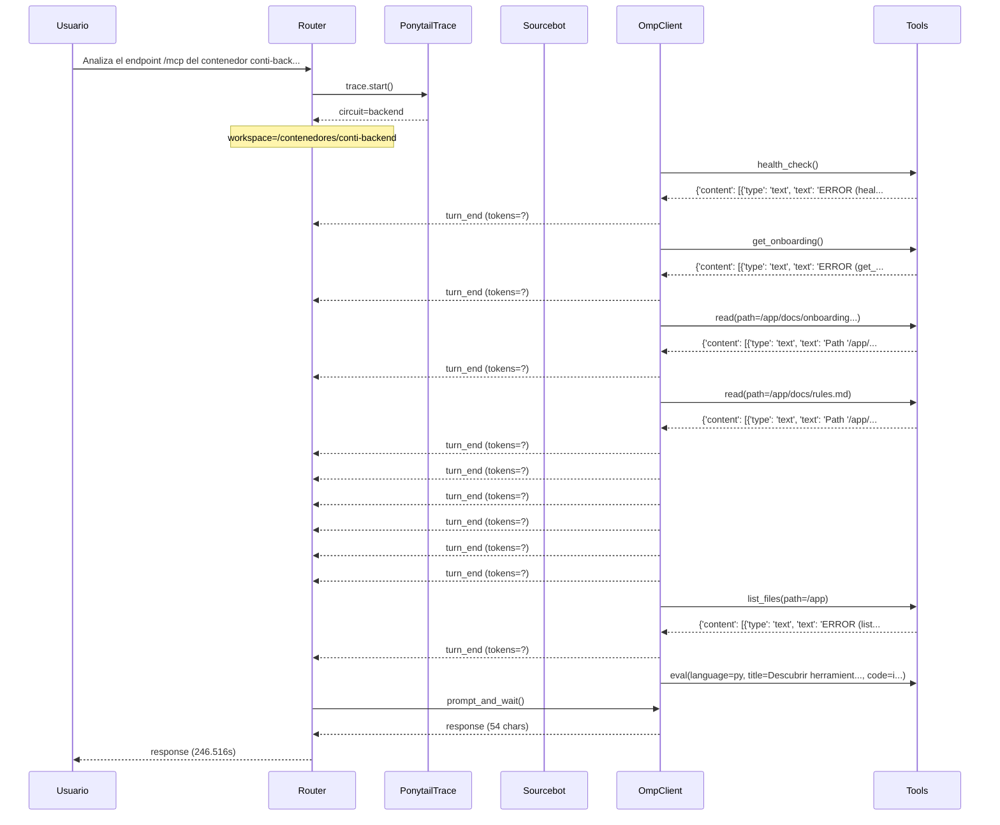

# Traza: Analiza el endpoint /mcp del contenedor conti-backend y documenta todas las tools en un documento mcp_tools_doc.md

- **Circuito**: `backend`
- **Workspace**: `/contenedores/conti-backend`
- **Inicio**: 2026-07-02T21:54:22.816931-03:00
- **Fin**: 2026-07-02T21:58:29.336229-03:00
- **Duración**: 246.519s
- **Eventos**: 29

## Diagrama de Secuencia



## Eventos Detallados

### 1. `start` (2026-07-02T21:54:22.817150-03:00)

```json
{
  "task": "Analiza el endpoint /mcp del contenedor conti-backend y documenta todas las tools en un documento mcp_tools_doc.md",
  "payload_keys": [
    "messages",
    "circuit",
    "_circuit",
    "_session"
  ],
  "circuit": "backend",
  "traces_dir": "/app/logs/ponytail"
}
```

### 2. `circuit_selected` (2026-07-02T21:54:22.820491-03:00)

```json
{
  "id": "backend",
  "workspace": "/contenedores/conti-backend",
  "session_id": "82a1f30cd546",
  "is_new_session": true
}
```

### 3. `governance_tool` (2026-07-02T21:54:22.824501-03:00)

```json
{
  "tool": "get_onboarding",
  "chars": 195
}
```

### 4. `governance_tool` (2026-07-02T21:54:22.827022-03:00)

```json
{
  "tool": "get_rules",
  "chars": 438
}
```

### 5. `governance_tool` (2026-07-02T21:54:22.839548-03:00)

```json
{
  "tool": "get_config",
  "chars": 3246
}
```

### 6. `governance_injected` (2026-07-02T21:54:22.839573-03:00)

```json
{
  "onboarding_len": 3939,
  "is_new_session": true
}
```

### 7. `omp_tool_start` (2026-07-02T21:54:39.527474-03:00)

```json
{
  "tool": "health_check",
  "args": {},
  "result": null,
  "error": null,
  "ok": true
}
```

### 8. `omp_tool_end` (2026-07-02T21:55:09.949307-03:00)

```json
{
  "tool": "health_check",
  "args": {},
  "result": {
    "content": [
      {
        "type": "text",
        "text": "ERROR (health_check): timeout después de 30.0s"
      }
    ],
    "details": {}
  },
  "error": null,
  "ok": true
}
```

### 9. `omp_turn_end` (2026-07-02T21:55:09.975844-03:00)

```json
{
  "event_type": "turn_end",
  "model": "?",
  "provider": "?"
}
```

### 10. `omp_tool_start` (2026-07-02T21:55:11.702182-03:00)

```json
{
  "tool": "get_onboarding",
  "args": {},
  "result": null,
  "error": null,
  "ok": true
}
```

### 11. `omp_tool_end` (2026-07-02T21:55:41.906237-03:00)

```json
{
  "tool": "get_onboarding",
  "args": {},
  "result": {
    "content": [
      {
        "type": "text",
        "text": "ERROR (get_onboarding): timeout después de 30.0s"
      }
    ],
    "details": {}
  },
  "error": null,
  "ok": true
}
```

### 12. `omp_turn_end` (2026-07-02T21:55:41.940567-03:00)

```json
{
  "event_type": "turn_end",
  "model": "?",
  "provider": "?"
}
```

### 13. `omp_tool_start` (2026-07-02T21:55:44.244203-03:00)

```json
{
  "tool": "read",
  "args": {
    "path": "/app/docs/onboarding.md"
  },
  "result": null,
  "error": null,
  "ok": true
}
```

### 14. `omp_tool_end` (2026-07-02T21:55:44.491192-03:00)

```json
{
  "tool": "read",
  "args": {
    "path": "/app/docs/onboarding.md"
  },
  "result": {
    "content": [
      {
        "type": "text",
        "text": "Path '/app/docs/onboarding.md' not found"
      }
    ],
    "details": {}
  },
  "error": null,
  "ok": true
}
```

### 15. `omp_turn_end` (2026-07-02T21:55:44.526001-03:00)

```json
{
  "event_type": "turn_end",
  "model": "?",
  "provider": "?"
}
```

### 16. `omp_tool_start` (2026-07-02T21:55:47.189994-03:00)

```json
{
  "tool": "read",
  "args": {
    "path": "/app/docs/rules.md"
  },
  "result": null,
  "error": null,
  "ok": true
}
```

### 17. `omp_tool_end` (2026-07-02T21:55:47.301936-03:00)

```json
{
  "tool": "read",
  "args": {
    "path": "/app/docs/rules.md"
  },
  "result": {
    "content": [
      {
        "type": "text",
        "text": "Path '/app/docs/rules.md' not found"
      }
    ],
    "details": {}
  },
  "error": null,
  "ok": true
}
```

### 18. `omp_turn_end` (2026-07-02T21:55:47.335737-03:00)

```json
{
  "event_type": "turn_end",
  "model": "?",
  "provider": "?"
}
```

### 19. `omp_turn_end` (2026-07-02T21:55:47.809051-03:00)

```json
{
  "event_type": "turn_end",
  "model": "?",
  "provider": "?"
}
```

### 20. `omp_turn_end` (2026-07-02T21:55:49.001206-03:00)

```json
{
  "event_type": "turn_end",
  "model": "?",
  "provider": "?"
}
```

### 21. `omp_turn_end` (2026-07-02T21:55:50.273142-03:00)

```json
{
  "event_type": "turn_end",
  "model": "?",
  "provider": "?"
}
```

### 22. `omp_turn_end` (2026-07-02T21:55:52.719031-03:00)

```json
{
  "event_type": "turn_end",
  "model": "?",
  "provider": "?"
}
```

### 23. `omp_turn_end` (2026-07-02T21:55:57.051718-03:00)

```json
{
  "event_type": "turn_end",
  "model": "?",
  "provider": "?"
}
```

### 24. `omp_tool_start` (2026-07-02T21:56:05.340472-03:00)

```json
{
  "tool": "list_files",
  "args": {
    "path": "/app"
  },
  "result": null,
  "error": null,
  "ok": true
}
```

### 25. `omp_tool_end` (2026-07-02T21:56:35.431584-03:00)

```json
{
  "tool": "list_files",
  "args": {
    "path": "/app"
  },
  "result": {
    "content": [
      {
        "type": "text",
        "text": "ERROR (list_files): timeout después de 30.0s"
      }
    ],
    "details": {}
  },
  "error": null,
  "ok": true
}
```

### 26. `omp_turn_end` (2026-07-02T21:56:35.462589-03:00)

```json
{
  "event_type": "turn_end",
  "model": "?",
  "provider": "?"
}
```

### 27. `omp_tool_start` (2026-07-02T21:56:41.238024-03:00)

```json
{
  "tool": "eval",
  "args": {
    "language": "py",
    "title": "Descubrir herramientas MCP disponibles en conti-backend",
    "code": "import requests\nimport json\n\n# Intentar descubrir el endpoint MCP\nmcp_url = \"http://conti-backend:9001/mcp\"\n\ntry:\n    # Hacer un GET al endpoint para ver si responde\n    response = requests.get(mcp_url, timeout=10)\n    print(f\"Status code: {response.status_code}\")\n    print(f\"Response text (first 500 chars): {response.text[:500]}\")\nexcept Exception as e:\n    print(f\"Error al conectar: {e}\")\n    \n# Intentar con el endpoint de herramientas MCP estándar\nmcp_tools_url = \"http://conti-backend:9001/mcp/tools\"\ntry:\n    response = requests.get(mcp_tools_url, timeout=10)\n    print(f\"\\nTools endpoint status: {response.status_code}\")\n    if response.status_code == 200:\n        tools = response.json()\n        print(f\"\\nTotal tools found: {len(tools)}\")\n        for tool in tools:\n            print(f\"- {tool.get('name')}: {tool.get('description', 'No description')}\")\n    else:\n        print(f\"Response: {response.text[:500]}\")\nexcept Exception as e:\n    print(f\"Error al obtener herramientas: {e}\")\n\n# Intentar con POST a /mcp con solicitud estándar\ntry:\n    mcp_post_url = \"http://conti-backend:9001/mcp\"\n    payload = {\n        \"jsonrpc\": \"2.0\",\n        \"id\": 1,\n        \"method\": \"tools/list\"\n    }\n    response = requests.post(mcp_post_url, json=payload, timeout=10)\n    print(f\"\\nMCP POST status: {response.status_code}\")\n    if response.status_code == 200:\n        data = response.json()\n        print(f\"Response keys: {data.keys()}\")\n        if 'result' in data:\n            tools = data['result']\n            print(f\"\\nTotal tools via POST: {len(tools)}\")\n            for tool in tools[:20]:  # Mostrar primeros 20\n                print(f\"- {tool.get('name')}: {tool.get('description', 'No description')}\")\n        else:\n            print(f\"Response: {json.dumps(data, indent=2)[:1000]}\")\n    else:\n        print(f\"Response text: {response.text[:500]}\")\nexcept Exception as e:\n    print(f\"Error al POSTear a MCP: {e}\")"
  },
  "result": null,
  "error": null,
  "ok": true
}
```

### 28. `openhands_invoke` (2026-07-02T21:58:29.333315-03:00)

```json
{
  "circuit": "backend",
  "len": 54
}
```

### 29. `end` (2026-07-02T21:58:29.333363-03:00)

```json
{
  "duration_s": 246.516
}
```

## Prompt Completo (input del usuario)

```text
Analiza el endpoint /mcp del contenedor conti-backend y documenta todas las tools en un documento mcp_tools_doc.md
```
