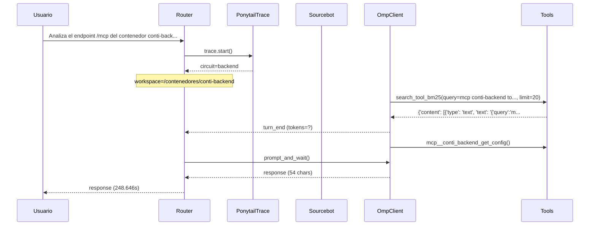

# Traza: Analiza el endpoint /mcp del contenedor conti-backend y documenta todas las tools en un documento mcp_tools_doc.md

- **Circuito**: `backend`
- **Workspace**: `/contenedores/conti-backend`
- **Inicio**: 2026-07-02T22:23:54.544682-03:00
- **Fin**: 2026-07-02T22:28:03.194250-03:00
- **Duración**: 248.65s
- **Eventos**: 12

## Diagrama de Secuencia



## Eventos Detallados

### 1. `start` (2026-07-02T22:23:54.544904-03:00)

```json
{
  "task": "Analiza el endpoint /mcp del contenedor conti-backend y documenta todas las tools en un documento mcp_tools_doc.md",
  "payload_keys": [
    "messages",
    "circuit",
    "_circuit",
    "_session"
  ],
  "circuit": "backend",
  "traces_dir": "/app/logs/ponytail"
}
```

### 2. `circuit_selected` (2026-07-02T22:23:54.548543-03:00)

```json
{
  "id": "backend",
  "workspace": "/contenedores/conti-backend",
  "session_id": "11709a7cfbc4",
  "is_new_session": true
}
```

### 3. `governance_tool` (2026-07-02T22:23:54.604257-03:00)

```json
{
  "tool": "get_onboarding",
  "chars": 195
}
```

### 4. `governance_tool` (2026-07-02T22:23:54.646349-03:00)

```json
{
  "tool": "get_rules",
  "chars": 438
}
```

### 5. `governance_tool` (2026-07-02T22:23:54.651722-03:00)

```json
{
  "tool": "get_config",
  "chars": 3246
}
```

### 6. `governance_injected` (2026-07-02T22:23:54.652028-03:00)

```json
{
  "onboarding_len": 3939,
  "is_new_session": true
}
```

### 7. `omp_tool_start` (2026-07-02T22:24:05.529605-03:00)

```json
{
  "tool": "search_tool_bm25",
  "args": {
    "query": "mcp conti-backend tools",
    "limit": 20
  },
  "result": null,
  "error": null,
  "ok": true
}
```

### 8. `omp_tool_end` (2026-07-02T22:24:05.530328-03:00)

```json
{
  "tool": "search_tool_bm25",
  "args": {
    "query": "mcp conti-backend tools",
    "limit": 20
  },
  "result": {
    "content": [
      {
        "type": "text",
        "text": "{\"query\":\"mcp conti-backend tools\",\"activated_tools\":[\"mcp__conti_backend_reload_config\",\"mcp__conti_backend_get_rules\",\"mcp__conti_backend_health_check\",\"mcp__conti_backend_get_onboarding\",\"mcp__conti_backend_get_config\",\"mcp__conti_backend_file_exists\",\"mcp__conti_backend_grep_workspace\",\"mcp__conti_backend_list_files\",\"mcp__conti_backend_read_file\",\"mcp__conti_backend_run_promover\",\"mcp__conti_backend_list_translation_jobs\",\"mcp__conti_backend_search_docs_literal\",\"mcp__conti_backend_get_container_health\",\"mcp__conti_backend_catolico_lecturas_dia\",\"mcp__conti_backend_get_git_log\",\"mcp__conti_backend_get_git_status\",\"mcp__conti_backend_get_translation_job\",\"mcp__conti_backend_search_code_literal\",\"mcp__conti_backend_get_code_context\",\"mcp__conti_backend_diff_with_develop\"],\"match_count\":20,\"total_tools\":73}"
      }
    ],
    "details": {
      "query": "mcp conti-backend tools",
      "limit": 20,
      "total_tools": 73,
      "activated_tools": [
        "mcp__conti_backend_reload_config",
        "mcp__conti_backend_get_rules",
        "mcp__conti_backend_health_check",
        "mcp__conti_backend_get_onboarding",
        "mcp__conti_backend_get_config",
        "mcp__conti_backend_file_exists",
        "mcp__conti_backend_grep_workspace",
        "mcp__conti_backend_list_files",
        "mcp__conti_backend_read_file",
        "mcp__conti_backend_run_promover",
        "mcp__conti_backend_list_translation_jobs",
        "mcp__conti_backend_search_docs_literal",
        "mcp__conti_backend_get_container_health",
        "mcp__conti_backend_catolico_lecturas_dia",
        "mcp__conti_backend_get_git_log",
        "mcp__conti_backend_get_git_status",
        "mcp__conti_backend_get_translation_job",
        "mcp__conti_backend_search_code_literal",
        "mcp__conti_backend_get_code_context",
        "mcp__conti_backend_diff_with_develop"
      ],
      "active_selected_tools": [
        "mcp__conti_backend_reload_config",
        "mcp__conti_backend_get_rules",
        "mcp__conti_backend_health_check",
        "mcp__conti_backend_get_onboarding",
        "mcp__conti_backend_get_config",
        "mcp__conti_backend_file_exists",
        "mcp__conti_backend_grep_workspace",
        "mcp__conti_backend_list_files",
        "mcp__conti_backend_read_file",
        "mcp__conti_backend_run_promover",
        "mcp__conti_backend_list_translation_jobs",
        "mcp__conti_backend_search_docs_literal",
        "mcp__conti_backend_get_container_health",
        "mcp__conti_backend_catolico_lecturas_dia",
        "mcp__conti_backend_get_git_log",
        "mcp__conti_backend_get_git_status",
        "mcp__conti_backend_get_translation_job",
        "mcp__conti_backend_search_code_literal",
        "mcp__conti_backend_get_code_context",
        "mcp__conti_backend_diff_with_develop"
      ],
      "tools": [
        {
          "name": "mcp__conti_backend_reload_config",
          "label": "conti-backend/reload_config",
          "description": "Recarga la configuración del backend.",
          "server_name": "conti-backend",
          "mcp_tool_name": "reload_config",
          "schema_keys": [],
          "score": 0.061422
        },
        {
          "name": "mcp__conti_backend_get_rules",
          "label": "conti-backend/get_rules",
          "description": "Devuelve las reglas efectivas del backend.",
          "server_name": "conti-backend",
          "mcp_tool_name": "get_rules",
          "schema_keys": [],
          "score": 0.061359
        },
        {
          "name": "mcp__conti_backend_health_check",
          "label": "conti-backend/health_check",
          "description": "Devuelve el estado actual del backend.",
          "server_name": "conti-backend",
          "mcp_tool_name": "health_check",
          "schema_keys": [],
          "score": 0.061359
        },
        {
          "name": "mcp__conti_backend_get_onboarding",
          "label": "conti-backend/get_onboarding",
          "description": "Devuelve el onboarding efectivo del backend.",
          "server_name": "conti-backend",
          "mcp_tool_name": "get_onboarding",
          "schema_keys": [
            "brief"
          ],
          "score": 0.061328
        },
        {
          "name": "mcp__conti_backend_get_config",
          "label": "conti-backend/get_config",
          "description": "Devuelve la configuración efectiva redactada.",
          "server_name": "conti-backend",
          "mcp_tool_name": "get_config",
          "schema_keys": [],
          "score": 0.06129
        },
        {
          "name": "mcp__conti_backend_file_exists",
          "label": "conti-backend/file_exists",
          "description": "Informa si un path permitido existe.",
          "server_name": "conti-backend",
          "mcp_tool_name": "file_exists",
          "schema_keys": [
            "path"
          ],
          "score": 0.061193
        },
        {
          "name": "mcp__conti_backend_grep_workspace",
          "label": "conti-backend/grep_workspace",
          "description": "Busca coincidencias dentro del workspace permitido.",
          "server_name": "conti-backend",
          "mcp_tool_name": "grep_workspace",
          "schema_keys": [
            "query"
          ],
          "score": 0.061193
        },
        {
          "name": "mcp__conti_backend_list_files",
          "label": "conti-backend/list_files",
          "description": "Lista archivos y directorios bajo un root permitido.",
          "server_name": "conti-backend",
          "mcp_tool_name": "list_files",
          "schema_keys": [
            "path"
          ],
          "score": 0.061063
        },
        {
          "name": "mcp__conti_backend_read_file",
          "label": "conti-backend/read_file",
          "description": "Lee un archivo dentro de los roots permitidos.",
          "server_name": "conti-backend",
          "mcp_tool_name": "read_file",
          "schema_keys": [
            "end_line",
            "path",
            "start_line"
          ],
          "score": 0.060935
        },
        {
          "name": "mcp__conti_backend_run_promover",
          "label": "conti-backend/run_promover",
          "description": "Hace preview o ejecuta merge local develop -> main con push.",
          "server_name": "conti-backend",
          "mcp_tool_name": "run_promover",
          "schema_keys": [
            "confirm",
            "develop_branch",
            "main_branch",
            "remote",
            "repo_path",
            "summary"
          ],
          "score": 0.060681
        },
        {
          "name": "mcp__conti_backend_list_translation_jobs",
          "label": "conti-backend/list_translation_jobs",
          "description": "Lista jobs recientes de traducción y su estado.",
          "server_name": "conti-backend",
          "mcp_tool_name": "list_translation_jobs",
          "schema_keys": [
            "limit"
          ],
          "score": 0.060618
        },
        {
          "name": "mcp__conti_backend_search_docs_literal",
          "label": "conti-backend/search_docs_literal",
          "description": "Busca texto literal o regex dentro de la documentación del backend.",
          "server_name": "conti-backend",
          "mcp_tool_name": "search_docs_literal",
          "schema_keys": [
            "query"
          ],
          "score": 0.060591
        },
        {
          "name": "mcp__conti_backend_get_container_health",
          "label": "conti-backend/get_container_health",
          "description": "Resume estado y salud de contenedores Docker accesibles desde el backend.",
          "server_name": "conti-backend",
          "mcp_tool_name": "get_container_health",
          "schema_keys": [
            "container",
            "env"
          ],
          "score": 0.060561
        },
        {
          "name": "mcp__conti_backend_catolico_lecturas_dia",
          "label": "conti-backend/catolico_lecturas_dia",
          "description": "Obtiene las lecturas del día para la liturgia católica.",
          "server_name": "conti-backend",
          "mcp_tool_name": "catolico_lecturas_dia",
          "schema_keys": [
            "fecha"
          ],
          "score": 0.060556
        },
        {
          "name": "mcp__conti_backend_get_git_log",
          "label": "conti-backend/get_git_log",
          "description": "Devuelve el historial reciente del repo Git local.",
          "server_name": "conti-backend",
          "mcp_tool_name": "get_git_log",
          "schema_keys": [
            "n",
            "repo_path"
          ],
          "score": 0.060556
        },
        {
          "name": "mcp__conti_backend_get_git_status",
          "label": "conti-backend/get_git_status",
          "description": "Devuelve el estado Git local del repo de desarrollo.",
          "server_name": "conti-backend",
          "mcp_tool_name": "get_git_status",
          "schema_keys": [
            "repo_path"
          ],
          "score": 0.060524
        },
        {
          "name": "mcp__conti_backend_get_translation_job",
          "label": "conti-backend/get_translation_job",
          "description": "Consulta estado y progreso de un job de traducción.",
          "server_name": "conti-backend",
          "mcp_tool_name": "get_translation_job",
          "schema_keys": [
            "job_id"
          ],
          "score": 0.060524
        },
        {
          "name": "mcp__conti_backend_search_code_literal",
          "label": "conti-backend/search_code_literal",
          "description": "Busca texto literal o regex dentro del repo de desarrollo.",
          "server_name": "conti-backend",
          "mcp_tool_name": "search_code_literal",
          "schema_keys": [
            "query"
          ],
          "score": 0.060493
        },
        {
          "name": "mcp__conti_backend_get_code_context",
          "label": "conti-backend/get_code_context",
          "description": "Devuelve contexto alrededor de una línea de un archivo permitido.",
          "server_name": "conti-backend",
          "mcp_tool_name": "get_code_context",
          "schema_keys": [
            "context",
            "line",
            "path"
          ],
          "score": 0.060431
        },
        {
          "name": "mcp__conti_backend_diff_with_develop",
          "label": "conti-backend/diff_with_develop",
          "description": "Compara el HEAD local contra develop remoto o local configurado.",
          "server_name": "conti-backend",
          "mcp_tool_name": "diff_with_develop",
          "schema_keys": [
            "develop_branch",
            "remote",
            "repo_path"
          ],
          "score": 0.060369
        }
      ]
    }
  },
  "error": null,
  "ok": true
}
```

### 9. `omp_turn_end` (2026-07-02T22:24:05.535281-03:00)

```json
{
  "event_type": "turn_end",
  "model": "?",
  "provider": "?"
}
```

### 10. `omp_tool_start` (2026-07-02T22:24:08.342850-03:00)

```json
{
  "tool": "mcp__conti_backend_get_config",
  "args": {},
  "result": null,
  "error": null,
  "ok": true
}
```

### 11. `openhands_invoke` (2026-07-02T22:28:03.190926-03:00)

```json
{
  "circuit": "backend",
  "len": 54
}
```

### 12. `end` (2026-07-02T22:28:03.190974-03:00)

```json
{
  "duration_s": 248.646
}
```

## Prompt Completo (input del usuario)

```text
Analiza el endpoint /mcp del contenedor conti-backend y documenta todas las tools en un documento mcp_tools_doc.md
```
