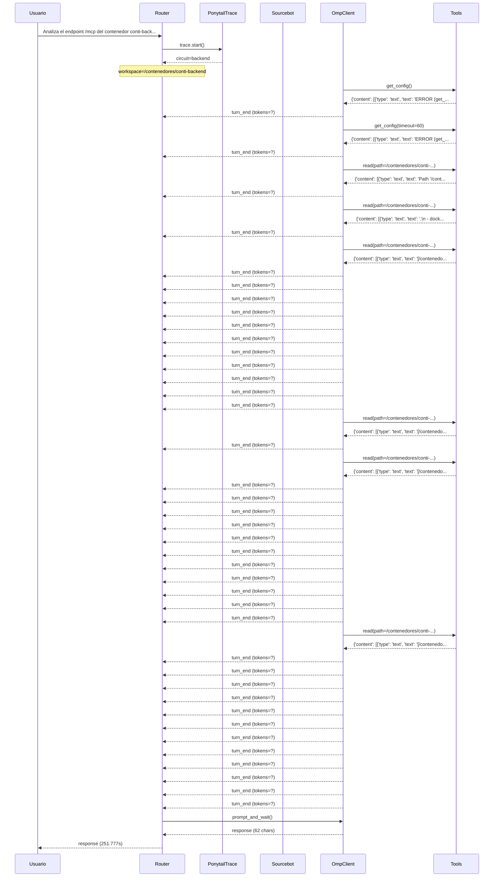

# Traza: Analiza el endpoint /mcp del contenedor conti-backend y documenta todas las tools en un documento mcp_tools_doc.md

- **Circuito**: `backend`
- **Workspace**: `/contenedores/conti-backend`
- **Inicio**: 2026-07-02T23:05:45.755080-03:00
- **Fin**: 2026-07-02T23:09:57.537768-03:00
- **Duración**: 251.783s
- **Eventos**: 63

## Diagrama de Secuencia



## Eventos Detallados

### 1. `start` (2026-07-02T23:05:45.755268-03:00)

```json
{
  "task": "Analiza el endpoint /mcp del contenedor conti-backend y documenta todas las tools en un documento mcp_tools_doc.md",
  "payload_keys": [
    "messages",
    "circuit",
    "_circuit",
    "_session"
  ],
  "circuit": "backend",
  "traces_dir": "/app/logs/ponytail"
}
```

### 2. `circuit_selected` (2026-07-02T23:05:45.757299-03:00)

```json
{
  "id": "backend",
  "workspace": "/contenedores/conti-backend",
  "session_id": "d474069ff30a",
  "is_new_session": true
}
```

### 3. `governance_tool` (2026-07-02T23:05:45.761828-03:00)

```json
{
  "tool": "get_onboarding",
  "chars": 195
}
```

### 4. `governance_tool` (2026-07-02T23:05:45.764030-03:00)

```json
{
  "tool": "get_rules",
  "chars": 438
}
```

### 5. `governance_tool` (2026-07-02T23:05:45.765942-03:00)

```json
{
  "tool": "get_config",
  "chars": 3246
}
```

### 6. `governance_injected` (2026-07-02T23:05:45.765954-03:00)

```json
{
  "onboarding_len": 3939,
  "is_new_session": true
}
```

### 7. `omp_tool_start` (2026-07-02T23:05:56.071598-03:00)

```json
{
  "tool": "get_config",
  "args": {},
  "result": null,
  "error": null,
  "ok": true
}
```

### 8. `omp_tool_end` (2026-07-02T23:06:26.293764-03:00)

```json
{
  "tool": "get_config",
  "args": {},
  "result": {
    "content": [
      {
        "type": "text",
        "text": "ERROR (get_config): timeout después de 30.0s"
      }
    ],
    "details": {}
  },
  "error": null,
  "ok": true
}
```

### 9. `omp_turn_end` (2026-07-02T23:06:26.323970-03:00)

```json
{
  "event_type": "turn_end",
  "model": "?",
  "provider": "?"
}
```

### 10. `omp_tool_start` (2026-07-02T23:06:27.553305-03:00)

```json
{
  "tool": "get_config",
  "args": {
    "timeout": 60
  },
  "result": null,
  "error": null,
  "ok": true
}
```

### 11. `omp_tool_end` (2026-07-02T23:06:57.871440-03:00)

```json
{
  "tool": "get_config",
  "args": {
    "timeout": 60
  },
  "result": {
    "content": [
      {
        "type": "text",
        "text": "ERROR (get_config): timeout después de 30.0s"
      }
    ],
    "details": {}
  },
  "error": null,
  "ok": true
}
```

### 12. `omp_turn_end` (2026-07-02T23:06:57.915357-03:00)

```json
{
  "event_type": "turn_end",
  "model": "?",
  "provider": "?"
}
```

### 13. `omp_tool_start` (2026-07-02T23:07:00.842581-03:00)

```json
{
  "tool": "read",
  "args": {
    "path": "/contenedores/conti-backend/app/config.py"
  },
  "result": null,
  "error": null,
  "ok": true
}
```

### 14. `omp_tool_end` (2026-07-02T23:07:01.009945-03:00)

```json
{
  "tool": "read",
  "args": {
    "path": "/contenedores/conti-backend/app/config.py"
  },
  "result": {
    "content": [
      {
        "type": "text",
        "text": "Path '/contenedores/conti-backend/app/config.py' not found"
      }
    ],
    "details": {}
  },
  "error": null,
  "ok": true
}
```

### 15. `omp_turn_end` (2026-07-02T23:07:01.049711-03:00)

```json
{
  "event_type": "turn_end",
  "model": "?",
  "provider": "?"
}
```

### 16. `omp_tool_start` (2026-07-02T23:07:02.407066-03:00)

```json
{
  "tool": "read",
  "args": {
    "path": "/contenedores/conti-backend"
  },
  "result": null,
  "error": null,
  "ok": true
}
```

### 17. `omp_tool_end` (2026-07-02T23:07:02.536278-03:00)

```json
{
  "tool": "read",
  "args": {
    "path": "/contenedores/conti-backend"
  },
  "result": {
    "content": [
      {
        "type": "text",
        "text": ".\n  - docker-compose.conti.yml                      12.7KB    2m ago\n  - docs/                                                   2h ago\n    - mcp_tools_doc.md                            19.1KB    2h ago\n    - rules.md                                    7.2KB     12h ago\n    - onboarding.md                               10.7KB    12h ago\n    - new/                                                  1w ago\n    - hermes-mcp-diagnostico.md                   67.4KB    1w ago\n    - DIAGNOSTICO_CORRECTO_THREADS_15JUN2026.md   23.4KB    1w ago\n    - DIAGNOSTICO_THREADS_CHATUI_15JUN2026.md     13.3KB    1w ago\n    - ESTADO_ACTUAL.md                            6.9KB     1w ago\n    - ESTADO_REAL.md                              16.1KB    1w ago\n    - RESUMEN_PRUEBAS_13JUN2026.md                3.1KB     1w ago\n    - old/                                                  1mo ago\n    - … 2 more\n    - onboarding_brief.md                         75B       2mo ago\n  - tests/                                                  10h ago\n    - __pycache__/                                          10h ago\n    - test_circuit_backend.py                     2.8KB     10h ago\n    - test_circuit_compose.py                     2.8KB     10h ago\n    - test_circuit_desarrollo.py                  3.4KB     10h ago\n    - test_ponytail_trace.py                      20.7KB    1d ago\n    - test_tool_bridge.py                         7.2KB     2d ago\n    - test_omp_client.py                          8.1KB     2d ago\n    - test_code_edit_tools.py                     6.1KB     2d ago\n    - test_git_tools_localops.py                  8.3KB     3d ago\n    - test_git_tools.py                           13.6KB    3d ago\n    - test_rag_search_tools.py                    1.3KB     1w ago\n    - … 10 more\n    - test_rules_loader.py                        1.8KB     2mo ago\n  - sync_upstream.sh                              485B      12h ago\n  - PLAN_3_LLM.md                                 123.5KB   1d ago\n  - .ponytail/                                              1d ago\n    - traces/                                               3m ago\n  - ponytail.md                                   0B        1d ago\n  - docker/                                                 2d ago\n    - conti-omp/                                            2d ago\n  - scripts/                                                3d ago\n    - e2e/                                                  3d ago\n  - .ruff_cache/                                            3d ago\n    - 0.15.20/                                              2m ago\n    - 0.15.19/                                              1w ago\n    - 0.15.18/                                              1w ago\n    - .gitignore                                  35B       1w ago\n    - CACHEDIR.TAG                                43B       1w ago\n  - entrypoint_hermes.sh                          8.0KB     3d ago\n  - llm_apis.md                                   0B        5d ago\n  - pase.md                                       25.8KB    1w ago\n  - prompt.md                                     4.8KB     1w ago\n  - requirements.txt                              1.1KB     1w ago\n  - sync_odoo_profiles.sh                         1.4KB     1w ago\n  - google-workspace/                                       1w ago\n    - credentials.json                            643B      1w ago\n    - token.json                                  897B      1w ago\n    - email_summary.py                            13.2KB    3mo ago\n  - hermes-fix.md                                 7.3KB     1w ago\n  - mcp-local.md                                  40.2KB    1w ago\n  - conti_home/                                             1w ago\n    - .ssh/                                                 5h ago\n    - .openhands/                                           6d ago\n    - update_prices_v2.py                         2.5KB     1w ago\n    - update_prices_v3.py                         1.6KB     1w ago\n    - update_prices_v4.py                         1.4KB     1w ago\n    - update_prices_v7.py                         2.6KB     1w ago\n    - update_prices.py                            1.9KB     1w ago\n    - project_ingredients.py                      2.0KB     1w ago\n    - test_odoo_jsonrpc_v2.py                     792B      1w ago\n    - test_odoo_jsonrpc.py                        747B      1w ago\n    - test_odoo_xmlrpc_v3.py                      707B      1w ago\n    - … 71 more\n    - .profile                                    807B      3mo ago\n  - docs.json                                     0B        1w ago\n  - config/                                                 1w ago\n    - app_config.json                             3.5KB     1w ago\n  - app/                                                    1w ago\n    - openhands_agent/                                      12h ago\n    - tools/                                                1d ago\n    - __pycache__/                                          3d ago\n    - utils/                                                1w ago\n    - web/                                                  1w ago\n    - services/                                             1w ago\n    - tenants/                                              1w ago\n    - config/                                               1w ago\n    - integrations/                                         1w ago\n    - llm_emulation/                                        1w ago\n    - main.py                                     3.2KB     1w ago\n    - … 7 more\n    - __init__.py                                 31B       2mo ago\n  - Plan_backend.md                               26.9KB    1w ago\n  - USER.md                                       4.2KB     1w ago\n  - Orquestador Chainlitxx.json                   47.7KB    1w ago\n  - PLAN_2_LLM.md                                 43.3KB    1w ago\n  - PLAN_LLM.MD                                   7.9KB     1w ago\n  - Orquestador Chainlit-ant.json                 32.7KB    1w ago\n  - Orquestador Chainlit.json                     59.7KB    1w ago\n  - Orquestador Chainlit0.json                    44.0KB    1w ago\n  - Orquestador Chainlit (7).json                 49.9KB    1w ago\n  - Orquestador Chainlit--.json                   49.7KB    1w ago\n  - CHAT.MD                                       39.6KB    1w ago\n  - Dockerfile                                    4.4KB     1w ago\n  - Ingesta RAG MCP Catolico.json                 15.4KB    1w ago\n  - Ingesta RAG MCP OCRL Mendoza.json             15.4KB    1w ago\n  - .gitignore                                    2.0KB     1w ago\n  - .gitmodules                                   311B      1w ago\n  - CARTA.PY                                      4.1KB     1w ago\n  - sourcebot/                                              1w ago\n    - config.json                                 481B      1w ago\n    - Dockerfile                                  1.1KB     1w ago\n  - vendor/                                                 1w ago\n    - oh-my-pi/                                             2d ago\n    - ponytail/                                             1w ago\n    - OpenHands/                                            1w ago\n  - Dockerfile.old0                               1.5KB     1w ago\n  - config.json                                   1.7KB     1w ago\n  - Dockerfile.old                                2.6KB     1w ago\n  - docker-compose.yml                            1001B     1w ago\n  - README.md                                     3.6KB     1w ago\n  - chat-catolico.sh.legacy-nanobot               198B      1w ago\n  - entrypoint.sh.legacy-nanobot                  2.8KB     1w ago\n  - docker-compose.conti copy.yml                 2.2KB     1w ago\n  - Dockerfile copy                               3.2KB     1w ago\n  - logterminal.log                               41.0KB    1w ago\n  - backup-entrypoint.sh.legacy-nanobot           4.2KB     1w ago\n  - entrypoint_hermes.sh.pre-nanobot-removal      6.3KB     1w ago\n  - c/                                                      1w ago\n    - Contenedores/                                         1w ago\n  - migration_manifest/                                     1w ago\n    - manifest_catolico.yaml                      392B      1w ago\n    - manifest_contihome.yaml                     652B      1w ago\n    - manifest_mendoza.yaml                       817B      1w ago\n    - manifest_odoo.yaml                          357B      1w ago\n    - manifest_resto.yaml                         473B      1w ago\n    - README.md                                   1.0KB     1w ago\n  - claw_data/                                              1mo ago\n  - chats-plans/                                            1mo ago\n    - reporte_diagnostico_skills_y_odoo.md        13.0KB    1mo ago\n    - reporte_error_gateway.md                    4.0KB     1mo ago\n    - Plan%3A Herramienta visual de recomenda.md  1.8KB     1mo ago\n    - plan_backend_ai_odoo.md                     13.1KB    1mo ago\n    - Plan_mozo_virtual.md                        38.4KB    1mo ago\n    - readme_conti_ai.md                          22.5KB    1mo ago\n    - plan_mozos.md                               6.9KB     1mo ago\n    - Mesa identifier.md                          484B      1mo ago\n    - Pan_Conti_ia.md                             14.0KB    1mo ago\n    - chat_odoo.md                                15.0KB    1mo ago\n    - Conti_ia.md                                 6.1KB     1mo ago\n    - … 3 more\n    - q-dev-chat-2026-05-12.md                    3.5KB     1mo ago\n  - .sixth/                                                 1mo ago\n    - skills/                                               1mo ago\n  - .pytest_cache/                                          2mo ago\n    - v/                                                    2mo ago\n    - .gitignore                                  37B       2mo ago\n    - CACHEDIR.TAG                                191B      2mo ago\n    - README.md                                   302B      2mo ago\n  - repo/                                                   2mo ago\n    - nanobot/                                              2mo ago\n  - voice/                                                  3mo ago\n    - voice_ref.wav                               1.1MB     3mo ago\n    - voice_manager.py                            1.8KB     3mo ago\n\n[1 results limit reached. Use limit=2 for more]"
      }
    ],
    "details": {
      "isDirectory": true,
      "resolvedPath": "/contenedores/conti-backend",
      "meta": {
        "source": {
          "type": "path",
          "value": "/contenedores/conti-backend"
        },
        "limits": {
          "resultLimit": {
            "reached": 1,
            "suggestion": 2
          }
        }
      }
    }
  },
  "error": null,
  "ok": true
}
```

### 18. `omp_turn_end` (2026-07-02T23:07:02.583224-03:00)

```json
{
  "event_type": "turn_end",
  "model": "?",
  "provider": "?"
}
```

### 19. `omp_tool_start` (2026-07-02T23:07:05.155028-03:00)

```json
{
  "tool": "read",
  "args": {
    "path": "/contenedores/conti-backend/docs/mcp_tools_doc.md"
  },
  "result": null,
  "error": null,
  "ok": true
}
```

### 20. `omp_tool_end` (2026-07-02T23:07:05.273918-03:00)

```json
{
  "tool": "read",
  "args": {
    "path": "/contenedores/conti-backend/docs/mcp_tools_doc.md"
  },
  "result": {
    "content": [
      {
        "type": "text",
        "text": "[/contenedores/conti-backend/docs/mcp_tools_doc.md#BCCC]\n1:# MCP Tools Documentation — conti-backend\n2:\n3:> Documentación generada para el endpoint `/mcp` del contenedor `conti-backend`\n4:> Fecha: 2026-07-02\n5:> Fuente: Análisis directo del código fuente y configuración\n6:\n7:---\n8:\n9:## Resumen Ejecutivo\n10:\n11:El backend `conti-backend` expone un endpoint MCP (Model Context Protocol) con **43 herramientas registradas** organizadas en 11 categorías funcionales. El servidor MCP está implementado sobre FastAPI y soporta múltiples protocolos:\n12:\n13:- **JSON-RPC 2.0** vía `POST /mcp`\n14:- **Server-Sent Events (SSE)** vía `GET /mcp` con `Accept: text/event-stream`\n15:- **REST simplificado** vía `GET /mcp/tools` y `POST /mcp/call`\n16:- **UI Web** en `/ui/tools` para exploración interactiva\n17:\n18:Todas las herramientas están documentadas con schemas JSON, visibilidad controlada (pública/internal) y categorías para facilitar la búsqueda.\n19:\n20:---\n21:\n22:## Endpoints MCP Disponibles\n23:\n24:| Método | Endpoint | Descripción | Tipo de Respuesta |\n25:|--------|----------|-------------|-------------------|\n26:| `GET` | `/mcp` | Información del servidor MCP (JSON) o SSE si el cliente acepta `text/event-stream` | JSON/SSE |\n27:| `POST` | `/mcp` | JSON-RPC 2.0: `initialize`, `tools/list`, `tools/call`, `ping`, `notifications/initialized` | JSON-RPC 2.0 |\n28:| `GET` | `/mcp/tools` | Lista completa de todas las herramientas MCP con schemas JSON detallados | JSON |\n29:| `POST` | `/mcp/call` | Invocar una herramienta por nombre usando formato REST simple | JSON |\n30:| `POST` | `/mcp/execute` | Alias alternativo de `/mcp/call` con formato de entrada diferente | JSON |\n31:| `GET` | `/mcp/sse` | SSE legacy para clientes como Kilocode/Cline | SSE |\n32:\n33:---\n34:\n35:## Categorías de Herramientas\n36:\n37:### 📁 Grupo A — Filesystem (4 herramientas)\n38:\n39:Herramientas para manipulación y consulta de archivos en el sistema de archivos.\n40:\n41:| Tool | Visibilidad | Descripción |\n42:|------|-------------|-------------|\n43:| **`list_files`** | pública | Lista archivos y directorios bajo un root permitido. Soporta filtrado por tipo, recursión controlada y paginación |\n44:| **`read_file`** | pública | Lee el contenido de un archivo con soporte para rangos de líneas (`start_line`, `end_line`). Devuelve texto plano o estructurado |\n45:| **`file_exists`** | pública | Verifica si un path existe y determina si es archivo, directorio o enlace simbólico |\n46:| **`get_code_context`** | pública | Devuelve N líneas de contexto alrededor de una línea específica de un archivo (útil para análisis de código) |\n47:\n48:---\n49:\n50:### 🔍 Grupo B — Búsqueda (3 herramientas)\n51:\n52:Herramientas para búsqueda de texto en repositorios y documentación.\n53:\n54:| Tool | Visibilidad | Descripción |\n55:|------|-------------|-------------|\n56:| **`search_code_literal`** | pública | Busca texto literal o regex en el repositorio de desarrollo (`/desarrollo`). Devuelve coincidencias con contexto |\n57:| **`search_docs_literal`** | pública | Busca texto literal o regex en la documentación del backend (`/app/docs`). Ideal para encontrar información en archivos de configuración y documentación |\n58:| **`grep_workspace`** | pública | Busca en todo el workspace permitido (todos los bind-mounts accesibles). Combina velocidad y precisión para búsquedas complejas |\n59:\n60:---\n61:\n62:### 🏥 Grupo C — Sistema y Health (2 herramientas)\n63:\n64:Herramientas para monitoreo del estado del sistema y recarga de configuración.\n65:\n66:| Tool | Visibilidad | Descripción |\n67:|------|-------------|-------------|\n68:| **`health_check`** | pública | Estado completo del backend: versión, uptime, servicios registrados y estado de salud. Equivalente a `GET /health` |\n69:| **`reload_config`** | internal | Recarga la configuración desde disco. **Solo para uso interno y debugging** (visibilidad: internal) |\n70:\n71:---\n72:\n73:### ⚙️ Grupo D — Configuración y Governance (3 herramientas)\n74:\n75:Herramientas para consulta de configuración y documentación del sistema.\n76:\n77:| Tool | Visibilidad | Descripción |\n78:|------|-------------|-------------|\n79:| **`get_config`** | pública | Devuelve la configuración efectiva del backend con secretos redactados. Equivalente a `GET /config` |\n80:| **`get_onboarding`** | pública | Devuelve el contenido completo del archivo de onboarding. Parámetro opcional `brief=true` para obtener solo el resumen ejecutivo |\n81:| **`get_rules`** | pública | Devuelve las reglas efectivas del backend con checksum y timestamp de última modificación. Equivalente a `GET /rules` |\n82:\n83:---\n84:\n85:### 🔄 Grupo E — Git / CI-CD Local (6 herramientas)\n86:\n87:Herramientas para operaciones Git y gestión de pipelines locales.\n88:\n89:| Tool | Visibilidad | Descripción |\n90:|------|-------------|-------------|\n91:| **`get_git_status`** | pública | Estado completo del repositorio: branch actual, archivos staged, modificados, untracked, y estado ahead/behind respecto a remotos |\n92:| **`get_git_log`** | pública | Historial de commits con opciones de paginación y filtrado. Parámetro `n` para cantidad de commits (default: 10) |\n93:| **`diff_with_develop`** | pública | Diff entre HEAD local y la rama develop (remota o local). Incluye estadísticas de cambios |\n94:| **`get_pipeline_summary`** | pública | Resumen completo del pipeline: estado de ramas, log de commits, diff con develop y estado de remotos |\n95:| **`run_salvar`** | pública | Ejecuta el pipeline de salvado: `confirm=false` → preview de cambios, `confirm=true` → `git add -A + commit + push develop`. **Requiere confirmación explícita** |\n96:| **`run_promover`** | pública | Ejecuta el pipeline de promoción: `confirm=false` → preview, `confirm=true` → merge develop→main + push. **Requiere confirmación explícita** |\n97:\n98:---\n99:\n100:### 🐳 Grupo F — Docker y Containers (3 herramientas)\n101:\n102:Herramientas para monitoreo y diagnóstico de contenedores Docker.\n103:\n104:| Tool | Visibilidad | Descripción |\n105:|------|-------------|-------------|\n106:| **`get_container_health`** | pública | Estado de salud de contenedores Docker. Parámetros opcionales: `env` (local/dev/prod/all) y `container` para filtrar por nombre |\n107:| **`get_container_logs`** | pública | Obtiene logs de un contenedor con filtros avanzados: `lines` (cantidad), `since` (ej: `1h`, `30m`), `level` (`all`/`error`/`warning`) |\n108:| **`get_vps_status`** | pública | Vista consolidada del estado del VPS: Docker + Git pipeline en una sola llamada. Útil para diagnóstico rápido |\n109:\n110:---\n111:\n112:### 🌍 Grupo G — Traducción (3 herramientas)\n113:\n114:Herramientas para traducción automática de documentos Markdown.\n115:\n116:| Tool | Visibilidad | Descripción |\n117:|------|-------------|-------------|\n118:| **`start_markdown_translation`** | pública | Inicia traducción de documentos Markdown en background usando `deep_translator`. Parámetros: `input_path`, `output_path`, `source_lang`, `target_lang`, `chunk_size`, `retries`, `overwrite`. Devuelve `job_id` |\n119:| **`get_translation_job`** | pública | Consulta el estado y progreso de un job de traducción por `job_id` |\n120:| **`list_translation_jobs`** | pública | Lista los jobs recientes de traducción (default: 20). Opcional: `limit` para ajustar cantidad |\n121:\n122:---\n123:\n124:### 📄 Grupo H — Documentos y PDF (3 herramientas)\n125:\n126:Herramientas para conversión y procesamiento de documentos.\n127:\n128:| Tool | Visibilidad | Descripción |\n129:|------|-------------|-------------|\n130:| **`start_pdf_to_markdown`** | pública | Convierte documentos PDF/DOCX a Markdown usando `markitdown`. Parámetros: `source` (URL o ruta local), `store` (directorio destino), `output_path` (opcional), `also_translate` (para encadenar traducción), `target_lang`. Guarda en `/compose/documentos_listos/{store}/` por defecto |\n131:| **`get_md_conversion_job`** | pública | Consulta el estado de un job de conversión por `job_id` |\n132:| **`list_md_conversion_jobs`** | pública | Lista los jobs recientes de conversión (default: 20). Opcional: `limit` para ajustar cantidad |\n133:\n134:---\n135:\n136:### 🧠 Grupo I — RAG Flamehaven — Ingestión (4 herramientas)\n137:\n138:Herramientas para ingestión de documentos en el sistema RAG Flamehaven.\n139:\n140:| Tool | Visibilidad | Descripción |\n141:|------|-------------|-------------|\n142:| **`start_rag_ingest`** | pública | Ingesta un documento en Flamehaven. Detecta automáticamente 3 casos: MD en `documentos_listos`, no-MD, o MD fuera de `documentos_listos`. Control de duplicados con `overwrite`. Parámetros: `source` (URL o ruta local), `store` (colección destino), `original_name` (nombre descriptivo), `overwrite` (booleano) |\n143:| **`get_rag_ingest_job`** | pública | Consulta el estado de un job de ingestión por `job_id` |\n144:| **`list_rag_ingest_jobs`** | pública | Lista los jobs recientes de ingestión (default: 20). Opcional: `limit` para ajustar cantidad |\n145:| **`scan_documentos_nuevos`** | pública | Escanea el directorio `/compose/documentos_nuevos/{store}/`, mueve archivos a `procesados/` y lanza ingesta automática. Parámetros: `store` (o `all` para todos los stores), `dry_run` (solo listar), `max_files` (límite por llamada), `overwrite` (reemplazar duplicados), `include_procesados` (incluir archivos ya procesados) |\n146:\n147:---\n148:\n149:### 🔎 Grupo J — RAG Flamehaven — Búsqueda (4 herramientas)\n150:\n151:Herramientas para búsqueda y consulta en el sistema RAG Flamehaven.\n152:\n153:| Tool | Visibilidad | Descripción |\n154:|------|-------------|-------------|\n155:| **`search_rag`** | pública | Búsqueda completa con respuesta generada por LLM (Gemini). Modos disponibles: `hybrid` (BM25 + semántico, recomendado), `semantic` (solo vectores), `keyword` (solo BM25). Parámetros: `query`, `store`, `mode`, `top_k`, `threshold`, `max_tokens`. Devuelve `answer`, `sources`, `search_confidence`, `low_confidence` |\n156:| **`search_rag_quick`** | pública | Búsqueda rápida por keyword SIN generar respuesta LLM. Solo devuelve `sources` y `matched`. Ideal para verificación rápida o encadenamiento con otras herramientas. Parámetros: `query`, `store`, `top_k` |\n157:| **`search_rag_semantic`** | pública | Búsqueda semántica pura (DSP v2.0) sin BM25. Tolerante a typos, sinónimos y variaciones conceptuales. Parámetros: `query`, `store`, `top_k`, `threshold`, `max_tokens` |\n158:| **`list_rag_store_docs`** | pública | Inventario completo de documentos indexados en un store específico. Parámetros: `store`. Devuelve título, URI y metadata de cada documento |\n159:\n160:---\n161:\n162:### ⛪ Grupo K — Católico (3 herramientas)\n163:\n164:Herramientas especializadas para el tenant católico (lecturas bíblicas y litúrgicas).\n165:\n166:| Tool | Visibilidad | Descripción |\n167:|------|-------------|-------------|\n168:| **`catolico_lecturas_dia`** | pública | Obtiene las lecturas litúrgicas del día desde dominicos.org. Incluye video YouTube y audio SoundCloud si están disponibles. Opcional: parámetro `fecha` (default: 'hoy'). Consulta información litúrgica desde PostgreSQL si disponible |\n169:| **`catolico_biblia_buscar`** | pública | Busca citas bíblicas por palabras clave o referencia específica. Modos: `cita` (referencia exacta: libro, capítulo, versículo) o `busqueda` (texto libre). Parámetros: `modo`, `libro`, `capitulo`, `versiculo_inicio`, `versiculo_fin`, `texto` |\n170:| **`catolico_leer_documento`** | pública | Lee el contenido completo de un documento del RAG católico para su posterior resumen. Dos modos: por `uri` exacta (devuelta por `search_rag`) o por `query` de búsqueda cuando no se tiene la URI. Parámetros: `uri` o `query`, `store` (default: 'catolico') |\n171:\n172:---\n173:\n174:## Parámetros Comunes\n175:\n176:### Parámetros de Paginación\n177:- `limit`: Cantidad máxima de resultados (default varía por herramienta)\n178:- `offset`: Desplazamiento para paginación\n179:- `skip`: Cantidad de archivos/resultados a omitir (usado en algunos endpoints)\n180:\n181:### Parámetros de Filtro\n182:- `store`: Nombre de la colección/store en Flamehaven (default: configurado en `app_config.json`)\n183:- `env`: Entorno Docker (local/dev/prod/all)\n184:- `container`: Nombre específico de contenedor\n185:- `level`: Nivel de logs (all/error/warning)\n186:- `since`: Tiempo para filtrar logs (ej: `1h`, `30m`, `1d`)\n187:- `mode`: Modo de búsqueda (hybrid/semantic/keyword)\n188:- `confirm`: Booleano para operaciones destructivas (default: false → preview)\n189:\n190:### Parámetros de Rango\n191:- `start_line`, `end_line`: Límites de líneas para lectura de archivos\n192:- `lines`: Cantidad de líneas a leer o mostrar\n193:- `context`: Líneas de contexto alrededor de una línea específica\n194:\n195:---\n196:\n197:## Ejemplos de Uso\n198:\n199:### Ejemplo 1: Listar archivos en un directorio\n200:```bash\n201:# Usando curl con POST /mcp/call\n202:curl -X POST http://conti-backend:9001/mcp/call \\\n203:  -H \"Content-Type: application/json\" \\\n204:  -d '{\n205:    \"name\": \"list_files\",\n206:    \"arguments\": {\n207:      \"path\": \"/desarrollo\",\n208:      \"hidden\": false,\n209:      \"gitignore\": true,\n210:      \"limit\": 50\n211:    }\n212:  }'\n213:```\n214:\n215:### Ejemplo 2: Leer un archivo específico\n216:```bash\n217:# Usando POST /mcp/call\n218:curl -X POST http://conti-backend:9001/mcp/call \\\n219:  -H \"Content-Type: application/json\" \\\n220:  -d '{\n221:    \"name\": \"read_file\",\n222:    \"arguments\": {\n223:      \"path\": \"/contenedores/conti-backend/config/app_config.json\",\n224:      \"start_line\": 1,\n225:      \"end_line\": 50\n226:    }\n227:  }'\n228:```\n229:\n230:### Ejemplo 3: Buscar en el workspace\n231:```bash\n232:# Usando POST /mcp/call\n233:curl -X POST http://conti-backend:9001/mcp/call \\\n234:  -H \"Content-Type: application/json\" \\\n235:  -d '{\n236:    \"name\": \"grep_workspace\",\n237:    \"arguments\": {\n238:      \"query\": \"odoo_create_order\",\n239:      \"i\": \"Buscar función de creación de orden en Odoo\"\n240:    }\n241:  }'\n242:```\n243:\n244:### Ejemplo 4: Consultar estado de contenedores\n245:```bash\n246:# Usando POST /mcp/call\n247:curl -X POST http://conti-backend:9001/mcp/call \\\n248:  -H \"Content-Type: application/json\" \\\n249:  -d '{\n250:    \"name\": \"get_container_health\",\n251:    \"arguments\": {\n252:      \"env\": \"all\",\n253:      \"container\": \"odoo18\"\n254:    }\n255:  }'\n256:```\n257:\n258:### Ejemplo 5: Buscar en RAG Flamehaven\n259:```bash\n260:# Búsqueda completa con respuesta LLM\n261:curl -X POST http://conti-backend:9001/mcp/call \\\n262:  -H \"Content-Type: application/json\" \\\n263:  -d '{\n264:    \"name\": \"search_rag\",\n265:    \"arguments\": {\n266:      \"query\": \"facturación de pedidos en Odoo\",\n267:      \"store\": \"default\",\n268:      \"mode\": \"hybrid\",\n269:      \"top_k\": 5,\n270:      \"max_tokens\": 2000\n271:    }\n272:  }'\n273:```\n274:\n275:### Ejemplo 6: Iniciar conversión de PDF a Markdown\n276:```bash\n277:# Convertir PDF local a Markdown\n278:curl -X POST http://conti-backend:9001/mcp/call \\\n279:  -H \"Content-Type: application/json\" \\\n280:  -d '{\n281:    \"name\": \"start_pdf_to_markdown\",\n282:    \"arguments\": {\n283:      \"source\": \"/compose/documentos_nuevos/facturas/factura_20260701.pdf\",\n284:      \"store\": \"facturas\",\n285:      \"output_path\": \"/compose/documentos_listos/facturas/factura_20260701.md\",\n286:      \"also_translate\": true,\n287:      \"target_lang\": \"es\"\n288:    }\n289:  }'\n290:```\n291:\n292:### Ejemplo 7: Ejecutar operación Git con preview\n293:```bash\n294:# Preview de commit y push a develop (sin confirmar)\n295:curl -X POST http://conti-backend:9001/mcp/call \\\n296:  -H \"Content-Type: application/json\" \\\n297:  -d '{\n298:    \"name\": \"run_salvar\",\n299:    \"arguments\": {\n300:      \"i\": \"Preview de cambios para commit\",\n…\n304:  }'\n305:```\n…\n308:\n…\n473:**Nota**: Este documento fue generado automáticamente a partir del análisis del código fuente del backend `conti-backend`. Para la versión más actualizada, consulte directamente el endpoint `/mcp/tools` o la UI web en `/ui/tools`.\n\n[Showing lines 1-300 of 473. Use :301 to continue]"
      }
    ],
    "details": {
      "truncation": {
        "content": "# MCP Tools Documentation — conti-backend\n\n> Documentación generada para el endpoint `/mcp` del contenedor `conti-backend`\n> Fecha: 2026-07-02\n> Fuente: Análisis directo del código fuente y configuración\n\n---\n\n## Resumen Ejecutivo\n\nEl backend `conti-backend` expone un endpoint MCP (Model Context Protocol) con **43 herramientas registradas** organizadas en 11 categorías funcionales. El servidor MCP está implementado sobre FastAPI y soporta múltiples protocolos:\n\n- **JSON-RPC 2.0** vía `POST /mcp`\n- **Server-Sent Events (SSE)** vía `GET /mcp` con `Accept: text/event-stream`\n- **REST simplificado** vía `GET /mcp/tools` y `POST /mcp/call`\n- **UI Web** en `/ui/tools` para exploración interactiva\n\nTodas las herramientas están documentadas con schemas JSON, visibilidad controlada (pública/internal) y categorías para facilitar la búsqueda.\n\n---\n\n## Endpoints MCP Disponibles\n\n| Método | Endpoint | Descripción | Tipo de Respuesta |\n|--------|----------|-------------|-------------------|\n| `GET` | `/mcp` | Información del servidor MCP (JSON) o SSE si el cliente acepta `text/event-stream` | JSON/SSE |\n| `POST` | `/mcp` | JSON-RPC 2.0: `initialize`, `tools/list`, `tools/call`, `ping`, `notifications/initialized` | JSON-RPC 2.0 |\n| `GET` | `/mcp/tools` | Lista completa de todas las herramientas MCP con schemas JSON detallados | JSON |\n| `POST` | `/mcp/call` | Invocar una herramienta por nombre usando formato REST simple | JSON |\n| `POST` | `/mcp/execute` | Alias alternativo de `/mcp/call` con formato de entrada diferente | JSON |\n| `GET` | `/mcp/sse` | SSE legacy para clientes como Kilocode/Cline | SSE |\n\n---\n\n## Categorías de Herramientas\n\n### 📁 Grupo A — Filesystem (4 herramientas)\n\nHerramientas para manipulación y consulta de archivos en el sistema de archivos.\n\n| Tool | Visibilidad | Descripción |\n|------|-------------|-------------|\n| **`list_files`** | pública | Lista archivos y directorios bajo un root permitido. Soporta filtrado por tipo, recursión controlada y paginación |\n| **`read_file`** | pública | Lee el contenido de un archivo con soporte para rangos de líneas (`start_line`, `end_line`). Devuelve texto plano o estructurado |\n| **`file_exists`** | pública | Verifica si un path existe y determina si es archivo, directorio o enlace simbólico |\n| **`get_code_context`** | pública | Devuelve N líneas de contexto alrededor de una línea específica de un archivo (útil para análisis de código) |\n\n---\n\n### 🔍 Grupo B — Búsqueda (3 herramientas)\n\nHerramientas para búsqueda de texto en repositorios y documentación.\n\n| Tool | Visibilidad | Descripción |\n|------|-------------|-------------|\n| **`search_code_literal`** | pública | Busca texto literal o regex en el repositorio de desarrollo (`/desarrollo`). Devuelve coincidencias con contexto |\n| **`search_docs_literal`** | pública | Busca texto literal o regex en la documentación del backend (`/app/docs`). Ideal para encontrar información en archivos de configuración y documentación |\n| **`grep_workspace`** | pública | Busca en todo el workspace permitido (todos los bind-mounts accesibles). Combina velocidad y precisión para búsquedas complejas |\n\n---\n\n### 🏥 Grupo C — Sistema y Health (2 herramientas)\n\nHerramientas para monitoreo del estado del sistema y recarga de configuración.\n\n| Tool | Visibilidad | Descripción |\n|------|-------------|-------------|\n| **`health_check`** | pública | Estado completo del backend: versión, uptime, servicios registrados y estado de salud. Equivalente a `GET /health` |\n| **`reload_config`** | internal | Recarga la configuración desde disco. **Solo para uso interno y debugging** (visibilidad: internal) |\n\n---\n\n### ⚙️ Grupo D — Configuración y Governance (3 herramientas)\n\nHerramientas para consulta de configuración y documentación del sistema.\n\n| Tool | Visibilidad | Descripción |\n|------|-------------|-------------|\n| **`get_config`** | pública | Devuelve la configuración efectiva del backend con secretos redactados. Equivalente a `GET /config` |\n| **`get_onboarding`** | pública | Devuelve el contenido completo del archivo de onboarding. Parámetro opcional `brief=true` para obtener solo el resumen ejecutivo |\n| **`get_rules`** | pública | Devuelve las reglas efectivas del backend con checksum y timestamp de última modificación. Equivalente a `GET /rules` |\n\n---\n\n### 🔄 Grupo E — Git / CI-CD Local (6 herramientas)\n\nHerramientas para operaciones Git y gestión de pipelines locales.\n\n| Tool | Visibilidad | Descripción |\n|------|-------------|-------------|\n| **`get_git_status`** | pública | Estado completo del repositorio: branch actual, archivos staged, modificados, untracked, y estado ahead/behind respecto a remotos |\n| **`get_git_log`** | pública | Historial de commits con opciones de paginación y filtrado. Parámetro `n` para cantidad de commits (default: 10) |\n| **`diff_with_develop`** | pública | Diff entre HEAD local y la rama develop (remota o local). Incluye estadísticas de cambios |\n| **`get_pipeline_summary`** | pública | Resumen completo del pipeline: estado de ramas, log de commits, diff con develop y estado de remotos |\n| **`run_salvar`** | pública | Ejecuta el pipeline de salvado: `confirm=false` → preview de cambios, `confirm=true` → `git add -A + commit + push develop`. **Requiere confirmación explícita** |\n| **`run_promover`** | pública | Ejecuta el pipeline de promoción: `confirm=false` → preview, `confirm=true` → merge develop→main + push. **Requiere confirmación explícita** |\n\n---\n\n### 🐳 Grupo F — Docker y Containers (3 herramientas)\n\nHerramientas para monitoreo y diagnóstico de contenedores Docker.\n\n| Tool | Visibilidad | Descripción |\n|------|-------------|-------------|\n| **`get_container_health`** | pública | Estado de salud de contenedores Docker. Parámetros opcionales: `env` (local/dev/prod/all) y `container` para filtrar por nombre |\n| **`get_container_logs`** | pública | Obtiene logs de un contenedor con filtros avanzados: `lines` (cantidad), `since` (ej: `1h`, `30m`), `level` (`all`/`error`/`warning`) |\n| **`get_vps_status`** | pública | Vista consolidada del estado del VPS: Docker + Git pipeline en una sola llamada. Útil para diagnóstico rápido |\n\n---\n\n### 🌍 Grupo G — Traducción (3 herramientas)\n\nHerramientas para traducción automática de documentos Markdown.\n\n| Tool | Visibilidad | Descripción |\n|------|-------------|-------------|\n| **`start_markdown_translation`** | pública | Inicia traducción de documentos Markdown en background usando `deep_translator`. Parámetros: `input_path`, `output_path`, `source_lang`, `target_lang`, `chunk_size`, `retries`, `overwrite`. Devuelve `job_id` |\n| **`get_translation_job`** | pública | Consulta el estado y progreso de un job de traducción por `job_id` |\n| **`list_translation_jobs`** | pública | Lista los jobs recientes de traducción (default: 20). Opcional: `limit` para ajustar cantidad |\n\n---\n\n### 📄 Grupo H — Documentos y PDF (3 herramientas)\n\nHerramientas para conversión y procesamiento de documentos.\n\n| Tool | Visibilidad | Descripción |\n|------|-------------|-------------|\n| **`start_pdf_to_markdown`** | pública | Convierte documentos PDF/DOCX a Markdown usando `markitdown`. Parámetros: `source` (URL o ruta local), `store` (directorio destino), `output_path` (opcional), `also_translate` (para encadenar traducción), `target_lang`. Guarda en `/compose/documentos_listos/{store}/` por defecto |\n| **`get_md_conversion_job`** | pública | Consulta el estado de un job de conversión por `job_id` |\n| **`list_md_conversion_jobs`** | pública | Lista los jobs recientes de conversión (default: 20). Opcional: `limit` para ajustar cantidad |\n\n---\n\n### 🧠 Grupo I — RAG Flamehaven — Ingestión (4 herramientas)\n\nHerramientas para ingestión de documentos en el sistema RAG Flamehaven.\n\n| Tool | Visibilidad | Descripción |\n|------|-------------|-------------|\n| **`start_rag_ingest`** | pública | Ingesta un documento en Flamehaven. Detecta automáticamente 3 casos: MD en `documentos_listos`, no-MD, o MD fuera de `documentos_listos`. Control de duplicados con `overwrite`. Parámetros: `source` (URL o ruta local), `store` (colección destino), `original_name` (nombre descriptivo), `overwrite` (booleano) |\n| **`get_rag_ingest_job`** | pública | Consulta el estado de un job de ingestión por `job_id` |\n| **`list_rag_ingest_jobs`** | pública | Lista los jobs recientes de ingestión (default: 20). Opcional: `limit` para ajustar cantidad |\n| **`scan_documentos_nuevos`** | pública | Escanea el directorio `/compose/documentos_nuevos/{store}/`, mueve archivos a `procesados/` y lanza ingesta automática. Parámetros: `store` (o `all` para todos los stores), `dry_run` (solo listar), `max_files` (límite por llamada), `overwrite` (reemplazar duplicados), `include_procesados` (incluir archivos ya procesados) |\n\n---\n\n### 🔎 Grupo J — RAG Flamehaven — Búsqueda (4 herramientas)\n\nHerramientas para búsqueda y consulta en el sistema RAG Flamehaven.\n\n| Tool | Visibilidad | Descripción |\n|------|-------------|-------------|\n| **`search_rag`** | pública | Búsqueda completa con respuesta generada por LLM (Gemini). Modos disponibles: `hybrid` (BM25 + semántico, recomendado), `semantic` (solo vectores), `keyword` (solo BM25). Parámetros: `query`, `store`, `mode`, `top_k`, `threshold`, `max_tokens`. Devuelve `answer`, `sources`, `search_confidence`, `low_confidence` |\n| **`search_rag_quick`** | pública | Búsqueda rápida por keyword SIN generar respuesta LLM. Solo devuelve `sources` y `matched`. Ideal para verificación rápida o encadenamiento con otras herramientas. Parámetros: `query`, `store`, `top_k` |\n| **`search_rag_semantic`** | pública | Búsqueda semántica pura (DSP v2.0) sin BM25. Tolerante a typos, sinónimos y variaciones conceptuales. Parámetros: `query`, `store`, `top_k`, `threshold`, `max_tokens` |\n| **`list_rag_store_docs`** | pública | Inventario completo de documentos indexados en un store específico. Parámetros: `store`. Devuelve título, URI y metadata de cada documento |\n\n---\n\n### ⛪ Grupo K — Católico (3 herramientas)\n\nHerramientas especializadas para el tenant católico (lecturas bíblicas y litúrgicas).\n\n| Tool | Visibilidad | Descripción |\n|------|-------------|-------------|\n| **`catolico_lecturas_dia`** | pública | Obtiene las lecturas litúrgicas del día desde dominicos.org. Incluye video YouTube y audio SoundCloud si están disponibles. Opcional: parámetro `fecha` (default: 'hoy'). Consulta información litúrgica desde PostgreSQL si disponible |\n| **`catolico_biblia_buscar`** | pública | Busca citas bíblicas por palabras clave o referencia específica. Modos: `cita` (referencia exacta: libro, capítulo, versículo) o `busqueda` (texto libre). Parámetros: `modo`, `libro`, `capitulo`, `versiculo_inicio`, `versiculo_fin`, `texto` |\n| **`catolico_leer_documento`** | pública | Lee el contenido completo de un documento del RAG católico para su posterior resumen. Dos modos: por `uri` exacta (devuelta por `search_rag`) o por `query` de búsqueda cuando no se tiene la URI. Parámetros: `uri` o `query`, `store` (default: 'catolico') |\n\n---\n\n## Parámetros Comunes\n\n### Parámetros de Paginación\n- `limit`: Cantidad máxima de resultados (default varía por herramienta)\n- `offset`: Desplazamiento para paginación\n- `skip`: Cantidad de archivos/resultados a omitir (usado en algunos endpoints)\n\n### Parámetros de Filtro\n- `store`: Nombre de la colección/store en Flamehaven (default: configurado en `app_config.json`)\n- `env`: Entorno Docker (local/dev/prod/all)\n- `container`: Nombre específico de contenedor\n- `level`: Nivel de logs (all/error/warning)\n- `since`: Tiempo para filtrar logs (ej: `1h`, `30m`, `1d`)\n- `mode`: Modo de búsqueda (hybrid/semantic/keyword)\n- `confirm`: Booleano para operaciones destructivas (default: false → preview)\n\n### Parámetros de Rango\n- `start_line`, `end_line`: Límites de líneas para lectura de archivos\n- `lines`: Cantidad de líneas a leer o mostrar\n- `context`: Líneas de contexto alrededor de una línea específica\n\n---\n\n## Ejemplos de Uso\n\n### Ejemplo 1: Listar archivos en un directorio\n```bash\n# Usando curl con POST /mcp/call\ncurl -X POST http://conti-backend:9001/mcp/call \\\n  -H \"Content-Type: application/json\" \\\n  -d '{\n    \"name\": \"list_files\",\n    \"arguments\": {\n      \"path\": \"/desarrollo\",\n      \"hidden\": false,\n      \"gitignore\": true,\n      \"limit\": 50\n    }\n  }'\n```\n\n### Ejemplo 2: Leer un archivo específico\n```bash\n# Usando POST /mcp/call\ncurl -X POST http://conti-backend:9001/mcp/call \\\n  -H \"Content-Type: application/json\" \\\n  -d '{\n    \"name\": \"read_file\",\n    \"arguments\": {\n      \"path\": \"/contenedores/conti-backend/config/app_config.json\",\n      \"start_line\": 1,\n      \"end_line\": 50\n    }\n  }'\n```\n\n### Ejemplo 3: Buscar en el workspace\n```bash\n# Usando POST /mcp/call\ncurl -X POST http://conti-backend:9001/mcp/call \\\n  -H \"Content-Type: application/json\" \\\n  -d '{\n    \"name\": \"grep_workspace\",\n    \"arguments\": {\n      \"query\": \"odoo_create_order\",\n      \"i\": \"Buscar función de creación de orden en Odoo\"\n    }\n  }'\n```\n\n### Ejemplo 4: Consultar estado de contenedores\n```bash\n# Usando POST /mcp/call\ncurl -X POST http://conti-backend:9001/mcp/call \\\n  -H \"Content-Type: application/json\" \\\n  -d '{\n    \"name\": \"get_container_health\",\n    \"arguments\": {\n      \"env\": \"all\",\n      \"container\": \"odoo18\"\n    }\n  }'\n```\n\n### Ejemplo 5: Buscar en RAG Flamehaven\n```bash\n# Búsqueda completa con respuesta LLM\ncurl -X POST http://conti-backend:9001/mcp/call \\\n  -H \"Content-Type: application/json\" \\\n  -d '{\n    \"name\": \"search_rag\",\n    \"arguments\": {\n      \"query\": \"facturación de pedidos en Odoo\",\n      \"store\": \"default\",\n      \"mode\": \"hybrid\",\n      \"top_k\": 5,\n      \"max_tokens\": 2000\n    }\n  }'\n```\n\n### Ejemplo 6: Iniciar conversión de PDF a Markdown\n```bash\n# Convertir PDF local a Markdown\ncurl -X POST http://conti-backend:9001/mcp/call \\\n  -H \"Content-Type: application/json\" \\\n  -d '{\n    \"name\": \"start_pdf_to_markdown\",\n    \"arguments\": {\n      \"source\": \"/compose/documentos_nuevos/facturas/factura_20260701.pdf\",\n      \"store\": \"facturas\",\n      \"output_path\": \"/compose/documentos_listos/facturas/factura_20260701.md\",\n      \"also_translate\": true,\n      \"target_lang\": \"es\"\n    }\n  }'\n```\n\n### Ejemplo 7: Ejecutar operación Git con preview\n```bash\n# Preview de commit y push a develop (sin confirmar)\ncurl -X POST http://conti-backend:9001/mcp/call \\\n  -H \"Content-Type: application/json\" \\\n  -d '{\n    \"name\": \"run_salvar\",\n    \"arguments\": {\n      \"i\": \"Preview de cambios para commit\",",
        "truncated": true,
        "truncatedBy": "lines",
        "totalLines": 473,
        "totalBytes": 14725,
        "outputLines": 300,
        "outputBytes": 14725,
        "lastLinePartial": false,
        "firstLineExceedsLimit": false
      },
      "displayContent": {
        "text": "# MCP Tools Documentation — conti-backend\n\n> Documentación generada para el endpoint `/mcp` del contenedor `conti-backend`\n> Fecha: 2026-07-02\n> Fuente: Análisis directo del código fuente y configuración\n\n---\n\n## Resumen Ejecutivo\n\nEl backend `conti-backend` expone un endpoint MCP (Model Context Protocol) con **43 herramientas registradas** organizadas en 11 categorías funcionales. El servidor MCP está implementado sobre FastAPI y soporta múltiples protocolos:\n\n- **JSON-RPC 2.0** vía `POST /mcp`\n- **Server-Sent Events (SSE)** vía `GET /mcp` con `Accept: text/event-stream`\n- **REST simplificado** vía `GET /mcp/tools` y `POST /mcp/call`\n- **UI Web** en `/ui/tools` para exploración interactiva\n\nTodas las herramientas están documentadas con schemas JSON, visibilidad controlada (pública/internal) y categorías para facilitar la búsqueda.\n\n---\n\n## Endpoints MCP Disponibles\n\n| Método | Endpoint | Descripción | Tipo de Respuesta |\n|--------|----------|-------------|-------------------|\n| `GET` | `/mcp` | Información del servidor MCP (JSON) o SSE si el cliente acepta `text/event-stream` | JSON/SSE |\n| `POST` | `/mcp` | JSON-RPC 2.0: `initialize`, `tools/list`, `tools/call`, `ping`, `notifications/initialized` | JSON-RPC 2.0 |\n| `GET` | `/mcp/tools` | Lista completa de todas las herramientas MCP con schemas JSON detallados | JSON |\n| `POST` | `/mcp/call` | Invocar una herramienta por nombre usando formato REST simple | JSON |\n| `POST` | `/mcp/execute` | Alias alternativo de `/mcp/call` con formato de entrada diferente | JSON |\n| `GET` | `/mcp/sse` | SSE legacy para clientes como Kilocode/Cline | SSE |\n\n---\n\n## Categorías de Herramientas\n\n### 📁 Grupo A — Filesystem (4 herramientas)\n\nHerramientas para manipulación y consulta de archivos en el sistema de archivos.\n\n| Tool | Visibilidad | Descripción |\n|------|-------------|-------------|\n| **`list_files`** | pública | Lista archivos y directorios bajo un root permitido. Soporta filtrado por tipo, recursión controlada y paginación |\n| **`read_file`** | pública | Lee el contenido de un archivo con soporte para rangos de líneas (`start_line`, `end_line`). Devuelve texto plano o estructurado |\n| **`file_exists`** | pública | Verifica si un path existe y determina si es archivo, directorio o enlace simbólico |\n| **`get_code_context`** | pública | Devuelve N líneas de contexto alrededor de una línea específica de un archivo (útil para análisis de código) |\n\n---\n\n### 🔍 Grupo B — Búsqueda (3 herramientas)\n\nHerramientas para búsqueda de texto en repositorios y documentación.\n\n| Tool | Visibilidad | Descripción |\n|------|-------------|-------------|\n| **`search_code_literal`** | pública | Busca texto literal o regex en el repositorio de desarrollo (`/desarrollo`). Devuelve coincidencias con contexto |\n| **`search_docs_literal`** | pública | Busca texto literal o regex en la documentación del backend (`/app/docs`). Ideal para encontrar información en archivos de configuración y documentación |\n| **`grep_workspace`** | pública | Busca en todo el workspace permitido (todos los bind-mounts accesibles). Combina velocidad y precisión para búsquedas complejas |\n\n---\n\n### 🏥 Grupo C — Sistema y Health (2 herramientas)\n\nHerramientas para monitoreo del estado del sistema y recarga de configuración.\n\n| Tool | Visibilidad | Descripción |\n|------|-------------|-------------|\n| **`health_check`** | pública | Estado completo del backend: versión, uptime, servicios registrados y estado de salud. Equivalente a `GET /health` |\n| **`reload_config`** | internal | Recarga la configuración desde disco. **Solo para uso interno y debugging** (visibilidad: internal) |\n\n---\n\n### ⚙️ Grupo D — Configuración y Governance (3 herramientas)\n\nHerramientas para consulta de configuración y documentación del sistema.\n\n| Tool | Visibilidad | Descripción |\n|------|-------------|-------------|\n| **`get_config`** | pública | Devuelve la configuración efectiva del backend con secretos redactados. Equivalente a `GET /config` |\n| **`get_onboarding`** | pública | Devuelve el contenido completo del archivo de onboarding. Parámetro opcional `brief=true` para obtener solo el resumen ejecutivo |\n| **`get_rules`** | pública | Devuelve las reglas efectivas del backend con checksum y timestamp de última modificación. Equivalente a `GET /rules` |\n\n---\n\n### 🔄 Grupo E — Git / CI-CD Local (6 herramientas)\n\nHerramientas para operaciones Git y gestión de pipelines locales.\n\n| Tool | Visibilidad | Descripción |\n|------|-------------|-------------|\n| **`get_git_status`** | pública | Estado completo del repositorio: branch actual, archivos staged, modificados, untracked, y estado ahead/behind respecto a remotos |\n| **`get_git_log`** | pública | Historial de commits con opciones de paginación y filtrado. Parámetro `n` para cantidad de commits (default: 10) |\n| **`diff_with_develop`** | pública | Diff entre HEAD local y la rama develop (remota o local). Incluye estadísticas de cambios |\n| **`get_pipeline_summary`** | pública | Resumen completo del pipeline: estado de ramas, log de commits, diff con develop y estado de remotos |\n| **`run_salvar`** | pública | Ejecuta el pipeline de salvado: `confirm=false` → preview de cambios, `confirm=true` → `git add -A + commit + push develop`. **Requiere confirmación explícita** |\n| **`run_promover`** | pública | Ejecuta el pipeline de promoción: `confirm=false` → preview, `confirm=true` → merge develop→main + push. **Requiere confirmación explícita** |\n\n---\n\n### 🐳 Grupo F — Docker y Containers (3 herramientas)\n\nHerramientas para monitoreo y diagnóstico de contenedores Docker.\n\n| Tool | Visibilidad | Descripción |\n|------|-------------|-------------|\n| **`get_container_health`** | pública | Estado de salud de contenedores Docker. Parámetros opcionales: `env` (local/dev/prod/all) y `container` para filtrar por nombre |\n| **`get_container_logs`** | pública | Obtiene logs de un contenedor con filtros avanzados: `lines` (cantidad), `since` (ej: `1h`, `30m`), `level` (`all`/`error`/`warning`) |\n| **`get_vps_status`** | pública | Vista consolidada del estado del VPS: Docker + Git pipeline en una sola llamada. Útil para diagnóstico rápido |\n\n---\n\n### 🌍 Grupo G — Traducción (3 herramientas)\n\nHerramientas para traducción automática de documentos Markdown.\n\n| Tool | Visibilidad | Descripción |\n|------|-------------|-------------|\n| **`start_markdown_translation`** | pública | Inicia traducción de documentos Markdown en background usando `deep_translator`. Parámetros: `input_path`, `output_path`, `source_lang`, `target_lang`, `chunk_size`, `retries`, `overwrite`. Devuelve `job_id` |\n| **`get_translation_job`** | pública | Consulta el estado y progreso de un job de traducción por `job_id` |\n| **`list_translation_jobs`** | pública | Lista los jobs recientes de traducción (default: 20). Opcional: `limit` para ajustar cantidad |\n\n---\n\n### 📄 Grupo H — Documentos y PDF (3 herramientas)\n\nHerramientas para conversión y procesamiento de documentos.\n\n| Tool | Visibilidad | Descripción |\n|------|-------------|-------------|\n| **`start_pdf_to_markdown`** | pública | Convierte documentos PDF/DOCX a Markdown usando `markitdown`. Parámetros: `source` (URL o ruta local), `store` (directorio destino), `output_path` (opcional), `also_translate` (para encadenar traducción), `target_lang`. Guarda en `/compose/documentos_listos/{store}/` por defecto |\n| **`get_md_conversion_job`** | pública | Consulta el estado de un job de conversión por `job_id` |\n| **`list_md_conversion_jobs`** | pública | Lista los jobs recientes de conversión (default: 20). Opcional: `limit` para ajustar cantidad |\n\n---\n\n### 🧠 Grupo I — RAG Flamehaven — Ingestión (4 herramientas)\n\nHerramientas para ingestión de documentos en el sistema RAG Flamehaven.\n\n| Tool | Visibilidad | Descripción |\n|------|-------------|-------------|\n| **`start_rag_ingest`** | pública | Ingesta un documento en Flamehaven. Detecta automáticamente 3 casos: MD en `documentos_listos`, no-MD, o MD fuera de `documentos_listos`. Control de duplicados con `overwrite`. Parámetros: `source` (URL o ruta local), `store` (colección destino), `original_name` (nombre descriptivo), `overwrite` (booleano) |\n| **`get_rag_ingest_job`** | pública | Consulta el estado de un job de ingestión por `job_id` |\n| **`list_rag_ingest_jobs`** | pública | Lista los jobs recientes de ingestión (default: 20). Opcional: `limit` para ajustar cantidad |\n| **`scan_documentos_nuevos`** | pública | Escanea el directorio `/compose/documentos_nuevos/{store}/`, mueve archivos a `procesados/` y lanza ingesta automática. Parámetros: `store` (o `all` para todos los stores), `dry_run` (solo listar), `max_files` (límite por llamada), `overwrite` (reemplazar duplicados), `include_procesados` (incluir archivos ya procesados) |\n\n---\n\n### 🔎 Grupo J — RAG Flamehaven — Búsqueda (4 herramientas)\n\nHerramientas para búsqueda y consulta en el sistema RAG Flamehaven.\n\n| Tool | Visibilidad | Descripción |\n|------|-------------|-------------|\n| **`search_rag`** | pública | Búsqueda completa con respuesta generada por LLM (Gemini). Modos disponibles: `hybrid` (BM25 + semántico, recomendado), `semantic` (solo vectores), `keyword` (solo BM25). Parámetros: `query`, `store`, `mode`, `top_k`, `threshold`, `max_tokens`. Devuelve `answer`, `sources`, `search_confidence`, `low_confidence` |\n| **`search_rag_quick`** | pública | Búsqueda rápida por keyword SIN generar respuesta LLM. Solo devuelve `sources` y `matched`. Ideal para verificación rápida o encadenamiento con otras herramientas. Parámetros: `query`, `store`, `top_k` |\n| **`search_rag_semantic`** | pública | Búsqueda semántica pura (DSP v2.0) sin BM25. Tolerante a typos, sinónimos y variaciones conceptuales. Parámetros: `query`, `store`, `top_k`, `threshold`, `max_tokens` |\n| **`list_rag_store_docs`** | pública | Inventario completo de documentos indexados en un store específico. Parámetros: `store`. Devuelve título, URI y metadata de cada documento |\n\n---\n\n### ⛪ Grupo K — Católico (3 herramientas)\n\nHerramientas especializadas para el tenant católico (lecturas bíblicas y litúrgicas).\n\n| Tool | Visibilidad | Descripción |\n|------|-------------|-------------|\n| **`catolico_lecturas_dia`** | pública | Obtiene las lecturas litúrgicas del día desde dominicos.org. Incluye video YouTube y audio SoundCloud si están disponibles. Opcional: parámetro `fecha` (default: 'hoy'). Consulta información litúrgica desde PostgreSQL si disponible |\n| **`catolico_biblia_buscar`** | pública | Busca citas bíblicas por palabras clave o referencia específica. Modos: `cita` (referencia exacta: libro, capítulo, versículo) o `busqueda` (texto libre). Parámetros: `modo`, `libro`, `capitulo`, `versiculo_inicio`, `versiculo_fin`, `texto` |\n| **`catolico_leer_documento`** | pública | Lee el contenido completo de un documento del RAG católico para su posterior resumen. Dos modos: por `uri` exacta (devuelta por `search_rag`) o por `query` de búsqueda cuando no se tiene la URI. Parámetros: `uri` o `query`, `store` (default: 'catolico') |\n\n---\n\n## Parámetros Comunes\n\n### Parámetros de Paginación\n- `limit`: Cantidad máxima de resultados (default varía por herramienta)\n- `offset`: Desplazamiento para paginación\n- `skip`: Cantidad de archivos/resultados a omitir (usado en algunos endpoints)\n\n### Parámetros de Filtro\n- `store`: Nombre de la colección/store en Flamehaven (default: configurado en `app_config.json`)\n- `env`: Entorno Docker (local/dev/prod/all)\n- `container`: Nombre específico de contenedor\n- `level`: Nivel de logs (all/error/warning)\n- `since`: Tiempo para filtrar logs (ej: `1h`, `30m`, `1d`)\n- `mode`: Modo de búsqueda (hybrid/semantic/keyword)\n- `confirm`: Booleano para operaciones destructivas (default: false → preview)\n\n### Parámetros de Rango\n- `start_line`, `end_line`: Límites de líneas para lectura de archivos\n- `lines`: Cantidad de líneas a leer o mostrar\n- `context`: Líneas de contexto alrededor de una línea específica\n\n---\n\n## Ejemplos de Uso\n\n### Ejemplo 1: Listar archivos en un directorio\n```bash\n# Usando curl con POST /mcp/call\ncurl -X POST http://conti-backend:9001/mcp/call \\\n  -H \"Content-Type: application/json\" \\\n  -d '{\n    \"name\": \"list_files\",\n    \"arguments\": {\n      \"path\": \"/desarrollo\",\n      \"hidden\": false,\n      \"gitignore\": true,\n      \"limit\": 50\n    }\n  }'\n```\n\n### Ejemplo 2: Leer un archivo específico\n```bash\n# Usando POST /mcp/call\ncurl -X POST http://conti-backend:9001/mcp/call \\\n  -H \"Content-Type: application/json\" \\\n  -d '{\n    \"name\": \"read_file\",\n    \"arguments\": {\n      \"path\": \"/contenedores/conti-backend/config/app_config.json\",\n      \"start_line\": 1,\n      \"end_line\": 50\n    }\n  }'\n```\n\n### Ejemplo 3: Buscar en el workspace\n```bash\n# Usando POST /mcp/call\ncurl -X POST http://conti-backend:9001/mcp/call \\\n  -H \"Content-Type: application/json\" \\\n  -d '{\n    \"name\": \"grep_workspace\",\n    \"arguments\": {\n      \"query\": \"odoo_create_order\",\n      \"i\": \"Buscar función de creación de orden en Odoo\"\n    }\n  }'\n```\n\n### Ejemplo 4: Consultar estado de contenedores\n```bash\n# Usando POST /mcp/call\ncurl -X POST http://conti-backend:9001/mcp/call \\\n  -H \"Content-Type: application/json\" \\\n  -d '{\n    \"name\": \"get_container_health\",\n    \"arguments\": {\n      \"env\": \"all\",\n      \"container\": \"odoo18\"\n    }\n  }'\n```\n\n### Ejemplo 5: Buscar en RAG Flamehaven\n```bash\n# Búsqueda completa con respuesta LLM\ncurl -X POST http://conti-backend:9001/mcp/call \\\n  -H \"Content-Type: application/json\" \\\n  -d '{\n    \"name\": \"search_rag\",\n    \"arguments\": {\n      \"query\": \"facturación de pedidos en Odoo\",\n      \"store\": \"default\",\n      \"mode\": \"hybrid\",\n      \"top_k\": 5,\n      \"max_tokens\": 2000\n    }\n  }'\n```\n\n### Ejemplo 6: Iniciar conversión de PDF a Markdown\n```bash\n# Convertir PDF local a Markdown\ncurl -X POST http://conti-backend:9001/mcp/call \\\n  -H \"Content-Type: application/json\" \\\n  -d '{\n    \"name\": \"start_pdf_to_markdown\",\n    \"arguments\": {\n      \"source\": \"/compose/documentos_nuevos/facturas/factura_20260701.pdf\",\n      \"store\": \"facturas\",\n      \"output_path\": \"/compose/documentos_listos/facturas/factura_20260701.md\",\n      \"also_translate\": true,\n      \"target_lang\": \"es\"\n    }\n  }'\n```\n\n### Ejemplo 7: Ejecutar operación Git con preview\n```bash\n# Preview de commit y push a develop (sin confirmar)\ncurl -X POST http://conti-backend:9001/mcp/call \\\n  -H \"Content-Type: application/json\" \\\n  -d '{\n    \"name\": \"run_salvar\",\n    \"arguments\": {\n      \"i\": \"Preview de cambios para commit\",\n…\n  }'\n```\n…\n\n…\n**Nota**: Este documento fue generado automáticamente a partir del análisis del código fuente del backend `conti-backend`. Para la versión más actualizada, consulte directamente el endpoint `/mcp/tools` o la UI web en `/ui/tools`.",
        "startLine": 1,
        "lineNumbers": [
          1,
          2,
          3,
          4,
          5,
          6,
          7,
          8,
          9,
          10,
          11,
          12,
          13,
          14,
          15,
          16,
          17,
          18,
          19,
          20,
          21,
          22,
          23,
          24,
          25,
          26,
          27,
          28,
          29,
          30,
          31,
          32,
          33,
          34,
          35,
          36,
          37,
          38,
          39,
          40,
          41,
          42,
          43,
          44,
          45,
          46,
          47,
          48,
          49,
          50,
          51,
          52,
          53,
          54,
          55,
          56,
          57,
          58,
          59,
          60,
          61,
          62,
          63,
          64,
          65,
          66,
          67,
          68,
          69,
          70,
          71,
          72,
          73,
          74,
          75,
          76,
          77,
          78,
          79,
          80,
          81,
          82,
          83,
          84,
          85,
          86,
          87,
          88,
          89,
          90,
          91,
          92,
          93,
          94,
          95,
          96,
          97,
          98,
          99,
          100,
          101,
          102,
          103,
          104,
          105,
          106,
          107,
          108,
          109,
          110,
          111,
          112,
          113,
          114,
          115,
          116,
          117,
          118,
          119,
          120,
          121,
          122,
          123,
          124,
          125,
          126,
          127,
          128,
          129,
          130,
          131,
          132,
          133,
          134,
          135,
          136,
          137,
          138,
          139,
          140,
          141,
          142,
          143,
          144,
          145,
          146,
          147,
          148,
          149,
          150,
          151,
          152,
          153,
          154,
          155,
          156,
          157,
          158,
          159,
          160,
          161,
          162,
          163,
          164,
          165,
          166,
          167,
          168,
          169,
          170,
          171,
          172,
          173,
          174,
          175,
          176,
          177,
          178,
          179,
          180,
          181,
          182,
          183,
          184,
          185,
          186,
          187,
          188,
          189,
          190,
          191,
          192,
          193,
          194,
          195,
          196,
          197,
          198,
          199,
          200,
          201,
          202,
          203,
          204,
          205,
          206,
          207,
          208,
          209,
          210,
          211,
          212,
          213,
          214,
          215,
          216,
          217,
          218,
          219,
          220,
          221,
          222,
          223,
          224,
          225,
          226,
          227,
          228,
          229,
          230,
          231,
          232,
          233,
          234,
          235,
          236,
          237,
          238,
          239,
          240,
          241,
          242,
          243,
          244,
          245,
          246,
          247,
          248,
          249,
          250,
          251,
          252,
          253,
          254,
          255,
          256,
          257,
          258,
          259,
          260,
          261,
          262,
          263,
          264,
          265,
          266,
          267,
          268,
          269,
          270,
          271,
          272,
          273,
          274,
          275,
          276,
          277,
          278,
          279,
          280,
          281,
          282,
          283,
          284,
          285,
          286,
          287,
          288,
          289,
          290,
          291,
          292,
          293,
          294,
          295,
          296,
          297,
          298,
          299,
          300,
          null,
          304,
          305,
          null,
          308,
          null,
          473
        ]
      },
      "meta": {
        "source": {
          "type": "path",
          "value": "/contenedores/conti-backend/docs/mcp_tools_doc.md"
        },
        "truncation": {
          "direction": "head",
          "truncatedBy": "lines",
          "totalLines": 473,
          "totalBytes": 14725,
          "outputLines": 300,
          "outputBytes": 14725,
          "shownRange": {
            "start": 1,
            "end": 300
          },
          "nextOffset": 301
        }
      }
    }
  },
  "error": null,
  "ok": true
}
```

### 21. `omp_turn_end` (2026-07-02T23:07:05.308564-03:00)

```json
{
  "event_type": "turn_end",
  "model": "?",
  "provider": "?"
}
```

### 22. `omp_turn_end` (2026-07-02T23:07:05.837627-03:00)

```json
{
  "event_type": "turn_end",
  "model": "?",
  "provider": "?"
}
```

### 23. `omp_turn_end` (2026-07-02T23:07:06.888826-03:00)

```json
{
  "event_type": "turn_end",
  "model": "?",
  "provider": "?"
}
```

### 24. `omp_turn_end` (2026-07-02T23:07:08.441580-03:00)

```json
{
  "event_type": "turn_end",
  "model": "?",
  "provider": "?"
}
```

### 25. `omp_turn_end` (2026-07-02T23:07:10.533001-03:00)

```json
{
  "event_type": "turn_end",
  "model": "?",
  "provider": "?"
}
```

### 26. `omp_turn_end` (2026-07-02T23:07:14.928619-03:00)

```json
{
  "event_type": "turn_end",
  "model": "?",
  "provider": "?"
}
```

### 27. `omp_turn_end` (2026-07-02T23:07:23.043431-03:00)

```json
{
  "event_type": "turn_end",
  "model": "?",
  "provider": "?"
}
```

### 28. `omp_turn_end` (2026-07-02T23:07:30.475743-03:00)

```json
{
  "event_type": "turn_end",
  "model": "?",
  "provider": "?"
}
```

### 29. `omp_turn_end` (2026-07-02T23:07:38.813536-03:00)

```json
{
  "event_type": "turn_end",
  "model": "?",
  "provider": "?"
}
```

### 30. `omp_turn_end` (2026-07-02T23:07:47.560604-03:00)

```json
{
  "event_type": "turn_end",
  "model": "?",
  "provider": "?"
}
```

### 31. `omp_turn_end` (2026-07-02T23:07:54.915143-03:00)

```json
{
  "event_type": "turn_end",
  "model": "?",
  "provider": "?"
}
```

### 32. `omp_tool_start` (2026-07-02T23:08:04.652461-03:00)

```json
{
  "tool": "read",
  "args": {
    "path": "/contenedores/conti-backend/docs/mcp_tools_doc.md:301-"
  },
  "result": null,
  "error": null,
  "ok": true
}
```

### 33. `omp_tool_end` (2026-07-02T23:08:04.754229-03:00)

```json
{
  "tool": "read",
  "args": {
    "path": "/contenedores/conti-backend/docs/mcp_tools_doc.md:301-"
  },
  "result": {
    "content": [
      {
        "type": "text",
        "text": "[/contenedores/conti-backend/docs/mcp_tools_doc.md#BCCC]\n1:# MCP Tools Documentation — conti-backend\n…\n197:## Ejemplos de Uso\n…\n292:### Ejemplo 7: Ejecutar operación Git con preview\n293:```bash\n294:# Preview de commit y push a develop (sin confirmar)\n…\n300:      \"i\": \"Preview de cambios para commit\",\n301:      \"confirm\": false,\n302:      \"summary\": \"Actualización de documentación MCP\"\n303:    }\n304:  }'\n305:```\n306:\n307:---\n308:\n309:## Autenticación y Seguridad\n310:\n311:- **No requiere autenticación** para operaciones de lectura\n312:- **Operaciones mutativas** (`run_salvar`, `run_promover`, `start_rag_ingest`, etc.) **siempre requieren confirmación explícita** (`confirm=true`) y solo ejecutan cambios cuando el usuario valida\n313:- **Rutas restringidas**: Todas las herramientas operan dentro de los bind-mounts permitidos:\n314:  - `/desarrollo`\n315:  - `/compose`\n316:  - `/contenedores/conti-backend`\n317:  - `/home/nanobot`\n318:  - `/tenants`\n319:- **Visibilidad controlada**: Algunas herramientas tienen visibilidad `internal` y no están expuestas en la lista pública\n320:\n321:---\n322:\n323:## Monitoreo y Diagnóstico\n324:\n325:### Health Check\n326:```bash\n327:curl http://conti-backend:9001/health\n328:```\n329:\n330:### Estado del Servidor MCP\n331:```bash\n332:curl http://conti-backend:9001/mcp\n333:```\n334:\n335:### Lista de Herramientas con Schemas\n336:```bash\n337:curl http://conti-backend:9001/mcp/tools\n338:```\n339:\n340:---\n341:\n342:## Integración con Clientes\n343:\n344:### VS Code / Amazon Q\n345:Usar el endpoint `POST /mcp` con formato JSON-RPC 2.0:\n346:\n347:```json\n348:{\n349:  \"jsonrpc\": \"2.0\",\n350:  \"method\": \"tools/call\",\n351:  \"params\": {\n352:    \"name\": \"search_rag\",\n353:    \"arguments\": {\n354:      \"query\": \"facturación electrónica\",\n355:      \"mode\": \"hybrid\"\n356:    }\n357:  },\n358:  \"id\": 1\n359:}\n360:```\n361:\n362:### Kilocode / Cline\n363:Usar el endpoint `GET /mcp/sse` para streaming de eventos:\n364:\n365:```bash\n366:curl -H \"Accept: text/event-stream\" http://conti-backend:9001/mcp/sse\n367:```\n368:\n369:### Navegador Web\n370:Acceder a la UI interactiva en:\n371:```\n372:http://conti-backend:9001/ui/tools\n373:```\n374:\n375:---\n376:\n377:## Limitaciones y Buenas Prácticas\n378:\n379:### ⚠️ Limitaciones\n380:- **Tamaño de archivos**: `read_file` tiene límites de tamaño (configurable en el backend)\n381:- **Tiempo de ejecución**: Operaciones largas (ingestión RAG, conversión de PDFs) se ejecutan en background\n382:- **Recursos**: Conversión de PDFs grandes puede consumir memoria significativa\n383:- **Stores RAG**: Cada store tiene cuotas de almacenamiento y límites de documentos\n384:\n385:### ✅ Buenas Prácticas\n386:1. **Preview primero**: Siempre usar `confirm=false` en operaciones mutativas para revisar cambios\n387:2. **Paginación**: Usar `limit` y `offset` en búsquedas para evitar sobrecarga\n388:3. **Contexto mínimo**: Especificar rangos de líneas (`start_line`, `end_line`) al leer archivos grandes\n389:4. **Background jobs**: Para operaciones largas, usar `job_id` para monitorear progreso\n390:5. **Almacenamiento**: Guardar resultados de búsqueda RAG en archivos para reutilización\n391:6. **Error handling**: Verificar `search_confidence` en búsquedas RAG antes de usar respuestas\n392:\n393:---\n394:\n395:## Soporte y Mantenimiento\n396:\n397:### Documentación Adicional\n398:- [Onboarding del Backend](/onboarding)\n399:- [Reglas del Sistema](/rules)\n400:- [Configuración del Backend](/config)\n401:\n402:### Contacto\n403:Para soporte técnico o reportar problemas:\n404:- Revisar logs del contenedor: `docker logs conti-backend`\n405:- Verificar estado del backend: `GET /health`\n406:- Revisar configuración: `GET /config`\n407:\n408:### Actualizaciones\n409:El backend recarga automáticamente:\n410:- Configuración: al recibir `POST /config/reload`\n411:- Onboarding: al recibir `POST /onboarding/reload`\n412:- Reglas: al recibir `POST /rules/reload`\n413:\n414:---\n415:\n416:## Anexo: Configuración del Backend\n417:\n418:### Archivo de Configuración Principal\n419:Ubicación: `/contenedores/conti-backend/config/app_config.json`\n420:\n421:```json\n422:{\n423:  \"server\": {\n424:    \"host\": \"0.0.0.0\",\n425:    \"port\": 9001,\n426:    \"reload\": false\n427:  },\n428:  \"llm_emulation\": {\n429:    \"enabled\": true,\n430:    \"default_model\": \"conti-default\",\n431:    \"streaming_enabled\": true,\n432:    \"mode\": \"nanobot_serve\",\n433:    \"serve_profile\": \"conti-llm-serve\",\n434:    \"serve_base_url\": \"http://127.0.0.1:8765\"\n435:  },\n436:  \"rag\": {\n437:    \"base_url\": \"http://flamehaven:8000\",\n438:    \"api_key_env\": \"FLAMEHAVEN_API_KEY\",\n439:    \"default_store\": \"default\"\n440:  },\n441:  \"paths\": {\n442:    \"development_repo\": \"/desarrollo\",\n443:    \"production_repo\": \"/compose\"\n444:  }\n445:}\n446:```\n447:\n448:### Variables de Entorno Requeridas\n449:- `FLAMEHAVEN_API_KEY`: API key para el servicio RAG Flamehaven\n450:- `DOCKER_HOST`: Socket Docker para operaciones de contenedores\n451:- `REDIS_URL`: URL de conexión a Redis para el sistema de chat\n452:\n453:---\n454:\n455:## Historial de Cambios\n456:\n457:| Versión | Fecha | Cambios |\n458:|---------|-------|---------|\n459:| 1.0 | 2026-07-02 | Documentación inicial completa con 43 herramientas |\n460:\n461:---\n462:\n463:## 📚 Referencias\n464:\n465:- [Repositorio orquestador-contamela](https://github.com/luisdalmasso/orquestador-contamela)\n466:- [Documentación del Stack Contamela](/desarrollo/.github/copilot-instructions.md)\n467:- [Estado Real del Backend](/contenedores/conti-backend/docs/ESTADO_REAL.md)\n468:- [Onboarding del Sistema](/onboarding)\n469:- [Reglas de Operación](/rules)\n470:\n471:---\n472:\n473:**Nota**: Este documento fue generado automáticamente a partir del análisis del código fuente del backend `conti-backend`. Para la versión más actualizada, consulte directamente el endpoint `/mcp/tools` o la UI web en `/ui/tools`."
      }
    ],
    "details": {
      "displayContent": {
        "text": "# MCP Tools Documentation — conti-backend\n…\n## Ejemplos de Uso\n…\n### Ejemplo 7: Ejecutar operación Git con preview\n```bash\n# Preview de commit y push a develop (sin confirmar)\n…\n      \"i\": \"Preview de cambios para commit\",\n      \"confirm\": false,\n      \"summary\": \"Actualización de documentación MCP\"\n    }\n  }'\n```\n\n---\n\n## Autenticación y Seguridad\n\n- **No requiere autenticación** para operaciones de lectura\n- **Operaciones mutativas** (`run_salvar`, `run_promover`, `start_rag_ingest`, etc.) **siempre requieren confirmación explícita** (`confirm=true`) y solo ejecutan cambios cuando el usuario valida\n- **Rutas restringidas**: Todas las herramientas operan dentro de los bind-mounts permitidos:\n  - `/desarrollo`\n  - `/compose`\n  - `/contenedores/conti-backend`\n  - `/home/nanobot`\n  - `/tenants`\n- **Visibilidad controlada**: Algunas herramientas tienen visibilidad `internal` y no están expuestas en la lista pública\n\n---\n\n## Monitoreo y Diagnóstico\n\n### Health Check\n```bash\ncurl http://conti-backend:9001/health\n```\n\n### Estado del Servidor MCP\n```bash\ncurl http://conti-backend:9001/mcp\n```\n\n### Lista de Herramientas con Schemas\n```bash\ncurl http://conti-backend:9001/mcp/tools\n```\n\n---\n\n## Integración con Clientes\n\n### VS Code / Amazon Q\nUsar el endpoint `POST /mcp` con formato JSON-RPC 2.0:\n\n```json\n{\n  \"jsonrpc\": \"2.0\",\n  \"method\": \"tools/call\",\n  \"params\": {\n    \"name\": \"search_rag\",\n    \"arguments\": {\n      \"query\": \"facturación electrónica\",\n      \"mode\": \"hybrid\"\n    }\n  },\n  \"id\": 1\n}\n```\n\n### Kilocode / Cline\nUsar el endpoint `GET /mcp/sse` para streaming de eventos:\n\n```bash\ncurl -H \"Accept: text/event-stream\" http://conti-backend:9001/mcp/sse\n```\n\n### Navegador Web\nAcceder a la UI interactiva en:\n```\nhttp://conti-backend:9001/ui/tools\n```\n\n---\n\n## Limitaciones y Buenas Prácticas\n\n### ⚠️ Limitaciones\n- **Tamaño de archivos**: `read_file` tiene límites de tamaño (configurable en el backend)\n- **Tiempo de ejecución**: Operaciones largas (ingestión RAG, conversión de PDFs) se ejecutan en background\n- **Recursos**: Conversión de PDFs grandes puede consumir memoria significativa\n- **Stores RAG**: Cada store tiene cuotas de almacenamiento y límites de documentos\n\n### ✅ Buenas Prácticas\n1. **Preview primero**: Siempre usar `confirm=false` en operaciones mutativas para revisar cambios\n2. **Paginación**: Usar `limit` y `offset` en búsquedas para evitar sobrecarga\n3. **Contexto mínimo**: Especificar rangos de líneas (`start_line`, `end_line`) al leer archivos grandes\n4. **Background jobs**: Para operaciones largas, usar `job_id` para monitorear progreso\n5. **Almacenamiento**: Guardar resultados de búsqueda RAG en archivos para reutilización\n6. **Error handling**: Verificar `search_confidence` en búsquedas RAG antes de usar respuestas\n\n---\n\n## Soporte y Mantenimiento\n\n### Documentación Adicional\n- [Onboarding del Backend](/onboarding)\n- [Reglas del Sistema](/rules)\n- [Configuración del Backend](/config)\n\n### Contacto\nPara soporte técnico o reportar problemas:\n- Revisar logs del contenedor: `docker logs conti-backend`\n- Verificar estado del backend: `GET /health`\n- Revisar configuración: `GET /config`\n\n### Actualizaciones\nEl backend recarga automáticamente:\n- Configuración: al recibir `POST /config/reload`\n- Onboarding: al recibir `POST /onboarding/reload`\n- Reglas: al recibir `POST /rules/reload`\n\n---\n\n## Anexo: Configuración del Backend\n\n### Archivo de Configuración Principal\nUbicación: `/contenedores/conti-backend/config/app_config.json`\n\n```json\n{\n  \"server\": {\n    \"host\": \"0.0.0.0\",\n    \"port\": 9001,\n    \"reload\": false\n  },\n  \"llm_emulation\": {\n    \"enabled\": true,\n    \"default_model\": \"conti-default\",\n    \"streaming_enabled\": true,\n    \"mode\": \"nanobot_serve\",\n    \"serve_profile\": \"conti-llm-serve\",\n    \"serve_base_url\": \"http://127.0.0.1:8765\"\n  },\n  \"rag\": {\n    \"base_url\": \"http://flamehaven:8000\",\n    \"api_key_env\": \"FLAMEHAVEN_API_KEY\",\n    \"default_store\": \"default\"\n  },\n  \"paths\": {\n    \"development_repo\": \"/desarrollo\",\n    \"production_repo\": \"/compose\"\n  }\n}\n```\n\n### Variables de Entorno Requeridas\n- `FLAMEHAVEN_API_KEY`: API key para el servicio RAG Flamehaven\n- `DOCKER_HOST`: Socket Docker para operaciones de contenedores\n- `REDIS_URL`: URL de conexión a Redis para el sistema de chat\n\n---\n\n## Historial de Cambios\n\n| Versión | Fecha | Cambios |\n|---------|-------|---------|\n| 1.0 | 2026-07-02 | Documentación inicial completa con 43 herramientas |\n\n---\n\n## 📚 Referencias\n\n- [Repositorio orquestador-contamela](https://github.com/luisdalmasso/orquestador-contamela)\n- [Documentación del Stack Contamela](/desarrollo/.github/copilot-instructions.md)\n- [Estado Real del Backend](/contenedores/conti-backend/docs/ESTADO_REAL.md)\n- [Onboarding del Sistema](/onboarding)\n- [Reglas de Operación](/rules)\n\n---\n\n**Nota**: Este documento fue generado automáticamente a partir del análisis del código fuente del backend `conti-backend`. Para la versión más actualizada, consulte directamente el endpoint `/mcp/tools` o la UI web en `/ui/tools`.",
        "startLine": 1,
        "lineNumbers": [
          1,
          null,
          197,
          null,
          292,
          293,
          294,
          null,
          300,
          301,
          302,
          303,
          304,
          305,
          306,
          307,
          308,
          309,
          310,
          311,
          312,
          313,
          314,
          315,
          316,
          317,
          318,
          319,
          320,
          321,
          322,
          323,
          324,
          325,
          326,
          327,
          328,
          329,
          330,
          331,
          332,
          333,
          334,
          335,
          336,
          337,
          338,
          339,
          340,
          341,
          342,
          343,
          344,
          345,
          346,
          347,
          348,
          349,
          350,
          351,
          352,
          353,
          354,
          355,
          356,
          357,
          358,
          359,
          360,
          361,
          362,
          363,
          364,
          365,
          366,
          367,
          368,
          369,
          370,
          371,
          372,
          373,
          374,
          375,
          376,
          377,
          378,
          379,
          380,
          381,
          382,
          383,
          384,
          385,
          386,
          387,
          388,
          389,
          390,
          391,
          392,
          393,
          394,
          395,
          396,
          397,
          398,
          399,
          400,
          401,
          402,
          403,
          404,
          405,
          406,
          407,
          408,
          409,
          410,
          411,
          412,
          413,
          414,
          415,
          416,
          417,
          418,
          419,
          420,
          421,
          422,
          423,
          424,
          425,
          426,
          427,
          428,
          429,
          430,
          431,
          432,
          433,
          434,
          435,
          436,
          437,
          438,
          439,
          440,
          441,
          442,
          443,
          444,
          445,
          446,
          447,
          448,
          449,
          450,
          451,
          452,
          453,
          454,
          455,
          456,
          457,
          458,
          459,
          460,
          461,
          462,
          463,
          464,
          465,
          466,
          467,
          468,
          469,
          470,
          471,
          472,
          473
        ]
      },
      "meta": {
        "source": {
          "type": "path",
          "value": "/contenedores/conti-backend/docs/mcp_tools_doc.md"
        }
      }
    }
  },
  "error": null,
  "ok": true
}
```

### 34. `omp_turn_end` (2026-07-02T23:08:04.785074-03:00)

```json
{
  "event_type": "turn_end",
  "model": "?",
  "provider": "?"
}
```

### 35. `omp_tool_start` (2026-07-02T23:08:08.503345-03:00)

```json
{
  "tool": "read",
  "args": {
    "path": "/contenedores/conti-backend/config/app_config.json"
  },
  "result": null,
  "error": null,
  "ok": true
}
```

### 36. `omp_tool_end` (2026-07-02T23:08:08.570578-03:00)

```json
{
  "tool": "read",
  "args": {
    "path": "/contenedores/conti-backend/config/app_config.json"
  },
  "result": {
    "content": [
      {
        "type": "text",
        "text": "[/contenedores/conti-backend/config/app_config.json#D1B1]\n1:{\n2:    \"server\": {\n3:        \"host\": \"0.0.0.0\",\n4:        \"port\": 9001,\n5:        \"reload\": false\n6:    },\n7:    \"llm_emulation\": {\n8:        \"enabled\": true,\n9:        \"default_model\": \"conti-default\",\n10:        \"streaming_enabled\": true,\n11:        \"mode\": \"nanobot_serve\",\n12:        \"serve_profile\": \"conti-llm-serve\",\n13:        \"serve_base_url\": \"http://127.0.0.1:8765\"\n14:    },\n15:    \"providers\": {\n16:        \"active\": \"openai_compatible\",\n17-20:        \"openai_compatible\": { … }\n21:    },\n22:    \"paths\": {\n23:        \"home_root\": \"/home/nanobot\",\n24:        \"development_repo\": \"/desarrollo\",\n25:        \"production_repo\": \"/compose\",\n26:        \"onboarding_file\": \"/app/docs/onboarding.md\",\n27:        \"onboarding_brief_file\": \"/app/docs/onboarding_brief.md\",\n28:        \"rules_file\": \"/app/docs/rules.md\"\n29:    },\n30:    \"ui\": {\n31:        \"enabled\": true,\n32:        \"title\": \"Conti MCP Console\"\n33:    },\n34:    \"rag\": {\n35:        \"base_url\": \"http://flamehaven:8000\",\n36:        \"api_key_env\": \"FLAMEHAVEN_API_KEY\",\n37:        \"default_store\": \"default\"\n38:    },\n39:    \"odoo\": {\n40:        \"default_connection\": \"prod\",\n41:        \"default_lang\": \"es_AR\",\n42:        \"default_tz\": \"America/Argentina/Buenos_Aires\",\n43:        \"connect_timeout_seconds\": 30,\n44:        \"max_retries\": 3,\n45:        \"ocr_enabled\": true,\n46:        \"payment_proof_max_mb\": 1,\n47-92:        \"connections\": { … }\n93:    },\n94-104:    \"mercadopago\": { … }\n105:}\n\n[…55ln elided; re-read needed ranges, e.g. /contenedores/conti-backend/config/app_config.json:17-20,47-92]"
      }
    ],
    "details": {
      "displayContent": {
        "text": "{\n    \"server\": {\n        \"host\": \"0.0.0.0\",\n        \"port\": 9001,\n        \"reload\": false\n    },\n    \"llm_emulation\": {\n        \"enabled\": true,\n        \"default_model\": \"conti-default\",\n        \"streaming_enabled\": true,\n        \"mode\": \"nanobot_serve\",\n        \"serve_profile\": \"conti-llm-serve\",\n        \"serve_base_url\": \"http://127.0.0.1:8765\"\n    },\n    \"providers\": {\n        \"active\": \"openai_compatible\",\n        \"openai_compatible\": { … }\n    },\n    \"paths\": {\n        \"home_root\": \"/home/nanobot\",\n        \"development_repo\": \"/desarrollo\",\n        \"production_repo\": \"/compose\",\n        \"onboarding_file\": \"/app/docs/onboarding.md\",\n        \"onboarding_brief_file\": \"/app/docs/onboarding_brief.md\",\n        \"rules_file\": \"/app/docs/rules.md\"\n    },\n    \"ui\": {\n        \"enabled\": true,\n        \"title\": \"Conti MCP Console\"\n    },\n    \"rag\": {\n        \"base_url\": \"http://flamehaven:8000\",\n        \"api_key_env\": \"FLAMEHAVEN_API_KEY\",\n        \"default_store\": \"default\"\n    },\n    \"odoo\": {\n        \"default_connection\": \"prod\",\n        \"default_lang\": \"es_AR\",\n        \"default_tz\": \"America/Argentina/Buenos_Aires\",\n        \"connect_timeout_seconds\": 30,\n        \"max_retries\": 3,\n        \"ocr_enabled\": true,\n        \"payment_proof_max_mb\": 1,\n        \"connections\": { … }\n    },\n    \"mercadopago\": { … }\n}",
        "startLine": 1
      },
      "summary": {
        "lines": 47,
        "elidedSpans": 3,
        "elidedLines": 55
      },
      "meta": {
        "source": {
          "type": "path",
          "value": "/contenedores/conti-backend/config/app_config.json"
        }
      }
    }
  },
  "error": null,
  "ok": true
}
```

### 37. `omp_turn_end` (2026-07-02T23:08:08.619060-03:00)

```json
{
  "event_type": "turn_end",
  "model": "?",
  "provider": "?"
}
```

### 38. `omp_turn_end` (2026-07-02T23:08:09.153950-03:00)

```json
{
  "event_type": "turn_end",
  "model": "?",
  "provider": "?"
}
```

### 39. `omp_turn_end` (2026-07-02T23:08:10.218955-03:00)

```json
{
  "event_type": "turn_end",
  "model": "?",
  "provider": "?"
}
```

### 40. `omp_turn_end` (2026-07-02T23:08:11.602787-03:00)

```json
{
  "event_type": "turn_end",
  "model": "?",
  "provider": "?"
}
```

### 41. `omp_turn_end` (2026-07-02T23:08:13.957870-03:00)

```json
{
  "event_type": "turn_end",
  "model": "?",
  "provider": "?"
}
```

### 42. `omp_turn_end` (2026-07-02T23:08:18.071222-03:00)

```json
{
  "event_type": "turn_end",
  "model": "?",
  "provider": "?"
}
```

### 43. `omp_turn_end` (2026-07-02T23:08:25.440661-03:00)

```json
{
  "event_type": "turn_end",
  "model": "?",
  "provider": "?"
}
```

### 44. `omp_turn_end` (2026-07-02T23:08:32.290133-03:00)

```json
{
  "event_type": "turn_end",
  "model": "?",
  "provider": "?"
}
```

### 45. `omp_turn_end` (2026-07-02T23:08:39.926808-03:00)

```json
{
  "event_type": "turn_end",
  "model": "?",
  "provider": "?"
}
```

### 46. `omp_turn_end` (2026-07-02T23:08:46.830541-03:00)

```json
{
  "event_type": "turn_end",
  "model": "?",
  "provider": "?"
}
```

### 47. `omp_turn_end` (2026-07-02T23:08:53.893022-03:00)

```json
{
  "event_type": "turn_end",
  "model": "?",
  "provider": "?"
}
```

### 48. `omp_tool_start` (2026-07-02T23:09:03.530105-03:00)

```json
{
  "tool": "read",
  "args": {
    "path": "/contenedores/conti-backend/config/app_config.json:17-20,47-92,105-"
  },
  "result": null,
  "error": null,
  "ok": true
}
```

### 49. `omp_tool_end` (2026-07-02T23:09:03.541449-03:00)

```json
{
  "tool": "read",
  "args": {
    "path": "/contenedores/conti-backend/config/app_config.json:17-20,47-92,105-"
  },
  "result": {
    "content": [
      {
        "type": "text",
        "text": "[/contenedores/conti-backend/config/app_config.json#D1B1]\n1:{\n…\n17:        \"openai_compatible\": {\n18:            \"api_base\": \"${OPENAI_BASE_URL}\",\n19:            \"api_key_env\": \"OPENAI_API_KEY\"\n20:        }\n…\n47:        \"connections\": {\n48:            \"prod\": {\n49:                \"url\": \"http://odoo18:8069\",\n50:                \"db\": \"demo\",\n51:                \"host_header\": \"demo.contamela.com\",\n52:                \"username_env\": \"ODOO_USERNAME\",\n53:                \"password_env\": \"ODOO_PASSWORD\",\n54:                \"username_fallback_envs\": [\n55:                    \"ODOO_USER\",\n56:                    \"ODOOUSER\"\n57:                ],\n58:                \"password_fallback_envs\": [\n59:                    \"ODOOPASSWORD\"\n60:                ],\n61:                \"default_username\": \"demo\",\n62:                \"default_password\": \"demo\"\n63:            },\n64:            \"dev\": {\n65:                \"url\": \"http://odoo18_dev:8069\",\n66:                \"db\": \"demo\",\n67:                \"username_env\": \"ODOO_DEV_USERNAME\",\n68:                \"password_env\": \"ODOO_DEV_PASSWORD\",\n69:                \"username_fallback_envs\": [\n70:                    \"ODOO_DEV_USER\"\n71:                ],\n72:                \"password_fallback_envs\": [],\n73:                \"default_username\": \"demo\",\n74:                \"default_password\": \"demo\"\n75:            },\n76:            \"resto\": {\n77:                \"url\": \"http://odoo18:8069\",\n78:                \"db\": \"resto\",\n79:                \"host_header\": \"resto.contamela.com\",\n80:                \"username_env\": \"ODOO_USERNAME\",\n81:                \"password_env\": \"ODOO_PASSWORD\",\n82:                \"username_fallback_envs\": [\n83:                    \"ODOO_USER\",\n84:                    \"ODOOUSER\"\n85:                ],\n86:                \"password_fallback_envs\": [\n87:                    \"ODOOPASSWORD\"\n88:                ],\n89:                \"default_username\": \"resto\",\n90:                \"default_password\": \"resto\"\n91:            }\n92:        }\n…\n105:}"
      }
    ],
    "details": {
      "displayContent": {
        "text": "{\n…\n        \"openai_compatible\": {\n            \"api_base\": \"${OPENAI_BASE_URL}\",\n            \"api_key_env\": \"OPENAI_API_KEY\"\n        }\n…\n        \"connections\": {\n            \"prod\": {\n                \"url\": \"http://odoo18:8069\",\n                \"db\": \"demo\",\n                \"host_header\": \"demo.contamela.com\",\n                \"username_env\": \"ODOO_USERNAME\",\n                \"password_env\": \"ODOO_PASSWORD\",\n                \"username_fallback_envs\": [\n                    \"ODOO_USER\",\n                    \"ODOOUSER\"\n                ],\n                \"password_fallback_envs\": [\n                    \"ODOOPASSWORD\"\n                ],\n                \"default_username\": \"demo\",\n                \"default_password\": \"demo\"\n            },\n            \"dev\": {\n                \"url\": \"http://odoo18_dev:8069\",\n                \"db\": \"demo\",\n                \"username_env\": \"ODOO_DEV_USERNAME\",\n                \"password_env\": \"ODOO_DEV_PASSWORD\",\n                \"username_fallback_envs\": [\n                    \"ODOO_DEV_USER\"\n                ],\n                \"password_fallback_envs\": [],\n                \"default_username\": \"demo\",\n                \"default_password\": \"demo\"\n            },\n            \"resto\": {\n                \"url\": \"http://odoo18:8069\",\n                \"db\": \"resto\",\n                \"host_header\": \"resto.contamela.com\",\n                \"username_env\": \"ODOO_USERNAME\",\n                \"password_env\": \"ODOO_PASSWORD\",\n                \"username_fallback_envs\": [\n                    \"ODOO_USER\",\n                    \"ODOOUSER\"\n                ],\n                \"password_fallback_envs\": [\n                    \"ODOOPASSWORD\"\n                ],\n                \"default_username\": \"resto\",\n                \"default_password\": \"resto\"\n            }\n        }\n…\n}",
        "startLine": 1,
        "lineNumbers": [
          1,
          null,
          17,
          18,
          19,
          20,
          null,
          47,
          48,
          49,
          50,
          51,
          52,
          53,
          54,
          55,
          56,
          57,
          58,
          59,
          60,
          61,
          62,
          63,
          64,
          65,
          66,
          67,
          68,
          69,
          70,
          71,
          72,
          73,
          74,
          75,
          76,
          77,
          78,
          79,
          80,
          81,
          82,
          83,
          84,
          85,
          86,
          87,
          88,
          89,
          90,
          91,
          92,
          null,
          105
        ]
      },
      "meta": {
        "source": {
          "type": "path",
          "value": "/contenedores/conti-backend/config/app_config.json"
        }
      }
    }
  },
  "error": null,
  "ok": true
}
```

### 50. `omp_turn_end` (2026-07-02T23:09:03.571699-03:00)

```json
{
  "event_type": "turn_end",
  "model": "?",
  "provider": "?"
}
```

### 51. `omp_turn_end` (2026-07-02T23:09:04.057409-03:00)

```json
{
  "event_type": "turn_end",
  "model": "?",
  "provider": "?"
}
```

### 52. `omp_turn_end` (2026-07-02T23:09:04.985853-03:00)

```json
{
  "event_type": "turn_end",
  "model": "?",
  "provider": "?"
}
```

### 53. `omp_turn_end` (2026-07-02T23:09:06.404120-03:00)

```json
{
  "event_type": "turn_end",
  "model": "?",
  "provider": "?"
}
```

### 54. `omp_turn_end` (2026-07-02T23:09:08.615004-03:00)

```json
{
  "event_type": "turn_end",
  "model": "?",
  "provider": "?"
}
```

### 55. `omp_turn_end` (2026-07-02T23:09:12.259150-03:00)

```json
{
  "event_type": "turn_end",
  "model": "?",
  "provider": "?"
}
```

### 56. `omp_turn_end` (2026-07-02T23:09:19.205653-03:00)

```json
{
  "event_type": "turn_end",
  "model": "?",
  "provider": "?"
}
```

### 57. `omp_turn_end` (2026-07-02T23:09:26.749580-03:00)

```json
{
  "event_type": "turn_end",
  "model": "?",
  "provider": "?"
}
```

### 58. `omp_turn_end` (2026-07-02T23:09:35.085110-03:00)

```json
{
  "event_type": "turn_end",
  "model": "?",
  "provider": "?"
}
```

### 59. `omp_turn_end` (2026-07-02T23:09:43.165020-03:00)

```json
{
  "event_type": "turn_end",
  "model": "?",
  "provider": "?"
}
```

### 60. `omp_turn_end` (2026-07-02T23:09:50.054658-03:00)

```json
{
  "event_type": "turn_end",
  "model": "?",
  "provider": "?"
}
```

### 61. `omp_turn_end` (2026-07-02T23:09:57.280095-03:00)

```json
{
  "event_type": "turn_end",
  "model": "?",
  "provider": "?"
}
```

### 62. `openhands_invoke` (2026-07-02T23:09:57.532359-03:00)

```json
{
  "circuit": "backend",
  "len": 62
}
```

### 63. `end` (2026-07-02T23:09:57.532436-03:00)

```json
{
  "duration_s": 251.777
}
```

## Prompt Completo (input del usuario)

```text
Analiza el endpoint /mcp del contenedor conti-backend y documenta todas las tools en un documento mcp_tools_doc.md
```
