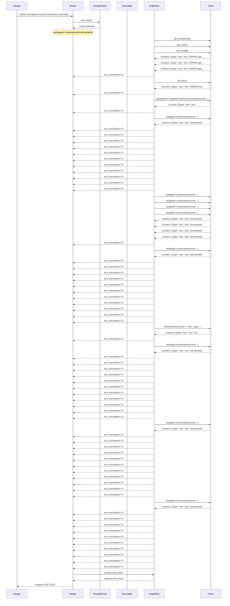

# Traza: Analiza el endpoint /mcp del contenedor conti-backend y documenta todas las tools en un documento mcp_tools_doc.md

- **Circuito**: `backend`
- **Workspace**: `/contenedores/conti-backend`
- **Inicio**: 2026-07-02T23:12:45.274808-03:00
- **Fin**: 2026-07-02T23:18:52.802388-03:00
- **Duración**: 367.528s
- **Eventos**: 97

## Diagrama de Secuencia



## Eventos Detallados

### 1. `start` (2026-07-02T23:12:45.275008-03:00)

```json
{
  "task": "Analiza el endpoint /mcp del contenedor conti-backend y documenta todas las tools en un documento mcp_tools_doc.md",
  "payload_keys": [
    "messages",
    "circuit",
    "_circuit",
    "_session"
  ],
  "circuit": "backend",
  "traces_dir": "/app/logs/ponytail"
}
```

### 2. `circuit_selected` (2026-07-02T23:12:45.287022-03:00)

```json
{
  "id": "backend",
  "workspace": "/contenedores/conti-backend",
  "session_id": "095274b9e208",
  "is_new_session": true
}
```

### 3. `governance_tool` (2026-07-02T23:12:45.304908-03:00)

```json
{
  "tool": "get_onboarding",
  "chars": 195
}
```

### 4. `governance_tool` (2026-07-02T23:12:45.310802-03:00)

```json
{
  "tool": "get_rules",
  "chars": 438
}
```

### 5. `governance_tool` (2026-07-02T23:12:45.314246-03:00)

```json
{
  "tool": "get_config",
  "chars": 3246
}
```

### 6. `governance_injected` (2026-07-02T23:12:45.314274-03:00)

```json
{
  "onboarding_len": 3939,
  "is_new_session": true
}
```

### 7. `omp_tool_start` (2026-07-02T23:12:55.791901-03:00)

```json
{
  "tool": "get_onboarding",
  "args": {},
  "result": null,
  "error": null,
  "ok": true
}
```

### 8. `omp_tool_start` (2026-07-02T23:12:55.791961-03:00)

```json
{
  "tool": "get_rules",
  "args": {},
  "result": null,
  "error": null,
  "ok": true
}
```

### 9. `omp_tool_start` (2026-07-02T23:12:55.791989-03:00)

```json
{
  "tool": "get_config",
  "args": {},
  "result": null,
  "error": null,
  "ok": true
}
```

### 10. `omp_tool_end` (2026-07-02T23:13:26.182065-03:00)

```json
{
  "tool": "get_onboarding",
  "args": {},
  "result": {
    "content": [
      {
        "type": "text",
        "text": "ERROR (get_onboarding): timeout después de 30.0s"
      }
    ],
    "details": {}
  },
  "error": null,
  "ok": true
}
```

### 11. `omp_tool_end` (2026-07-02T23:13:26.187015-03:00)

```json
{
  "tool": "get_config",
  "args": {},
  "result": {
    "content": [
      {
        "type": "text",
        "text": "ERROR (get_config): timeout después de 30.0s"
      }
    ],
    "details": {}
  },
  "error": null,
  "ok": true
}
```

### 12. `omp_tool_end` (2026-07-02T23:13:26.328087-03:00)

```json
{
  "tool": "get_rules",
  "args": {},
  "result": {
    "content": [
      {
        "type": "text",
        "text": "ERROR (get_rules): timeout después de 30.0s"
      }
    ],
    "details": {}
  },
  "error": null,
  "ok": true
}
```

### 13. `omp_turn_end` (2026-07-02T23:13:26.366206-03:00)

```json
{
  "event_type": "turn_end",
  "model": "?",
  "provider": "?"
}
```

### 14. `omp_tool_start` (2026-07-02T23:13:29.604592-03:00)

```json
{
  "tool": "list_files",
  "args": {},
  "result": null,
  "error": null,
  "ok": true
}
```

### 15. `omp_tool_end` (2026-07-02T23:14:00.275593-03:00)

```json
{
  "tool": "list_files",
  "args": {},
  "result": {
    "content": [
      {
        "type": "text",
        "text": "ERROR (list_files): timeout después de 30.0s"
      }
    ],
    "details": {}
  },
  "error": null,
  "ok": true
}
```

### 16. `omp_turn_end` (2026-07-02T23:14:00.343298-03:00)

```json
{
  "event_type": "turn_end",
  "model": "?",
  "provider": "?"
}
```

### 17. `omp_tool_start` (2026-07-02T23:14:04.018389-03:00)

```json
{
  "tool": "grep",
  "args": {
    "pattern": "mcp|MCP",
    "paths": [
      "/contenedores/conti-backend"
    ]
  },
  "result": null,
  "error": null,
  "ok": true
}
```

### 18. `omp_tool_end` (2026-07-02T23:14:04.928341-03:00)

```json
{
  "tool": "grep",
  "args": {
    "pattern": "mcp|MCP",
    "paths": [
      "/contenedores/conti-backend"
    ]
  },
  "result": {
    "content": [
      {
        "type": "text",
        "text": "# /contenedores/conti-backend/.ponytail/traces/\n## 2026-07-01_desarrollo_tr-0747f2854517.md#4A34\n 34:    Omp-->>Ponytail: agent_end (text)\n*35:    Ponytail->>Backend: mcp_record_trace\n 36:    Backend->>Backend: write .ponytail/traces/<id>.md\n 37:    Backend->>Backend: git add + commit (async)\n 38:    Ponytail-->>Client: OpenAI response\n## 2026-07-01_desarrollo_tr-37066b0aa710.md#AAC6\n 34:    Omp-->>Ponytail: agent_end (text)\n*35:    Ponytail->>Backend: mcp_record_trace\n 36:    Backend->>Backend: write .ponytail/traces/<id>.md\n 37:    Backend->>Backend: git add + commit (async)\n 38:    Ponytail-->>Client: OpenAI response\n## 2026-07-01_desarrollo_tr-39d9f76de961.md#4669\n 34:    Omp-->>Ponytail: agent_end (text)\n*35:    Ponytail->>Backend: mcp_record_trace\n 36:    Backend->>Backend: write .ponytail/traces/<id>.md\n 37:    Backend->>Backend: git add + commit (async)\n 38:    Ponytail-->>Client: OpenAI response\n## 2026-07-01_desarrollo_tr-52a1eeaf0728.md#DEE6\n 46:    loop 1 tool calls\n*47:        Omp->>MCP: call tool (name, args)\n*48:        MCP->>Backend: dispatch handler\n*49:        Backend-->>MCP: result\n*50:        MCP-->>Omp: result\n 51:    end\n 52:    Omp-->>Ponytail: agent_end (text)\n*53:    Ponytail->>Backend: mcp_record_trace\n 54:    Backend->>Backend: write .ponytail/traces/<id>.md\n 55:    Backend->>Backend: git add + commit (async)\n 56:    Ponytail-->>Client: OpenAI response\n## 2026-07-01_desarrollo_tr-65e3377faeee.md#4DED\n 34:    Omp-->>Ponytail: agent_end (text)\n*35:    Ponytail->>Backend: mcp_record_trace\n 36:    Backend->>Backend: write .ponytail/traces/<id>.md\n 37:    Backend->>Backend: git add + commit (async)\n 38:    Ponytail-->>Client: OpenAI response\n## 2026-07-01_desarrollo_tr-f405741d0a55.md#400D\n 34:    Omp-->>Ponytail: agent_end (text)\n*35:    Ponytail->>Backend: mcp_record_trace\n 36:    Backend->>Backend: write .ponytail/traces/<id>.md\n 37:    Backend->>Backend: git add + commit (async)\n 38:    Ponytail-->>Client: OpenAI response\n## 2026-07-01_libre_tr-11e0a8b784b8.md#0498\n 32:    Omp-->>Ponytail: agent_end (text)\n*33:    Ponytail->>Backend: mcp_record_trace\n 34:    Backend->>Backend: write .ponytail/traces/<id>.md\n 35:    Backend->>Backend: git add + commit (async)\n 36:    Ponytail-->>Client: OpenAI response\n## 2026-07-01_libre_tr-14efcbcbd9c5.md#EE7F\n 34:    Omp-->>Ponytail: agent_end (text)\n*35:    Ponytail->>Backend: mcp_record_trace\n 36:    Backend->>Backend: write .ponytail/traces/<id>.md\n 37:    Backend->>Backend: git add + commit (async)\n 38:    Ponytail-->>Client: OpenAI response\n## 2026-07-01_libre_tr-192e81d612aa.md#DEEE\n 34:    Omp-->>Ponytail: agent_end (text)\n*35:    Ponytail->>Backend: mcp_record_trace\n 36:    Backend->>Backend: write .ponytail/traces/<id>.md\n 37:    Backend->>Backend: git add + commit (async)\n 38:    Ponytail-->>Client: OpenAI response\n## 2026-07-01_libre_tr-1e0f5534680b.md#B364\n 32:    Omp-->>Ponytail: agent_end (text)\n*33:    Ponytail->>Backend: mcp_record_trace\n 34:    Backend->>Backend: write .ponytail/traces/<id>.md\n 35:    Backend->>Backend: git add + commit (async)\n 36:    Ponytail-->>Client: OpenAI response\n## 2026-07-01_libre_tr-7e66b5687b46.md#13AA\n 34:    Omp-->>Ponytail: agent_end (text)\n*35:    Ponytail->>Backend: mcp_record_trace\n 36:    Backend->>Backend: write .ponytail/traces/<id>.md\n 37:    Backend->>Backend: git add + commit (async)\n 38:    Ponytail-->>Client: OpenAI response\n## 2026-07-01_libre_tr-c2ac3cbba1e6.md#210D\n 34:    Omp-->>Ponytail: agent_end (text)\n*35:    Ponytail->>Backend: mcp_record_trace\n 36:    Backend->>Backend: write .ponytail/traces/<id>.md\n 37:    Backend->>Backend: git add + commit (async)\n 38:    Ponytail-->>Client: OpenAI response\n## 2026-07-01_libre_tr-cecc132007d7.md#4069\n 34:    Omp-->>Ponytail: agent_end (text)\n*35:    Ponytail->>Backend: mcp_record_trace\n 36:    Backend->>Backend: write .ponytail/traces/<id>.md\n 37:    Backend->>Backend: git add + commit (async)\n 38:    Ponytail-->>Client: OpenAI response\n## 2026-07-01_libre_tr-d05b411b7113.md#79DE\n 32:    Omp-->>Ponytail: agent_end (text)\n*33:    Ponytail->>Backend: mcp_record_trace\n 34:    Backend->>Backend: write .ponytail/traces/<id>.md\n 35:    Backend->>Backend: git add + commit (async)\n 36:    Ponytail-->>Client: OpenAI response\n## 2026-07-01_libre_tr-d9c314a1d967.md#AAAB\n 32:    Omp-->>Ponytail: agent_end (text)\n*33:    Ponytail->>Backend: mcp_record_trace\n 34:    Backend->>Backend: write .ponytail/traces/<id>.md\n 35:    Backend->>Backend: git add + commit (async)\n 36:    Ponytail-->>Client: OpenAI response\n## 2026-07-01_libre_tr-eed6b40f91af.md#7D16\n 32:    Omp-->>Ponytail: agent_end (text)\n*33:    Ponytail->>Backend: mcp_record_trace\n 34:    Backend->>Backend: write .ponytail/traces/<id>.md\n 35:    Backend->>Backend: git add + commit (async)\n 36:    Ponytail-->>Client: OpenAI response\n## 2026-07-02_backend_trace-1783016493509.md#ADD3\n 3:circuit: backend\n*4:task_name: Analiza el endpoint /mcp del contenedor conti-backend y documenta todas las tool\n 5:started_at: 2026-07-02T18:21:33.509551\n 6:ended_at: 2026-07-02T18:23:46.622991\n 7:duration_s: 133.113\n...\n 11:\n*12:# Traza: Analiza el endpoint /mcp del contenedor conti-backend y documenta todas las tool\n 13:\n 14:- **Circuito**: `backend`\n 15:- **Workspace**: `/contenedores/conti-backend`\n...\n 30:\n*31:    U->>R: Analiza el endpoint /mcp del contenedor conti-back\n 32:    R->>P: trace.start()\n 33:    P-->>R: circuit=backend\n 34:    Note over R: workspace=/contenedores/conti-backend\n...\n 47:{\n*48:  \"task\": \"Analiza el endpoint /mcp del contenedor conti-backend y documenta todas las tool\",\n 49:  \"payload_keys\": [\n 50:    \"messages\",\n 51:    \"circuit\",\n## 2026-07-02_backend_trace-1783026768850.md#4516\n 3:circuit: backend\n*4:task_name: Analiza el endpoint /mcp del contenedor conti-backend y documenta todas las tools en un documento mcp_tools_doc.md\n 5:started_at: 2026-07-02T21:12:48.850762\n 6:ended_at: 2026-07-02T21:15:56.619181\n 7:duration_s: 187.768\n...\n 11:\n*12:# Traza: Analiza el endpoint /mcp del contenedor conti-backend y documenta todas las tools en un documento mcp_tools_doc.md\n 13:\n 14:- **Circuito**: `backend`\n 15:- **Workspace**: `/contenedores/conti-backend`\n...\n 31:\n*32:    U->>R: Analiza el endpoint /mcp del contenedor conti-back...\n 33:    R->>P: trace.start()\n 34:    P-->>R: circuit=backend\n 35:    Note over R: workspace=/contenedores/conti-backend\n*36:    R->>S: search(Analiza el endpoint /mcp del c...)\n 37:    S-->>R: 1 hits\n 38:    O->>T: list_files(path=/contenedores/conti-...)\n 39:    T-->>O: {'content': [{'type': 'text', 'text': 'ERROR (list...\n...\n 81:{\n*82:  \"task\": \"Analiza el endpoint /mcp del contenedor conti-backend y documenta todas las tools en un documento mcp_tools_doc.md\",\n 83:  \"payload_keys\": [\n 84:    \"messages\",\n 85:    \"circuit\",\n...\n 105:{\n*106:  \"query\": \"Analiza el endpoint /mcp del contenedor conti-backend y documenta todas las tools en un documento mcp_tools_doc.md\",\n 107:  \"matches_requested\": 5,\n 108:  \"hits\": 1,\n 109:  \"results_preview\": [\n...\n 648:  \"args\": {\n*649:    \"path\": \"/contenedores/conti-backend/mcp.json\"\n 650:  },\n 651:  \"result\": null,\n 652:  \"error\": null,\n...\n 666:        \"type\": \"text\",\n*667:        \"text\": \"Path '/contenedores/conti-backend/mcp.json' not found\"\n 668:      }\n 669:    ],\n 670:    \"details\": {}\n...\n 822:  \"args\": {\n*823:    \"path\": \"/contenedores/conti-backend/config/mcp.json\"\n 824:  },\n 825:  \"result\": null,\n 826:  \"error\": null,\n...\n 840:        \"type\": \"text\",\n*841:        \"text\": \"Path '/contenedores/conti-backend/config/mcp.json' not found\"\n 842:      }\n 843:    ],\n 844:    \"details\": {}\n...\n 912:  \"args\": {\n*913:    \"command\": \"find /contenedores/conti-backend -type f -name \\\"*.json\\\" -o -name \\\"*.py\\\" -o -name \\\"*.toml\\\" | grep -i mcp | head -20\"\n 914:  },\n 915:  \"result\": null,\n 916:  \"error\": null,\n...\n 930:        \"type\": \"text\",\n*931:        \"text\": \"/contenedores/conti-backend/conti_home/.npm-global/lib/node_modules/@openhands/agent-canvas/node_modules/@openhands/extensions/integrations/catalog/browser-mcp.json\\n/contenedores/conti-backend/conti_home/.openhands/cache/skills/public-skills/integrations/catalog/browser-mcp.json\\n/contenedores/conti-backend/conti_home/.cache/uv/archive-v0/VWJFdIse4rrjODNA7fLi6/openhands/agent_server/mcp_router.py\\n/contenedores/conti-backend/conti_home/.cache/uv/archive-v0/zBRa_WNu52igXLFGrCayj/lib/pyth...\n 932:      }\n 933:    ],\n 934:    \"details\": {\n...\n 1054:  \"args\": {\n*1055:    \"path\": \"/contenedores/conti-backend/app/mcp/router.py\"\n 1056:  },\n 1057:  \"result\": null,\n 1058:  \"error\": null,\n...\n 1072:        \"type\": \"text\",\n*1073:        \"text\": \"[/contenedores/conti-backend/app/mcp/router.py#8B56]\\n1:from __future__ import annotations\\n…\\n14:from app.services.registry_service import registry_service\\n15:\\n16:\\n17:router = APIRouter(prefix=\\\"/mcp\\\", tags=[\\\"mcp\\\"])\\n18:\\n19:\\n20:# --- Modelos de Respuesta para Swagger ---\\n21:class MCPRootResponse(BaseModel):\\n22:    status: str = Field(default=\\\"ok\\\")\\n…\\n26:    tools_count: int = Field(..., description=\\\"Cantidad de herramientas registradas\\\")\\n27:\\n28:class MCPToolItem(Bas...\n 1074:      }\n 1075:    ],\n 1076:    \"details\": {\n 1077:      \"displayContent\": {\n*1078:        \"text\": \"from __future__ import annotations\\n…\\nfrom app.services.registry_service import registry_service\\n\\n\\nrouter = APIRouter(prefix=\\\"/mcp\\\", tags=[\\\"mcp\\\"])\\n\\n\\n# --- Modelos de Respuesta para Swagger ---\\nclass MCPRootResponse(BaseModel):\\n    status: str = Field(default=\\\"ok\\\")\\n…\\n    tools_count: int = Field(..., description=\\\"Cantidad de herramientas registradas\\\")\\n\\nclass MCPToolItem(BaseModel):\\n    name: str = Field(..., description=\\\"Nombre de la herramienta\\\")\\n    descript...\n 1079:        \"startLine\": 1\n 1080:      },\n 1081:      \"summary\": {\n...\n 1088:          \"type\": \"path\",\n*1089:          \"value\": \"/contenedores/conti-backend/app/mcp/router.py\"\n 1090:        }\n 1091:      }\n 1092:    }\n...\n 1272:```text\n*1273:Analiza el endpoint /mcp del contenedor conti-backend y documenta todas las tools en un documento mcp_tools_doc.md\n 1274:```\n## 2026-07-02_backend_trace-1783032373730.md#3486\n 3:circuit: backend\n*4:task_name: Analiza el endpoint /mcp del contenedor conti-backend y documenta todas las tools en un documento mcp_tools_doc.md\n 5:started_at: 2026-07-02T22:46:13.730282+00:00\n 6:ended_at: 2026-07-02T22:46:26.024003+00:00\n 7:duration_s: 12.294\n...\n 14:\n*15:# Traza: Analiza el endpoint /mcp del contenedor conti-backend y documenta todas las tools en un documento mcp_tools_doc.md\n 16:\n 17:- **Circuito**: `backend`\n 18:- **Workspace**: `/contenedores/conti-backend`\n...\n 34:\n*35:    U->>R: Analiza el endpoint /mcp del contenedor conti-back...\n 36:    R->>P: trace.start()\n 37:    P-->>R: circuit=backend\n 38:    Note over R: workspace=/contenedores/conti-backend\n*39:    R->>S: search(Analiza el endpoint /mcp del c...)\n 40:    S-->>R: 1 hits\n 41:    O-->>R: turn_end (tokens=?)\n 42:    R->>O: prompt_and_wait()\n...\n 52:{\n*53:  \"task\": \"Analiza el endpoint /mcp del contenedor conti-backend y documenta todas las tools en un documento mcp_tools_doc.md\",\n 54:  \"payload_keys\": [\n 55:    \"messages\",\n 56:    \"circuit\",\n...\n 76:{\n*77:  \"query\": \"Analiza el endpoint /mcp del contenedor conti-backend y documenta todas las tools en un documento mcp_tools_doc.md\",\n*78:  \"search_query\": \"conti-backend mcp\",\n 79:  \"matches_requested\": 5,\n 80:  \"hits\": 1,\n 81:  \"results_preview\": [\n...\n 89:      ],\n*90:      \"snippet\": \"### MCP\\n\",\n 91:      \"webUrl\": \"http://localhost:3010/browse/github.com/luisdalmasso/orquestador-contamela@refs/heads/main/-/blob/docs%2FESTADO_REAL.md\"\n 92:    }\n 93:  ]\n...\n 126:```text\n*127:Analiza el endpoint /mcp del contenedor conti-backend y documenta todas las tools en un documento mcp_tools_doc.md\n 128:```\n## 2026-07-02_backend_trace-1783032740936.md#8789\n 3:circuit: backend\n*4:task_name: Analiza el endpoint /mcp del contenedor conti-backend y documenta todas las tools en un documento mcp_tools_doc.md\n 5:started_at: 2026-07-02T22:52:20.936422+00:00\n 6:ended_at: 2026-07-02T22:55:27.057771+00:00\n 7:duration_s: 186.121\n...\n 17:\n*18:# Traza: Analiza el endpoint /mcp del contenedor conti-backend y documenta todas las tools en un documento mcp_tools_doc.md\n 19:\n 20:- **Circuito**: `backend`\n 21:- **Workspace**: `/contenedores/conti-backend`\n...\n 37:\n*38:    U->>R: Analiza el endpoint /mcp del contenedor conti-back...\n 39:    R->>P: trace.start()\n 40:    P-->>R: circuit=backend\n 41:    Note over R: workspace=/contenedores/conti-backend\n*42:    R->>S: search(Analiza el endpoint /mcp del c...)\n 43:    S-->>R: 1 hits\n 44:    O->>T: get_config()\n 45:    T-->>O: {'content': [{'type': 'text', 'text': 'ERROR (get_...\n...\n 99:{\n*100:  \"task\": \"Analiza el endpoint /mcp del contenedor conti-backend y documenta todas las tools en un documento mcp_tools_doc.md\",\n 101:  \"payload_keys\": [\n 102:    \"messages\",\n 103:    \"circuit\",\n...\n 123:{\n*124:  \"query\": \"Analiza el endpoint /mcp del contenedor conti-backend y documenta todas las tools en un documento mcp_tools_doc.md\",\n*125:  \"search_query\": \"conti-backend mcp\",\n 126:  \"matches_requested\": 5,\n 127:  \"hits\": 1,\n 128:  \"results_preview\": [\n...\n 136:      ],\n*137:      \"snippet\": \"### MCP\\n\",\n 138:      \"webUrl\": \"http://localhost:3010/browse/github.com/luisdalmasso/orquestador-contamela@refs/heads/main/-/blob/docs%2FESTADO_REAL.md\"\n 139:    }\n 140:  ]\n...\n 191:  \"args\": {\n*192:    \"command\": \"curl -s http://localhost:8000/mcp | head -100\",\n 193:    \"timeout\": 10\n 194:  },\n 195:  \"result\": null,\n...\n 206:  \"args\": {\n*207:    \"command\": \"curl -s http://localhost:8000/mcp | head -100\",\n 208:    \"timeout\": 10\n 209:  },\n 210:  \"result\": {\n...\n 497:  \"args\": {\n*498:    \"command\": \"find /contenedores/conti-backend -name \\\"*.py\\\" -o -name \\\"*.json\\\" -o -name \\\"*.yml\\\" -o -name \\\"*.yaml\\\" | xargs grep -l \\\"mcp\\\\|/mcp\\\" 2>/dev/null | head -10\",\n 499:    \"timeout\": 10\n 500:  },\n 501:  \"result\": null,\n...\n 512:  \"args\": {\n*513:    \"command\": \"find /contenedores/conti-backend -name \\\"*.py\\\" -o -name \\\"*.json\\\" -o -name \\\"*.yml\\\" -o -name \\\"*.yaml\\\" | xargs grep -l \\\"mcp\\\\|/mcp\\\" 2>/dev/null | head -10\",\n 514:    \"timeout\": 10\n 515:  },\n 516:  \"result\": {\n...\n 519:        \"type\": \"text\",\n*520:        \"text\": \"[Command timed out after 10 seconds]\\n/contenedores/conti-backend/conti_home/.npm-global/lib/node_modules/@openhands/agent-canvas/build/locales/zh-TW/openhands.json\\n/contenedores/conti-backend/conti_home/.npm-global/lib/node_modules/@openhands/agent-canvas/build/locales/es/openhands.json\\n/contenedores/conti-backend/conti_home/.npm-global/lib/node_modules/@openhands/agent-canvas/build/locales/ko-KR/openhands.json\\n/contenedores/conti-backend/conti_home/.npm-global/lib/node_modules/@open...\n 521:      }\n 522:    ],\n 523:    \"details\": {}\n...\n 647:        \"type\": \"text\",\n*648:        \"text\": \"/contenedores/conti-backend/conti_home/generate_error_report.py\\n/contenedores/conti-backend/conti_home/fix_prices_v9.py\\n/contenedores/conti-backend/conti_home/ingest_container_errors.py\\n/contenedores/conti-backend/conti_home/project_ingredients.py\\n/contenedores/conti-backend/conti_home/update_prices_v4.py\\n/contenedores/conti-backend/conti_home/update_local.py\\n/contenedores/conti-backend/conti_home/check_menu_remote.py\\n/contenedores/conti-backend/conti_home/add_to_table.py\\n/conten...\n 649:      }\n 650:    ],\n 651:    \"details\": {\n...\n 750:```text\n*751:Analiza el endpoint /mcp del contenedor conti-backend y documenta todas las tools en un documento mcp_tools_doc.md\n 752:```\n\nShowing files 1-20 of 276+. Use skip=20 for the next page, or narrow paths/pattern.\n\nSkipped 1 oversized file(s) (>4MB grep limit); target them directly with `read`\n\n[Some lines truncated to 512 chars]"
      }
    ],
    "details": {
      "scopePath": "/contenedores/conti-backend",
      "searchPath": "/contenedores/conti-backend",
      "cwd": "/desarrollo",
      "matchCount": 65,
      "fileCount": 20,
      "files": [
        "/contenedores/conti-backend/.ponytail/traces/2026-07-01_desarrollo_tr-0747f2854517.md",
        "/contenedores/conti-backend/.ponytail/traces/2026-07-01_desarrollo_tr-37066b0aa710.md",
        "/contenedores/conti-backend/.ponytail/traces/2026-07-01_desarrollo_tr-39d9f76de961.md",
        "/contenedores/conti-backend/.ponytail/traces/2026-07-01_desarrollo_tr-52a1eeaf0728.md",
        "/contenedores/conti-backend/.ponytail/traces/2026-07-01_desarrollo_tr-65e3377faeee.md",
        "/contenedores/conti-backend/.ponytail/traces/2026-07-01_desarrollo_tr-f405741d0a55.md",
        "/contenedores/conti-backend/.ponytail/traces/2026-07-01_libre_tr-11e0a8b784b8.md",
        "/contenedores/conti-backend/.ponytail/traces/2026-07-01_libre_tr-14efcbcbd9c5.md",
        "/contenedores/conti-backend/.ponytail/traces/2026-07-01_libre_tr-192e81d612aa.md",
        "/contenedores/conti-backend/.ponytail/traces/2026-07-01_libre_tr-1e0f5534680b.md",
        "/contenedores/conti-backend/.ponytail/traces/2026-07-01_libre_tr-7e66b5687b46.md",
        "/contenedores/conti-backend/.ponytail/traces/2026-07-01_libre_tr-c2ac3cbba1e6.md",
        "/contenedores/conti-backend/.ponytail/traces/2026-07-01_libre_tr-cecc132007d7.md",
        "/contenedores/conti-backend/.ponytail/traces/2026-07-01_libre_tr-d05b411b7113.md",
        "/contenedores/conti-backend/.ponytail/traces/2026-07-01_libre_tr-d9c314a1d967.md",
        "/contenedores/conti-backend/.ponytail/traces/2026-07-01_libre_tr-eed6b40f91af.md",
        "/contenedores/conti-backend/.ponytail/traces/2026-07-02_backend_trace-1783016493509.md",
        "/contenedores/conti-backend/.ponytail/traces/2026-07-02_backend_trace-1783026768850.md",
        "/contenedores/conti-backend/.ponytail/traces/2026-07-02_backend_trace-1783032373730.md",
        "/contenedores/conti-backend/.ponytail/traces/2026-07-02_backend_trace-1783032740936.md"
      ],
      "fileMatches": [
        {
          "path": "/contenedores/conti-backend/.ponytail/traces/2026-07-01_desarrollo_tr-0747f2854517.md",
          "count": 1
        },
        {
          "path": "/contenedores/conti-backend/.ponytail/traces/2026-07-01_desarrollo_tr-37066b0aa710.md",
          "count": 1
        },
        {
          "path": "/contenedores/conti-backend/.ponytail/traces/2026-07-01_desarrollo_tr-39d9f76de961.md",
          "count": 1
        },
        {
          "path": "/contenedores/conti-backend/.ponytail/traces/2026-07-01_desarrollo_tr-52a1eeaf0728.md",
          "count": 5
        },
        {
          "path": "/contenedores/conti-backend/.ponytail/traces/2026-07-01_desarrollo_tr-65e3377faeee.md",
          "count": 1
        },
        {
          "path": "/contenedores/conti-backend/.ponytail/traces/2026-07-01_desarrollo_tr-f405741d0a55.md",
          "count": 1
        },
        {
          "path": "/contenedores/conti-backend/.ponytail/traces/2026-07-01_libre_tr-11e0a8b784b8.md",
          "count": 1
        },
        {
          "path": "/contenedores/conti-backend/.ponytail/traces/2026-07-01_libre_tr-14efcbcbd9c5.md",
          "count": 1
        },
        {
          "path": "/contenedores/conti-backend/.ponytail/traces/2026-07-01_libre_tr-192e81d612aa.md",
          "count": 1
        },
        {
          "path": "/contenedores/conti-backend/.ponytail/traces/2026-07-01_libre_tr-1e0f5534680b.md",
          "count": 1
        },
        {
          "path": "/contenedores/conti-backend/.ponytail/traces/2026-07-01_libre_tr-7e66b5687b46.md",
          "count": 1
        },
        {
          "path": "/contenedores/conti-backend/.ponytail/traces/2026-07-01_libre_tr-c2ac3cbba1e6.md",
          "count": 1
        },
        {
          "path": "/contenedores/conti-backend/.ponytail/traces/2026-07-01_libre_tr-cecc132007d7.md",
          "count": 1
        },
        {
          "path": "/contenedores/conti-backend/.ponytail/traces/2026-07-01_libre_tr-d05b411b7113.md",
          "count": 1
        },
        {
          "path": "/contenedores/conti-backend/.ponytail/traces/2026-07-01_libre_tr-d9c314a1d967.md",
          "count": 1
        },
        {
          "path": "/contenedores/conti-backend/.ponytail/traces/2026-07-01_libre_tr-eed6b40f91af.md",
          "count": 1
        },
        {
          "path": "/contenedores/conti-backend/.ponytail/traces/2026-07-02_backend_trace-1783016493509.md",
          "count": 4
        },
        {
          "path": "/contenedores/conti-backend/.ponytail/traces/2026-07-02_backend_trace-1783026768850.md",
          "count": 17
        },
        {
          "path": "/contenedores/conti-backend/.ponytail/traces/2026-07-02_backend_trace-1783032373730.md",
          "count": 9
        },
        {
          "path": "/contenedores/conti-backend/.ponytail/traces/2026-07-02_backend_trace-1783032740936.md",
          "count": 15
        }
      ],
      "truncated": true,
      "fileLimitReached": 20,
      "perFileLimitReached": 20,
      "displayContent": "# /contenedores/conti-backend/.ponytail/traces/\n## 2026-07-01_desarrollo_tr-0747f2854517.md#4A34\n 34│    Omp-->>Ponytail: agent_end (text)\n*35│    Ponytail->>Backend: mcp_record_trace\n 36│    Backend->>Backend: write .ponytail/traces/<id>.md\n 37│    Backend->>Backend: git add + commit (async)\n 38│    Ponytail-->>Client: OpenAI response\n## 2026-07-01_desarrollo_tr-37066b0aa710.md#AAC6\n 34│    Omp-->>Ponytail: agent_end (text)\n*35│    Ponytail->>Backend: mcp_record_trace\n 36│    Backend->>Backend: write .ponytail/traces/<id>.md\n 37│    Backend->>Backend: git add + commit (async)\n 38│    Ponytail-->>Client: OpenAI response\n## 2026-07-01_desarrollo_tr-39d9f76de961.md#4669\n 34│    Omp-->>Ponytail: agent_end (text)\n*35│    Ponytail->>Backend: mcp_record_trace\n 36│    Backend->>Backend: write .ponytail/traces/<id>.md\n 37│    Backend->>Backend: git add + commit (async)\n 38│    Ponytail-->>Client: OpenAI response\n## 2026-07-01_desarrollo_tr-52a1eeaf0728.md#DEE6\n 46│    loop 1 tool calls\n*47│        Omp->>MCP: call tool (name, args)\n*48│        MCP->>Backend: dispatch handler\n*49│        Backend-->>MCP: result\n*50│        MCP-->>Omp: result\n 51│    end\n 52│    Omp-->>Ponytail: agent_end (text)\n*53│    Ponytail->>Backend: mcp_record_trace\n 54│    Backend->>Backend: write .ponytail/traces/<id>.md\n 55│    Backend->>Backend: git add + commit (async)\n 56│    Ponytail-->>Client: OpenAI response\n## 2026-07-01_desarrollo_tr-65e3377faeee.md#4DED\n 34│    Omp-->>Ponytail: agent_end (text)\n*35│    Ponytail->>Backend: mcp_record_trace\n 36│    Backend->>Backend: write .ponytail/traces/<id>.md\n 37│    Backend->>Backend: git add + commit (async)\n 38│    Ponytail-->>Client: OpenAI response\n## 2026-07-01_desarrollo_tr-f405741d0a55.md#400D\n 34│    Omp-->>Ponytail: agent_end (text)\n*35│    Ponytail->>Backend: mcp_record_trace\n 36│    Backend->>Backend: write .ponytail/traces/<id>.md\n 37│    Backend->>Backend: git add + commit (async)\n 38│    Ponytail-->>Client: OpenAI response\n## 2026-07-01_libre_tr-11e0a8b784b8.md#0498\n 32│    Omp-->>Ponytail: agent_end (text)\n*33│    Ponytail->>Backend: mcp_record_trace\n 34│    Backend->>Backend: write .ponytail/traces/<id>.md\n 35│    Backend->>Backend: git add + commit (async)\n 36│    Ponytail-->>Client: OpenAI response\n## 2026-07-01_libre_tr-14efcbcbd9c5.md#EE7F\n 34│    Omp-->>Ponytail: agent_end (text)\n*35│    Ponytail->>Backend: mcp_record_trace\n 36│    Backend->>Backend: write .ponytail/traces/<id>.md\n 37│    Backend->>Backend: git add + commit (async)\n 38│    Ponytail-->>Client: OpenAI response\n## 2026-07-01_libre_tr-192e81d612aa.md#DEEE\n 34│    Omp-->>Ponytail: agent_end (text)\n*35│    Ponytail->>Backend: mcp_record_trace\n 36│    Backend->>Backend: write .ponytail/traces/<id>.md\n 37│    Backend->>Backend: git add + commit (async)\n 38│    Ponytail-->>Client: OpenAI response\n## 2026-07-01_libre_tr-1e0f5534680b.md#B364\n 32│    Omp-->>Ponytail: agent_end (text)\n*33│    Ponytail->>Backend: mcp_record_trace\n 34│    Backend->>Backend: write .ponytail/traces/<id>.md\n 35│    Backend->>Backend: git add + commit (async)\n 36│    Ponytail-->>Client: OpenAI response\n## 2026-07-01_libre_tr-7e66b5687b46.md#13AA\n 34│    Omp-->>Ponytail: agent_end (text)\n*35│    Ponytail->>Backend: mcp_record_trace\n 36│    Backend->>Backend: write .ponytail/traces/<id>.md\n 37│    Backend->>Backend: git add + commit (async)\n 38│    Ponytail-->>Client: OpenAI response\n## 2026-07-01_libre_tr-c2ac3cbba1e6.md#210D\n 34│    Omp-->>Ponytail: agent_end (text)\n*35│    Ponytail->>Backend: mcp_record_trace\n 36│    Backend->>Backend: write .ponytail/traces/<id>.md\n 37│    Backend->>Backend: git add + commit (async)\n 38│    Ponytail-->>Client: OpenAI response\n## 2026-07-01_libre_tr-cecc132007d7.md#4069\n 34│    Omp-->>Ponytail: agent_end (text)\n*35│    Ponytail->>Backend: mcp_record_trace\n 36│    Backend->>Backend: write .ponytail/traces/<id>.md\n 37│    Backend->>Backend: git add + commit (async)\n 38│    Ponytail-->>Client: OpenAI response\n## 2026-07-01_libre_tr-d05b411b7113.md#79DE\n 32│    Omp-->>Ponytail: agent_end (text)\n*33│    Ponytail->>Backend: mcp_record_trace\n 34│    Backend->>Backend: write .ponytail/traces/<id>.md\n 35│    Backend->>Backend: git add + commit (async)\n 36│    Ponytail-->>Client: OpenAI response\n## 2026-07-01_libre_tr-d9c314a1d967.md#AAAB\n 32│    Omp-->>Ponytail: agent_end (text)\n*33│    Ponytail->>Backend: mcp_record_trace\n 34│    Backend->>Backend: write .ponytail/traces/<id>.md\n 35│    Backend->>Backend: git add + commit (async)\n 36│    Ponytail-->>Client: OpenAI response\n## 2026-07-01_libre_tr-eed6b40f91af.md#7D16\n 32│    Omp-->>Ponytail: agent_end (text)\n*33│    Ponytail->>Backend: mcp_record_trace\n 34│    Backend->>Backend: write .ponytail/traces/<id>.md\n 35│    Backend->>Backend: git add + commit (async)\n 36│    Ponytail-->>Client: OpenAI response\n## 2026-07-02_backend_trace-1783016493509.md#ADD3\n  3│circuit: backend\n *4│task_name: Analiza el endpoint /mcp del contenedor conti-backend y documenta todas las tool\n  5│started_at: 2026-07-02T18:21:33.509551\n  6│ended_at: 2026-07-02T18:23:46.622991\n  7│duration_s: 133.113\n   │...\n 11│\n*12│# Traza: Analiza el endpoint /mcp del contenedor conti-backend y documenta todas las tool\n 13│\n 14│- **Circuito**: `backend`\n 15│- **Workspace**: `/contenedores/conti-backend`\n   │...\n 30│\n*31│    U->>R: Analiza el endpoint /mcp del contenedor conti-back\n 32│    R->>P: trace.start()\n 33│    P-->>R: circuit=backend\n 34│    Note over R: workspace=/contenedores/conti-backend\n   │...\n 47│{\n*48│  \"task\": \"Analiza el endpoint /mcp del contenedor conti-backend y documenta todas las tool\",\n 49│  \"payload_keys\": [\n 50│    \"messages\",\n 51│    \"circuit\",\n## 2026-07-02_backend_trace-1783026768850.md#4516\n    3│circuit: backend\n   *4│task_name: Analiza el endpoint /mcp del contenedor conti-backend y documenta todas las tools en un documento mcp_tools_doc.md\n    5│started_at: 2026-07-02T21:12:48.850762\n    6│ended_at: 2026-07-02T21:15:56.619181\n    7│duration_s: 187.768\n     │...\n   11│\n  *12│# Traza: Analiza el endpoint /mcp del contenedor conti-backend y documenta todas las tools en un documento mcp_tools_doc.md\n   13│\n   14│- **Circuito**: `backend`\n   15│- **Workspace**: `/contenedores/conti-backend`\n     │...\n   31│\n  *32│    U->>R: Analiza el endpoint /mcp del contenedor conti-back...\n   33│    R->>P: trace.start()\n   34│    P-->>R: circuit=backend\n   35│    Note over R: workspace=/contenedores/conti-backend\n  *36│    R->>S: search(Analiza el endpoint /mcp del c...)\n   37│    S-->>R: 1 hits\n   38│    O->>T: list_files(path=/contenedores/conti-...)\n   39│    T-->>O: {'content': [{'type': 'text', 'text': 'ERROR (list...\n     │...\n   81│{\n  *82│  \"task\": \"Analiza el endpoint /mcp del contenedor conti-backend y documenta todas las tools en un documento mcp_tools_doc.md\",\n   83│  \"payload_keys\": [\n   84│    \"messages\",\n   85│    \"circuit\",\n     │...\n  105│{\n *106│  \"query\": \"Analiza el endpoint /mcp del contenedor conti-backend y documenta todas las tools en un documento mcp_tools_doc.md\",\n  107│  \"matches_requested\": 5,\n  108│  \"hits\": 1,\n  109│  \"results_preview\": [\n     │...\n  648│  \"args\": {\n *649│    \"path\": \"/contenedores/conti-backend/mcp.json\"\n  650│  },\n  651│  \"result\": null,\n  652│  \"error\": null,\n     │...\n  666│        \"type\": \"text\",\n *667│        \"text\": \"Path '/contenedores/conti-backend/mcp.json' not found\"\n  668│      }\n  669│    ],\n  670│    \"details\": {}\n     │...\n  822│  \"args\": {\n *823│    \"path\": \"/contenedores/conti-backend/config/mcp.json\"\n  824│  },\n  825│  \"result\": null,\n  826│  \"error\": null,\n     │...\n  840│        \"type\": \"text\",\n *841│        \"text\": \"Path '/contenedores/conti-backend/config/mcp.json' not found\"\n  842│      }\n  843│    ],\n  844│    \"details\": {}\n     │...\n  912│  \"args\": {\n *913│    \"command\": \"find /contenedores/conti-backend -type f -name \\\"*.json\\\" -o -name \\\"*.py\\\" -o -name \\\"*.toml\\\" | grep -i mcp | head -20\"\n  914│  },\n  915│  \"result\": null,\n  916│  \"error\": null,\n     │...\n  930│        \"type\": \"text\",\n *931│        \"text\": \"/contenedores/conti-backend/conti_home/.npm-global/lib/node_modules/@openhands/agent-canvas/node_modules/@openhands/extensions/integrations/catalog/browser-mcp.json\\n/contenedores/conti-backend/conti_home/.openhands/cache/skills/public-skills/integrations/catalog/browser-mcp.json\\n/contenedores/conti-backend/conti_home/.cache/uv/archive-v0/VWJFdIse4rrjODNA7fLi6/openhands/agent_server/mcp_router.py\\n/contenedores/conti-backend/conti_home/.cache/uv/archive-v0/zBRa_WNu52igXLFGrCayj/lib/pyth...\n  932│      }\n  933│    ],\n  934│    \"details\": {\n     │...\n 1054│  \"args\": {\n*1055│    \"path\": \"/contenedores/conti-backend/app/mcp/router.py\"\n 1056│  },\n 1057│  \"result\": null,\n 1058│  \"error\": null,\n     │...\n 1072│        \"type\": \"text\",\n*1073│        \"text\": \"[/contenedores/conti-backend/app/mcp/router.py#8B56]\\n1:from __future__ import annotations\\n…\\n14:from app.services.registry_service import registry_service\\n15:\\n16:\\n17:router = APIRouter(prefix=\\\"/mcp\\\", tags=[\\\"mcp\\\"])\\n18:\\n19:\\n20:# --- Modelos de Respuesta para Swagger ---\\n21:class MCPRootResponse(BaseModel):\\n22:    status: str = Field(default=\\\"ok\\\")\\n…\\n26:    tools_count: int = Field(..., description=\\\"Cantidad de herramientas registradas\\\")\\n27:\\n28:class MCPToolItem(Bas...\n 1074│      }\n 1075│    ],\n 1076│    \"details\": {\n 1077│      \"displayContent\": {\n*1078│        \"text\": \"from __future__ import annotations\\n…\\nfrom app.services.registry_service import registry_service\\n\\n\\nrouter = APIRouter(prefix=\\\"/mcp\\\", tags=[\\\"mcp\\\"])\\n\\n\\n# --- Modelos de Respuesta para Swagger ---\\nclass MCPRootResponse(BaseModel):\\n    status: str = Field(default=\\\"ok\\\")\\n…\\n    tools_count: int = Field(..., description=\\\"Cantidad de herramientas registradas\\\")\\n\\nclass MCPToolItem(BaseModel):\\n    name: str = Field(..., description=\\\"Nombre de la herramienta\\\")\\n    descript...\n 1079│        \"startLine\": 1\n 1080│      },\n 1081│      \"summary\": {\n     │...\n 1088│          \"type\": \"path\",\n*1089│          \"value\": \"/contenedores/conti-backend/app/mcp/router.py\"\n 1090│        }\n 1091│      }\n 1092│    }\n     │...\n 1272│```text\n*1273│Analiza el endpoint /mcp del contenedor conti-backend y documenta todas las tools en un documento mcp_tools_doc.md\n 1274│```\n## 2026-07-02_backend_trace-1783032373730.md#3486\n   3│circuit: backend\n  *4│task_name: Analiza el endpoint /mcp del contenedor conti-backend y documenta todas las tools en un documento mcp_tools_doc.md\n   5│started_at: 2026-07-02T22:46:13.730282+00:00\n   6│ended_at: 2026-07-02T22:46:26.024003+00:00\n   7│duration_s: 12.294\n    │...\n  14│\n *15│# Traza: Analiza el endpoint /mcp del contenedor conti-backend y documenta todas las tools en un documento mcp_tools_doc.md\n  16│\n  17│- **Circuito**: `backend`\n  18│- **Workspace**: `/contenedores/conti-backend`\n    │...\n  34│\n *35│    U->>R: Analiza el endpoint /mcp del contenedor conti-back...\n  36│    R->>P: trace.start()\n  37│    P-->>R: circuit=backend\n  38│    Note over R: workspace=/contenedores/conti-backend\n *39│    R->>S: search(Analiza el endpoint /mcp del c...)\n  40│    S-->>R: 1 hits\n  41│    O-->>R: turn_end (tokens=?)\n  42│    R->>O: prompt_and_wait()\n    │...\n  52│{\n *53│  \"task\": \"Analiza el endpoint /mcp del contenedor conti-backend y documenta todas las tools en un documento mcp_tools_doc.md\",\n  54│  \"payload_keys\": [\n  55│    \"messages\",\n  56│    \"circuit\",\n    │...\n  76│{\n *77│  \"query\": \"Analiza el endpoint /mcp del contenedor conti-backend y documenta todas las tools en un documento mcp_tools_doc.md\",\n *78│  \"search_query\": \"conti-backend mcp\",\n  79│  \"matches_requested\": 5,\n  80│  \"hits\": 1,\n  81│  \"results_preview\": [\n    │...\n  89│      ],\n *90│      \"snippet\": \"### MCP\\n\",\n  91│      \"webUrl\": \"http://localhost:3010/browse/github.com/luisdalmasso/orquestador-contamela@refs/heads/main/-/blob/docs%2FESTADO_REAL.md\"\n  92│    }\n  93│  ]\n    │...\n 126│```text\n*127│Analiza el endpoint /mcp del contenedor conti-backend y documenta todas las tools en un documento mcp_tools_doc.md\n 128│```\n## 2026-07-02_backend_trace-1783032740936.md#8789\n   3│circuit: backend\n  *4│task_name: Analiza el endpoint /mcp del contenedor conti-backend y documenta todas las tools en un documento mcp_tools_doc.md\n   5│started_at: 2026-07-02T22:52:20.936422+00:00\n   6│ended_at: 2026-07-02T22:55:27.057771+00:00\n   7│duration_s: 186.121\n    │...\n  17│\n *18│# Traza: Analiza el endpoint /mcp del contenedor conti-backend y documenta todas las tools en un documento mcp_tools_doc.md\n  19│\n  20│- **Circuito**: `backend`\n  21│- **Workspace**: `/contenedores/conti-backend`\n    │...\n  37│\n *38│    U->>R: Analiza el endpoint /mcp del contenedor conti-back...\n  39│    R->>P: trace.start()\n  40│    P-->>R: circuit=backend\n  41│    Note over R: workspace=/contenedores/conti-backend\n *42│    R->>S: search(Analiza el endpoint /mcp del c...)\n  43│    S-->>R: 1 hits\n  44│    O->>T: get_config()\n  45│    T-->>O: {'content': [{'type': 'text', 'text': 'ERROR (get_...\n    │...\n  99│{\n*100│  \"task\": \"Analiza el endpoint /mcp del contenedor conti-backend y documenta todas las tools en un documento mcp_tools_doc.md\",\n 101│  \"payload_keys\": [\n 102│    \"messages\",\n 103│    \"circuit\",\n    │...\n 123│{\n*124│  \"query\": \"Analiza el endpoint /mcp del contenedor conti-backend y documenta todas las tools en un documento mcp_tools_doc.md\",\n*125│  \"search_query\": \"conti-backend mcp\",\n 126│  \"matches_requested\": 5,\n 127│  \"hits\": 1,\n 128│  \"results_preview\": [\n    │...\n 136│      ],\n*137│      \"snippet\": \"### MCP\\n\",\n 138│      \"webUrl\": \"http://localhost:3010/browse/github.com/luisdalmasso/orquestador-contamela@refs/heads/main/-/blob/docs%2FESTADO_REAL.md\"\n 139│    }\n 140│  ]\n    │...\n 191│  \"args\": {\n*192│    \"command\": \"curl -s http://localhost:8000/mcp | head -100\",\n 193│    \"timeout\": 10\n 194│  },\n 195│  \"result\": null,\n    │...\n 206│  \"args\": {\n*207│    \"command\": \"curl -s http://localhost:8000/mcp | head -100\",\n 208│    \"timeout\": 10\n 209│  },\n 210│  \"result\": {\n    │...\n 497│  \"args\": {\n*498│    \"command\": \"find /contenedores/conti-backend -name \\\"*.py\\\" -o -name \\\"*.json\\\" -o -name \\\"*.yml\\\" -o -name \\\"*.yaml\\\" | xargs grep -l \\\"mcp\\\\|/mcp\\\" 2>/dev/null | head -10\",\n 499│    \"timeout\": 10\n 500│  },\n 501│  \"result\": null,\n    │...\n 512│  \"args\": {\n*513│    \"command\": \"find /contenedores/conti-backend -name \\\"*.py\\\" -o -name \\\"*.json\\\" -o -name \\\"*.yml\\\" -o -name \\\"*.yaml\\\" | xargs grep -l \\\"mcp\\\\|/mcp\\\" 2>/dev/null | head -10\",\n 514│    \"timeout\": 10\n 515│  },\n 516│  \"result\": {\n    │...\n 519│        \"type\": \"text\",\n*520│        \"text\": \"[Command timed out after 10 seconds]\\n/contenedores/conti-backend/conti_home/.npm-global/lib/node_modules/@openhands/agent-canvas/build/locales/zh-TW/openhands.json\\n/contenedores/conti-backend/conti_home/.npm-global/lib/node_modules/@openhands/agent-canvas/build/locales/es/openhands.json\\n/contenedores/conti-backend/conti_home/.npm-global/lib/node_modules/@openhands/agent-canvas/build/locales/ko-KR/openhands.json\\n/contenedores/conti-backend/conti_home/.npm-global/lib/node_modules/@open...\n 521│      }\n 522│    ],\n 523│    \"details\": {}\n    │...\n 647│        \"type\": \"text\",\n*648│        \"text\": \"/contenedores/conti-backend/conti_home/generate_error_report.py\\n/contenedores/conti-backend/conti_home/fix_prices_v9.py\\n/contenedores/conti-backend/conti_home/ingest_container_errors.py\\n/contenedores/conti-backend/conti_home/project_ingredients.py\\n/contenedores/conti-backend/conti_home/update_prices_v4.py\\n/contenedores/conti-backend/conti_home/update_local.py\\n/contenedores/conti-backend/conti_home/check_menu_remote.py\\n/contenedores/conti-backend/conti_home/add_to_table.py\\n/conten...\n 649│      }\n 650│    ],\n 651│    \"details\": {\n    │...\n 750│```text\n*751│Analiza el endpoint /mcp del contenedor conti-backend y documenta todas las tools en un documento mcp_tools_doc.md\n 752│```",
      "linesTruncated": true,
      "meta": {
        "limits": {
          "columnTruncated": {
            "maxColumn": 512
          }
        }
      }
    }
  },
  "error": null,
  "ok": true
}
```

### 19. `omp_turn_end` (2026-07-02T23:14:04.962992-03:00)

```json
{
  "event_type": "turn_end",
  "model": "?",
  "provider": "?"
}
```

### 20. `omp_tool_start` (2026-07-02T23:14:08.257431-03:00)

```json
{
  "tool": "read",
  "args": {
    "path": "/contenedores/conti-backend/app/mcp/router.py"
  },
  "result": null,
  "error": null,
  "ok": true
}
```

### 21. `omp_tool_end` (2026-07-02T23:14:08.285695-03:00)

```json
{
  "tool": "read",
  "args": {
    "path": "/contenedores/conti-backend/app/mcp/router.py"
  },
  "result": {
    "content": [
      {
        "type": "text",
        "text": "[/contenedores/conti-backend/app/mcp/router.py#8B56]\n1:from __future__ import annotations\n…\n14:from app.services.registry_service import registry_service\n15:\n16:\n17:router = APIRouter(prefix=\"/mcp\", tags=[\"mcp\"])\n18:\n19:\n20:# --- Modelos de Respuesta para Swagger ---\n21:class MCPRootResponse(BaseModel):\n22:    status: str = Field(default=\"ok\")\n…\n26:    tools_count: int = Field(..., description=\"Cantidad de herramientas registradas\")\n27:\n28:class MCPToolItem(BaseModel):\n29:    name: str = Field(..., description=\"Nombre de la herramienta\")\n30:    description: str = Field(default=\"\", description=\"Descripción funcional de la herramienta\")\n31:    inputSchema: dict[str, Any] = Field(..., description=\"JSON Schema de los argumentos esperados\")\n32:\n33:class MCPToolsResponse(BaseModel):\n34:    status: str = Field(default=\"ok\")\n…\n53:    }\n54:\n55:class MCPExecuteResponse(BaseModel):\n56:    success: bool = Field(..., description=\"Indica si la ejecución fue exitosa\")\n57:    result: Any | None = Field(default=None, description=\"Resultado de la ejecución de la herramienta\")\n58:    error: str | None = Field(default=None, description=\"Mensaje de error si la ejecución falló\")\n59:\n60:\n61:def _mcp_root_payload() -> dict:\n62:    registry = registry_service()\n…\n76:    }\n77:\n78:\n79:def _jsonrpc_success(request_id, result: dict | list | str | int | float | None) -> dict:\n80:    return {\"jsonrpc\": \"2.0\", \"id\": request_id, \"result\": result}\n81:\n82:\n83:def _jsonrpc_error(request_id, code: int, message: str, data: dict | None = None) -> JSONResponse:\n84:    payload = {\n…\n94:    return JSONResponse(status_code=200, content=payload)\n95:\n96:\n97:def _mcp_tools_payload() -> list[dict]:\n98:    registry = registry_service()\n…\n108:    return tools\n109:\n110:\n111:def _mcp_tool_result(tool_name: str, result, is_error: bool = False) -> dict:\n112:    text = result if isinstance(result, str) else json.dumps(result, ensure_ascii=False)\n…\n121:    return payload\n122:\n123:\n124:async def _sse_event_stream(request: Request, post_path: str):\n125:    session_id = uuid4().hex\n…\n133:        yield \": keep-alive\\n\\n\"\n134:\n135:\n136:def _sse_response(request: Request, post_path: str = \"/mcp\") -> StreamingResponse:\n137-145:    return StreamingResponse( … )\n146:\n147:\n148-153:@router.get( … )\n154-158:@router.get( … )\n159:def get_mcp_root(request: Request):\n160:    accept = request.headers.get(\"accept\", \"\")\n…\n163:    return _mcp_root_payload()\n164:\n165:\n166-170:@router.post( … )\n171-174:@router.post( … )\n175:def post_mcp_root(request: dict):\n176:    request_id = request.get(\"id\")\n…\n219:    return _jsonrpc_error(request_id, -32601, f\"Método no soportado: {method}\")\n220:\n221:\n222-227:@router.get( … )\n228:def get_mcp_tools() -> dict:\n229-232:    return { … }\n233:\n234:\n235-240:@router.post( … )\n241:def post_mcp_call(request: MCPCallRequest) -> ToolCallResponse:\n242:    registry = registry_service()\n…\n249:        raise HTTPException(status_code=400, detail=str(exc)) from exc\n250:\n251:\n252-257:@router.post( … )\n258:def post_mcp_execute(request: dict):\n259:    tool_name = request.get(\"tool_name\") or request.get(\"tool\") or request.get(\"name\")\n…\n271:        return JSONResponse(status_code=400, content={\"success\": False, \"result\": None, \"error\": str(exc)})\n272:\n273:\n274-278:@router.get( … )\n279-282:@router.get( … )\n283:def get_mcp_sse(request: Request) -> StreamingResponse:\n284:    return _sse_response(request, post_path=\"/mcp\")\n285:\n286:\n287-291:@router.post( … )\n292-295:@router.post( … )\n296:def post_mcp_sse(request: dict):\n297:    return post_mcp_root(request)\n\n[…183ln elided; re-read needed ranges, e.g. /contenedores/conti-backend/app/mcp/router.py:2-13,23-25]"
      }
    ],
    "details": {
      "displayContent": {
        "text": "from __future__ import annotations\n…\nfrom app.services.registry_service import registry_service\n\n\nrouter = APIRouter(prefix=\"/mcp\", tags=[\"mcp\"])\n\n\n# --- Modelos de Respuesta para Swagger ---\nclass MCPRootResponse(BaseModel):\n    status: str = Field(default=\"ok\")\n…\n    tools_count: int = Field(..., description=\"Cantidad de herramientas registradas\")\n\nclass MCPToolItem(BaseModel):\n    name: str = Field(..., description=\"Nombre de la herramienta\")\n    description: str = Field(default=\"\", description=\"Descripción funcional de la herramienta\")\n    inputSchema: dict[str, Any] = Field(..., description=\"JSON Schema de los argumentos esperados\")\n\nclass MCPToolsResponse(BaseModel):\n    status: str = Field(default=\"ok\")\n…\n    }\n\nclass MCPExecuteResponse(BaseModel):\n    success: bool = Field(..., description=\"Indica si la ejecución fue exitosa\")\n    result: Any | None = Field(default=None, description=\"Resultado de la ejecución de la herramienta\")\n    error: str | None = Field(default=None, description=\"Mensaje de error si la ejecución falló\")\n\n\ndef _mcp_root_payload() -> dict:\n    registry = registry_service()\n…\n    }\n\n\ndef _jsonrpc_success(request_id, result: dict | list | str | int | float | None) -> dict:\n    return {\"jsonrpc\": \"2.0\", \"id\": request_id, \"result\": result}\n\n\ndef _jsonrpc_error(request_id, code: int, message: str, data: dict | None = None) -> JSONResponse:\n    payload = {\n…\n    return JSONResponse(status_code=200, content=payload)\n\n\ndef _mcp_tools_payload() -> list[dict]:\n    registry = registry_service()\n…\n    return tools\n\n\ndef _mcp_tool_result(tool_name: str, result, is_error: bool = False) -> dict:\n    text = result if isinstance(result, str) else json.dumps(result, ensure_ascii=False)\n…\n    return payload\n\n\nasync def _sse_event_stream(request: Request, post_path: str):\n    session_id = uuid4().hex\n…\n        yield \": keep-alive\\n\\n\"\n\n\ndef _sse_response(request: Request, post_path: str = \"/mcp\") -> StreamingResponse:\n    return StreamingResponse( … )\n\n\n@router.get( … )\n@router.get( … )\ndef get_mcp_root(request: Request):\n    accept = request.headers.get(\"accept\", \"\")\n…\n    return _mcp_root_payload()\n\n\n@router.post( … )\n@router.post( … )\ndef post_mcp_root(request: dict):\n    request_id = request.get(\"id\")\n…\n    return _jsonrpc_error(request_id, -32601, f\"Método no soportado: {method}\")\n\n\n@router.get( … )\ndef get_mcp_tools() -> dict:\n    return { … }\n\n\n@router.post( … )\ndef post_mcp_call(request: MCPCallRequest) -> ToolCallResponse:\n    registry = registry_service()\n…\n        raise HTTPException(status_code=400, detail=str(exc)) from exc\n\n\n@router.post( … )\ndef post_mcp_execute(request: dict):\n    tool_name = request.get(\"tool_name\") or request.get(\"tool\") or request.get(\"name\")\n…\n        return JSONResponse(status_code=400, content={\"success\": False, \"result\": None, \"error\": str(exc)})\n\n\n@router.get( … )\n@router.get( … )\ndef get_mcp_sse(request: Request) -> StreamingResponse:\n    return _sse_response(request, post_path=\"/mcp\")\n\n\n@router.post( … )\n@router.post( … )\ndef post_mcp_sse(request: dict):\n    return post_mcp_root(request)",
        "startLine": 1
      },
      "summary": {
        "lines": 113,
        "elidedSpans": 25,
        "elidedLines": 183
      },
      "meta": {
        "source": {
          "type": "path",
          "value": "/contenedores/conti-backend/app/mcp/router.py"
        }
      }
    }
  },
  "error": null,
  "ok": true
}
```

### 22. `omp_turn_end` (2026-07-02T23:14:08.286984-03:00)

```json
{
  "event_type": "turn_end",
  "model": "?",
  "provider": "?"
}
```

### 23. `omp_turn_end` (2026-07-02T23:14:08.799147-03:00)

```json
{
  "event_type": "turn_end",
  "model": "?",
  "provider": "?"
}
```

### 24. `omp_turn_end` (2026-07-02T23:14:09.954974-03:00)

```json
{
  "event_type": "turn_end",
  "model": "?",
  "provider": "?"
}
```

### 25. `omp_turn_end` (2026-07-02T23:14:11.277184-03:00)

```json
{
  "event_type": "turn_end",
  "model": "?",
  "provider": "?"
}
```

### 26. `omp_turn_end` (2026-07-02T23:14:13.485606-03:00)

```json
{
  "event_type": "turn_end",
  "model": "?",
  "provider": "?"
}
```

### 27. `omp_turn_end` (2026-07-02T23:14:17.258628-03:00)

```json
{
  "event_type": "turn_end",
  "model": "?",
  "provider": "?"
}
```

### 28. `omp_turn_end` (2026-07-02T23:14:25.200339-03:00)

```json
{
  "event_type": "turn_end",
  "model": "?",
  "provider": "?"
}
```

### 29. `omp_turn_end` (2026-07-02T23:14:31.764892-03:00)

```json
{
  "event_type": "turn_end",
  "model": "?",
  "provider": "?"
}
```

### 30. `omp_turn_end` (2026-07-02T23:14:40.246048-03:00)

```json
{
  "event_type": "turn_end",
  "model": "?",
  "provider": "?"
}
```

### 31. `omp_turn_end` (2026-07-02T23:14:47.825584-03:00)

```json
{
  "event_type": "turn_end",
  "model": "?",
  "provider": "?"
}
```

### 32. `omp_turn_end` (2026-07-02T23:14:55.268805-03:00)

```json
{
  "event_type": "turn_end",
  "model": "?",
  "provider": "?"
}
```

### 33. `omp_tool_start` (2026-07-02T23:15:05.786187-03:00)

```json
{
  "tool": "read",
  "args": {
    "path": "/contenedores/conti-backend/app/mcp/router.py:2-13"
  },
  "result": null,
  "error": null,
  "ok": true
}
```

### 34. `omp_tool_start` (2026-07-02T23:15:05.786221-03:00)

```json
{
  "tool": "read",
  "args": {
    "path": "/contenedores/conti-backend/app/mcp/router.py:23-25"
  },
  "result": null,
  "error": null,
  "ok": true
}
```

### 35. `omp_tool_start` (2026-07-02T23:15:05.786239-03:00)

```json
{
  "tool": "read",
  "args": {
    "path": "/contenedores/conti-backend/app/mcp/router.py:97-109"
  },
  "result": null,
  "error": null,
  "ok": true
}
```

### 36. `omp_tool_start` (2026-07-02T23:15:05.786290-03:00)

```json
{
  "tool": "read",
  "args": {
    "path": "/contenedores/conti-backend/app/mcp/router.py:235-272"
  },
  "result": null,
  "error": null,
  "ok": true
}
```

### 37. `omp_tool_end` (2026-07-02T23:15:05.839998-03:00)

```json
{
  "tool": "read",
  "args": {
    "path": "/contenedores/conti-backend/app/mcp/router.py:235-272"
  },
  "result": {
    "content": [
      {
        "type": "text",
        "text": "[/contenedores/conti-backend/app/mcp/router.py#8B56]\n234:\n235:@router.post(\n236:    \"/call\",\n237:    response_model=ToolCallResponse,\n238:    summary=\"Invocar una herramienta (REST)\",\n239:    description=\"Permite invocar una herramienta específica pasando su nombre y argumentos en formato JSON estándar (REST).\"\n240:)\n241:def post_mcp_call(request: MCPCallRequest) -> ToolCallResponse:\n242:    registry = registry_service()\n243:    try:\n244:        result = registry.call(request.tool, request.arguments)\n245:        return ToolCallResponse(success=True, tool=request.tool, result=result)\n246:    except KeyError as exc:\n247:        raise HTTPException(status_code=404, detail=str(exc)) from exc\n248:    except ValueError as exc:\n249:        raise HTTPException(status_code=400, detail=str(exc)) from exc\n250:\n251:\n252:@router.post(\n253:    \"/execute\",\n254:    response_model=MCPExecuteResponse,\n255:    summary=\"Ejecutar herramienta (Legacy)\",\n256:    description=\"Endpoint alternativo para la ejecución de herramientas, compatible con integraciones anteriores y clientes que no siguen el esquema MCP estándar.\"\n257:)\n258:def post_mcp_execute(request: dict):\n259:    tool_name = request.get(\"tool_name\") or request.get(\"tool\") or request.get(\"name\")\n260:    arguments = request.get(\"arguments\") or request.get(\"params\") or {}\n261:    if not tool_name:\n262:        raise HTTPException(status_code=400, detail=\"tool_name es requerido\")\n263:\n264:    registry = registry_service()\n265:    try:\n266:        result = registry.call(tool_name, arguments)\n267:        return {\"success\": True, \"result\": result, \"error\": None}\n268:    except KeyError as exc:\n269:        return JSONResponse(status_code=404, content={\"success\": False, \"result\": None, \"error\": str(exc)})\n270:    except ValueError as exc:\n271:        return JSONResponse(status_code=400, content={\"success\": False, \"result\": None, \"error\": str(exc)})\n272:\n273:\n274:@router.get(\n275:    \"/sse\",\n…\n278:)\n…\n284:    return _sse_response(request, post_path=\"/mcp\")\n\n[Showing lines 234-275 of 298. Use :276 to continue]"
      }
    ],
    "details": {
      "truncation": {
        "content": "\n@router.post(\n    \"/call\",\n    response_model=ToolCallResponse,\n    summary=\"Invocar una herramienta (REST)\",\n    description=\"Permite invocar una herramienta específica pasando su nombre y argumentos en formato JSON estándar (REST).\"\n)\ndef post_mcp_call(request: MCPCallRequest) -> ToolCallResponse:\n    registry = registry_service()\n    try:\n        result = registry.call(request.tool, request.arguments)\n        return ToolCallResponse(success=True, tool=request.tool, result=result)\n    except KeyError as exc:\n        raise HTTPException(status_code=404, detail=str(exc)) from exc\n    except ValueError as exc:\n        raise HTTPException(status_code=400, detail=str(exc)) from exc\n\n\n@router.post(\n    \"/execute\",\n    response_model=MCPExecuteResponse,\n    summary=\"Ejecutar herramienta (Legacy)\",\n    description=\"Endpoint alternativo para la ejecución de herramientas, compatible con integraciones anteriores y clientes que no siguen el esquema MCP estándar.\"\n)\ndef post_mcp_execute(request: dict):\n    tool_name = request.get(\"tool_name\") or request.get(\"tool\") or request.get(\"name\")\n    arguments = request.get(\"arguments\") or request.get(\"params\") or {}\n    if not tool_name:\n        raise HTTPException(status_code=400, detail=\"tool_name es requerido\")\n\n    registry = registry_service()\n    try:\n        result = registry.call(tool_name, arguments)\n        return {\"success\": True, \"result\": result, \"error\": None}\n    except KeyError as exc:\n        return JSONResponse(status_code=404, content={\"success\": False, \"result\": None, \"error\": str(exc)})\n    except ValueError as exc:\n        return JSONResponse(status_code=400, content={\"success\": False, \"result\": None, \"error\": str(exc)})\n\n\n@router.get(\n    \"/sse\",",
        "truncated": true,
        "truncatedBy": "lines",
        "totalLines": 65,
        "totalBytes": 1734,
        "outputLines": 42,
        "outputBytes": 1734,
        "lastLinePartial": false,
        "firstLineExceedsLimit": false
      },
      "displayContent": {
        "text": "\n@router.post(\n    \"/call\",\n    response_model=ToolCallResponse,\n    summary=\"Invocar una herramienta (REST)\",\n    description=\"Permite invocar una herramienta específica pasando su nombre y argumentos en formato JSON estándar (REST).\"\n)\ndef post_mcp_call(request: MCPCallRequest) -> ToolCallResponse:\n    registry = registry_service()\n    try:\n        result = registry.call(request.tool, request.arguments)\n        return ToolCallResponse(success=True, tool=request.tool, result=result)\n    except KeyError as exc:\n        raise HTTPException(status_code=404, detail=str(exc)) from exc\n    except ValueError as exc:\n        raise HTTPException(status_code=400, detail=str(exc)) from exc\n\n\n@router.post(\n    \"/execute\",\n    response_model=MCPExecuteResponse,\n    summary=\"Ejecutar herramienta (Legacy)\",\n    description=\"Endpoint alternativo para la ejecución de herramientas, compatible con integraciones anteriores y clientes que no siguen el esquema MCP estándar.\"\n)\ndef post_mcp_execute(request: dict):\n    tool_name = request.get(\"tool_name\") or request.get(\"tool\") or request.get(\"name\")\n    arguments = request.get(\"arguments\") or request.get(\"params\") or {}\n    if not tool_name:\n        raise HTTPException(status_code=400, detail=\"tool_name es requerido\")\n\n    registry = registry_service()\n    try:\n        result = registry.call(tool_name, arguments)\n        return {\"success\": True, \"result\": result, \"error\": None}\n    except KeyError as exc:\n        return JSONResponse(status_code=404, content={\"success\": False, \"result\": None, \"error\": str(exc)})\n    except ValueError as exc:\n        return JSONResponse(status_code=400, content={\"success\": False, \"result\": None, \"error\": str(exc)})\n\n\n@router.get(\n    \"/sse\",\n…\n)\n…\n    return _sse_response(request, post_path=\"/mcp\")",
        "startLine": 234,
        "lineNumbers": [
          234,
          235,
          236,
          237,
          238,
          239,
          240,
          241,
          242,
          243,
          244,
          245,
          246,
          247,
          248,
          249,
          250,
          251,
          252,
          253,
          254,
          255,
          256,
          257,
          258,
          259,
          260,
          261,
          262,
          263,
          264,
          265,
          266,
          267,
          268,
          269,
          270,
          271,
          272,
          273,
          274,
          275,
          null,
          278,
          null,
          284
        ]
      },
      "meta": {
        "source": {
          "type": "path",
          "value": "/contenedores/conti-backend/app/mcp/router.py"
        },
        "truncation": {
          "direction": "head",
          "truncatedBy": "lines",
          "totalLines": 298,
          "totalBytes": 1734,
          "outputLines": 42,
          "outputBytes": 1734,
          "shownRange": {
            "start": 234,
            "end": 275
          },
          "nextOffset": 276
        }
      }
    }
  },
  "error": null,
  "ok": true
}
```

### 38. `omp_tool_end` (2026-07-02T23:15:05.848283-03:00)

```json
{
  "tool": "read",
  "args": {
    "path": "/contenedores/conti-backend/app/mcp/router.py:235-272"
  },
  "result": {
    "content": [
      {
        "type": "text",
        "text": "[/contenedores/conti-backend/app/mcp/router.py#8B56]\n1:from __future__ import annotations\n2:\n3:import asyncio\n4:import json\n5:from typing import Any\n6:from uuid import uuid4\n7:\n8:from fastapi import APIRouter, HTTPException, Request\n9:from fastapi.responses import JSONResponse, StreamingResponse\n10:from pydantic import BaseModel, Field\n11:\n12:from app.core.tool_models import ToolCallResponse\n13:from app.mcp.schemas import MCPCallRequest\n14:from app.services.registry_service import registry_service\n15:\n16:\n\n[Showing lines 1-16 of 298. Use :17 to continue]"
      }
    ],
    "details": {
      "truncation": {
        "content": "from __future__ import annotations\n\nimport asyncio\nimport json\nfrom typing import Any\nfrom uuid import uuid4\n\nfrom fastapi import APIRouter, HTTPException, Request\nfrom fastapi.responses import JSONResponse, StreamingResponse\nfrom pydantic import BaseModel, Field\n\nfrom app.core.tool_models import ToolCallResponse\nfrom app.mcp.schemas import MCPCallRequest\nfrom app.services.registry_service import registry_service\n\n",
        "truncated": true,
        "truncatedBy": "lines",
        "totalLines": 298,
        "totalBytes": 418,
        "outputLines": 16,
        "outputBytes": 418,
        "lastLinePartial": false,
        "firstLineExceedsLimit": false
      },
      "displayContent": {
        "text": "from __future__ import annotations\n\nimport asyncio\nimport json\nfrom typing import Any\nfrom uuid import uuid4\n\nfrom fastapi import APIRouter, HTTPException, Request\nfrom fastapi.responses import JSONResponse, StreamingResponse\nfrom pydantic import BaseModel, Field\n\nfrom app.core.tool_models import ToolCallResponse\nfrom app.mcp.schemas import MCPCallRequest\nfrom app.services.registry_service import registry_service\n\n",
        "startLine": 1,
        "lineNumbers": [
          1,
          2,
          3,
          4,
          5,
          6,
          7,
          8,
          9,
          10,
          11,
          12,
          13,
          14,
          15,
          16
        ]
      },
      "meta": {
        "source": {
          "type": "path",
          "value": "/contenedores/conti-backend/app/mcp/router.py"
        },
        "truncation": {
          "direction": "head",
          "truncatedBy": "lines",
          "totalLines": 298,
          "totalBytes": 418,
          "outputLines": 16,
          "outputBytes": 418,
          "shownRange": {
            "start": 1,
            "end": 16
          },
          "nextOffset": 17
        }
      }
    }
  },
  "error": null,
  "ok": true
}
```

### 39. `omp_tool_end` (2026-07-02T23:15:05.859760-03:00)

```json
{
  "tool": "read",
  "args": {
    "path": "/contenedores/conti-backend/app/mcp/router.py:235-272"
  },
  "result": {
    "content": [
      {
        "type": "text",
        "text": "[/contenedores/conti-backend/app/mcp/router.py#8B56]\n21:class MCPRootResponse(BaseModel):\n22:    status: str = Field(default=\"ok\")\n23:    transport: str = Field(..., description=\"Transporte utilizado (ej. http-json+sse)\")\n24:    compatible_with: list[str] = Field(..., description=\"Lista de clientes compatibles\")\n25:    endpoints: dict[str, str] = Field(..., description=\"Mapa de endpoints disponibles\")\n26:    tools_count: int = Field(..., description=\"Cantidad de herramientas registradas\")\n27:\n28:class MCPToolItem(BaseModel):\n…\n31:    inputSchema: dict[str, Any] = Field(..., description=\"JSON Schema de los argumentos esperados\")\n\n[Showing lines 22-28 of 298. Use :29 to continue]"
      }
    ],
    "details": {
      "truncation": {
        "content": "    status: str = Field(default=\"ok\")\n    transport: str = Field(..., description=\"Transporte utilizado (ej. http-json+sse)\")\n    compatible_with: list[str] = Field(..., description=\"Lista de clientes compatibles\")\n    endpoints: dict[str, str] = Field(..., description=\"Mapa de endpoints disponibles\")\n    tools_count: int = Field(..., description=\"Cantidad de herramientas registradas\")\n\nclass MCPToolItem(BaseModel):",
        "truncated": true,
        "truncatedBy": "lines",
        "totalLines": 277,
        "totalBytes": 419,
        "outputLines": 7,
        "outputBytes": 419,
        "lastLinePartial": false,
        "firstLineExceedsLimit": false
      },
      "displayContent": {
        "text": "class MCPRootResponse(BaseModel):\n    status: str = Field(default=\"ok\")\n    transport: str = Field(..., description=\"Transporte utilizado (ej. http-json+sse)\")\n    compatible_with: list[str] = Field(..., description=\"Lista de clientes compatibles\")\n    endpoints: dict[str, str] = Field(..., description=\"Mapa de endpoints disponibles\")\n    tools_count: int = Field(..., description=\"Cantidad de herramientas registradas\")\n\nclass MCPToolItem(BaseModel):\n…\n    inputSchema: dict[str, Any] = Field(..., description=\"JSON Schema de los argumentos esperados\")",
        "startLine": 21,
        "lineNumbers": [
          21,
          22,
          23,
          24,
          25,
          26,
          27,
          28,
          null,
          31
        ]
      },
      "meta": {
        "source": {
          "type": "path",
          "value": "/contenedores/conti-backend/app/mcp/router.py"
        },
        "truncation": {
          "direction": "head",
          "truncatedBy": "lines",
          "totalLines": 298,
          "totalBytes": 419,
          "outputLines": 7,
          "outputBytes": 419,
          "shownRange": {
            "start": 22,
            "end": 28
          },
          "nextOffset": 29
        }
      }
    }
  },
  "error": null,
  "ok": true
}
```

### 40. `omp_tool_end` (2026-07-02T23:15:05.863721-03:00)

```json
{
  "tool": "read",
  "args": {
    "path": "/contenedores/conti-backend/app/mcp/router.py:235-272"
  },
  "result": {
    "content": [
      {
        "type": "text",
        "text": "[/contenedores/conti-backend/app/mcp/router.py#8B56]\n96:\n97:def _mcp_tools_payload() -> list[dict]:\n98:    registry = registry_service()\n99:    tools = []\n100:    for tool in registry.list_tools():\n101:        tools.append(\n102:            {\n103:                \"name\": tool[\"name\"],\n104:                \"description\": tool.get(\"description\", \"\"),\n105:                \"inputSchema\": tool.get(\"input_schema\") or {\"type\": \"object\", \"properties\": {}},\n106:            }\n107:        )\n108:    return tools\n109:\n110:\n111:def _mcp_tool_result(tool_name: str, result, is_error: bool = False) -> dict:\n112:    text = result if isinstance(result, str) else json.dumps(result, ensure_ascii=False)\n…\n121:    return payload\n\n[Showing lines 96-112 of 298. Use :113 to continue]"
      }
    ],
    "details": {
      "truncation": {
        "content": "\ndef _mcp_tools_payload() -> list[dict]:\n    registry = registry_service()\n    tools = []\n    for tool in registry.list_tools():\n        tools.append(\n            {\n                \"name\": tool[\"name\"],\n                \"description\": tool.get(\"description\", \"\"),\n                \"inputSchema\": tool.get(\"input_schema\") or {\"type\": \"object\", \"properties\": {}},\n            }\n        )\n    return tools\n\n\ndef _mcp_tool_result(tool_name: str, result, is_error: bool = False) -> dict:\n    text = result if isinstance(result, str) else json.dumps(result, ensure_ascii=False)",
        "truncated": true,
        "truncatedBy": "lines",
        "totalLines": 203,
        "totalBytes": 569,
        "outputLines": 17,
        "outputBytes": 569,
        "lastLinePartial": false,
        "firstLineExceedsLimit": false
      },
      "displayContent": {
        "text": "\ndef _mcp_tools_payload() -> list[dict]:\n    registry = registry_service()\n    tools = []\n    for tool in registry.list_tools():\n        tools.append(\n            {\n                \"name\": tool[\"name\"],\n                \"description\": tool.get(\"description\", \"\"),\n                \"inputSchema\": tool.get(\"input_schema\") or {\"type\": \"object\", \"properties\": {}},\n            }\n        )\n    return tools\n\n\ndef _mcp_tool_result(tool_name: str, result, is_error: bool = False) -> dict:\n    text = result if isinstance(result, str) else json.dumps(result, ensure_ascii=False)\n…\n    return payload",
        "startLine": 96,
        "lineNumbers": [
          96,
          97,
          98,
          99,
          100,
          101,
          102,
          103,
          104,
          105,
          106,
          107,
          108,
          109,
          110,
          111,
          112,
          null,
          121
        ]
      },
      "meta": {
        "source": {
          "type": "path",
          "value": "/contenedores/conti-backend/app/mcp/router.py"
        },
        "truncation": {
          "direction": "head",
          "truncatedBy": "lines",
          "totalLines": 298,
          "totalBytes": 569,
          "outputLines": 17,
          "outputBytes": 569,
          "shownRange": {
            "start": 96,
            "end": 112
          },
          "nextOffset": 113
        }
      }
    }
  },
  "error": null,
  "ok": true
}
```

### 41. `omp_turn_end` (2026-07-02T23:15:05.897434-03:00)

```json
{
  "event_type": "turn_end",
  "model": "?",
  "provider": "?"
}
```

### 42. `omp_tool_start` (2026-07-02T23:15:08.555880-03:00)

```json
{
  "tool": "read",
  "args": {
    "path": "/contenedores/conti-backend/app/services/registry_service.py"
  },
  "result": null,
  "error": null,
  "ok": true
}
```

### 43. `omp_tool_end` (2026-07-02T23:15:08.591354-03:00)

```json
{
  "tool": "read",
  "args": {
    "path": "/contenedores/conti-backend/app/services/registry_service.py"
  },
  "result": {
    "content": [
      {
        "type": "text",
        "text": "[/contenedores/conti-backend/app/services/registry_service.py#B2D9]\n1:from __future__ import annotations\n2:\n3:from functools import lru_cache\n4:\n5:from app.config.loader import load_config\n6:from app.core import categories, visibility\n7:from app.core.tool_models import ToolDefinition\n8:from app.core.tool_registry import ToolRegistry\n9:from app.tools import (\n10:    catolico_tools,\n11:    code_edit_tools,\n12:    config_tools,\n13:    container_tools,\n14:    document_tools,\n15:    filesystem,\n16:    git_tools,\n17:    odoo_tools,\n18:    ponytail_trace_tools,\n19:    rag_search_tools,\n20:    rag_tools,\n21:    search_literal,\n22:    sheet_tools,\n23:    sourcebot_tools,\n24:    system_status,\n25:    translation_tools,\n26:)\n27:\n28:\n29:class RegistryService:\n30:    def __init__(self) -> None:\n31:        self._registry = ToolRegistry()\n32:        self._register_defaults()\n33:\n34:    def _register_defaults(self) -> None:\n35-1727:        self._registry.register( … )\n1728:\n1729:    def list_tools(self):\n1730:        return self._registry.list_tools()\n1731:\n1732:    def call(self, tool_name: str, arguments: dict | None = None):\n1733:        return self._registry.call(tool_name, arguments)\n1734:\n1735:\n1736:@lru_cache(maxsize=1)\n1737:def registry_service() -> RegistryService:\n1738:    return RegistryService()\n\n[…1691ln elided; re-read needed ranges with /contenedores/conti-backend/app/services/registry_service.py:35-1727]"
      }
    ],
    "details": {
      "displayContent": {
        "text": "from __future__ import annotations\n\nfrom functools import lru_cache\n\nfrom app.config.loader import load_config\nfrom app.core import categories, visibility\nfrom app.core.tool_models import ToolDefinition\nfrom app.core.tool_registry import ToolRegistry\nfrom app.tools import (\n    catolico_tools,\n    code_edit_tools,\n    config_tools,\n    container_tools,\n    document_tools,\n    filesystem,\n    git_tools,\n    odoo_tools,\n    ponytail_trace_tools,\n    rag_search_tools,\n    rag_tools,\n    search_literal,\n    sheet_tools,\n    sourcebot_tools,\n    system_status,\n    translation_tools,\n)\n\n\nclass RegistryService:\n    def __init__(self) -> None:\n        self._registry = ToolRegistry()\n        self._register_defaults()\n\n    def _register_defaults(self) -> None:\n        self._registry.register( … )\n\n    def list_tools(self):\n        return self._registry.list_tools()\n\n    def call(self, tool_name: str, arguments: dict | None = None):\n        return self._registry.call(tool_name, arguments)\n\n\n@lru_cache(maxsize=1)\ndef registry_service() -> RegistryService:\n    return RegistryService()",
        "startLine": 1
      },
      "summary": {
        "lines": 46,
        "elidedSpans": 1,
        "elidedLines": 1691
      },
      "meta": {
        "source": {
          "type": "path",
          "value": "/contenedores/conti-backend/app/services/registry_service.py"
        }
      }
    }
  },
  "error": null,
  "ok": true
}
```

### 44. `omp_turn_end` (2026-07-02T23:15:08.592088-03:00)

```json
{
  "event_type": "turn_end",
  "model": "?",
  "provider": "?"
}
```

### 45. `omp_turn_end` (2026-07-02T23:15:09.309677-03:00)

```json
{
  "event_type": "turn_end",
  "model": "?",
  "provider": "?"
}
```

### 46. `omp_turn_end` (2026-07-02T23:15:10.325892-03:00)

```json
{
  "event_type": "turn_end",
  "model": "?",
  "provider": "?"
}
```

### 47. `omp_turn_end` (2026-07-02T23:15:11.756639-03:00)

```json
{
  "event_type": "turn_end",
  "model": "?",
  "provider": "?"
}
```

### 48. `omp_turn_end` (2026-07-02T23:15:14.028030-03:00)

```json
{
  "event_type": "turn_end",
  "model": "?",
  "provider": "?"
}
```

### 49. `omp_turn_end` (2026-07-02T23:15:18.517660-03:00)

```json
{
  "event_type": "turn_end",
  "model": "?",
  "provider": "?"
}
```

### 50. `omp_turn_end` (2026-07-02T23:15:27.434185-03:00)

```json
{
  "event_type": "turn_end",
  "model": "?",
  "provider": "?"
}
```

### 51. `omp_turn_end` (2026-07-02T23:15:34.853531-03:00)

```json
{
  "event_type": "turn_end",
  "model": "?",
  "provider": "?"
}
```

### 52. `omp_turn_end` (2026-07-02T23:15:43.302751-03:00)

```json
{
  "event_type": "turn_end",
  "model": "?",
  "provider": "?"
}
```

### 53. `omp_turn_end` (2026-07-02T23:15:50.842535-03:00)

```json
{
  "event_type": "turn_end",
  "model": "?",
  "provider": "?"
}
```

### 54. `omp_turn_end` (2026-07-02T23:15:58.163302-03:00)

```json
{
  "event_type": "turn_end",
  "model": "?",
  "provider": "?"
}
```

### 55. `omp_tool_start` (2026-07-02T23:16:07.765661-03:00)

```json
{
  "tool": "bash",
  "args": {
    "command": "grep -n \"self._registry.register\" /contenedores/conti-backend/app/services/registry_service.py | head -50"
  },
  "result": null,
  "error": null,
  "ok": true
}
```

### 56. `omp_tool_end` (2026-07-02T23:16:08.064326-03:00)

```json
{
  "tool": "bash",
  "args": {
    "command": "grep -n \"self._registry.register\" /contenedores/conti-backend/app/services/registry_service.py | head -50"
  },
  "result": {
    "content": [
      {
        "type": "text",
        "text": "35:        self._registry.register(\n49:        self._registry.register(\n68:        self._registry.register(\n83:        self._registry.register(\n102:        self._registry.register(\n117:        self._registry.register(\n132:        self._registry.register(\n147:        self._registry.register(\n158:        self._registry.register(\n169:        self._registry.register(\n180:        self._registry.register(\n194:        self._registry.register(\n205:        self._registry.register(\n228:        self._registry.register(\n263:        self._registry.register(\n282:        self._registry.register(\n300:        self._registry.register(\n321:        self._registry.register(\n342:        self._registry.register(\n364:        self._registry.register(\n383:        self._registry.register(\n402:        self._registry.register(\n423:        self._registry.register(\n443:        self._registry.register(\n462:        self._registry.register(\n481:        self._registry.register(\n501:        self._registry.register(\n523:        self._registry.register(\n547:        self._registry.register(\n567:        self._registry.register(\n587:        self._registry.register(\n609:        self._registry.register(\n629:        self._registry.register(\n664:        self._registry.register(\n678:        self._registry.register(\n695:        self._registry.register(\n713:        self._registry.register(\n731:        self._registry.register(\n751:        self._registry.register(\n774:        self._registry.register(\n794:        self._registry.register(\n819:        self._registry.register(\n840:        self._registry.register(\n869:        self._registry.register(\n894:        self._registry.register(\n911:        self._registry.register(\n928:        self._registry.register(\n964:        self._registry.register(\n981:        self._registry.register(\n998:        self._registry.register(\n1034:        self._registry.register(\n1051:        self._registry.register(\n1077:        self._registry.register(\n1116:        self._registry.register(\n1134:        self._registry.register(\n1160:        self._registry.register(\n1205:        self._registry.register(\n1251:        self._registry.register(\n1283:        self._registry.register(\n1323:        self._registry.register(\n1347:        self._registry.register(\n1367:        self._registry.register(\n1402:        self._registry.register(\n1429:        self._registry.register(\n1466:        self._registry.register(\n1501:        self._registry.register(\n1520:        self._registry.register(\n1545:        self._registry.register(\n1574:        self._registry.register(\n1595:        self._registry.register(\n1625:        self._registry.register(\n1645:        self._registry.register(\n1686:        self._registry.register(\n\n\nWall time: 0.19 seconds"
      }
    ],
    "details": {
      "timeoutSeconds": 300,
      "wallTimeMs": 194.81394100000034
    }
  },
  "error": null,
  "ok": true
}
```

### 57. `omp_turn_end` (2026-07-02T23:16:08.094540-03:00)

```json
{
  "event_type": "turn_end",
  "model": "?",
  "provider": "?"
}
```

### 58. `omp_tool_start` (2026-07-02T23:16:10.017962-03:00)

```json
{
  "tool": "read",
  "args": {
    "path": "/contenedores/conti-backend/app/services/registry_service.py:1-100"
  },
  "result": null,
  "error": null,
  "ok": true
}
```

### 59. `omp_tool_end` (2026-07-02T23:16:10.071937-03:00)

```json
{
  "tool": "read",
  "args": {
    "path": "/contenedores/conti-backend/app/services/registry_service.py:1-100"
  },
  "result": {
    "content": [
      {
        "type": "text",
        "text": "[/contenedores/conti-backend/app/services/registry_service.py#B2D9]\n1:from __future__ import annotations\n2:\n3:from functools import lru_cache\n4:\n5:from app.config.loader import load_config\n6:from app.core import categories, visibility\n7:from app.core.tool_models import ToolDefinition\n8:from app.core.tool_registry import ToolRegistry\n9:from app.tools import (\n10:    catolico_tools,\n11:    code_edit_tools,\n12:    config_tools,\n13:    container_tools,\n14:    document_tools,\n15:    filesystem,\n16:    git_tools,\n17:    odoo_tools,\n18:    ponytail_trace_tools,\n19:    rag_search_tools,\n20:    rag_tools,\n21:    search_literal,\n22:    sheet_tools,\n23:    sourcebot_tools,\n24:    system_status,\n25:    translation_tools,\n26:)\n27:\n28:\n29:class RegistryService:\n30:    def __init__(self) -> None:\n31:        self._registry = ToolRegistry()\n32:        self._register_defaults()\n33:\n34:    def _register_defaults(self) -> None:\n35:        self._registry.register(\n36:            ToolDefinition(\n37:                name=\"list_files\",\n38:                description=\"Lista archivos y directorios bajo un root permitido.\",\n39:                category=\"filesystem\",\n40:                input_schema={\n41:                    \"type\": \"object\",\n42:                    \"properties\": {\"path\": {\"type\": \"string\"}},\n43:                },\n44:                visibility=visibility.PUBLIC,\n45:                tags=[\"filesystem\", \"read-only\"],\n46:            ),\n47:            lambda args: filesystem.list_files(load_config(), args),\n48:        )\n49:        self._registry.register(\n50:            ToolDefinition(\n51:                name=\"read_file\",\n52:                description=\"Lee un archivo dentro de los roots permitidos.\",\n53:                category=\"filesystem\",\n54:                input_schema={\n55:                    \"type\": \"object\",\n56:                    \"properties\": {\n57:                        \"path\": {\"type\": \"string\"},\n58:                        \"start_line\": {\"type\": \"integer\"},\n59:                        \"end_line\": {\"type\": \"integer\"},\n60:                    },\n61:                    \"required\": [\"path\"],\n62:                },\n63:                visibility=visibility.PUBLIC,\n64:                tags=[\"filesystem\", \"read-only\"],\n65:            ),\n66:            lambda args: filesystem.read_file(load_config(), args),\n67:        )\n68:        self._registry.register(\n69:            ToolDefinition(\n70:                name=\"file_exists\",\n71:                description=\"Informa si un path permitido existe.\",\n72:                category=\"filesystem\",\n73:                input_schema={\n74:                    \"type\": \"object\",\n75:                    \"properties\": {\"path\": {\"type\": \"string\"}},\n76:                    \"required\": [\"path\"],\n77:                },\n78:                visibility=visibility.PUBLIC,\n79:                tags=[\"filesystem\", \"read-only\"],\n80:            ),\n81:            lambda args: filesystem.file_exists(load_config(), args),\n82:        )\n83:        self._registry.register(\n84:            ToolDefinition(\n85:                name=\"get_code_context\",\n86:                description=\"Devuelve contexto alrededor de una línea de un archivo permitido.\",\n87:                category=\"filesystem\",\n88:                input_schema={\n89:                    \"type\": \"object\",\n90:                    \"properties\": {\n91:                        \"path\": {\"type\": \"string\"},\n92:                        \"line\": {\"type\": \"integer\"},\n93:                        \"context\": {\"type\": \"integer\"},\n94:                    },\n95:                    \"required\": [\"path\"],\n96:                },\n97:                visibility=visibility.PUBLIC,\n98:                tags=[\"filesystem\", \"code\"],\n99:            ),\n100:            lambda args: filesystem.get_code_context(load_config(), args),\n101:        )\n102:        self._registry.register(\n103:            ToolDefinition(\n…\n114:            ),\n…\n116:        )\n…\n1727:        )\n…\n1733:        return self._registry.call(tool_name, arguments)\n\n[Showing lines 1-103 of 1739. Use :104 to continue]"
      }
    ],
    "details": {
      "truncation": {
        "content": "from __future__ import annotations\n\nfrom functools import lru_cache\n\nfrom app.config.loader import load_config\nfrom app.core import categories, visibility\nfrom app.core.tool_models import ToolDefinition\nfrom app.core.tool_registry import ToolRegistry\nfrom app.tools import (\n    catolico_tools,\n    code_edit_tools,\n    config_tools,\n    container_tools,\n    document_tools,\n    filesystem,\n    git_tools,\n    odoo_tools,\n    ponytail_trace_tools,\n    rag_search_tools,\n    rag_tools,\n    search_literal,\n    sheet_tools,\n    sourcebot_tools,\n    system_status,\n    translation_tools,\n)\n\n\nclass RegistryService:\n    def __init__(self) -> None:\n        self._registry = ToolRegistry()\n        self._register_defaults()\n\n    def _register_defaults(self) -> None:\n        self._registry.register(\n            ToolDefinition(\n                name=\"list_files\",\n                description=\"Lista archivos y directorios bajo un root permitido.\",\n                category=\"filesystem\",\n                input_schema={\n                    \"type\": \"object\",\n                    \"properties\": {\"path\": {\"type\": \"string\"}},\n                },\n                visibility=visibility.PUBLIC,\n                tags=[\"filesystem\", \"read-only\"],\n            ),\n            lambda args: filesystem.list_files(load_config(), args),\n        )\n        self._registry.register(\n            ToolDefinition(\n                name=\"read_file\",\n                description=\"Lee un archivo dentro de los roots permitidos.\",\n                category=\"filesystem\",\n                input_schema={\n                    \"type\": \"object\",\n                    \"properties\": {\n                        \"path\": {\"type\": \"string\"},\n                        \"start_line\": {\"type\": \"integer\"},\n                        \"end_line\": {\"type\": \"integer\"},\n                    },\n                    \"required\": [\"path\"],\n                },\n                visibility=visibility.PUBLIC,\n                tags=[\"filesystem\", \"read-only\"],\n            ),\n            lambda args: filesystem.read_file(load_config(), args),\n        )\n        self._registry.register(\n            ToolDefinition(\n                name=\"file_exists\",\n                description=\"Informa si un path permitido existe.\",\n                category=\"filesystem\",\n                input_schema={\n                    \"type\": \"object\",\n                    \"properties\": {\"path\": {\"type\": \"string\"}},\n                    \"required\": [\"path\"],\n                },\n                visibility=visibility.PUBLIC,\n                tags=[\"filesystem\", \"read-only\"],\n            ),\n            lambda args: filesystem.file_exists(load_config(), args),\n        )\n        self._registry.register(\n            ToolDefinition(\n                name=\"get_code_context\",\n                description=\"Devuelve contexto alrededor de una línea de un archivo permitido.\",\n                category=\"filesystem\",\n                input_schema={\n                    \"type\": \"object\",\n                    \"properties\": {\n                        \"path\": {\"type\": \"string\"},\n                        \"line\": {\"type\": \"integer\"},\n                        \"context\": {\"type\": \"integer\"},\n                    },\n                    \"required\": [\"path\"],\n                },\n                visibility=visibility.PUBLIC,\n                tags=[\"filesystem\", \"code\"],\n            ),\n            lambda args: filesystem.get_code_context(load_config(), args),\n        )\n        self._registry.register(\n            ToolDefinition(",
        "truncated": true,
        "truncatedBy": "lines",
        "totalLines": 1739,
        "totalBytes": 3509,
        "outputLines": 103,
        "outputBytes": 3509,
        "lastLinePartial": false,
        "firstLineExceedsLimit": false
      },
      "displayContent": {
        "text": "from __future__ import annotations\n\nfrom functools import lru_cache\n\nfrom app.config.loader import load_config\nfrom app.core import categories, visibility\nfrom app.core.tool_models import ToolDefinition\nfrom app.core.tool_registry import ToolRegistry\nfrom app.tools import (\n    catolico_tools,\n    code_edit_tools,\n    config_tools,\n    container_tools,\n    document_tools,\n    filesystem,\n    git_tools,\n    odoo_tools,\n    ponytail_trace_tools,\n    rag_search_tools,\n    rag_tools,\n    search_literal,\n    sheet_tools,\n    sourcebot_tools,\n    system_status,\n    translation_tools,\n)\n\n\nclass RegistryService:\n    def __init__(self) -> None:\n        self._registry = ToolRegistry()\n        self._register_defaults()\n\n    def _register_defaults(self) -> None:\n        self._registry.register(\n            ToolDefinition(\n                name=\"list_files\",\n                description=\"Lista archivos y directorios bajo un root permitido.\",\n                category=\"filesystem\",\n                input_schema={\n                    \"type\": \"object\",\n                    \"properties\": {\"path\": {\"type\": \"string\"}},\n                },\n                visibility=visibility.PUBLIC,\n                tags=[\"filesystem\", \"read-only\"],\n            ),\n            lambda args: filesystem.list_files(load_config(), args),\n        )\n        self._registry.register(\n            ToolDefinition(\n                name=\"read_file\",\n                description=\"Lee un archivo dentro de los roots permitidos.\",\n                category=\"filesystem\",\n                input_schema={\n                    \"type\": \"object\",\n                    \"properties\": {\n                        \"path\": {\"type\": \"string\"},\n                        \"start_line\": {\"type\": \"integer\"},\n                        \"end_line\": {\"type\": \"integer\"},\n                    },\n                    \"required\": [\"path\"],\n                },\n                visibility=visibility.PUBLIC,\n                tags=[\"filesystem\", \"read-only\"],\n            ),\n            lambda args: filesystem.read_file(load_config(), args),\n        )\n        self._registry.register(\n            ToolDefinition(\n                name=\"file_exists\",\n                description=\"Informa si un path permitido existe.\",\n                category=\"filesystem\",\n                input_schema={\n                    \"type\": \"object\",\n                    \"properties\": {\"path\": {\"type\": \"string\"}},\n                    \"required\": [\"path\"],\n                },\n                visibility=visibility.PUBLIC,\n                tags=[\"filesystem\", \"read-only\"],\n            ),\n            lambda args: filesystem.file_exists(load_config(), args),\n        )\n        self._registry.register(\n            ToolDefinition(\n                name=\"get_code_context\",\n                description=\"Devuelve contexto alrededor de una línea de un archivo permitido.\",\n                category=\"filesystem\",\n                input_schema={\n                    \"type\": \"object\",\n                    \"properties\": {\n                        \"path\": {\"type\": \"string\"},\n                        \"line\": {\"type\": \"integer\"},\n                        \"context\": {\"type\": \"integer\"},\n                    },\n                    \"required\": [\"path\"],\n                },\n                visibility=visibility.PUBLIC,\n                tags=[\"filesystem\", \"code\"],\n            ),\n            lambda args: filesystem.get_code_context(load_config(), args),\n        )\n        self._registry.register(\n            ToolDefinition(\n…\n            ),\n…\n        )\n…\n        )\n…\n        return self._registry.call(tool_name, arguments)",
        "startLine": 1,
        "lineNumbers": [
          1,
          2,
          3,
          4,
          5,
          6,
          7,
          8,
          9,
          10,
          11,
          12,
          13,
          14,
          15,
          16,
          17,
          18,
          19,
          20,
          21,
          22,
          23,
          24,
          25,
          26,
          27,
          28,
          29,
          30,
          31,
          32,
          33,
          34,
          35,
          36,
          37,
          38,
          39,
          40,
          41,
          42,
          43,
          44,
          45,
          46,
          47,
          48,
          49,
          50,
          51,
          52,
          53,
          54,
          55,
          56,
          57,
          58,
          59,
          60,
          61,
          62,
          63,
          64,
          65,
          66,
          67,
          68,
          69,
          70,
          71,
          72,
          73,
          74,
          75,
          76,
          77,
          78,
          79,
          80,
          81,
          82,
          83,
          84,
          85,
          86,
          87,
          88,
          89,
          90,
          91,
          92,
          93,
          94,
          95,
          96,
          97,
          98,
          99,
          100,
          101,
          102,
          103,
          null,
          114,
          null,
          116,
          null,
          1727,
          null,
          1733
        ]
      },
      "meta": {
        "source": {
          "type": "path",
          "value": "/contenedores/conti-backend/app/services/registry_service.py"
        },
        "truncation": {
          "direction": "head",
          "truncatedBy": "lines",
          "totalLines": 1739,
          "totalBytes": 3509,
          "outputLines": 103,
          "outputBytes": 3509,
          "shownRange": {
            "start": 1,
            "end": 103
          },
          "nextOffset": 104
        }
      }
    }
  },
  "error": null,
  "ok": true
}
```

### 60. `omp_turn_end` (2026-07-02T23:16:10.109627-03:00)

```json
{
  "event_type": "turn_end",
  "model": "?",
  "provider": "?"
}
```

### 61. `omp_turn_end` (2026-07-02T23:16:10.621701-03:00)

```json
{
  "event_type": "turn_end",
  "model": "?",
  "provider": "?"
}
```

### 62. `omp_turn_end` (2026-07-02T23:16:11.558677-03:00)

```json
{
  "event_type": "turn_end",
  "model": "?",
  "provider": "?"
}
```

### 63. `omp_turn_end` (2026-07-02T23:16:12.977768-03:00)

```json
{
  "event_type": "turn_end",
  "model": "?",
  "provider": "?"
}
```

### 64. `omp_turn_end` (2026-07-02T23:16:15.393059-03:00)

```json
{
  "event_type": "turn_end",
  "model": "?",
  "provider": "?"
}
```

### 65. `omp_turn_end` (2026-07-02T23:16:19.960523-03:00)

```json
{
  "event_type": "turn_end",
  "model": "?",
  "provider": "?"
}
```

### 66. `omp_turn_end` (2026-07-02T23:16:28.332314-03:00)

```json
{
  "event_type": "turn_end",
  "model": "?",
  "provider": "?"
}
```

### 67. `omp_turn_end` (2026-07-02T23:16:36.013587-03:00)

```json
{
  "event_type": "turn_end",
  "model": "?",
  "provider": "?"
}
```

### 68. `omp_turn_end` (2026-07-02T23:16:42.652912-03:00)

```json
{
  "event_type": "turn_end",
  "model": "?",
  "provider": "?"
}
```

### 69. `omp_turn_end` (2026-07-02T23:16:50.300104-03:00)

```json
{
  "event_type": "turn_end",
  "model": "?",
  "provider": "?"
}
```

### 70. `omp_turn_end` (2026-07-02T23:16:58.325567-03:00)

```json
{
  "event_type": "turn_end",
  "model": "?",
  "provider": "?"
}
```

### 71. `omp_tool_start` (2026-07-02T23:17:08.142241-03:00)

```json
{
  "tool": "read",
  "args": {
    "path": "/contenedores/conti-backend/app/services/registry_service.py:103-250"
  },
  "result": null,
  "error": null,
  "ok": true
}
```

### 72. `omp_tool_end` (2026-07-02T23:17:08.459699-03:00)

```json
{
  "tool": "read",
  "args": {
    "path": "/contenedores/conti-backend/app/services/registry_service.py:103-250"
  },
  "result": {
    "content": [
      {
        "type": "text",
        "text": "[/contenedores/conti-backend/app/services/registry_service.py#B2D9]\n102:        self._registry.register(\n103:            ToolDefinition(\n104:                name=\"search_code_literal\",\n105:                description=\"Busca texto literal o regex dentro del repo de desarrollo.\",\n106:                category=\"filesystem\",\n107:                input_schema={\n108:                    \"type\": \"object\",\n109:                    \"properties\": {\"query\": {\"type\": \"string\"}},\n110:                    \"required\": [\"query\"],\n111:                },\n112:                visibility=visibility.PUBLIC,\n113:                tags=[\"search\", \"code\"],\n114:            ),\n115:            lambda args: search_literal.search_code_literal(load_config(), args),\n116:        )\n117:        self._registry.register(\n118:            ToolDefinition(\n119:                name=\"search_docs_literal\",\n120:                description=\"Busca texto literal o regex dentro de la documentación del backend.\",\n121:                category=\"filesystem\",\n122:                input_schema={\n123:                    \"type\": \"object\",\n124:                    \"properties\": {\"query\": {\"type\": \"string\"}},\n125:                    \"required\": [\"query\"],\n126:                },\n127:                visibility=visibility.PUBLIC,\n128:                tags=[\"search\", \"docs\"],\n129:            ),\n130:            lambda args: search_literal.search_docs_literal(load_config(), args),\n131:        )\n132:        self._registry.register(\n133:            ToolDefinition(\n134:                name=\"grep_workspace\",\n135:                description=\"Busca coincidencias dentro del workspace permitido.\",\n136:                category=\"filesystem\",\n137:                input_schema={\n138:                    \"type\": \"object\",\n139:                    \"properties\": {\"query\": {\"type\": \"string\"}},\n140:                    \"required\": [\"query\"],\n141:                },\n142:                visibility=visibility.PUBLIC,\n143:                tags=[\"search\", \"workspace\"],\n144:            ),\n145:            lambda args: search_literal.grep_workspace(load_config(), args),\n146:        )\n147:        self._registry.register(\n148:            ToolDefinition(\n149:                name=\"health_check\",\n150:                description=\"Devuelve el estado actual del backend.\",\n151:                category=\"bootstrap\",\n152:                input_schema={\"type\": \"object\", \"properties\": {}},\n153:                visibility=visibility.PUBLIC,\n154:                tags=[\"system\"],\n155:            ),\n156:            system_status.health_check,\n157:        )\n158:        self._registry.register(\n159:            ToolDefinition(\n160:                name=\"get_config\",\n161:                description=\"Devuelve la configuración efectiva redactada.\",\n162:                category=\"bootstrap\",\n163:                input_schema={\"type\": \"object\", \"properties\": {}},\n164:                visibility=visibility.PUBLIC,\n165:                tags=[\"config\"],\n166:            ),\n167:            config_tools.get_config,\n168:        )\n169:        self._registry.register(\n170:            ToolDefinition(\n171:                name=\"reload_config\",\n172:                description=\"Recarga la configuración del backend.\",\n173:                category=\"bootstrap\",\n174:                input_schema={\"type\": \"object\", \"properties\": {}},\n175:                visibility=visibility.INTERNAL,\n176:                tags=[\"config\"],\n177:            ),\n178:            system_status.reload_backend_config,\n179:        )\n180:        self._registry.register(\n181:            ToolDefinition(\n182:                name=\"get_onboarding\",\n183:                description=\"Devuelve el onboarding efectivo del backend.\",\n184:                category=\"bootstrap\",\n185:                input_schema={\n186:                    \"type\": \"object\",\n187:                    \"properties\": {\"brief\": {\"type\": \"boolean\"}},\n188:                },\n189:                visibility=visibility.PUBLIC,\n190:                tags=[\"config\", \"onboarding\"],\n191:            ),\n192:            config_tools.get_onboarding,\n193:        )\n194:        self._registry.register(\n195:            ToolDefinition(\n196:                name=\"get_rules\",\n197:                description=\"Devuelve las reglas efectivas del backend.\",\n198:                category=\"bootstrap\",\n199:                input_schema={\"type\": \"object\", \"properties\": {}},\n200:                visibility=visibility.PUBLIC,\n201:                tags=[\"config\", \"rules\"],\n202:            ),\n203:            config_tools.get_rules,\n204:        )\n205:        self._registry.register(\n206:            ToolDefinition(\n207:                name=\"odoo_test_connection\",\n208:                description=\"Prueba la conexión configurada contra Odoo y valida autenticación y acceso básico a productos.\",\n209:                category=\"odoo\",\n210:                input_schema={\n211:                    \"type\": \"object\",\n212:                    \"properties\": {\n213:                        \"connection\": {\n214:                            \"type\": \"string\",\n215:                            \"description\": \"Perfil Odoo configurado, por ejemplo prod o dev.\",\n216:                        },\n217:                        \"db\": {\"type\": \"string\"},\n218:                        \"url\": {\"type\": \"string\"},\n219:                        \"username\": {\"type\": \"string\"},\n220:                        \"password\": {\"type\": \"string\"},\n221:                    },\n222:                },\n223:                visibility=visibility.PUBLIC,\n224:                tags=[\"odoo\", \"health\", \"read-only\"],\n225:            ),\n226:            lambda args: odoo_tools.odoo_test_connection(load_config(), args),\n227:        )\n228:        self._registry.register(\n229:            ToolDefinition(\n230:                name=\"odoo_list_products\",\n231:                description=\"Lista productos de Odoo con filtros de búsqueda, categoría, stock y rango de precios. Por rendimiento, el stock (qty_available) NO se incluye por defecto: pasar has_stock=true o include_stock=true para obtenerlo.\",\n232:                category=\"odoo\",\n233:                input_schema={\n234:                    \"type\": \"object\",\n235:                    \"properties\": {\n236:                        \"connection\": {\"type\": \"string\"},\n237:                        \"db\": {\"type\": \"string\"},\n238:                        \"search\": {\"type\": \"string\"},\n239:                        \"producto\": {\"type\": \"string\"},\n240:                        \"category_ids\": {\n241:                            \"type\": \"string\",\n242:                            \"description\": \"IDs separados por coma.\",\n243:                        },\n244:                        \"has_stock\": {\n245:                            \"type\": \"boolean\",\n246:                            \"description\": \"Filtra solo productos con stock > 0 (incluye qty_available). Computar stock es lento.\",\n247:                        },\n248:                        \"include_stock\": {\n249:                            \"type\": \"boolean\",\n250:                            \"description\": \"Incluye qty_available en la respuesta sin filtrar. Úsalo solo si necesitas stock; es costoso.\",\n251:                        },\n252:                        \"price_min\": {\"type\": \"number\"},\n253:                        \"price_max\": {\"type\": \"number\"},\n…\n256:                    },\n257:                },\n…\n260:            ),\n…\n262:        )\n\n[Showing lines 102-253 of 1739. Use :254 to continue]"
      }
    ],
    "details": {
      "truncation": {
        "content": "        self._registry.register(\n            ToolDefinition(\n                name=\"search_code_literal\",\n                description=\"Busca texto literal o regex dentro del repo de desarrollo.\",\n                category=\"filesystem\",\n                input_schema={\n                    \"type\": \"object\",\n                    \"properties\": {\"query\": {\"type\": \"string\"}},\n                    \"required\": [\"query\"],\n                },\n                visibility=visibility.PUBLIC,\n                tags=[\"search\", \"code\"],\n            ),\n            lambda args: search_literal.search_code_literal(load_config(), args),\n        )\n        self._registry.register(\n            ToolDefinition(\n                name=\"search_docs_literal\",\n                description=\"Busca texto literal o regex dentro de la documentación del backend.\",\n                category=\"filesystem\",\n                input_schema={\n                    \"type\": \"object\",\n                    \"properties\": {\"query\": {\"type\": \"string\"}},\n                    \"required\": [\"query\"],\n                },\n                visibility=visibility.PUBLIC,\n                tags=[\"search\", \"docs\"],\n            ),\n            lambda args: search_literal.search_docs_literal(load_config(), args),\n        )\n        self._registry.register(\n            ToolDefinition(\n                name=\"grep_workspace\",\n                description=\"Busca coincidencias dentro del workspace permitido.\",\n                category=\"filesystem\",\n                input_schema={\n                    \"type\": \"object\",\n                    \"properties\": {\"query\": {\"type\": \"string\"}},\n                    \"required\": [\"query\"],\n                },\n                visibility=visibility.PUBLIC,\n                tags=[\"search\", \"workspace\"],\n            ),\n            lambda args: search_literal.grep_workspace(load_config(), args),\n        )\n        self._registry.register(\n            ToolDefinition(\n                name=\"health_check\",\n                description=\"Devuelve el estado actual del backend.\",\n                category=\"bootstrap\",\n                input_schema={\"type\": \"object\", \"properties\": {}},\n                visibility=visibility.PUBLIC,\n                tags=[\"system\"],\n            ),\n            system_status.health_check,\n        )\n        self._registry.register(\n            ToolDefinition(\n                name=\"get_config\",\n                description=\"Devuelve la configuración efectiva redactada.\",\n                category=\"bootstrap\",\n                input_schema={\"type\": \"object\", \"properties\": {}},\n                visibility=visibility.PUBLIC,\n                tags=[\"config\"],\n            ),\n            config_tools.get_config,\n        )\n        self._registry.register(\n            ToolDefinition(\n                name=\"reload_config\",\n                description=\"Recarga la configuración del backend.\",\n                category=\"bootstrap\",\n                input_schema={\"type\": \"object\", \"properties\": {}},\n                visibility=visibility.INTERNAL,\n                tags=[\"config\"],\n            ),\n            system_status.reload_backend_config,\n        )\n        self._registry.register(\n            ToolDefinition(\n                name=\"get_onboarding\",\n                description=\"Devuelve el onboarding efectivo del backend.\",\n                category=\"bootstrap\",\n                input_schema={\n                    \"type\": \"object\",\n                    \"properties\": {\"brief\": {\"type\": \"boolean\"}},\n                },\n                visibility=visibility.PUBLIC,\n                tags=[\"config\", \"onboarding\"],\n            ),\n            config_tools.get_onboarding,\n        )\n        self._registry.register(\n            ToolDefinition(\n                name=\"get_rules\",\n                description=\"Devuelve las reglas efectivas del backend.\",\n                category=\"bootstrap\",\n                input_schema={\"type\": \"object\", \"properties\": {}},\n                visibility=visibility.PUBLIC,\n                tags=[\"config\", \"rules\"],\n            ),\n            config_tools.get_rules,\n        )\n        self._registry.register(\n            ToolDefinition(\n                name=\"odoo_test_connection\",\n                description=\"Prueba la conexión configurada contra Odoo y valida autenticación y acceso básico a productos.\",\n                category=\"odoo\",\n                input_schema={\n                    \"type\": \"object\",\n                    \"properties\": {\n                        \"connection\": {\n                            \"type\": \"string\",\n                            \"description\": \"Perfil Odoo configurado, por ejemplo prod o dev.\",\n                        },\n                        \"db\": {\"type\": \"string\"},\n                        \"url\": {\"type\": \"string\"},\n                        \"username\": {\"type\": \"string\"},\n                        \"password\": {\"type\": \"string\"},\n                    },\n                },\n                visibility=visibility.PUBLIC,\n                tags=[\"odoo\", \"health\", \"read-only\"],\n            ),\n            lambda args: odoo_tools.odoo_test_connection(load_config(), args),\n        )\n        self._registry.register(\n            ToolDefinition(\n                name=\"odoo_list_products\",\n                description=\"Lista productos de Odoo con filtros de búsqueda, categoría, stock y rango de precios. Por rendimiento, el stock (qty_available) NO se incluye por defecto: pasar has_stock=true o include_stock=true para obtenerlo.\",\n                category=\"odoo\",\n                input_schema={\n                    \"type\": \"object\",\n                    \"properties\": {\n                        \"connection\": {\"type\": \"string\"},\n                        \"db\": {\"type\": \"string\"},\n                        \"search\": {\"type\": \"string\"},\n                        \"producto\": {\"type\": \"string\"},\n                        \"category_ids\": {\n                            \"type\": \"string\",\n                            \"description\": \"IDs separados por coma.\",\n                        },\n                        \"has_stock\": {\n                            \"type\": \"boolean\",\n                            \"description\": \"Filtra solo productos con stock > 0 (incluye qty_available). Computar stock es lento.\",\n                        },\n                        \"include_stock\": {\n                            \"type\": \"boolean\",\n                            \"description\": \"Incluye qty_available en la respuesta sin filtrar. Úsalo solo si necesitas stock; es costoso.\",\n                        },\n                        \"price_min\": {\"type\": \"number\"},\n                        \"price_max\": {\"type\": \"number\"},",
        "truncated": true,
        "truncatedBy": "lines",
        "totalLines": 1638,
        "totalBytes": 6633,
        "outputLines": 152,
        "outputBytes": 6633,
        "lastLinePartial": false,
        "firstLineExceedsLimit": false
      },
      "displayContent": {
        "text": "        self._registry.register(\n            ToolDefinition(\n                name=\"search_code_literal\",\n                description=\"Busca texto literal o regex dentro del repo de desarrollo.\",\n                category=\"filesystem\",\n                input_schema={\n                    \"type\": \"object\",\n                    \"properties\": {\"query\": {\"type\": \"string\"}},\n                    \"required\": [\"query\"],\n                },\n                visibility=visibility.PUBLIC,\n                tags=[\"search\", \"code\"],\n            ),\n            lambda args: search_literal.search_code_literal(load_config(), args),\n        )\n        self._registry.register(\n            ToolDefinition(\n                name=\"search_docs_literal\",\n                description=\"Busca texto literal o regex dentro de la documentación del backend.\",\n                category=\"filesystem\",\n                input_schema={\n                    \"type\": \"object\",\n                    \"properties\": {\"query\": {\"type\": \"string\"}},\n                    \"required\": [\"query\"],\n                },\n                visibility=visibility.PUBLIC,\n                tags=[\"search\", \"docs\"],\n            ),\n            lambda args: search_literal.search_docs_literal(load_config(), args),\n        )\n        self._registry.register(\n            ToolDefinition(\n                name=\"grep_workspace\",\n                description=\"Busca coincidencias dentro del workspace permitido.\",\n                category=\"filesystem\",\n                input_schema={\n                    \"type\": \"object\",\n                    \"properties\": {\"query\": {\"type\": \"string\"}},\n                    \"required\": [\"query\"],\n                },\n                visibility=visibility.PUBLIC,\n                tags=[\"search\", \"workspace\"],\n            ),\n            lambda args: search_literal.grep_workspace(load_config(), args),\n        )\n        self._registry.register(\n            ToolDefinition(\n                name=\"health_check\",\n                description=\"Devuelve el estado actual del backend.\",\n                category=\"bootstrap\",\n                input_schema={\"type\": \"object\", \"properties\": {}},\n                visibility=visibility.PUBLIC,\n                tags=[\"system\"],\n            ),\n            system_status.health_check,\n        )\n        self._registry.register(\n            ToolDefinition(\n                name=\"get_config\",\n                description=\"Devuelve la configuración efectiva redactada.\",\n                category=\"bootstrap\",\n                input_schema={\"type\": \"object\", \"properties\": {}},\n                visibility=visibility.PUBLIC,\n                tags=[\"config\"],\n            ),\n            config_tools.get_config,\n        )\n        self._registry.register(\n            ToolDefinition(\n                name=\"reload_config\",\n                description=\"Recarga la configuración del backend.\",\n                category=\"bootstrap\",\n                input_schema={\"type\": \"object\", \"properties\": {}},\n                visibility=visibility.INTERNAL,\n                tags=[\"config\"],\n            ),\n            system_status.reload_backend_config,\n        )\n        self._registry.register(\n            ToolDefinition(\n                name=\"get_onboarding\",\n                description=\"Devuelve el onboarding efectivo del backend.\",\n                category=\"bootstrap\",\n                input_schema={\n                    \"type\": \"object\",\n                    \"properties\": {\"brief\": {\"type\": \"boolean\"}},\n                },\n                visibility=visibility.PUBLIC,\n                tags=[\"config\", \"onboarding\"],\n            ),\n            config_tools.get_onboarding,\n        )\n        self._registry.register(\n            ToolDefinition(\n                name=\"get_rules\",\n                description=\"Devuelve las reglas efectivas del backend.\",\n                category=\"bootstrap\",\n                input_schema={\"type\": \"object\", \"properties\": {}},\n                visibility=visibility.PUBLIC,\n                tags=[\"config\", \"rules\"],\n            ),\n            config_tools.get_rules,\n        )\n        self._registry.register(\n            ToolDefinition(\n                name=\"odoo_test_connection\",\n                description=\"Prueba la conexión configurada contra Odoo y valida autenticación y acceso básico a productos.\",\n                category=\"odoo\",\n                input_schema={\n                    \"type\": \"object\",\n                    \"properties\": {\n                        \"connection\": {\n                            \"type\": \"string\",\n                            \"description\": \"Perfil Odoo configurado, por ejemplo prod o dev.\",\n                        },\n                        \"db\": {\"type\": \"string\"},\n                        \"url\": {\"type\": \"string\"},\n                        \"username\": {\"type\": \"string\"},\n                        \"password\": {\"type\": \"string\"},\n                    },\n                },\n                visibility=visibility.PUBLIC,\n                tags=[\"odoo\", \"health\", \"read-only\"],\n            ),\n            lambda args: odoo_tools.odoo_test_connection(load_config(), args),\n        )\n        self._registry.register(\n            ToolDefinition(\n                name=\"odoo_list_products\",\n                description=\"Lista productos de Odoo con filtros de búsqueda, categoría, stock y rango de precios. Por rendimiento, el stock (qty_available) NO se incluye por defecto: pasar has_stock=true o include_stock=true para obtenerlo.\",\n                category=\"odoo\",\n                input_schema={\n                    \"type\": \"object\",\n                    \"properties\": {\n                        \"connection\": {\"type\": \"string\"},\n                        \"db\": {\"type\": \"string\"},\n                        \"search\": {\"type\": \"string\"},\n                        \"producto\": {\"type\": \"string\"},\n                        \"category_ids\": {\n                            \"type\": \"string\",\n                            \"description\": \"IDs separados por coma.\",\n                        },\n                        \"has_stock\": {\n                            \"type\": \"boolean\",\n                            \"description\": \"Filtra solo productos con stock > 0 (incluye qty_available). Computar stock es lento.\",\n                        },\n                        \"include_stock\": {\n                            \"type\": \"boolean\",\n                            \"description\": \"Incluye qty_available en la respuesta sin filtrar. Úsalo solo si necesitas stock; es costoso.\",\n                        },\n                        \"price_min\": {\"type\": \"number\"},\n                        \"price_max\": {\"type\": \"number\"},\n…\n                    },\n                },\n…\n            ),\n…\n        )",
        "startLine": 102,
        "lineNumbers": [
          102,
          103,
          104,
          105,
          106,
          107,
          108,
          109,
          110,
          111,
          112,
          113,
          114,
          115,
          116,
          117,
          118,
          119,
          120,
          121,
          122,
          123,
          124,
          125,
          126,
          127,
          128,
          129,
          130,
          131,
          132,
          133,
          134,
          135,
          136,
          137,
          138,
          139,
          140,
          141,
          142,
          143,
          144,
          145,
          146,
          147,
          148,
          149,
          150,
          151,
          152,
          153,
          154,
          155,
          156,
          157,
          158,
          159,
          160,
          161,
          162,
          163,
          164,
          165,
          166,
          167,
          168,
          169,
          170,
          171,
          172,
          173,
          174,
          175,
          176,
          177,
          178,
          179,
          180,
          181,
          182,
          183,
          184,
          185,
          186,
          187,
          188,
          189,
          190,
          191,
          192,
          193,
          194,
          195,
          196,
          197,
          198,
          199,
          200,
          201,
          202,
          203,
          204,
          205,
          206,
          207,
          208,
          209,
          210,
          211,
          212,
          213,
          214,
          215,
          216,
          217,
          218,
          219,
          220,
          221,
          222,
          223,
          224,
          225,
          226,
          227,
          228,
          229,
          230,
          231,
          232,
          233,
          234,
          235,
          236,
          237,
          238,
          239,
          240,
          241,
          242,
          243,
          244,
          245,
          246,
          247,
          248,
          249,
          250,
          251,
          252,
          253,
          null,
          256,
          257,
          null,
          260,
          null,
          262
        ]
      },
      "meta": {
        "source": {
          "type": "path",
          "value": "/contenedores/conti-backend/app/services/registry_service.py"
        },
        "truncation": {
          "direction": "head",
          "truncatedBy": "lines",
          "totalLines": 1739,
          "totalBytes": 6633,
          "outputLines": 152,
          "outputBytes": 6633,
          "shownRange": {
            "start": 102,
            "end": 253
          },
          "nextOffset": 254
        }
      }
    }
  },
  "error": null,
  "ok": true
}
```

### 73. `omp_turn_end` (2026-07-02T23:17:08.510589-03:00)

```json
{
  "event_type": "turn_end",
  "model": "?",
  "provider": "?"
}
```

### 74. `omp_turn_end` (2026-07-02T23:17:09.285626-03:00)

```json
{
  "event_type": "turn_end",
  "model": "?",
  "provider": "?"
}
```

### 75. `omp_turn_end` (2026-07-02T23:17:10.638651-03:00)

```json
{
  "event_type": "turn_end",
  "model": "?",
  "provider": "?"
}
```

### 76. `omp_turn_end` (2026-07-02T23:17:12.793413-03:00)

```json
{
  "event_type": "turn_end",
  "model": "?",
  "provider": "?"
}
```

### 77. `omp_turn_end` (2026-07-02T23:17:14.923704-03:00)

```json
{
  "event_type": "turn_end",
  "model": "?",
  "provider": "?"
}
```

### 78. `omp_turn_end` (2026-07-02T23:17:19.346237-03:00)

```json
{
  "event_type": "turn_end",
  "model": "?",
  "provider": "?"
}
```

### 79. `omp_turn_end` (2026-07-02T23:17:27.689550-03:00)

```json
{
  "event_type": "turn_end",
  "model": "?",
  "provider": "?"
}
```

### 80. `omp_turn_end` (2026-07-02T23:17:35.529747-03:00)

```json
{
  "event_type": "turn_end",
  "model": "?",
  "provider": "?"
}
```

### 81. `omp_turn_end` (2026-07-02T23:17:44.099606-03:00)

```json
{
  "event_type": "turn_end",
  "model": "?",
  "provider": "?"
}
```

### 82. `omp_turn_end` (2026-07-02T23:17:50.697466-03:00)

```json
{
  "event_type": "turn_end",
  "model": "?",
  "provider": "?"
}
```

### 83. `omp_turn_end` (2026-07-02T23:17:59.005898-03:00)

```json
{
  "event_type": "turn_end",
  "model": "?",
  "provider": "?"
}
```

### 84. `omp_tool_start` (2026-07-02T23:18:08.680989-03:00)

```json
{
  "tool": "read",
  "args": {
    "path": "/contenedores/conti-backend/app/services/registry_service.py:253-400"
  },
  "result": null,
  "error": null,
  "ok": true
}
```

### 85. `omp_tool_end` (2026-07-02T23:18:08.740857-03:00)

```json
{
  "tool": "read",
  "args": {
    "path": "/contenedores/conti-backend/app/services/registry_service.py:253-400"
  },
  "result": {
    "content": [
      {
        "type": "text",
        "text": "[/contenedores/conti-backend/app/services/registry_service.py#B2D9]\n228:        self._registry.register(\n229:            ToolDefinition(\n…\n233:                input_schema={\n…\n235:                    \"properties\": {\n…\n252:                        \"price_min\": {\"type\": \"number\"},\n253:                        \"price_max\": {\"type\": \"number\"},\n254:                        \"limit\": {\"type\": \"integer\"},\n255:                        \"offset\": {\"type\": \"integer\"},\n256:                    },\n257:                },\n258:                visibility=visibility.PUBLIC,\n259:                tags=[\"odoo\", \"products\", \"catalog\", \"read-only\"],\n260:            ),\n261:            lambda args: odoo_tools.odoo_list_products(load_config(), args),\n262:        )\n263:        self._registry.register(\n264:            ToolDefinition(\n265:                name=\"odoo_get_product_detail\",\n266:                description=\"Obtiene el detalle completo de un producto puntual desde Odoo.\",\n267:                category=\"odoo\",\n268:                input_schema={\n269:                    \"type\": \"object\",\n270:                    \"properties\": {\n271:                        \"connection\": {\"type\": \"string\"},\n272:                        \"db\": {\"type\": \"string\"},\n273:                        \"product_id\": {\"type\": \"integer\"},\n274:                    },\n275:                    \"required\": [\"product_id\"],\n276:                },\n277:                visibility=visibility.PUBLIC,\n278:                tags=[\"odoo\", \"products\", \"read-only\"],\n279:            ),\n280:            lambda args: odoo_tools.odoo_get_product_detail(load_config(), args),\n281:        )\n282:        self._registry.register(\n283:            ToolDefinition(\n284:                name=\"odoo_get_ai_context\",\n285:                description=\"Devuelve contexto comercial y de cliente desde Odoo para uso por agentes o asistentes.\",\n286:                category=\"odoo\",\n287:                input_schema={\n288:                    \"type\": \"object\",\n289:                    \"properties\": {\n290:                        \"connection\": {\"type\": \"string\"},\n291:                        \"db\": {\"type\": \"string\"},\n292:                        \"cuit_dni\": {\"type\": \"string\"},\n293:                    },\n294:                },\n295:                visibility=visibility.PUBLIC,\n296:                tags=[\"odoo\", \"context\", \"ai\", \"read-only\"],\n297:            ),\n298:            lambda args: odoo_tools.odoo_get_ai_context(load_config(), args),\n299:        )\n300:        self._registry.register(\n301:            ToolDefinition(\n302:                name=\"odoo_search_clients\",\n303:                description=\"Busca clientes en Odoo por CUIT/DNI o nombre y devuelve coincidencias normalizadas.\",\n304:                category=\"odoo\",\n305:                input_schema={\n306:                    \"type\": \"object\",\n307:                    \"properties\": {\n308:                        \"connection\": {\"type\": \"string\"},\n309:                        \"db\": {\"type\": \"string\"},\n310:                        \"cuit_dni\": {\"type\": \"string\"},\n311:                        \"name\": {\"type\": \"string\"},\n312:                        \"limit\": {\"type\": \"integer\"},\n313:                        \"offset\": {\"type\": \"integer\"},\n314:                    },\n315:                },\n316:                visibility=visibility.PUBLIC,\n317:                tags=[\"odoo\", \"clients\", \"read-only\"],\n318:            ),\n319:            lambda args: odoo_tools.odoo_search_clients(load_config(), args),\n320:        )\n321:        self._registry.register(\n322:            ToolDefinition(\n323:                name=\"odoo_list_clients\",\n324:                description=\"Lista clientes de Odoo con paginación y filtros opcionales por nombre o CUIT/DNI.\",\n325:                category=\"odoo\",\n326:                input_schema={\n327:                    \"type\": \"object\",\n328:                    \"properties\": {\n329:                        \"connection\": {\"type\": \"string\"},\n330:                        \"db\": {\"type\": \"string\"},\n331:                        \"cuit_dni\": {\"type\": \"string\"},\n332:                        \"name\": {\"type\": \"string\"},\n333:                        \"limit\": {\"type\": \"integer\"},\n334:                        \"offset\": {\"type\": \"integer\"},\n335:                    },\n336:                },\n337:                visibility=visibility.PUBLIC,\n338:                tags=[\"odoo\", \"clients\", \"read-only\"],\n339:            ),\n340:            lambda args: odoo_tools.odoo_list_clients(load_config(), args),\n341:        )\n342:        self._registry.register(\n343:            ToolDefinition(\n344:                name=\"odoo_create_client\",\n345:                description=\"Crea un cliente en Odoo con nombre, CUIT/DNI y datos de contacto básicos.\",\n346:                category=\"odoo\",\n347:                input_schema={\n348:                    \"type\": \"object\",\n349:                    \"properties\": {\n350:                        \"connection\": {\"type\": \"string\"},\n351:                        \"db\": {\"type\": \"string\"},\n352:                        \"name\": {\"type\": \"string\"},\n353:                        \"cuit_dni\": {\"type\": \"string\"},\n354:                        \"email\": {\"type\": \"string\"},\n355:                        \"phone\": {\"type\": \"string\"},\n356:                    },\n357:                    \"required\": [\"name\", \"cuit_dni\"],\n358:                },\n359:                visibility=visibility.PUBLIC,\n360:                tags=[\"odoo\", \"clients\", \"write\"],\n361:            ),\n362:            lambda args: odoo_tools.odoo_create_client(load_config(), args),\n363:        )\n364:        self._registry.register(\n365:            ToolDefinition(\n366:                name=\"odoo_create_order\",\n367:                description=\"Crea un pedido de venta draft en Odoo para un cliente existente.\",\n368:                category=\"odoo\",\n369:                input_schema={\n370:                    \"type\": \"object\",\n371:                    \"properties\": {\n372:                        \"connection\": {\"type\": \"string\"},\n373:                        \"db\": {\"type\": \"string\"},\n374:                        \"client_id\": {\"type\": \"integer\"},\n375:                    },\n376:                    \"required\": [\"client_id\"],\n377:                },\n378:                visibility=visibility.PUBLIC,\n379:                tags=[\"odoo\", \"sales\", \"write\"],\n380:            ),\n381:            lambda args: odoo_tools.odoo_create_order(load_config(), args),\n382:        )\n383:        self._registry.register(\n384:            ToolDefinition(\n385:                name=\"odoo_create_cart\",\n386:                description=\"Busca un cliente por CUIT/DNI y crea un carrito/pedido draft asociado.\",\n387:                category=\"odoo\",\n388:                input_schema={\n389:                    \"type\": \"object\",\n390:                    \"properties\": {\n391:                        \"connection\": {\"type\": \"string\"},\n392:                        \"db\": {\"type\": \"string\"},\n393:                        \"cuit_dni\": {\"type\": \"string\"},\n394:                    },\n395:                    \"required\": [\"cuit_dni\"],\n396:                },\n397:                visibility=visibility.PUBLIC,\n398:                tags=[\"odoo\", \"sales\", \"cart\", \"write\"],\n399:            ),\n400:            lambda args: odoo_tools.odoo_create_cart(load_config(), args),\n401:        )\n402:        self._registry.register(\n403:            ToolDefinition(\n…\n420:            ),\n…\n422:        )\n\n[Showing lines 252-403 of 1739. Use :404 to continue]"
      }
    ],
    "details": {
      "truncation": {
        "content": "                        \"price_min\": {\"type\": \"number\"},\n                        \"price_max\": {\"type\": \"number\"},\n                        \"limit\": {\"type\": \"integer\"},\n                        \"offset\": {\"type\": \"integer\"},\n                    },\n                },\n                visibility=visibility.PUBLIC,\n                tags=[\"odoo\", \"products\", \"catalog\", \"read-only\"],\n            ),\n            lambda args: odoo_tools.odoo_list_products(load_config(), args),\n        )\n        self._registry.register(\n            ToolDefinition(\n                name=\"odoo_get_product_detail\",\n                description=\"Obtiene el detalle completo de un producto puntual desde Odoo.\",\n                category=\"odoo\",\n                input_schema={\n                    \"type\": \"object\",\n                    \"properties\": {\n                        \"connection\": {\"type\": \"string\"},\n                        \"db\": {\"type\": \"string\"},\n                        \"product_id\": {\"type\": \"integer\"},\n                    },\n                    \"required\": [\"product_id\"],\n                },\n                visibility=visibility.PUBLIC,\n                tags=[\"odoo\", \"products\", \"read-only\"],\n            ),\n            lambda args: odoo_tools.odoo_get_product_detail(load_config(), args),\n        )\n        self._registry.register(\n            ToolDefinition(\n                name=\"odoo_get_ai_context\",\n                description=\"Devuelve contexto comercial y de cliente desde Odoo para uso por agentes o asistentes.\",\n                category=\"odoo\",\n                input_schema={\n                    \"type\": \"object\",\n                    \"properties\": {\n                        \"connection\": {\"type\": \"string\"},\n                        \"db\": {\"type\": \"string\"},\n                        \"cuit_dni\": {\"type\": \"string\"},\n                    },\n                },\n                visibility=visibility.PUBLIC,\n                tags=[\"odoo\", \"context\", \"ai\", \"read-only\"],\n            ),\n            lambda args: odoo_tools.odoo_get_ai_context(load_config(), args),\n        )\n        self._registry.register(\n            ToolDefinition(\n                name=\"odoo_search_clients\",\n                description=\"Busca clientes en Odoo por CUIT/DNI o nombre y devuelve coincidencias normalizadas.\",\n                category=\"odoo\",\n                input_schema={\n                    \"type\": \"object\",\n                    \"properties\": {\n                        \"connection\": {\"type\": \"string\"},\n                        \"db\": {\"type\": \"string\"},\n                        \"cuit_dni\": {\"type\": \"string\"},\n                        \"name\": {\"type\": \"string\"},\n                        \"limit\": {\"type\": \"integer\"},\n                        \"offset\": {\"type\": \"integer\"},\n                    },\n                },\n                visibility=visibility.PUBLIC,\n                tags=[\"odoo\", \"clients\", \"read-only\"],\n            ),\n            lambda args: odoo_tools.odoo_search_clients(load_config(), args),\n        )\n        self._registry.register(\n            ToolDefinition(\n                name=\"odoo_list_clients\",\n                description=\"Lista clientes de Odoo con paginación y filtros opcionales por nombre o CUIT/DNI.\",\n                category=\"odoo\",\n                input_schema={\n                    \"type\": \"object\",\n                    \"properties\": {\n                        \"connection\": {\"type\": \"string\"},\n                        \"db\": {\"type\": \"string\"},\n                        \"cuit_dni\": {\"type\": \"string\"},\n                        \"name\": {\"type\": \"string\"},\n                        \"limit\": {\"type\": \"integer\"},\n                        \"offset\": {\"type\": \"integer\"},\n                    },\n                },\n                visibility=visibility.PUBLIC,\n                tags=[\"odoo\", \"clients\", \"read-only\"],\n            ),\n            lambda args: odoo_tools.odoo_list_clients(load_config(), args),\n        )\n        self._registry.register(\n            ToolDefinition(\n                name=\"odoo_create_client\",\n                description=\"Crea un cliente en Odoo con nombre, CUIT/DNI y datos de contacto básicos.\",\n                category=\"odoo\",\n                input_schema={\n                    \"type\": \"object\",\n                    \"properties\": {\n                        \"connection\": {\"type\": \"string\"},\n                        \"db\": {\"type\": \"string\"},\n                        \"name\": {\"type\": \"string\"},\n                        \"cuit_dni\": {\"type\": \"string\"},\n                        \"email\": {\"type\": \"string\"},\n                        \"phone\": {\"type\": \"string\"},\n                    },\n                    \"required\": [\"name\", \"cuit_dni\"],\n                },\n                visibility=visibility.PUBLIC,\n                tags=[\"odoo\", \"clients\", \"write\"],\n            ),\n            lambda args: odoo_tools.odoo_create_client(load_config(), args),\n        )\n        self._registry.register(\n            ToolDefinition(\n                name=\"odoo_create_order\",\n                description=\"Crea un pedido de venta draft en Odoo para un cliente existente.\",\n                category=\"odoo\",\n                input_schema={\n                    \"type\": \"object\",\n                    \"properties\": {\n                        \"connection\": {\"type\": \"string\"},\n                        \"db\": {\"type\": \"string\"},\n                        \"client_id\": {\"type\": \"integer\"},\n                    },\n                    \"required\": [\"client_id\"],\n                },\n                visibility=visibility.PUBLIC,\n                tags=[\"odoo\", \"sales\", \"write\"],\n            ),\n            lambda args: odoo_tools.odoo_create_order(load_config(), args),\n        )\n        self._registry.register(\n            ToolDefinition(\n                name=\"odoo_create_cart\",\n                description=\"Busca un cliente por CUIT/DNI y crea un carrito/pedido draft asociado.\",\n                category=\"odoo\",\n                input_schema={\n                    \"type\": \"object\",\n                    \"properties\": {\n                        \"connection\": {\"type\": \"string\"},\n                        \"db\": {\"type\": \"string\"},\n                        \"cuit_dni\": {\"type\": \"string\"},\n                    },\n                    \"required\": [\"cuit_dni\"],\n                },\n                visibility=visibility.PUBLIC,\n                tags=[\"odoo\", \"sales\", \"cart\", \"write\"],\n            ),\n            lambda args: odoo_tools.odoo_create_cart(load_config(), args),\n        )\n        self._registry.register(\n            ToolDefinition(",
        "truncated": true,
        "truncatedBy": "lines",
        "totalLines": 1488,
        "totalBytes": 6527,
        "outputLines": 152,
        "outputBytes": 6527,
        "lastLinePartial": false,
        "firstLineExceedsLimit": false
      },
      "displayContent": {
        "text": "        self._registry.register(\n            ToolDefinition(\n…\n                input_schema={\n…\n                    \"properties\": {\n…\n                        \"price_min\": {\"type\": \"number\"},\n                        \"price_max\": {\"type\": \"number\"},\n                        \"limit\": {\"type\": \"integer\"},\n                        \"offset\": {\"type\": \"integer\"},\n                    },\n                },\n                visibility=visibility.PUBLIC,\n                tags=[\"odoo\", \"products\", \"catalog\", \"read-only\"],\n            ),\n            lambda args: odoo_tools.odoo_list_products(load_config(), args),\n        )\n        self._registry.register(\n            ToolDefinition(\n                name=\"odoo_get_product_detail\",\n                description=\"Obtiene el detalle completo de un producto puntual desde Odoo.\",\n                category=\"odoo\",\n                input_schema={\n                    \"type\": \"object\",\n                    \"properties\": {\n                        \"connection\": {\"type\": \"string\"},\n                        \"db\": {\"type\": \"string\"},\n                        \"product_id\": {\"type\": \"integer\"},\n                    },\n                    \"required\": [\"product_id\"],\n                },\n                visibility=visibility.PUBLIC,\n                tags=[\"odoo\", \"products\", \"read-only\"],\n            ),\n            lambda args: odoo_tools.odoo_get_product_detail(load_config(), args),\n        )\n        self._registry.register(\n            ToolDefinition(\n                name=\"odoo_get_ai_context\",\n                description=\"Devuelve contexto comercial y de cliente desde Odoo para uso por agentes o asistentes.\",\n                category=\"odoo\",\n                input_schema={\n                    \"type\": \"object\",\n                    \"properties\": {\n                        \"connection\": {\"type\": \"string\"},\n                        \"db\": {\"type\": \"string\"},\n                        \"cuit_dni\": {\"type\": \"string\"},\n                    },\n                },\n                visibility=visibility.PUBLIC,\n                tags=[\"odoo\", \"context\", \"ai\", \"read-only\"],\n            ),\n            lambda args: odoo_tools.odoo_get_ai_context(load_config(), args),\n        )\n        self._registry.register(\n            ToolDefinition(\n                name=\"odoo_search_clients\",\n                description=\"Busca clientes en Odoo por CUIT/DNI o nombre y devuelve coincidencias normalizadas.\",\n                category=\"odoo\",\n                input_schema={\n                    \"type\": \"object\",\n                    \"properties\": {\n                        \"connection\": {\"type\": \"string\"},\n                        \"db\": {\"type\": \"string\"},\n                        \"cuit_dni\": {\"type\": \"string\"},\n                        \"name\": {\"type\": \"string\"},\n                        \"limit\": {\"type\": \"integer\"},\n                        \"offset\": {\"type\": \"integer\"},\n                    },\n                },\n                visibility=visibility.PUBLIC,\n                tags=[\"odoo\", \"clients\", \"read-only\"],\n            ),\n            lambda args: odoo_tools.odoo_search_clients(load_config(), args),\n        )\n        self._registry.register(\n            ToolDefinition(\n                name=\"odoo_list_clients\",\n                description=\"Lista clientes de Odoo con paginación y filtros opcionales por nombre o CUIT/DNI.\",\n                category=\"odoo\",\n                input_schema={\n                    \"type\": \"object\",\n                    \"properties\": {\n                        \"connection\": {\"type\": \"string\"},\n                        \"db\": {\"type\": \"string\"},\n                        \"cuit_dni\": {\"type\": \"string\"},\n                        \"name\": {\"type\": \"string\"},\n                        \"limit\": {\"type\": \"integer\"},\n                        \"offset\": {\"type\": \"integer\"},\n                    },\n                },\n                visibility=visibility.PUBLIC,\n                tags=[\"odoo\", \"clients\", \"read-only\"],\n            ),\n            lambda args: odoo_tools.odoo_list_clients(load_config(), args),\n        )\n        self._registry.register(\n            ToolDefinition(\n                name=\"odoo_create_client\",\n                description=\"Crea un cliente en Odoo con nombre, CUIT/DNI y datos de contacto básicos.\",\n                category=\"odoo\",\n                input_schema={\n                    \"type\": \"object\",\n                    \"properties\": {\n                        \"connection\": {\"type\": \"string\"},\n                        \"db\": {\"type\": \"string\"},\n                        \"name\": {\"type\": \"string\"},\n                        \"cuit_dni\": {\"type\": \"string\"},\n                        \"email\": {\"type\": \"string\"},\n                        \"phone\": {\"type\": \"string\"},\n                    },\n                    \"required\": [\"name\", \"cuit_dni\"],\n                },\n                visibility=visibility.PUBLIC,\n                tags=[\"odoo\", \"clients\", \"write\"],\n            ),\n            lambda args: odoo_tools.odoo_create_client(load_config(), args),\n        )\n        self._registry.register(\n            ToolDefinition(\n                name=\"odoo_create_order\",\n                description=\"Crea un pedido de venta draft en Odoo para un cliente existente.\",\n                category=\"odoo\",\n                input_schema={\n                    \"type\": \"object\",\n                    \"properties\": {\n                        \"connection\": {\"type\": \"string\"},\n                        \"db\": {\"type\": \"string\"},\n                        \"client_id\": {\"type\": \"integer\"},\n                    },\n                    \"required\": [\"client_id\"],\n                },\n                visibility=visibility.PUBLIC,\n                tags=[\"odoo\", \"sales\", \"write\"],\n            ),\n            lambda args: odoo_tools.odoo_create_order(load_config(), args),\n        )\n        self._registry.register(\n            ToolDefinition(\n                name=\"odoo_create_cart\",\n                description=\"Busca un cliente por CUIT/DNI y crea un carrito/pedido draft asociado.\",\n                category=\"odoo\",\n                input_schema={\n                    \"type\": \"object\",\n                    \"properties\": {\n                        \"connection\": {\"type\": \"string\"},\n                        \"db\": {\"type\": \"string\"},\n                        \"cuit_dni\": {\"type\": \"string\"},\n                    },\n                    \"required\": [\"cuit_dni\"],\n                },\n                visibility=visibility.PUBLIC,\n                tags=[\"odoo\", \"sales\", \"cart\", \"write\"],\n            ),\n            lambda args: odoo_tools.odoo_create_cart(load_config(), args),\n        )\n        self._registry.register(\n            ToolDefinition(\n…\n            ),\n…\n        )",
        "startLine": 228,
        "lineNumbers": [
          228,
          229,
          null,
          233,
          null,
          235,
          null,
          252,
          253,
          254,
          255,
          256,
          257,
          258,
          259,
          260,
          261,
          262,
          263,
          264,
          265,
          266,
          267,
          268,
          269,
          270,
          271,
          272,
          273,
          274,
          275,
          276,
          277,
          278,
          279,
          280,
          281,
          282,
          283,
          284,
          285,
          286,
          287,
          288,
          289,
          290,
          291,
          292,
          293,
          294,
          295,
          296,
          297,
          298,
          299,
          300,
          301,
          302,
          303,
          304,
          305,
          306,
          307,
          308,
          309,
          310,
          311,
          312,
          313,
          314,
          315,
          316,
          317,
          318,
          319,
          320,
          321,
          322,
          323,
          324,
          325,
          326,
          327,
          328,
          329,
          330,
          331,
          332,
          333,
          334,
          335,
          336,
          337,
          338,
          339,
          340,
          341,
          342,
          343,
          344,
          345,
          346,
          347,
          348,
          349,
          350,
          351,
          352,
          353,
          354,
          355,
          356,
          357,
          358,
          359,
          360,
          361,
          362,
          363,
          364,
          365,
          366,
          367,
          368,
          369,
          370,
          371,
          372,
          373,
          374,
          375,
          376,
          377,
          378,
          379,
          380,
          381,
          382,
          383,
          384,
          385,
          386,
          387,
          388,
          389,
          390,
          391,
          392,
          393,
          394,
          395,
          396,
          397,
          398,
          399,
          400,
          401,
          402,
          403,
          null,
          420,
          null,
          422
        ]
      },
      "meta": {
        "source": {
          "type": "path",
          "value": "/contenedores/conti-backend/app/services/registry_service.py"
        },
        "truncation": {
          "direction": "head",
          "truncatedBy": "lines",
          "totalLines": 1739,
          "totalBytes": 6527,
          "outputLines": 152,
          "outputBytes": 6527,
          "shownRange": {
            "start": 252,
            "end": 403
          },
          "nextOffset": 404
        }
      }
    }
  },
  "error": null,
  "ok": true
}
```

### 86. `omp_turn_end` (2026-07-02T23:18:08.782178-03:00)

```json
{
  "event_type": "turn_end",
  "model": "?",
  "provider": "?"
}
```

### 87. `omp_turn_end` (2026-07-02T23:18:09.282014-03:00)

```json
{
  "event_type": "turn_end",
  "model": "?",
  "provider": "?"
}
```

### 88. `omp_turn_end` (2026-07-02T23:18:10.742401-03:00)

```json
{
  "event_type": "turn_end",
  "model": "?",
  "provider": "?"
}
```

### 89. `omp_turn_end` (2026-07-02T23:18:12.283289-03:00)

```json
{
  "event_type": "turn_end",
  "model": "?",
  "provider": "?"
}
```

### 90. `omp_turn_end` (2026-07-02T23:18:14.493309-03:00)

```json
{
  "event_type": "turn_end",
  "model": "?",
  "provider": "?"
}
```

### 91. `omp_turn_end` (2026-07-02T23:18:18.962439-03:00)

```json
{
  "event_type": "turn_end",
  "model": "?",
  "provider": "?"
}
```

### 92. `omp_turn_end` (2026-07-02T23:18:27.447513-03:00)

```json
{
  "event_type": "turn_end",
  "model": "?",
  "provider": "?"
}
```

### 93. `omp_turn_end` (2026-07-02T23:18:34.214885-03:00)

```json
{
  "event_type": "turn_end",
  "model": "?",
  "provider": "?"
}
```

### 94. `omp_turn_end` (2026-07-02T23:18:42.275823-03:00)

```json
{
  "event_type": "turn_end",
  "model": "?",
  "provider": "?"
}
```

### 95. `omp_turn_end` (2026-07-02T23:18:50.439415-03:00)

```json
{
  "event_type": "turn_end",
  "model": "?",
  "provider": "?"
}
```

### 96. `openhands_invoke` (2026-07-02T23:18:52.786955-03:00)

```json
{
  "circuit": "backend",
  "len": 54
}
```

### 97. `end` (2026-07-02T23:18:52.786995-03:00)

```json
{
  "duration_s": 367.512
}
```

## Prompt Completo (input del usuario)

```text
Analiza el endpoint /mcp del contenedor conti-backend y documenta todas las tools en un documento mcp_tools_doc.md
```
