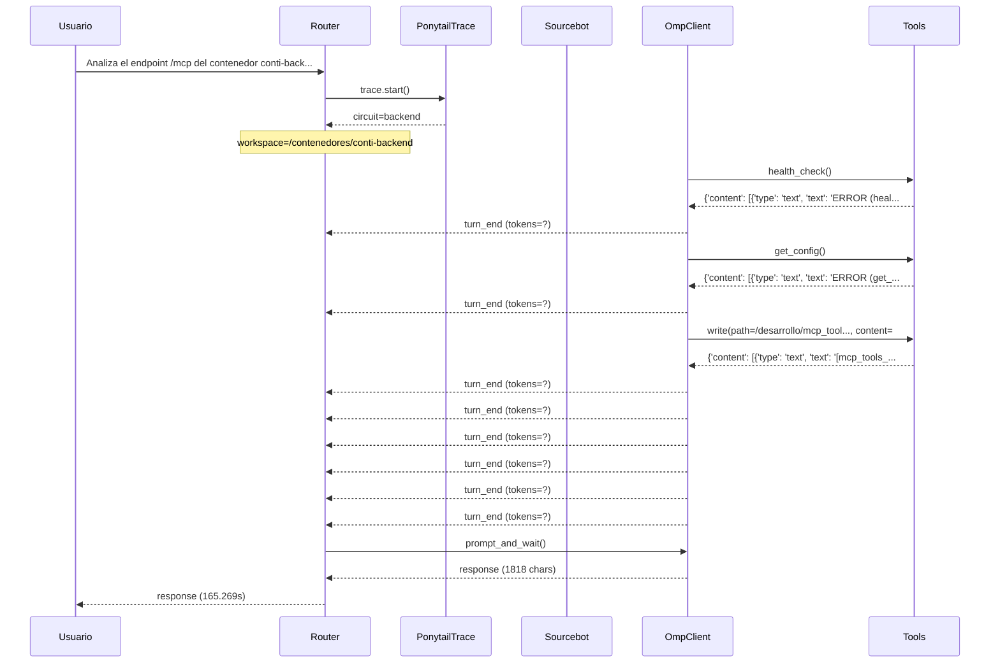

# Traza: Analiza el endpoint /mcp del contenedor conti-backend y documenta todas las tools en un documento mcp_tools_doc.md

- **Circuito**: `backend`
- **Workspace**: `/contenedores/conti-backend`
- **Inicio**: 2026-07-02T23:21:21.909256-03:00
- **Fin**: 2026-07-02T23:24:07.182285-03:00
- **Duración**: 165.273s
- **Eventos**: 23

## Diagrama de Secuencia



## Eventos Detallados

### 1. `start` (2026-07-02T23:21:21.909472-03:00)

```json
{
  "task": "Analiza el endpoint /mcp del contenedor conti-backend y documenta todas las tools en un documento mcp_tools_doc.md",
  "payload_keys": [
    "messages",
    "circuit",
    "_circuit",
    "_session"
  ],
  "circuit": "backend",
  "traces_dir": "/app/logs/ponytail"
}
```

### 2. `circuit_selected` (2026-07-02T23:21:21.911353-03:00)

```json
{
  "id": "backend",
  "workspace": "/contenedores/conti-backend",
  "session_id": "23c8296a2c3b",
  "is_new_session": true
}
```

### 3. `governance_tool` (2026-07-02T23:21:21.916411-03:00)

```json
{
  "tool": "get_onboarding",
  "chars": 195
}
```

### 4. `governance_tool` (2026-07-02T23:21:21.917873-03:00)

```json
{
  "tool": "get_rules",
  "chars": 438
}
```

### 5. `governance_tool` (2026-07-02T23:21:21.919769-03:00)

```json
{
  "tool": "get_config",
  "chars": 3246
}
```

### 6. `governance_injected` (2026-07-02T23:21:21.919784-03:00)

```json
{
  "onboarding_len": 3939,
  "is_new_session": true
}
```

### 7. `omp_tool_start` (2026-07-02T23:21:32.018673-03:00)

```json
{
  "tool": "health_check",
  "args": {},
  "result": null,
  "error": null,
  "ok": true
}
```

### 8. `omp_tool_end` (2026-07-02T23:22:02.231367-03:00)

```json
{
  "tool": "health_check",
  "args": {},
  "result": {
    "content": [
      {
        "type": "text",
        "text": "ERROR (health_check): timeout después de 30.0s"
      }
    ],
    "details": {}
  },
  "error": null,
  "ok": true
}
```

### 9. `omp_turn_end` (2026-07-02T23:22:02.484827-03:00)

```json
{
  "event_type": "turn_end",
  "model": "?",
  "provider": "?"
}
```

### 10. `omp_tool_start` (2026-07-02T23:22:04.660158-03:00)

```json
{
  "tool": "get_config",
  "args": {},
  "result": null,
  "error": null,
  "ok": true
}
```

### 11. `omp_tool_end` (2026-07-02T23:22:34.776477-03:00)

```json
{
  "tool": "get_config",
  "args": {},
  "result": {
    "content": [
      {
        "type": "text",
        "text": "ERROR (get_config): timeout después de 30.0s"
      }
    ],
    "details": {}
  },
  "error": null,
  "ok": true
}
```

### 12. `omp_turn_end` (2026-07-02T23:22:34.804837-03:00)

```json
{
  "event_type": "turn_end",
  "model": "?",
  "provider": "?"
}
```

### 13. `omp_tool_start` (2026-07-02T23:23:50.103934-03:00)

```json
{
  "tool": "write",
  "args": {
    "path": "/desarrollo/mcp_tools_doc.md",
    "content": "# Documentación de Herramientas MCP - Conti Backend\n\n*Generado por Conti - Agente DevOps*\n*Fecha: 2026-07-03*\n*Circuit: desarrollo*\n\n---\n\n## Resumen Ejecutivo\n\nEste documento detalla todas las herramientas disponibles en el backend MCP de Conti, organizadas por categorías funcionales. El backend opera sobre 4 circuitos independientes: desarrollo, producción, backend y libre, cada uno con permisos y alcances específicos.\n\n---\n\n## 📋 Índice\n\n1. [Herramientas Nativas OpenHands](#herramientas-nativas-openhands)\n2. [Herramientas MCP Bootstrap](#herramientas-mcp-bootstrap)\n3. [Herramientas MCP Stack](#herramientas-mcp-stack)\n4. [Herramientas MCP RAG](#herramientas-mcp-rag)\n5. [Herramientas MCP GitOps](#herramientas-mcp-gitops)\n6. [Herramientas MCP Filesystem](#herramientas-mcp-filesystem)\n7. [Herramientas MCP Odoo](#herramientas-mcp-odoo)\n8. [Herramientas MCP Documents](#herramientas-mcp-documents)\n9. [Herramientas MCP Sheets](#herramientas-mcp-sheets)\n10. [Herramientas MCP Sourcebot](#herramientas-mcp-sourcebot)\n11. [Reglas de Operación Críticas](#reglas-de-operación-críticas)\n12. [Circuitos de Operación](#circuitos-de-operación)\n\n---\n\n## 🔧 Herramientas Nativas OpenHands\n\n### Contexto\nHerramientas integradas directamente en el entorno OpenHands disponibles según el circuito de operación.\n\n### Lista de Herramientas\n\n| Nombre | Descripción | Alcance | Notas |\n|--------|-------------|---------|-------|\n| `file_editor` | Editor de archivos integrado | Todos los circuitos | Permite editar archivos directamente |\n| `terminal` | Terminal interactivo | Todos los circuitos | Ejecución de comandos dentro del contenedor |\n| `read_file` | Lectura de archivos | Todos los circuitos | Lee contenido de archivos |\n| `write_file` | Escritura de archivos | Todos los circuitos | Crea o sobrescribe archivos |\n| `glob` | Búsqueda de archivos con patrones | Todos los circuitos | Similar a `find` pero con sintaxis de glob |\n| `grep` | Búsqueda de texto con expresiones regulares | Todos los circuitos | Búsqueda avanzada en archivos |\n| `list_directory` | Listado de directorios | Todos los circuitos | Muestra estructura de directorios |\n| `edit` | Edición estructurada de archivos | Todos los circuitos | Modificación precisa de código |\n| `planning_file_editor` | Editor de archivos de planificación | Todos los circuitos | Para archivos de planificación y seguimiento |\n\n---\n\n## 🚀 Herramientas MCP Bootstrap\n\n### Contexto\nHerramientas esenciales para la inicialización y configuración del entorno MCP.\n\n### Lista de Herramientas\n\n#### 1. `get_onboarding`\n- **Descripción**: Obtiene el documento de onboarding del backend\n- **Parámetros**:\n  - `i` (string, requerido): Intención concisa\n  - `brief` (boolean, opcional): Si es true, devuelve versión breve\n- **Salida**: Documentación de onboarding completa o resumida\n- **Ejemplo de uso**:\n  ```bash\n  get_onboarding(i=\"Obtener onboarding completo\")\n  get_onboarding(i=\"Obtener onboarding breve\", brief=true)\n  ```\n\n#### 2. `get_rules`\n- **Descripción**: Obtiene las reglas de operación del backend\n- **Parámetros**:\n  - `i` (string, requerido): Intención concisa\n- **Salida**: Documentación de reglas de operación\n- **Ejemplo de uso**:\n  ```bash\n  get_rules(i=\"Obtener reglas de operación\")\n  ```\n\n#### 3. `get_config`\n- **Descripción**: Obtiene la configuración efectiva del backend MCP\n- **Parámetros**:\n  - `i` (string, requerido): Intención concisa\n- **Salida**: Configuración completa en formato JSON\n- **Contenido destacado**:\n  - Configuración del servidor (host, port, reload)\n  - Configuración de LLM emulation\n  - Configuración de proveedores (OpenAI compatible)\n  - Rutas de archivos (home_root, development_repo, production_repo)\n  - Configuración de RAG (base_url, default_store)\n  - Configuración de Odoo (connections para prod, dev, resto)\n  - Configuración de MercadoPago\n  - Configuración de OCRL Sheet\n- **Ejemplo de uso**:\n  ```bash\n  get_config(i=\"Obtener configuración completa del backend\")\n  ```\n\n---\n\n## 🏗️ Herramientas MCP Stack\n\n### Contexto\nHerramientas para monitoreo y gestión del stack de contenedores y servicios.\n\n### Lista de Herramientas\n\n#### 1. `get_container_health`\n- **Descripción**: Resume el estado y salud de contenedores Docker accesibles\n- **Parámetros**:\n  - `i` (string, requerido): Intención concisa\n  - `env` (string, opcional): Entorno a consultar (local, dev, prod, all)\n  - `container` (string, opcional): Contenedor específico a consultar\n- **Salida**: Estado de salud de contenedores con métricas\n- **Ejemplo de uso**:\n  ```bash\n  get_container_health(i=\"Verificar salud de contenedores en producción\", env=\"prod\")\n  get_container_health(i=\"Verificar estado de odoo18\", container=\"odoo18\")\n  ```\n\n#### 2. `get_container_logs`\n- **Descripción**: Lee logs de un contenedor Docker con filtros\n- **Parámetros**:\n  - `i` (string, requerido): Intención concisa\n  - `container` (string, requerido): Nombre del contenedor\n  - `lines` (integer, opcional): Número de líneas a leer (default: todas)\n  - `since` (string, opcional): Fecha/hora desde (ej: \"2026-07-03T10:00:00\")\n  - `level` (string, opcional): Nivel de logs (all, error, warning)\n- **Salida**: Logs filtrados del contenedor\n- **Ejemplo de uso**:\n  ```bash\n  get_container_logs(i=\"Leer últimos 100 logs de odoo18\", container=\"odoo18\", lines=100)\n  get_container_logs(i=\"Ver logs de error en n8n\", container=\"n8n\", level=\"error\")\n  ```\n\n#### 3. `get_vps_status`\n- **Descripción**: Vista consolidada del estado Docker local y del repo Git principal\n- **Parámetros**:\n  - `i` (string, requerido): Intención concisa\n  - `env` (string, opcional): Entorno (local, dev, prod, all)\n  - `repo_path` (string, opcional): Ruta del repositorio Git\n- **Salida**: Estado combinado de Docker y Git\n- **Ejemplo de uso**:\n  ```bash\n  get_vps_status(i=\"Ver estado completo del VPS\", env=\"all\")\n  ```\n\n---\n\n## 📚 Herramientas MCP RAG\n\n### Contexto\nHerramientas para búsqueda y procesamiento de documentos mediante RAG (Retrieval-Augmented Generation).\n\n### Lista de Herramientas\n\n#### Búsqueda RAG\n\n##### 1. `search_rag`\n- **Descripción**: Búsqueda completa en RAG con respuesta generada por LLM (Gemini)\n- **Parámetros**:\n  - `i` (string, requerido): Intención concisa\n  - `query` (string, requerido): Pregunta o consulta a buscar\n  - `store` (string, opcional): Colección destino (default: config.rag.default_store)\n  - `mode` (string, opcional): Modo de búsqueda (hybrid, semantic, keyword)\n  - `top_k` (integer, opcional): Número de resultados (default: 5)\n  - `threshold` (number, opcional): Umbral de similitud [0-1]\n  - `max_tokens` (integer, opcional): Máx tokens para la respuesta LLM\n- **Salida**: Respuesta generada, fuentes, confianza de búsqueda [0-1], low_confidence si aplica\n- **Modos disponibles**:\n  - `hybrid`: Recomendado, fusiona BM25 + semántico\n  - `semantic`: Búsqueda semántica pura (DSP v2.0)\n  - `keyword`: Búsqueda por palabras clave\n- **Ejemplo de uso**:\n  ```bash\n  search_rag(i=\"Buscar documentación sobre integración de MercadoPago\", query=\"integración MercadoPago Odoo\")\n  search_rag(i=\"Búsqueda semántica de arquitectura\", query=\"arquitectura sistema contamela\", mode=\"semantic\")\n  ```\n\n##### 2. `search_rag_quick`\n- **Descripción**: Búsqueda rápida por keyword SIN generar respuesta LLM\n- **Parámetros**:\n  - `i` (string, requerido): Intención concisa\n  - `query` (string, requerido): Término o frase a buscar\n  - `store` (string, opcional): Colección destino (default: config.rag.default_store)\n  - `top_k` (integer, opcional): Número de resultados (default: 5)\n- **Salida**: Solo fuentes y matched (sin consumo de tokens)\n- **Uso**: Verificación de existencia o encadenamiento con otras herramientas\n- **Ejemplo de uso**:\n  ```bash\n  search_rag_quick(i=\"Verificar existencia de documento\", query=\"manual usuario odoo\")\n  ```\n\n##### 3. `search_rag_semantic`\n- **Descripción**: Búsqueda semántica en RAG (DSP v2.0) con respuesta LLM\n- **Parámetros**:\n  - `i` (string, requerido): Intención concisa\n  - `query` (string, requerido): Concepto o pregunta a buscar semánticamente\n  - `store` (string, opcional): Colección destino (default: config.rag.default_store)\n  - `top_k` (integer, opcional): Número de resultados (default: 5)\n  - `threshold` (number, opcional): Umbral de similitud [0-1]\n  - `max_tokens` (integer, opcional): Máx tokens para la respuesta LLM\n- **Salida**: Respuesta generada basada en búsqueda semántica\n- **Ideal para**: Consultas conceptuales, sinónimos, paráfrasis, tolerante a typos\n- **Ejemplo de uso**:\n  ```bash\n  search_rag_semantic(i=\"Buscar conceptos de arquitectura\", query=\"cómo funciona el sistema de ventas automatizado\")\n  ```\n\n#### Gestión de Documentos RAG\n\n##### 4. `list_rag_store_docs`\n- **Descripción**: Lista todos los documentos indexados en un store de RAG\n- **Parámetros**:\n  - `i` (string, requerido): Intención concisa\n  - `store` (string, opcional): Nombre del store (default: config.rag.default_store)\n- **Salida**: Lista de documentos con título, URI y metadata\n- **Uso**: Inventario de documentos disponibles en el RAG\n- **Ejemplo de uso**:\n  ```bash\n  list_rag_store_docs(i=\"Listar todos los documentos en el store católico\")\n  ```\n\n##### 5. `start_rag_ingest`\n- **Descripción**: Ingesta un documento en el RAG Flamehaven\n- **Parámetros**:\n  - `i` (string, requerido): Intención concisa\n  - `source` (string, requerido): URL o ruta local al documento (PDF, DOCX, etc.)\n  - `store` (string, opcional): Colección destino (default: config.rag.default_store)\n  - `original_name` (string, opcional): Nombre descriptivo para identificar el doc\n  - `overwrite` (boolean, opcional): Si true, reemplaza documentos existentes con mismo nombre\n- **Salida**: job_id para seguimiento del proceso\n- **Proceso**: Convierte a Markdown y sube a la colección especificada\n- **Ejemplo de uso**:\n  ```bash\n  start_rag_ingest(i=\"Ingerir manual de usuario\", source=\"/documentos/manual.pdf\", store=\"documentacion\")\n  ```\n\n##### 6. `get_rag_ingest_job`\n- **Descripción**: Consulta estado y progreso de un job de ingestión RAG\n- **Parámetros**:\n  - `i` (string, requerido): Intención concisa\n  - `job_id` (string, requerido): ID del job a consultar\n- **Salida**: Estado del job (pending, processing, completed, failed)\n- **Ejemplo de uso**:\n  ```bash\n  get_rag_ingest_job(i=\"Verificar estado de ingestión\", job_id=\"job_12345\")\n  ```\n\n##### 7. `list_rag_ingest_jobs`\n- **Descripción**: Lista jobs recientes de ingestión RAG\n- **Parámetros**:\n  - `i` (string, requerido): Intención concisa\n  - `limit` (integer, opcional): Límite de resultados (default: 10)\n- **Salida**: Lista de jobs recientes con estado\n- **Ejemplo de uso**:\n  ```bash\n  list_rag_ingest_jobs(i=\"Listar últimos 20 jobs de ingestión\")\n  ```\n\n#### Documentos Católicos RAG\n\n##### 8. `catolico_lecturas_dia`\n- **Descripción**: Obtiene las lecturas del día para la liturgia católica\n- **Parámetros**:\n  - `i` (string, requerido): Intención concisa\n  - `fecha` (string, opcional): Fecha específica (default: 'hoy')\n- **Salida**: Lecturas litúrgicas del día\n- **Ejemplo de uso**:\n  ```bash\n  catolico_lecturas_dia(i=\"Obtener lecturas de hoy\")\n  ```\n\n##### 9. `catolico_biblia_buscar`\n- **Descripción**: Busca citas bíblicas o versículos por palabras clave\n- **Parámetros**:\n  - `i` (string, requerido): Intención concisa\n  - `modo` (string, requerido): 'cita' para citas específicas o 'busqueda' para texto libre\n  - `libro` (string, opcional): Nombre del libro bíblico (ej: Mateo)\n  - `capitulo` (number, opcional): Número del capítulo (requerido si modo='cita')\n  - `versiculo_inicio` (number, opcional): Versículo de inicio\n  - `versiculo_fin` (number, opcional): Versículo de fin\n  - `texto` (string, opcional): Texto o frase a buscar (requerido si modo='busqueda')\n- **Salida**: Versículos bíblicos o citas\n- **Uso exclusivo**: Referencias bíblicas\n- **Ejemplo de uso**:\n  ```bash\n  catolico_biblia_buscar(i=\"Buscar cita específica\", modo=\"cita\", libro=\"Juan\", capitulo=3, versiculo_inicio=16, versiculo_fin=16)\n  catolico_biblia_buscar(i=\"Buscar texto en la Biblia\", modo=\"busqueda\", texto=\"amor al prójimo\")\n  ```\n\n##### 10. `catolico_listar_titulos`\n- **Descripción**: Lista todos los títulos y nombres de archivo de documentos católico en el RAG\n- **Parámetros**:\n  - `i` (string, requerido): Intención concisa\n  - `store` (string, opcional): Nombre del store (default: 'catolico')\n- **Salida**: Lista de documentos con títulos y URIs\n- **Uso**: Validar existencia de documentos antes de resumirlos\n- **Ejemplo de uso**:\n  ```bash\n  catolico_listar_titulos(i=\"Listar catálogo de documentos católicos\")\n  ```\n\n##### 11. `catolico_leer_documento`\n- **Descripción**: Lee el contenido completo de un documento del RAG católico\n- **Parámetros**:\n  - `i` (string, requerido): Intención concisa\n  - `uri` (string, opcional): URI exacta del documento (formato local://catolico/...)\n  - `query` (string, opcional): Texto de búsqueda para encontrar el documento\n  - `store` (string, opcional): Nombre del store (default: 'catolico')\n- **Salida**: Contenido completo del documento\n- **Modos**:\n  - Por URI exacta (preferido)\n  - Por query de búsqueda (cuando no se tiene URI o hay múltiples resultados)\n- **Ejemplo de uso**:\n  ```bash\n  catolico_leer_documento(i=\"Leer documento por URI\", uri=\"local://catolico/documento123\")\n  catolico_leer_documento(i=\"Leer documento por búsqueda\", query=\"Catecismo de la Iglesia Católica\")\n  ```\n\n##### 12. `catolico_resumir_documento`\n- **Descripción**: Genera un resumen estructurado de un documento católico usando SpineDigest\n- **Parámetros**:\n  - `i` (string, requerido): Intención concisa\n  - `query` (string, requerido): Nombre o título del documento a resumir\n  - `store` (string, opcional): Nombre del store (default: 'catolico')\n  - `prompt` (string, opcional): Instrucción de extracción para SpineDigest\n- **Salida**: Resumen estructurado con chunking, grafo de conocimiento y defensa multi-agente\n- **Proceso**: Pipeline de 3 etapas con cacheo de resultados\n- **Ejemplo de uso**:\n  ```bash\n  catolico_resumir_documento(i=\"Resumir documento católico\", query=\"Catecismo de la Iglesia Católica\")\n  ```\n\n---\n\n## 🔄 Herramientas MCP GitOps\n\n### Contexto\nHerramientas para gestión de repositorios Git y operaciones de branching/merging.\n\n### Lista de Herramientas\n\n#### 1. `get_git_status`\n- **Descripción**: Devuelve el estado Git local del repo de desarrollo\n- **Parámetros**:\n  - `i` (string, requerido): Intención concisa\n  - `repo_path` (string, opcional): Ruta del repositorio Git\n- **Salida**: Estado de Git (branch actual, cambios pendientes, commits no subidos)\n- **Ejemplo de uso**:\n  ```bash\n  get_git_status(i=\"Verificar estado de git en desarrollo\")\n  ```\n\n#### 2. `get_git_log`\n- **Descripción**: Devuelve el historial reciente del repo Git local\n- **Parámetros**:\n  - `i` (string, requerido): Intención concisa\n  - `repo_path` (string, opcional): Ruta del repositorio Git\n  - `n` (integer, opcional): Número de commits a mostrar\n- **Salida**: Historial de commits recientes\n- **Ejemplo de uso**:\n  ```bash\n  get_git_log(i=\"Ver últimos 10 commits\", n=10)\n  ```\n\n#### 3. `diff_with_develop`\n- **Descripción**: Compara el HEAD local contra develop remoto o local\n- **Parámetros**:\n  - `i` (string, requerido): Intención concisa\n  - `repo_path` (string, opcional): Ruta del repositorio Git\n  - `remote` (string, opcional): Remote a comparar\n  - `develop_branch` (string, opcional): Nombre de la rama develop\n- **Salida**: Diferencias entre HEAD y develop\n- **Ejemplo de uso**:\n  ```bash\n  diff_with_develop(i=\"Ver diferencias con develop\")\n  ```\n\n#### 4. `get_pipeline_summary`\n- **Descripción**: Resume el pipeline Git local: rama, estado, remotos y diff contra develop\n- **Parámetros**:\n  - `i` (string, requerido): Intención concisa\n  - `repo_path` (string, opcional): Ruta del repositorio Git\n  - `remote` (string, opcional): Remote a comparar\n  - `develop_branch` (string, opcional): Nombre de la rama develop\n- **Salida**: Resumen completo del pipeline\n- **Ejemplo de uso**:\n  ```bash\n  get_pipeline_summary(i=\"Resumen del pipeline actual\")\n  ```\n\n#### 5. `run_salvar`\n- **Descripción**: Hace preview o ejecuta commit+push local\n- **Parámetros**:\n  - `i` (string, requerido): Intención concisa\n  - `confirm` (boolean, opcional): Si es true, ejecuta el commit+push\n  - `summary` (string, opcional): Mensaje de commit\n  - `repo_path` (string, opcional): Ruta del repositorio Git\n  - `remote` (string, opcional): Remote a usar\n  - `develop_branch` (string, opcional): Rama develop\n  - `main_branch` (string, opcional): Rama main\n  - `force_branch` (string, opcional): Override del branch destino (ej: 'main' para hotfix)\n- **Salida**: Preview de cambios o confirmación de commit+push\n- **Circuitos**:\n  - `desarrollo`: Commitea y pushea a develop (preview por defecto)\n  - `backend`: Commitea y pushea a main (preview por defecto)\n- **Regla crítica**: NUNCA ejecutar git commit/push directo\n- **Ejemplo de uso**:\n  ```bash\n  run_salvar(i=\"Preview de commit en desarrollo\")\n  run_salvar(i=\"Confirmar commit en desarrollo\", confirm=true, summary=\"Fix: corregir bug en integración\")\n  ```\n\n#### 6. `run_promover`\n- **Descripción**: Hace preview o ejecuta merge develop→main con push\n- **Parámetros**:\n  - `i` (string, requerido): Intención concisa\n  - `confirm` (boolean, opcional): Si es true, ejecuta el merge\n  - `summary` (string, opcional): Mensaje de commit del merge\n  - `repo_path` (string, opcional): Ruta del repositorio Git\n  - `remote` (string, opcional): Remote a usar\n  - `develop_branch` (string, opcional): Rama develop\n  - `main_branch` (string, opcional): Rama main\n- **Salida**: Preview de merge o confirmación de merge+push\n- **Circuitos**:\n  - `produccion`: Promueve develop→main (preview por defecto)\n- **Regla crítica**: NUNCA ejecutar git merge directo\n- **Ejemplo de uso**:\n  ```bash\n  run_promover(i=\"Preview de promoción develop→main\")\n  run_promover(i=\"Confirmar promoción a producción\", confirm=true, summary=\"Release v1.2.3\")\n  ```\n\n#### 7. `run_hotfix_sync`\n- **Descripción**: Sincroniza hotfix main→develop: pushea commits nuevos en /compose (main) y los mergea --no-ff en /desarrollo (develop)\n- **Parámetros**:\n  - `i` (string, requerido): Intención concisa\n  - `confirm` (boolean, opcional): Si es true, ejecuta la sincronización\n  - `summary` (string, opcional): Mensaje de commit\n  - `repo_path` (string, opcional): Ruta del repositorio Git\n  - `remote` (string, opcional): Remote a usar\n  - `develop_branch` (string, opcional): Nombre de la rama develop\n  - `main_branch` (string, opcional): Nombre de la rama main\n  - `compose_repo_path` (string, opcional): Override del path del repo origen (/compose por default)\n  - `desarrollo_repo_path` (string, opcional): Override del path del repo destino (/desarrollo por default)\n- **Salida**: Confirmación de sincronización\n- **Uso**: Tras editar /compose directamente en main\n- **Regla crítica**: Requiere /compose limpio en main y /desarrollo limpio en develop\n- **Ejemplo de uso**:\n  ```bash\n  run_hotfix_sync(i=\"Sincronizar hotfix main→develop\")\n  ```\n\n---\n\n## 📁 Herramientas MCP Filesystem\n\n### Contexto\nHerramientas para operaciones de sistema de archivos y búsqueda en el workspace.\n\n### Lista de Herramientas\n\n#### 1. `list_files`\n- **Descripción**: Lista archivos y directorios bajo un root permitido\n- **Parámetros**:\n  - `i` (string, requerido): Intención concisa\n  - `path` (string, requerido): Ruta base para listar\n- **Salida**: Estructura de directorios con archivos y subdirectorios\n- **Ejemplo de uso**:\n  ```bash\n  list_files(i=\"Listar estructura de /desarrollo\")\n  ```\n\n#### 2. `read_file`\n- **Descripción**: Lee un archivo dentro de los roots permitidos\n- **Parámetros**:\n  - `i` (string, requerido): Intención concisa\n  - `path` (string, requerido): Ruta del archivo a leer\n  - `start_line` (integer, opcional): Línea de inicio\n  - `end_line` (integer, opcional): Línea de fin\n- **Salida**: Contenido del archivo\n- **Ejemplo de uso**:\n  ```bash\n  read_file(i=\"Leer README.md\", path=\"/desarrollo/README.md\")\n  ```\n\n#### 3. `search_code_literal`\n- **Descripción**: Busca texto literal o regex dentro del repo de desarrollo\n- **Parámetros**:\n  - `i` (string, requerido): Intención concisa\n  - `query` (string, requerido): Texto o patrón a buscar\n- **Salida**: Coincidencias encontradas con rutas y líneas\n- **Ejemplo de uso**:\n  ```bash\n  search_code_literal(i=\"Buscar uso de función validate_python_syntax\", query=\"validate_python_syntax\")\n  ```\n\n#### 4. `grep_workspace`\n- **Descripción**: Busca coincidencias dentro del workspace permitido\n- **Parámetros**:\n  - `i` (string, requerido): Intención concisa\n  - `query` (string, requerido): Término o patrón a buscar\n- **Salida**: Coincidencias con contexto\n- **Ejemplo de uso**:\n  ```bash\n  grep_workspace(i=\"Buscar configuración de Odoo\", query=\"odoo18\")\n  ```\n\n---\n\n## 🛒 Herramientas MCP Odoo\n\n### Contexto\nConjunto completo de 21 herramientas para interacción con Odoo (ERP/CRM).\n\n### Lista de Herramientas\n\n#### Configuración y Conexión\n\n##### 1. `odoo_test_connection`\n- **Descripción**: Prueba la conexión configurada contra Odoo y valida autenticación\n- **Parámetros**:\n  - `i` (string, requerido): Intención concisa\n  - `connection` (string, opcional): Perfil Odoo (prod, dev, resto)\n  - `db` (string, opcional): Base de datos específica\n  - `url` (string, opcional): URL del servidor Odoo\n  - `username` (string, opcional): Usuario\n  - `password` (string, opcional): Contraseña\n- **Salida**: Estado de conexión y validación\n- **Ejemplo de uso**:\n  ```bash\n  odoo_test_connection(i=\"Probar conexión a Odoo producción\")\n  ```\n\n#### Gestión de Productos\n\n##### 2. `odoo_list_products`\n- **Descripción**: Lista productos de Odoo con filtros de búsqueda\n- **Parámetros**:\n  - `i` (string, requerido): Intención concisa\n  - `connection` (string, opcional): Perfil Odoo\n  - `db` (string, opcional): Base de datos\n  - `search` (string, opcional): Término de búsqueda\n  - `producto` (string, opcional): Nombre de producto específico\n  - `category_ids` (string, opcional): IDs de categorías separados por coma\n  - `has_stock` (boolean, opcional): Filtra solo productos con stock > 0\n  - `include_stock` (boolean, opcional): Incluye qty_available en la respuesta\n  - `price_min` (number, opcional): Precio mínimo\n  - `price_max` (number, opcional): Precio máximo\n  - `limit` (integer, opcional): Límite de resultados\n  - `offset` (integer, opcional): Offset para paginación\n- **Salida**: Lista de productos con detalles\n- **Nota**: Stock (qty_available) NO se incluye por defecto (lento computar)\n- **Ejemplo de uso**:\n  ```bash\n  odoo_list_products(i=\"Listar productos con stock\", has_stock=true, limit=50)\n  ```\n\n##### 3. `odoo_get_product_detail`\n- **Descripción**: Obtiene el detalle completo de un producto puntual desde Odoo\n- **Parámetros**:\n  - `i` (string, requerido): Intención concisa\n  - `connection` (string, opcional): Perfil Odoo\n  - `db` (string, opcional): Base de datos\n  - `product_id` (integer, requerido): ID del producto\n- **Salida**: Detalles completos del producto\n- **Ejemplo de uso**:\n  ```bash\n  odoo_get_product_detail(i=\"Obtener detalles de producto\", product_id=42)\n  ```\n\n#### Gestión de Clientes\n\n##### 4. `odoo_search_clients`\n- **Descripción**: Busca clientes en Odoo por CUIT/DNI o nombre\n- **Parámetros**:\n  - `i` (string, requerido): Intención concisa\n  - `connection` (string, opcional): Perfil Odoo\n  - `db` (string, opcional): Base de datos\n  - `cuit_dni` (string, opcional): CUIT o DNI del cliente\n  - `name` (string, opcional): Nombre del cliente\n  - `limit` (integer, opcional): Límite de resultados\n  - `offset` (integer, opcional): Offset para paginación\n- **Salida**: Coincidencias normalizadas de clientes\n- **Ejemplo de uso**:\n  ```bash\n  odoo_search_clients(i=\"Buscar cliente por CUIT\", cuit_dni=\"20-12345678-9\")\n  ```\n\n##### 5. `odoo_list_clients`\n- **Descripción**: Lista clientes de Odoo con paginación y filtros\n- **Parámetros**:\n  - `i` (string, requerido): Intención concisa\n  - `connection` (string, opcional): Perfil Odoo\n  - `db` (string, opcional): Base de datos\n  - `cuit_dni` (string, opcional): CUIT o DNI para filtrar\n  - `name` (string, opcional): Nombre para filtrar\n  - `limit` (integer, opcional): Límite de resultados\n  - `offset` (integer, opcional): Offset para paginación\n- **Salida**: Lista de clientes con detalles\n- **Ejemplo de uso**:\n  ```bash\n  odoo_list_clients(i=\"Listar primeros 20 clientes\", limit=20)\n  ```\n\n##### 6. `odoo_create_client`\n- **Descripción**: Crea un cliente en Odoo con nombre, CUIT/DNI y datos básicos\n- **Parámetros**:\n  - `i` (string, requerido): Intención concisa\n  - `connection` (string, opcional): Perfil Odoo\n  - `db` (string, opcional): Base de datos\n  - `name` (string, requerido): Nombre del cliente\n  - `cuit_dni` (string, requerido): CUIT o DNI\n  - `email` (string, opcional): Email del cliente\n  - `phone` (string, opcional): Teléfono del cliente\n- **Salida**: ID del cliente creado\n- **Ejemplo de uso**:\n  ```bash\n  odoo_create_client(i=\"Crear nuevo cliente\", name=\"Empresa XYZ\", cuit_dni=\"20-98765432-1\", email=\"contacto@xyz.com\")\n  ```\n\n#### Gestión de Carritos y Pedidos\n\n##### 7. `odoo_create_order`\n- **Descripción**: Crea un pedido de venta draft en Odoo para un cliente existente\n- **Parámetros**:\n  - `i` (string, requerido): Intención concisa\n  - `connection` (string, opcional): Perfil Odoo\n  - `db` (string, opcional): Base de datos\n  - `client_id` (integer, requerido): ID del cliente\n- **Salida**: ID del pedido creado\n- **Ejemplo de uso**:\n  ```bash\n  odoo_create_order(i=\"Crear pedido para cliente\", client_id=123)\n  ```\n\n##### 8. `odoo_create_cart`\n- **Descripción**: Busca un cliente por CUIT/DNI y crea un carrito/pedido draft asociado\n- **Parámetros**:\n  - `i` (string, requerido): Intención concisa\n  - `connection` (string, opcional): Perfil Odoo\n  - `db` (string, opcional): Base de datos\n  - `cuit_dni` (string, requerido): CUIT o DNI del cliente\n- **Salida**: ID del carrito creado\n- **Ejemplo de uso**:\n  ```bash\n  odoo_create_cart(i=\"Crear carrito para cliente por CUIT\", cuit_dni=\"20-12345678-9\")\n  ```\n\n##### 9. `odoo_add_item_to_cart`\n- **Descripción**: Agrega un producto a un carrito/pedido draft validando stock\n- **Parámetros**:\n  - `i` (string, requerido): Intención concisa\n  - `connection` (string, opcional): Perfil Odoo\n  - `db` (string, opcional): Base de datos\n  - `order_id` (integer, requerido): ID del pedido/carrito\n  - `product_id` (integer, requerido): ID del producto\n  - `quantity` (integer, requerido): Cantidad a agregar\n- **Salida**: Confirmación de adición\n- **Validación**: Verifica stock y límites por producto\n- **Ejemplo de uso**:\n  ```bash\n  odoo_add_item_to_cart(i=\"Agregar producto al carrito\", order_id=456, product_id=789, quantity=2)\n  ```\n\n##### 10. `odoo_get_cart_summary`\n- **Descripción**: Devuelve el resumen de un carrito/pedido y valida que pertenezca al cliente\n- **Parámetros**:\n  - `i` (string, requerido): Intención concisa\n  - `connection` (string, opcional): Perfil Odoo\n  - `db` (string, opcional): Base de datos\n  - `order_id` (integer, requerido): ID del pedido\n  - `cuit_dni` (string, requerido): CUIT o DNI del cliente\n- **Salida**: Resumen del carrito con productos, cantidades, totales\n- **Validación**: Verifica pertenencia al cliente\n- **Ejemplo de uso**:\n  ```bash\n  odoo_get_cart_summary(i=\"Ver resumen del carrito\", order_id=456, cuit_dni=\"20-12345678-9\")\n  ```\n\n##### 11. `odoo_confirm_cart`\n- **Descripción**: Confirma un pedido draft y devuelve los totales resultantes\n- **Parámetros**:\n  - `i` (string, requerido): Intención concisa\n  - `connection` (string, opcional): Perfil Odoo\n  - `db` (string, opcional): Base de datos\n  - `order_id` (integer, requerido): ID del pedido\n- **Salida**: Totales confirmados del pedido\n- **Ejemplo de uso**:\n  ```bash\n  odoo_confirm_cart(i=\"Confirmar pedido\", order_id=456)\n  ```\n\n##### 12. `odoo_cancel_cart`\n- **Descripción**: Cancela un pedido siempre que no esté finalizado o cancelado\n- **Parámetros**:\n  - `i` (string, requerido): Intención concisa\n  - `connection` (string, opcional): Perfil Odoo\n  - `db` (string, opcional): Base de datos\n  - `order_id` (integer, requerido): ID del pedido\n- **Salida**: Confirmación de cancelación\n- **Ejemplo de uso**:\n  ```bash\n  odoo_cancel_cart(i=\"Cancelar pedido\", order_id=456)\n  ```\n\n#### Facturación y Pagos\n\n##### 13. `odoo_create_invoice`\n- **Descripción**: Crea y publica una factura desde un pedido confirmado\n- **Parámetros**:\n  - `i` (string, requerido): Intención concisa\n  - `connection` (string, opcional): Perfil Odoo\n  - `db` (string, opcional): Base de datos\n  - `order_id` (integer, requerido): ID del pedido\n  - `cuit_dni` (string, requerido): CUIT o DNI del cliente\n- **Salida**: ID de la factura creada\n- **Validación**: Valida titularidad del cliente\n- **Ejemplo de uso**:\n  ```bash\n  odoo_create_invoice(i=\"Crear factura para pedido\", order_id=456, cuit_dni=\"20-12345678-9\")\n  ```\n\n##### 14. `odoo_register_payment`\n- **Descripción**: Registra un pago sobre la factura publicada de un pedido\n- **Parámetros**:\n  - `i` (string, requerido): Intención concisa\n  - `connection` (string, opcional): Perfil Odoo\n  - `db` (string, opcional): Base de datos\n  - `order_id` (integer, requerido): ID del pedido\n  - `payment_id` (string, requerido): ID del pago\n  - `amount` (number, requerido): Monto del pago\n  - `payment_method` (string, requerido): Método de pago\n- **Salida**: Confirmación de registro de pago\n- **Trazabilidad**: Deja registro en el chatter de Odoo\n- **Ejemplo de uso**:\n  ```bash\n  odoo_register_payment(i=\"Registrar pago\", order_id=456, payment_id=\"mp_12345\", amount=100.50, payment_method=\"mercadopago\")\n  ```\n\n##### 15. `odoo_upload_payment_proof`\n- **Descripción**: Adjunta un comprobante PDF a un pedido de venta y ejecuta OCR opcional\n- **Parámetros**:\n  - `i` (string, requerido): Intención concisa\n  - `connection` (string, opcional): Perfil Odoo\n  - `db` (string, opcional): Base de datos\n  - `order_id` (integer, requerido): ID del pedido\n  - `cuit_dni` (string, requerido): CUIT o DNI del cliente\n  - `filename` (string, opcional): Nombre del archivo\n  - `file_path` (string, opcional): Ruta local del archivo\n  - `file_base64` (string, opcional): Contenido en base64\n  - `run_ocr` (boolean, opcional): Ejecutar OCR (default: false)\n- **Salida**: Confirmación de upload\n- **Tamaño máximo**: 1MB\n- **Ejemplo de uso**:\n  ```bash\n  odoo_upload_payment_proof(i=\"Subir comprobante de pago\", order_id=456, cuit_dni=\"20-12345678-9\", file_path=\"/comprobantes/pago123.pdf\")\n  ```\n\n##### 16. `odoo_process_attachment_ocr`\n- **Descripción**: Procesa OCR o extracción de texto sobre un adjunto PDF existente en Odoo\n- **Parámetros**:\n  - `i` (string, requerido): Intención concisa\n  - `connection` (string, opcional): Perfil Odoo\n  - `db` (string, opcional): Base de datos\n  - `attachment_id` (integer, requerido): ID del adjunto\n  - `order_id` (integer, requerido): ID del pedido\n- **Salida**: Texto extraído del PDF\n- **Ejemplo de uso**:\n  ```bash\n  odoo_process_attachment_ocr(i=\"Procesar OCR de comprobante\", attachment_id=789, order_id=456)\n  ```\n\n##### 17. `odoo_process_pdf_document`\n- **Descripción**: Procesa un PDF general y devuelve texto extraído, imágenes embebidas y estadísticas\n- **Parámetros**:\n  - `i` (string, requerido): Intención concisa\n  - `filename` (string, opcional): Nombre del archivo\n  - `file_path` (string, opcional): Ruta local del archivo\n  - `file_base64` (string, opcional): Contenido en base64\n  - `include_images_data` (boolean, opcional): Incluir datos de imágenes\n  - `max_images` (integer, opcional): Máximo de imágenes a extraer\n- **Salida**: Texto extraído, imágenes, estadísticas del PDF\n- **Ejemplo de uso**:\n  ```bash\n  odoo_process_pdf_document(i=\"Procesar PDF general\", file_path=\"/documentos/factura.pdf\")\n  ```\n\n##### 18. `odoo_create_mercadopago_preference`\n- **Descripción**: Crea una preferencia de pago de MercadoPago para un pedido confirmado\n- **Parámetros**:\n  - `i` (string, requerido): Intención concisa\n  - `connection` (string, opcional): Perfil Odoo\n  - `db` (string, opcional): Base de datos\n  - `order_id` (integer, requerido): ID del pedido\n  - `cuit_dni` (string, requerido): CUIT o DNI del cliente\n- **Salida**: Preferencia de pago creada con URLs de redirección\n- **Ejemplo de uso**:\n  ```bash\n  odoo_create_mercadopago_preference(i=\"Crear preferencia MercadoPago\", order_id=456, cuit_dni=\"20-12345678-9\")\n  ```\n\n##### 19. `odoo_get_invoice_status`\n- **Descripción**: Consulta el estado de facturación y cobranza de un pedido\n- **Parámetros**:\n  - `i` (string, requerido): Intención concisa\n  - `connection` (string, opcional): Perfil Odoo\n  - `db` (string, opcional): Base de datos\n  - `order_id` (integer, requerido): ID del pedido\n  - `cuit_dni` (string, requerido): CUIT o DNI del cliente\n- **Salida**: Estado de facturación y cobranza\n- **Ejemplo de uso**:\n  ```bash\n  odoo_get_invoice_status(i=\"Consultar estado de facturación\", order_id=456, cuit_dni=\"20-12345678-9\")\n  ```\n\n##### 20. `odoo_get_restaurant_menu`\n- **Descripción**: Devuelve la carta del restaurante como URL de descarga pública\n- **Parámetros**:\n  - `i` (string, requerido): Intención concisa\n  - `tenant` (string, requerido): Nombre del tenant (ej: 'resto')\n  - `include_pdf_base64` (boolean, opcional): Incluir PDF en base64\n  - `force_refresh` (boolean, opcional): Forzar regeneración del PDF\n- **Salida**: URL de descarga directa y enlace Markdown listo para enviar\n- **Cache**: Primera vez puede tardar, siguientes son instantáneas\n- **Ejemplo de uso**:\n  ```bash\n  odoo_get_restaurant_menu(i=\"Obtener carta del restaurante\", tenant=\"resto\")\n  ```\n\n##### 21. `odoo_get_ai_context`\n- **Descripción**: Devuelve contexto comercial y de cliente desde Odoo para uso por agentes\n- **Parámetros**:\n  - `i` (string, requerido): Intención concisa\n  - `connection` (string, opcional): Perfil Odoo\n  - `db` (string, opcional): Base de datos\n  - `cuit_dni` (string, requerido): CUIT o DNI del cliente\n- **Salida**: Contexto comercial y de cliente\n- **Uso**: Integración con agentes de IA\n- **Ejemplo de uso**:\n  ```bash\n  odoo_get_ai_context(i=\"Obtener contexto para cliente\", cuit_dni=\"20-12345678-9\")\n  ```\n\n---\n\n## 📄 Herramientas MCP Documents\n\n### Contexto\nHerramientas para conversión y traducción de documentos.\n\n### Lista de Herramientas\n\n#### 1. `start_markdown_translation`\n- **Descripción**: Inicia traducción de Markdown en background\n- **Parámetros**:\n  - `i` (string, requerido): Intención concisa\n  - `input_path` (string, requerido): Ruta de entrada del archivo Markdown\n  - `output_path` (string, opcional): Ruta de salida\n  - `source_lang` (string, opcional): Idioma fuente\n  - `target_lang` (string, opcional): Idioma destino\n  - `chunk_size` (integer, opcional): Tamaño de chunk para traducción\n  - `retries` (integer, opcional): Número de reintentos\n  - `overwrite` (boolean, opcional): Sobrescribir si existe\n- **Salida**: job_id para seguimiento\n- **Proceso**: Traducción en background\n- **Ejemplo de uso**:\n  ```bash\n  start_markdown_translation(i=\"Traducir documento a inglés\", input_path=\"/documentos/manual.md\", target_lang=\"en\")\n  ```\n\n#### 2. `get_translation_job`\n- **Descripción**: Consulta estado y progreso de un job de traducción\n- **Parámetros**:\n  - `i` (string, requerido): Intención concisa\n  - `job_id` (string, requerido): ID del job\n- **Salida**: Estado del job de traducción\n- **Ejemplo de uso**:\n  ```bash\n  get_translation_job(i=\"Verificar estado de traducción\", job_id=\"trans_job_123\")\n  ```\n\n#### 3. `list_translation_jobs`\n- **Descripción**: Lista jobs recientes de traducción\n- **Parámetros**:\n  - `i` (string, requerido): Intención concisa\n  - `limit` (integer, opcional): Límite de resultados\n- **Salida**: Lista de jobs recientes\n- **Ejemplo de uso**:\n  ```bash\n  list_translation_jobs(i=\"Listar últimos 10 jobs de traducción\")\n  ```\n\n#### 4. `start_pdf_to_markdown`\n- **Descripción**: Convierte un PDF a Markdown en background\n- **Parámetros**:\n  - `i` (string, requerido): Intención concisa\n  - `source` (string, requerido): URL o ruta local al PDF\n  - `store` (string, opcional): Store destino para output\n  - `output_path` (string, opcional): Ruta de salida específica\n  - `also_translate` (boolean, opcional): Iniciar traducción automática al terminar\n  - `target_lang` (string, opcional): Idioma destino si also_translate=true\n- **Salida**: job_id para seguimiento\n- **Proceso**: Conversión a Markdown con opción de traducción automática\n- **Ejemplo de uso**:\n  ```bash\n  start_pdf_to_markdown(i=\"Convertir PDF a Markdown\", source=\"/documentos/manual.pdf\")\n  ```\n\n#### 5. `get_md_conversion_job`\n- **Descripción**: Consulta estado de un job de conversión PDF→Markdown\n- **Parámetros**:\n  - `i` (string, requerido): Intención concisa\n  - `job_id` (string, requerido): ID del job\n- **Salida**: Estado del job de conversión\n- **Ejemplo de uso**:\n  ```bash\n  get_md_conversion_job(i=\"Verificar estado de conversión\", job_id=\"conv_job_456\")\n  ```\n\n#### 6. `list_md_conversion_jobs`\n- **Descripción**: Lista jobs recientes de conversión PDF→Markdown\n- **Parámetros**:\n  - `i` (string, requerido): Intención concisa\n  - `limit` (integer, opcional): Límite de resultados\n- **Salida**: Lista de jobs recientes\n- **Ejemplo de uso**:\n  ```bash\n  list_md_conversion_jobs(i=\"Listar últimos 10 jobs de conversión\")\n  ```\n\n---\n\n## 📊 Herramientas MCP Sheets\n\n### Contexto\nHerramientas para integración con planillas de Google (OCRL).\n\n### Lista de Herramientas\n\n#### 1. `sheet_account_goes_to_sheet`\n- **Descripción**: Indica si un código de cuenta OCRL debe resolverse en la planilla de Google\n- **Parámetros**:\n  - `i` (string, requerido): Intención concisa\n  - `account_code` (string, requerido): Código de cuenta\n- **Salida**: `use_sheet=true` si debe ir a planilla, `use_sheet=false` si no\n- **Uso**: Decidir si buscar en Odoo o en planilla\n- **Ejemplo de uso**:\n  ```bash\n  sheet_account_goes_to_sheet(i=\"Verificar si cuenta CL123 va a planilla\", account_code=\"CL123\")\n  ```\n\n#### 2. `sheet_lookup_partner`\n- **Descripción**: Busca un cliente OCRL en la planilla de Google por código de cuenta, CUIT o identidad de chat\n- **Parámetros**:\n  - `i` (string, requerido): Intención concisa\n  - `account_code` (string, opcional): Código de cuenta\n  - `cuit` (string, opcional): CUIT del cliente\n  - `channel` (string, opcional): Canal de identidad (wa, lid, tg)\n  - `token` (string, opcional): Token de identidad\n- **Salida**: price_adjustment y line_discount (=-price_adjustment)\n- **Fallback Tier 2**: Para cuentas CL* o cuando el cliente NO se encontró en Odoo\n- **Ejemplo de uso**:\n  ```bash\n  sheet_lookup_partner(i=\"Buscar cliente por código de cuenta\", account_code=\"CL123\")\n  ```\n\n#### 3. `sheet_register_partner`\n- **Descripción**: Registra un cliente OCRL en la planilla de Google\n- **Parámetros**:\n  - `i` (string, requerido): Intención concisa\n  - `account_code` (string, requerido): Código de cuenta\n  - `cuit` (string, requerido): CUIT del cliente\n  - `channel` (string, requerido): Canal de identidad (wa, lid, tg)\n  - `token` (string, requerido): Token de identidad\n  - `name` (string, opcional): Nombre del cliente\n  - `telegram_username` (string, opcional): Username de Telegram\n  - `price_adjustment` (number, opcional): Ajuste de precio\n- **Salida**: Confirmación de registro\n- **Requisito**: Credenciales de escritura\n- **Ejemplo de uso**:\n  ```bash\n  sheet_register_partner(i=\"Registrar cliente OCRL\", account_code=\"CL123\", cuit=\"20-12345678-9\", channel=\"wa\", token=\"5432109876\")\n  ```\n\n---\n\n## 🔍 Herramientas MCP Sourcebot\n\n### Contexto\nHerramientas para búsqueda de código en los repositorios bind-mounted.\n\n### Lista de Herramientas\n\n#### 1. `sourcebot_search`\n- **Descripción**: Busca código en los 3 repos (/desarrollo, /compose, /contenedores/conti-backend) usando el índice de Sourcebot v5.0.4\n- **Parámetros**:\n  - `i` (string, requerido): Intención concisa\n  - `query` (string, requerido): Término o frase a buscar\n  - `limit` (integer, opcional): Máximo de resultados (default: 10)\n  - `repos` (array, opcional): Filtrar por repos específicos\n- **Salida**: Snippets con path absoluto y número de línea\n- **Modo de búsqueda**: Híbrida BM25 + semántica\n- **Ejemplo de uso**:\n  ```bash\n  sourcebot_search(i=\"Buscar función validate_python_syntax\", query=\"validate_python_syntax\")\n  sourcebot_search(i=\"Buscar uso de docker compose\", query=\"docker compose\", limit=20)\n  ```\n\n#### 2. `sourcebot_list_repos`\n- **Descripción**: Lista los repos que Sourcebot tiene indexados\n- **Parámetros**:\n  - `i` (string, requerido): Intención concisa\n- **Salida**: Lista de repositorios indexados\n- **Uso**: Confirmar que el cwd actual está scrapeado antes de hacer sourcebot_search\n- **Ejemplo de uso**:\n  ```bash\n  sourcebot_list_repos(i=\"Listar repositorios indexados por Sourcebot\")\n  ```\n\n#### 3. `sourcebot_get_doc`\n- **Descripción**: Devuelve el contenido completo de un archivo indexado por Sourcebot\n- **Parámetros**:\n  - `i` (string, requerido): Intención concisa\n  - `path` (string, requerido): Path absoluto del archivo (ej: /desarrollo/app/main.py)\n- **Salida**: Contenido completo del archivo\n- **Uso**: Cuando sourcebot_search devuelve un path interesante\n- **Ejemplo de uso**:\n  ```bash\n  sourcebot_get_doc(i=\"Leer archivo completo\", path=\"/desarrollo/scripts/deploy.py\")\n  ```\n\n---\n\n## ⚠️ Reglas de Operación Críticas\n\n### Reglas de Vida o Muerte\n\n1. **NUNCA** ejecutar `git commit/push/merge/reset` directo\n   - Solo vía `run_salvar` (preview por defecto) o `run_promover` (preview por defecto)\n\n2. **NUNCA** ejecutar `bash /compose/3-despliegue.sh` ni `docker compose -f producion.yml up -d`\n   - Solo Luis Dalmasso\n\n3. Toda acción destructiva → preview + confirmación explícita de Luis\n\n4. Idioma: **Siempre Español**\n\n5. Acción sobre palabras: nada de \"¡Gran pregunta!\". Solo soluciones/comandos/código\n\n6. Operar DENTRO del contenedor, sin SSH (bind-mounts ya están)\n\n7. **/compose es RW solo para git**\n   - Cambios de código en producción van siempre por el flujo develop→main\n   - Si Luis modificó archivos en /compose directamente → avisar del riesgo antes de cualquier operación\n\n8. Si la tarea accede a algo FUERA de `/desarrollo`, `/compose`, `/contenedores/conti-backend`, `/home/nanobot` → pedir credenciales a Luis explícitamente\n   - No asumir acceso por defecto\n\n### Reglas MCP\n\n1. Usar solo tools registradas por el backend\n2. No inventar nombres de tools ni schemas\n3. Validar argumentos antes de ejecutar mutaciones\n4. Respetar allowlists de paths y visibilidades\n\n---\n\n## 🎯 Circuitos de Operación\n\n### 1. Circuito **desarrollo** (`/desarrollo`, rama develop)\n- **Alcance**: DevOps en rama develop\n- **Acciones permitidas**:\n  - Commitear y pushear vía `run_salvar` (preview por defecto)\n- **Acciones prohibidas**:\n  - Promover a main\n  - Desplegar\n- **Workspace**: `/desarrollo`\n- **Git action**: `run_salvar`\n\n### 2. Circuito **produccion** (`/compose`, rama main)\n- **Alcance**: Promoción de código a producción\n- **Acciones permitidas**:\n  - Promover vía `run_promover` (merge develop→main + push)\n  - Después de promoción exitosa → sincronizar `/desarrollo` (git checkout main && pull)\n- **Acciones prohibidas**:\n  - Correr `3-despliegue.sh`\n  - Correr `docker compose -f producion.yml up -d`\n- **Workspace**: `/compose`\n- **Git action**: `run_promover`\n\n### 3. Circuito **backend** (`/contenedores/conti-backend`, rama main)\n- **Alcance**: DevOps sobre orquestador-contamela\n- **Acciones permitidas**:\n  - Commitear y pushear a main vía `run_salvar` (preview por defecto)\n- **Acciones prohibidas**:\n  - Flujo develop→main (este repo solo tiene main)\n- **run_hotfix_sync NO aplica** (no hay rama develop)\n- **Workspace**: `/contenedores/conti-backend`\n- **Git action**: `run_salvar`\n\n### 4. Circuito **libre** (`/tmp/free-agent`)\n- **Alcance**: Conversacional, fuentes externas\n- **Acciones permitidas**:\n  - Solo MCP tools\n- **Acciones prohibidas**:\n  - Editar repos git\n  - Operaciones destructivas\n- **Workspace**: `/tmp/free-agent`\n- **Restricción**: Sin bind-mounts conocidos → pedir credenciales a Luis\n\n---\n\n## 📝 Notas Adicionales\n\n### Entorno Inmediato\n- **Postgres**: `compose-db-1:5432` (user/pwd `odoo/odoo`), DBs: `postgres`, `sourcebot`\n- **Redis**: `redis_odoo:6379`, DBs en uso {0,2,15}, próxima libre = 14\n- **Sourcebot**: `http://conti-sourcebot:3000/api/search` (POST con `{\"query\": \"keywords\", \"matches\": N}`)\n\n### Scripts de Luis (Referencia)\n- `0-initcial.sh`: Setup inicial del repo contamela-stack (solo Luis)\n- `1-salvar.sh`: Export delta n8n + commit + push a develop (solo Luis)\n- `2-promover.sh`: Pull develop + merge a main + push (solo Luis)\n- `3-despliegue.sh`: `git reset --hard origin/main` + importar workflows n8n nuevos (PROHIBIDO para el agente)\n\n### Flujo de Trabajo Recomendado\n1. **Investigación**: Usar herramientas de búsqueda (sourcebot_search, grep_workspace, search_rag)\n2. **Edición**: Usar herramientas de edición (edit, write_file, ast_edit)\n3. **Validación**: Usar herramientas de validación (validate_python_syntax, run_pytest)\n4. **Commit**: Usar `run_salvar` o `run_promover` con preview primero\n5. **Documentación**: Actualizar documentación relevante\n\n### Buenas Prácticas\n- Siempre usar preview antes de confirmar mutaciones\n- Validar sintaxis antes de commitear\n- Mantener commits atómicos y descriptivos\n- Documentar cambios significativos en el código\n- Usar herramientas específicas para cada tarea (no mezclar responsabilidades)\n\n---\n\n## 🔗 Enlaces Rápidos\n\n- [Onboarding Conti Backend](local://onboarding.md)\n- [Reglas de Operación](local://rules.md)\n- [Configuración del Backend](local://config.md)\n- [Documentación del Stack Contamela](skill://copilot-instructions)\n- [Arquitectura del Stack](ARQUITECTURA_CONTENEDORES_COMPLETA.md)\n\n---\n\n*Documento generado automáticamente por Conti - Agente DevOps*\n*Última actualización: 2026-07-03*"
  },
  "result": null,
  "error": null,
  "ok": true
}
```

### 14. `omp_tool_end` (2026-07-02T23:23:50.167563-03:00)

```json
{
  "tool": "write",
  "args": {
    "path": "/desarrollo/mcp_tools_doc.md",
    "content": "# Documentación de Herramientas MCP - Conti Backend\n\n*Generado por Conti - Agente DevOps*\n*Fecha: 2026-07-03*\n*Circuit: desarrollo*\n\n---\n\n## Resumen Ejecutivo\n\nEste documento detalla todas las herramientas disponibles en el backend MCP de Conti, organizadas por categorías funcionales. El backend opera sobre 4 circuitos independientes: desarrollo, producción, backend y libre, cada uno con permisos y alcances específicos.\n\n---\n\n## 📋 Índice\n\n1. [Herramientas Nativas OpenHands](#herramientas-nativas-openhands)\n2. [Herramientas MCP Bootstrap](#herramientas-mcp-bootstrap)\n3. [Herramientas MCP Stack](#herramientas-mcp-stack)\n4. [Herramientas MCP RAG](#herramientas-mcp-rag)\n5. [Herramientas MCP GitOps](#herramientas-mcp-gitops)\n6. [Herramientas MCP Filesystem](#herramientas-mcp-filesystem)\n7. [Herramientas MCP Odoo](#herramientas-mcp-odoo)\n8. [Herramientas MCP Documents](#herramientas-mcp-documents)\n9. [Herramientas MCP Sheets](#herramientas-mcp-sheets)\n10. [Herramientas MCP Sourcebot](#herramientas-mcp-sourcebot)\n11. [Reglas de Operación Críticas](#reglas-de-operación-críticas)\n12. [Circuitos de Operación](#circuitos-de-operación)\n\n---\n\n## 🔧 Herramientas Nativas OpenHands\n\n### Contexto\nHerramientas integradas directamente en el entorno OpenHands disponibles según el circuito de operación.\n\n### Lista de Herramientas\n\n| Nombre | Descripción | Alcance | Notas |\n|--------|-------------|---------|-------|\n| `file_editor` | Editor de archivos integrado | Todos los circuitos | Permite editar archivos directamente |\n| `terminal` | Terminal interactivo | Todos los circuitos | Ejecución de comandos dentro del contenedor |\n| `read_file` | Lectura de archivos | Todos los circuitos | Lee contenido de archivos |\n| `write_file` | Escritura de archivos | Todos los circuitos | Crea o sobrescribe archivos |\n| `glob` | Búsqueda de archivos con patrones | Todos los circuitos | Similar a `find` pero con sintaxis de glob |\n| `grep` | Búsqueda de texto con expresiones regulares | Todos los circuitos | Búsqueda avanzada en archivos |\n| `list_directory` | Listado de directorios | Todos los circuitos | Muestra estructura de directorios |\n| `edit` | Edición estructurada de archivos | Todos los circuitos | Modificación precisa de código |\n| `planning_file_editor` | Editor de archivos de planificación | Todos los circuitos | Para archivos de planificación y seguimiento |\n\n---\n\n## 🚀 Herramientas MCP Bootstrap\n\n### Contexto\nHerramientas esenciales para la inicialización y configuración del entorno MCP.\n\n### Lista de Herramientas\n\n#### 1. `get_onboarding`\n- **Descripción**: Obtiene el documento de onboarding del backend\n- **Parámetros**:\n  - `i` (string, requerido): Intención concisa\n  - `brief` (boolean, opcional): Si es true, devuelve versión breve\n- **Salida**: Documentación de onboarding completa o resumida\n- **Ejemplo de uso**:\n  ```bash\n  get_onboarding(i=\"Obtener onboarding completo\")\n  get_onboarding(i=\"Obtener onboarding breve\", brief=true)\n  ```\n\n#### 2. `get_rules`\n- **Descripción**: Obtiene las reglas de operación del backend\n- **Parámetros**:\n  - `i` (string, requerido): Intención concisa\n- **Salida**: Documentación de reglas de operación\n- **Ejemplo de uso**:\n  ```bash\n  get_rules(i=\"Obtener reglas de operación\")\n  ```\n\n#### 3. `get_config`\n- **Descripción**: Obtiene la configuración efectiva del backend MCP\n- **Parámetros**:\n  - `i` (string, requerido): Intención concisa\n- **Salida**: Configuración completa en formato JSON\n- **Contenido destacado**:\n  - Configuración del servidor (host, port, reload)\n  - Configuración de LLM emulation\n  - Configuración de proveedores (OpenAI compatible)\n  - Rutas de archivos (home_root, development_repo, production_repo)\n  - Configuración de RAG (base_url, default_store)\n  - Configuración de Odoo (connections para prod, dev, resto)\n  - Configuración de MercadoPago\n  - Configuración de OCRL Sheet\n- **Ejemplo de uso**:\n  ```bash\n  get_config(i=\"Obtener configuración completa del backend\")\n  ```\n\n---\n\n## 🏗️ Herramientas MCP Stack\n\n### Contexto\nHerramientas para monitoreo y gestión del stack de contenedores y servicios.\n\n### Lista de Herramientas\n\n#### 1. `get_container_health`\n- **Descripción**: Resume el estado y salud de contenedores Docker accesibles\n- **Parámetros**:\n  - `i` (string, requerido): Intención concisa\n  - `env` (string, opcional): Entorno a consultar (local, dev, prod, all)\n  - `container` (string, opcional): Contenedor específico a consultar\n- **Salida**: Estado de salud de contenedores con métricas\n- **Ejemplo de uso**:\n  ```bash\n  get_container_health(i=\"Verificar salud de contenedores en producción\", env=\"prod\")\n  get_container_health(i=\"Verificar estado de odoo18\", container=\"odoo18\")\n  ```\n\n#### 2. `get_container_logs`\n- **Descripción**: Lee logs de un contenedor Docker con filtros\n- **Parámetros**:\n  - `i` (string, requerido): Intención concisa\n  - `container` (string, requerido): Nombre del contenedor\n  - `lines` (integer, opcional): Número de líneas a leer (default: todas)\n  - `since` (string, opcional): Fecha/hora desde (ej: \"2026-07-03T10:00:00\")\n  - `level` (string, opcional): Nivel de logs (all, error, warning)\n- **Salida**: Logs filtrados del contenedor\n- **Ejemplo de uso**:\n  ```bash\n  get_container_logs(i=\"Leer últimos 100 logs de odoo18\", container=\"odoo18\", lines=100)\n  get_container_logs(i=\"Ver logs de error en n8n\", container=\"n8n\", level=\"error\")\n  ```\n\n#### 3. `get_vps_status`\n- **Descripción**: Vista consolidada del estado Docker local y del repo Git principal\n- **Parámetros**:\n  - `i` (string, requerido): Intención concisa\n  - `env` (string, opcional): Entorno (local, dev, prod, all)\n  - `repo_path` (string, opcional): Ruta del repositorio Git\n- **Salida**: Estado combinado de Docker y Git\n- **Ejemplo de uso**:\n  ```bash\n  get_vps_status(i=\"Ver estado completo del VPS\", env=\"all\")\n  ```\n\n---\n\n## 📚 Herramientas MCP RAG\n\n### Contexto\nHerramientas para búsqueda y procesamiento de documentos mediante RAG (Retrieval-Augmented Generation).\n\n### Lista de Herramientas\n\n#### Búsqueda RAG\n\n##### 1. `search_rag`\n- **Descripción**: Búsqueda completa en RAG con respuesta generada por LLM (Gemini)\n- **Parámetros**:\n  - `i` (string, requerido): Intención concisa\n  - `query` (string, requerido): Pregunta o consulta a buscar\n  - `store` (string, opcional): Colección destino (default: config.rag.default_store)\n  - `mode` (string, opcional): Modo de búsqueda (hybrid, semantic, keyword)\n  - `top_k` (integer, opcional): Número de resultados (default: 5)\n  - `threshold` (number, opcional): Umbral de similitud [0-1]\n  - `max_tokens` (integer, opcional): Máx tokens para la respuesta LLM\n- **Salida**: Respuesta generada, fuentes, confianza de búsqueda [0-1], low_confidence si aplica\n- **Modos disponibles**:\n  - `hybrid`: Recomendado, fusiona BM25 + semántico\n  - `semantic`: Búsqueda semántica pura (DSP v2.0)\n  - `keyword`: Búsqueda por palabras clave\n- **Ejemplo de uso**:\n  ```bash\n  search_rag(i=\"Buscar documentación sobre integración de MercadoPago\", query=\"integración MercadoPago Odoo\")\n  search_rag(i=\"Búsqueda semántica de arquitectura\", query=\"arquitectura sistema contamela\", mode=\"semantic\")\n  ```\n\n##### 2. `search_rag_quick`\n- **Descripción**: Búsqueda rápida por keyword SIN generar respuesta LLM\n- **Parámetros**:\n  - `i` (string, requerido): Intención concisa\n  - `query` (string, requerido): Término o frase a buscar\n  - `store` (string, opcional): Colección destino (default: config.rag.default_store)\n  - `top_k` (integer, opcional): Número de resultados (default: 5)\n- **Salida**: Solo fuentes y matched (sin consumo de tokens)\n- **Uso**: Verificación de existencia o encadenamiento con otras herramientas\n- **Ejemplo de uso**:\n  ```bash\n  search_rag_quick(i=\"Verificar existencia de documento\", query=\"manual usuario odoo\")\n  ```\n\n##### 3. `search_rag_semantic`\n- **Descripción**: Búsqueda semántica en RAG (DSP v2.0) con respuesta LLM\n- **Parámetros**:\n  - `i` (string, requerido): Intención concisa\n  - `query` (string, requerido): Concepto o pregunta a buscar semánticamente\n  - `store` (string, opcional): Colección destino (default: config.rag.default_store)\n  - `top_k` (integer, opcional): Número de resultados (default: 5)\n  - `threshold` (number, opcional): Umbral de similitud [0-1]\n  - `max_tokens` (integer, opcional): Máx tokens para la respuesta LLM\n- **Salida**: Respuesta generada basada en búsqueda semántica\n- **Ideal para**: Consultas conceptuales, sinónimos, paráfrasis, tolerante a typos\n- **Ejemplo de uso**:\n  ```bash\n  search_rag_semantic(i=\"Buscar conceptos de arquitectura\", query=\"cómo funciona el sistema de ventas automatizado\")\n  ```\n\n#### Gestión de Documentos RAG\n\n##### 4. `list_rag_store_docs`\n- **Descripción**: Lista todos los documentos indexados en un store de RAG\n- **Parámetros**:\n  - `i` (string, requerido): Intención concisa\n  - `store` (string, opcional): Nombre del store (default: config.rag.default_store)\n- **Salida**: Lista de documentos con título, URI y metadata\n- **Uso**: Inventario de documentos disponibles en el RAG\n- **Ejemplo de uso**:\n  ```bash\n  list_rag_store_docs(i=\"Listar todos los documentos en el store católico\")\n  ```\n\n##### 5. `start_rag_ingest`\n- **Descripción**: Ingesta un documento en el RAG Flamehaven\n- **Parámetros**:\n  - `i` (string, requerido): Intención concisa\n  - `source` (string, requerido): URL o ruta local al documento (PDF, DOCX, etc.)\n  - `store` (string, opcional): Colección destino (default: config.rag.default_store)\n  - `original_name` (string, opcional): Nombre descriptivo para identificar el doc\n  - `overwrite` (boolean, opcional): Si true, reemplaza documentos existentes con mismo nombre\n- **Salida**: job_id para seguimiento del proceso\n- **Proceso**: Convierte a Markdown y sube a la colección especificada\n- **Ejemplo de uso**:\n  ```bash\n  start_rag_ingest(i=\"Ingerir manual de usuario\", source=\"/documentos/manual.pdf\", store=\"documentacion\")\n  ```\n\n##### 6. `get_rag_ingest_job`\n- **Descripción**: Consulta estado y progreso de un job de ingestión RAG\n- **Parámetros**:\n  - `i` (string, requerido): Intención concisa\n  - `job_id` (string, requerido): ID del job a consultar\n- **Salida**: Estado del job (pending, processing, completed, failed)\n- **Ejemplo de uso**:\n  ```bash\n  get_rag_ingest_job(i=\"Verificar estado de ingestión\", job_id=\"job_12345\")\n  ```\n\n##### 7. `list_rag_ingest_jobs`\n- **Descripción**: Lista jobs recientes de ingestión RAG\n- **Parámetros**:\n  - `i` (string, requerido): Intención concisa\n  - `limit` (integer, opcional): Límite de resultados (default: 10)\n- **Salida**: Lista de jobs recientes con estado\n- **Ejemplo de uso**:\n  ```bash\n  list_rag_ingest_jobs(i=\"Listar últimos 20 jobs de ingestión\")\n  ```\n\n#### Documentos Católicos RAG\n\n##### 8. `catolico_lecturas_dia`\n- **Descripción**: Obtiene las lecturas del día para la liturgia católica\n- **Parámetros**:\n  - `i` (string, requerido): Intención concisa\n  - `fecha` (string, opcional): Fecha específica (default: 'hoy')\n- **Salida**: Lecturas litúrgicas del día\n- **Ejemplo de uso**:\n  ```bash\n  catolico_lecturas_dia(i=\"Obtener lecturas de hoy\")\n  ```\n\n##### 9. `catolico_biblia_buscar`\n- **Descripción**: Busca citas bíblicas o versículos por palabras clave\n- **Parámetros**:\n  - `i` (string, requerido): Intención concisa\n  - `modo` (string, requerido): 'cita' para citas específicas o 'busqueda' para texto libre\n  - `libro` (string, opcional): Nombre del libro bíblico (ej: Mateo)\n  - `capitulo` (number, opcional): Número del capítulo (requerido si modo='cita')\n  - `versiculo_inicio` (number, opcional): Versículo de inicio\n  - `versiculo_fin` (number, opcional): Versículo de fin\n  - `texto` (string, opcional): Texto o frase a buscar (requerido si modo='busqueda')\n- **Salida**: Versículos bíblicos o citas\n- **Uso exclusivo**: Referencias bíblicas\n- **Ejemplo de uso**:\n  ```bash\n  catolico_biblia_buscar(i=\"Buscar cita específica\", modo=\"cita\", libro=\"Juan\", capitulo=3, versiculo_inicio=16, versiculo_fin=16)\n  catolico_biblia_buscar(i=\"Buscar texto en la Biblia\", modo=\"busqueda\", texto=\"amor al prójimo\")\n  ```\n\n##### 10. `catolico_listar_titulos`\n- **Descripción**: Lista todos los títulos y nombres de archivo de documentos católico en el RAG\n- **Parámetros**:\n  - `i` (string, requerido): Intención concisa\n  - `store` (string, opcional): Nombre del store (default: 'catolico')\n- **Salida**: Lista de documentos con títulos y URIs\n- **Uso**: Validar existencia de documentos antes de resumirlos\n- **Ejemplo de uso**:\n  ```bash\n  catolico_listar_titulos(i=\"Listar catálogo de documentos católicos\")\n  ```\n\n##### 11. `catolico_leer_documento`\n- **Descripción**: Lee el contenido completo de un documento del RAG católico\n- **Parámetros**:\n  - `i` (string, requerido): Intención concisa\n  - `uri` (string, opcional): URI exacta del documento (formato local://catolico/...)\n  - `query` (string, opcional): Texto de búsqueda para encontrar el documento\n  - `store` (string, opcional): Nombre del store (default: 'catolico')\n- **Salida**: Contenido completo del documento\n- **Modos**:\n  - Por URI exacta (preferido)\n  - Por query de búsqueda (cuando no se tiene URI o hay múltiples resultados)\n- **Ejemplo de uso**:\n  ```bash\n  catolico_leer_documento(i=\"Leer documento por URI\", uri=\"local://catolico/documento123\")\n  catolico_leer_documento(i=\"Leer documento por búsqueda\", query=\"Catecismo de la Iglesia Católica\")\n  ```\n\n##### 12. `catolico_resumir_documento`\n- **Descripción**: Genera un resumen estructurado de un documento católico usando SpineDigest\n- **Parámetros**:\n  - `i` (string, requerido): Intención concisa\n  - `query` (string, requerido): Nombre o título del documento a resumir\n  - `store` (string, opcional): Nombre del store (default: 'catolico')\n  - `prompt` (string, opcional): Instrucción de extracción para SpineDigest\n- **Salida**: Resumen estructurado con chunking, grafo de conocimiento y defensa multi-agente\n- **Proceso**: Pipeline de 3 etapas con cacheo de resultados\n- **Ejemplo de uso**:\n  ```bash\n  catolico_resumir_documento(i=\"Resumir documento católico\", query=\"Catecismo de la Iglesia Católica\")\n  ```\n\n---\n\n## 🔄 Herramientas MCP GitOps\n\n### Contexto\nHerramientas para gestión de repositorios Git y operaciones de branching/merging.\n\n### Lista de Herramientas\n\n#### 1. `get_git_status`\n- **Descripción**: Devuelve el estado Git local del repo de desarrollo\n- **Parámetros**:\n  - `i` (string, requerido): Intención concisa\n  - `repo_path` (string, opcional): Ruta del repositorio Git\n- **Salida**: Estado de Git (branch actual, cambios pendientes, commits no subidos)\n- **Ejemplo de uso**:\n  ```bash\n  get_git_status(i=\"Verificar estado de git en desarrollo\")\n  ```\n\n#### 2. `get_git_log`\n- **Descripción**: Devuelve el historial reciente del repo Git local\n- **Parámetros**:\n  - `i` (string, requerido): Intención concisa\n  - `repo_path` (string, opcional): Ruta del repositorio Git\n  - `n` (integer, opcional): Número de commits a mostrar\n- **Salida**: Historial de commits recientes\n- **Ejemplo de uso**:\n  ```bash\n  get_git_log(i=\"Ver últimos 10 commits\", n=10)\n  ```\n\n#### 3. `diff_with_develop`\n- **Descripción**: Compara el HEAD local contra develop remoto o local\n- **Parámetros**:\n  - `i` (string, requerido): Intención concisa\n  - `repo_path` (string, opcional): Ruta del repositorio Git\n  - `remote` (string, opcional): Remote a comparar\n  - `develop_branch` (string, opcional): Nombre de la rama develop\n- **Salida**: Diferencias entre HEAD y develop\n- **Ejemplo de uso**:\n  ```bash\n  diff_with_develop(i=\"Ver diferencias con develop\")\n  ```\n\n#### 4. `get_pipeline_summary`\n- **Descripción**: Resume el pipeline Git local: rama, estado, remotos y diff contra develop\n- **Parámetros**:\n  - `i` (string, requerido): Intención concisa\n  - `repo_path` (string, opcional): Ruta del repositorio Git\n  - `remote` (string, opcional): Remote a comparar\n  - `develop_branch` (string, opcional): Nombre de la rama develop\n- **Salida**: Resumen completo del pipeline\n- **Ejemplo de uso**:\n  ```bash\n  get_pipeline_summary(i=\"Resumen del pipeline actual\")\n  ```\n\n#### 5. `run_salvar`\n- **Descripción**: Hace preview o ejecuta commit+push local\n- **Parámetros**:\n  - `i` (string, requerido): Intención concisa\n  - `confirm` (boolean, opcional): Si es true, ejecuta el commit+push\n  - `summary` (string, opcional): Mensaje de commit\n  - `repo_path` (string, opcional): Ruta del repositorio Git\n  - `remote` (string, opcional): Remote a usar\n  - `develop_branch` (string, opcional): Rama develop\n  - `main_branch` (string, opcional): Rama main\n  - `force_branch` (string, opcional): Override del branch destino (ej: 'main' para hotfix)\n- **Salida**: Preview de cambios o confirmación de commit+push\n- **Circuitos**:\n  - `desarrollo`: Commitea y pushea a develop (preview por defecto)\n  - `backend`: Commitea y pushea a main (preview por defecto)\n- **Regla crítica**: NUNCA ejecutar git commit/push directo\n- **Ejemplo de uso**:\n  ```bash\n  run_salvar(i=\"Preview de commit en desarrollo\")\n  run_salvar(i=\"Confirmar commit en desarrollo\", confirm=true, summary=\"Fix: corregir bug en integración\")\n  ```\n\n#### 6. `run_promover`\n- **Descripción**: Hace preview o ejecuta merge develop→main con push\n- **Parámetros**:\n  - `i` (string, requerido): Intención concisa\n  - `confirm` (boolean, opcional): Si es true, ejecuta el merge\n  - `summary` (string, opcional): Mensaje de commit del merge\n  - `repo_path` (string, opcional): Ruta del repositorio Git\n  - `remote` (string, opcional): Remote a usar\n  - `develop_branch` (string, opcional): Rama develop\n  - `main_branch` (string, opcional): Rama main\n- **Salida**: Preview de merge o confirmación de merge+push\n- **Circuitos**:\n  - `produccion`: Promueve develop→main (preview por defecto)\n- **Regla crítica**: NUNCA ejecutar git merge directo\n- **Ejemplo de uso**:\n  ```bash\n  run_promover(i=\"Preview de promoción develop→main\")\n  run_promover(i=\"Confirmar promoción a producción\", confirm=true, summary=\"Release v1.2.3\")\n  ```\n\n#### 7. `run_hotfix_sync`\n- **Descripción**: Sincroniza hotfix main→develop: pushea commits nuevos en /compose (main) y los mergea --no-ff en /desarrollo (develop)\n- **Parámetros**:\n  - `i` (string, requerido): Intención concisa\n  - `confirm` (boolean, opcional): Si es true, ejecuta la sincronización\n  - `summary` (string, opcional): Mensaje de commit\n  - `repo_path` (string, opcional): Ruta del repositorio Git\n  - `remote` (string, opcional): Remote a usar\n  - `develop_branch` (string, opcional): Nombre de la rama develop\n  - `main_branch` (string, opcional): Nombre de la rama main\n  - `compose_repo_path` (string, opcional): Override del path del repo origen (/compose por default)\n  - `desarrollo_repo_path` (string, opcional): Override del path del repo destino (/desarrollo por default)\n- **Salida**: Confirmación de sincronización\n- **Uso**: Tras editar /compose directamente en main\n- **Regla crítica**: Requiere /compose limpio en main y /desarrollo limpio en develop\n- **Ejemplo de uso**:\n  ```bash\n  run_hotfix_sync(i=\"Sincronizar hotfix main→develop\")\n  ```\n\n---\n\n## 📁 Herramientas MCP Filesystem\n\n### Contexto\nHerramientas para operaciones de sistema de archivos y búsqueda en el workspace.\n\n### Lista de Herramientas\n\n#### 1. `list_files`\n- **Descripción**: Lista archivos y directorios bajo un root permitido\n- **Parámetros**:\n  - `i` (string, requerido): Intención concisa\n  - `path` (string, requerido): Ruta base para listar\n- **Salida**: Estructura de directorios con archivos y subdirectorios\n- **Ejemplo de uso**:\n  ```bash\n  list_files(i=\"Listar estructura de /desarrollo\")\n  ```\n\n#### 2. `read_file`\n- **Descripción**: Lee un archivo dentro de los roots permitidos\n- **Parámetros**:\n  - `i` (string, requerido): Intención concisa\n  - `path` (string, requerido): Ruta del archivo a leer\n  - `start_line` (integer, opcional): Línea de inicio\n  - `end_line` (integer, opcional): Línea de fin\n- **Salida**: Contenido del archivo\n- **Ejemplo de uso**:\n  ```bash\n  read_file(i=\"Leer README.md\", path=\"/desarrollo/README.md\")\n  ```\n\n#### 3. `search_code_literal`\n- **Descripción**: Busca texto literal o regex dentro del repo de desarrollo\n- **Parámetros**:\n  - `i` (string, requerido): Intención concisa\n  - `query` (string, requerido): Texto o patrón a buscar\n- **Salida**: Coincidencias encontradas con rutas y líneas\n- **Ejemplo de uso**:\n  ```bash\n  search_code_literal(i=\"Buscar uso de función validate_python_syntax\", query=\"validate_python_syntax\")\n  ```\n\n#### 4. `grep_workspace`\n- **Descripción**: Busca coincidencias dentro del workspace permitido\n- **Parámetros**:\n  - `i` (string, requerido): Intención concisa\n  - `query` (string, requerido): Término o patrón a buscar\n- **Salida**: Coincidencias con contexto\n- **Ejemplo de uso**:\n  ```bash\n  grep_workspace(i=\"Buscar configuración de Odoo\", query=\"odoo18\")\n  ```\n\n---\n\n## 🛒 Herramientas MCP Odoo\n\n### Contexto\nConjunto completo de 21 herramientas para interacción con Odoo (ERP/CRM).\n\n### Lista de Herramientas\n\n#### Configuración y Conexión\n\n##### 1. `odoo_test_connection`\n- **Descripción**: Prueba la conexión configurada contra Odoo y valida autenticación\n- **Parámetros**:\n  - `i` (string, requerido): Intención concisa\n  - `connection` (string, opcional): Perfil Odoo (prod, dev, resto)\n  - `db` (string, opcional): Base de datos específica\n  - `url` (string, opcional): URL del servidor Odoo\n  - `username` (string, opcional): Usuario\n  - `password` (string, opcional): Contraseña\n- **Salida**: Estado de conexión y validación\n- **Ejemplo de uso**:\n  ```bash\n  odoo_test_connection(i=\"Probar conexión a Odoo producción\")\n  ```\n\n#### Gestión de Productos\n\n##### 2. `odoo_list_products`\n- **Descripción**: Lista productos de Odoo con filtros de búsqueda\n- **Parámetros**:\n  - `i` (string, requerido): Intención concisa\n  - `connection` (string, opcional): Perfil Odoo\n  - `db` (string, opcional): Base de datos\n  - `search` (string, opcional): Término de búsqueda\n  - `producto` (string, opcional): Nombre de producto específico\n  - `category_ids` (string, opcional): IDs de categorías separados por coma\n  - `has_stock` (boolean, opcional): Filtra solo productos con stock > 0\n  - `include_stock` (boolean, opcional): Incluye qty_available en la respuesta\n  - `price_min` (number, opcional): Precio mínimo\n  - `price_max` (number, opcional): Precio máximo\n  - `limit` (integer, opcional): Límite de resultados\n  - `offset` (integer, opcional): Offset para paginación\n- **Salida**: Lista de productos con detalles\n- **Nota**: Stock (qty_available) NO se incluye por defecto (lento computar)\n- **Ejemplo de uso**:\n  ```bash\n  odoo_list_products(i=\"Listar productos con stock\", has_stock=true, limit=50)\n  ```\n\n##### 3. `odoo_get_product_detail`\n- **Descripción**: Obtiene el detalle completo de un producto puntual desde Odoo\n- **Parámetros**:\n  - `i` (string, requerido): Intención concisa\n  - `connection` (string, opcional): Perfil Odoo\n  - `db` (string, opcional): Base de datos\n  - `product_id` (integer, requerido): ID del producto\n- **Salida**: Detalles completos del producto\n- **Ejemplo de uso**:\n  ```bash\n  odoo_get_product_detail(i=\"Obtener detalles de producto\", product_id=42)\n  ```\n\n#### Gestión de Clientes\n\n##### 4. `odoo_search_clients`\n- **Descripción**: Busca clientes en Odoo por CUIT/DNI o nombre\n- **Parámetros**:\n  - `i` (string, requerido): Intención concisa\n  - `connection` (string, opcional): Perfil Odoo\n  - `db` (string, opcional): Base de datos\n  - `cuit_dni` (string, opcional): CUIT o DNI del cliente\n  - `name` (string, opcional): Nombre del cliente\n  - `limit` (integer, opcional): Límite de resultados\n  - `offset` (integer, opcional): Offset para paginación\n- **Salida**: Coincidencias normalizadas de clientes\n- **Ejemplo de uso**:\n  ```bash\n  odoo_search_clients(i=\"Buscar cliente por CUIT\", cuit_dni=\"20-12345678-9\")\n  ```\n\n##### 5. `odoo_list_clients`\n- **Descripción**: Lista clientes de Odoo con paginación y filtros\n- **Parámetros**:\n  - `i` (string, requerido): Intención concisa\n  - `connection` (string, opcional): Perfil Odoo\n  - `db` (string, opcional): Base de datos\n  - `cuit_dni` (string, opcional): CUIT o DNI para filtrar\n  - `name` (string, opcional): Nombre para filtrar\n  - `limit` (integer, opcional): Límite de resultados\n  - `offset` (integer, opcional): Offset para paginación\n- **Salida**: Lista de clientes con detalles\n- **Ejemplo de uso**:\n  ```bash\n  odoo_list_clients(i=\"Listar primeros 20 clientes\", limit=20)\n  ```\n\n##### 6. `odoo_create_client`\n- **Descripción**: Crea un cliente en Odoo con nombre, CUIT/DNI y datos básicos\n- **Parámetros**:\n  - `i` (string, requerido): Intención concisa\n  - `connection` (string, opcional): Perfil Odoo\n  - `db` (string, opcional): Base de datos\n  - `name` (string, requerido): Nombre del cliente\n  - `cuit_dni` (string, requerido): CUIT o DNI\n  - `email` (string, opcional): Email del cliente\n  - `phone` (string, opcional): Teléfono del cliente\n- **Salida**: ID del cliente creado\n- **Ejemplo de uso**:\n  ```bash\n  odoo_create_client(i=\"Crear nuevo cliente\", name=\"Empresa XYZ\", cuit_dni=\"20-98765432-1\", email=\"contacto@xyz.com\")\n  ```\n\n#### Gestión de Carritos y Pedidos\n\n##### 7. `odoo_create_order`\n- **Descripción**: Crea un pedido de venta draft en Odoo para un cliente existente\n- **Parámetros**:\n  - `i` (string, requerido): Intención concisa\n  - `connection` (string, opcional): Perfil Odoo\n  - `db` (string, opcional): Base de datos\n  - `client_id` (integer, requerido): ID del cliente\n- **Salida**: ID del pedido creado\n- **Ejemplo de uso**:\n  ```bash\n  odoo_create_order(i=\"Crear pedido para cliente\", client_id=123)\n  ```\n\n##### 8. `odoo_create_cart`\n- **Descripción**: Busca un cliente por CUIT/DNI y crea un carrito/pedido draft asociado\n- **Parámetros**:\n  - `i` (string, requerido): Intención concisa\n  - `connection` (string, opcional): Perfil Odoo\n  - `db` (string, opcional): Base de datos\n  - `cuit_dni` (string, requerido): CUIT o DNI del cliente\n- **Salida**: ID del carrito creado\n- **Ejemplo de uso**:\n  ```bash\n  odoo_create_cart(i=\"Crear carrito para cliente por CUIT\", cuit_dni=\"20-12345678-9\")\n  ```\n\n##### 9. `odoo_add_item_to_cart`\n- **Descripción**: Agrega un producto a un carrito/pedido draft validando stock\n- **Parámetros**:\n  - `i` (string, requerido): Intención concisa\n  - `connection` (string, opcional): Perfil Odoo\n  - `db` (string, opcional): Base de datos\n  - `order_id` (integer, requerido): ID del pedido/carrito\n  - `product_id` (integer, requerido): ID del producto\n  - `quantity` (integer, requerido): Cantidad a agregar\n- **Salida**: Confirmación de adición\n- **Validación**: Verifica stock y límites por producto\n- **Ejemplo de uso**:\n  ```bash\n  odoo_add_item_to_cart(i=\"Agregar producto al carrito\", order_id=456, product_id=789, quantity=2)\n  ```\n\n##### 10. `odoo_get_cart_summary`\n- **Descripción**: Devuelve el resumen de un carrito/pedido y valida que pertenezca al cliente\n- **Parámetros**:\n  - `i` (string, requerido): Intención concisa\n  - `connection` (string, opcional): Perfil Odoo\n  - `db` (string, opcional): Base de datos\n  - `order_id` (integer, requerido): ID del pedido\n  - `cuit_dni` (string, requerido): CUIT o DNI del cliente\n- **Salida**: Resumen del carrito con productos, cantidades, totales\n- **Validación**: Verifica pertenencia al cliente\n- **Ejemplo de uso**:\n  ```bash\n  odoo_get_cart_summary(i=\"Ver resumen del carrito\", order_id=456, cuit_dni=\"20-12345678-9\")\n  ```\n\n##### 11. `odoo_confirm_cart`\n- **Descripción**: Confirma un pedido draft y devuelve los totales resultantes\n- **Parámetros**:\n  - `i` (string, requerido): Intención concisa\n  - `connection` (string, opcional): Perfil Odoo\n  - `db` (string, opcional): Base de datos\n  - `order_id` (integer, requerido): ID del pedido\n- **Salida**: Totales confirmados del pedido\n- **Ejemplo de uso**:\n  ```bash\n  odoo_confirm_cart(i=\"Confirmar pedido\", order_id=456)\n  ```\n\n##### 12. `odoo_cancel_cart`\n- **Descripción**: Cancela un pedido siempre que no esté finalizado o cancelado\n- **Parámetros**:\n  - `i` (string, requerido): Intención concisa\n  - `connection` (string, opcional): Perfil Odoo\n  - `db` (string, opcional): Base de datos\n  - `order_id` (integer, requerido): ID del pedido\n- **Salida**: Confirmación de cancelación\n- **Ejemplo de uso**:\n  ```bash\n  odoo_cancel_cart(i=\"Cancelar pedido\", order_id=456)\n  ```\n\n#### Facturación y Pagos\n\n##### 13. `odoo_create_invoice`\n- **Descripción**: Crea y publica una factura desde un pedido confirmado\n- **Parámetros**:\n  - `i` (string, requerido): Intención concisa\n  - `connection` (string, opcional): Perfil Odoo\n  - `db` (string, opcional): Base de datos\n  - `order_id` (integer, requerido): ID del pedido\n  - `cuit_dni` (string, requerido): CUIT o DNI del cliente\n- **Salida**: ID de la factura creada\n- **Validación**: Valida titularidad del cliente\n- **Ejemplo de uso**:\n  ```bash\n  odoo_create_invoice(i=\"Crear factura para pedido\", order_id=456, cuit_dni=\"20-12345678-9\")\n  ```\n\n##### 14. `odoo_register_payment`\n- **Descripción**: Registra un pago sobre la factura publicada de un pedido\n- **Parámetros**:\n  - `i` (string, requerido): Intención concisa\n  - `connection` (string, opcional): Perfil Odoo\n  - `db` (string, opcional): Base de datos\n  - `order_id` (integer, requerido): ID del pedido\n  - `payment_id` (string, requerido): ID del pago\n  - `amount` (number, requerido): Monto del pago\n  - `payment_method` (string, requerido): Método de pago\n- **Salida**: Confirmación de registro de pago\n- **Trazabilidad**: Deja registro en el chatter de Odoo\n- **Ejemplo de uso**:\n  ```bash\n  odoo_register_payment(i=\"Registrar pago\", order_id=456, payment_id=\"mp_12345\", amount=100.50, payment_method=\"mercadopago\")\n  ```\n\n##### 15. `odoo_upload_payment_proof`\n- **Descripción**: Adjunta un comprobante PDF a un pedido de venta y ejecuta OCR opcional\n- **Parámetros**:\n  - `i` (string, requerido): Intención concisa\n  - `connection` (string, opcional): Perfil Odoo\n  - `db` (string, opcional): Base de datos\n  - `order_id` (integer, requerido): ID del pedido\n  - `cuit_dni` (string, requerido): CUIT o DNI del cliente\n  - `filename` (string, opcional): Nombre del archivo\n  - `file_path` (string, opcional): Ruta local del archivo\n  - `file_base64` (string, opcional): Contenido en base64\n  - `run_ocr` (boolean, opcional): Ejecutar OCR (default: false)\n- **Salida**: Confirmación de upload\n- **Tamaño máximo**: 1MB\n- **Ejemplo de uso**:\n  ```bash\n  odoo_upload_payment_proof(i=\"Subir comprobante de pago\", order_id=456, cuit_dni=\"20-12345678-9\", file_path=\"/comprobantes/pago123.pdf\")\n  ```\n\n##### 16. `odoo_process_attachment_ocr`\n- **Descripción**: Procesa OCR o extracción de texto sobre un adjunto PDF existente en Odoo\n- **Parámetros**:\n  - `i` (string, requerido): Intención concisa\n  - `connection` (string, opcional): Perfil Odoo\n  - `db` (string, opcional): Base de datos\n  - `attachment_id` (integer, requerido): ID del adjunto\n  - `order_id` (integer, requerido): ID del pedido\n- **Salida**: Texto extraído del PDF\n- **Ejemplo de uso**:\n  ```bash\n  odoo_process_attachment_ocr(i=\"Procesar OCR de comprobante\", attachment_id=789, order_id=456)\n  ```\n\n##### 17. `odoo_process_pdf_document`\n- **Descripción**: Procesa un PDF general y devuelve texto extraído, imágenes embebidas y estadísticas\n- **Parámetros**:\n  - `i` (string, requerido): Intención concisa\n  - `filename` (string, opcional): Nombre del archivo\n  - `file_path` (string, opcional): Ruta local del archivo\n  - `file_base64` (string, opcional): Contenido en base64\n  - `include_images_data` (boolean, opcional): Incluir datos de imágenes\n  - `max_images` (integer, opcional): Máximo de imágenes a extraer\n- **Salida**: Texto extraído, imágenes, estadísticas del PDF\n- **Ejemplo de uso**:\n  ```bash\n  odoo_process_pdf_document(i=\"Procesar PDF general\", file_path=\"/documentos/factura.pdf\")\n  ```\n\n##### 18. `odoo_create_mercadopago_preference`\n- **Descripción**: Crea una preferencia de pago de MercadoPago para un pedido confirmado\n- **Parámetros**:\n  - `i` (string, requerido): Intención concisa\n  - `connection` (string, opcional): Perfil Odoo\n  - `db` (string, opcional): Base de datos\n  - `order_id` (integer, requerido): ID del pedido\n  - `cuit_dni` (string, requerido): CUIT o DNI del cliente\n- **Salida**: Preferencia de pago creada con URLs de redirección\n- **Ejemplo de uso**:\n  ```bash\n  odoo_create_mercadopago_preference(i=\"Crear preferencia MercadoPago\", order_id=456, cuit_dni=\"20-12345678-9\")\n  ```\n\n##### 19. `odoo_get_invoice_status`\n- **Descripción**: Consulta el estado de facturación y cobranza de un pedido\n- **Parámetros**:\n  - `i` (string, requerido): Intención concisa\n  - `connection` (string, opcional): Perfil Odoo\n  - `db` (string, opcional): Base de datos\n  - `order_id` (integer, requerido): ID del pedido\n  - `cuit_dni` (string, requerido): CUIT o DNI del cliente\n- **Salida**: Estado de facturación y cobranza\n- **Ejemplo de uso**:\n  ```bash\n  odoo_get_invoice_status(i=\"Consultar estado de facturación\", order_id=456, cuit_dni=\"20-12345678-9\")\n  ```\n\n##### 20. `odoo_get_restaurant_menu`\n- **Descripción**: Devuelve la carta del restaurante como URL de descarga pública\n- **Parámetros**:\n  - `i` (string, requerido): Intención concisa\n  - `tenant` (string, requerido): Nombre del tenant (ej: 'resto')\n  - `include_pdf_base64` (boolean, opcional): Incluir PDF en base64\n  - `force_refresh` (boolean, opcional): Forzar regeneración del PDF\n- **Salida**: URL de descarga directa y enlace Markdown listo para enviar\n- **Cache**: Primera vez puede tardar, siguientes son instantáneas\n- **Ejemplo de uso**:\n  ```bash\n  odoo_get_restaurant_menu(i=\"Obtener carta del restaurante\", tenant=\"resto\")\n  ```\n\n##### 21. `odoo_get_ai_context`\n- **Descripción**: Devuelve contexto comercial y de cliente desde Odoo para uso por agentes\n- **Parámetros**:\n  - `i` (string, requerido): Intención concisa\n  - `connection` (string, opcional): Perfil Odoo\n  - `db` (string, opcional): Base de datos\n  - `cuit_dni` (string, requerido): CUIT o DNI del cliente\n- **Salida**: Contexto comercial y de cliente\n- **Uso**: Integración con agentes de IA\n- **Ejemplo de uso**:\n  ```bash\n  odoo_get_ai_context(i=\"Obtener contexto para cliente\", cuit_dni=\"20-12345678-9\")\n  ```\n\n---\n\n## 📄 Herramientas MCP Documents\n\n### Contexto\nHerramientas para conversión y traducción de documentos.\n\n### Lista de Herramientas\n\n#### 1. `start_markdown_translation`\n- **Descripción**: Inicia traducción de Markdown en background\n- **Parámetros**:\n  - `i` (string, requerido): Intención concisa\n  - `input_path` (string, requerido): Ruta de entrada del archivo Markdown\n  - `output_path` (string, opcional): Ruta de salida\n  - `source_lang` (string, opcional): Idioma fuente\n  - `target_lang` (string, opcional): Idioma destino\n  - `chunk_size` (integer, opcional): Tamaño de chunk para traducción\n  - `retries` (integer, opcional): Número de reintentos\n  - `overwrite` (boolean, opcional): Sobrescribir si existe\n- **Salida**: job_id para seguimiento\n- **Proceso**: Traducción en background\n- **Ejemplo de uso**:\n  ```bash\n  start_markdown_translation(i=\"Traducir documento a inglés\", input_path=\"/documentos/manual.md\", target_lang=\"en\")\n  ```\n\n#### 2. `get_translation_job`\n- **Descripción**: Consulta estado y progreso de un job de traducción\n- **Parámetros**:\n  - `i` (string, requerido): Intención concisa\n  - `job_id` (string, requerido): ID del job\n- **Salida**: Estado del job de traducción\n- **Ejemplo de uso**:\n  ```bash\n  get_translation_job(i=\"Verificar estado de traducción\", job_id=\"trans_job_123\")\n  ```\n\n#### 3. `list_translation_jobs`\n- **Descripción**: Lista jobs recientes de traducción\n- **Parámetros**:\n  - `i` (string, requerido): Intención concisa\n  - `limit` (integer, opcional): Límite de resultados\n- **Salida**: Lista de jobs recientes\n- **Ejemplo de uso**:\n  ```bash\n  list_translation_jobs(i=\"Listar últimos 10 jobs de traducción\")\n  ```\n\n#### 4. `start_pdf_to_markdown`\n- **Descripción**: Convierte un PDF a Markdown en background\n- **Parámetros**:\n  - `i` (string, requerido): Intención concisa\n  - `source` (string, requerido): URL o ruta local al PDF\n  - `store` (string, opcional): Store destino para output\n  - `output_path` (string, opcional): Ruta de salida específica\n  - `also_translate` (boolean, opcional): Iniciar traducción automática al terminar\n  - `target_lang` (string, opcional): Idioma destino si also_translate=true\n- **Salida**: job_id para seguimiento\n- **Proceso**: Conversión a Markdown con opción de traducción automática\n- **Ejemplo de uso**:\n  ```bash\n  start_pdf_to_markdown(i=\"Convertir PDF a Markdown\", source=\"/documentos/manual.pdf\")\n  ```\n\n#### 5. `get_md_conversion_job`\n- **Descripción**: Consulta estado de un job de conversión PDF→Markdown\n- **Parámetros**:\n  - `i` (string, requerido): Intención concisa\n  - `job_id` (string, requerido): ID del job\n- **Salida**: Estado del job de conversión\n- **Ejemplo de uso**:\n  ```bash\n  get_md_conversion_job(i=\"Verificar estado de conversión\", job_id=\"conv_job_456\")\n  ```\n\n#### 6. `list_md_conversion_jobs`\n- **Descripción**: Lista jobs recientes de conversión PDF→Markdown\n- **Parámetros**:\n  - `i` (string, requerido): Intención concisa\n  - `limit` (integer, opcional): Límite de resultados\n- **Salida**: Lista de jobs recientes\n- **Ejemplo de uso**:\n  ```bash\n  list_md_conversion_jobs(i=\"Listar últimos 10 jobs de conversión\")\n  ```\n\n---\n\n## 📊 Herramientas MCP Sheets\n\n### Contexto\nHerramientas para integración con planillas de Google (OCRL).\n\n### Lista de Herramientas\n\n#### 1. `sheet_account_goes_to_sheet`\n- **Descripción**: Indica si un código de cuenta OCRL debe resolverse en la planilla de Google\n- **Parámetros**:\n  - `i` (string, requerido): Intención concisa\n  - `account_code` (string, requerido): Código de cuenta\n- **Salida**: `use_sheet=true` si debe ir a planilla, `use_sheet=false` si no\n- **Uso**: Decidir si buscar en Odoo o en planilla\n- **Ejemplo de uso**:\n  ```bash\n  sheet_account_goes_to_sheet(i=\"Verificar si cuenta CL123 va a planilla\", account_code=\"CL123\")\n  ```\n\n#### 2. `sheet_lookup_partner`\n- **Descripción**: Busca un cliente OCRL en la planilla de Google por código de cuenta, CUIT o identidad de chat\n- **Parámetros**:\n  - `i` (string, requerido): Intención concisa\n  - `account_code` (string, opcional): Código de cuenta\n  - `cuit` (string, opcional): CUIT del cliente\n  - `channel` (string, opcional): Canal de identidad (wa, lid, tg)\n  - `token` (string, opcional): Token de identidad\n- **Salida**: price_adjustment y line_discount (=-price_adjustment)\n- **Fallback Tier 2**: Para cuentas CL* o cuando el cliente NO se encontró en Odoo\n- **Ejemplo de uso**:\n  ```bash\n  sheet_lookup_partner(i=\"Buscar cliente por código de cuenta\", account_code=\"CL123\")\n  ```\n\n#### 3. `sheet_register_partner`\n- **Descripción**: Registra un cliente OCRL en la planilla de Google\n- **Parámetros**:\n  - `i` (string, requerido): Intención concisa\n  - `account_code` (string, requerido): Código de cuenta\n  - `cuit` (string, requerido): CUIT del cliente\n  - `channel` (string, requerido): Canal de identidad (wa, lid, tg)\n  - `token` (string, requerido): Token de identidad\n  - `name` (string, opcional): Nombre del cliente\n  - `telegram_username` (string, opcional): Username de Telegram\n  - `price_adjustment` (number, opcional): Ajuste de precio\n- **Salida**: Confirmación de registro\n- **Requisito**: Credenciales de escritura\n- **Ejemplo de uso**:\n  ```bash\n  sheet_register_partner(i=\"Registrar cliente OCRL\", account_code=\"CL123\", cuit=\"20-12345678-9\", channel=\"wa\", token=\"5432109876\")\n  ```\n\n---\n\n## 🔍 Herramientas MCP Sourcebot\n\n### Contexto\nHerramientas para búsqueda de código en los repositorios bind-mounted.\n\n### Lista de Herramientas\n\n#### 1. `sourcebot_search`\n- **Descripción**: Busca código en los 3 repos (/desarrollo, /compose, /contenedores/conti-backend) usando el índice de Sourcebot v5.0.4\n- **Parámetros**:\n  - `i` (string, requerido): Intención concisa\n  - `query` (string, requerido): Término o frase a buscar\n  - `limit` (integer, opcional): Máximo de resultados (default: 10)\n  - `repos` (array, opcional): Filtrar por repos específicos\n- **Salida**: Snippets con path absoluto y número de línea\n- **Modo de búsqueda**: Híbrida BM25 + semántica\n- **Ejemplo de uso**:\n  ```bash\n  sourcebot_search(i=\"Buscar función validate_python_syntax\", query=\"validate_python_syntax\")\n  sourcebot_search(i=\"Buscar uso de docker compose\", query=\"docker compose\", limit=20)\n  ```\n\n#### 2. `sourcebot_list_repos`\n- **Descripción**: Lista los repos que Sourcebot tiene indexados\n- **Parámetros**:\n  - `i` (string, requerido): Intención concisa\n- **Salida**: Lista de repositorios indexados\n- **Uso**: Confirmar que el cwd actual está scrapeado antes de hacer sourcebot_search\n- **Ejemplo de uso**:\n  ```bash\n  sourcebot_list_repos(i=\"Listar repositorios indexados por Sourcebot\")\n  ```\n\n#### 3. `sourcebot_get_doc`\n- **Descripción**: Devuelve el contenido completo de un archivo indexado por Sourcebot\n- **Parámetros**:\n  - `i` (string, requerido): Intención concisa\n  - `path` (string, requerido): Path absoluto del archivo (ej: /desarrollo/app/main.py)\n- **Salida**: Contenido completo del archivo\n- **Uso**: Cuando sourcebot_search devuelve un path interesante\n- **Ejemplo de uso**:\n  ```bash\n  sourcebot_get_doc(i=\"Leer archivo completo\", path=\"/desarrollo/scripts/deploy.py\")\n  ```\n\n---\n\n## ⚠️ Reglas de Operación Críticas\n\n### Reglas de Vida o Muerte\n\n1. **NUNCA** ejecutar `git commit/push/merge/reset` directo\n   - Solo vía `run_salvar` (preview por defecto) o `run_promover` (preview por defecto)\n\n2. **NUNCA** ejecutar `bash /compose/3-despliegue.sh` ni `docker compose -f producion.yml up -d`\n   - Solo Luis Dalmasso\n\n3. Toda acción destructiva → preview + confirmación explícita de Luis\n\n4. Idioma: **Siempre Español**\n\n5. Acción sobre palabras: nada de \"¡Gran pregunta!\". Solo soluciones/comandos/código\n\n6. Operar DENTRO del contenedor, sin SSH (bind-mounts ya están)\n\n7. **/compose es RW solo para git**\n   - Cambios de código en producción van siempre por el flujo develop→main\n   - Si Luis modificó archivos en /compose directamente → avisar del riesgo antes de cualquier operación\n\n8. Si la tarea accede a algo FUERA de `/desarrollo`, `/compose`, `/contenedores/conti-backend`, `/home/nanobot` → pedir credenciales a Luis explícitamente\n   - No asumir acceso por defecto\n\n### Reglas MCP\n\n1. Usar solo tools registradas por el backend\n2. No inventar nombres de tools ni schemas\n3. Validar argumentos antes de ejecutar mutaciones\n4. Respetar allowlists de paths y visibilidades\n\n---\n\n## 🎯 Circuitos de Operación\n\n### 1. Circuito **desarrollo** (`/desarrollo`, rama develop)\n- **Alcance**: DevOps en rama develop\n- **Acciones permitidas**:\n  - Commitear y pushear vía `run_salvar` (preview por defecto)\n- **Acciones prohibidas**:\n  - Promover a main\n  - Desplegar\n- **Workspace**: `/desarrollo`\n- **Git action**: `run_salvar`\n\n### 2. Circuito **produccion** (`/compose`, rama main)\n- **Alcance**: Promoción de código a producción\n- **Acciones permitidas**:\n  - Promover vía `run_promover` (merge develop→main + push)\n  - Después de promoción exitosa → sincronizar `/desarrollo` (git checkout main && pull)\n- **Acciones prohibidas**:\n  - Correr `3-despliegue.sh`\n  - Correr `docker compose -f producion.yml up -d`\n- **Workspace**: `/compose`\n- **Git action**: `run_promover`\n\n### 3. Circuito **backend** (`/contenedores/conti-backend`, rama main)\n- **Alcance**: DevOps sobre orquestador-contamela\n- **Acciones permitidas**:\n  - Commitear y pushear a main vía `run_salvar` (preview por defecto)\n- **Acciones prohibidas**:\n  - Flujo develop→main (este repo solo tiene main)\n- **run_hotfix_sync NO aplica** (no hay rama develop)\n- **Workspace**: `/contenedores/conti-backend`\n- **Git action**: `run_salvar`\n\n### 4. Circuito **libre** (`/tmp/free-agent`)\n- **Alcance**: Conversacional, fuentes externas\n- **Acciones permitidas**:\n  - Solo MCP tools\n- **Acciones prohibidas**:\n  - Editar repos git\n  - Operaciones destructivas\n- **Workspace**: `/tmp/free-agent`\n- **Restricción**: Sin bind-mounts conocidos → pedir credenciales a Luis\n\n---\n\n## 📝 Notas Adicionales\n\n### Entorno Inmediato\n- **Postgres**: `compose-db-1:5432` (user/pwd `odoo/odoo`), DBs: `postgres`, `sourcebot`\n- **Redis**: `redis_odoo:6379`, DBs en uso {0,2,15}, próxima libre = 14\n- **Sourcebot**: `http://conti-sourcebot:3000/api/search` (POST con `{\"query\": \"keywords\", \"matches\": N}`)\n\n### Scripts de Luis (Referencia)\n- `0-initcial.sh`: Setup inicial del repo contamela-stack (solo Luis)\n- `1-salvar.sh`: Export delta n8n + commit + push a develop (solo Luis)\n- `2-promover.sh`: Pull develop + merge a main + push (solo Luis)\n- `3-despliegue.sh`: `git reset --hard origin/main` + importar workflows n8n nuevos (PROHIBIDO para el agente)\n\n### Flujo de Trabajo Recomendado\n1. **Investigación**: Usar herramientas de búsqueda (sourcebot_search, grep_workspace, search_rag)\n2. **Edición**: Usar herramientas de edición (edit, write_file, ast_edit)\n3. **Validación**: Usar herramientas de validación (validate_python_syntax, run_pytest)\n4. **Commit**: Usar `run_salvar` o `run_promover` con preview primero\n5. **Documentación**: Actualizar documentación relevante\n\n### Buenas Prácticas\n- Siempre usar preview antes de confirmar mutaciones\n- Validar sintaxis antes de commitear\n- Mantener commits atómicos y descriptivos\n- Documentar cambios significativos en el código\n- Usar herramientas específicas para cada tarea (no mezclar responsabilidades)\n\n---\n\n## 🔗 Enlaces Rápidos\n\n- [Onboarding Conti Backend](local://onboarding.md)\n- [Reglas de Operación](local://rules.md)\n- [Configuración del Backend](local://config.md)\n- [Documentación del Stack Contamela](skill://copilot-instructions)\n- [Arquitectura del Stack](ARQUITECTURA_CONTENEDORES_COMPLETA.md)\n\n---\n\n*Documento generado automáticamente por Conti - Agente DevOps*\n*Última actualización: 2026-07-03*"
  },
  "result": {
    "content": [
      {
        "type": "text",
        "text": "[mcp_tools_doc.md#1A80]\nSuccessfully wrote 45918 bytes to mcp_tools_doc.md"
      }
    ],
    "details": {
      "resolvedPath": "/desarrollo/mcp_tools_doc.md"
    }
  },
  "error": null,
  "ok": true
}
```

### 15. `omp_turn_end` (2026-07-02T23:23:50.270401-03:00)

```json
{
  "event_type": "turn_end",
  "model": "?",
  "provider": "?"
}
```

### 16. `omp_turn_end` (2026-07-02T23:23:51.215611-03:00)

```json
{
  "event_type": "turn_end",
  "model": "?",
  "provider": "?"
}
```

### 17. `omp_turn_end` (2026-07-02T23:23:52.603412-03:00)

```json
{
  "event_type": "turn_end",
  "model": "?",
  "provider": "?"
}
```

### 18. `omp_turn_end` (2026-07-02T23:23:54.097969-03:00)

```json
{
  "event_type": "turn_end",
  "model": "?",
  "provider": "?"
}
```

### 19. `omp_turn_end` (2026-07-02T23:23:56.441520-03:00)

```json
{
  "event_type": "turn_end",
  "model": "?",
  "provider": "?"
}
```

### 20. `omp_turn_end` (2026-07-02T23:24:07.143344-03:00)

```json
{
  "event_type": "turn_end",
  "model": "?",
  "provider": "?"
}
```

### 21. `omp_usage` (2026-07-02T23:24:07.173322-03:00)

```json
{
  "model": "?",
  "provider": "?",
  "usage": null
}
```

### 22. `openhands_invoke` (2026-07-02T23:24:07.178419-03:00)

```json
{
  "circuit": "backend",
  "len": 1818
}
```

### 23. `end` (2026-07-02T23:24:07.178465-03:00)

```json
{
  "duration_s": 165.269
}
```

## Prompt Completo (input del usuario)

```text
Analiza el endpoint /mcp del contenedor conti-backend y documenta todas las tools en un documento mcp_tools_doc.md
```
