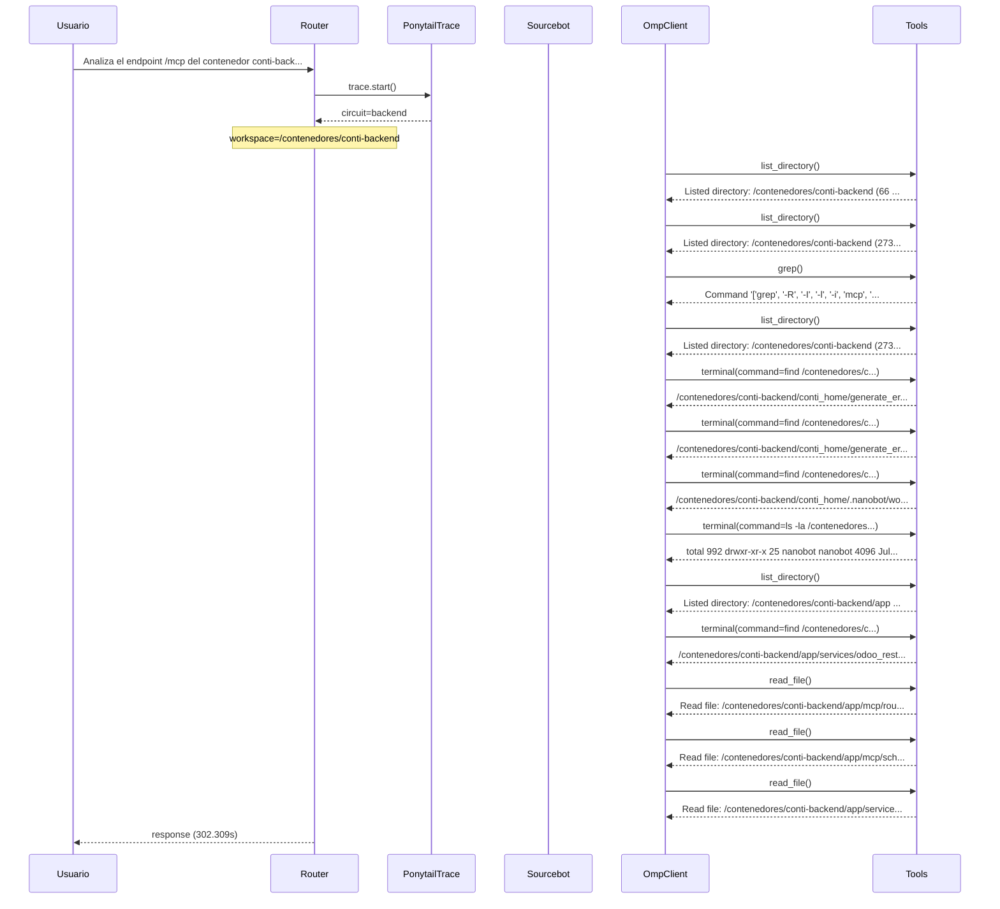

# Traza: Analiza el endpoint /mcp del contenedor conti-backend y documenta todas las tools en un documento mcp_tools_doc.md

- **Circuito**: `backend`
- **Workspace**: `/contenedores/conti-backend`
- **Inicio**: 2026-07-03T23:10:52.220229-03:00
- **Fin**: 2026-07-03T23:15:54.534737-03:00
- **Duración**: 302.315s
- **Eventos**: 39

## Diagrama de Secuencia



## Eventos Detallados

### 1. `start` (2026-07-03T23:10:52.222476-03:00)

```json
{
  "task": "Analiza el endpoint /mcp del contenedor conti-backend y documenta todas las tools en un documento mcp_tools_doc.md",
  "payload_keys": [
    "messages",
    "circuit",
    "_circuit",
    "_session"
  ],
  "circuit": "backend",
  "traces_dir": "/contenedores/conti-backend/.ponytail/traces/2026-07-03_analiza_el_endpoint__mcp_del_contenedor_c5d76871dc4b"
}
```

### 2. `circuit_selected` (2026-07-03T23:10:52.231145-03:00)

```json
{
  "id": "backend",
  "workspace": "/contenedores/conti-backend",
  "session_id": "c5d76871dc4b",
  "is_new_session": true
}
```

### 3. `governance_tool` (2026-07-03T23:10:52.233764-03:00)

```json
{
  "tool": "get_onboarding",
  "chars": 195
}
```

### 4. `governance_tool` (2026-07-03T23:10:52.236300-03:00)

```json
{
  "tool": "get_rules",
  "chars": 438
}
```

### 5. `governance_tool` (2026-07-03T23:10:52.239010-03:00)

```json
{
  "tool": "get_config",
  "chars": 3246
}
```

### 6. `governance_injected` (2026-07-03T23:10:52.239034-03:00)

```json
{
  "onboarding_len": 3939,
  "is_new_session": true
}
```

### 7. `openhands_orchestrator_start` (2026-07-03T23:10:52.457219-03:00)

```json
{
  "circuit": "backend",
  "workspace": "/contenedores/conti-backend",
  "is_new_session": false,
  "prompt_len": 114,
  "governance_len": 3939
}
```

### 8. `conversation_created` (2026-07-03T23:10:52.538315-03:00)

```json
{
  "conversation_id": "3627903e-0380-403e-af3d-f4129d803246",
  "workspace": "/contenedores/conti-backend"
}
```

### 9. `system_prompt` (2026-07-03T23:10:52.538321-03:00)

```json
{
  "length": 114,
  "is_new_session": false,
  "governance_chars": 3939,
  "circuit": "backend",
  "workspace": "/contenedores/conti-backend"
}
```

### 10. `goal_sent` (2026-07-03T23:10:52.549803-03:00)

```json
{
  "conversation_id": "3627903e-0380-403e-af3d-f4129d803246",
  "prompt_len": 114
}
```

### 11. `omp_execution_status` (2026-07-03T23:11:18.064319-03:00)

```json
{
  "status": "running"
}
```

### 12. `omp_tool_start` (2026-07-03T23:11:24.130354-03:00)

```json
{
  "tool": "list_directory",
  "args": {},
  "reasoning": "El usuario me pide que analice el endpoint /mcp del contenedor conti-backend y documente todas las tools en un documento mcp_tools_doc.md. Primero debo explorar el repositorio para entender la estructura y encontrar el código relacionado con el endpoint /mcp. Empezaré listando el directorio actual y"
}
```

### 13. `omp_tool_end` (2026-07-03T23:11:24.130360-03:00)

```json
{
  "tool": "list_directory",
  "result": "Listed directory: /contenedores/conti-backend (66 entries)",
  "ok": true,
  "exit_code": null
}
```

### 14. `omp_tool_start` (2026-07-03T23:11:26.157163-03:00)

```json
{
  "tool": "list_directory",
  "args": {},
  "reasoning": "Voy a ver el contenido con más detalle."
}
```

### 15. `omp_tool_end` (2026-07-03T23:11:26.157173-03:00)

```json
{
  "tool": "list_directory",
  "result": "Listed directory: /contenedores/conti-backend (273 entries)",
  "ok": true,
  "exit_code": null
}
```

### 16. `omp_tool_start` (2026-07-03T23:11:28.215913-03:00)

```json
{
  "tool": "grep",
  "args": {},
  "reasoning": "Necesito buscar archivos que contengan \"mcp\" o \"/mcp\" en el código. Primero, voy a buscar archivos de configuración o rutas. Usaré grep para buscar \"mcp\" en todos los archivos."
}
```

### 17. `omp_tool_end` (2026-07-03T23:11:58.795302-03:00)

```json
{
  "tool": "grep",
  "result": "Command '['grep', '-R', '-I', '-l', '-i', 'mcp', '/contenedores/conti-backend']' timed out after 30 seconds",
  "ok": false,
  "exit_code": null
}
```

### 18. `omp_tool_start` (2026-07-03T23:12:00.830801-03:00)

```json
{
  "tool": "list_directory",
  "args": {},
  "reasoning": "Let me explore the project structure first."
}
```

### 19. `omp_tool_end` (2026-07-03T23:12:00.830816-03:00)

```json
{
  "tool": "list_directory",
  "result": "Listed directory: /contenedores/conti-backend (273 entries)",
  "ok": true,
  "exit_code": null
}
```

### 20. `omp_tool_start` (2026-07-03T23:12:02.866150-03:00)

```json
{
  "tool": "terminal",
  "args": {
    "command": "find /contenedores/conti-backend -type f -name \"*.py\" | head -80"
  },
  "reasoning": "Let me look at the directory structure more carefully."
}
```

### 21. `omp_tool_end` (2026-07-03T23:12:04.888756-03:00)

```json
{
  "tool": "terminal",
  "result": "/contenedores/conti-backend/conti_home/generate_error_report.py\n/contenedores/conti-backend/conti_home/fix_prices_v9.py\n/contenedores/conti-backend/conti_home/ingest_container_errors.py\n/contenedores/conti-backend/conti_home/.npm-global/lib/node_modules/@openhands/agent-canvas/node_modules/@openhands/extensions/skills/discord/scripts/post_webhook.py\n/contenedores/conti-backend/conti_home/.npm-global/lib/node_modules/@openhands/agent-canvas/node_modules/@openhands/extensions/skills/discord/scripts/__init__.py\n/contenedores/conti-backend/conti_home/.npm-global/lib/node_modules/@openhands/agent-canvas/node_modules/@openhands/extensions/skills/discord/scripts/send_message.py\n/contenedores/conti-backend/conti_home/.npm-global/lib/node_modules/@openhands/agent-canvas/node_modules/@openhands/extensions/skills/discord/scripts/_http.py\n/contenedores/conti-backend/conti_home/.npm-global/lib/node_modules/@openhands/agent-canvas/node_modules/@openhands/extensions/skills/discord/__init__.py\n/conten",
  "ok": true,
  "exit_code": 0
}
```

### 22. `omp_tool_start` (2026-07-03T23:12:08.954850-03:00)

```json
{
  "tool": "terminal",
  "args": {
    "command": "find /contenedores/conti-backend -type f -name \"*.py\" -not -path \"*/node_modules/*\" -not -path \"*/.openhands/*\" -not -path \"*/.npm-global/*\" -not -path \"*/__pycache__/*\" | head -50"
  },
  "reasoning": "Let me focus on finding the actual source code files. Let me look for the main application code."
}
```

### 23. `omp_tool_end` (2026-07-03T23:12:08.954870-03:00)

```json
{
  "tool": "terminal",
  "result": "/contenedores/conti-backend/conti_home/generate_error_report.py\n/contenedores/conti-backend/conti_home/fix_prices_v9.py\n/contenedores/conti-backend/conti_home/ingest_container_errors.py\n/contenedores/conti-backend/conti_home/project_ingredients.py\n/contenedores/conti-backend/conti_home/update_prices_v4.py\n/contenedores/conti-backend/conti_home/update_local.py\n/contenedores/conti-backend/conti_home/check_menu_remote.py\n/contenedores/conti-backend/conti_home/add_to_table.py\n/contenedores/conti-backend/conti_home/check_menu.py\n/contenedores/conti-backend/conti_home/ingest_errors_single_ssh.py\n/contenedores/conti-backend/conti_home/fix_prices_v8.py\n/contenedores/conti-backend/conti_home/update_prices_v2.py\n/contenedores/conti-backend/conti_home/fix_prices_pos.py\n/contenedores/conti-backend/conti_home/fix_prices.py\n/contenedores/conti-backend/conti_home/fix_prices_final.py\n/contenedores/conti-backend/conti_home/create_purchase_order_v3.py\n/contenedores/conti-backend/conti_home/workspace/ski",
  "ok": true,
  "exit_code": 0
}
```

### 24. `omp_tool_start` (2026-07-03T23:12:13.022029-03:00)

```json
{
  "tool": "terminal",
  "args": {
    "command": "find /contenedores/conti-backend -type f -name \"*.py\" -not -path \"*/node_modules/*\" -not -path \"*/.openhands/*\" -not -path \"*/.npm-global/*\" -not -path \"*/__pycache__/*\" -not -path \"*/.cache/*\" | grep -E \"(app|main|server|api|mcp)\" | head -20"
  },
  "reasoning": "Let me look at the root of the project more carefully. I see files like `fix_prices_v9.py`, `update_prices_v4.py`, etc. These seem to be utility scripts. Let me look for a main application file, like a server file, or a Django/Flask/FastAPI app."
}
```

### 25. `omp_tool_end` (2026-07-03T23:12:17.090149-03:00)

```json
{
  "tool": "terminal",
  "result": "/contenedores/conti-backend/conti_home/.nanobot/workspace/google-workspace/apply_token.py\n/contenedores/conti-backend/conti_home/.nanobot/workspace/google-workspace/test_apis.py\n/contenedores/conti-backend/conti_home/.local/share/uv/tools/openhands/lib/python3.12/site-packages/propcache/api.py\n/contenedores/conti-backend/conti_home/.local/share/uv/tools/openhands/lib/python3.12/site-packages/fastapi/sse.py\n/contenedores/conti-backend/conti_home/.local/share/uv/tools/openhands/lib/python3.12/site-packages/fastapi/requests.py\n/contenedores/conti-backend/conti_home/.local/share/uv/tools/openhands/lib/python3.12/site-packages/fastapi/security/oauth2.py\n/contenedores/conti-backend/conti_home/.local/share/uv/tools/openhands/lib/python3.12/site-packages/fastapi/security/utils.py\n/contenedores/conti-backend/conti_home/.local/share/uv/tools/openhands/lib/python3.12/site-packages/fastapi/security/open_id_connect_url.py\n/contenedores/conti-backend/conti_home/.local/share/uv/tools/openhands/lib/py",
  "ok": true,
  "exit_code": 0
}
```

### 26. `omp_tool_start` (2026-07-03T23:12:21.185882-03:00)

```json
{
  "tool": "terminal",
  "args": {
    "command": "ls -la /contenedores/conti-backend/"
  },
  "reasoning": "Let me use the correct parameter name."
}
```

### 27. `omp_tool_end` (2026-07-03T23:12:21.185910-03:00)

```json
{
  "tool": "terminal",
  "result": "total 992\ndrwxr-xr-x 25 nanobot nanobot   4096 Jul  3 18:42  .\ndrwxr-xr-x  3 root    root      4096 Jul  3 22:40  ..\ndrwxrwxr-x  9 nanobot nanobot   4096 Jul  3 22:47  .git\n-rw-rw-r--  1 nanobot nanobot   2000 Jun 24 21:54  .gitignore\n-rw-rw-r--  1 nanobot nanobot    311 Jun 24 21:54  .gitmodules\ndrwxrwxr-x  3 nanobot nanobot   4096 Jul  1 13:08  .ponytail\ndrwxrwxr-x  3 nanobot nanobot   4096 Apr 30 00:16  .pytest_cache\ndrwxrwxr-x  5 nanobot nanobot   4096 Jun 29 20:43  .ruff_cache\ndrwxrwxr-x  3 nanobot nanobot   4096 May 12 13:57  .sixth\ndrwxrwxr-x  5 nanobot nanobot   4096 Apr 30 00:16  .venv\n-rw-rw-r--  1 nanobot nanobot   4158 Jun 24 21:54  CARTA.PY\n-rw-rw-r--  1 nanobot nanobot  40547 Jun 24 21:54  CHAT.MD\n-rw-rw-r--  1 nanobot nanobot   4492 Jun 24 21:54  Dockerfile\n-rw-rw-r--  1 nanobot nanobot   3258 Jun 23 01:56 'Dockerfile copy'\n-rw-rw-r--  1 nanobot nanobot   2630 Jun 23 01:56  Dockerfile.old\n-rw-rw-r--  1 nanobot nanobot   1505 Jun 23 01:56  Dockerfile.old0\n-rw-rw-r--  1 na",
  "ok": true,
  "exit_code": 0
}
```

### 28. `omp_tool_start` (2026-07-03T23:12:25.265543-03:00)

```json
{
  "tool": "list_directory",
  "args": {},
  "reasoning": "I can see there's already a `mcp_tools_doc.md` file. Let me look at the app directory and find the MCP endpoint."
}
```

### 29. `omp_tool_end` (2026-07-03T23:12:25.265554-03:00)

```json
{
  "tool": "list_directory",
  "result": "Listed directory: /contenedores/conti-backend/app (19 entries)",
  "ok": true,
  "exit_code": null
}
```

### 30. `omp_tool_start` (2026-07-03T23:12:29.457646-03:00)

```json
{
  "tool": "terminal",
  "args": {
    "command": "find /contenedores/conti-backend/app -type f -name \"*.py\" | head -50"
  },
  "reasoning": "Let me use the summary parameter correctly."
}
```

### 31. `omp_tool_end` (2026-07-03T23:12:31.484541-03:00)

```json
{
  "tool": "terminal",
  "result": "/contenedores/conti-backend/app/services/odoo_restaurant_service.py\n/contenedores/conti-backend/app/services/odoo_media_service.py\n/contenedores/conti-backend/app/services/health_service.py\n/contenedores/conti-backend/app/services/odoo_sales_service.py\n/contenedores/conti-backend/app/services/odoo_client_service.py\n/contenedores/conti-backend/app/services/nanobot_config_service.py\n/contenedores/conti-backend/app/services/odoo_rpc.py\n/contenedores/conti-backend/app/services/nanobot_serve_service.py\n/contenedores/conti-backend/app/services/gsheet_client.py\n/contenedores/conti-backend/app/services/tts_service.py\n/contenedores/conti-backend/app/services/onboarding_service.py\n/contenedores/conti-backend/app/services/registry_service.py\n/contenedores/conti-backend/app/services/odoo_catalog_service.py\n/contenedores/conti-backend/app/services/odoo_profiles.py\n/contenedores/conti-backend/app/services/odoo_invoice_service.py\n/contenedores/conti-backend/app/services/llm_service.py\n/contenedores/c",
  "ok": true,
  "exit_code": 0
}
```

### 32. `omp_tool_start` (2026-07-03T23:12:33.560189-03:00)

```json
{
  "tool": "read_file",
  "args": {},
  "reasoning": "I found the MCP router at `/contenedores/conti-backend/app/mcp/router.py`. Let me read that file and the schemas to understand the MCP endpoint and tools."
}
```

### 33. `omp_tool_end` (2026-07-03T23:12:33.560213-03:00)

```json
{
  "tool": "read_file",
  "result": "Read file: /contenedores/conti-backend/app/mcp/router.py\n\n     1  from __future__ import annotations\n     2  \n     3  import asyncio\n     4  import json\n     5  from typing import Any\n     6  from uuid import uuid4\n     7  \n     8  from fastapi import APIRouter, HTTPException, Request\n     9  from fastapi.responses import JSONResponse, StreamingResponse\n    10  from pydantic import BaseModel, Field\n    11  \n    12  from app.core.tool_models import ToolCallResponse\n    13  from app.mcp.schemas import MCPCallRequest\n    14  from app.services.registry_service import registry_service\n    15  \n    16  \n    17  router = APIRouter(prefix=\"/mcp\", tags=[\"mcp\"])\n    18  \n    19  \n    20  # --- Modelos de Respuesta para Swagger ---\n    21  class MCPRootResponse(BaseModel):\n    22      status: str = Field(default=\"ok\")\n    23      transport: str = Field(..., description=\"Transporte utilizado (ej. http-json+sse)\")\n    24      compatible_with: list[str] = Field(..., description=\"Lista de clientes co",
  "ok": true,
  "exit_code": null
}
```

### 34. `omp_tool_start` (2026-07-03T23:12:35.604067-03:00)

```json
{
  "tool": "read_file",
  "args": {},
  "reasoning": "Now let me check the schemas file to understand the request models:"
}
```

### 35. `omp_tool_end` (2026-07-03T23:12:35.604079-03:00)

```json
{
  "tool": "read_file",
  "result": "Read file: /contenedores/conti-backend/app/mcp/schemas.py\n\n     1  from __future__ import annotations\n     2  \n     3  from pydantic import BaseModel, Field\n     4  \n     5  \n     6  class MCPCallRequest(BaseModel):\n     7      tool: str\n     8      arguments: dict = Field(default_factory=dict)\n",
  "ok": true,
  "exit_code": null
}
```

### 36. `omp_tool_start` (2026-07-03T23:12:39.671137-03:00)

```json
{
  "tool": "read_file",
  "args": {},
  "reasoning": "Now I need to check the registry_service to understand what tools are available. Let me look at the registry service."
}
```

### 37. `omp_tool_end` (2026-07-03T23:12:39.671175-03:00)

```json
{
  "tool": "read_file",
  "result": "Read file: /contenedores/conti-backend/app/services/registry_service.py (showing lines 1-1000 of 1738) To read more, use: read_file(file_path='/contenedores/conti-backend/app/services/registry_service.py', offset=1000, limit=1000)\n\n     1  from __future__ import annotations\n     2  \n     3  from functools import lru_cache\n     4  \n     5  from app.config.loader import load_config\n     6  from app.core import categories, visibility\n     7  from app.core.tool_models import ToolDefinition\n     8  from app.core.tool_registry import ToolRegistry\n     9  from app.tools import (\n    10      catolico_tools,\n    11      code_edit_tools,\n    12      config_tools,\n    13      container_tools,\n    14      document_tools,\n    15      filesystem,\n    16      git_tools,\n    17      odoo_tools,\n    18      ponytail_trace_tools,\n    19      rag_search_tools,\n    20      rag_tools,\n    21      search_literal,\n    22      sheet_tools,\n    23      sourcebot_tools,\n    24      system_status,\n    25      tr",
  "ok": true,
  "exit_code": null
}
```

### 38. `openhands_orchestrator_end` (2026-07-03T23:15:54.529307-03:00)

```json
{
  "conversation_id": "3627903e-0380-403e-af3d-f4129d803246",
  "response_len": 0,
  "status": "ok"
}
```

### 39. `end` (2026-07-03T23:15:54.529557-03:00)

```json
{
  "duration_s": 302.309
}
```

## Prompt Completo (input del usuario)

```text
Analiza el endpoint /mcp del contenedor conti-backend y documenta todas las tools en un documento mcp_tools_doc.md
```
