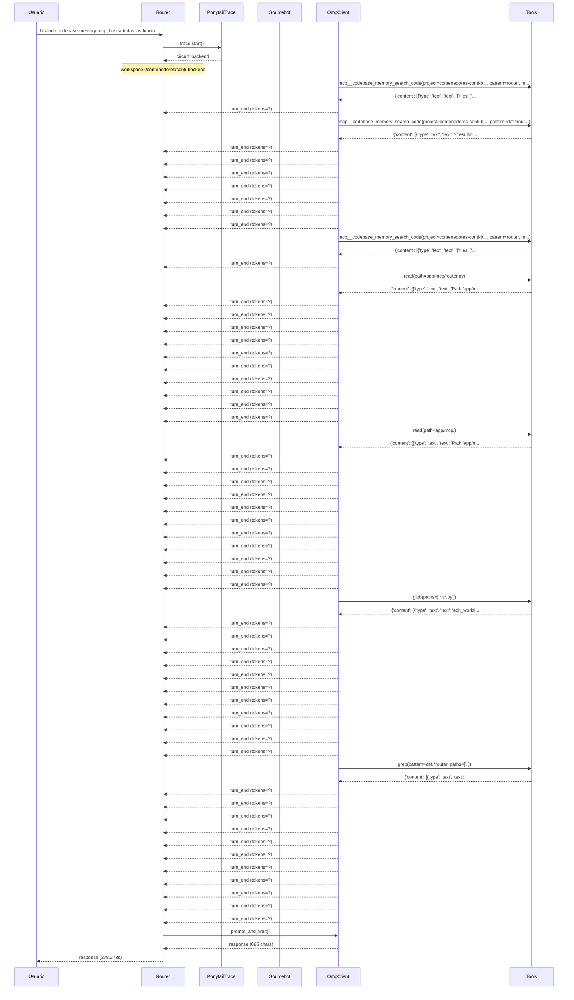

# Traza: Usando codebase-memory-mcp, busca todas las funciones que contienen router en su nombre en el proyecto contenedores-conti-backend y lista sus paths. NO escribas archivos.

- **Circuito**: `backend`
- **Workspace**: `/contenedores/conti-backend`
- **Inicio**: 2026-07-03T11:37:28.495362-03:00
- **Fin**: 2026-07-03T11:42:06.772725-03:00
- **Duración**: 278.277s
- **Eventos**: 75

## Diagrama de Secuencia



## Eventos Detallados

### 1. `start` (2026-07-03T11:37:28.495579-03:00)

```json
{
  "task": "Usando codebase-memory-mcp, busca todas las funciones que contienen router en su nombre en el proyecto contenedores-conti-backend y lista sus paths. NO escribas archivos.",
  "payload_keys": [
    "messages",
    "circuit",
    "_circuit",
    "_session"
  ],
  "circuit": "backend",
  "traces_dir": "/app/logs/ponytail"
}
```

### 2. `circuit_selected` (2026-07-03T11:37:28.541114-03:00)

```json
{
  "id": "backend",
  "workspace": "/contenedores/conti-backend",
  "session_id": "8b272223333f",
  "is_new_session": true
}
```

### 3. `governance_tool` (2026-07-03T11:37:28.561675-03:00)

```json
{
  "tool": "get_onboarding",
  "chars": 195
}
```

### 4. `governance_tool` (2026-07-03T11:37:28.564192-03:00)

```json
{
  "tool": "get_rules",
  "chars": 438
}
```

### 5. `governance_tool` (2026-07-03T11:37:28.566395-03:00)

```json
{
  "tool": "get_config",
  "chars": 3246
}
```

### 6. `governance_injected` (2026-07-03T11:37:28.566482-03:00)

```json
{
  "onboarding_len": 3939,
  "is_new_session": true
}
```

### 7. `omp_tool_start` (2026-07-03T11:37:38.970168-03:00)

```json
{
  "tool": "mcp__codebase_memory_search_code",
  "args": {
    "project": "contenedores-conti-backend",
    "pattern": "router",
    "mode": "files"
  },
  "result": null,
  "error": null,
  "ok": true
}
```

### 8. `omp_tool_end` (2026-07-03T11:37:39.030469-03:00)

```json
{
  "tool": "mcp__codebase_memory_search_code",
  "args": {
    "project": "contenedores-conti-backend",
    "pattern": "router",
    "mode": "files"
  },
  "result": {
    "content": [
      {
        "type": "text",
        "text": "{\"files\":[\"\",\"app/openhands_agent/circuits.py\",\"app/utils/logging.py\",\"app/main.py\",\"app/mcp/router.py\",\".ponytail/traces/2026-07-02_backend_trace-1783026768850.md\",\".ponytail/traces/2026-07-02_backend_trace-1783032740936.md\",\".ponytail/traces/2026-07-02_backend_trace-1783033189739.md\",\".ponytail/traces/2026-07-02_backend_trace-1783033484065.md\",\".ponytail/traces/2026-07-02_backend_trace-1783034124889.md\",\"  },\\\\n  825???  \\\\\\\"result\\\\\\\"\",\" Git / CI-CD local (6)\\\\n\\\\n| Tool | Descripci??n |\\\\n|------|-------------|\\\\n| `get_git_status` | Estado del repo\",\" `/home/nanobot/` | `./conti_home` | rw |\\\\n| `/desarrollo` | `/desarrollo` | rw |\\\\n| `/compose` | `/compose` | ro |\\\\n| `/compose/documentos_listos` | `/compose/documentos_listos` | rw |\\\\n| `/compose/documentos_nuevos` | `/compose/documentos_nuevos` | rw |\\\\n| `/tenants` | `/contenedores/tenants` | rw |\\\\n| `/var/run/docker.sock` | `/var/run/docker.sock` | rw |\\\\n| `/app/app` | `./app` | rw (hot-reload) |\\\\n| `/app/config/team.toml` | `/desarrollo/config/team.toml` | ro |\\\\n| `/app/skills` | `/desarrollo/shared_\",\" jobs recientes |\\\\n| `scan_documentos_nuevos` | Escanea `/compose/documentos_nuevos/{store}/`, mueve a `procesados/` y lanza ingesta. Soporta `dry_run`, `store=all`, `max_files`, `include_procesados` |\\\\n\\\\n### Grupo J ??? RAG Flamehaven ??? B??squeda (4)\\\\n\\\\n| Tool | Descripci??n |\\\\n|------|-------------|\\\\n| `search_rag` | B??squeda completa (hybrid/semantic/keyword) con respuesta LLM (Gemini). Devuelve `answer`, `sources`, `search_confidence`, `low_confidence` |\\\\n| `search_rag_quick` | B??squeda keyword sin\",\" ??? Descubre configs desde `/tenants/<id>/config.yaml` (YAML). Singleton con lazy load\\\\n- `app/tenants/context_writer.py` ??? Escribe `state.json`, `history.md`, `rule_context.md` antes de cada llamada al nanobot\\\\n- `app/chat/memory.py` ??? `RedisSessionManager`\",\"\\\",\\\\n## 2026-07-02_backend_trace-1783026768850.md#4516\\\\n    3???circuit\",\")\\\\ndef get_onboarding(brief\",\"-----------|\\\\n| `GET` | `/health` | Estado del backend (versi??n, uptime, servicios) |\\\\n| `GET` | `/config` | Configuraci??n efectiva con secretos redactados |\\\\n| `POST` | `/config/reload` | Recarga configuraci??n desde disco |\\\\n| `GET` | `/onboarding` | Contenido de onboarding.md. `?brief=true` para resumen |\\\\n| `POST` | `/onboarding/reload` | Recarga onboarding desde disco |\\\\n| `GET` | `/rules` | Reglas efectivas con checksum y mtime |\\\\n| `GET` | `/rules/raw` | Reglas en texto plano |\\\\n| `POST` | `/rules\",\"----------|\\\\n| `GET` | `/health` | Estado del backend (versi??n, uptime, servicios) |\\\\n| `GET` | `/config` | Configuraci??n efectiva con secretos redactados |\\\\n| `POST` | `/config/reload` | Recarga configuraci??n desde disco |\\\\n| `GET` | `/onboarding` | Contenido de onboarding.md. `?brief=true` para resumen |\\\\n| `POST` | `/onboarding/reload` | Recarga onboarding desde disco |\\\\n| `GET` | `/rules` | Reglas efectivas con checksum y mtime |\\\\n| `GET` | `/rules/raw` | Reglas en texto plano |\\\\n| `POST` | `/rules/\",\"--------|\\\\n| `GET` | `/health` | Estado del backend (versi??n, uptime, servicios) |\\\\n| `GET` | `/config` | Configuraci??n efectiva con secretos redactados |\\\\n| `POST` | `/config/reload` | Recarga configuraci??n desde disco |\\\\n| `GET` | `/onboarding` | Contenido de onboarding.md. `?brief=true` para resumen |\\\\n| `POST` | `/onboarding/reload` | Recarga onboarding desde disco |\\\\n| `GET` | `/rules` | Reglas efectivas con checksum y mtime |\\\\n| `GET` | `/rules/raw` | Reglas en texto plano |\\\\n| `POST` | `/rules/re\",\"-------|\\\\n| `GET` | `/health` | Estado del backend (versi??n, uptime, servicios) |\\\\n| `GET` | `/config` | Configuraci??n efectiva con secretos redactados |\\\\n| `POST` | `/config/reload` | Recarga configuraci??n desde disco |\\\\n| `GET` | `/onboarding` | Contenido de onboarding.md. `?brief=true` para resumen |\\\\n| `POST` | `/onboarding/reload` | Recarga onboarding desde disco |\\\\n| `GET` | `/rules` | Reglas efectivas con checksum y mtime |\\\\n| `GET` | `/rules/raw` | Reglas en texto plano |\\\\n| `POST` | `/rules/rel\",\"...\\\\n 1079\",\".py` ??? Descubre configs desde `/tenants/<id>/config.yaml` (YAML). Singleton con lazy load\\\\n- `app/tenants/context_writer.py` ??? Escribe `state.json`, `history.md`, `rule_context.md` antes de cada llamada al nanobot\\\\n- `app/chat/memory.py` ??? `RedisSessionManager`\",\"0762\\\\n 6\",\"128\",\"2\",\"243\",\"43\",\"92\",\"Git / CI-CD local (6)\\\\n\\\\n| Tool | Descripci??n |\\\\n|------|-------------|\\\\n| `get_git_status` | Estado del repo\",\"` ??? Descubre configs desde `/tenants/<id>/config.yaml` (YAML). Singleton con lazy load\\\\n- `app/tenants/context_writer.py` ??? Escribe `state.json`, `history.md`, `rule_context.md` antes de cada llamada al nanobot\\\\n- `app/chat/memory.py` ??? `RedisSessionManager`\",\"`/home/nanobot/` | `./conti_home` | rw |\\\\n| `/desarrollo` | `/desarrollo` | rw |\\\\n| `/compose` | `/compose` | ro |\\\\n| `/compose/documentos_listos` | `/compose/documentos_listos` | rw |\\\\n| `/compose/documentos_nuevos` | `/compose/documentos_nuevos` | rw |\\\\n| `/tenants` | `/contenedores/tenants` | rw |\\\\n| `/var/run/docker.sock` | `/var/run/docker.sock` | rw |\\\\n| `/app/app` | `./app` | rw (hot-reload) |\\\\n| `/app/config/team.toml` | `/desarrollo/config/team.toml` | ro |\\\\n| `/app/skills` | `/desarrollo/shared_s\",\"ase 8 ??? no estaba en el plan original)\\\\n203\",\"dencias Python\\\\n39\",\"docker/conti-omp/entrypoint.sh\",\"e\\\\n 36???    Backend->>Backend\",\"end\",\"end->>Backend\",\"ess\\\\\\\"\",\"gent/test/marketplace/fixtures/valid-marketplace/plugins/hello-plugin/.mcp.json\\\\n/contenedores/conti-backend/vendor/oh-my-pi/packages/coding-agent/src/config/mcp-schema.json\\\\n/contenedores/conti-backend/vendor/oh-my-pi/node_modules/.cache/@oh-my-pi/pi-coding-agent@13.19.0@@@1/src/config/mcp-schema.json\\\\n/contenedores/conti-backend/vendor/OpenHands/tests/unit/mcp/test_mcp_integration.py\\\\n/contenedores/conti-backend/vendor/OpenHands/tests/unit/server/routes/test_mcp_routes.py\\\\n/contenedores/conti-backend/ven\",\"home/nanobot/` | `./conti_home` | rw |\\\\n| `/desarrollo` | `/desarrollo` | rw |\\\\n| `/compose` | `/compose` | ro |\\\\n| `/compose/documentos_listos` | `/compose/documentos_listos` | rw |\\\\n| `/compose/documentos_nuevos` | `/compose/documentos_nuevos` | rw |\\\\n| `/tenants` | `/contenedores/tenants` | rw |\\\\n| `/var/run/docker.sock` | `/var/run/docker.sock` | rw |\\\\n| `/app/app` | `./app` | rw (hot-reload) |\\\\n| `/app/config/team.toml` | `/desarrollo/config/team.toml` | ro |\\\\n| `/app/skills` | `/desarrollo/shared_ski\",\"int | Descripci??n |\\\\n83\",\"jobs recientes |\\\\n| `scan_documentos_nuevos` | Escanea `/compose/documentos_nuevos/{store}/`, mueve a `procesados/` y lanza ingesta. Soporta `dry_run`, `store=all`, `max_files`, `include_procesados` |\\\\n\\\\n### Grupo J ??? RAG Flamehaven ??? B??squeda (4)\\\\n\\\\n| Tool | Descripci??n |\\\\n|------|-------------|\\\\n| `search_rag` | B??squeda completa (hybrid/semantic/keyword) con respuesta LLM (Gemini). Devuelve `answer`, `sources`, `search_confidence`, `low_confidence` |\\\\n| `search_rag_quick` | B??squeda keyword sin \",\"lhost\",\"n128\",\"n` | Convierte PDF/DOCX a Markdown via `markitdown`. Guarda en `/compose/documentos_listos/{store}/`. Opcionalmente encadena traducci??n |\\\\n171\",\"ndencias Python\\\\n39\",\"nt | Descripci??n |\\\\n83\",\"nt_end (text)\\\\n*35???    Ponytail->>Backend\",\"ocumento mcp_tools_doc.md\\\\\\\",\\\\n 101???  \\\\\\\"payload_keys\\\\\\\"\",\"oint /mcp del contenedor conti-backend y documenta todas las tools en un documento mcp_tools_doc.md\\\\\\\",\\\\n  54???  \\\\\\\"payload_keys\\\\\\\"\",\"ome/nanobot/` | `./conti_home` | rw |\\\\n| `/desarrollo` | `/desarrollo` | rw |\\\\n| `/compose` | `/compose` | ro |\\\\n| `/compose/documentos_listos` | `/compose/documentos_listos` | rw |\\\\n| `/compose/documentos_nuevos` | `/compose/documentos_nuevos` | rw |\\\\n| `/tenants` | `/contenedores/tenants` | rw |\\\\n| `/var/run/docker.sock` | `/var/run/docker.sock` | rw |\\\\n| `/app/app` | `./app` | rw (hot-reload) |\\\\n| `/app/config/team.toml` | `/desarrollo/config/team.toml` | ro |\\\\n| `/app/skills` | `/desarrollo/shared_skil\",\"ontent\\\\\\\"\",\"py` ??? Descubre configs desde `/tenants/<id>/config.yaml` (YAML). Singleton con lazy load\\\\n- `app/tenants/context_writer.py` ??? Escribe `state.json`, `history.md`, `rule_context.md` antes de cada llamada al nanobot\\\\n- `app/chat/memory.py` ??? `RedisSessionManager`\",\"se 8 ??? no estaba en el plan original)\\\\n203\",\"sta jobs recientes |\\\\n| `scan_documentos_nuevos` | Escanea `/compose/documentos_nuevos/{store}/`, mueve a `procesados/` y lanza ingesta. Soporta `dry_run`, `store=all`, `max_files`, `include_procesados` |\\\\n\\\\n### Grupo J ??? RAG Flamehaven ??? B??squeda (4)\\\\n\\\\n| Tool | Descripci??n |\\\\n|------|-------------|\\\\n| `search_rag` | B??squeda completa (hybrid/semantic/keyword) con respuesta LLM (Gemini). Devuelve `answer`, `sources`, `search_confidence`, `low_confidence` |\\\\n| `search_rag_quick` | B??squeda keyword \",\"ta jobs recientes |\\\\n| `scan_documentos_nuevos` | Escanea `/compose/documentos_nuevos/{store}/`, mueve a `procesados/` y lanza ingesta. Soporta `dry_run`, `store=all`, `max_files`, `include_procesados` |\\\\n\\\\n### Grupo J ??? RAG Flamehaven ??? B??squeda (4)\\\\n\\\\n| Tool | Descripci??n |\\\\n|------|-------------|\\\\n| `search_rag` | B??squeda completa (hybrid/semantic/keyword) con respuesta LLM (Gemini). Devuelve `answer`, `sources`, `search_confidence`, `low_confidence` |\\\\n| `search_rag_quick` | B??squeda keyword s\",\"text\\\\n*127\",\"ti_home/.npm-global/lib/node_modules/@openhands/agent-canvas/build/locales/ko-KR/openhands.json\\\\\\\\n/contenedores/conti-backend/conti_home/.npm-global/lib/node_modules/@open...\\\\n 521???      }\\\\n 522???    ],\\\\n 523???    \\\\\\\"details\\\\\\\"\",\"uid4().hex\\\\n???\\\\n        yield \\\\\\\"\",\"ull,\\\\n 916\",\"uuid4().hex\\\\n???\\\\n        yield \\\\\\\"\",\"wn` | Convierte PDF/DOCX a Markdown via `markitdown`. Guarda en `/compose/documentos_listos/{store}/`. Opcionalmente encadena traducci??n |\\\\n171\",\"?? Git / CI-CD local (6)\\\\n\\\\n| Tool | Descripci??n |\\\\n|------|-------------|\\\\n| `get_git_status` | Estado del repo\",\"??? Git / CI-CD local (6)\\\\n\\\\n| Tool | Descripci??n |\\\\n|------|-------------|\\\\n| `get_git_status` | Estado del repo\"],\"directories\":{\"\":1,\"app/\":17,\".ponytail/\":8,\"PLAN_2_LLM.md\":1,\"PLAN_3_LLM.md\":1,\"Plan_backend.md\":1,\"docs/\":9,\"pase.md\":1,\"tests/\":1},\"total_grep_matches\":250,\"total_results\":40,\"raw_match_count\":59,\"elapsed_ms\":47,\"dedup_ratio\":\"2.5x\"}"
      }
    ],
    "details": {
      "serverName": "codebase-memory",
      "mcpToolName": "search_code",
      "rawContent": [
        {
          "type": "text",
          "text": "{\"files\":[\"\",\"app/openhands_agent/circuits.py\",\"app/utils/logging.py\",\"app/main.py\",\"app/mcp/router.py\",\".ponytail/traces/2026-07-02_backend_trace-1783026768850.md\",\".ponytail/traces/2026-07-02_backend_trace-1783032740936.md\",\".ponytail/traces/2026-07-02_backend_trace-1783033189739.md\",\".ponytail/traces/2026-07-02_backend_trace-1783033484065.md\",\".ponytail/traces/2026-07-02_backend_trace-1783034124889.md\",\"  },\\\\n  825???  \\\\\\\"result\\\\\\\"\",\" Git / CI-CD local (6)\\\\n\\\\n| Tool | Descripci??n |\\\\n|------|-------------|\\\\n| `get_git_status` | Estado del repo\",\" `/home/nanobot/` | `./conti_home` | rw |\\\\n| `/desarrollo` | `/desarrollo` | rw |\\\\n| `/compose` | `/compose` | ro |\\\\n| `/compose/documentos_listos` | `/compose/documentos_listos` | rw |\\\\n| `/compose/documentos_nuevos` | `/compose/documentos_nuevos` | rw |\\\\n| `/tenants` | `/contenedores/tenants` | rw |\\\\n| `/var/run/docker.sock` | `/var/run/docker.sock` | rw |\\\\n| `/app/app` | `./app` | rw (hot-reload) |\\\\n| `/app/config/team.toml` | `/desarrollo/config/team.toml` | ro |\\\\n| `/app/skills` | `/desarrollo/shared_\",\" jobs recientes |\\\\n| `scan_documentos_nuevos` | Escanea `/compose/documentos_nuevos/{store}/`, mueve a `procesados/` y lanza ingesta. Soporta `dry_run`, `store=all`, `max_files`, `include_procesados` |\\\\n\\\\n### Grupo J ??? RAG Flamehaven ??? B??squeda (4)\\\\n\\\\n| Tool | Descripci??n |\\\\n|------|-------------|\\\\n| `search_rag` | B??squeda completa (hybrid/semantic/keyword) con respuesta LLM (Gemini). Devuelve `answer`, `sources`, `search_confidence`, `low_confidence` |\\\\n| `search_rag_quick` | B??squeda keyword sin\",\" ??? Descubre configs desde `/tenants/<id>/config.yaml` (YAML). Singleton con lazy load\\\\n- `app/tenants/context_writer.py` ??? Escribe `state.json`, `history.md`, `rule_context.md` antes de cada llamada al nanobot\\\\n- `app/chat/memory.py` ??? `RedisSessionManager`\",\"\\\",\\\\n## 2026-07-02_backend_trace-1783026768850.md#4516\\\\n    3???circuit\",\")\\\\ndef get_onboarding(brief\",\"-----------|\\\\n| `GET` | `/health` | Estado del backend (versi??n, uptime, servicios) |\\\\n| `GET` | `/config` | Configuraci??n efectiva con secretos redactados |\\\\n| `POST` | `/config/reload` | Recarga configuraci??n desde disco |\\\\n| `GET` | `/onboarding` | Contenido de onboarding.md. `?brief=true` para resumen |\\\\n| `POST` | `/onboarding/reload` | Recarga onboarding desde disco |\\\\n| `GET` | `/rules` | Reglas efectivas con checksum y mtime |\\\\n| `GET` | `/rules/raw` | Reglas en texto plano |\\\\n| `POST` | `/rules\",\"----------|\\\\n| `GET` | `/health` | Estado del backend (versi??n, uptime, servicios) |\\\\n| `GET` | `/config` | Configuraci??n efectiva con secretos redactados |\\\\n| `POST` | `/config/reload` | Recarga configuraci??n desde disco |\\\\n| `GET` | `/onboarding` | Contenido de onboarding.md. `?brief=true` para resumen |\\\\n| `POST` | `/onboarding/reload` | Recarga onboarding desde disco |\\\\n| `GET` | `/rules` | Reglas efectivas con checksum y mtime |\\\\n| `GET` | `/rules/raw` | Reglas en texto plano |\\\\n| `POST` | `/rules/\",\"--------|\\\\n| `GET` | `/health` | Estado del backend (versi??n, uptime, servicios) |\\\\n| `GET` | `/config` | Configuraci??n efectiva con secretos redactados |\\\\n| `POST` | `/config/reload` | Recarga configuraci??n desde disco |\\\\n| `GET` | `/onboarding` | Contenido de onboarding.md. `?brief=true` para resumen |\\\\n| `POST` | `/onboarding/reload` | Recarga onboarding desde disco |\\\\n| `GET` | `/rules` | Reglas efectivas con checksum y mtime |\\\\n| `GET` | `/rules/raw` | Reglas en texto plano |\\\\n| `POST` | `/rules/re\",\"-------|\\\\n| `GET` | `/health` | Estado del backend (versi??n, uptime, servicios) |\\\\n| `GET` | `/config` | Configuraci??n efectiva con secretos redactados |\\\\n| `POST` | `/config/reload` | Recarga configuraci??n desde disco |\\\\n| `GET` | `/onboarding` | Contenido de onboarding.md. `?brief=true` para resumen |\\\\n| `POST` | `/onboarding/reload` | Recarga onboarding desde disco |\\\\n| `GET` | `/rules` | Reglas efectivas con checksum y mtime |\\\\n| `GET` | `/rules/raw` | Reglas en texto plano |\\\\n| `POST` | `/rules/rel\",\"...\\\\n 1079\",\".py` ??? Descubre configs desde `/tenants/<id>/config.yaml` (YAML). Singleton con lazy load\\\\n- `app/tenants/context_writer.py` ??? Escribe `state.json`, `history.md`, `rule_context.md` antes de cada llamada al nanobot\\\\n- `app/chat/memory.py` ??? `RedisSessionManager`\",\"0762\\\\n 6\",\"128\",\"2\",\"243\",\"43\",\"92\",\"Git / CI-CD local (6)\\\\n\\\\n| Tool | Descripci??n |\\\\n|------|-------------|\\\\n| `get_git_status` | Estado del repo\",\"` ??? Descubre configs desde `/tenants/<id>/config.yaml` (YAML). Singleton con lazy load\\\\n- `app/tenants/context_writer.py` ??? Escribe `state.json`, `history.md`, `rule_context.md` antes de cada llamada al nanobot\\\\n- `app/chat/memory.py` ??? `RedisSessionManager`\",\"`/home/nanobot/` | `./conti_home` | rw |\\\\n| `/desarrollo` | `/desarrollo` | rw |\\\\n| `/compose` | `/compose` | ro |\\\\n| `/compose/documentos_listos` | `/compose/documentos_listos` | rw |\\\\n| `/compose/documentos_nuevos` | `/compose/documentos_nuevos` | rw |\\\\n| `/tenants` | `/contenedores/tenants` | rw |\\\\n| `/var/run/docker.sock` | `/var/run/docker.sock` | rw |\\\\n| `/app/app` | `./app` | rw (hot-reload) |\\\\n| `/app/config/team.toml` | `/desarrollo/config/team.toml` | ro |\\\\n| `/app/skills` | `/desarrollo/shared_s\",\"ase 8 ??? no estaba en el plan original)\\\\n203\",\"dencias Python\\\\n39\",\"docker/conti-omp/entrypoint.sh\",\"e\\\\n 36???    Backend->>Backend\",\"end\",\"end->>Backend\",\"ess\\\\\\\"\",\"gent/test/marketplace/fixtures/valid-marketplace/plugins/hello-plugin/.mcp.json\\\\n/contenedores/conti-backend/vendor/oh-my-pi/packages/coding-agent/src/config/mcp-schema.json\\\\n/contenedores/conti-backend/vendor/oh-my-pi/node_modules/.cache/@oh-my-pi/pi-coding-agent@13.19.0@@@1/src/config/mcp-schema.json\\\\n/contenedores/conti-backend/vendor/OpenHands/tests/unit/mcp/test_mcp_integration.py\\\\n/contenedores/conti-backend/vendor/OpenHands/tests/unit/server/routes/test_mcp_routes.py\\\\n/contenedores/conti-backend/ven\",\"home/nanobot/` | `./conti_home` | rw |\\\\n| `/desarrollo` | `/desarrollo` | rw |\\\\n| `/compose` | `/compose` | ro |\\\\n| `/compose/documentos_listos` | `/compose/documentos_listos` | rw |\\\\n| `/compose/documentos_nuevos` | `/compose/documentos_nuevos` | rw |\\\\n| `/tenants` | `/contenedores/tenants` | rw |\\\\n| `/var/run/docker.sock` | `/var/run/docker.sock` | rw |\\\\n| `/app/app` | `./app` | rw (hot-reload) |\\\\n| `/app/config/team.toml` | `/desarrollo/config/team.toml` | ro |\\\\n| `/app/skills` | `/desarrollo/shared_ski\",\"int | Descripci??n |\\\\n83\",\"jobs recientes |\\\\n| `scan_documentos_nuevos` | Escanea `/compose/documentos_nuevos/{store}/`, mueve a `procesados/` y lanza ingesta. Soporta `dry_run`, `store=all`, `max_files`, `include_procesados` |\\\\n\\\\n### Grupo J ??? RAG Flamehaven ??? B??squeda (4)\\\\n\\\\n| Tool | Descripci??n |\\\\n|------|-------------|\\\\n| `search_rag` | B??squeda completa (hybrid/semantic/keyword) con respuesta LLM (Gemini). Devuelve `answer`, `sources`, `search_confidence`, `low_confidence` |\\\\n| `search_rag_quick` | B??squeda keyword sin \",\"lhost\",\"n128\",\"n` | Convierte PDF/DOCX a Markdown via `markitdown`. Guarda en `/compose/documentos_listos/{store}/`. Opcionalmente encadena traducci??n |\\\\n171\",\"ndencias Python\\\\n39\",\"nt | Descripci??n |\\\\n83\",\"nt_end (text)\\\\n*35???    Ponytail->>Backend\",\"ocumento mcp_tools_doc.md\\\\\\\",\\\\n 101???  \\\\\\\"payload_keys\\\\\\\"\",\"oint /mcp del contenedor conti-backend y documenta todas las tools en un documento mcp_tools_doc.md\\\\\\\",\\\\n  54???  \\\\\\\"payload_keys\\\\\\\"\",\"ome/nanobot/` | `./conti_home` | rw |\\\\n| `/desarrollo` | `/desarrollo` | rw |\\\\n| `/compose` | `/compose` | ro |\\\\n| `/compose/documentos_listos` | `/compose/documentos_listos` | rw |\\\\n| `/compose/documentos_nuevos` | `/compose/documentos_nuevos` | rw |\\\\n| `/tenants` | `/contenedores/tenants` | rw |\\\\n| `/var/run/docker.sock` | `/var/run/docker.sock` | rw |\\\\n| `/app/app` | `./app` | rw (hot-reload) |\\\\n| `/app/config/team.toml` | `/desarrollo/config/team.toml` | ro |\\\\n| `/app/skills` | `/desarrollo/shared_skil\",\"ontent\\\\\\\"\",\"py` ??? Descubre configs desde `/tenants/<id>/config.yaml` (YAML). Singleton con lazy load\\\\n- `app/tenants/context_writer.py` ??? Escribe `state.json`, `history.md`, `rule_context.md` antes de cada llamada al nanobot\\\\n- `app/chat/memory.py` ??? `RedisSessionManager`\",\"se 8 ??? no estaba en el plan original)\\\\n203\",\"sta jobs recientes |\\\\n| `scan_documentos_nuevos` | Escanea `/compose/documentos_nuevos/{store}/`, mueve a `procesados/` y lanza ingesta. Soporta `dry_run`, `store=all`, `max_files`, `include_procesados` |\\\\n\\\\n### Grupo J ??? RAG Flamehaven ??? B??squeda (4)\\\\n\\\\n| Tool | Descripci??n |\\\\n|------|-------------|\\\\n| `search_rag` | B??squeda completa (hybrid/semantic/keyword) con respuesta LLM (Gemini). Devuelve `answer`, `sources`, `search_confidence`, `low_confidence` |\\\\n| `search_rag_quick` | B??squeda keyword \",\"ta jobs recientes |\\\\n| `scan_documentos_nuevos` | Escanea `/compose/documentos_nuevos/{store}/`, mueve a `procesados/` y lanza ingesta. Soporta `dry_run`, `store=all`, `max_files`, `include_procesados` |\\\\n\\\\n### Grupo J ??? RAG Flamehaven ??? B??squeda (4)\\\\n\\\\n| Tool | Descripci??n |\\\\n|------|-------------|\\\\n| `search_rag` | B??squeda completa (hybrid/semantic/keyword) con respuesta LLM (Gemini). Devuelve `answer`, `sources`, `search_confidence`, `low_confidence` |\\\\n| `search_rag_quick` | B??squeda keyword s\",\"text\\\\n*127\",\"ti_home/.npm-global/lib/node_modules/@openhands/agent-canvas/build/locales/ko-KR/openhands.json\\\\\\\\n/contenedores/conti-backend/conti_home/.npm-global/lib/node_modules/@open...\\\\n 521???      }\\\\n 522???    ],\\\\n 523???    \\\\\\\"details\\\\\\\"\",\"uid4().hex\\\\n???\\\\n        yield \\\\\\\"\",\"ull,\\\\n 916\",\"uuid4().hex\\\\n???\\\\n        yield \\\\\\\"\",\"wn` | Convierte PDF/DOCX a Markdown via `markitdown`. Guarda en `/compose/documentos_listos/{store}/`. Opcionalmente encadena traducci??n |\\\\n171\",\"?? Git / CI-CD local (6)\\\\n\\\\n| Tool | Descripci??n |\\\\n|------|-------------|\\\\n| `get_git_status` | Estado del repo\",\"??? Git / CI-CD local (6)\\\\n\\\\n| Tool | Descripci??n |\\\\n|------|-------------|\\\\n| `get_git_status` | Estado del repo\"],\"directories\":{\"\":1,\"app/\":17,\".ponytail/\":8,\"PLAN_2_LLM.md\":1,\"PLAN_3_LLM.md\":1,\"Plan_backend.md\":1,\"docs/\":9,\"pase.md\":1,\"tests/\":1},\"total_grep_matches\":250,\"total_results\":40,\"raw_match_count\":59,\"elapsed_ms\":47,\"dedup_ratio\":\"2.5x\"}"
        }
      ],
      "provider": "native",
      "providerName": "OMP"
    }
  },
  "error": null,
  "ok": true
}
```

### 9. `omp_turn_end` (2026-07-03T11:37:39.043819-03:00)

```json
{
  "event_type": "turn_end",
  "model": "?",
  "provider": "?"
}
```

### 10. `omp_tool_start` (2026-07-03T11:37:42.077427-03:00)

```json
{
  "tool": "mcp__codebase_memory_search_code",
  "args": {
    "project": "contenedores-conti-backend",
    "pattern": "def.*router",
    "mode": "full"
  },
  "result": null,
  "error": null,
  "ok": true
}
```

### 11. `omp_tool_end` (2026-07-03T11:37:42.099319-03:00)

```json
{
  "tool": "mcp__codebase_memory_search_code",
  "args": {
    "project": "contenedores-conti-backend",
    "pattern": "def.*router",
    "mode": "full"
  },
  "result": {
    "content": [
      {
        "type": "text",
        "text": "{\"results\":[],\"raw_matches\":[],\"directories\":{},\"total_grep_matches\":0,\"total_results\":0,\"raw_match_count\":0,\"elapsed_ms\":16}"
      }
    ],
    "details": {
      "serverName": "codebase-memory",
      "mcpToolName": "search_code",
      "rawContent": [
        {
          "type": "text",
          "text": "{\"results\":[],\"raw_matches\":[],\"directories\":{},\"total_grep_matches\":0,\"total_results\":0,\"raw_match_count\":0,\"elapsed_ms\":16}"
        }
      ],
      "provider": "native",
      "providerName": "OMP"
    }
  },
  "error": null,
  "ok": true
}
```

### 12. `omp_turn_end` (2026-07-03T11:37:42.102763-03:00)

```json
{
  "event_type": "turn_end",
  "model": "?",
  "provider": "?"
}
```

### 13. `omp_turn_end` (2026-07-03T11:37:42.631162-03:00)

```json
{
  "event_type": "turn_end",
  "model": "?",
  "provider": "?"
}
```

### 14. `omp_turn_end` (2026-07-03T11:37:43.686734-03:00)

```json
{
  "event_type": "turn_end",
  "model": "?",
  "provider": "?"
}
```

### 15. `omp_turn_end` (2026-07-03T11:37:45.030471-03:00)

```json
{
  "event_type": "turn_end",
  "model": "?",
  "provider": "?"
}
```

### 16. `omp_turn_end` (2026-07-03T11:37:47.532003-03:00)

```json
{
  "event_type": "turn_end",
  "model": "?",
  "provider": "?"
}
```

### 17. `omp_turn_end` (2026-07-03T11:37:51.657030-03:00)

```json
{
  "event_type": "turn_end",
  "model": "?",
  "provider": "?"
}
```

### 18. `omp_turn_end` (2026-07-03T11:37:58.535226-03:00)

```json
{
  "event_type": "turn_end",
  "model": "?",
  "provider": "?"
}
```

### 19. `omp_tool_start` (2026-07-03T11:38:10.162338-03:00)

```json
{
  "tool": "mcp__codebase_memory_search_code",
  "args": {
    "project": "contenedores-conti-backend",
    "pattern": "router",
    "mode": "files"
  },
  "result": null,
  "error": null,
  "ok": true
}
```

### 20. `omp_tool_end` (2026-07-03T11:38:10.258562-03:00)

```json
{
  "tool": "mcp__codebase_memory_search_code",
  "args": {
    "project": "contenedores-conti-backend",
    "pattern": "router",
    "mode": "files"
  },
  "result": {
    "content": [
      {
        "type": "text",
        "text": "{\"files\":[\"\",\"app/openhands_agent/circuits.py\",\"app/utils/logging.py\",\"app/main.py\",\"app/mcp/router.py\",\".ponytail/traces/2026-07-02_backend_trace-1783026768850.md\",\".ponytail/traces/2026-07-02_backend_trace-1783032740936.md\",\".ponytail/traces/2026-07-02_backend_trace-1783033189739.md\",\".ponytail/traces/2026-07-02_backend_trace-1783033484065.md\",\".ponytail/traces/2026-07-02_backend_trace-1783034124889.md\",\"  },\\\\n  825???  \\\\\\\"result\\\\\\\"\",\" Git / CI-CD local (6)\\\\n\\\\n| Tool | Descripci??n |\\\\n|------|-------------|\\\\n| `get_git_status` | Estado del repo\",\" `/home/nanobot/` | `./conti_home` | rw |\\\\n| `/desarrollo` | `/desarrollo` | rw |\\\\n| `/compose` | `/compose` | ro |\\\\n| `/compose/documentos_listos` | `/compose/documentos_listos` | rw |\\\\n| `/compose/documentos_nuevos` | `/compose/documentos_nuevos` | rw |\\\\n| `/tenants` | `/contenedores/tenants` | rw |\\\\n| `/var/run/docker.sock` | `/var/run/docker.sock` | rw |\\\\n| `/app/app` | `./app` | rw (hot-reload) |\\\\n| `/app/config/team.toml` | `/desarrollo/config/team.toml` | ro |\\\\n| `/app/skills` | `/desarrollo/shared_\",\" jobs recientes |\\\\n| `scan_documentos_nuevos` | Escanea `/compose/documentos_nuevos/{store}/`, mueve a `procesados/` y lanza ingesta. Soporta `dry_run`, `store=all`, `max_files`, `include_procesados` |\\\\n\\\\n### Grupo J ??? RAG Flamehaven ??? B??squeda (4)\\\\n\\\\n| Tool | Descripci??n |\\\\n|------|-------------|\\\\n| `search_rag` | B??squeda completa (hybrid/semantic/keyword) con respuesta LLM (Gemini). Devuelve `answer`, `sources`, `search_confidence`, `low_confidence` |\\\\n| `search_rag_quick` | B??squeda keyword sin\",\" ??? Descubre configs desde `/tenants/<id>/config.yaml` (YAML). Singleton con lazy load\\\\n- `app/tenants/context_writer.py` ??? Escribe `state.json`, `history.md`, `rule_context.md` antes de cada llamada al nanobot\\\\n- `app/chat/memory.py` ??? `RedisSessionManager`\",\"\\\",\\\\n## 2026-07-02_backend_trace-1783026768850.md#4516\\\\n    3???circuit\",\")\\\\ndef get_onboarding(brief\",\"-----------|\\\\n| `GET` | `/health` | Estado del backend (versi??n, uptime, servicios) |\\\\n| `GET` | `/config` | Configuraci??n efectiva con secretos redactados |\\\\n| `POST` | `/config/reload` | Recarga configuraci??n desde disco |\\\\n| `GET` | `/onboarding` | Contenido de onboarding.md. `?brief=true` para resumen |\\\\n| `POST` | `/onboarding/reload` | Recarga onboarding desde disco |\\\\n| `GET` | `/rules` | Reglas efectivas con checksum y mtime |\\\\n| `GET` | `/rules/raw` | Reglas en texto plano |\\\\n| `POST` | `/rules\",\"----------|\\\\n| `GET` | `/health` | Estado del backend (versi??n, uptime, servicios) |\\\\n| `GET` | `/config` | Configuraci??n efectiva con secretos redactados |\\\\n| `POST` | `/config/reload` | Recarga configuraci??n desde disco |\\\\n| `GET` | `/onboarding` | Contenido de onboarding.md. `?brief=true` para resumen |\\\\n| `POST` | `/onboarding/reload` | Recarga onboarding desde disco |\\\\n| `GET` | `/rules` | Reglas efectivas con checksum y mtime |\\\\n| `GET` | `/rules/raw` | Reglas en texto plano |\\\\n| `POST` | `/rules/\",\"--------|\\\\n| `GET` | `/health` | Estado del backend (versi??n, uptime, servicios) |\\\\n| `GET` | `/config` | Configuraci??n efectiva con secretos redactados |\\\\n| `POST` | `/config/reload` | Recarga configuraci??n desde disco |\\\\n| `GET` | `/onboarding` | Contenido de onboarding.md. `?brief=true` para resumen |\\\\n| `POST` | `/onboarding/reload` | Recarga onboarding desde disco |\\\\n| `GET` | `/rules` | Reglas efectivas con checksum y mtime |\\\\n| `GET` | `/rules/raw` | Reglas en texto plano |\\\\n| `POST` | `/rules/re\",\"-------|\\\\n| `GET` | `/health` | Estado del backend (versi??n, uptime, servicios) |\\\\n| `GET` | `/config` | Configuraci??n efectiva con secretos redactados |\\\\n| `POST` | `/config/reload` | Recarga configuraci??n desde disco |\\\\n| `GET` | `/onboarding` | Contenido de onboarding.md. `?brief=true` para resumen |\\\\n| `POST` | `/onboarding/reload` | Recarga onboarding desde disco |\\\\n| `GET` | `/rules` | Reglas efectivas con checksum y mtime |\\\\n| `GET` | `/rules/raw` | Reglas en texto plano |\\\\n| `POST` | `/rules/rel\",\"...\\\\n 1079\",\".py` ??? Descubre configs desde `/tenants/<id>/config.yaml` (YAML). Singleton con lazy load\\\\n- `app/tenants/context_writer.py` ??? Escribe `state.json`, `history.md`, `rule_context.md` antes de cada llamada al nanobot\\\\n- `app/chat/memory.py` ??? `RedisSessionManager`\",\"0762\\\\n 6\",\"128\",\"2\",\"243\",\"43\",\"92\",\"Git / CI-CD local (6)\\\\n\\\\n| Tool | Descripci??n |\\\\n|------|-------------|\\\\n| `get_git_status` | Estado del repo\",\"` ??? Descubre configs desde `/tenants/<id>/config.yaml` (YAML). Singleton con lazy load\\\\n- `app/tenants/context_writer.py` ??? Escribe `state.json`, `history.md`, `rule_context.md` antes de cada llamada al nanobot\\\\n- `app/chat/memory.py` ??? `RedisSessionManager`\",\"`/home/nanobot/` | `./conti_home` | rw |\\\\n| `/desarrollo` | `/desarrollo` | rw |\\\\n| `/compose` | `/compose` | ro |\\\\n| `/compose/documentos_listos` | `/compose/documentos_listos` | rw |\\\\n| `/compose/documentos_nuevos` | `/compose/documentos_nuevos` | rw |\\\\n| `/tenants` | `/contenedores/tenants` | rw |\\\\n| `/var/run/docker.sock` | `/var/run/docker.sock` | rw |\\\\n| `/app/app` | `./app` | rw (hot-reload) |\\\\n| `/app/config/team.toml` | `/desarrollo/config/team.toml` | ro |\\\\n| `/app/skills` | `/desarrollo/shared_s\",\"ase 8 ??? no estaba en el plan original)\\\\n203\",\"dencias Python\\\\n39\",\"docker/conti-omp/entrypoint.sh\",\"e\\\\n 36???    Backend->>Backend\",\"end\",\"end->>Backend\",\"ess\\\\\\\"\",\"gent/test/marketplace/fixtures/valid-marketplace/plugins/hello-plugin/.mcp.json\\\\n/contenedores/conti-backend/vendor/oh-my-pi/packages/coding-agent/src/config/mcp-schema.json\\\\n/contenedores/conti-backend/vendor/oh-my-pi/node_modules/.cache/@oh-my-pi/pi-coding-agent@13.19.0@@@1/src/config/mcp-schema.json\\\\n/contenedores/conti-backend/vendor/OpenHands/tests/unit/mcp/test_mcp_integration.py\\\\n/contenedores/conti-backend/vendor/OpenHands/tests/unit/server/routes/test_mcp_routes.py\\\\n/contenedores/conti-backend/ven\",\"home/nanobot/` | `./conti_home` | rw |\\\\n| `/desarrollo` | `/desarrollo` | rw |\\\\n| `/compose` | `/compose` | ro |\\\\n| `/compose/documentos_listos` | `/compose/documentos_listos` | rw |\\\\n| `/compose/documentos_nuevos` | `/compose/documentos_nuevos` | rw |\\\\n| `/tenants` | `/contenedores/tenants` | rw |\\\\n| `/var/run/docker.sock` | `/var/run/docker.sock` | rw |\\\\n| `/app/app` | `./app` | rw (hot-reload) |\\\\n| `/app/config/team.toml` | `/desarrollo/config/team.toml` | ro |\\\\n| `/app/skills` | `/desarrollo/shared_ski\",\"int | Descripci??n |\\\\n83\",\"jobs recientes |\\\\n| `scan_documentos_nuevos` | Escanea `/compose/documentos_nuevos/{store}/`, mueve a `procesados/` y lanza ingesta. Soporta `dry_run`, `store=all`, `max_files`, `include_procesados` |\\\\n\\\\n### Grupo J ??? RAG Flamehaven ??? B??squeda (4)\\\\n\\\\n| Tool | Descripci??n |\\\\n|------|-------------|\\\\n| `search_rag` | B??squeda completa (hybrid/semantic/keyword) con respuesta LLM (Gemini). Devuelve `answer`, `sources`, `search_confidence`, `low_confidence` |\\\\n| `search_rag_quick` | B??squeda keyword sin \",\"lhost\",\"n128\",\"n` | Convierte PDF/DOCX a Markdown via `markitdown`. Guarda en `/compose/documentos_listos/{store}/`. Opcionalmente encadena traducci??n |\\\\n171\",\"ndencias Python\\\\n39\",\"nt | Descripci??n |\\\\n83\",\"nt_end (text)\\\\n*35???    Ponytail->>Backend\",\"ocumento mcp_tools_doc.md\\\\\\\",\\\\n 101???  \\\\\\\"payload_keys\\\\\\\"\",\"oint /mcp del contenedor conti-backend y documenta todas las tools en un documento mcp_tools_doc.md\\\\\\\",\\\\n  54???  \\\\\\\"payload_keys\\\\\\\"\",\"ome/nanobot/` | `./conti_home` | rw |\\\\n| `/desarrollo` | `/desarrollo` | rw |\\\\n| `/compose` | `/compose` | ro |\\\\n| `/compose/documentos_listos` | `/compose/documentos_listos` | rw |\\\\n| `/compose/documentos_nuevos` | `/compose/documentos_nuevos` | rw |\\\\n| `/tenants` | `/contenedores/tenants` | rw |\\\\n| `/var/run/docker.sock` | `/var/run/docker.sock` | rw |\\\\n| `/app/app` | `./app` | rw (hot-reload) |\\\\n| `/app/config/team.toml` | `/desarrollo/config/team.toml` | ro |\\\\n| `/app/skills` | `/desarrollo/shared_skil\",\"ontent\\\\\\\"\",\"py` ??? Descubre configs desde `/tenants/<id>/config.yaml` (YAML). Singleton con lazy load\\\\n- `app/tenants/context_writer.py` ??? Escribe `state.json`, `history.md`, `rule_context.md` antes de cada llamada al nanobot\\\\n- `app/chat/memory.py` ??? `RedisSessionManager`\",\"se 8 ??? no estaba en el plan original)\\\\n203\",\"sta jobs recientes |\\\\n| `scan_documentos_nuevos` | Escanea `/compose/documentos_nuevos/{store}/`, mueve a `procesados/` y lanza ingesta. Soporta `dry_run`, `store=all`, `max_files`, `include_procesados` |\\\\n\\\\n### Grupo J ??? RAG Flamehaven ??? B??squeda (4)\\\\n\\\\n| Tool | Descripci??n |\\\\n|------|-------------|\\\\n| `search_rag` | B??squeda completa (hybrid/semantic/keyword) con respuesta LLM (Gemini). Devuelve `answer`, `sources`, `search_confidence`, `low_confidence` |\\\\n| `search_rag_quick` | B??squeda keyword \",\"ta jobs recientes |\\\\n| `scan_documentos_nuevos` | Escanea `/compose/documentos_nuevos/{store}/`, mueve a `procesados/` y lanza ingesta. Soporta `dry_run`, `store=all`, `max_files`, `include_procesados` |\\\\n\\\\n### Grupo J ??? RAG Flamehaven ??? B??squeda (4)\\\\n\\\\n| Tool | Descripci??n |\\\\n|------|-------------|\\\\n| `search_rag` | B??squeda completa (hybrid/semantic/keyword) con respuesta LLM (Gemini). Devuelve `answer`, `sources`, `search_confidence`, `low_confidence` |\\\\n| `search_rag_quick` | B??squeda keyword s\",\"text\\\\n*127\",\"ti_home/.npm-global/lib/node_modules/@openhands/agent-canvas/build/locales/ko-KR/openhands.json\\\\\\\\n/contenedores/conti-backend/conti_home/.npm-global/lib/node_modules/@open...\\\\n 521???      }\\\\n 522???    ],\\\\n 523???    \\\\\\\"details\\\\\\\"\",\"uid4().hex\\\\n???\\\\n        yield \\\\\\\"\",\"ull,\\\\n 916\",\"uuid4().hex\\\\n???\\\\n        yield \\\\\\\"\",\"wn` | Convierte PDF/DOCX a Markdown via `markitdown`. Guarda en `/compose/documentos_listos/{store}/`. Opcionalmente encadena traducci??n |\\\\n171\",\"?? Git / CI-CD local (6)\\\\n\\\\n| Tool | Descripci??n |\\\\n|------|-------------|\\\\n| `get_git_status` | Estado del repo\",\"??? Git / CI-CD local (6)\\\\n\\\\n| Tool | Descripci??n |\\\\n|------|-------------|\\\\n| `get_git_status` | Estado del repo\"],\"directories\":{\"\":1,\"app/\":17,\".ponytail/\":8,\"PLAN_2_LLM.md\":1,\"PLAN_3_LLM.md\":1,\"Plan_backend.md\":1,\"docs/\":9,\"pase.md\":1,\"tests/\":1},\"total_grep_matches\":250,\"total_results\":40,\"raw_match_count\":59,\"elapsed_ms\":94,\"dedup_ratio\":\"2.5x\"}"
      }
    ],
    "details": {
      "serverName": "codebase-memory",
      "mcpToolName": "search_code",
      "rawContent": [
        {
          "type": "text",
          "text": "{\"files\":[\"\",\"app/openhands_agent/circuits.py\",\"app/utils/logging.py\",\"app/main.py\",\"app/mcp/router.py\",\".ponytail/traces/2026-07-02_backend_trace-1783026768850.md\",\".ponytail/traces/2026-07-02_backend_trace-1783032740936.md\",\".ponytail/traces/2026-07-02_backend_trace-1783033189739.md\",\".ponytail/traces/2026-07-02_backend_trace-1783033484065.md\",\".ponytail/traces/2026-07-02_backend_trace-1783034124889.md\",\"  },\\\\n  825???  \\\\\\\"result\\\\\\\"\",\" Git / CI-CD local (6)\\\\n\\\\n| Tool | Descripci??n |\\\\n|------|-------------|\\\\n| `get_git_status` | Estado del repo\",\" `/home/nanobot/` | `./conti_home` | rw |\\\\n| `/desarrollo` | `/desarrollo` | rw |\\\\n| `/compose` | `/compose` | ro |\\\\n| `/compose/documentos_listos` | `/compose/documentos_listos` | rw |\\\\n| `/compose/documentos_nuevos` | `/compose/documentos_nuevos` | rw |\\\\n| `/tenants` | `/contenedores/tenants` | rw |\\\\n| `/var/run/docker.sock` | `/var/run/docker.sock` | rw |\\\\n| `/app/app` | `./app` | rw (hot-reload) |\\\\n| `/app/config/team.toml` | `/desarrollo/config/team.toml` | ro |\\\\n| `/app/skills` | `/desarrollo/shared_\",\" jobs recientes |\\\\n| `scan_documentos_nuevos` | Escanea `/compose/documentos_nuevos/{store}/`, mueve a `procesados/` y lanza ingesta. Soporta `dry_run`, `store=all`, `max_files`, `include_procesados` |\\\\n\\\\n### Grupo J ??? RAG Flamehaven ??? B??squeda (4)\\\\n\\\\n| Tool | Descripci??n |\\\\n|------|-------------|\\\\n| `search_rag` | B??squeda completa (hybrid/semantic/keyword) con respuesta LLM (Gemini). Devuelve `answer`, `sources`, `search_confidence`, `low_confidence` |\\\\n| `search_rag_quick` | B??squeda keyword sin\",\" ??? Descubre configs desde `/tenants/<id>/config.yaml` (YAML). Singleton con lazy load\\\\n- `app/tenants/context_writer.py` ??? Escribe `state.json`, `history.md`, `rule_context.md` antes de cada llamada al nanobot\\\\n- `app/chat/memory.py` ??? `RedisSessionManager`\",\"\\\",\\\\n## 2026-07-02_backend_trace-1783026768850.md#4516\\\\n    3???circuit\",\")\\\\ndef get_onboarding(brief\",\"-----------|\\\\n| `GET` | `/health` | Estado del backend (versi??n, uptime, servicios) |\\\\n| `GET` | `/config` | Configuraci??n efectiva con secretos redactados |\\\\n| `POST` | `/config/reload` | Recarga configuraci??n desde disco |\\\\n| `GET` | `/onboarding` | Contenido de onboarding.md. `?brief=true` para resumen |\\\\n| `POST` | `/onboarding/reload` | Recarga onboarding desde disco |\\\\n| `GET` | `/rules` | Reglas efectivas con checksum y mtime |\\\\n| `GET` | `/rules/raw` | Reglas en texto plano |\\\\n| `POST` | `/rules\",\"----------|\\\\n| `GET` | `/health` | Estado del backend (versi??n, uptime, servicios) |\\\\n| `GET` | `/config` | Configuraci??n efectiva con secretos redactados |\\\\n| `POST` | `/config/reload` | Recarga configuraci??n desde disco |\\\\n| `GET` | `/onboarding` | Contenido de onboarding.md. `?brief=true` para resumen |\\\\n| `POST` | `/onboarding/reload` | Recarga onboarding desde disco |\\\\n| `GET` | `/rules` | Reglas efectivas con checksum y mtime |\\\\n| `GET` | `/rules/raw` | Reglas en texto plano |\\\\n| `POST` | `/rules/\",\"--------|\\\\n| `GET` | `/health` | Estado del backend (versi??n, uptime, servicios) |\\\\n| `GET` | `/config` | Configuraci??n efectiva con secretos redactados |\\\\n| `POST` | `/config/reload` | Recarga configuraci??n desde disco |\\\\n| `GET` | `/onboarding` | Contenido de onboarding.md. `?brief=true` para resumen |\\\\n| `POST` | `/onboarding/reload` | Recarga onboarding desde disco |\\\\n| `GET` | `/rules` | Reglas efectivas con checksum y mtime |\\\\n| `GET` | `/rules/raw` | Reglas en texto plano |\\\\n| `POST` | `/rules/re\",\"-------|\\\\n| `GET` | `/health` | Estado del backend (versi??n, uptime, servicios) |\\\\n| `GET` | `/config` | Configuraci??n efectiva con secretos redactados |\\\\n| `POST` | `/config/reload` | Recarga configuraci??n desde disco |\\\\n| `GET` | `/onboarding` | Contenido de onboarding.md. `?brief=true` para resumen |\\\\n| `POST` | `/onboarding/reload` | Recarga onboarding desde disco |\\\\n| `GET` | `/rules` | Reglas efectivas con checksum y mtime |\\\\n| `GET` | `/rules/raw` | Reglas en texto plano |\\\\n| `POST` | `/rules/rel\",\"...\\\\n 1079\",\".py` ??? Descubre configs desde `/tenants/<id>/config.yaml` (YAML). Singleton con lazy load\\\\n- `app/tenants/context_writer.py` ??? Escribe `state.json`, `history.md`, `rule_context.md` antes de cada llamada al nanobot\\\\n- `app/chat/memory.py` ??? `RedisSessionManager`\",\"0762\\\\n 6\",\"128\",\"2\",\"243\",\"43\",\"92\",\"Git / CI-CD local (6)\\\\n\\\\n| Tool | Descripci??n |\\\\n|------|-------------|\\\\n| `get_git_status` | Estado del repo\",\"` ??? Descubre configs desde `/tenants/<id>/config.yaml` (YAML). Singleton con lazy load\\\\n- `app/tenants/context_writer.py` ??? Escribe `state.json`, `history.md`, `rule_context.md` antes de cada llamada al nanobot\\\\n- `app/chat/memory.py` ??? `RedisSessionManager`\",\"`/home/nanobot/` | `./conti_home` | rw |\\\\n| `/desarrollo` | `/desarrollo` | rw |\\\\n| `/compose` | `/compose` | ro |\\\\n| `/compose/documentos_listos` | `/compose/documentos_listos` | rw |\\\\n| `/compose/documentos_nuevos` | `/compose/documentos_nuevos` | rw |\\\\n| `/tenants` | `/contenedores/tenants` | rw |\\\\n| `/var/run/docker.sock` | `/var/run/docker.sock` | rw |\\\\n| `/app/app` | `./app` | rw (hot-reload) |\\\\n| `/app/config/team.toml` | `/desarrollo/config/team.toml` | ro |\\\\n| `/app/skills` | `/desarrollo/shared_s\",\"ase 8 ??? no estaba en el plan original)\\\\n203\",\"dencias Python\\\\n39\",\"docker/conti-omp/entrypoint.sh\",\"e\\\\n 36???    Backend->>Backend\",\"end\",\"end->>Backend\",\"ess\\\\\\\"\",\"gent/test/marketplace/fixtures/valid-marketplace/plugins/hello-plugin/.mcp.json\\\\n/contenedores/conti-backend/vendor/oh-my-pi/packages/coding-agent/src/config/mcp-schema.json\\\\n/contenedores/conti-backend/vendor/oh-my-pi/node_modules/.cache/@oh-my-pi/pi-coding-agent@13.19.0@@@1/src/config/mcp-schema.json\\\\n/contenedores/conti-backend/vendor/OpenHands/tests/unit/mcp/test_mcp_integration.py\\\\n/contenedores/conti-backend/vendor/OpenHands/tests/unit/server/routes/test_mcp_routes.py\\\\n/contenedores/conti-backend/ven\",\"home/nanobot/` | `./conti_home` | rw |\\\\n| `/desarrollo` | `/desarrollo` | rw |\\\\n| `/compose` | `/compose` | ro |\\\\n| `/compose/documentos_listos` | `/compose/documentos_listos` | rw |\\\\n| `/compose/documentos_nuevos` | `/compose/documentos_nuevos` | rw |\\\\n| `/tenants` | `/contenedores/tenants` | rw |\\\\n| `/var/run/docker.sock` | `/var/run/docker.sock` | rw |\\\\n| `/app/app` | `./app` | rw (hot-reload) |\\\\n| `/app/config/team.toml` | `/desarrollo/config/team.toml` | ro |\\\\n| `/app/skills` | `/desarrollo/shared_ski\",\"int | Descripci??n |\\\\n83\",\"jobs recientes |\\\\n| `scan_documentos_nuevos` | Escanea `/compose/documentos_nuevos/{store}/`, mueve a `procesados/` y lanza ingesta. Soporta `dry_run`, `store=all`, `max_files`, `include_procesados` |\\\\n\\\\n### Grupo J ??? RAG Flamehaven ??? B??squeda (4)\\\\n\\\\n| Tool | Descripci??n |\\\\n|------|-------------|\\\\n| `search_rag` | B??squeda completa (hybrid/semantic/keyword) con respuesta LLM (Gemini). Devuelve `answer`, `sources`, `search_confidence`, `low_confidence` |\\\\n| `search_rag_quick` | B??squeda keyword sin \",\"lhost\",\"n128\",\"n` | Convierte PDF/DOCX a Markdown via `markitdown`. Guarda en `/compose/documentos_listos/{store}/`. Opcionalmente encadena traducci??n |\\\\n171\",\"ndencias Python\\\\n39\",\"nt | Descripci??n |\\\\n83\",\"nt_end (text)\\\\n*35???    Ponytail->>Backend\",\"ocumento mcp_tools_doc.md\\\\\\\",\\\\n 101???  \\\\\\\"payload_keys\\\\\\\"\",\"oint /mcp del contenedor conti-backend y documenta todas las tools en un documento mcp_tools_doc.md\\\\\\\",\\\\n  54???  \\\\\\\"payload_keys\\\\\\\"\",\"ome/nanobot/` | `./conti_home` | rw |\\\\n| `/desarrollo` | `/desarrollo` | rw |\\\\n| `/compose` | `/compose` | ro |\\\\n| `/compose/documentos_listos` | `/compose/documentos_listos` | rw |\\\\n| `/compose/documentos_nuevos` | `/compose/documentos_nuevos` | rw |\\\\n| `/tenants` | `/contenedores/tenants` | rw |\\\\n| `/var/run/docker.sock` | `/var/run/docker.sock` | rw |\\\\n| `/app/app` | `./app` | rw (hot-reload) |\\\\n| `/app/config/team.toml` | `/desarrollo/config/team.toml` | ro |\\\\n| `/app/skills` | `/desarrollo/shared_skil\",\"ontent\\\\\\\"\",\"py` ??? Descubre configs desde `/tenants/<id>/config.yaml` (YAML). Singleton con lazy load\\\\n- `app/tenants/context_writer.py` ??? Escribe `state.json`, `history.md`, `rule_context.md` antes de cada llamada al nanobot\\\\n- `app/chat/memory.py` ??? `RedisSessionManager`\",\"se 8 ??? no estaba en el plan original)\\\\n203\",\"sta jobs recientes |\\\\n| `scan_documentos_nuevos` | Escanea `/compose/documentos_nuevos/{store}/`, mueve a `procesados/` y lanza ingesta. Soporta `dry_run`, `store=all`, `max_files`, `include_procesados` |\\\\n\\\\n### Grupo J ??? RAG Flamehaven ??? B??squeda (4)\\\\n\\\\n| Tool | Descripci??n |\\\\n|------|-------------|\\\\n| `search_rag` | B??squeda completa (hybrid/semantic/keyword) con respuesta LLM (Gemini). Devuelve `answer`, `sources`, `search_confidence`, `low_confidence` |\\\\n| `search_rag_quick` | B??squeda keyword \",\"ta jobs recientes |\\\\n| `scan_documentos_nuevos` | Escanea `/compose/documentos_nuevos/{store}/`, mueve a `procesados/` y lanza ingesta. Soporta `dry_run`, `store=all`, `max_files`, `include_procesados` |\\\\n\\\\n### Grupo J ??? RAG Flamehaven ??? B??squeda (4)\\\\n\\\\n| Tool | Descripci??n |\\\\n|------|-------------|\\\\n| `search_rag` | B??squeda completa (hybrid/semantic/keyword) con respuesta LLM (Gemini). Devuelve `answer`, `sources`, `search_confidence`, `low_confidence` |\\\\n| `search_rag_quick` | B??squeda keyword s\",\"text\\\\n*127\",\"ti_home/.npm-global/lib/node_modules/@openhands/agent-canvas/build/locales/ko-KR/openhands.json\\\\\\\\n/contenedores/conti-backend/conti_home/.npm-global/lib/node_modules/@open...\\\\n 521???      }\\\\n 522???    ],\\\\n 523???    \\\\\\\"details\\\\\\\"\",\"uid4().hex\\\\n???\\\\n        yield \\\\\\\"\",\"ull,\\\\n 916\",\"uuid4().hex\\\\n???\\\\n        yield \\\\\\\"\",\"wn` | Convierte PDF/DOCX a Markdown via `markitdown`. Guarda en `/compose/documentos_listos/{store}/`. Opcionalmente encadena traducci??n |\\\\n171\",\"?? Git / CI-CD local (6)\\\\n\\\\n| Tool | Descripci??n |\\\\n|------|-------------|\\\\n| `get_git_status` | Estado del repo\",\"??? Git / CI-CD local (6)\\\\n\\\\n| Tool | Descripci??n |\\\\n|------|-------------|\\\\n| `get_git_status` | Estado del repo\"],\"directories\":{\"\":1,\"app/\":17,\".ponytail/\":8,\"PLAN_2_LLM.md\":1,\"PLAN_3_LLM.md\":1,\"Plan_backend.md\":1,\"docs/\":9,\"pase.md\":1,\"tests/\":1},\"total_grep_matches\":250,\"total_results\":40,\"raw_match_count\":59,\"elapsed_ms\":94,\"dedup_ratio\":\"2.5x\"}"
        }
      ],
      "provider": "native",
      "providerName": "OMP"
    }
  },
  "error": null,
  "ok": true
}
```

### 21. `omp_turn_end` (2026-07-03T11:38:10.305519-03:00)

```json
{
  "event_type": "turn_end",
  "model": "?",
  "provider": "?"
}
```

### 22. `omp_tool_start` (2026-07-03T11:38:14.473209-03:00)

```json
{
  "tool": "read",
  "args": {
    "path": "app/mcp/router.py"
  },
  "result": null,
  "error": null,
  "ok": true
}
```

### 23. `omp_tool_end` (2026-07-03T11:38:15.136545-03:00)

```json
{
  "tool": "read",
  "args": {
    "path": "app/mcp/router.py"
  },
  "result": {
    "content": [
      {
        "type": "text",
        "text": "Path 'app/mcp/router.py' not found"
      }
    ],
    "details": {}
  },
  "error": null,
  "ok": true
}
```

### 24. `omp_turn_end` (2026-07-03T11:38:15.169839-03:00)

```json
{
  "event_type": "turn_end",
  "model": "?",
  "provider": "?"
}
```

### 25. `omp_turn_end` (2026-07-03T11:38:15.927987-03:00)

```json
{
  "event_type": "turn_end",
  "model": "?",
  "provider": "?"
}
```

### 26. `omp_turn_end` (2026-07-03T11:38:16.958755-03:00)

```json
{
  "event_type": "turn_end",
  "model": "?",
  "provider": "?"
}
```

### 27. `omp_turn_end` (2026-07-03T11:38:18.445514-03:00)

```json
{
  "event_type": "turn_end",
  "model": "?",
  "provider": "?"
}
```

### 28. `omp_turn_end` (2026-07-03T11:38:20.952734-03:00)

```json
{
  "event_type": "turn_end",
  "model": "?",
  "provider": "?"
}
```

### 29. `omp_turn_end` (2026-07-03T11:38:25.275419-03:00)

```json
{
  "event_type": "turn_end",
  "model": "?",
  "provider": "?"
}
```

### 30. `omp_turn_end` (2026-07-03T11:38:32.452592-03:00)

```json
{
  "event_type": "turn_end",
  "model": "?",
  "provider": "?"
}
```

### 31. `omp_turn_end` (2026-07-03T11:38:40.466504-03:00)

```json
{
  "event_type": "turn_end",
  "model": "?",
  "provider": "?"
}
```

### 32. `omp_turn_end` (2026-07-03T11:38:47.764784-03:00)

```json
{
  "event_type": "turn_end",
  "model": "?",
  "provider": "?"
}
```

### 33. `omp_turn_end` (2026-07-03T11:38:55.873346-03:00)

```json
{
  "event_type": "turn_end",
  "model": "?",
  "provider": "?"
}
```

### 34. `omp_tool_start` (2026-07-03T11:39:06.946823-03:00)

```json
{
  "tool": "read",
  "args": {
    "path": "app/mcp/"
  },
  "result": null,
  "error": null,
  "ok": true
}
```

### 35. `omp_tool_end` (2026-07-03T11:39:07.076000-03:00)

```json
{
  "tool": "read",
  "args": {
    "path": "app/mcp/"
  },
  "result": {
    "content": [
      {
        "type": "text",
        "text": "Path 'app/mcp/' not found"
      }
    ],
    "details": {}
  },
  "error": null,
  "ok": true
}
```

### 36. `omp_turn_end` (2026-07-03T11:39:07.096756-03:00)

```json
{
  "event_type": "turn_end",
  "model": "?",
  "provider": "?"
}
```

### 37. `omp_turn_end` (2026-07-03T11:39:07.857070-03:00)

```json
{
  "event_type": "turn_end",
  "model": "?",
  "provider": "?"
}
```

### 38. `omp_turn_end` (2026-07-03T11:39:09.146313-03:00)

```json
{
  "event_type": "turn_end",
  "model": "?",
  "provider": "?"
}
```

### 39. `omp_turn_end` (2026-07-03T11:39:10.692215-03:00)

```json
{
  "event_type": "turn_end",
  "model": "?",
  "provider": "?"
}
```

### 40. `omp_turn_end` (2026-07-03T11:39:12.723456-03:00)

```json
{
  "event_type": "turn_end",
  "model": "?",
  "provider": "?"
}
```

### 41. `omp_turn_end` (2026-07-03T11:39:17.239875-03:00)

```json
{
  "event_type": "turn_end",
  "model": "?",
  "provider": "?"
}
```

### 42. `omp_turn_end` (2026-07-03T11:39:24.216733-03:00)

```json
{
  "event_type": "turn_end",
  "model": "?",
  "provider": "?"
}
```

### 43. `omp_turn_end` (2026-07-03T11:39:32.644938-03:00)

```json
{
  "event_type": "turn_end",
  "model": "?",
  "provider": "?"
}
```

### 44. `omp_turn_end` (2026-07-03T11:39:40.377026-03:00)

```json
{
  "event_type": "turn_end",
  "model": "?",
  "provider": "?"
}
```

### 45. `omp_turn_end` (2026-07-03T11:39:48.718442-03:00)

```json
{
  "event_type": "turn_end",
  "model": "?",
  "provider": "?"
}
```

### 46. `omp_turn_end` (2026-07-03T11:39:57.422922-03:00)

```json
{
  "event_type": "turn_end",
  "model": "?",
  "provider": "?"
}
```

### 47. `omp_tool_start` (2026-07-03T11:40:07.263703-03:00)

```json
{
  "tool": "glob",
  "args": {
    "paths": [
      "**/*.py"
    ]
  },
  "result": null,
  "error": null,
  "ok": true
}
```

### 48. `omp_tool_end` (2026-07-03T11:40:07.458695-03:00)

```json
{
  "tool": "glob",
  "args": {
    "paths": [
      "**/*.py"
    ]
  },
  "result": {
    "content": [
      {
        "type": "text",
        "text": "edit_workflow.py\n# scraping_ocrl/\nscrape_ocrl.py\nenrich_prices_ml.py\nload_to_odoo.py\nstage_rag_odoo_mendoza.py\nscrape_marketing_only.py\nload_prices_stock.py\nload_prices_stock_xlsx.py\n## .libs/openpyxl/\n### writer/\n__init__.py\nexcel.py\ntheme.py\n### xml/\n__init__.py\nconstants.py\nfunctions.py\n### worksheet/\nproperties.py\nprotection.py\nrelated.py\nscenario.py\nsmart_tag.py\ntable.py\nviews.py\nworksheet.py\nmerge.py\n# addons/\n## pos_mp_qr/\n__manifest__.py\n__init__.py\nhooks.py\n### models/\npos_order.py\npos_payment_method.py\npayment_provider.py\n__init__.py\n### controllers/\nmain.py\n__init__.py\n## conti_mcp/\n### controllers/\nmcp.py\n### models/\ntool.py\n### mcp/\nreport.py\n## contamela_partner_identity/\n__manifest__.py\n__init__.py\n### mcp/\nemployee_auth.py\n__init__.py\npartner_identity.py\n### models/\nhr_employee.py\n__init__.py\nres_partner.py\npartner_chat.py\n## theme_prime/\n__manifest__.py\n__init__.py\n### controllers/\nmain.py\npwa.py\n__init__.py\nbrand.py\n### models/\n__init__.py\nir_http.py\nproduct_template.py\ntheme_prime.py\n## droggol_theme_common/\n__manifest__.py\n__init__.py\n### models/\nwebsite.py\ndr_config.py\nproduct_template.py\n__init__.py\ndr_category_label.py\ndr_product_brand.py\ndr_product_label.py\ndr_product_offer.py\ndr_product_tabs.py\ndr_product_tags.py\ndr_pwa_shortcuts.py\ndr_website_content.py\ndr_website_menu_label.py\nproduct_attribute.py\nproduct_pricelist_item.py\nres_config_settings.py\n### controllers/\n__init__.py\nmain.py\n## theme_ocrl_mendoza/\n__manifest__.py\n__init__.py\n## muk_contacts/\n__manifest__.py\n__init__.py\n### tests/\ntest_res_partner.py\n__init__.py\n### models/\nres_partner.py\nres_config_settings.py\n__init__.py\n## muk_website_llms_txt/\n__manifest__.py\n__init__.py\n### tools/\nconverter.py\n__init__.py\n### tests/\ntest_converter.py\ntest_controller.py\n__init__.py\n### models/\nwebsite.py\nres_config_settings.py\nir_http.py\n__init__.py\n### controllers/\nmain.py\n__init__.py\n## muk_web_preview/\n__manifest__.py\n__init__.py\n### tests/\ntest_office_preview.py\ntest_mail_preview.py\ntest_js.py\ntest_csv_preview.py\n__init__.py\n### models/\nres_config_settings.py\nir_http.py\n__init__.py\n### controllers/\noffice.py\nmail.py\ncsv.py\n__init__.py\n## muk_web_list_mode/\n__manifest__.py\n__init__.py\n### tests/\ntest_js.py\n__init__.py\n## muk_web_list_column/\n__manifest__.py\n__init__.py\n### tests/\ntest_js.py\n__init__.py\n## muk_web_actions/\n__manifest__.py\n__init__.py\n### tests/\ntest_js.py\n__init__.py\n### models/\nir_actions_server.py\nir_actions_report.py\nir_actions.py\n__init__.py\n## muk_product/\n__manifest__.py\n__init__.py\n### wizards/\nproduct_search.py\n__init__.py\n### tests/\ntest_product_template.py\ntest_product_search.py\ntest_product_product.py\ntest_js.py\n__init__.py\n### models/\nres_config_settings.py\nproduct_template.py\nproduct_product.py\n__init__.py\n## muk_mail_utils/\n__manifest__.py\n__init__.py\n### tests/\ntest_mail_message.py\ntest_js.py\n__init__.py\n### models/\nmail_message.py\n__init__.py\n## muk_mail_route/\n__manifest__.py\n__init__.py\n### wizards/\nrouter.py\n__init__.py\n### tests/\ntest_routing.py\ntest_router.py\n__init__.py\n### models/\nmail_thread.py\nmail_message.py\ncontainer.py\nconfiguration.py\n__init__.py\n## muk_contacts_vcard/\n__manifest__.py\n__init__.py\n### tests/\ntest_res_partner.py\ntest_honorific.py\n__init__.py\n### models/\nres_partner.py\nhonorific.py\n__init__.py\n### migrations/19.0.1.0.11/\npost-migrate.py\n# odoo-django-api/django/website/\nurls.py\nviews.py\n# Documentacion/odoo/\n_gen_ocrl_docx.py\n# addons15/\n## theme_prime/\n__manifest__.py\n__init__.py\n### models/\ntheme_prime.py\nproduct_template.py\nir_http.py\n__init__.py\n### controllers/\npwa.py\nmain.py\nbrand.py\n__init__.py\n## droggol_theme_common/\n__manifest__.py\n__init__.py\n### models/\nwebsite.py\nres_config_settings.py\nproduct_template.py\nproduct_pricelist_item.py\nproduct_attribute.py\ndr_website_menu_label.py\ndr_website_content.py\ndr_pwa_shortcuts.py\ndr_product_tags.py\ndr_product_tabs.py\ndr_product_offer.py\ndr_product_label.py\ndr_product_brand.py\ndr_config.py\ndr_category_label.py\n__init__.py\n### controllers/\nmain.py\n__init__.py\n\n[200 results limit reached. Use limit=400 for more]"
      }
    ],
    "details": {
      "scopePath": ".",
      "fileCount": 200,
      "files": [
        "scraping_ocrl/scrape_ocrl.py",
        "scraping_ocrl/enrich_prices_ml.py",
        "scraping_ocrl/load_to_odoo.py",
        "addons/pos_mp_qr/models/pos_order.py",
        "addons/conti_mcp/controllers/mcp.py",
        "addons/conti_mcp/models/tool.py",
        "odoo-django-api/django/website/urls.py",
        "odoo-django-api/django/website/views.py",
        "addons/conti_mcp/mcp/report.py",
        "edit_workflow.py",
        "addons/pos_mp_qr/__manifest__.py",
        "addons/pos_mp_qr/controllers/main.py",
        "addons/contamela_partner_identity/__manifest__.py",
        "addons/contamela_partner_identity/mcp/employee_auth.py",
        "addons/contamela_partner_identity/models/hr_employee.py",
        "addons/pos_mp_qr/models/pos_payment_method.py",
        "addons/pos_mp_qr/models/payment_provider.py",
        "addons/pos_mp_qr/models/__init__.py",
        "addons/contamela_partner_identity/models/__init__.py",
        "addons/contamela_partner_identity/mcp/__init__.py",
        "Documentacion/odoo/_gen_ocrl_docx.py",
        "addons/pos_mp_qr/controllers/__init__.py",
        "addons/pos_mp_qr/__init__.py",
        "addons/pos_mp_qr/hooks.py",
        "addons/contamela_partner_identity/__init__.py",
        "addons/contamela_partner_identity/mcp/partner_identity.py",
        "addons/contamela_partner_identity/models/res_partner.py",
        "addons/contamela_partner_identity/models/partner_chat.py",
        "scraping_ocrl/stage_rag_odoo_mendoza.py",
        "scraping_ocrl/scrape_marketing_only.py",
        "addons/theme_prime/controllers/main.py",
        "addons/theme_prime/controllers/pwa.py",
        "addons/droggol_theme_common/models/website.py",
        "addons/droggol_theme_common/models/dr_config.py",
        "addons/droggol_theme_common/models/product_template.py",
        "addons/droggol_theme_common/__manifest__.py",
        "addons/theme_prime/__manifest__.py",
        "addons/theme_prime/models/__init__.py",
        "addons/theme_prime/models/ir_http.py",
        "addons/theme_prime/models/product_template.py",
        "addons/theme_prime/models/theme_prime.py",
        "addons/theme_prime/__init__.py",
        "addons/theme_prime/controllers/__init__.py",
        "addons/theme_prime/controllers/brand.py",
        "addons/droggol_theme_common/models/__init__.py",
        "addons/droggol_theme_common/models/dr_category_label.py",
        "addons/droggol_theme_common/models/dr_product_brand.py",
        "addons/droggol_theme_common/models/dr_product_label.py",
        "addons/droggol_theme_common/models/dr_product_offer.py",
        "addons/droggol_theme_common/models/dr_product_tabs.py",
        "addons/droggol_theme_common/models/dr_product_tags.py",
        "addons/droggol_theme_common/models/dr_pwa_shortcuts.py",
        "addons/droggol_theme_common/models/dr_website_content.py",
        "addons/droggol_theme_common/models/dr_website_menu_label.py",
        "addons/droggol_theme_common/models/product_attribute.py",
        "addons/droggol_theme_common/models/product_pricelist_item.py",
        "addons/droggol_theme_common/models/res_config_settings.py",
        "addons/droggol_theme_common/__init__.py",
        "addons/droggol_theme_common/controllers/__init__.py",
        "addons/droggol_theme_common/controllers/main.py",
        "addons/theme_ocrl_mendoza/__manifest__.py",
        "addons15/theme_prime/models/theme_prime.py",
        "addons15/theme_prime/models/product_template.py",
        "addons15/theme_prime/models/ir_http.py",
        "addons15/theme_prime/models/__init__.py",
        "addons15/theme_prime/controllers/pwa.py",
        "addons15/theme_prime/controllers/main.py",
        "addons15/theme_prime/controllers/brand.py",
        "addons15/theme_prime/controllers/__init__.py",
        "addons15/theme_prime/__manifest__.py",
        "addons15/theme_prime/__init__.py",
        "addons15/droggol_theme_common/models/website.py",
        "addons15/droggol_theme_common/models/res_config_settings.py",
        "addons15/droggol_theme_common/models/product_template.py",
        "addons15/droggol_theme_common/models/product_pricelist_item.py",
        "addons15/droggol_theme_common/models/product_attribute.py",
        "addons15/droggol_theme_common/models/dr_website_menu_label.py",
        "addons15/droggol_theme_common/models/dr_website_content.py",
        "addons15/droggol_theme_common/models/dr_pwa_shortcuts.py",
        "addons15/droggol_theme_common/models/dr_product_tags.py",
        "addons15/droggol_theme_common/models/dr_product_tabs.py",
        "addons15/droggol_theme_common/models/dr_product_offer.py",
        "addons15/droggol_theme_common/models/dr_product_label.py",
        "addons15/droggol_theme_common/models/dr_product_brand.py",
        "addons15/droggol_theme_common/models/dr_config.py",
        "addons15/droggol_theme_common/models/dr_category_label.py",
        "addons15/droggol_theme_common/models/__init__.py",
        "addons15/droggol_theme_common/controllers/main.py",
        "addons15/droggol_theme_common/controllers/__init__.py",
        "addons15/droggol_theme_common/__manifest__.py",
        "addons15/droggol_theme_common/__init__.py",
        "addons/theme_ocrl_mendoza/__init__.py",
        "addons/muk_contacts/tests/test_res_partner.py",
        "addons/muk_contacts/tests/__init__.py",
        "addons/muk_contacts/models/res_partner.py",
        "addons/muk_contacts/models/res_config_settings.py",
        "addons/muk_contacts/models/__init__.py",
        "addons/muk_contacts/__manifest__.py",
        "addons/muk_contacts/__init__.py",
        "addons/muk_website_llms_txt/tools/converter.py",
        "addons/muk_website_llms_txt/tools/__init__.py",
        "addons/muk_website_llms_txt/tests/test_converter.py",
        "addons/muk_website_llms_txt/tests/test_controller.py",
        "addons/muk_website_llms_txt/tests/__init__.py",
        "addons/muk_website_llms_txt/models/website.py",
        "addons/muk_website_llms_txt/models/res_config_settings.py",
        "addons/muk_website_llms_txt/models/ir_http.py",
        "addons/muk_website_llms_txt/models/__init__.py",
        "addons/muk_website_llms_txt/controllers/main.py",
        "addons/muk_website_llms_txt/controllers/__init__.py",
        "addons/muk_website_llms_txt/__manifest__.py",
        "addons/muk_website_llms_txt/__init__.py",
        "addons/muk_web_preview/tests/test_office_preview.py",
        "addons/muk_web_preview/tests/test_mail_preview.py",
        "addons/muk_web_preview/tests/test_js.py",
        "addons/muk_web_preview/tests/test_csv_preview.py",
        "addons/muk_web_preview/tests/__init__.py",
        "addons/muk_web_preview/models/res_config_settings.py",
        "addons/muk_web_preview/models/ir_http.py",
        "addons/muk_web_preview/models/__init__.py",
        "addons/muk_web_preview/controllers/office.py",
        "addons/muk_web_preview/controllers/mail.py",
        "addons/muk_web_preview/controllers/csv.py",
        "addons/muk_web_preview/controllers/__init__.py",
        "addons/muk_web_preview/__manifest__.py",
        "addons/muk_web_preview/__init__.py",
        "addons/muk_web_list_mode/tests/test_js.py",
        "addons/muk_web_list_mode/tests/__init__.py",
        "addons/muk_web_list_mode/__manifest__.py",
        "addons/muk_web_list_mode/__init__.py",
        "addons/muk_web_list_column/tests/test_js.py",
        "addons/muk_web_list_column/tests/__init__.py",
        "addons/muk_web_list_column/__manifest__.py",
        "addons/muk_web_list_column/__init__.py",
        "addons/muk_web_actions/tests/test_js.py",
        "addons/muk_web_actions/tests/__init__.py",
        "addons/muk_web_actions/models/ir_actions_server.py",
        "addons/muk_web_actions/models/ir_actions_report.py",
        "addons/muk_web_actions/models/ir_actions.py",
        "addons/muk_web_actions/models/__init__.py",
        "addons/muk_web_actions/__manifest__.py",
        "addons/muk_web_actions/__init__.py",
        "addons/muk_product/wizards/product_search.py",
        "addons/muk_product/wizards/__init__.py",
        "addons/muk_product/tests/test_product_template.py",
        "addons/muk_product/tests/test_product_search.py",
        "addons/muk_product/tests/test_product_product.py",
        "addons/muk_product/tests/test_js.py",
        "addons/muk_product/tests/__init__.py",
        "addons/muk_product/models/res_config_settings.py",
        "addons/muk_product/models/product_template.py",
        "addons/muk_product/models/product_product.py",
        "addons/muk_product/models/__init__.py",
        "addons/muk_product/__manifest__.py",
        "addons/muk_product/__init__.py",
        "addons/muk_mail_utils/tests/test_mail_message.py",
        "addons/muk_mail_utils/tests/test_js.py",
        "addons/muk_mail_utils/tests/__init__.py",
        "addons/muk_mail_utils/models/mail_message.py",
        "addons/muk_mail_utils/models/__init__.py",
        "addons/muk_mail_utils/__manifest__.py",
        "addons/muk_mail_utils/__init__.py",
        "addons/muk_mail_route/wizards/router.py",
        "addons/muk_mail_route/wizards/__init__.py",
        "addons/muk_mail_route/tests/test_routing.py",
        "addons/muk_mail_route/tests/test_router.py",
        "addons/muk_mail_route/tests/__init__.py",
        "addons/muk_mail_route/models/mail_thread.py",
        "addons/muk_mail_route/models/mail_message.py",
        "addons/muk_mail_route/models/container.py",
        "addons/muk_mail_route/models/configuration.py",
        "addons/muk_mail_route/models/__init__.py",
        "addons/muk_mail_route/__manifest__.py",
        "addons/muk_mail_route/__init__.py",
        "addons/muk_contacts_vcard/tests/test_res_partner.py",
        "addons/muk_contacts_vcard/tests/test_honorific.py",
        "addons/muk_contacts_vcard/tests/__init__.py",
        "addons/muk_contacts_vcard/models/res_partner.py",
        "addons/muk_contacts_vcard/models/honorific.py",
        "addons/muk_contacts_vcard/models/__init__.py",
        "addons/muk_contacts_vcard/migrations/19.0.1.0.11/post-migrate.py",
        "addons/muk_contacts_vcard/__manifest__.py",
        "addons/muk_contacts_vcard/__init__.py",
        "scraping_ocrl/load_prices_stock.py",
        "scraping_ocrl/load_prices_stock_xlsx.py",
        "scraping_ocrl/.libs/openpyxl/writer/__init__.py",
        "scraping_ocrl/.libs/openpyxl/writer/excel.py",
        "scraping_ocrl/.libs/openpyxl/writer/theme.py",
        "scraping_ocrl/.libs/openpyxl/xml/__init__.py",
        "scraping_ocrl/.libs/openpyxl/xml/constants.py",
        "scraping_ocrl/.libs/openpyxl/xml/functions.py",
        "scraping_ocrl/.libs/openpyxl/worksheet/properties.py",
        "scraping_ocrl/.libs/openpyxl/worksheet/protection.py",
        "scraping_ocrl/.libs/openpyxl/worksheet/related.py",
        "scraping_ocrl/.libs/openpyxl/worksheet/scenario.py",
        "scraping_ocrl/.libs/openpyxl/worksheet/smart_tag.py",
        "scraping_ocrl/.libs/openpyxl/worksheet/table.py",
        "scraping_ocrl/.libs/openpyxl/worksheet/views.py",
        "scraping_ocrl/.libs/openpyxl/worksheet/worksheet.py",
        "scraping_ocrl/.libs/openpyxl/worksheet/merge.py"
      ],
      "truncated": true,
      "resultLimitReached": 200,
      "cwd": "/desarrollo",
      "meta": {
        "limits": {
          "resultLimit": {
            "reached": 200,
            "suggestion": 400
          }
        }
      }
    }
  },
  "error": null,
  "ok": true
}
```

### 49. `omp_turn_end` (2026-07-03T11:40:07.490817-03:00)

```json
{
  "event_type": "turn_end",
  "model": "?",
  "provider": "?"
}
```

### 50. `omp_turn_end` (2026-07-03T11:40:08.248476-03:00)

```json
{
  "event_type": "turn_end",
  "model": "?",
  "provider": "?"
}
```

### 51. `omp_turn_end` (2026-07-03T11:40:09.206589-03:00)

```json
{
  "event_type": "turn_end",
  "model": "?",
  "provider": "?"
}
```

### 52. `omp_turn_end` (2026-07-03T11:40:10.654001-03:00)

```json
{
  "event_type": "turn_end",
  "model": "?",
  "provider": "?"
}
```

### 53. `omp_turn_end` (2026-07-03T11:40:13.391113-03:00)

```json
{
  "event_type": "turn_end",
  "model": "?",
  "provider": "?"
}
```

### 54. `omp_turn_end` (2026-07-03T11:40:17.278493-03:00)

```json
{
  "event_type": "turn_end",
  "model": "?",
  "provider": "?"
}
```

### 55. `omp_turn_end` (2026-07-03T11:40:25.164476-03:00)

```json
{
  "event_type": "turn_end",
  "model": "?",
  "provider": "?"
}
```

### 56. `omp_turn_end` (2026-07-03T11:40:32.556164-03:00)

```json
{
  "event_type": "turn_end",
  "model": "?",
  "provider": "?"
}
```

### 57. `omp_turn_end` (2026-07-03T11:40:39.958522-03:00)

```json
{
  "event_type": "turn_end",
  "model": "?",
  "provider": "?"
}
```

### 58. `omp_turn_end` (2026-07-03T11:40:46.731855-03:00)

```json
{
  "event_type": "turn_end",
  "model": "?",
  "provider": "?"
}
```

### 59. `omp_turn_end` (2026-07-03T11:40:56.824738-03:00)

```json
{
  "event_type": "turn_end",
  "model": "?",
  "provider": "?"
}
```

### 60. `omp_tool_start` (2026-07-03T11:41:07.510200-03:00)

```json
{
  "tool": "grep",
  "args": {
    "pattern": "def.*router",
    "paths": [
      "."
    ]
  },
  "result": null,
  "error": null,
  "ok": true
}
```

### 61. `omp_tool_end` (2026-07-03T11:41:10.859608-03:00)

```json
{
  "tool": "grep",
  "args": {
    "pattern": "def.*router",
    "paths": [
      "."
    ]
  },
  "result": {
    "content": [
      {
        "type": "text",
        "text": "# .ponytail/traces/\n## 2026-07-02_desarrollo_trace-1783025109978.md#B061\n 201:        \"type\": \"text\",\n*202:        \"text\": \".\\n  - xx/                                                      7h ago\\n    - chainlit_app/                                          7h ago\\n  - website/                                                 2w ago\\n    - templates/                                             1w ago\\n    - images/                                                1w ago\\n    - urls.py                                      1.5KB     4w ago\\n    - views.py                                     7.0KB     4w ago\\n    - ...\n 203:      }\n 204:    ],\n 205:    \"details\": {\n## 2026-07-02_desarrollo_trace-1783026096846.md#9730\n 195:        \"type\": \"text\",\n*196:        \"text\": \".\\n  - xx/                                                      7h ago\\n    - chainlit_app/                                          7h ago\\n  - website/                                                 2w ago\\n    - templates/                                             1w ago\\n    - images/                                                1w ago\\n    - urls.py                                      1.5KB     4w ago\\n    - views.py                                     7.0KB     4w ago\\n    - ...\n 197:      }\n 198:    ],\n 199:    \"details\": {\n\n# ClawTeam/tests/\n## test_cli_commands.py#C062\n 516:\n*517:def test_runtime_watch_cli_uses_runtime_router(monkeypatch, tmp_path):\n 518:    runner = CliRunner()\n 519:    env = {\n 520:        \"HOME\": str(tmp_path),\n## test_presets.py#5072\n 20:\n*21:def test_generate_profile_from_openrouter_preset_for_multiple_clients():\n 22:    _, claude_profile = generate_profile_from_preset(\"openrouter\", \"claude\")\n 23:    _, codex_profile = generate_profile_from_preset(\"openrouter\", \"codex\")\n 24:    _, gemini_profile = generate_profile_from_preset(\"openrouter\", \"gemini\")\n## test_runtime_routing.py#ED32\n 16:\n*17:def test_runtime_router_normalizes_team_message_to_runtime_envelope(tmp_path, monkeypatch):\n 18:    monkeypatch.setenv(\"CLAWTEAM_DATA_DIR\", str(tmp_path))\n 19:    router = RuntimeRouter(team_name=\"demo\", agent_name=\"worker\")\n 20:    message = TeamMessage(\n...\n 63:\n*64:def test_runtime_router_dispatches_and_flushes_aggregated_messages(tmp_path, monkeypatch):\n 65:    monkeypatch.setenv(\"CLAWTEAM_DATA_DIR\", str(tmp_path))\n 66:\n 67:    class StubBackend:\n...\n 108:\n*109:def test_runtime_router_resolves_registered_backend_for_runtime_injection(tmp_path, monkeypatch):\n 110:    monkeypatch.setenv(\"CLAWTEAM_DATA_DIR\", str(tmp_path))\n 111:    TeamManager.create_team(name=\"demo\", leader_name=\"leader\", leader_id=\"leader001\")\n 112:    register_agent(\"demo\", \"worker\", backend=\"wsh\", block_id=\"block-1\")\n\n# addons/\n\n## generative_ai/controllers/\n### generative_ai.py#B307\n 105:\n*106:    def _generate_openrouter_response(self, prompt, api_key, model_id, max_tokens,\n 107:                                      snippet_name):\n 108:        \"\"\"Helper method for OpenRouter API calls with improved error handling\"\"\"\n 109:        url = \"https://openrouter.ai/api/v1/chat/completions\"\n\n## muk_mail_route/\n### README.md#701E\n 3:This module collects mails that could not be routed and allows them to be\n*4:assigned subsequently. To simplify the workflow, predefined router settings\n 5:can be created. This allows lost messages, for example, to be created\n 6:directly as new CRM leads.\n 7:\n\n### doc/\n#### index.rst#EDD1\n 5:This module collects mails that could not be routed and allows them to be\n*6:assigned subsequently. To simplify the workflow, predefined router settings\n 7:can be created. This allows lost messages, for example, to be created\n 8:directly as new CRM leads.\n 9:\n\n### static/description/\n#### index.html#A3A3\n 33:\t\t\t\tThis module collects mails that could not be routed and allows them to be\n*34:\t\t\t\tassigned subsequently. To simplify the workflow, predefined router settings\n 35:\t\t\t\tcan be created. This allows lost messages, for example, to be created\n 36:\t\t\t\tdirectly as new CRM leads.\n 37:\t\t\t</p>\n\n# chatui/\n## tsconfig.tsbuildinfo#44D7\n*1:{\"fileNames\":[\"./node_modules/typescript/lib/lib.es5.d.ts\",\"./node_modules/typescript/lib/lib.es2015.d.ts\",\"./node_modules/typescript/lib/lib.es2016.d.ts\",\"./node_modules/typescript/lib/lib.es2017.d.ts\",\"./node_modules/typescript/lib/lib.es2018.d.ts\",\"./node_modules/typescript/lib/lib.es2019.d.ts\",\"./node_modules/typescript/lib/lib.es2020.d.ts\",\"./node_modules/typescript/lib/lib.es2021.d.ts\",\"./node_modules/typescript/lib/lib.es2022.d.ts\",\"./node_modules/typescript/lib/lib.es2023.d.ts\",\"./node_modules/ty...\n\n## .next/\n\n### cache/\n#### .tsbuildinfo#8870\n*1:{\"fileNames\":[\"../../node_modules/typescript/lib/lib.es5.d.ts\",\"../../node_modules/typescript/lib/lib.es2015.d.ts\",\"../../node_modules/typescript/lib/lib.es2016.d.ts\",\"../../node_modules/typescript/lib/lib.es2017.d.ts\",\"../../node_modules/typescript/lib/lib.es2018.d.ts\",\"../../node_modules/typescript/lib/lib.es2019.d.ts\",\"../../node_modules/typescript/lib/lib.es2020.d.ts\",\"../../node_modules/typescript/lib/lib.es2021.d.ts\",\"../../node_modules/typescript/lib/lib.es2022.d.ts\",\"../../node_modules/typescript...\n\n### server/chunks/\n#### 918.js#0AED\n*1:exports.id=918,exports.ids=[918],exports.modules={99:(e,t,r)=>{\"use strict\";Object.defineProperty(t,\"__esModule\",{value:!0}),Object.defineProperty(t,\"HTTPAccessFallbackBoundary\",{enumerable:!0,get:function(){return c}});let n=r(740),o=r(687),a=n._(r(3210)),i=r(3883),u=r(6358);r(148);let l=r(2142);class s extends a.default.Component{componentDidCatch(){}static getDerivedStateFromError(e){if((0,u.isHTTPAccessFallbackError)(e))return{triggeredStatus:(0,u.getAccessFallbackHTTPStatus)(e)};throw e}static getDe...\n 2:Read more: https://nextjs.org/docs/app/api-reference/functions/generate-viewport`)}!function(e,t,r,n,o,i){var u,l;if(!r)return;let{icon:s,apple:c,openGraph:f,twitter:d,manifest:p}=r;if(s&&(i.icon=s),c&&(i.apple=c),d&&!(null==e||null==(u=e.twitter)?void 0:u.hasOwnProperty(\"images\"))){let e=(0,a.resolveTwitter)({...t.twitter,images:d},t.metadataBase,{...n,isStaticMetadataRouteFile:!0},o.twitter);t.twitter=e}if(f&&!(null==e||null==(l=e.openGraph)?void 0:l.hasOwnProperty(\"images\"))){let e=(0,a.resolveOpenGra...\n*3:${t}`))}function N(){if(!f)throw Object.defineProperty(Error(\"Invariant: React.unstable_postpone is not defined. This suggests the wrong version of React was loaded. This is a bug in Next.js\"),\"__NEXT_ERROR_CODE\",{value:\"E224\",enumerable:!1,configurable:!0})}function I(e){N();let t=new AbortController;try{n.default.unstable_postpone(e)}catch(e){t.abort(e)}return t.signal}function F(e){let t=new AbortController;return e.cacheSignal?e.cacheSignal.inputReady().then(()=>{t.abort()}):(0,c.scheduleOnNextTick)(...\n 4:\n*5:${t}`);return}if(e.message.includes(\"createContext is not a function\"))return void n(e,'createContext only works in Client Components. Add the \"use client\" directive at the top of the file to use it. Read more: https://nextjs.org/docs/messages/context-in-server-component');for(let t of r)if(RegExp(`\\\\b${t}\\\\b.*is not a function`).test(e.message))return void n(e,`${t} only works in Client Components. Add the \"use client\" directive at the top of the file to use it. Read more: https://nextjs.org/docs/messag...\n\n### static/chunks/\n#### 684-dca6df5493c446fb.js#CD7E\n*1:(self.webpackChunk_N_E=self.webpackChunk_N_E||[]).push([[684],{214:(e,t,r)=>{\"use strict\";Object.defineProperty(t,\"__esModule\",{value:!0}),Object.defineProperty(t,\"normalizePathTrailingSlash\",{enumerable:!0,get:function(){return u}});let n=r(6361),o=r(427),u=e=>{if(!e.startsWith(\"/\"))return e;let{pathname:t,query:r,hash:u}=(0,o.parsePath)(e);return\"\"+(0,n.removeTrailingSlash)(t)+r+u};(\"function\"==typeof t.default||\"object\"==typeof t.default&&null!==t.default)&&void 0===t.default.__esModule&&(Object.defin...\n#### main-e3682387548cfa26.js#0969\n*1:(self.webpackChunk_N_E=self.webpackChunk_N_E||[]).push([[792],{303:(e,t,r)=>{\"use strict\";Object.defineProperty(t,\"__esModule\",{value:!0}),Object.defineProperty(t,\"AmpStateContext\",{enumerable:!0,get:function(){return n}});let n=r(4252)._(r(4232)).default.createContext({})},472:(e,t,r)=>{\"use strict\";Object.defineProperty(t,\"__esModule\",{value:!0}),Object.defineProperty(t,\"default\",{enumerable:!0,get:function(){return u}});let n=r(4252),o=r(7876),a=n._(r(4232)),i=r(2746);async function l(e){let{Component...\n\n# filehaven/flamehaven_filesearch/\n## api.py#B3EB\n 405:def _init_searcher(config: Config) -> \"Optional[FlamehavenFileSearch]\":\n*406:    \"\"\"Create FlamehavenFileSearch, seed the default store, and wire sub-routers.\"\"\"\n 407:    try:\n 408:        fs = FlamehavenFileSearch(config=config, allow_offline=True)\n 409:        logger.info(\"FLAMEHAVEN FileSearch v1.4.0 initialized successfully\")\n\nSkipped 32 oversized file(s) (>4MB grep limit); target them directly with `read`\n\n[Some lines truncated to 512 chars]"
      }
    ],
    "details": {
      "scopePath": ".",
      "searchPath": "/desarrollo",
      "cwd": "/desarrollo",
      "matchCount": 19,
      "fileCount": 15,
      "files": [
        ".ponytail/traces/2026-07-02_desarrollo_trace-1783025109978.md",
        ".ponytail/traces/2026-07-02_desarrollo_trace-1783026096846.md",
        "ClawTeam/tests/test_cli_commands.py",
        "ClawTeam/tests/test_presets.py",
        "ClawTeam/tests/test_runtime_routing.py",
        "addons/generative_ai/controllers/generative_ai.py",
        "addons/muk_mail_route/README.md",
        "addons/muk_mail_route/doc/index.rst",
        "addons/muk_mail_route/static/description/index.html",
        "chatui/.next/cache/.tsbuildinfo",
        "chatui/.next/server/chunks/918.js",
        "chatui/.next/static/chunks/684-dca6df5493c446fb.js",
        "chatui/.next/static/chunks/main-e3682387548cfa26.js",
        "chatui/tsconfig.tsbuildinfo",
        "filehaven/flamehaven_filesearch/api.py"
      ],
      "fileMatches": [
        {
          "path": ".ponytail/traces/2026-07-02_desarrollo_trace-1783025109978.md",
          "count": 1
        },
        {
          "path": ".ponytail/traces/2026-07-02_desarrollo_trace-1783026096846.md",
          "count": 1
        },
        {
          "path": "ClawTeam/tests/test_cli_commands.py",
          "count": 1
        },
        {
          "path": "ClawTeam/tests/test_presets.py",
          "count": 1
        },
        {
          "path": "ClawTeam/tests/test_runtime_routing.py",
          "count": 3
        },
        {
          "path": "addons/generative_ai/controllers/generative_ai.py",
          "count": 1
        },
        {
          "path": "addons/muk_mail_route/README.md",
          "count": 1
        },
        {
          "path": "addons/muk_mail_route/doc/index.rst",
          "count": 1
        },
        {
          "path": "addons/muk_mail_route/static/description/index.html",
          "count": 1
        },
        {
          "path": "chatui/.next/cache/.tsbuildinfo",
          "count": 1
        },
        {
          "path": "chatui/.next/server/chunks/918.js",
          "count": 3
        },
        {
          "path": "chatui/.next/static/chunks/684-dca6df5493c446fb.js",
          "count": 1
        },
        {
          "path": "chatui/.next/static/chunks/main-e3682387548cfa26.js",
          "count": 1
        },
        {
          "path": "chatui/tsconfig.tsbuildinfo",
          "count": 1
        },
        {
          "path": "filehaven/flamehaven_filesearch/api.py",
          "count": 1
        }
      ],
      "truncated": true,
      "displayContent": "# .ponytail/traces/\n## 2026-07-02_desarrollo_trace-1783025109978.md#B061\n 201│        \"type\": \"text\",\n*202│        \"text\": \".\\n  - xx/                                                      7h ago\\n    - chainlit_app/                                          7h ago\\n  - website/                                                 2w ago\\n    - templates/                                             1w ago\\n    - images/                                                1w ago\\n    - urls.py                                      1.5KB     4w ago\\n    - views.py                                     7.0KB     4w ago\\n    - ...\n 203│      }\n 204│    ],\n 205│    \"details\": {\n## 2026-07-02_desarrollo_trace-1783026096846.md#9730\n 195│        \"type\": \"text\",\n*196│        \"text\": \".\\n  - xx/                                                      7h ago\\n    - chainlit_app/                                          7h ago\\n  - website/                                                 2w ago\\n    - templates/                                             1w ago\\n    - images/                                                1w ago\\n    - urls.py                                      1.5KB     4w ago\\n    - views.py                                     7.0KB     4w ago\\n    - ...\n 197│      }\n 198│    ],\n 199│    \"details\": {\n\n# ClawTeam/tests/\n## test_cli_commands.py#C062\n 516│\n*517│def test_runtime_watch_cli_uses_runtime_router(monkeypatch, tmp_path):\n 518│    runner = CliRunner()\n 519│    env = {\n 520│        \"HOME\": str(tmp_path),\n## test_presets.py#5072\n 20│\n*21│def test_generate_profile_from_openrouter_preset_for_multiple_clients():\n 22│    _, claude_profile = generate_profile_from_preset(\"openrouter\", \"claude\")\n 23│    _, codex_profile = generate_profile_from_preset(\"openrouter\", \"codex\")\n 24│    _, gemini_profile = generate_profile_from_preset(\"openrouter\", \"gemini\")\n## test_runtime_routing.py#ED32\n  16│\n *17│def test_runtime_router_normalizes_team_message_to_runtime_envelope(tmp_path, monkeypatch):\n  18│    monkeypatch.setenv(\"CLAWTEAM_DATA_DIR\", str(tmp_path))\n  19│    router = RuntimeRouter(team_name=\"demo\", agent_name=\"worker\")\n  20│    message = TeamMessage(\n    │...\n  63│\n *64│def test_runtime_router_dispatches_and_flushes_aggregated_messages(tmp_path, monkeypatch):\n  65│    monkeypatch.setenv(\"CLAWTEAM_DATA_DIR\", str(tmp_path))\n  66│\n  67│    class StubBackend:\n    │...\n 108│\n*109│def test_runtime_router_resolves_registered_backend_for_runtime_injection(tmp_path, monkeypatch):\n 110│    monkeypatch.setenv(\"CLAWTEAM_DATA_DIR\", str(tmp_path))\n 111│    TeamManager.create_team(name=\"demo\", leader_name=\"leader\", leader_id=\"leader001\")\n 112│    register_agent(\"demo\", \"worker\", backend=\"wsh\", block_id=\"block-1\")\n\n# addons/\n\n## generative_ai/controllers/\n### generative_ai.py#B307\n 105│\n*106│    def _generate_openrouter_response(self, prompt, api_key, model_id, max_tokens,\n 107│                                      snippet_name):\n 108│        \"\"\"Helper method for OpenRouter API calls with improved error handling\"\"\"\n 109│        url = \"https://openrouter.ai/api/v1/chat/completions\"\n\n## muk_mail_route/\n### README.md#701E\n 3│This module collects mails that could not be routed and allows them to be\n*4│assigned subsequently. To simplify the workflow, predefined router settings\n 5│can be created. This allows lost messages, for example, to be created\n 6│directly as new CRM leads.\n 7│\n\n### doc/\n#### index.rst#EDD1\n 5│This module collects mails that could not be routed and allows them to be\n*6│assigned subsequently. To simplify the workflow, predefined router settings\n 7│can be created. This allows lost messages, for example, to be created\n 8│directly as new CRM leads.\n 9│\n\n### static/description/\n#### index.html#A3A3\n 33│\t\t\t\tThis module collects mails that could not be routed and allows them to be\n*34│\t\t\t\tassigned subsequently. To simplify the workflow, predefined router settings\n 35│\t\t\t\tcan be created. This allows lost messages, for example, to be created\n 36│\t\t\t\tdirectly as new CRM leads.\n 37│\t\t\t</p>\n\n# chatui/\n## tsconfig.tsbuildinfo#44D7\n*1│{\"fileNames\":[\"./node_modules/typescript/lib/lib.es5.d.ts\",\"./node_modules/typescript/lib/lib.es2015.d.ts\",\"./node_modules/typescript/lib/lib.es2016.d.ts\",\"./node_modules/typescript/lib/lib.es2017.d.ts\",\"./node_modules/typescript/lib/lib.es2018.d.ts\",\"./node_modules/typescript/lib/lib.es2019.d.ts\",\"./node_modules/typescript/lib/lib.es2020.d.ts\",\"./node_modules/typescript/lib/lib.es2021.d.ts\",\"./node_modules/typescript/lib/lib.es2022.d.ts\",\"./node_modules/typescript/lib/lib.es2023.d.ts\",\"./node_modules/ty...\n\n## .next/\n\n### cache/\n#### .tsbuildinfo#8870\n*1│{\"fileNames\":[\"../../node_modules/typescript/lib/lib.es5.d.ts\",\"../../node_modules/typescript/lib/lib.es2015.d.ts\",\"../../node_modules/typescript/lib/lib.es2016.d.ts\",\"../../node_modules/typescript/lib/lib.es2017.d.ts\",\"../../node_modules/typescript/lib/lib.es2018.d.ts\",\"../../node_modules/typescript/lib/lib.es2019.d.ts\",\"../../node_modules/typescript/lib/lib.es2020.d.ts\",\"../../node_modules/typescript/lib/lib.es2021.d.ts\",\"../../node_modules/typescript/lib/lib.es2022.d.ts\",\"../../node_modules/typescript...\n\n### server/chunks/\n#### 918.js#0AED\n*1│exports.id=918,exports.ids=[918],exports.modules={99:(e,t,r)=>{\"use strict\";Object.defineProperty(t,\"__esModule\",{value:!0}),Object.defineProperty(t,\"HTTPAccessFallbackBoundary\",{enumerable:!0,get:function(){return c}});let n=r(740),o=r(687),a=n._(r(3210)),i=r(3883),u=r(6358);r(148);let l=r(2142);class s extends a.default.Component{componentDidCatch(){}static getDerivedStateFromError(e){if((0,u.isHTTPAccessFallbackError)(e))return{triggeredStatus:(0,u.getAccessFallbackHTTPStatus)(e)};throw e}static getDe...\n 2│Read more: https://nextjs.org/docs/app/api-reference/functions/generate-viewport`)}!function(e,t,r,n,o,i){var u,l;if(!r)return;let{icon:s,apple:c,openGraph:f,twitter:d,manifest:p}=r;if(s&&(i.icon=s),c&&(i.apple=c),d&&!(null==e||null==(u=e.twitter)?void 0:u.hasOwnProperty(\"images\"))){let e=(0,a.resolveTwitter)({...t.twitter,images:d},t.metadataBase,{...n,isStaticMetadataRouteFile:!0},o.twitter);t.twitter=e}if(f&&!(null==e||null==(l=e.openGraph)?void 0:l.hasOwnProperty(\"images\"))){let e=(0,a.resolveOpenGra...\n*3│${t}`))}function N(){if(!f)throw Object.defineProperty(Error(\"Invariant: React.unstable_postpone is not defined. This suggests the wrong version of React was loaded. This is a bug in Next.js\"),\"__NEXT_ERROR_CODE\",{value:\"E224\",enumerable:!1,configurable:!0})}function I(e){N();let t=new AbortController;try{n.default.unstable_postpone(e)}catch(e){t.abort(e)}return t.signal}function F(e){let t=new AbortController;return e.cacheSignal?e.cacheSignal.inputReady().then(()=>{t.abort()}):(0,c.scheduleOnNextTick)(...\n 4│\n*5│${t}`);return}if(e.message.includes(\"createContext is not a function\"))return void n(e,'createContext only works in Client Components. Add the \"use client\" directive at the top of the file to use it. Read more: https://nextjs.org/docs/messages/context-in-server-component');for(let t of r)if(RegExp(`\\\\b${t}\\\\b.*is not a function`).test(e.message))return void n(e,`${t} only works in Client Components. Add the \"use client\" directive at the top of the file to use it. Read more: https://nextjs.org/docs/messag...\n\n### static/chunks/\n#### 684-dca6df5493c446fb.js#CD7E\n*1│(self.webpackChunk_N_E=self.webpackChunk_N_E||[]).push([[684],{214:(e,t,r)=>{\"use strict\";Object.defineProperty(t,\"__esModule\",{value:!0}),Object.defineProperty(t,\"normalizePathTrailingSlash\",{enumerable:!0,get:function(){return u}});let n=r(6361),o=r(427),u=e=>{if(!e.startsWith(\"/\"))return e;let{pathname:t,query:r,hash:u}=(0,o.parsePath)(e);return\"\"+(0,n.removeTrailingSlash)(t)+r+u};(\"function\"==typeof t.default||\"object\"==typeof t.default&&null!==t.default)&&void 0===t.default.__esModule&&(Object.defin...\n#### main-e3682387548cfa26.js#0969\n*1│(self.webpackChunk_N_E=self.webpackChunk_N_E||[]).push([[792],{303:(e,t,r)=>{\"use strict\";Object.defineProperty(t,\"__esModule\",{value:!0}),Object.defineProperty(t,\"AmpStateContext\",{enumerable:!0,get:function(){return n}});let n=r(4252)._(r(4232)).default.createContext({})},472:(e,t,r)=>{\"use strict\";Object.defineProperty(t,\"__esModule\",{value:!0}),Object.defineProperty(t,\"default\",{enumerable:!0,get:function(){return u}});let n=r(4252),o=r(7876),a=n._(r(4232)),i=r(2746);async function l(e){let{Component...\n\n# filehaven/flamehaven_filesearch/\n## api.py#B3EB\n 405│def _init_searcher(config: Config) -> \"Optional[FlamehavenFileSearch]\":\n*406│    \"\"\"Create FlamehavenFileSearch, seed the default store, and wire sub-routers.\"\"\"\n 407│    try:\n 408│        fs = FlamehavenFileSearch(config=config, allow_offline=True)\n 409│        logger.info(\"FLAMEHAVEN FileSearch v1.4.0 initialized successfully\")",
      "linesTruncated": true,
      "meta": {
        "limits": {
          "columnTruncated": {
            "maxColumn": 512
          }
        }
      }
    }
  },
  "error": null,
  "ok": true
}
```

### 62. `omp_turn_end` (2026-07-03T11:41:10.912449-03:00)

```json
{
  "event_type": "turn_end",
  "model": "?",
  "provider": "?"
}
```

### 63. `omp_turn_end` (2026-07-03T11:41:11.693299-03:00)

```json
{
  "event_type": "turn_end",
  "model": "?",
  "provider": "?"
}
```

### 64. `omp_turn_end` (2026-07-03T11:41:12.739164-03:00)

```json
{
  "event_type": "turn_end",
  "model": "?",
  "provider": "?"
}
```

### 65. `omp_turn_end` (2026-07-03T11:41:14.257715-03:00)

```json
{
  "event_type": "turn_end",
  "model": "?",
  "provider": "?"
}
```

### 66. `omp_turn_end` (2026-07-03T11:41:16.773641-03:00)

```json
{
  "event_type": "turn_end",
  "model": "?",
  "provider": "?"
}
```

### 67. `omp_turn_end` (2026-07-03T11:41:20.662361-03:00)

```json
{
  "event_type": "turn_end",
  "model": "?",
  "provider": "?"
}
```

### 68. `omp_turn_end` (2026-07-03T11:41:28.539909-03:00)

```json
{
  "event_type": "turn_end",
  "model": "?",
  "provider": "?"
}
```

### 69. `omp_turn_end` (2026-07-03T11:41:37.079117-03:00)

```json
{
  "event_type": "turn_end",
  "model": "?",
  "provider": "?"
}
```

### 70. `omp_turn_end` (2026-07-03T11:41:43.785340-03:00)

```json
{
  "event_type": "turn_end",
  "model": "?",
  "provider": "?"
}
```

### 71. `omp_turn_end` (2026-07-03T11:41:52.640834-03:00)

```json
{
  "event_type": "turn_end",
  "model": "?",
  "provider": "?"
}
```

### 72. `omp_turn_end` (2026-07-03T11:42:06.736737-03:00)

```json
{
  "event_type": "turn_end",
  "model": "?",
  "provider": "?"
}
```

### 73. `omp_usage` (2026-07-03T11:42:06.763732-03:00)

```json
{
  "model": "?",
  "provider": "?",
  "usage": null
}
```

### 74. `openhands_invoke` (2026-07-03T11:42:06.768207-03:00)

```json
{
  "circuit": "backend",
  "len": 665
}
```

### 75. `end` (2026-07-03T11:42:06.768249-03:00)

```json
{
  "duration_s": 278.273
}
```

## Prompt Completo (input del usuario)

```text
Usando codebase-memory-mcp, busca todas las funciones que contienen router en su nombre en el proyecto contenedores-conti-backend y lista sus paths. NO escribas archivos.
```
