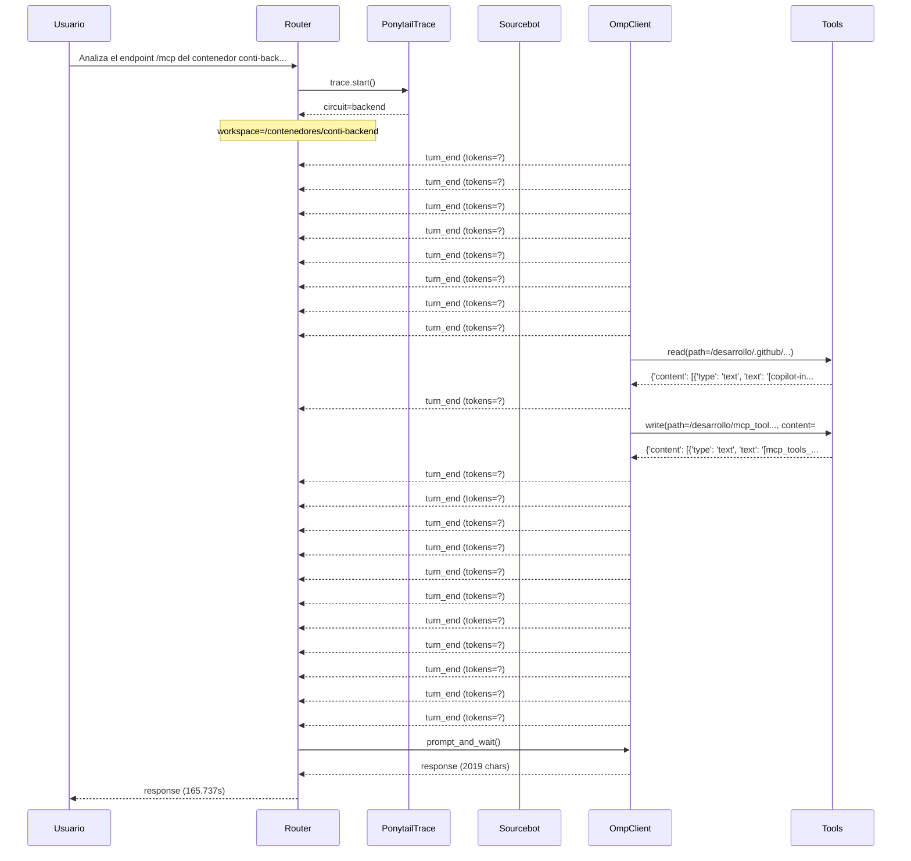

# Traza: Analiza el endpoint /mcp del contenedor conti-backend y documenta todas las tools en un documento mcp_tools_doc.md

- **Circuito**: `backend`
- **Workspace**: `/contenedores/conti-backend`
- **Inicio**: 2026-07-03T12:05:24.829627-03:00
- **Fin**: 2026-07-03T12:08:10.569723-03:00
- **Duración**: 165.74s
- **Eventos**: 33

## Diagrama de Secuencia



## Eventos Detallados

### 1. `start` (2026-07-03T12:05:24.829700-03:00)

```json
{
  "task": "Analiza el endpoint /mcp del contenedor conti-backend y documenta todas las tools en un documento mcp_tools_doc.md",
  "payload_keys": [
    "messages",
    "circuit",
    "_circuit",
    "_session"
  ],
  "circuit": "backend",
  "traces_dir": "/app/logs/ponytail"
}
```

### 2. `circuit_selected` (2026-07-03T12:05:24.831715-03:00)

```json
{
  "id": "backend",
  "workspace": "/contenedores/conti-backend",
  "session_id": "0b1e76cffd70",
  "is_new_session": true
}
```

### 3. `governance_tool` (2026-07-03T12:05:24.833112-03:00)

```json
{
  "tool": "get_onboarding",
  "chars": 195
}
```

### 4. `governance_tool` (2026-07-03T12:05:24.834835-03:00)

```json
{
  "tool": "get_rules",
  "chars": 438
}
```

### 5. `governance_tool` (2026-07-03T12:05:24.836828-03:00)

```json
{
  "tool": "get_config",
  "chars": 3246
}
```

### 6. `governance_injected` (2026-07-03T12:05:24.836851-03:00)

```json
{
  "onboarding_len": 3939,
  "is_new_session": true
}
```

### 7. `omp_turn_end` (2026-07-03T12:05:29.066981-03:00)

```json
{
  "event_type": "turn_end",
  "model": "?",
  "provider": "?"
}
```

### 8. `omp_turn_end` (2026-07-03T12:05:30.272057-03:00)

```json
{
  "event_type": "turn_end",
  "model": "?",
  "provider": "?"
}
```

### 9. `omp_turn_end` (2026-07-03T12:05:31.690902-03:00)

```json
{
  "event_type": "turn_end",
  "model": "?",
  "provider": "?"
}
```

### 10. `omp_turn_end` (2026-07-03T12:05:33.937339-03:00)

```json
{
  "event_type": "turn_end",
  "model": "?",
  "provider": "?"
}
```

### 11. `omp_turn_end` (2026-07-03T12:05:38.005686-03:00)

```json
{
  "event_type": "turn_end",
  "model": "?",
  "provider": "?"
}
```

### 12. `omp_turn_end` (2026-07-03T12:05:45.345402-03:00)

```json
{
  "event_type": "turn_end",
  "model": "?",
  "provider": "?"
}
```

### 13. `omp_turn_end` (2026-07-03T12:05:52.893739-03:00)

```json
{
  "event_type": "turn_end",
  "model": "?",
  "provider": "?"
}
```

### 14. `omp_turn_end` (2026-07-03T12:05:59.799042-03:00)

```json
{
  "event_type": "turn_end",
  "model": "?",
  "provider": "?"
}
```

### 15. `omp_tool_start` (2026-07-03T12:06:11.959280-03:00)

```json
{
  "tool": "read",
  "args": {
    "path": "/desarrollo/.github/copilot-instructions.md"
  },
  "result": null,
  "error": null,
  "ok": true
}
```

### 16. `omp_tool_end` (2026-07-03T12:06:11.981557-03:00)

```json
{
  "tool": "read",
  "args": {
    "path": "/desarrollo/.github/copilot-instructions.md"
  },
  "result": {
    "content": [
      {
        "type": "text",
        "text": "[copilot-instructions.md#588A]\n1:# Copilot instructions – contamela-stack\n2:\n3:Responder siempre en **español**.\n4:\n5:This repo (`/compose`) is the full Docker stack for **Contamela**: an AI‑driven\n6:automated‑sales system around Odoo. It is an infrastructure monorepo, not a single\n7:app: Odoo (ERP/CRM), a Django REST gateway + Celery, n8n (workflow engine),\n8:PostgreSQL+pgvector, Redis, WhatsApp connectors (WppConnect / Evolution API),\n9:Chatwoot, Mixpost, Ollama and Cloudflare tunnel. See\n10:`ARQUITECTURA_CONTENEDORES_COMPLETA.md` for the full service map and data flows.\n11:\n12:## Working conventions (read first)\n13:\n14:- **Do everything through Docker and bind‑mounted folders. Never install\n15:  dependencies on the host.** Run commands inside containers\n16:  (`docker exec ...`, `docker compose ...`).\n17:- The repo root contains many scratch artifacts (logs, `*.json` dumps, analysis\n18:  `.md`, one‑off Python scripts). Most are git‑ignored. Don't treat root‑level\n19:  loose files as part of the application; the real code lives in the service\n20:  subdirectories below.\n21:\n22:## Service layout\n23:\n24:- `addons/` – Odoo **18/19** custom + OCA addons (mounted at `/mnt/extra-addons`).\n25:- `addons18/` – separate Odoo 18 addon set (has its own `CONTRIBUTING.md`, OCA‑style).\n26:- `addons15/` – Odoo 15 website/theme modules (`droggol_theme_common`, `theme_prime`).\n27:- `docker-odoo/` – Odoo image build context; per‑version Dockerfiles\n28:  (`18.0.Dockerfile`, `19.0.Dockerfile`, …) and entrypoints.\n29:- `odoo-django-api/django/` – Django REST API + Celery (OCR, Odoo proxy, social tooling).\n30:- `n8n/` – n8n image build + `n8n/workflows/*.json` (the source of truth for flows).\n31:- `wppconnect-server/`, `nanobot/`, `chatui/`, `spinedigest-svc/`, `scraping_ocrl/` – auxiliary services.\n32:\n33:## Compose files\n34:\n35:There is **no committed root `docker-compose.yml`**. The tracked production compose is\n36:**`producion.yml`** (sic); on the prod server it is copied/symlinked to\n37:`docker-compose.yml`. The many `docker-compose*.yml*` variants at root are historical\n38:backups — don't edit them blindly; confirm which file is active first. Service config\n39:is parameterised via `.env` (git‑ignored). Key prod containers: `odoo18`, `n8n`,\n40:`django-api`, `redis_odoo`, `db`.\n41:\n42:## Dev → Prod workflow (the 3 numbered scripts)\n43:\n44:The release pipeline is driven by the root scripts; follow it instead of pushing manually:\n45:\n46:- **Branches:** develop = environment for dev, `main` = production.\n47:- `1-salvar.sh` – on **develop**: diffs modified n8n workflows out of the dev DB\n48:  (`db_dev`, n8n DB on port `5532`, container `n8n_dev`), writes them to\n49:  `n8n/workflows/*.json`, commits and pushes to `develop`.\n50:- `2-promover.sh` – promotes `develop` → `main` (re‑export, selective `docker compose build`\n51:  of odoo18/django/n8n on infra changes, merge to `main`, push). Has a guard that aborts on\n52:  mass deletions under `addons/`.\n53:- `3-despliegue.sh` – on the prod host: `git reset --hard origin/main`, then imports only the\n54:  changed `n8n/workflows/*.json` into the running `n8n` container.\n55:\n56:n8n flows are managed as exported JSON, **not** edited as files by hand.\n57:\n58:## n8n workflow JSON is git‑tracked despite `.gitignore`\n59:\n60:`.gitignore` ignores `*.json`, `*.sql`, `*.png/jpg/pdf`, `.env*`, `*credentials*.json`,\n61:data dirs, etc. **Explicit exceptions** re‑include `n8n/workflows/**/.json`,\n62:`n8n/workflows/*.json`, `package.json` and `mcp.json`. When adding workflow JSON, keep it\n63:under `n8n/workflows/` or it will be ignored. Never commit secrets, `.env`, dumps, or media.\n64:\n65:## Odoo addon conventions\n66:\n67:When creating/reviewing Odoo modules:\n68:- Keep `__manifest__.py` complete: every view/security/data file referenced; bump the module\n69:  version when models/views/data change; declare only the deps actually used.\n70:- Odoo 18+: list views use `<list>` (not `<tree>`); prefer direct `invisible=\"...\"` /\n71:  `readonly=\"...\"` over `attrs`/`states`. Use `xpath`/`inherit_id` instead of redefining `arch`.\n72:- Models: keep `@api.depends` on computes; call `super()` when overriding ORM methods; prefer\n73:  `mapped`/`filtered` over searches inside loops. Give new models minimal `ir.model.access.csv`\n74:  rights and review `ir.rule` for `write`/`unlink`.\n75:- Module version must target the right Odoo release (`addons/` = 18/19, `addons18/` = 18,\n76:  `addons15/` = 15). See `Documentacion/odoo/copilot-instructions.md` for the full review checklist.\n77:\n78:## Common container commands\n79:\n80:```bash\n81:docker compose -f producion.yml ps\n82:docker compose -f producion.yml logs -f odoo18        # or n8n / django-api\n83:docker compose -f producion.yml build odoo18          # rebuild a single service\n84:docker exec -it odoo18 odoo shell -d <db>             # Odoo shell\n85:docker exec -it django-api python manage.py <cmd>      # Django mgmt / single test\n86:docker exec -it db pg_dump -U odoo postgres > backup.sql\n87:```\n88:There is no host‑level test/lint runner; validate Django and Odoo code by running their\n89:commands inside the respective containers.\n90:"
      }
    ],
    "details": {
      "displayContent": {
        "text": "# Copilot instructions – contamela-stack\n\nResponder siempre en **español**.\n\nThis repo (`/compose`) is the full Docker stack for **Contamela**: an AI‑driven\nautomated‑sales system around Odoo. It is an infrastructure monorepo, not a single\napp: Odoo (ERP/CRM), a Django REST gateway + Celery, n8n (workflow engine),\nPostgreSQL+pgvector, Redis, WhatsApp connectors (WppConnect / Evolution API),\nChatwoot, Mixpost, Ollama and Cloudflare tunnel. See\n`ARQUITECTURA_CONTENEDORES_COMPLETA.md` for the full service map and data flows.\n\n## Working conventions (read first)\n\n- **Do everything through Docker and bind‑mounted folders. Never install\n  dependencies on the host.** Run commands inside containers\n  (`docker exec ...`, `docker compose ...`).\n- The repo root contains many scratch artifacts (logs, `*.json` dumps, analysis\n  `.md`, one‑off Python scripts). Most are git‑ignored. Don't treat root‑level\n  loose files as part of the application; the real code lives in the service\n  subdirectories below.\n\n## Service layout\n\n- `addons/` – Odoo **18/19** custom + OCA addons (mounted at `/mnt/extra-addons`).\n- `addons18/` – separate Odoo 18 addon set (has its own `CONTRIBUTING.md`, OCA‑style).\n- `addons15/` – Odoo 15 website/theme modules (`droggol_theme_common`, `theme_prime`).\n- `docker-odoo/` – Odoo image build context; per‑version Dockerfiles\n  (`18.0.Dockerfile`, `19.0.Dockerfile`, …) and entrypoints.\n- `odoo-django-api/django/` – Django REST API + Celery (OCR, Odoo proxy, social tooling).\n- `n8n/` – n8n image build + `n8n/workflows/*.json` (the source of truth for flows).\n- `wppconnect-server/`, `nanobot/`, `chatui/`, `spinedigest-svc/`, `scraping_ocrl/` – auxiliary services.\n\n## Compose files\n\nThere is **no committed root `docker-compose.yml`**. The tracked production compose is\n**`producion.yml`** (sic); on the prod server it is copied/symlinked to\n`docker-compose.yml`. The many `docker-compose*.yml*` variants at root are historical\nbackups — don't edit them blindly; confirm which file is active first. Service config\nis parameterised via `.env` (git‑ignored). Key prod containers: `odoo18`, `n8n`,\n`django-api`, `redis_odoo`, `db`.\n\n## Dev → Prod workflow (the 3 numbered scripts)\n\nThe release pipeline is driven by the root scripts; follow it instead of pushing manually:\n\n- **Branches:** develop = environment for dev, `main` = production.\n- `1-salvar.sh` – on **develop**: diffs modified n8n workflows out of the dev DB\n  (`db_dev`, n8n DB on port `5532`, container `n8n_dev`), writes them to\n  `n8n/workflows/*.json`, commits and pushes to `develop`.\n- `2-promover.sh` – promotes `develop` → `main` (re‑export, selective `docker compose build`\n  of odoo18/django/n8n on infra changes, merge to `main`, push). Has a guard that aborts on\n  mass deletions under `addons/`.\n- `3-despliegue.sh` – on the prod host: `git reset --hard origin/main`, then imports only the\n  changed `n8n/workflows/*.json` into the running `n8n` container.\n\nn8n flows are managed as exported JSON, **not** edited as files by hand.\n\n## n8n workflow JSON is git‑tracked despite `.gitignore`\n\n`.gitignore` ignores `*.json`, `*.sql`, `*.png/jpg/pdf`, `.env*`, `*credentials*.json`,\ndata dirs, etc. **Explicit exceptions** re‑include `n8n/workflows/**/.json`,\n`n8n/workflows/*.json`, `package.json` and `mcp.json`. When adding workflow JSON, keep it\nunder `n8n/workflows/` or it will be ignored. Never commit secrets, `.env`, dumps, or media.\n\n## Odoo addon conventions\n\nWhen creating/reviewing Odoo modules:\n- Keep `__manifest__.py` complete: every view/security/data file referenced; bump the module\n  version when models/views/data change; declare only the deps actually used.\n- Odoo 18+: list views use `<list>` (not `<tree>`); prefer direct `invisible=\"...\"` /\n  `readonly=\"...\"` over `attrs`/`states`. Use `xpath`/`inherit_id` instead of redefining `arch`.\n- Models: keep `@api.depends` on computes; call `super()` when overriding ORM methods; prefer\n  `mapped`/`filtered` over searches inside loops. Give new models minimal `ir.model.access.csv`\n  rights and review `ir.rule` for `write`/`unlink`.\n- Module version must target the right Odoo release (`addons/` = 18/19, `addons18/` = 18,\n  `addons15/` = 15). See `Documentacion/odoo/copilot-instructions.md` for the full review checklist.\n\n## Common container commands\n\n```bash\ndocker compose -f producion.yml ps\ndocker compose -f producion.yml logs -f odoo18        # or n8n / django-api\ndocker compose -f producion.yml build odoo18          # rebuild a single service\ndocker exec -it odoo18 odoo shell -d <db>             # Odoo shell\ndocker exec -it django-api python manage.py <cmd>      # Django mgmt / single test\ndocker exec -it db pg_dump -U odoo postgres > backup.sql\n```\nThere is no host‑level test/lint runner; validate Django and Odoo code by running their\ncommands inside the respective containers.\n",
        "startLine": 1,
        "lineNumbers": [
          1,
          2,
          3,
          4,
          5,
          6,
          7,
          8,
          9,
          10,
          11,
          12,
          13,
          14,
          15,
          16,
          17,
          18,
          19,
          20,
          21,
          22,
          23,
          24,
          25,
          26,
          27,
          28,
          29,
          30,
          31,
          32,
          33,
          34,
          35,
          36,
          37,
          38,
          39,
          40,
          41,
          42,
          43,
          44,
          45,
          46,
          47,
          48,
          49,
          50,
          51,
          52,
          53,
          54,
          55,
          56,
          57,
          58,
          59,
          60,
          61,
          62,
          63,
          64,
          65,
          66,
          67,
          68,
          69,
          70,
          71,
          72,
          73,
          74,
          75,
          76,
          77,
          78,
          79,
          80,
          81,
          82,
          83,
          84,
          85,
          86,
          87,
          88,
          89,
          90
        ]
      },
      "meta": {
        "source": {
          "type": "path",
          "value": "/desarrollo/.github/copilot-instructions.md"
        }
      }
    }
  },
  "error": null,
  "ok": true
}
```

### 17. `omp_turn_end` (2026-07-03T12:06:12.013833-03:00)

```json
{
  "event_type": "turn_end",
  "model": "?",
  "provider": "?"
}
```

### 18. `omp_tool_start` (2026-07-03T12:07:16.471545-03:00)

```json
{
  "tool": "write",
  "args": {
    "path": "/desarrollo/mcp_tools_doc.md",
    "content": "# Documentación de Herramientas MCP - Conti Backend\n\n**Versión:** 1.0  \n**Fecha:** 2026-07-03  \n**Circuito:** backend (/contenedores/conti-backend)  \n**Endpoint:** `/mcp`  \n**Repositorio:** conti-backend (rama main)  \n\n---\n\n## 📋 Tabla de Contenidos\n\n1. [Introducción](#introducción)\n2. [Categorías de Herramientas](#categorías-de-herramientas)\n   - [Herramientas Nativas OpenHands](#herramientas-nativas-openhands)\n   - [Herramientas MCP Bootstrap](#herramientas-mcp-bootstrap)\n   - [Herramientas MCP Stack](#herramientas-mcp-stack)\n   - [Herramientas MCP RAG](#herramientas-mcp-rag)\n   - [Herramientas MCP GitOps](#herramientas-mcp-gitops)\n   - [Herramientas MCP Filesystem](#herramientas-mcp-filesystem)\n   - [Herramientas MCP Odoo](#herramientas-mcp-odoo)\n   - [Herramientas MCP Documents](#herramientas-mcp-documents)\n   - [Herramientas MCP Sheets](#herramientas-mcp-sheets)\n   - [Herramientas MCP Sourcebot](#herramientas-mcp-sourcebot)\n   - [Herramientas MCP Católico](#herramientas-mcp-católico)\n3. [Configuración del Servidor](#configuración-del-servidor)\n4. [Reglas de Uso](#reglas-de-uso)\n5. [Ejemplos de Uso](#ejemplos-de-uso)\n6. [Apéndices](#apéndices)\n\n---\n\n## 📖 Introducción\n\nEl endpoint `/mcp` del contenedor **conti-backend** expone un conjunto de herramientas MCP (Model Context Protocol) que permiten interactuar con el stack Contamela de manera programática y segura. Estas herramientas están organizadas en categorías según su funcionalidad y se acceden a través de un backend FastAPI/MCP.\n\nEl sistema opera en 4 circuitos independientes:\n- **desarrollo**: `/desarrollo` (rama develop)\n- **produccion**: `/compose` (rama main)\n- **backend**: `/contenedores/conti-backend` (rama main)\n- **libre**: `/tmp/free-agent` (solo lectura)\n\n> ⚠️ **IMPORTANTE**: Todas las operaciones de git (commit/push/merge) deben realizarse mediante las herramientas dedicadas (`run_salvar`, `run_promover`) y nunca directamente.\n\n---\n\n## 🔧 Categorías de Herramientas\n\n### Herramientas Nativas OpenHands\n\nEstas herramientas están disponibles según el circuito en el que se encuentre el agente:\n\n| Nombre de la Tool | Descripción | Parámetros Principales | Ejemplo de Uso |\n|-------------------|-------------|------------------------|----------------|\n| `file_editor` | Editor de archivos para lectura/escritura | `path`, `content`, `operation` | Editar un archivo de configuración |\n| `terminal` | Ejecución de comandos en terminal | `command`, `cwd` | Ejecutar un script de despliegue |\n| `read_file` | Lectura de archivos | `path` | Leer el contenido de un archivo |\n| `write_file` | Escritura de archivos | `path`, `content` | Crear un nuevo archivo de configuración |\n| `glob` | Búsqueda de archivos con patrones | `paths`, `gitignore` | Encontrar todos los archivos `.py` en un directorio |\n| `grep` | Búsqueda de texto en archivos | `pattern`, `paths` | Buscar una función específica en el código |\n| `list_directory` | Listado de directorios | `path` | Listar el contenido de una carpeta |\n| `edit` | Edición estructurada de archivos | `file_path`, `operations` | Modificar una función en un archivo Python |\n| `planning_file_editor` | Editor de archivos de planificación | `path`, `content` | Editar un archivo de tareas |\n\n---\n\n### Herramientas MCP Bootstrap\n\nHerramientas básicas para obtener información del sistema y configuración:\n\n| Nombre de la Tool | Descripción | Parámetros | Ejemplo de Uso |\n|-------------------|-------------|------------|----------------|\n| `get_onboarding` | Obtiene el onboarding del backend | `brief: boolean` | Obtener instrucciones rápidas |\n| `get_rules` | Obtiene las reglas del backend | - | Verificar reglas de operación |\n| `get_config` | Obtiene la configuración efectiva del backend | - | Consultar configuración actual |\n| `health_check` | Verifica el estado del backend | - | Comprobar si el servicio está operativo |\n\n**Ejemplo de respuesta (get_config):**\n```json\n{\n  \"server\": {\n    \"host\": \"0.0.0.0\",\n    \"port\": 9001,\n    \"reload\": false\n  },\n  \"llm_emulation\": {\n    \"enabled\": true,\n    \"default_model\": \"conti-default\"\n  },\n  \"paths\": {\n    \"home_root\": \"/home/nanobot\",\n    \"development_repo\": \"/desarrollo\",\n    \"production_repo\": \"/compose\"\n  }\n}\n```\n\n---\n\n### Herramientas MCP Stack\n\nHerramientas para monitoreo y gestión de contenedores y estado del VPS:\n\n| Nombre de la Tool | Descripción | Parámetros | Ejemplo de Uso |\n|-------------------|-------------|------------|----------------|\n| `get_container_health` | Resume estado y salud de contenedores Docker | `env`, `container` | Verificar salud de todos los contenedores en modo `all` |\n| `get_container_logs` | Lee logs de un contenedor Docker | `container`, `lines`, `since`, `level` | Obtener últimos 100 logs de error de `odoo18` |\n| `get_vps_status` | Vista consolidada del estado Docker y repo Git | `env`, `repo_path` | Verificar estado del VPS en modo `prod` |\n\n**Parámetros comunes:**\n- `env`: `local`, `dev`, `prod`, `all`\n- `container`: nombre del contenedor (ej: `odoo18`, `n8n`, `django-api`)\n- `lines`: número de líneas a obtener\n- `since`: filtro por tiempo (ej: `1h`, `2026-07-03T10:00:00Z`)\n- `level`: `all`, `error`, `warning`\n\n---\n\n### Herramientas MCP RAG (Retrieval-Augmented Generation)\n\nHerramientas para búsqueda y procesamiento de documentos con inteligencia artificial:\n\n#### Búsqueda y Consulta\n\n| Nombre de la Tool | Descripción | Parámetros | Ejemplo de Uso |\n|-------------------|-------------|------------|----------------|\n| `search_rag` | Búsqueda completa en RAG con respuesta generada por LLM | `query`, `store`, `mode`, `top_k`, `threshold`, `max_tokens` | Buscar información sobre \"facturación electrónica\" en la colección `default` |\n| `search_rag_quick` | Búsqueda rápida por keyword sin respuesta LLM | `query`, `store`, `top_k` | Verificar si existe un documento sobre \"mercado pago\" |\n| `search_rag_semantic` | Búsqueda semántica en RAG | `query`, `store`, `top_k`, `threshold`, `max_tokens` | Buscar conceptos sobre \"pagos en línea\" |\n\n**Parámetros comunes:**\n- `query`: texto de búsqueda\n- `store`: colección destino (default: `default` o `config.rag.default_store`)\n- `mode`: `hybrid` (recomendado), `semantic`, `keyword`\n- `top_k`: número de resultados (default: 5)\n- `threshold`: umbral de similitud [0-1]\n- `max_tokens`: máximo de tokens para la respuesta LLM\n\n**Ejemplo de respuesta (search_rag):**\n```json\n{\n  \"answer\": \"...respuesta generada por LLM...\",\n  \"sources\": [\n    {\n      \"title\": \"Documento 1\",\n      \"uri\": \"local://default/documento1.md\",\n      \"score\": 0.95\n    }\n  ],\n  \"search_confidence\": 0.92,\n  \"low_confidence\": false\n}\n```\n\n#### Ingestión de Documentos\n\n| Nombre de la Tool | Descripción | Parámetros | Ejemplo de Uso |\n|-------------------|-------------|------------|----------------|\n| `start_rag_ingest` | Ingestión de un documento en RAG Flamehaven | `source`, `store`, `original_name`, `overwrite` | Ingerir un PDF de facturación |\n| `get_rag_ingest_job` | Consulta estado de un job de ingestión RAG | `job_id` | Verificar progreso de ingestión |\n| `list_rag_ingest_jobs` | Lista jobs recientes de ingestión RAG | `limit` | Listar últimos 10 jobs |\n\n**Parámetros para start_rag_ingest:**\n- `source`: URL o ruta local al documento (PDF, DOCX, etc.)\n- `store`: colección destino (default: `config.rag.default_store`)\n- `original_name`: nombre descriptivo para identificar el documento\n- `overwrite`: si `true`, reemplaza documentos existentes con el mismo nombre\n\n#### Gestión de Documentos\n\n| Nombre de la Tool | Descripción | Parámetros | Ejemplo de Uso |\n|-------------------|-------------|------------|----------------|\n| `list_rag_store_docs` | Lista todos los documentos indexados en un store | `store` | Listar todos los documentos en la colección `default` |\n\n---\n\n### Herramientas MCP GitOps\n\nHerramientas para operaciones de git y gestión de ramas:\n\n| Nombre de la Tool | Descripción | Parámetros | Ejemplo de Uso |\n|-------------------|-------------|------------|----------------|\n| `get_git_status` | Devuelve el estado Git local del repo | `repo_path` | Verificar cambios pendientes en `/desarrollo` |\n| `get_git_log` | Devuelve el historial reciente del repo Git | `repo_path`, `n` | Obtener últimos 10 commits en `/compose` |\n| `diff_with_develop` | Compara HEAD local contra develop remoto | `repo_path`, `remote`, `develop_branch` | Ver diferencias entre ramas |\n| `get_pipeline_summary` | Resume el pipeline Git local | `repo_path`, `remote`, `develop_branch` | Ver estado de la rama actual |\n| `run_salvar` | Hace preview o ejecuta commit+push local | `i`, `confirm`, `summary`, `repo_path`, `remote`, `develop_branch`, `main_branch`, `force_branch` | Commitear cambios en `/desarrollo` a develop |\n| `run_promover` | Hace preview o ejecuta merge develop→main con push | `i`, `confirm`, `summary`, `repo_path`, `remote`, `develop_branch`, `main_branch` | Promover cambios de develop a main |\n| `run_hotfix_sync` | Sincroniza hotfix main→develop | `i`, `confirm`, `summary`, `repo_path`, `remote`, `develop_branch`, `main_branch`, `compose_repo_path`, `desarrollo_repo_path` | Sincronizar hotfix entre ramas |\n\n**Importante sobre run_salvar y run_promover:**\n- Ambos tienen modo `preview` por defecto (no commitean ni hacen push)\n- Requiere `confirm=true` para ejecutar la acción real\n- `force_branch` permite sobrescribir la rama destino (ej: `main` para hotfix)\n\n**Ejemplo de uso:**\n```bash\n# Preview de commit en develop\nrun_salvar(i=\"commit cambios n8n\", repo_path=\"/desarrollo\", confirm=false)\n\n# Commit real\nrun_salvar(i=\"commit cambios n8n\", repo_path=\"/desarrollo\", confirm=true, summary=\"Actualizar workflows de facturación\")\n```\n\n---\n\n### Herramientas MCP Filesystem\n\nHerramientas para operaciones en el sistema de archivos:\n\n| Nombre de la Tool | Descripción | Parámetros | Ejemplo de Uso |\n|-------------------|-------------|------------|----------------|\n| `list_files` | Lista archivos y directorios | `path` | Listar contenido de `/desarrollo/n8n/workflows` |\n| `read_file` | Lee un archivo | `path`, `start_line`, `end_line` | Leer `/desarrollo/README.md` |\n| `search_code_literal` | Busca texto literal en el repo | `query` | Buscar \"odoo_create_order\" en el código |\n| `grep_workspace` | Busca coincidencias en el workspace | `query` | Buscar \"def create_client\" en todos los archivos |\n\n---\n\n### Herramientas MCP Odoo\n\nConjunto de 21 herramientas para interactuar con el ERP Odoo:\n\n#### Gestión de Conexión\n\n| Nombre de la Tool | Descripción | Parámetros | Ejemplo de Uso |\n|-------------------|-------------|------------|----------------|\n| `odoo_test_connection` | Prueba la conexión contra Odoo | `i`, `connection`, `db`, `url`, `username`, `password` | Validar conexión al perfil `prod` |\n\n#### Gestión de Productos\n\n| Nombre de la Tool | Descripción | Parámetros | Ejemplo de Uso |\n|-------------------|-------------|------------|----------------|\n| `odoo_list_products` | Lista productos de Odoo | `i`, `connection`, `db`, `search`, `category_ids`, `has_stock`, `include_stock`, `price_min`, `price_max`, `limit`, `offset` | Listar productos con stock de la categoría 10 |\n| `odoo_get_product_detail` | Obtiene detalle completo de un producto | `i`, `connection`, `db`, `product_id` | Obtener detalles del producto con ID 42 |\n\n#### Gestión de Clientes\n\n| Nombre de la Tool | Descripción | Parámetros | Ejemplo de Uso |\n|-------------------|-------------|------------|----------------|\n| `odoo_search_clients` | Busca clientes por CUIT/DNI o nombre | `i`, `connection`, `db`, `cuit_dni`, `name`, `limit`, `offset` | Buscar cliente con CUIT 20-12345678-9 |\n| `odoo_list_clients` | Lista clientes con filtros | `i`, `connection`, `db`, `cuit_dni`, `name`, `limit`, `offset` | Listar todos los clientes |\n| `odoo_create_client` | Crea un cliente en Odoo | `i`, `connection`, `db`, `name`, `cuit_dni`, `email`, `phone` | Crear cliente \"Juan Pérez\" con CUIT 20-98765432-1 |\n\n#### Gestión de Carritos y Pedidos\n\n| Nombre de la Tool | Descripción | Parámetros | Ejemplo de Uso |\n|-------------------|-------------|------------|----------------|\n| `odoo_create_cart` | Crea un carrito/pedido draft asociado a un cliente | `i`, `connection`, `db`, `cuit_dni` | Crear carrito para cliente con CUIT 20-12345678-9 |\n| `odoo_add_item_to_cart` | Agrega un producto a un carrito | `i`, `connection`, `db`, `order_id`, `product_id`, `quantity` | Agregar 2 unidades del producto 42 al carrito 100 |\n| `odoo_get_cart_summary` | Devuelve resumen de un carrito | `i`, `connection`, `db`, `order_id`, `cuit_dni` | Obtener resumen del carrito 100 |\n| `odoo_confirm_cart` | Confirma un pedido draft | `i`, `connection`, `db`, `order_id` | Confirmar carrito 100 |\n| `odoo_cancel_cart` | Cancela un pedido | `i`, `connection`, `db`, `order_id` | Cancelar carrito 100 |\n\n#### Facturación y Pagos\n\n| Nombre de la Tool | Descripción | Parámetros | Ejemplo de Uso |\n|-------------------|-------------|------------|----------------|\n| `odoo_create_invoice` | Crea y publica una factura desde un pedido | `i`, `connection`, `db`, `order_id`, `cuit_dni` | Crear factura para pedido 100 |\n| `odoo_register_payment` | Registra un pago sobre una factura | `i`, `connection`, `db`, `order_id`, `payment_id`, `amount`, `payment_method` | Registrar pago de $1000 con método \"transferencia\" |\n| `odoo_upload_payment_proof` | Adjunta comprobante PDF a un pedido | `i`, `connection`, `db`, `order_id`, `cuit_dni`, `filename`, `file_path`, `file_base64`, `run_ocr` | Subir comprobante de pago.pdf |\n| `odoo_get_invoice_status` | Consulta estado de facturación de un pedido | `i`, `connection`, `db`, `order_id`, `cuit_dni` | Verificar estado de facturación del pedido 100 |\n\n#### Menú de Restaurante\n\n| Nombre de la Tool | Descripción | Parámetros | Ejemplo de Uso |\n|-------------------|-------------|------------|----------------|\n| `odoo_get_restaurant_menu` | Devuelve la carta del restaurante como URL de descarga | `i`, `tenant`, `include_pdf_base64`, `force_refresh` | Obtener menú del restaurante \"resto\" |\n\n#### Integración con MercadoPago\n\n| Nombre de la Tool | Descripción | Parámetros | Ejemplo de Uso |\n|-------------------|-------------|------------|----------------|\n| `odoo_create_mercadopago_preference` | Crea preferencia de pago de MercadoPago | `i`, `connection`, `db`, `order_id`, `cuit_dni` | Crear preferencia para pedido 100 |\n\n#### Contexto de IA\n\n| Nombre de la Tool | Descripción | Parámetros | Ejemplo de Uso |\n|-------------------|-------------|------------|----------------|\n| `odoo_get_ai_context` | Devuelve contexto comercial y de cliente desde Odoo | `i`, `connection`, `db`, `cuit_dni` | Obtener contexto para cliente con CUIT 20-12345678-9 |\n\n**Configuración de conexiones Odoo:**\n```json\n{\n  \"prod\": {\n    \"url\": \"http://odoo18:8069\",\n    \"db\": \"demo\",\n    \"host_header\": \"demo.contamela.com\",\n    \"username_env\": \"ODOO_USERNAME\",\n    \"password_env\": \"ODOO_PASSWORD\"\n  },\n  \"dev\": {\n    \"url\": \"http://odoo18_dev:8069\",\n    \"db\": \"demo\"\n  },\n  \"resto\": {\n    \"url\": \"http://odoo18:8069\",\n    \"db\": \"resto\",\n    \"host_header\": \"resto.contamela.com\"\n  }\n}\n```\n\n---\n\n### Herramientas MCP Documents\n\nHerramientas para conversión y traducción de documentos:\n\n| Nombre de la Tool | Descripción | Parámetros | Ejemplo de Uso |\n|-------------------|-------------|------------|----------------|\n| `start_markdown_translation` | Inicia traducción de Markdown en background | `input_path`, `output_path`, `source_lang`, `target_lang`, `chunk_size`, `retries`, `overwrite` | Traducir README.md de español a inglés |\n| `get_translation_job` | Consulta estado de un job de traducción | `job_id` | Verificar progreso de traducción |\n| `list_translation_jobs` | Lista jobs recientes de traducción | `limit` | Listar últimos 5 jobs |\n| `start_pdf_to_markdown` | Convierte PDF a Markdown | `source`, `store`, `output_path`, `also_translate`, `target_lang` | Convertir factura.pdf a Markdown |\n| `get_md_conversion_job` | Consulta estado de conversión PDF→Markdown | `job_id` | Verificar progreso de conversión |\n| `list_md_conversion_jobs` | Lista jobs recientes de conversión | `limit` | Listar últimos 3 jobs |\n\n---\n\n### Herramientas MCP Sheets (OCRL)\n\nHerramientas para integración con planillas de Google (OCRL):\n\n| Nombre de la Tool | Descripción | Parámetros | Ejemplo de Uso |\n|-------------------|-------------|------------|----------------|\n| `sheet_account_goes_to_sheet` | Indica si un código de cuenta OCRL debe resolverse en la planilla | `i`, `account_code` | Verificar si cuenta CL1234 debe ir a planilla |\n| `sheet_lookup_partner` | Busca cliente OCRL en planilla por código de cuenta, CUIT o identidad | `i`, `account_code`, `cuit`, `channel`, `token` | Buscar cliente con código CL1234 |\n| `sheet_register_partner` | Registra cliente OCRL en planilla | `i`, `account_code`, `cuit`, `channel`, `token`, `name`, `telegram_username`, `price_adjustment` | Registrar nuevo cliente con cuenta CL5678 |\n\n**Configuración de OCRL Sheet:**\n```json\n{\n  \"sheet_id\": \"1x3I9EvplbIk4q-To0BBjdUdKJyoOYUWzVgo_MwC2z7k\",\n  \"gid\": 0,\n  \"account_sheet_prefix\": \"CL\",\n  \"credentials_env\": \"OCRL_SHEET_CREDENTIALS_JSON\"\n}\n```\n\n---\n\n### Herramientas MCP Sourcebot\n\nHerramientas para búsqueda de código en los repositorios:\n\n| Nombre de la Tool | Descripción | Parámetros | Ejemplo de Uso |\n|-------------------|-------------|------------|----------------|\n| `sourcebot_search` | Busca código en los 3 repos bind-mounted | `i`, `query`, `limit`, `repos` | Buscar \"odoo_create_order\" en todos los repos |\n| `sourcebot_list_repos` | Lista repositorios indexados por Sourcebot | `i` | Verificar repositorios disponibles |\n| `sourcebot_get_doc` | Obtiene contenido completo de un archivo indexado | `i`, `path` | Leer contenido de `/desarrollo/odoo-django-api/django/views.py` |\n\n**Endpoint:** `http://conti-sourcebot:3000/api/search`  \n**Método:** POST con `{\"query\": \"keywords\", \"matches\": N}`\n\n**Repositorios indexados:**\n- `/desarrollo`\n- `/compose`\n- `/contenedores/conti-backend`\n\n---\n\n### Herramientas MCP Católico\n\nHerramientas para acceso a recursos católicos:\n\n| Nombre de la Tool | Descripción | Parámetros | Ejemplo de Uso |\n|-------------------|-------------|------------|----------------|\n| `catolico_lecturas_dia` | Obtiene las lecturas del día para la liturgia católica | `i`, `fecha` | Obtener lecturas para hoy |\n| `catolico_biblia_buscar` | Busca citas bíblicas por palabras clave | `i`, `modo`, `libro`, `capitulo`, `versiculo_inicio`, `versiculo_fin`, `texto` | Buscar versículo sobre \"amor\" en Mateo |\n| `catolico_listar_titulos` | Lista documentos disponibles en el store católico | `i`, `store` | Listar todos los documentos católicos |\n| `catolico_leer_documento` | Lee contenido completo de un documento católico | `i`, `uri`, `query`, `store` | Leer documento sobre \"Cuaresma\" |\n| `catolico_resumir_documento` | Genera resumen estructurado de un documento | `i`, `query`, `store`, `prompt` | Resumir documento \"Documento sobre Adviento\" |\n\n**Store católico:** `catolico` (default)\n\n---\n\n## ⚙️ Configuración del Servidor\n\n### Configuración Principal (get_config)\n\n```json\n{\n  \"server\": {\n    \"host\": \"0.0.0.0\",\n    \"port\": 9001,\n    \"reload\": false\n  },\n  \"llm_emulation\": {\n    \"enabled\": true,\n    \"default_model\": \"conti-default\",\n    \"streaming_enabled\": true,\n    \"mode\": \"nanobot_serve\",\n    \"serve_profile\": \"conti-llm-serve\",\n    \"serve_base_url\": \"http://127.0.0.1:8765\"\n  },\n  \"providers\": {\n    \"active\": \"openai_compatible\",\n    \"openai_compatible\": {\n      \"api_base\": \"${OPENAI_BASE_URL}\",\n      \"api_key_env\": \"***REDACTED***\"\n    }\n  },\n  \"paths\": {\n    \"home_root\": \"/home/nanobot\",\n    \"development_repo\": \"/desarrollo\",\n    \"production_repo\": \"/compose\",\n    \"onboarding_file\": \"/app/docs/onboarding.md\",\n    \"onboarding_brief_file\": \"/app/docs/onboarding_brief.md\",\n    \"rules_file\": \"/app/docs/rules.md\"\n  },\n  \"ui\": {\n    \"enabled\": true,\n    \"title\": \"Conti MCP Console\"\n  },\n  \"rag\": {\n    \"base_url\": \"http://flamehaven:8000\",\n    \"api_key_env\": \"***REDACTED***\",\n    \"default_store\": \"default\"\n  },\n  \"odoo\": { ... },\n  \"mercadopago\": { ... },\n  \"ocrl_sheet\": { ... }\n}\n```\n\n### Configuración de Odoo\n\n```json\n{\n  \"default_connection\": \"prod\",\n  \"default_lang\": \"es_AR\",\n  \"default_tz\": \"America/Argentina/Buenos_Aires\",\n  \"connect_timeout_seconds\": 30,\n  \"max_retries\": 3,\n  \"ocr_enabled\": true,\n  \"payment_proof_max_mb\": 1,\n  \"connections\": {\n    \"prod\": { ... },\n    \"dev\": { ... },\n    \"resto\": { ... }\n  }\n}\n```\n\n### Configuración de MercadoPago\n\n```json\n{\n  \"access_token_env\": \"***REDACTED***\",\n  \"public_key_env\": \"***REDACTED***\",\n  \"sandbox_env\": \"MERCADOPAGO_SANDBOX\",\n  \"api_base_url\": \"https://api.mercadopago.com\",\n  \"success_url\": \"http://localhost:9001/odoo/mercadopago/success\",\n  \"failure_url\": \"http://localhost:9001/odoo/mercadopago/failure\",\n  \"pending_url\": \"http://localhost:9001/odoo/mercadopago/pending\",\n  \"notification_url\": \"http://localhost:9001/odoo/mercadopago/webhook\",\n  \"request_timeout_seconds\": 30\n}\n```\n\n---\n\n## 📜 Reglas de Uso\n\n### Reglas Generales\n\n1. **🚫 Prohibido ejecutar git directamente**\n   - Usar solo `run_salvar` para commit+push\n   - Usar solo `run_promover` para merge develop→main\n   - Usar solo `run_hotfix_sync` para sincronizar hotfixes\n\n2. **🔒 Permisos y Alcance**\n   - Operar DENTRO del contenedor, sin SSH\n   - `/compose` es RW solo para git, cambios de código van por el flujo develop→main\n   - Si la tarea accede a algo FUERA de `/desarrollo`, `/compose`, `/contenedores/conti-backend`, `/home/nanobot`: pedir credenciales explícitamente a Luis Dalmasso\n\n3. **🌐 Circuitos**\n   - **desarrollo**: `/desarrollo`, rama develop - preview de commits\n   - **produccion**: `/compose`, rama main - merge develop→main\n   - **backend**: `/contenedores/conti-backend`, rama main - commits directos\n   - **libre**: `/tmp/free-agent` - solo lectura, fuentes externas\n\n4. **📝 Idioma**\n   - Siempre responder en **Español**\n   - Mensajes claros y directos, sin relleno\n\n5. **🔧 Validación**\n   - Validar argumentos antes de ejecutar mutaciones\n   - Respetar allowlists de paths y visibilidades\n   - No hardcodear prompts ni reglas en routers\n\n### Reglas Específicas por Categoría\n\n#### GitOps\n- `run_salvar` y `run_promover` tienen modo preview por defecto\n- Requiere `confirm=true` para ejecutar la acción real\n- `force_branch` permite sobrescribir la rama destino\n\n#### Odoo\n- Todas las operaciones requieren parámetro `i` (intención)\n- Operaciones de pago requieren `cuit_dni` para validación\n- `odoo_create_cart` busca cliente por CUIT/DNI y crea carrito\n\n#### RAG\n- `search_rag` es la herramienta recomendada (modo `hybrid`)\n- `start_rag_ingest` acepta URLs o rutas locales\n- `overwrite=false` (default) rechaza documentos duplicados\n\n#### Sourcebot\n- Búsqueda híbrida (BM25+semántica) funciona mejor con queries cortas (1-3 keywords)\n- `sourcebot_get_doc` requiere path absoluto\n\n---\n\n## 💡 Ejemplos de Uso\n\n### Ejemplo 1: Verificar estado del stack\n\n```bash\n# Verificar salud de todos los contenedores\nget_container_health(i=\"verificar estado de contenedores\", env=\"all\")\n\n# Verificar estado del VPS\nget_vps_status(i=\"verificar estado del VPS\", env=\"prod\")\n\n# Obtener configuración del backend\nget_config(i=\"obtener configuración del backend\")\n```\n\n### Ejemplo 2: Buscar información en RAG\n\n```bash\n# Búsqueda rápida (sin respuesta LLM)\nsearch_rag_quick(i=\"buscar información sobre facturación\", query=\"facturación electrónica\", store=\"default\")\n\n# Búsqueda completa con respuesta generada\nsearch_rag(\n  i=\"buscar procedimiento de facturación\",\n  query=\"cómo facturar un pedido en Odoo\",\n  mode=\"hybrid\",\n  top_k=5,\n  threshold=0.7\n)\n\n# Listar documentos disponibles en un store\nlist_rag_store_docs(i=\"listar documentos en store default\", store=\"default\")\n```\n\n### Ejemplo 3: Operaciones con Odoo\n\n```bash\n# Probar conexión a Odoo\nodoo_test_connection(i=\"probar conexión a Odoo\", connection=\"prod\")\n\n# Buscar cliente por CUIT\nodoo_search_clients(\n  i=\"buscar cliente por CUIT\",\n  connection=\"prod\",\n  db=\"demo\",\n  cuit_dni=\"20-12345678-9\"\n)\n\n# Crear un cliente\nodoo_create_client(\n  i=\"crear nuevo cliente\",\n  connection=\"prod\",\n  db=\"demo\",\n  name=\"Empresa ABC SRL\",\n  cuit_dni=\"30-98765432-1\",\n  email=\"contacto@abc.com\",\n  phone=\"+54114567890\"\n)\n\n# Crear carrito y agregar producto\nodoo_create_cart(\n  i=\"crear carrito para cliente\",\n  connection=\"prod\",\n  db=\"demo\",\n  cuit_dni=\"30-98765432-1\"\n)\n\n# Confirmar carrito (simplificado)\nodoo_confirm_cart(i=\"confirmar carrito\", connection=\"prod\", db=\"demo\", order_id=100)\n```\n\n### Ejemplo 4: Operaciones con Git\n\n```bash\n# Verificar estado de git en desarrollo\nget_git_status(i=\"verificar cambios en desarrollo\", repo_path=\"/desarrollo\")\n\n# Preview de commit en develop\nrun_salvar(\n  i=\"commit cambios n8n workflows\",\n  repo_path=\"/desarrollo\",\n  confirm=false,\n  summary=\"Actualizar workflows de facturación y cobranza\"\n)\n\n# Commit real (requiere confirmación)\nrun_salvar(\n  i=\"commit cambios n8n workflows\",\n  repo_path=\"/desarrollo\",\n  confirm=true,\n  summary=\"Actualizar workflows de facturación y cobranza\"\n)\n\n# Promover cambios a main\nrun_promover(\n  i=\"promover cambios a main\",\n  repo_path=\"/compose\",\n  confirm=true,\n  summary=\"Promoción de cambios de develop a main\"\n)\n```\n\n### Ejemplo 5: Búsqueda de código con Sourcebot\n\n```bash\n# Buscar función específica en todos los repos\nsourcebot_search(\n  i=\"buscar función odoo_create_order\",\n  query=\"odoo_create_order\",\n  limit=10\n)\n\n# Buscar uso de una variable\nsourcebot_search(\n  i=\"buscar uso de variable CART_STATE_CONFIRMED\",\n  query=\"CART_STATE_CONFIRMED\",\n  repos=[\"desarrollo\", \"compose\"]\n)\n\n# Listar repositorios disponibles\nsourcebot_list_repos(i=\"listar repositorios indexados\")\n\n# Obtener contenido de un archivo específico\nsourcebot_get_doc(\n  i=\"leer archivo de configuración\",\n  path=\"/desarrollo/odoo-django-api/django/settings.py\"\n)\n```\n\n### Ejemplo 6: Gestión de Documentos\n\n```bash\n# Convertir PDF a Markdown\nstart_pdf_to_markdown(\n  i=\"convertir factura a markdown\",\n  source=\"/compose/documentos_nuevos/facturas/factura_001.pdf\",\n  store=\"facturas\",\n  also_translate=true,\n  target_lang=\"es\"\n)\n\n# Verificar estado de conversión\nget_md_conversion_job(i=\"verificar estado de conversión\", job_id=\"job_12345\")\n\n# Traducir documento Markdown\nstart_markdown_translation(\n  i=\"traducir README a inglés\",\n  input_path=\"/desarrollo/README.md\",\n  output_path=\"/desarrollo/README.en.md\",\n  source_lang=\"es\",\n  target_lang=\"en\",\n  overwrite=true\n)\n```\n\n### Ejemplo 7: Integración con Planillas (OCRL)\n\n```bash\n# Verificar si cuenta debe ir a planilla\nsheet_account_goes_to_sheet(i=\"verificar cuenta CL1234\", account_code=\"CL1234\")\n\n# Buscar cliente en planilla\nsheet_lookup_partner(\n  i=\"buscar cliente en planilla\",\n  account_code=\"CL5678\",\n  cuit=\"20-12345678-9\"\n)\n\n# Registrar nuevo cliente en planilla\nsheet_register_partner(\n  i=\"registrar nuevo cliente\",\n  account_code=\"CL9012\",\n  cuit=\"20-98765432-1\",\n  channel=\"wa\",\n  token=\"549112345678\",\n  name=\"Cliente Prueba\",\n  price_adjustment=0.10\n)\n```\n\n---\n\n## 📚 Apéndices\n\n### A. Glosario de Términos\n\n| Término | Descripción |\n|---------|-------------|\n| **MCP** | Model Context Protocol - Protocolo para integración de modelos de lenguaje con herramientas |\n| **RAG** | Retrieval-Augmented Generation - Generación aumentada por recuperación de documentos |\n| **OCRL** | Sistema de gestión de clientes y cuentas |\n| **n8n** | Motor de workflows para automatización |\n| **Odoo** | ERP/CRM utilizado como núcleo del stack |\n| **Sourcebot** | Motor de búsqueda de código para los repositorios |\n| **Flamehaven** | Servicio de RAG que almacena y indexa documentos |\n| **Circuito** | Contexto de operación (desarrollo, produccion, backend, libre) |\n| **Preview** | Modo de simulación que muestra qué haría la acción sin ejecutarla |\n\n### B. Convenciones de Nombres\n\n- **Conexiones Odoo**: `prod`, `dev`, `resto`\n- **Stores RAG**: `default`, `catolico`, `facturas`, `documentos`\n- **Circuitos**: `desarrollo`, `produccion`, `backend`, `libre`\n- **Entornos Docker**: `local`, `dev`, `prod`, `all`\n\n### C. Buenas Prácticas\n\n1. **Siempre usar preview** antes de ejecutar acciones destructivas o de git\n2. **Validar parámetros** antes de enviar solicitudes\n3. **Manejar errores** adecuadamente en scripts automatizados\n4. **Documentar cambios** con summaries claros y descriptivos\n5. **Usar circuitos apropiados** según la operación (ej: backend para cambios en el orquestador)\n6. **Verificar permisos** antes de operar en `/compose`\n7. **Pedir credenciales explícitas** cuando se necesite acceso externo\n\n### D. Referencias Rápidas\n\n#### Comandos Docker Comunes\n```bash\ndocker compose -f producion.yml ps                          # Listar contenedores\n\ndocker compose -f producion.yml logs -f odoo18              # Ver logs en tiempo real\n\ndocker compose -f producion.yml build odoo18                # Reconstruir imagen\n\ndocker exec -it odoo18 odoo shell -d demo                  # Shell de Odoo\n\ndocker exec -it django-api python manage.py test            # Ejecutar tests Django\n```\n\n#### Variables de Entorno Importantes\n```bash\n# Odoo\nODOO_USERNAME, ODOO_PASSWORD\nODOO_DEV_USERNAME, ODOO_DEV_PASSWORD\n\n# RAG\nFLAMEHAVEN_API_KEY\n\n# MercadoPago\nMERCADOPAGO_ACCESS_TOKEN, MERCADOPAGO_PUBLIC_KEY\n\n# OCRL Sheet\nOCRL_SHEET_CREDENTIALS_JSON\n```\n\n### E. Flujo de Trabajo Recomendado\n\n```\n1. Analizar tarea\n2. Determinar circuito apropiado\n3. Verificar estado actual (get_container_health, get_git_status)\n4. Realizar cambios en el código\n5. Preview de operaciones (run_salvar/run_promover con confirm=false)\n6. Ejecutar acciones reales (confirm=true)\n7. Verificar resultados\n8. Documentar cambios\n```\n\n---\n\n## 📧 Soporte y Contacto\n\nPara soporte o consultas sobre las herramientas MCP:\n- Contactar a **Luis Dalmasso** para credenciales o permisos especiales\n- Revisar la documentación en `/app/docs/` dentro del contenedor\n- Consultar el onboarding con `get_onboarding(brief=true)`\n\n---\n\n**© 2026 Contamela.com - Stack Contamela**  \n*Documentación generada automáticamente por Conti - Agente DevOps*"
  },
  "result": null,
  "error": null,
  "ok": true
}
```

### 19. `omp_tool_end` (2026-07-03T12:07:16.481873-03:00)

```json
{
  "tool": "write",
  "args": {
    "path": "/desarrollo/mcp_tools_doc.md",
    "content": "# Documentación de Herramientas MCP - Conti Backend\n\n**Versión:** 1.0  \n**Fecha:** 2026-07-03  \n**Circuito:** backend (/contenedores/conti-backend)  \n**Endpoint:** `/mcp`  \n**Repositorio:** conti-backend (rama main)  \n\n---\n\n## 📋 Tabla de Contenidos\n\n1. [Introducción](#introducción)\n2. [Categorías de Herramientas](#categorías-de-herramientas)\n   - [Herramientas Nativas OpenHands](#herramientas-nativas-openhands)\n   - [Herramientas MCP Bootstrap](#herramientas-mcp-bootstrap)\n   - [Herramientas MCP Stack](#herramientas-mcp-stack)\n   - [Herramientas MCP RAG](#herramientas-mcp-rag)\n   - [Herramientas MCP GitOps](#herramientas-mcp-gitops)\n   - [Herramientas MCP Filesystem](#herramientas-mcp-filesystem)\n   - [Herramientas MCP Odoo](#herramientas-mcp-odoo)\n   - [Herramientas MCP Documents](#herramientas-mcp-documents)\n   - [Herramientas MCP Sheets](#herramientas-mcp-sheets)\n   - [Herramientas MCP Sourcebot](#herramientas-mcp-sourcebot)\n   - [Herramientas MCP Católico](#herramientas-mcp-católico)\n3. [Configuración del Servidor](#configuración-del-servidor)\n4. [Reglas de Uso](#reglas-de-uso)\n5. [Ejemplos de Uso](#ejemplos-de-uso)\n6. [Apéndices](#apéndices)\n\n---\n\n## 📖 Introducción\n\nEl endpoint `/mcp` del contenedor **conti-backend** expone un conjunto de herramientas MCP (Model Context Protocol) que permiten interactuar con el stack Contamela de manera programática y segura. Estas herramientas están organizadas en categorías según su funcionalidad y se acceden a través de un backend FastAPI/MCP.\n\nEl sistema opera en 4 circuitos independientes:\n- **desarrollo**: `/desarrollo` (rama develop)\n- **produccion**: `/compose` (rama main)\n- **backend**: `/contenedores/conti-backend` (rama main)\n- **libre**: `/tmp/free-agent` (solo lectura)\n\n> ⚠️ **IMPORTANTE**: Todas las operaciones de git (commit/push/merge) deben realizarse mediante las herramientas dedicadas (`run_salvar`, `run_promover`) y nunca directamente.\n\n---\n\n## 🔧 Categorías de Herramientas\n\n### Herramientas Nativas OpenHands\n\nEstas herramientas están disponibles según el circuito en el que se encuentre el agente:\n\n| Nombre de la Tool | Descripción | Parámetros Principales | Ejemplo de Uso |\n|-------------------|-------------|------------------------|----------------|\n| `file_editor` | Editor de archivos para lectura/escritura | `path`, `content`, `operation` | Editar un archivo de configuración |\n| `terminal` | Ejecución de comandos en terminal | `command`, `cwd` | Ejecutar un script de despliegue |\n| `read_file` | Lectura de archivos | `path` | Leer el contenido de un archivo |\n| `write_file` | Escritura de archivos | `path`, `content` | Crear un nuevo archivo de configuración |\n| `glob` | Búsqueda de archivos con patrones | `paths`, `gitignore` | Encontrar todos los archivos `.py` en un directorio |\n| `grep` | Búsqueda de texto en archivos | `pattern`, `paths` | Buscar una función específica en el código |\n| `list_directory` | Listado de directorios | `path` | Listar el contenido de una carpeta |\n| `edit` | Edición estructurada de archivos | `file_path`, `operations` | Modificar una función en un archivo Python |\n| `planning_file_editor` | Editor de archivos de planificación | `path`, `content` | Editar un archivo de tareas |\n\n---\n\n### Herramientas MCP Bootstrap\n\nHerramientas básicas para obtener información del sistema y configuración:\n\n| Nombre de la Tool | Descripción | Parámetros | Ejemplo de Uso |\n|-------------------|-------------|------------|----------------|\n| `get_onboarding` | Obtiene el onboarding del backend | `brief: boolean` | Obtener instrucciones rápidas |\n| `get_rules` | Obtiene las reglas del backend | - | Verificar reglas de operación |\n| `get_config` | Obtiene la configuración efectiva del backend | - | Consultar configuración actual |\n| `health_check` | Verifica el estado del backend | - | Comprobar si el servicio está operativo |\n\n**Ejemplo de respuesta (get_config):**\n```json\n{\n  \"server\": {\n    \"host\": \"0.0.0.0\",\n    \"port\": 9001,\n    \"reload\": false\n  },\n  \"llm_emulation\": {\n    \"enabled\": true,\n    \"default_model\": \"conti-default\"\n  },\n  \"paths\": {\n    \"home_root\": \"/home/nanobot\",\n    \"development_repo\": \"/desarrollo\",\n    \"production_repo\": \"/compose\"\n  }\n}\n```\n\n---\n\n### Herramientas MCP Stack\n\nHerramientas para monitoreo y gestión de contenedores y estado del VPS:\n\n| Nombre de la Tool | Descripción | Parámetros | Ejemplo de Uso |\n|-------------------|-------------|------------|----------------|\n| `get_container_health` | Resume estado y salud de contenedores Docker | `env`, `container` | Verificar salud de todos los contenedores en modo `all` |\n| `get_container_logs` | Lee logs de un contenedor Docker | `container`, `lines`, `since`, `level` | Obtener últimos 100 logs de error de `odoo18` |\n| `get_vps_status` | Vista consolidada del estado Docker y repo Git | `env`, `repo_path` | Verificar estado del VPS en modo `prod` |\n\n**Parámetros comunes:**\n- `env`: `local`, `dev`, `prod`, `all`\n- `container`: nombre del contenedor (ej: `odoo18`, `n8n`, `django-api`)\n- `lines`: número de líneas a obtener\n- `since`: filtro por tiempo (ej: `1h`, `2026-07-03T10:00:00Z`)\n- `level`: `all`, `error`, `warning`\n\n---\n\n### Herramientas MCP RAG (Retrieval-Augmented Generation)\n\nHerramientas para búsqueda y procesamiento de documentos con inteligencia artificial:\n\n#### Búsqueda y Consulta\n\n| Nombre de la Tool | Descripción | Parámetros | Ejemplo de Uso |\n|-------------------|-------------|------------|----------------|\n| `search_rag` | Búsqueda completa en RAG con respuesta generada por LLM | `query`, `store`, `mode`, `top_k`, `threshold`, `max_tokens` | Buscar información sobre \"facturación electrónica\" en la colección `default` |\n| `search_rag_quick` | Búsqueda rápida por keyword sin respuesta LLM | `query`, `store`, `top_k` | Verificar si existe un documento sobre \"mercado pago\" |\n| `search_rag_semantic` | Búsqueda semántica en RAG | `query`, `store`, `top_k`, `threshold`, `max_tokens` | Buscar conceptos sobre \"pagos en línea\" |\n\n**Parámetros comunes:**\n- `query`: texto de búsqueda\n- `store`: colección destino (default: `default` o `config.rag.default_store`)\n- `mode`: `hybrid` (recomendado), `semantic`, `keyword`\n- `top_k`: número de resultados (default: 5)\n- `threshold`: umbral de similitud [0-1]\n- `max_tokens`: máximo de tokens para la respuesta LLM\n\n**Ejemplo de respuesta (search_rag):**\n```json\n{\n  \"answer\": \"...respuesta generada por LLM...\",\n  \"sources\": [\n    {\n      \"title\": \"Documento 1\",\n      \"uri\": \"local://default/documento1.md\",\n      \"score\": 0.95\n    }\n  ],\n  \"search_confidence\": 0.92,\n  \"low_confidence\": false\n}\n```\n\n#### Ingestión de Documentos\n\n| Nombre de la Tool | Descripción | Parámetros | Ejemplo de Uso |\n|-------------------|-------------|------------|----------------|\n| `start_rag_ingest` | Ingestión de un documento en RAG Flamehaven | `source`, `store`, `original_name`, `overwrite` | Ingerir un PDF de facturación |\n| `get_rag_ingest_job` | Consulta estado de un job de ingestión RAG | `job_id` | Verificar progreso de ingestión |\n| `list_rag_ingest_jobs` | Lista jobs recientes de ingestión RAG | `limit` | Listar últimos 10 jobs |\n\n**Parámetros para start_rag_ingest:**\n- `source`: URL o ruta local al documento (PDF, DOCX, etc.)\n- `store`: colección destino (default: `config.rag.default_store`)\n- `original_name`: nombre descriptivo para identificar el documento\n- `overwrite`: si `true`, reemplaza documentos existentes con el mismo nombre\n\n#### Gestión de Documentos\n\n| Nombre de la Tool | Descripción | Parámetros | Ejemplo de Uso |\n|-------------------|-------------|------------|----------------|\n| `list_rag_store_docs` | Lista todos los documentos indexados en un store | `store` | Listar todos los documentos en la colección `default` |\n\n---\n\n### Herramientas MCP GitOps\n\nHerramientas para operaciones de git y gestión de ramas:\n\n| Nombre de la Tool | Descripción | Parámetros | Ejemplo de Uso |\n|-------------------|-------------|------------|----------------|\n| `get_git_status` | Devuelve el estado Git local del repo | `repo_path` | Verificar cambios pendientes en `/desarrollo` |\n| `get_git_log` | Devuelve el historial reciente del repo Git | `repo_path`, `n` | Obtener últimos 10 commits en `/compose` |\n| `diff_with_develop` | Compara HEAD local contra develop remoto | `repo_path`, `remote`, `develop_branch` | Ver diferencias entre ramas |\n| `get_pipeline_summary` | Resume el pipeline Git local | `repo_path`, `remote`, `develop_branch` | Ver estado de la rama actual |\n| `run_salvar` | Hace preview o ejecuta commit+push local | `i`, `confirm`, `summary`, `repo_path`, `remote`, `develop_branch`, `main_branch`, `force_branch` | Commitear cambios en `/desarrollo` a develop |\n| `run_promover` | Hace preview o ejecuta merge develop→main con push | `i`, `confirm`, `summary`, `repo_path`, `remote`, `develop_branch`, `main_branch` | Promover cambios de develop a main |\n| `run_hotfix_sync` | Sincroniza hotfix main→develop | `i`, `confirm`, `summary`, `repo_path`, `remote`, `develop_branch`, `main_branch`, `compose_repo_path`, `desarrollo_repo_path` | Sincronizar hotfix entre ramas |\n\n**Importante sobre run_salvar y run_promover:**\n- Ambos tienen modo `preview` por defecto (no commitean ni hacen push)\n- Requiere `confirm=true` para ejecutar la acción real\n- `force_branch` permite sobrescribir la rama destino (ej: `main` para hotfix)\n\n**Ejemplo de uso:**\n```bash\n# Preview de commit en develop\nrun_salvar(i=\"commit cambios n8n\", repo_path=\"/desarrollo\", confirm=false)\n\n# Commit real\nrun_salvar(i=\"commit cambios n8n\", repo_path=\"/desarrollo\", confirm=true, summary=\"Actualizar workflows de facturación\")\n```\n\n---\n\n### Herramientas MCP Filesystem\n\nHerramientas para operaciones en el sistema de archivos:\n\n| Nombre de la Tool | Descripción | Parámetros | Ejemplo de Uso |\n|-------------------|-------------|------------|----------------|\n| `list_files` | Lista archivos y directorios | `path` | Listar contenido de `/desarrollo/n8n/workflows` |\n| `read_file` | Lee un archivo | `path`, `start_line`, `end_line` | Leer `/desarrollo/README.md` |\n| `search_code_literal` | Busca texto literal en el repo | `query` | Buscar \"odoo_create_order\" en el código |\n| `grep_workspace` | Busca coincidencias en el workspace | `query` | Buscar \"def create_client\" en todos los archivos |\n\n---\n\n### Herramientas MCP Odoo\n\nConjunto de 21 herramientas para interactuar con el ERP Odoo:\n\n#### Gestión de Conexión\n\n| Nombre de la Tool | Descripción | Parámetros | Ejemplo de Uso |\n|-------------------|-------------|------------|----------------|\n| `odoo_test_connection` | Prueba la conexión contra Odoo | `i`, `connection`, `db`, `url`, `username`, `password` | Validar conexión al perfil `prod` |\n\n#### Gestión de Productos\n\n| Nombre de la Tool | Descripción | Parámetros | Ejemplo de Uso |\n|-------------------|-------------|------------|----------------|\n| `odoo_list_products` | Lista productos de Odoo | `i`, `connection`, `db`, `search`, `category_ids`, `has_stock`, `include_stock`, `price_min`, `price_max`, `limit`, `offset` | Listar productos con stock de la categoría 10 |\n| `odoo_get_product_detail` | Obtiene detalle completo de un producto | `i`, `connection`, `db`, `product_id` | Obtener detalles del producto con ID 42 |\n\n#### Gestión de Clientes\n\n| Nombre de la Tool | Descripción | Parámetros | Ejemplo de Uso |\n|-------------------|-------------|------------|----------------|\n| `odoo_search_clients` | Busca clientes por CUIT/DNI o nombre | `i`, `connection`, `db`, `cuit_dni`, `name`, `limit`, `offset` | Buscar cliente con CUIT 20-12345678-9 |\n| `odoo_list_clients` | Lista clientes con filtros | `i`, `connection`, `db`, `cuit_dni`, `name`, `limit`, `offset` | Listar todos los clientes |\n| `odoo_create_client` | Crea un cliente en Odoo | `i`, `connection`, `db`, `name`, `cuit_dni`, `email`, `phone` | Crear cliente \"Juan Pérez\" con CUIT 20-98765432-1 |\n\n#### Gestión de Carritos y Pedidos\n\n| Nombre de la Tool | Descripción | Parámetros | Ejemplo de Uso |\n|-------------------|-------------|------------|----------------|\n| `odoo_create_cart` | Crea un carrito/pedido draft asociado a un cliente | `i`, `connection`, `db`, `cuit_dni` | Crear carrito para cliente con CUIT 20-12345678-9 |\n| `odoo_add_item_to_cart` | Agrega un producto a un carrito | `i`, `connection`, `db`, `order_id`, `product_id`, `quantity` | Agregar 2 unidades del producto 42 al carrito 100 |\n| `odoo_get_cart_summary` | Devuelve resumen de un carrito | `i`, `connection`, `db`, `order_id`, `cuit_dni` | Obtener resumen del carrito 100 |\n| `odoo_confirm_cart` | Confirma un pedido draft | `i`, `connection`, `db`, `order_id` | Confirmar carrito 100 |\n| `odoo_cancel_cart` | Cancela un pedido | `i`, `connection`, `db`, `order_id` | Cancelar carrito 100 |\n\n#### Facturación y Pagos\n\n| Nombre de la Tool | Descripción | Parámetros | Ejemplo de Uso |\n|-------------------|-------------|------------|----------------|\n| `odoo_create_invoice` | Crea y publica una factura desde un pedido | `i`, `connection`, `db`, `order_id`, `cuit_dni` | Crear factura para pedido 100 |\n| `odoo_register_payment` | Registra un pago sobre una factura | `i`, `connection`, `db`, `order_id`, `payment_id`, `amount`, `payment_method` | Registrar pago de $1000 con método \"transferencia\" |\n| `odoo_upload_payment_proof` | Adjunta comprobante PDF a un pedido | `i`, `connection`, `db`, `order_id`, `cuit_dni`, `filename`, `file_path`, `file_base64`, `run_ocr` | Subir comprobante de pago.pdf |\n| `odoo_get_invoice_status` | Consulta estado de facturación de un pedido | `i`, `connection`, `db`, `order_id`, `cuit_dni` | Verificar estado de facturación del pedido 100 |\n\n#### Menú de Restaurante\n\n| Nombre de la Tool | Descripción | Parámetros | Ejemplo de Uso |\n|-------------------|-------------|------------|----------------|\n| `odoo_get_restaurant_menu` | Devuelve la carta del restaurante como URL de descarga | `i`, `tenant`, `include_pdf_base64`, `force_refresh` | Obtener menú del restaurante \"resto\" |\n\n#### Integración con MercadoPago\n\n| Nombre de la Tool | Descripción | Parámetros | Ejemplo de Uso |\n|-------------------|-------------|------------|----------------|\n| `odoo_create_mercadopago_preference` | Crea preferencia de pago de MercadoPago | `i`, `connection`, `db`, `order_id`, `cuit_dni` | Crear preferencia para pedido 100 |\n\n#### Contexto de IA\n\n| Nombre de la Tool | Descripción | Parámetros | Ejemplo de Uso |\n|-------------------|-------------|------------|----------------|\n| `odoo_get_ai_context` | Devuelve contexto comercial y de cliente desde Odoo | `i`, `connection`, `db`, `cuit_dni` | Obtener contexto para cliente con CUIT 20-12345678-9 |\n\n**Configuración de conexiones Odoo:**\n```json\n{\n  \"prod\": {\n    \"url\": \"http://odoo18:8069\",\n    \"db\": \"demo\",\n    \"host_header\": \"demo.contamela.com\",\n    \"username_env\": \"ODOO_USERNAME\",\n    \"password_env\": \"ODOO_PASSWORD\"\n  },\n  \"dev\": {\n    \"url\": \"http://odoo18_dev:8069\",\n    \"db\": \"demo\"\n  },\n  \"resto\": {\n    \"url\": \"http://odoo18:8069\",\n    \"db\": \"resto\",\n    \"host_header\": \"resto.contamela.com\"\n  }\n}\n```\n\n---\n\n### Herramientas MCP Documents\n\nHerramientas para conversión y traducción de documentos:\n\n| Nombre de la Tool | Descripción | Parámetros | Ejemplo de Uso |\n|-------------------|-------------|------------|----------------|\n| `start_markdown_translation` | Inicia traducción de Markdown en background | `input_path`, `output_path`, `source_lang`, `target_lang`, `chunk_size`, `retries`, `overwrite` | Traducir README.md de español a inglés |\n| `get_translation_job` | Consulta estado de un job de traducción | `job_id` | Verificar progreso de traducción |\n| `list_translation_jobs` | Lista jobs recientes de traducción | `limit` | Listar últimos 5 jobs |\n| `start_pdf_to_markdown` | Convierte PDF a Markdown | `source`, `store`, `output_path`, `also_translate`, `target_lang` | Convertir factura.pdf a Markdown |\n| `get_md_conversion_job` | Consulta estado de conversión PDF→Markdown | `job_id` | Verificar progreso de conversión |\n| `list_md_conversion_jobs` | Lista jobs recientes de conversión | `limit` | Listar últimos 3 jobs |\n\n---\n\n### Herramientas MCP Sheets (OCRL)\n\nHerramientas para integración con planillas de Google (OCRL):\n\n| Nombre de la Tool | Descripción | Parámetros | Ejemplo de Uso |\n|-------------------|-------------|------------|----------------|\n| `sheet_account_goes_to_sheet` | Indica si un código de cuenta OCRL debe resolverse en la planilla | `i`, `account_code` | Verificar si cuenta CL1234 debe ir a planilla |\n| `sheet_lookup_partner` | Busca cliente OCRL en planilla por código de cuenta, CUIT o identidad | `i`, `account_code`, `cuit`, `channel`, `token` | Buscar cliente con código CL1234 |\n| `sheet_register_partner` | Registra cliente OCRL en planilla | `i`, `account_code`, `cuit`, `channel`, `token`, `name`, `telegram_username`, `price_adjustment` | Registrar nuevo cliente con cuenta CL5678 |\n\n**Configuración de OCRL Sheet:**\n```json\n{\n  \"sheet_id\": \"1x3I9EvplbIk4q-To0BBjdUdKJyoOYUWzVgo_MwC2z7k\",\n  \"gid\": 0,\n  \"account_sheet_prefix\": \"CL\",\n  \"credentials_env\": \"OCRL_SHEET_CREDENTIALS_JSON\"\n}\n```\n\n---\n\n### Herramientas MCP Sourcebot\n\nHerramientas para búsqueda de código en los repositorios:\n\n| Nombre de la Tool | Descripción | Parámetros | Ejemplo de Uso |\n|-------------------|-------------|------------|----------------|\n| `sourcebot_search` | Busca código en los 3 repos bind-mounted | `i`, `query`, `limit`, `repos` | Buscar \"odoo_create_order\" en todos los repos |\n| `sourcebot_list_repos` | Lista repositorios indexados por Sourcebot | `i` | Verificar repositorios disponibles |\n| `sourcebot_get_doc` | Obtiene contenido completo de un archivo indexado | `i`, `path` | Leer contenido de `/desarrollo/odoo-django-api/django/views.py` |\n\n**Endpoint:** `http://conti-sourcebot:3000/api/search`  \n**Método:** POST con `{\"query\": \"keywords\", \"matches\": N}`\n\n**Repositorios indexados:**\n- `/desarrollo`\n- `/compose`\n- `/contenedores/conti-backend`\n\n---\n\n### Herramientas MCP Católico\n\nHerramientas para acceso a recursos católicos:\n\n| Nombre de la Tool | Descripción | Parámetros | Ejemplo de Uso |\n|-------------------|-------------|------------|----------------|\n| `catolico_lecturas_dia` | Obtiene las lecturas del día para la liturgia católica | `i`, `fecha` | Obtener lecturas para hoy |\n| `catolico_biblia_buscar` | Busca citas bíblicas por palabras clave | `i`, `modo`, `libro`, `capitulo`, `versiculo_inicio`, `versiculo_fin`, `texto` | Buscar versículo sobre \"amor\" en Mateo |\n| `catolico_listar_titulos` | Lista documentos disponibles en el store católico | `i`, `store` | Listar todos los documentos católicos |\n| `catolico_leer_documento` | Lee contenido completo de un documento católico | `i`, `uri`, `query`, `store` | Leer documento sobre \"Cuaresma\" |\n| `catolico_resumir_documento` | Genera resumen estructurado de un documento | `i`, `query`, `store`, `prompt` | Resumir documento \"Documento sobre Adviento\" |\n\n**Store católico:** `catolico` (default)\n\n---\n\n## ⚙️ Configuración del Servidor\n\n### Configuración Principal (get_config)\n\n```json\n{\n  \"server\": {\n    \"host\": \"0.0.0.0\",\n    \"port\": 9001,\n    \"reload\": false\n  },\n  \"llm_emulation\": {\n    \"enabled\": true,\n    \"default_model\": \"conti-default\",\n    \"streaming_enabled\": true,\n    \"mode\": \"nanobot_serve\",\n    \"serve_profile\": \"conti-llm-serve\",\n    \"serve_base_url\": \"http://127.0.0.1:8765\"\n  },\n  \"providers\": {\n    \"active\": \"openai_compatible\",\n    \"openai_compatible\": {\n      \"api_base\": \"${OPENAI_BASE_URL}\",\n      \"api_key_env\": \"***REDACTED***\"\n    }\n  },\n  \"paths\": {\n    \"home_root\": \"/home/nanobot\",\n    \"development_repo\": \"/desarrollo\",\n    \"production_repo\": \"/compose\",\n    \"onboarding_file\": \"/app/docs/onboarding.md\",\n    \"onboarding_brief_file\": \"/app/docs/onboarding_brief.md\",\n    \"rules_file\": \"/app/docs/rules.md\"\n  },\n  \"ui\": {\n    \"enabled\": true,\n    \"title\": \"Conti MCP Console\"\n  },\n  \"rag\": {\n    \"base_url\": \"http://flamehaven:8000\",\n    \"api_key_env\": \"***REDACTED***\",\n    \"default_store\": \"default\"\n  },\n  \"odoo\": { ... },\n  \"mercadopago\": { ... },\n  \"ocrl_sheet\": { ... }\n}\n```\n\n### Configuración de Odoo\n\n```json\n{\n  \"default_connection\": \"prod\",\n  \"default_lang\": \"es_AR\",\n  \"default_tz\": \"America/Argentina/Buenos_Aires\",\n  \"connect_timeout_seconds\": 30,\n  \"max_retries\": 3,\n  \"ocr_enabled\": true,\n  \"payment_proof_max_mb\": 1,\n  \"connections\": {\n    \"prod\": { ... },\n    \"dev\": { ... },\n    \"resto\": { ... }\n  }\n}\n```\n\n### Configuración de MercadoPago\n\n```json\n{\n  \"access_token_env\": \"***REDACTED***\",\n  \"public_key_env\": \"***REDACTED***\",\n  \"sandbox_env\": \"MERCADOPAGO_SANDBOX\",\n  \"api_base_url\": \"https://api.mercadopago.com\",\n  \"success_url\": \"http://localhost:9001/odoo/mercadopago/success\",\n  \"failure_url\": \"http://localhost:9001/odoo/mercadopago/failure\",\n  \"pending_url\": \"http://localhost:9001/odoo/mercadopago/pending\",\n  \"notification_url\": \"http://localhost:9001/odoo/mercadopago/webhook\",\n  \"request_timeout_seconds\": 30\n}\n```\n\n---\n\n## 📜 Reglas de Uso\n\n### Reglas Generales\n\n1. **🚫 Prohibido ejecutar git directamente**\n   - Usar solo `run_salvar` para commit+push\n   - Usar solo `run_promover` para merge develop→main\n   - Usar solo `run_hotfix_sync` para sincronizar hotfixes\n\n2. **🔒 Permisos y Alcance**\n   - Operar DENTRO del contenedor, sin SSH\n   - `/compose` es RW solo para git, cambios de código van por el flujo develop→main\n   - Si la tarea accede a algo FUERA de `/desarrollo`, `/compose`, `/contenedores/conti-backend`, `/home/nanobot`: pedir credenciales explícitamente a Luis Dalmasso\n\n3. **🌐 Circuitos**\n   - **desarrollo**: `/desarrollo`, rama develop - preview de commits\n   - **produccion**: `/compose`, rama main - merge develop→main\n   - **backend**: `/contenedores/conti-backend`, rama main - commits directos\n   - **libre**: `/tmp/free-agent` - solo lectura, fuentes externas\n\n4. **📝 Idioma**\n   - Siempre responder en **Español**\n   - Mensajes claros y directos, sin relleno\n\n5. **🔧 Validación**\n   - Validar argumentos antes de ejecutar mutaciones\n   - Respetar allowlists de paths y visibilidades\n   - No hardcodear prompts ni reglas en routers\n\n### Reglas Específicas por Categoría\n\n#### GitOps\n- `run_salvar` y `run_promover` tienen modo preview por defecto\n- Requiere `confirm=true` para ejecutar la acción real\n- `force_branch` permite sobrescribir la rama destino\n\n#### Odoo\n- Todas las operaciones requieren parámetro `i` (intención)\n- Operaciones de pago requieren `cuit_dni` para validación\n- `odoo_create_cart` busca cliente por CUIT/DNI y crea carrito\n\n#### RAG\n- `search_rag` es la herramienta recomendada (modo `hybrid`)\n- `start_rag_ingest` acepta URLs o rutas locales\n- `overwrite=false` (default) rechaza documentos duplicados\n\n#### Sourcebot\n- Búsqueda híbrida (BM25+semántica) funciona mejor con queries cortas (1-3 keywords)\n- `sourcebot_get_doc` requiere path absoluto\n\n---\n\n## 💡 Ejemplos de Uso\n\n### Ejemplo 1: Verificar estado del stack\n\n```bash\n# Verificar salud de todos los contenedores\nget_container_health(i=\"verificar estado de contenedores\", env=\"all\")\n\n# Verificar estado del VPS\nget_vps_status(i=\"verificar estado del VPS\", env=\"prod\")\n\n# Obtener configuración del backend\nget_config(i=\"obtener configuración del backend\")\n```\n\n### Ejemplo 2: Buscar información en RAG\n\n```bash\n# Búsqueda rápida (sin respuesta LLM)\nsearch_rag_quick(i=\"buscar información sobre facturación\", query=\"facturación electrónica\", store=\"default\")\n\n# Búsqueda completa con respuesta generada\nsearch_rag(\n  i=\"buscar procedimiento de facturación\",\n  query=\"cómo facturar un pedido en Odoo\",\n  mode=\"hybrid\",\n  top_k=5,\n  threshold=0.7\n)\n\n# Listar documentos disponibles en un store\nlist_rag_store_docs(i=\"listar documentos en store default\", store=\"default\")\n```\n\n### Ejemplo 3: Operaciones con Odoo\n\n```bash\n# Probar conexión a Odoo\nodoo_test_connection(i=\"probar conexión a Odoo\", connection=\"prod\")\n\n# Buscar cliente por CUIT\nodoo_search_clients(\n  i=\"buscar cliente por CUIT\",\n  connection=\"prod\",\n  db=\"demo\",\n  cuit_dni=\"20-12345678-9\"\n)\n\n# Crear un cliente\nodoo_create_client(\n  i=\"crear nuevo cliente\",\n  connection=\"prod\",\n  db=\"demo\",\n  name=\"Empresa ABC SRL\",\n  cuit_dni=\"30-98765432-1\",\n  email=\"contacto@abc.com\",\n  phone=\"+54114567890\"\n)\n\n# Crear carrito y agregar producto\nodoo_create_cart(\n  i=\"crear carrito para cliente\",\n  connection=\"prod\",\n  db=\"demo\",\n  cuit_dni=\"30-98765432-1\"\n)\n\n# Confirmar carrito (simplificado)\nodoo_confirm_cart(i=\"confirmar carrito\", connection=\"prod\", db=\"demo\", order_id=100)\n```\n\n### Ejemplo 4: Operaciones con Git\n\n```bash\n# Verificar estado de git en desarrollo\nget_git_status(i=\"verificar cambios en desarrollo\", repo_path=\"/desarrollo\")\n\n# Preview de commit en develop\nrun_salvar(\n  i=\"commit cambios n8n workflows\",\n  repo_path=\"/desarrollo\",\n  confirm=false,\n  summary=\"Actualizar workflows de facturación y cobranza\"\n)\n\n# Commit real (requiere confirmación)\nrun_salvar(\n  i=\"commit cambios n8n workflows\",\n  repo_path=\"/desarrollo\",\n  confirm=true,\n  summary=\"Actualizar workflows de facturación y cobranza\"\n)\n\n# Promover cambios a main\nrun_promover(\n  i=\"promover cambios a main\",\n  repo_path=\"/compose\",\n  confirm=true,\n  summary=\"Promoción de cambios de develop a main\"\n)\n```\n\n### Ejemplo 5: Búsqueda de código con Sourcebot\n\n```bash\n# Buscar función específica en todos los repos\nsourcebot_search(\n  i=\"buscar función odoo_create_order\",\n  query=\"odoo_create_order\",\n  limit=10\n)\n\n# Buscar uso de una variable\nsourcebot_search(\n  i=\"buscar uso de variable CART_STATE_CONFIRMED\",\n  query=\"CART_STATE_CONFIRMED\",\n  repos=[\"desarrollo\", \"compose\"]\n)\n\n# Listar repositorios disponibles\nsourcebot_list_repos(i=\"listar repositorios indexados\")\n\n# Obtener contenido de un archivo específico\nsourcebot_get_doc(\n  i=\"leer archivo de configuración\",\n  path=\"/desarrollo/odoo-django-api/django/settings.py\"\n)\n```\n\n### Ejemplo 6: Gestión de Documentos\n\n```bash\n# Convertir PDF a Markdown\nstart_pdf_to_markdown(\n  i=\"convertir factura a markdown\",\n  source=\"/compose/documentos_nuevos/facturas/factura_001.pdf\",\n  store=\"facturas\",\n  also_translate=true,\n  target_lang=\"es\"\n)\n\n# Verificar estado de conversión\nget_md_conversion_job(i=\"verificar estado de conversión\", job_id=\"job_12345\")\n\n# Traducir documento Markdown\nstart_markdown_translation(\n  i=\"traducir README a inglés\",\n  input_path=\"/desarrollo/README.md\",\n  output_path=\"/desarrollo/README.en.md\",\n  source_lang=\"es\",\n  target_lang=\"en\",\n  overwrite=true\n)\n```\n\n### Ejemplo 7: Integración con Planillas (OCRL)\n\n```bash\n# Verificar si cuenta debe ir a planilla\nsheet_account_goes_to_sheet(i=\"verificar cuenta CL1234\", account_code=\"CL1234\")\n\n# Buscar cliente en planilla\nsheet_lookup_partner(\n  i=\"buscar cliente en planilla\",\n  account_code=\"CL5678\",\n  cuit=\"20-12345678-9\"\n)\n\n# Registrar nuevo cliente en planilla\nsheet_register_partner(\n  i=\"registrar nuevo cliente\",\n  account_code=\"CL9012\",\n  cuit=\"20-98765432-1\",\n  channel=\"wa\",\n  token=\"549112345678\",\n  name=\"Cliente Prueba\",\n  price_adjustment=0.10\n)\n```\n\n---\n\n## 📚 Apéndices\n\n### A. Glosario de Términos\n\n| Término | Descripción |\n|---------|-------------|\n| **MCP** | Model Context Protocol - Protocolo para integración de modelos de lenguaje con herramientas |\n| **RAG** | Retrieval-Augmented Generation - Generación aumentada por recuperación de documentos |\n| **OCRL** | Sistema de gestión de clientes y cuentas |\n| **n8n** | Motor de workflows para automatización |\n| **Odoo** | ERP/CRM utilizado como núcleo del stack |\n| **Sourcebot** | Motor de búsqueda de código para los repositorios |\n| **Flamehaven** | Servicio de RAG que almacena y indexa documentos |\n| **Circuito** | Contexto de operación (desarrollo, produccion, backend, libre) |\n| **Preview** | Modo de simulación que muestra qué haría la acción sin ejecutarla |\n\n### B. Convenciones de Nombres\n\n- **Conexiones Odoo**: `prod`, `dev`, `resto`\n- **Stores RAG**: `default`, `catolico`, `facturas`, `documentos`\n- **Circuitos**: `desarrollo`, `produccion`, `backend`, `libre`\n- **Entornos Docker**: `local`, `dev`, `prod`, `all`\n\n### C. Buenas Prácticas\n\n1. **Siempre usar preview** antes de ejecutar acciones destructivas o de git\n2. **Validar parámetros** antes de enviar solicitudes\n3. **Manejar errores** adecuadamente en scripts automatizados\n4. **Documentar cambios** con summaries claros y descriptivos\n5. **Usar circuitos apropiados** según la operación (ej: backend para cambios en el orquestador)\n6. **Verificar permisos** antes de operar en `/compose`\n7. **Pedir credenciales explícitas** cuando se necesite acceso externo\n\n### D. Referencias Rápidas\n\n#### Comandos Docker Comunes\n```bash\ndocker compose -f producion.yml ps                          # Listar contenedores\n\ndocker compose -f producion.yml logs -f odoo18              # Ver logs en tiempo real\n\ndocker compose -f producion.yml build odoo18                # Reconstruir imagen\n\ndocker exec -it odoo18 odoo shell -d demo                  # Shell de Odoo\n\ndocker exec -it django-api python manage.py test            # Ejecutar tests Django\n```\n\n#### Variables de Entorno Importantes\n```bash\n# Odoo\nODOO_USERNAME, ODOO_PASSWORD\nODOO_DEV_USERNAME, ODOO_DEV_PASSWORD\n\n# RAG\nFLAMEHAVEN_API_KEY\n\n# MercadoPago\nMERCADOPAGO_ACCESS_TOKEN, MERCADOPAGO_PUBLIC_KEY\n\n# OCRL Sheet\nOCRL_SHEET_CREDENTIALS_JSON\n```\n\n### E. Flujo de Trabajo Recomendado\n\n```\n1. Analizar tarea\n2. Determinar circuito apropiado\n3. Verificar estado actual (get_container_health, get_git_status)\n4. Realizar cambios en el código\n5. Preview de operaciones (run_salvar/run_promover con confirm=false)\n6. Ejecutar acciones reales (confirm=true)\n7. Verificar resultados\n8. Documentar cambios\n```\n\n---\n\n## 📧 Soporte y Contacto\n\nPara soporte o consultas sobre las herramientas MCP:\n- Contactar a **Luis Dalmasso** para credenciales o permisos especiales\n- Revisar la documentación en `/app/docs/` dentro del contenedor\n- Consultar el onboarding con `get_onboarding(brief=true)`\n\n---\n\n**© 2026 Contamela.com - Stack Contamela**  \n*Documentación generada automáticamente por Conti - Agente DevOps*"
  },
  "result": {
    "content": [
      {
        "type": "text",
        "text": "[mcp_tools_doc.md#559A]\nSuccessfully wrote 30066 bytes to mcp_tools_doc.md"
      }
    ],
    "details": {
      "resolvedPath": "/desarrollo/mcp_tools_doc.md"
    }
  },
  "error": null,
  "ok": true
}
```

### 20. `omp_turn_end` (2026-07-03T12:07:16.483625-03:00)

```json
{
  "event_type": "turn_end",
  "model": "?",
  "provider": "?"
}
```

### 21. `omp_turn_end` (2026-07-03T12:07:17.018827-03:00)

```json
{
  "event_type": "turn_end",
  "model": "?",
  "provider": "?"
}
```

### 22. `omp_turn_end` (2026-07-03T12:07:17.967843-03:00)

```json
{
  "event_type": "turn_end",
  "model": "?",
  "provider": "?"
}
```

### 23. `omp_turn_end` (2026-07-03T12:07:19.240480-03:00)

```json
{
  "event_type": "turn_end",
  "model": "?",
  "provider": "?"
}
```

### 24. `omp_turn_end` (2026-07-03T12:07:21.373079-03:00)

```json
{
  "event_type": "turn_end",
  "model": "?",
  "provider": "?"
}
```

### 25. `omp_turn_end` (2026-07-03T12:07:25.634234-03:00)

```json
{
  "event_type": "turn_end",
  "model": "?",
  "provider": "?"
}
```

### 26. `omp_turn_end` (2026-07-03T12:07:32.922253-03:00)

```json
{
  "event_type": "turn_end",
  "model": "?",
  "provider": "?"
}
```

### 27. `omp_turn_end` (2026-07-03T12:07:40.706430-03:00)

```json
{
  "event_type": "turn_end",
  "model": "?",
  "provider": "?"
}
```

### 28. `omp_turn_end` (2026-07-03T12:07:47.873906-03:00)

```json
{
  "event_type": "turn_end",
  "model": "?",
  "provider": "?"
}
```

### 29. `omp_turn_end` (2026-07-03T12:07:55.997942-03:00)

```json
{
  "event_type": "turn_end",
  "model": "?",
  "provider": "?"
}
```

### 30. `omp_turn_end` (2026-07-03T12:08:10.535195-03:00)

```json
{
  "event_type": "turn_end",
  "model": "?",
  "provider": "?"
}
```

### 31. `omp_usage` (2026-07-03T12:08:10.561642-03:00)

```json
{
  "model": "?",
  "provider": "?",
  "usage": null
}
```

### 32. `openhands_invoke` (2026-07-03T12:08:10.566310-03:00)

```json
{
  "circuit": "backend",
  "len": 2019
}
```

### 33. `end` (2026-07-03T12:08:10.566370-03:00)

```json
{
  "duration_s": 165.737
}
```

## Prompt Completo (input del usuario)

```text
Analiza el endpoint /mcp del contenedor conti-backend y documenta todas las tools en un documento mcp_tools_doc.md
```
