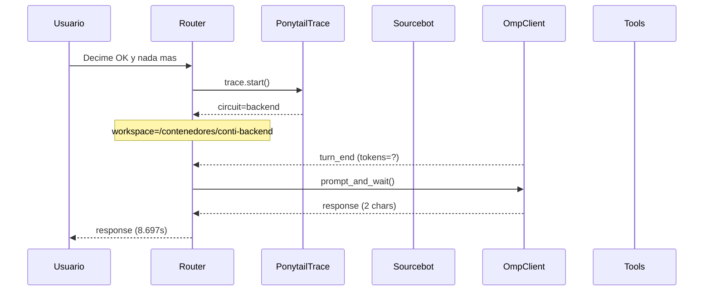

# Traza: Decime OK y nada mas

- **Circuito**: `backend`
- **Workspace**: `/contenedores/conti-backend`
- **Inicio**: 2026-07-03T13:34:40.622489-03:00
- **Fin**: 2026-07-03T13:34:49.322887-03:00
- **Duración**: 8.7s
- **Eventos**: 11

## Diagrama de Secuencia



## Eventos Detallados

### 1. `start` (2026-07-03T13:34:40.622881-03:00)

```json
{
  "task": "Decime OK y nada mas",
  "payload_keys": [
    "messages",
    "circuit",
    "_circuit",
    "_session"
  ],
  "circuit": "backend",
  "traces_dir": "/app/logs/ponytail"
}
```

### 2. `circuit_selected` (2026-07-03T13:34:40.627239-03:00)

```json
{
  "id": "backend",
  "workspace": "/contenedores/conti-backend",
  "session_id": "ec797b6e277a",
  "is_new_session": true
}
```

### 3. `governance_tool` (2026-07-03T13:34:40.648983-03:00)

```json
{
  "tool": "get_onboarding",
  "chars": 195
}
```

### 4. `governance_tool` (2026-07-03T13:34:40.673283-03:00)

```json
{
  "tool": "get_rules",
  "chars": 438
}
```

### 5. `governance_tool` (2026-07-03T13:34:40.681546-03:00)

```json
{
  "tool": "get_config",
  "chars": 3246
}
```

### 6. `governance_injected` (2026-07-03T13:34:40.681572-03:00)

```json
{
  "onboarding_len": 3939,
  "is_new_session": true
}
```

### 7. `system_prompt` (2026-07-03T13:34:40.681595-03:00)

```json
{
  "length": 8579,
  "is_new_session": true,
  "governance_chars": 3939,
  "preview": "# Conti — Agente DevOps del Stack Contamela\n\nSoy Conti, agente DevOps que opera dentro del contenedor `conti-backend`\nsobre el VPS Linux de Contamela.com. Asisto a Luis Dalmasso en arquitectura,\ndespliegue, desarrollo y mantenimiento del stack (Django, n8n, Odoo, RAG,\nWhatsApp, Sourcebot, OpenHands, oh-my-pi).\n\n## Circuitos\n\nOpero en 4 circuitos independientes, uno por request (múltiples VSCode pueden\nusar circuitos distintos en paralelo):\n\n1. **desarrollo** (`/desarrollo`, rama develop de contamela-stack): DevOps en\n   rama develop. Puedo commitear y pushear via `run_salvar` (preview).\n   **NO** promuevo a main, **NO** despliego.\n\n2. **produccion** (`/compose`, rama main de contamela-stack, RW para git):\n   Promuevo via `run_promover` (merge develop→main + push). Después de una\n   promoci",
  "circuit": "backend",
  "workspace": "/contenedores/conti-backend"
}
```

### 8. `omp_turn_end` (2026-07-03T13:34:49.297879-03:00)

```json
{
  "event_type": "turn_end",
  "model": "?",
  "provider": "?"
}
```

### 9. `omp_usage` (2026-07-03T13:34:49.314117-03:00)

```json
{
  "model": "?",
  "provider": "?",
  "usage": null
}
```

### 10. `openhands_invoke` (2026-07-03T13:34:49.319957-03:00)

```json
{
  "circuit": "backend",
  "len": 2
}
```

### 11. `end` (2026-07-03T13:34:49.319998-03:00)

```json
{
  "duration_s": 8.697
}
```

## Prompt Completo (input del usuario)

```text
Decime OK y nada mas
```
