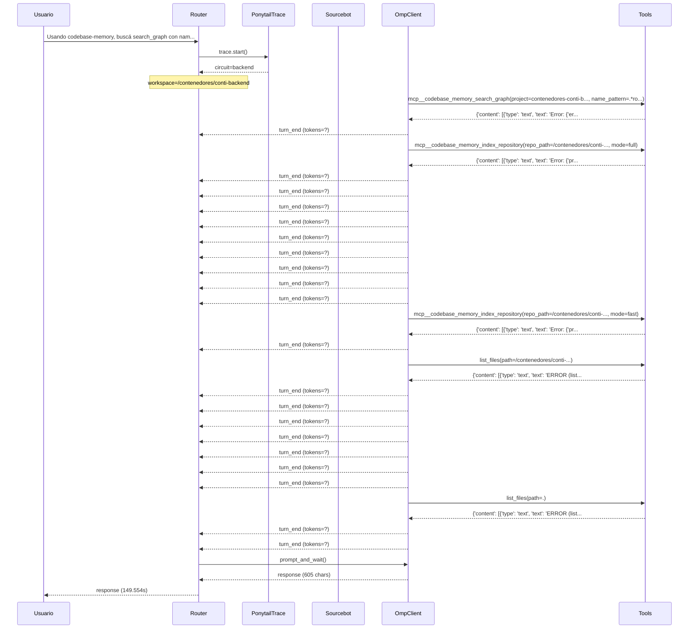

# Traza: Usando codebase-memory, buscá search_graph con name_pattern router en el proyecto contenedores-conti-backend y listá los 3 primeros resultados. NO escribas archivos.

- **Circuito**: `backend`
- **Workspace**: `/contenedores/conti-backend`
- **Inicio**: 2026-07-03T13:35:10.349912-03:00
- **Fin**: 2026-07-03T13:37:39.907768-03:00
- **Duración**: 149.558s
- **Eventos**: 40

## Diagrama de Secuencia



## Eventos Detallados

### 1. `start` (2026-07-03T13:35:10.349999-03:00)

```json
{
  "task": "Usando codebase-memory, buscá search_graph con name_pattern router en el proyecto contenedores-conti-backend y listá los 3 primeros resultados. NO escribas archivos.",
  "payload_keys": [
    "messages",
    "circuit",
    "_circuit",
    "_session"
  ],
  "circuit": "backend",
  "traces_dir": "/app/logs/ponytail"
}
```

### 2. `circuit_selected` (2026-07-03T13:35:10.352311-03:00)

```json
{
  "id": "backend",
  "workspace": "/contenedores/conti-backend",
  "session_id": "789e3a3e2f35",
  "is_new_session": true
}
```

### 3. `governance_tool` (2026-07-03T13:35:10.353823-03:00)

```json
{
  "tool": "get_onboarding",
  "chars": 195
}
```

### 4. `governance_tool` (2026-07-03T13:35:10.355317-03:00)

```json
{
  "tool": "get_rules",
  "chars": 438
}
```

### 5. `governance_tool` (2026-07-03T13:35:10.357343-03:00)

```json
{
  "tool": "get_config",
  "chars": 3246
}
```

### 6. `governance_injected` (2026-07-03T13:35:10.357362-03:00)

```json
{
  "onboarding_len": 3939,
  "is_new_session": true
}
```

### 7. `system_prompt` (2026-07-03T13:35:10.357415-03:00)

```json
{
  "length": 8724,
  "is_new_session": true,
  "governance_chars": 3939,
  "preview": "# Conti — Agente DevOps del Stack Contamela\n\nSoy Conti, agente DevOps que opera dentro del contenedor `conti-backend`\nsobre el VPS Linux de Contamela.com. Asisto a Luis Dalmasso en arquitectura,\ndespliegue, desarrollo y mantenimiento del stack (Django, n8n, Odoo, RAG,\nWhatsApp, Sourcebot, OpenHands, oh-my-pi).\n\n## Circuitos\n\nOpero en 4 circuitos independientes, uno por request (múltiples VSCode pueden\nusar circuitos distintos en paralelo):\n\n1. **desarrollo** (`/desarrollo`, rama develop de contamela-stack): DevOps en\n   rama develop. Puedo commitear y pushear via `run_salvar` (preview).\n   **NO** promuevo a main, **NO** despliego.\n\n2. **produccion** (`/compose`, rama main de contamela-stack, RW para git):\n   Promuevo via `run_promover` (merge develop→main + push). Después de una\n   promoci",
  "circuit": "backend",
  "workspace": "/contenedores/conti-backend"
}
```

### 8. `omp_tool_start` (2026-07-03T13:35:13.816615-03:00)

```json
{
  "tool": "mcp__codebase_memory_search_graph",
  "args": {
    "project": "contenedores-conti-backend",
    "name_pattern": ".*router.*",
    "limit": 3
  },
  "result": null,
  "error": null,
  "ok": true
}
```

### 9. `omp_tool_end` (2026-07-03T13:35:13.837459-03:00)

```json
{
  "tool": "mcp__codebase_memory_search_graph",
  "args": {
    "project": "contenedores-conti-backend",
    "name_pattern": ".*router.*",
    "limit": 3
  },
  "result": {
    "content": [
      {
        "type": "text",
        "text": "Error: {\"error\":\"project not found or not indexed\",\"hint\":\"No projects indexed yet. Call index_repository first.\"}"
      }
    ],
    "details": {
      "serverName": "codebase-memory",
      "mcpToolName": "search_graph",
      "isError": true,
      "rawContent": [
        {
          "type": "text",
          "text": "{\"error\":\"project not found or not indexed\",\"hint\":\"No projects indexed yet. Call index_repository first.\"}"
        }
      ],
      "provider": "native",
      "providerName": "OMP"
    },
    "isError": true
  },
  "error": null,
  "ok": true
}
```

### 10. `omp_turn_end` (2026-07-03T13:35:13.840891-03:00)

```json
{
  "event_type": "turn_end",
  "model": "?",
  "provider": "?"
}
```

### 11. `omp_tool_start` (2026-07-03T13:35:18.062679-03:00)

```json
{
  "tool": "mcp__codebase_memory_index_repository",
  "args": {
    "repo_path": "/contenedores/conti-backend",
    "mode": "full"
  },
  "result": null,
  "error": null,
  "ok": true
}
```

### 12. `omp_tool_end` (2026-07-03T13:35:21.816729-03:00)

```json
{
  "tool": "mcp__codebase_memory_index_repository",
  "args": {
    "repo_path": "/contenedores/conti-backend",
    "mode": "full"
  },
  "result": {
    "content": [
      {
        "type": "text",
        "text": "Error: {\"project\":\"contenedores-conti-backend\",\"status\":\"error\",\"hint\":\"Pipeline failed. Check repo_path exists and contains source files. Try mode='fast' for a quicker diagnostic run.\"}"
      }
    ],
    "details": {
      "serverName": "codebase-memory",
      "mcpToolName": "index_repository",
      "isError": true,
      "rawContent": [
        {
          "type": "text",
          "text": "{\"project\":\"contenedores-conti-backend\",\"status\":\"error\",\"hint\":\"Pipeline failed. Check repo_path exists and contains source files. Try mode='fast' for a quicker diagnostic run.\"}"
        }
      ],
      "provider": "native",
      "providerName": "OMP"
    },
    "isError": true
  },
  "error": null,
  "ok": true
}
```

### 13. `omp_turn_end` (2026-07-03T13:35:21.848552-03:00)

```json
{
  "event_type": "turn_end",
  "model": "?",
  "provider": "?"
}
```

### 14. `omp_turn_end` (2026-07-03T13:35:22.596361-03:00)

```json
{
  "event_type": "turn_end",
  "model": "?",
  "provider": "?"
}
```

### 15. `omp_turn_end` (2026-07-03T13:35:23.839556-03:00)

```json
{
  "event_type": "turn_end",
  "model": "?",
  "provider": "?"
}
```

### 16. `omp_turn_end` (2026-07-03T13:35:25.503428-03:00)

```json
{
  "event_type": "turn_end",
  "model": "?",
  "provider": "?"
}
```

### 17. `omp_turn_end` (2026-07-03T13:35:27.597705-03:00)

```json
{
  "event_type": "turn_end",
  "model": "?",
  "provider": "?"
}
```

### 18. `omp_turn_end` (2026-07-03T13:35:31.900713-03:00)

```json
{
  "event_type": "turn_end",
  "model": "?",
  "provider": "?"
}
```

### 19. `omp_turn_end` (2026-07-03T13:35:39.607688-03:00)

```json
{
  "event_type": "turn_end",
  "model": "?",
  "provider": "?"
}
```

### 20. `omp_turn_end` (2026-07-03T13:35:46.402516-03:00)

```json
{
  "event_type": "turn_end",
  "model": "?",
  "provider": "?"
}
```

### 21. `omp_turn_end` (2026-07-03T13:35:54.886164-03:00)

```json
{
  "event_type": "turn_end",
  "model": "?",
  "provider": "?"
}
```

### 22. `omp_tool_start` (2026-07-03T13:36:05.559039-03:00)

```json
{
  "tool": "mcp__codebase_memory_index_repository",
  "args": {
    "repo_path": "/contenedores/conti-backend",
    "mode": "fast"
  },
  "result": null,
  "error": null,
  "ok": true
}
```

### 23. `omp_tool_end` (2026-07-03T13:36:06.442456-03:00)

```json
{
  "tool": "mcp__codebase_memory_index_repository",
  "args": {
    "repo_path": "/contenedores/conti-backend",
    "mode": "fast"
  },
  "result": {
    "content": [
      {
        "type": "text",
        "text": "Error: {\"project\":\"contenedores-conti-backend\",\"status\":\"error\",\"hint\":\"Pipeline failed. Check repo_path exists and contains source files. Try mode='fast' for a quicker diagnostic run.\"}"
      }
    ],
    "details": {
      "serverName": "codebase-memory",
      "mcpToolName": "index_repository",
      "isError": true,
      "rawContent": [
        {
          "type": "text",
          "text": "{\"project\":\"contenedores-conti-backend\",\"status\":\"error\",\"hint\":\"Pipeline failed. Check repo_path exists and contains source files. Try mode='fast' for a quicker diagnostic run.\"}"
        }
      ],
      "provider": "native",
      "providerName": "OMP"
    },
    "isError": true
  },
  "error": null,
  "ok": true
}
```

### 24. `omp_turn_end` (2026-07-03T13:36:06.470212-03:00)

```json
{
  "event_type": "turn_end",
  "model": "?",
  "provider": "?"
}
```

### 25. `omp_tool_start` (2026-07-03T13:36:08.962598-03:00)

```json
{
  "tool": "list_files",
  "args": {
    "path": "/contenedores/conti-backend"
  },
  "result": null,
  "error": null,
  "ok": true
}
```

### 26. `omp_tool_end` (2026-07-03T13:36:39.036903-03:00)

```json
{
  "tool": "list_files",
  "args": {
    "path": "/contenedores/conti-backend"
  },
  "result": {
    "content": [
      {
        "type": "text",
        "text": "ERROR (list_files): timeout después de 30.0s"
      }
    ],
    "details": {}
  },
  "error": null,
  "ok": true
}
```

### 27. `omp_turn_end` (2026-07-03T13:36:39.059608-03:00)

```json
{
  "event_type": "turn_end",
  "model": "?",
  "provider": "?"
}
```

### 28. `omp_turn_end` (2026-07-03T13:36:39.531861-03:00)

```json
{
  "event_type": "turn_end",
  "model": "?",
  "provider": "?"
}
```

### 29. `omp_turn_end` (2026-07-03T13:36:40.415684-03:00)

```json
{
  "event_type": "turn_end",
  "model": "?",
  "provider": "?"
}
```

### 30. `omp_turn_end` (2026-07-03T13:36:41.954676-03:00)

```json
{
  "event_type": "turn_end",
  "model": "?",
  "provider": "?"
}
```

### 31. `omp_turn_end` (2026-07-03T13:36:44.245318-03:00)

```json
{
  "event_type": "turn_end",
  "model": "?",
  "provider": "?"
}
```

### 32. `omp_turn_end` (2026-07-03T13:36:48.063590-03:00)

```json
{
  "event_type": "turn_end",
  "model": "?",
  "provider": "?"
}
```

### 33. `omp_turn_end` (2026-07-03T13:36:55.359164-03:00)

```json
{
  "event_type": "turn_end",
  "model": "?",
  "provider": "?"
}
```

### 34. `omp_tool_start` (2026-07-03T13:37:04.913895-03:00)

```json
{
  "tool": "list_files",
  "args": {
    "path": "."
  },
  "result": null,
  "error": null,
  "ok": true
}
```

### 35. `omp_tool_end` (2026-07-03T13:37:35.003181-03:00)

```json
{
  "tool": "list_files",
  "args": {
    "path": "."
  },
  "result": {
    "content": [
      {
        "type": "text",
        "text": "ERROR (list_files): timeout después de 30.0s"
      }
    ],
    "details": {}
  },
  "error": null,
  "ok": true
}
```

### 36. `omp_turn_end` (2026-07-03T13:37:35.034461-03:00)

```json
{
  "event_type": "turn_end",
  "model": "?",
  "provider": "?"
}
```

### 37. `omp_turn_end` (2026-07-03T13:37:39.867791-03:00)

```json
{
  "event_type": "turn_end",
  "model": "?",
  "provider": "?"
}
```

### 38. `omp_usage` (2026-07-03T13:37:39.899498-03:00)

```json
{
  "model": "?",
  "provider": "?",
  "usage": null
}
```

### 39. `openhands_invoke` (2026-07-03T13:37:39.903592-03:00)

```json
{
  "circuit": "backend",
  "len": 605
}
```

### 40. `end` (2026-07-03T13:37:39.903626-03:00)

```json
{
  "duration_s": 149.554
}
```

## Prompt Completo (input del usuario)

```text
Usando codebase-memory, buscá search_graph con name_pattern router en el proyecto contenedores-conti-backend y listá los 3 primeros resultados. NO escribas archivos.
```
