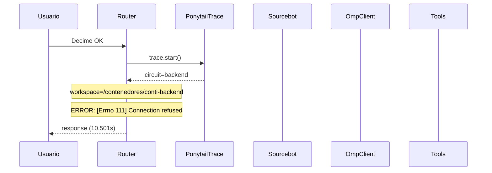

# Traza: Decime OK

- **Circuito**: `backend`
- **Workspace**: `/contenedores/conti-backend`
- **Inicio**: 2026-07-03T16:14:38.850441-03:00
- **Fin**: 2026-07-03T16:14:49.357953-03:00
- **Duración**: 10.508s
- **Eventos**: 9

## Diagrama de Secuencia



## Eventos Detallados

### 1. `start` (2026-07-03T16:14:38.850903-03:00)

```json
{
  "task": "Decime OK",
  "payload_keys": [
    "messages",
    "circuit",
    "_circuit",
    "_session"
  ],
  "circuit": "backend",
  "traces_dir": "/app/logs/ponytail"
}
```

### 2. `circuit_selected` (2026-07-03T16:14:38.853127-03:00)

```json
{
  "id": "backend",
  "workspace": "/contenedores/conti-backend",
  "session_id": "2233f13634ff",
  "is_new_session": true
}
```

### 3. `governance_tool` (2026-07-03T16:14:38.862731-03:00)

```json
{
  "tool": "get_onboarding",
  "chars": 195
}
```

### 4. `governance_tool` (2026-07-03T16:14:38.972366-03:00)

```json
{
  "tool": "get_rules",
  "chars": 438
}
```

### 5. `governance_tool` (2026-07-03T16:14:38.975053-03:00)

```json
{
  "tool": "get_config",
  "chars": 3246
}
```

### 6. `governance_injected` (2026-07-03T16:14:38.975072-03:00)

```json
{
  "onboarding_len": 3939,
  "is_new_session": true
}
```

### 7. `openhands_orchestrator_start` (2026-07-03T16:14:39.550723-03:00)

```json
{
  "circuit": "backend",
  "workspace": "/contenedores/conti-backend",
  "is_new_session": false,
  "prompt_len": 9,
  "governance_len": 3939
}
```

### 8. `error` (2026-07-03T16:14:49.350882-03:00)

```json
{
  "exception": "[Errno 111] Connection refused"
}
```

### 9. `end` (2026-07-03T16:14:49.350968-03:00)

```json
{
  "duration_s": 10.501
}
```

## Prompt Completo (input del usuario)

```text
Decime OK
```
