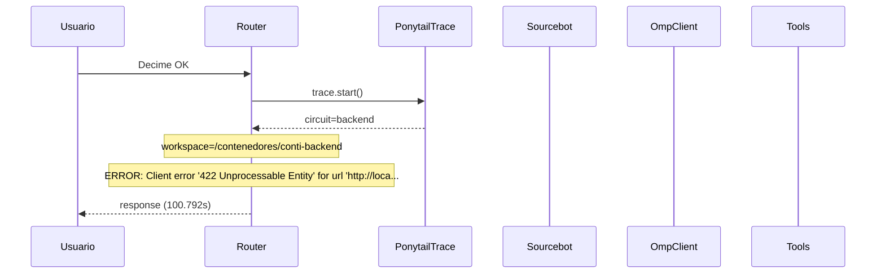

# Traza: Decime OK

- **Circuito**: `backend`
- **Workspace**: `/contenedores/conti-backend`
- **Inicio**: 2026-07-03T16:35:02.522496-03:00
- **Fin**: 2026-07-03T16:36:43.317720-03:00
- **Duración**: 100.795s
- **Eventos**: 11

## Diagrama de Secuencia



## Eventos Detallados

### 1. `start` (2026-07-03T16:35:02.522625-03:00)

```json
{
  "task": "Decime OK",
  "payload_keys": [
    "messages",
    "circuit",
    "_circuit",
    "_session"
  ],
  "circuit": "backend",
  "traces_dir": "/app/logs/ponytail"
}
```

### 2. `circuit_selected` (2026-07-03T16:35:02.524984-03:00)

```json
{
  "id": "backend",
  "workspace": "/contenedores/conti-backend",
  "session_id": "5b1be2f9b1e8",
  "is_new_session": true
}
```

### 3. `governance_tool` (2026-07-03T16:35:02.528574-03:00)

```json
{
  "tool": "get_onboarding",
  "chars": 195
}
```

### 4. `governance_tool` (2026-07-03T16:35:02.533914-03:00)

```json
{
  "tool": "get_rules",
  "chars": 438
}
```

### 5. `governance_tool` (2026-07-03T16:35:02.537215-03:00)

```json
{
  "tool": "get_config",
  "chars": 3246
}
```

### 6. `governance_injected` (2026-07-03T16:35:02.537237-03:00)

```json
{
  "onboarding_len": 3939,
  "is_new_session": true
}
```

### 7. `openhands_orchestrator_start` (2026-07-03T16:35:02.599818-03:00)

```json
{
  "circuit": "backend",
  "workspace": "/contenedores/conti-backend",
  "is_new_session": false,
  "prompt_len": 9,
  "governance_len": 3939
}
```

### 8. `conversation_created` (2026-07-03T16:36:43.136402-03:00)

```json
{
  "conversation_id": "96cd38ec-6704-4c59-a716-7bcca09ce1f3",
  "workspace": "/contenedores/conti-backend"
}
```

### 9. `system_prompt` (2026-07-03T16:36:43.136414-03:00)

```json
{
  "length": 9,
  "is_new_session": false,
  "governance_chars": 3939,
  "circuit": "backend",
  "workspace": "/contenedores/conti-backend"
}
```

### 10. `error` (2026-07-03T16:36:43.314649-03:00)

```json
{
  "exception": "Client error '422 Unprocessable Entity' for url 'http://localhost:3000/api/conversations/96cd38ec-6704-4c59-a716-7bcca09ce1f3/goal'\nFor more information check: https://developer.mozilla.org/en-US/docs/Web/HTTP/Status/422"
}
```

### 11. `end` (2026-07-03T16:36:43.314873-03:00)

```json
{
  "duration_s": 100.792
}
```

## Prompt Completo (input del usuario)

```text
Decime OK
```
