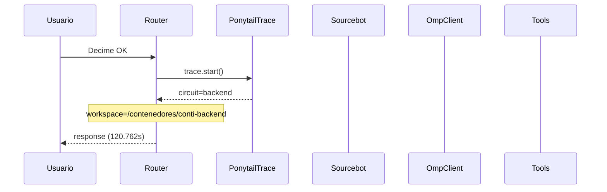

# Traza: Decime OK

- **Circuito**: `backend`
- **Workspace**: `/contenedores/conti-backend`
- **Inicio**: 2026-07-03T16:41:56.668791-03:00
- **Fin**: 2026-07-03T16:43:57.433251-03:00
- **Duración**: 120.764s
- **Eventos**: 8

## Diagrama de Secuencia



## Eventos Detallados

### 1. `start` (2026-07-03T16:41:56.668888-03:00)

```json
{
  "task": "Decime OK",
  "payload_keys": [
    "messages",
    "circuit",
    "_circuit",
    "_session"
  ],
  "circuit": "backend",
  "traces_dir": "/app/logs/ponytail"
}
```

### 2. `circuit_selected` (2026-07-03T16:41:56.670472-03:00)

```json
{
  "id": "backend",
  "workspace": "/contenedores/conti-backend",
  "session_id": "6b4746ab935f",
  "is_new_session": true
}
```

### 3. `governance_tool` (2026-07-03T16:41:56.673921-03:00)

```json
{
  "tool": "get_onboarding",
  "chars": 195
}
```

### 4. `governance_tool` (2026-07-03T16:41:56.677837-03:00)

```json
{
  "tool": "get_rules",
  "chars": 438
}
```

### 5. `governance_tool` (2026-07-03T16:41:56.679783-03:00)

```json
{
  "tool": "get_config",
  "chars": 3246
}
```

### 6. `governance_injected` (2026-07-03T16:41:56.679797-03:00)

```json
{
  "onboarding_len": 3939,
  "is_new_session": true
}
```

### 7. `openhands_orchestrator_start` (2026-07-03T16:41:56.716500-03:00)

```json
{
  "circuit": "backend",
  "workspace": "/contenedores/conti-backend",
  "is_new_session": false,
  "prompt_len": 9,
  "governance_len": 3939
}
```

### 8. `end` (2026-07-03T16:43:57.430552-03:00)

```json
{
  "duration_s": 120.762
}
```

## Prompt Completo (input del usuario)

```text
Decime OK
```
