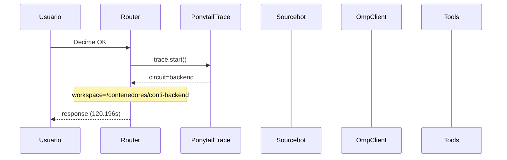

# Traza: Decime OK

- **Circuito**: `backend`
- **Workspace**: `/contenedores/conti-backend`
- **Inicio**: 2026-07-03T16:45:42.870532-03:00
- **Fin**: 2026-07-03T16:47:43.072839-03:00
- **Duración**: 120.202s
- **Eventos**: 12

## Diagrama de Secuencia



## Eventos Detallados

### 1. `start` (2026-07-03T16:45:42.870649-03:00)

```json
{
  "task": "Decime OK",
  "payload_keys": [
    "messages",
    "circuit",
    "_circuit",
    "_session"
  ],
  "circuit": "backend",
  "traces_dir": "/app/logs/ponytail"
}
```

### 2. `circuit_selected` (2026-07-03T16:45:42.871702-03:00)

```json
{
  "id": "backend",
  "workspace": "/contenedores/conti-backend",
  "session_id": "5f4cb3be7af3",
  "is_new_session": true
}
```

### 3. `governance_tool` (2026-07-03T16:45:42.875058-03:00)

```json
{
  "tool": "get_onboarding",
  "chars": 195
}
```

### 4. `governance_tool` (2026-07-03T16:45:42.877168-03:00)

```json
{
  "tool": "get_rules",
  "chars": 438
}
```

### 5. `governance_tool` (2026-07-03T16:45:42.879838-03:00)

```json
{
  "tool": "get_config",
  "chars": 3246
}
```

### 6. `governance_injected` (2026-07-03T16:45:42.879864-03:00)

```json
{
  "onboarding_len": 3939,
  "is_new_session": true
}
```

### 7. `openhands_orchestrator_start` (2026-07-03T16:45:42.917336-03:00)

```json
{
  "circuit": "backend",
  "workspace": "/contenedores/conti-backend",
  "is_new_session": false,
  "prompt_len": 9,
  "governance_len": 3939
}
```

### 8. `conversation_created` (2026-07-03T16:47:38.806972-03:00)

```json
{
  "conversation_id": "8cef5b20-de5c-4623-bd0c-efcbdd4b49c2",
  "workspace": "/contenedores/conti-backend"
}
```

### 9. `system_prompt` (2026-07-03T16:47:38.806980-03:00)

```json
{
  "length": 9,
  "is_new_session": false,
  "governance_chars": 3939,
  "circuit": "backend",
  "workspace": "/contenedores/conti-backend"
}
```

### 10. `goal_sent` (2026-07-03T16:47:38.849703-03:00)

```json
{
  "conversation_id": "8cef5b20-de5c-4623-bd0c-efcbdd4b49c2",
  "prompt_len": 9
}
```

### 11. `openhands_orchestrator_end` (2026-07-03T16:47:43.066544-03:00)

```json
{
  "conversation_id": "8cef5b20-de5c-4623-bd0c-efcbdd4b49c2",
  "response_len": 0,
  "status": "ok"
}
```

### 12. `end` (2026-07-03T16:47:43.066768-03:00)

```json
{
  "duration_s": 120.196
}
```

## Prompt Completo (input del usuario)

```text
Decime OK
```
