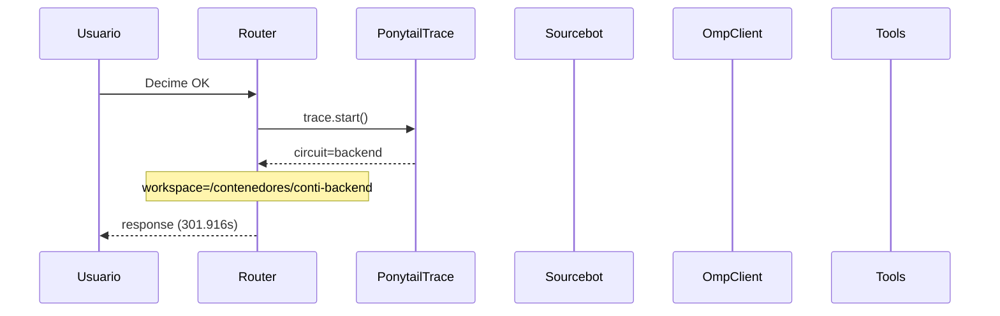

# Traza: Decime OK

- **Circuito**: `backend`
- **Workspace**: `/contenedores/conti-backend`
- **Inicio**: 2026-07-03T16:49:00.367057-03:00
- **Fin**: 2026-07-03T16:54:02.285740-03:00
- **Duración**: 301.919s
- **Eventos**: 12

## Diagrama de Secuencia



## Eventos Detallados

### 1. `start` (2026-07-03T16:49:00.367201-03:00)

```json
{
  "task": "Decime OK",
  "payload_keys": [
    "messages",
    "circuit",
    "_circuit",
    "_session"
  ],
  "circuit": "backend",
  "traces_dir": "/app/logs/ponytail"
}
```

### 2. `circuit_selected` (2026-07-03T16:49:00.372493-03:00)

```json
{
  "id": "backend",
  "workspace": "/contenedores/conti-backend",
  "session_id": "9e617f76d512",
  "is_new_session": true
}
```

### 3. `governance_tool` (2026-07-03T16:49:00.374746-03:00)

```json
{
  "tool": "get_onboarding",
  "chars": 195
}
```

### 4. `governance_tool` (2026-07-03T16:49:00.377343-03:00)

```json
{
  "tool": "get_rules",
  "chars": 438
}
```

### 5. `governance_tool` (2026-07-03T16:49:00.382813-03:00)

```json
{
  "tool": "get_config",
  "chars": 3246
}
```

### 6. `governance_injected` (2026-07-03T16:49:00.382843-03:00)

```json
{
  "onboarding_len": 3939,
  "is_new_session": true
}
```

### 7. `openhands_orchestrator_start` (2026-07-03T16:49:00.427926-03:00)

```json
{
  "circuit": "backend",
  "workspace": "/contenedores/conti-backend",
  "is_new_session": false,
  "prompt_len": 9,
  "governance_len": 3939
}
```

### 8. `conversation_created` (2026-07-03T16:49:00.516438-03:00)

```json
{
  "conversation_id": "4ad0b328-4472-49e7-b06f-1d42dc65bf3a",
  "workspace": "/contenedores/conti-backend"
}
```

### 9. `system_prompt` (2026-07-03T16:49:00.516448-03:00)

```json
{
  "length": 9,
  "is_new_session": false,
  "governance_chars": 3939,
  "circuit": "backend",
  "workspace": "/contenedores/conti-backend"
}
```

### 10. `goal_sent` (2026-07-03T16:49:00.530561-03:00)

```json
{
  "conversation_id": "4ad0b328-4472-49e7-b06f-1d42dc65bf3a",
  "prompt_len": 9
}
```

### 11. `openhands_orchestrator_end` (2026-07-03T16:54:02.282696-03:00)

```json
{
  "conversation_id": "4ad0b328-4472-49e7-b06f-1d42dc65bf3a",
  "response_len": 0,
  "status": "ok"
}
```

### 12. `end` (2026-07-03T16:54:02.282884-03:00)

```json
{
  "duration_s": 301.916
}
```

## Prompt Completo (input del usuario)

```text
Decime OK
```
