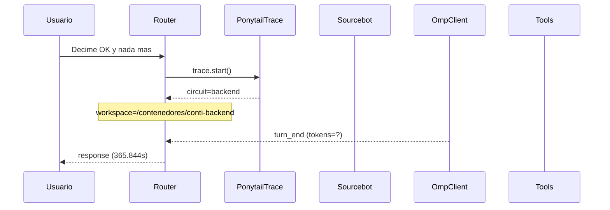

# Traza: Decime OK y nada mas

- **Circuito**: `backend`
- **Workspace**: `/contenedores/conti-backend`
- **Inicio**: 2026-07-03T16:58:26.629889-03:00
- **Fin**: 2026-07-03T17:04:32.476990-03:00
- **Duración**: 365.847s
- **Eventos**: 15

## Diagrama de Secuencia



## Eventos Detallados

### 1. `start` (2026-07-03T16:58:26.629979-03:00)

```json
{
  "task": "Decime OK y nada mas",
  "payload_keys": [
    "messages",
    "circuit",
    "_circuit",
    "_session"
  ],
  "circuit": "backend",
  "traces_dir": "/app/logs/ponytail"
}
```

### 2. `circuit_selected` (2026-07-03T16:58:26.631718-03:00)

```json
{
  "id": "backend",
  "workspace": "/contenedores/conti-backend",
  "session_id": "991183edb174",
  "is_new_session": true
}
```

### 3. `governance_tool` (2026-07-03T16:58:26.634269-03:00)

```json
{
  "tool": "get_onboarding",
  "chars": 195
}
```

### 4. `governance_tool` (2026-07-03T16:58:26.635822-03:00)

```json
{
  "tool": "get_rules",
  "chars": 438
}
```

### 5. `governance_tool` (2026-07-03T16:58:26.637539-03:00)

```json
{
  "tool": "get_config",
  "chars": 3246
}
```

### 6. `governance_injected` (2026-07-03T16:58:26.637554-03:00)

```json
{
  "onboarding_len": 3939,
  "is_new_session": true
}
```

### 7. `openhands_orchestrator_start` (2026-07-03T16:58:26.666569-03:00)

```json
{
  "circuit": "backend",
  "workspace": "/contenedores/conti-backend",
  "is_new_session": false,
  "prompt_len": 20,
  "governance_len": 3939
}
```

### 8. `conversation_created` (2026-07-03T16:59:32.090701-03:00)

```json
{
  "conversation_id": "7fa4429f-b466-4b93-b497-57b7558ea5e7",
  "workspace": "/contenedores/conti-backend"
}
```

### 9. `system_prompt` (2026-07-03T16:59:32.090717-03:00)

```json
{
  "length": 20,
  "is_new_session": false,
  "governance_chars": 3939,
  "circuit": "backend",
  "workspace": "/contenedores/conti-backend"
}
```

### 10. `goal_sent` (2026-07-03T16:59:32.097531-03:00)

```json
{
  "conversation_id": "7fa4429f-b466-4b93-b497-57b7558ea5e7",
  "prompt_len": 20
}
```

### 11. `omp_execution_status` (2026-07-03T16:59:34.183199-03:00)

```json
{
  "status": "running"
}
```

### 12. `omp_execution_status` (2026-07-03T16:59:34.183204-03:00)

```json
{
  "status": "finished"
}
```

### 13. `omp_turn_end` (2026-07-03T16:59:34.183208-03:00)

```json
{
  "event_type": "turn_end",
  "status": "complete"
}
```

### 14. `openhands_orchestrator_end` (2026-07-03T17:04:32.474172-03:00)

```json
{
  "conversation_id": "7fa4429f-b466-4b93-b497-57b7558ea5e7",
  "response_len": 2,
  "status": "ok"
}
```

### 15. `end` (2026-07-03T17:04:32.474333-03:00)

```json
{
  "duration_s": 365.844
}
```

## Prompt Completo (input del usuario)

```text
Decime OK y nada mas
```
