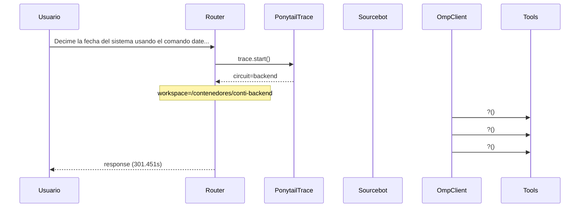

# Traza: Decime la fecha del sistema usando el comando date. NO escribas archivos.

- **Circuito**: `backend`
- **Workspace**: `/contenedores/conti-backend`
- **Inicio**: 2026-07-03T17:18:02.358256-03:00
- **Fin**: 2026-07-03T17:23:03.818920-03:00
- **Duración**: 301.461s
- **Eventos**: 17

## Diagrama de Secuencia



## Eventos Detallados

### 1. `start` (2026-07-03T17:18:02.358352-03:00)

```json
{
  "task": "Decime la fecha del sistema usando el comando date. NO escribas archivos.",
  "payload_keys": [
    "messages",
    "circuit",
    "_circuit",
    "_session"
  ],
  "circuit": "backend",
  "traces_dir": "/app/logs/ponytail"
}
```

### 2. `circuit_selected` (2026-07-03T17:18:02.361923-03:00)

```json
{
  "id": "backend",
  "workspace": "/contenedores/conti-backend",
  "session_id": "1df72a9ee278",
  "is_new_session": true
}
```

### 3. `governance_tool` (2026-07-03T17:18:02.365907-03:00)

```json
{
  "tool": "get_onboarding",
  "chars": 195
}
```

### 4. `governance_tool` (2026-07-03T17:18:02.370933-03:00)

```json
{
  "tool": "get_rules",
  "chars": 438
}
```

### 5. `governance_tool` (2026-07-03T17:18:02.372874-03:00)

```json
{
  "tool": "get_config",
  "chars": 3246
}
```

### 6. `governance_injected` (2026-07-03T17:18:02.372888-03:00)

```json
{
  "onboarding_len": 3939,
  "is_new_session": true
}
```

### 7. `openhands_orchestrator_start` (2026-07-03T17:18:02.413655-03:00)

```json
{
  "circuit": "backend",
  "workspace": "/contenedores/conti-backend",
  "is_new_session": false,
  "prompt_len": 73,
  "governance_len": 3939
}
```

### 8. `conversation_created` (2026-07-03T17:18:02.503235-03:00)

```json
{
  "conversation_id": "2160cfbd-5d5b-43c4-9038-9d8337fce392",
  "workspace": "/contenedores/conti-backend"
}
```

### 9. `system_prompt` (2026-07-03T17:18:02.503240-03:00)

```json
{
  "length": 73,
  "is_new_session": false,
  "governance_chars": 3939,
  "circuit": "backend",
  "workspace": "/contenedores/conti-backend"
}
```

### 10. `goal_sent` (2026-07-03T17:18:02.511676-03:00)

```json
{
  "conversation_id": "2160cfbd-5d5b-43c4-9038-9d8337fce392",
  "prompt_len": 73
}
```

### 11. `omp_execution_status` (2026-07-03T17:18:04.595144-03:00)

```json
{
  "status": "running"
}
```

### 12. `omp_tool_start` (2026-07-03T17:18:04.595148-03:00)

```json
{
  "tool": "?",
  "args": {}
}
```

### 13. `omp_tool_start` (2026-07-03T17:18:04.595151-03:00)

```json
{
  "tool": "?",
  "args": {}
}
```

### 14. `omp_tool_start` (2026-07-03T17:18:06.614534-03:00)

```json
{
  "tool": "?",
  "args": {}
}
```

### 15. `omp_execution_status` (2026-07-03T17:18:06.614539-03:00)

```json
{
  "status": "stuck"
}
```

### 16. `openhands_orchestrator_end` (2026-07-03T17:23:03.809472-03:00)

```json
{
  "conversation_id": "2160cfbd-5d5b-43c4-9038-9d8337fce392",
  "response_len": 0,
  "status": "ok"
}
```

### 17. `end` (2026-07-03T17:23:03.809608-03:00)

```json
{
  "duration_s": 301.451
}
```

## Prompt Completo (input del usuario)

```text
Decime la fecha del sistema usando el comando date. NO escribas archivos.
```
