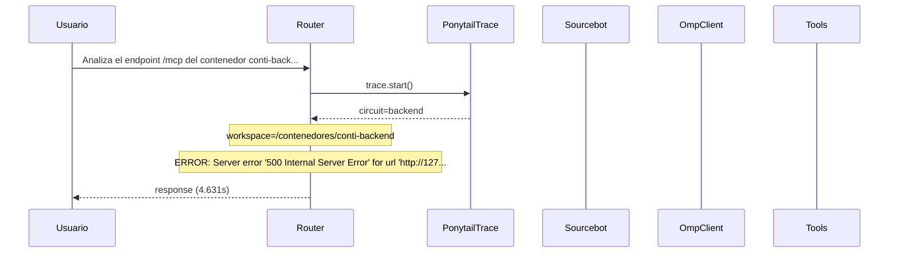

# Traza: Analiza el endpoint /mcp del contenedor conti-backend y documenta todas las tools en un documento mcp_tools_doc.md

- **Circuito**: `backend`
- **Workspace**: `/contenedores/conti-backend`
- **Inicio**: 2026-07-03T18:16:30.727779-03:00
- **Fin**: 2026-07-03T18:16:35.361345-03:00
- **Duración**: 4.634s
- **Eventos**: 9

## Diagrama de Secuencia



## Eventos Detallados

### 1. `start` (2026-07-03T18:16:30.727852-03:00)

```json
{
  "task": "Analiza el endpoint /mcp del contenedor conti-backend y documenta todas las tools en un documento mcp_tools_doc.md",
  "payload_keys": [
    "messages",
    "circuit",
    "_circuit",
    "_session"
  ],
  "circuit": "backend",
  "traces_dir": "/app/logs/ponytail"
}
```

### 2. `circuit_selected` (2026-07-03T18:16:30.735955-03:00)

```json
{
  "id": "backend",
  "workspace": "/contenedores/conti-backend",
  "session_id": "f96de84b8d1d",
  "is_new_session": true
}
```

### 3. `governance_tool` (2026-07-03T18:16:30.737504-03:00)

```json
{
  "tool": "get_onboarding",
  "chars": 195
}
```

### 4. `governance_tool` (2026-07-03T18:16:30.752088-03:00)

```json
{
  "tool": "get_rules",
  "chars": 438
}
```

### 5. `governance_tool` (2026-07-03T18:16:30.756287-03:00)

```json
{
  "tool": "get_config",
  "chars": 3246
}
```

### 6. `governance_injected` (2026-07-03T18:16:30.756311-03:00)

```json
{
  "onboarding_len": 3939,
  "is_new_session": true
}
```

### 7. `openhands_orchestrator_start` (2026-07-03T18:16:30.783756-03:00)

```json
{
  "circuit": "backend",
  "workspace": "/contenedores/conti-backend",
  "is_new_session": false,
  "prompt_len": 114,
  "governance_len": 3939
}
```

### 8. `error` (2026-07-03T18:16:35.358712-03:00)

```json
{
  "exception": "Server error '500 Internal Server Error' for url 'http://127.0.0.1:3000/api/conversations'\nFor more information check: https://developer.mozilla.org/en-US/docs/Web/HTTP/Status/500"
}
```

### 9. `end` (2026-07-03T18:16:35.358767-03:00)

```json
{
  "duration_s": 4.631
}
```

## Prompt Completo (input del usuario)

```text
Analiza el endpoint /mcp del contenedor conti-backend y documenta todas las tools en un documento mcp_tools_doc.md
```
