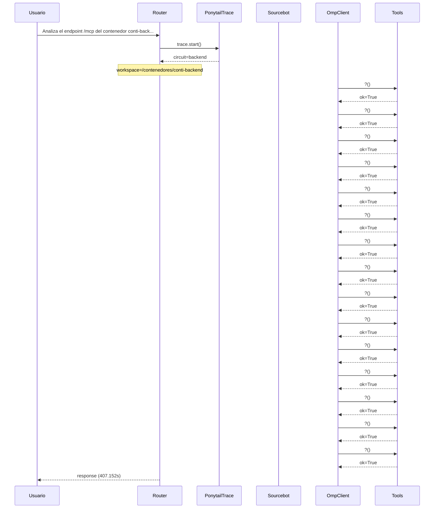

# Traza: Analiza el endpoint /mcp del contenedor conti-backend y documenta todas las tools en un documento mcp_tools_doc.md

- **Circuito**: `backend`
- **Workspace**: `/contenedores/conti-backend`
- **Inicio**: 2026-07-03T18:18:37.591770-03:00
- **Fin**: 2026-07-03T18:25:24.747925-03:00
- **Duración**: 407.156s
- **Eventos**: 43

## Diagrama de Secuencia



## Eventos Detallados

### 1. `start` (2026-07-03T18:18:37.591971-03:00)

```json
{
  "task": "Analiza el endpoint /mcp del contenedor conti-backend y documenta todas las tools en un documento mcp_tools_doc.md",
  "payload_keys": [
    "messages",
    "circuit",
    "_circuit",
    "_session"
  ],
  "circuit": "backend",
  "traces_dir": "/app/logs/ponytail"
}
```

### 2. `circuit_selected` (2026-07-03T18:18:37.632346-03:00)

```json
{
  "id": "backend",
  "workspace": "/contenedores/conti-backend",
  "session_id": "dc61d488cb79",
  "is_new_session": true
}
```

### 3. `governance_tool` (2026-07-03T18:18:37.643586-03:00)

```json
{
  "tool": "get_onboarding",
  "chars": 195
}
```

### 4. `governance_tool` (2026-07-03T18:18:37.648449-03:00)

```json
{
  "tool": "get_rules",
  "chars": 438
}
```

### 5. `governance_tool` (2026-07-03T18:18:37.652076-03:00)

```json
{
  "tool": "get_config",
  "chars": 3246
}
```

### 6. `governance_injected` (2026-07-03T18:18:37.652094-03:00)

```json
{
  "onboarding_len": 3939,
  "is_new_session": true
}
```

### 7. `openhands_orchestrator_start` (2026-07-03T18:18:37.690949-03:00)

```json
{
  "circuit": "backend",
  "workspace": "/contenedores/conti-backend",
  "is_new_session": false,
  "prompt_len": 114,
  "governance_len": 3939
}
```

### 8. `conversation_created` (2026-07-03T18:20:24.094165-03:00)

```json
{
  "conversation_id": "05a32d66-0816-438d-b861-2d649d7d734a",
  "workspace": "/contenedores/conti-backend"
}
```

### 9. `system_prompt` (2026-07-03T18:20:24.094173-03:00)

```json
{
  "length": 114,
  "is_new_session": false,
  "governance_chars": 3939,
  "circuit": "backend",
  "workspace": "/contenedores/conti-backend"
}
```

### 10. `goal_sent` (2026-07-03T18:20:24.111527-03:00)

```json
{
  "conversation_id": "05a32d66-0816-438d-b861-2d649d7d734a",
  "prompt_len": 114
}
```

### 11. `omp_execution_status` (2026-07-03T18:20:26.210640-03:00)

```json
{
  "status": "running"
}
```

### 12. `omp_tool_start` (2026-07-03T18:20:28.256129-03:00)

```json
{
  "tool": "?",
  "args": {}
}
```

### 13. `omp_tool_end` (2026-07-03T18:20:28.256136-03:00)

```json
{
  "tool": "?",
  "result": "",
  "ok": true
}
```

### 14. `omp_tool_start` (2026-07-03T18:20:28.256142-03:00)

```json
{
  "tool": "?",
  "args": {}
}
```

### 15. `omp_tool_end` (2026-07-03T18:20:32.417144-03:00)

```json
{
  "tool": "?",
  "result": "",
  "ok": true
}
```

### 16. `omp_tool_start` (2026-07-03T18:20:34.435023-03:00)

```json
{
  "tool": "?",
  "args": {}
}
```

### 17. `omp_tool_end` (2026-07-03T18:20:34.435029-03:00)

```json
{
  "tool": "?",
  "result": "",
  "ok": true
}
```

### 18. `omp_tool_start` (2026-07-03T18:20:36.460584-03:00)

```json
{
  "tool": "?",
  "args": {}
}
```

### 19. `omp_tool_end` (2026-07-03T18:20:36.460589-03:00)

```json
{
  "tool": "?",
  "result": "",
  "ok": true
}
```

### 20. `omp_tool_start` (2026-07-03T18:20:38.534929-03:00)

```json
{
  "tool": "?",
  "args": {}
}
```

### 21. `omp_tool_end` (2026-07-03T18:20:38.534938-03:00)

```json
{
  "tool": "?",
  "result": "",
  "ok": true
}
```

### 22. `omp_tool_start` (2026-07-03T18:21:04.990558-03:00)

```json
{
  "tool": "?",
  "args": {}
}
```

### 23. `omp_tool_end` (2026-07-03T18:21:04.990564-03:00)

```json
{
  "tool": "?",
  "result": "",
  "ok": true
}
```

### 24. `omp_tool_start` (2026-07-03T18:21:07.032776-03:00)

```json
{
  "tool": "?",
  "args": {}
}
```

### 25. `omp_tool_end` (2026-07-03T18:21:07.032784-03:00)

```json
{
  "tool": "?",
  "result": "",
  "ok": true
}
```

### 26. `omp_tool_start` (2026-07-03T18:21:09.085637-03:00)

```json
{
  "tool": "?",
  "args": {}
}
```

### 27. `omp_tool_end` (2026-07-03T18:21:09.085646-03:00)

```json
{
  "tool": "?",
  "result": "",
  "ok": true
}
```

### 28. `omp_tool_start` (2026-07-03T18:22:08.266449-03:00)

```json
{
  "tool": "?",
  "args": {}
}
```

### 29. `omp_tool_end` (2026-07-03T18:22:08.266458-03:00)

```json
{
  "tool": "?",
  "result": "",
  "ok": true
}
```

### 30. `omp_tool_start` (2026-07-03T18:22:10.295743-03:00)

```json
{
  "tool": "?",
  "args": {}
}
```

### 31. `omp_tool_end` (2026-07-03T18:22:10.295750-03:00)

```json
{
  "tool": "?",
  "result": "",
  "ok": true
}
```

### 32. `omp_tool_start` (2026-07-03T18:23:09.760963-03:00)

```json
{
  "tool": "?",
  "args": {}
}
```

### 33. `omp_tool_end` (2026-07-03T18:23:09.760971-03:00)

```json
{
  "tool": "?",
  "result": "",
  "ok": true
}
```

### 34. `omp_tool_start` (2026-07-03T18:23:11.792247-03:00)

```json
{
  "tool": "?",
  "args": {}
}
```

### 35. `omp_tool_end` (2026-07-03T18:23:11.792254-03:00)

```json
{
  "tool": "?",
  "result": "",
  "ok": true
}
```

### 36. `omp_tool_start` (2026-07-03T18:24:11.193009-03:00)

```json
{
  "tool": "?",
  "args": {}
}
```

### 37. `omp_tool_end` (2026-07-03T18:24:11.193018-03:00)

```json
{
  "tool": "?",
  "result": "",
  "ok": true
}
```

### 38. `omp_tool_start` (2026-07-03T18:24:13.227686-03:00)

```json
{
  "tool": "?",
  "args": {}
}
```

### 39. `omp_tool_end` (2026-07-03T18:24:13.227694-03:00)

```json
{
  "tool": "?",
  "result": "",
  "ok": true
}
```

### 40. `omp_tool_start` (2026-07-03T18:25:18.620757-03:00)

```json
{
  "tool": "?",
  "args": {}
}
```

### 41. `omp_tool_end` (2026-07-03T18:25:18.620766-03:00)

```json
{
  "tool": "?",
  "result": "",
  "ok": true
}
```

### 42. `openhands_orchestrator_end` (2026-07-03T18:25:24.743886-03:00)

```json
{
  "conversation_id": "05a32d66-0816-438d-b861-2d649d7d734a",
  "response_len": 0,
  "status": "ok"
}
```

### 43. `end` (2026-07-03T18:25:24.744044-03:00)

```json
{
  "duration_s": 407.152
}
```

## Prompt Completo (input del usuario)

```text
Analiza el endpoint /mcp del contenedor conti-backend y documenta todas las tools en un documento mcp_tools_doc.md
```
