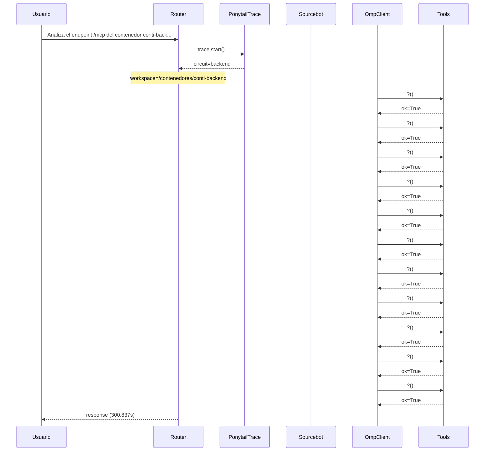

# Traza: Analiza el endpoint /mcp del contenedor conti-backend y documenta todas las tools en un documento mcp_tools_doc.md

- **Circuito**: `backend`
- **Workspace**: `/contenedores/conti-backend`
- **Inicio**: 2026-07-03T18:26:50.620650-03:00
- **Fin**: 2026-07-03T18:31:51.461142-03:00
- **Duración**: 300.84s
- **Eventos**: 35

## Diagrama de Secuencia



## Eventos Detallados

### 1. `start` (2026-07-03T18:26:50.620756-03:00)

```json
{
  "task": "Analiza el endpoint /mcp del contenedor conti-backend y documenta todas las tools en un documento mcp_tools_doc.md",
  "payload_keys": [
    "messages",
    "circuit",
    "_circuit",
    "_session"
  ],
  "circuit": "backend",
  "traces_dir": "/app/logs/ponytail"
}
```

### 2. `circuit_selected` (2026-07-03T18:26:50.623011-03:00)

```json
{
  "id": "backend",
  "workspace": "/contenedores/conti-backend",
  "session_id": "d63aa9c014aa",
  "is_new_session": true
}
```

### 3. `governance_tool` (2026-07-03T18:26:50.624608-03:00)

```json
{
  "tool": "get_onboarding",
  "chars": 195
}
```

### 4. `governance_tool` (2026-07-03T18:26:50.626100-03:00)

```json
{
  "tool": "get_rules",
  "chars": 438
}
```

### 5. `governance_tool` (2026-07-03T18:26:50.628501-03:00)

```json
{
  "tool": "get_config",
  "chars": 3246
}
```

### 6. `governance_injected` (2026-07-03T18:26:50.628527-03:00)

```json
{
  "onboarding_len": 3939,
  "is_new_session": true
}
```

### 7. `openhands_orchestrator_start` (2026-07-03T18:26:50.659241-03:00)

```json
{
  "circuit": "backend",
  "workspace": "/contenedores/conti-backend",
  "is_new_session": false,
  "prompt_len": 114,
  "governance_len": 3939
}
```

### 8. `conversation_created` (2026-07-03T18:26:50.717618-03:00)

```json
{
  "conversation_id": "97c687c5-6fc3-4d0f-8b7c-7d1a505d755c",
  "workspace": "/contenedores/conti-backend"
}
```

### 9. `system_prompt` (2026-07-03T18:26:50.717625-03:00)

```json
{
  "length": 114,
  "is_new_session": false,
  "governance_chars": 3939,
  "circuit": "backend",
  "workspace": "/contenedores/conti-backend"
}
```

### 10. `goal_sent` (2026-07-03T18:26:50.727307-03:00)

```json
{
  "conversation_id": "97c687c5-6fc3-4d0f-8b7c-7d1a505d755c",
  "prompt_len": 114
}
```

### 11. `omp_execution_status` (2026-07-03T18:26:52.764840-03:00)

```json
{
  "status": "running"
}
```

### 12. `omp_tool_start` (2026-07-03T18:26:52.764844-03:00)

```json
{
  "tool": "?",
  "args": {}
}
```

### 13. `omp_tool_end` (2026-07-03T18:26:52.764847-03:00)

```json
{
  "tool": "?",
  "result": "",
  "ok": true
}
```

### 14. `omp_tool_start` (2026-07-03T18:26:54.799792-03:00)

```json
{
  "tool": "?",
  "args": {}
}
```

### 15. `omp_tool_end` (2026-07-03T18:26:54.799798-03:00)

```json
{
  "tool": "?",
  "result": "",
  "ok": true
}
```

### 16. `omp_tool_start` (2026-07-03T18:26:54.799801-03:00)

```json
{
  "tool": "?",
  "args": {}
}
```

### 17. `omp_tool_end` (2026-07-03T18:27:25.297931-03:00)

```json
{
  "tool": "?",
  "result": "",
  "ok": true
}
```

### 18. `omp_tool_start` (2026-07-03T18:29:26.927976-03:00)

```json
{
  "tool": "?",
  "args": {}
}
```

### 19. `omp_tool_end` (2026-07-03T18:29:57.471930-03:00)

```json
{
  "tool": "?",
  "result": "",
  "ok": true
}
```

### 20. `omp_tool_start` (2026-07-03T18:30:05.633415-03:00)

```json
{
  "tool": "?",
  "args": {}
}
```

### 21. `omp_tool_end` (2026-07-03T18:30:07.691221-03:00)

```json
{
  "tool": "?",
  "result": "",
  "ok": true
}
```

### 22. `omp_tool_start` (2026-07-03T18:30:07.691228-03:00)

```json
{
  "tool": "?",
  "args": {}
}
```

### 23. `omp_tool_end` (2026-07-03T18:30:07.691230-03:00)

```json
{
  "tool": "?",
  "result": "",
  "ok": true
}
```

### 24. `omp_tool_start` (2026-07-03T18:30:09.790549-03:00)

```json
{
  "tool": "?",
  "args": {}
}
```

### 25. `omp_tool_end` (2026-07-03T18:30:09.790555-03:00)

```json
{
  "tool": "?",
  "result": "",
  "ok": true
}
```

### 26. `omp_tool_start` (2026-07-03T18:30:11.836818-03:00)

```json
{
  "tool": "?",
  "args": {}
}
```

### 27. `omp_tool_end` (2026-07-03T18:30:11.836825-03:00)

```json
{
  "tool": "?",
  "result": "",
  "ok": true
}
```

### 28. `omp_tool_start` (2026-07-03T18:30:11.836830-03:00)

```json
{
  "tool": "?",
  "args": {}
}
```

### 29. `omp_tool_end` (2026-07-03T18:30:11.836831-03:00)

```json
{
  "tool": "?",
  "result": "",
  "ok": true
}
```

### 30. `omp_tool_start` (2026-07-03T18:31:12.759638-03:00)

```json
{
  "tool": "?",
  "args": {}
}
```

### 31. `omp_tool_end` (2026-07-03T18:31:12.759644-03:00)

```json
{
  "tool": "?",
  "result": "",
  "ok": true
}
```

### 32. `omp_tool_start` (2026-07-03T18:31:14.776758-03:00)

```json
{
  "tool": "?",
  "args": {}
}
```

### 33. `omp_tool_end` (2026-07-03T18:31:14.776766-03:00)

```json
{
  "tool": "?",
  "result": "",
  "ok": true
}
```

### 34. `openhands_orchestrator_end` (2026-07-03T18:31:51.457260-03:00)

```json
{
  "conversation_id": "97c687c5-6fc3-4d0f-8b7c-7d1a505d755c",
  "response_len": 0,
  "status": "ok"
}
```

### 35. `end` (2026-07-03T18:31:51.457488-03:00)

```json
{
  "duration_s": 300.837
}
```

## Prompt Completo (input del usuario)

```text
Analiza el endpoint /mcp del contenedor conti-backend y documenta todas las tools en un documento mcp_tools_doc.md
```
