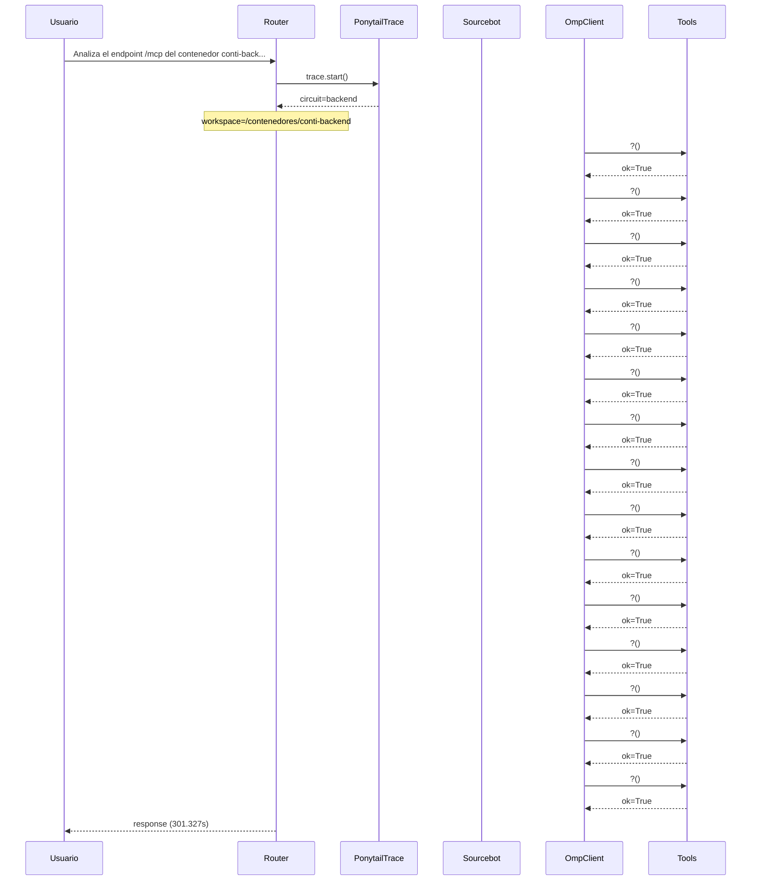

# Traza: Analiza el endpoint /mcp del contenedor conti-backend y documenta todas las tools en un documento mcp_tools_doc.md

- **Circuito**: `backend`
- **Workspace**: `/contenedores/conti-backend`
- **Inicio**: 2026-07-03T18:35:19.462425-03:00
- **Fin**: 2026-07-03T18:40:20.796927-03:00
- **Duración**: 301.335s
- **Eventos**: 43

## Diagrama de Secuencia



## Eventos Detallados

### 1. `start` (2026-07-03T18:35:19.462518-03:00)

```json
{
  "task": "Analiza el endpoint /mcp del contenedor conti-backend y documenta todas las tools en un documento mcp_tools_doc.md",
  "payload_keys": [
    "messages",
    "circuit",
    "_circuit",
    "_session"
  ],
  "circuit": "backend",
  "traces_dir": "/app/logs/ponytail"
}
```

### 2. `circuit_selected` (2026-07-03T18:35:19.464553-03:00)

```json
{
  "id": "backend",
  "workspace": "/contenedores/conti-backend",
  "session_id": "ca3117098b60",
  "is_new_session": true
}
```

### 3. `governance_tool` (2026-07-03T18:35:19.466148-03:00)

```json
{
  "tool": "get_onboarding",
  "chars": 195
}
```

### 4. `governance_tool` (2026-07-03T18:35:19.467799-03:00)

```json
{
  "tool": "get_rules",
  "chars": 438
}
```

### 5. `governance_tool` (2026-07-03T18:35:19.470367-03:00)

```json
{
  "tool": "get_config",
  "chars": 3246
}
```

### 6. `governance_injected` (2026-07-03T18:35:19.470406-03:00)

```json
{
  "onboarding_len": 3939,
  "is_new_session": true
}
```

### 7. `openhands_orchestrator_start` (2026-07-03T18:35:19.516502-03:00)

```json
{
  "circuit": "backend",
  "workspace": "/contenedores/conti-backend",
  "is_new_session": false,
  "prompt_len": 114,
  "governance_len": 3939
}
```

### 8. `conversation_created` (2026-07-03T18:35:19.651092-03:00)

```json
{
  "conversation_id": "b50ca24c-f87c-4a50-aa31-a603aa8e742b",
  "workspace": "/contenedores/conti-backend"
}
```

### 9. `system_prompt` (2026-07-03T18:35:19.651097-03:00)

```json
{
  "length": 114,
  "is_new_session": false,
  "governance_chars": 3939,
  "circuit": "backend",
  "workspace": "/contenedores/conti-backend"
}
```

### 10. `goal_sent` (2026-07-03T18:35:19.659123-03:00)

```json
{
  "conversation_id": "b50ca24c-f87c-4a50-aa31-a603aa8e742b",
  "prompt_len": 114
}
```

### 11. `omp_execution_status` (2026-07-03T18:35:21.730007-03:00)

```json
{
  "status": "running"
}
```

### 12. `omp_tool_start` (2026-07-03T18:35:21.730012-03:00)

```json
{
  "tool": "?",
  "args": {}
}
```

### 13. `omp_tool_end` (2026-07-03T18:35:21.730016-03:00)

```json
{
  "tool": "?",
  "result": "",
  "ok": true
}
```

### 14. `omp_tool_start` (2026-07-03T18:35:23.751402-03:00)

```json
{
  "tool": "?",
  "args": {}
}
```

### 15. `omp_tool_end` (2026-07-03T18:35:23.751408-03:00)

```json
{
  "tool": "?",
  "result": "",
  "ok": true
}
```

### 16. `omp_tool_start` (2026-07-03T18:35:25.765457-03:00)

```json
{
  "tool": "?",
  "args": {}
}
```

### 17. `omp_tool_end` (2026-07-03T18:35:25.765463-03:00)

```json
{
  "tool": "?",
  "result": "",
  "ok": true
}
```

### 18. `omp_tool_start` (2026-07-03T18:35:25.765467-03:00)

```json
{
  "tool": "?",
  "args": {}
}
```

### 19. `omp_tool_end` (2026-07-03T18:35:27.790619-03:00)

```json
{
  "tool": "?",
  "result": "",
  "ok": true
}
```

### 20. `omp_tool_start` (2026-07-03T18:35:27.790625-03:00)

```json
{
  "tool": "?",
  "args": {}
}
```

### 21. `omp_tool_end` (2026-07-03T18:35:27.790627-03:00)

```json
{
  "tool": "?",
  "result": "",
  "ok": true
}
```

### 22. `omp_tool_start` (2026-07-03T18:35:29.807792-03:00)

```json
{
  "tool": "?",
  "args": {}
}
```

### 23. `omp_tool_end` (2026-07-03T18:35:29.807798-03:00)

```json
{
  "tool": "?",
  "result": "",
  "ok": true
}
```

### 24. `omp_tool_start` (2026-07-03T18:37:31.612631-03:00)

```json
{
  "tool": "?",
  "args": {}
}
```

### 25. `omp_tool_end` (2026-07-03T18:37:31.612648-03:00)

```json
{
  "tool": "?",
  "result": "",
  "ok": true
}
```

### 26. `omp_tool_start` (2026-07-03T18:37:33.704349-03:00)

```json
{
  "tool": "?",
  "args": {}
}
```

### 27. `omp_tool_end` (2026-07-03T18:37:33.704357-03:00)

```json
{
  "tool": "?",
  "result": "",
  "ok": true
}
```

### 28. `omp_tool_start` (2026-07-03T18:37:33.704361-03:00)

```json
{
  "tool": "?",
  "args": {}
}
```

### 29. `omp_tool_end` (2026-07-03T18:37:33.704363-03:00)

```json
{
  "tool": "?",
  "result": "",
  "ok": true
}
```

### 30. `omp_tool_start` (2026-07-03T18:37:35.732272-03:00)

```json
{
  "tool": "?",
  "args": {}
}
```

### 31. `omp_tool_end` (2026-07-03T18:37:35.732282-03:00)

```json
{
  "tool": "?",
  "result": "",
  "ok": true
}
```

### 32. `omp_tool_start` (2026-07-03T18:37:37.751542-03:00)

```json
{
  "tool": "?",
  "args": {}
}
```

### 33. `omp_tool_end` (2026-07-03T18:37:37.751564-03:00)

```json
{
  "tool": "?",
  "result": "",
  "ok": true
}
```

### 34. `omp_tool_start` (2026-07-03T18:38:04.120312-03:00)

```json
{
  "tool": "?",
  "args": {}
}
```

### 35. `omp_tool_end` (2026-07-03T18:38:04.120320-03:00)

```json
{
  "tool": "?",
  "result": "",
  "ok": true
}
```

### 36. `omp_tool_start` (2026-07-03T18:38:08.172497-03:00)

```json
{
  "tool": "?",
  "args": {}
}
```

### 37. `omp_tool_end` (2026-07-03T18:38:08.172506-03:00)

```json
{
  "tool": "?",
  "result": "",
  "ok": true
}
```

### 38. `omp_tool_start` (2026-07-03T18:38:08.172510-03:00)

```json
{
  "tool": "?",
  "args": {}
}
```

### 39. `omp_tool_end` (2026-07-03T18:38:08.172511-03:00)

```json
{
  "tool": "?",
  "result": "",
  "ok": true
}
```

### 40. `omp_tool_start` (2026-07-03T18:39:07.228027-03:00)

```json
{
  "tool": "?",
  "args": {}
}
```

### 41. `omp_tool_end` (2026-07-03T18:39:07.228034-03:00)

```json
{
  "tool": "?",
  "result": "",
  "ok": true
}
```

### 42. `openhands_orchestrator_end` (2026-07-03T18:40:20.789196-03:00)

```json
{
  "conversation_id": "b50ca24c-f87c-4a50-aa31-a603aa8e742b",
  "response_len": 0,
  "status": "ok"
}
```

### 43. `end` (2026-07-03T18:40:20.789399-03:00)

```json
{
  "duration_s": 301.327
}
```

## Prompt Completo (input del usuario)

```text
Analiza el endpoint /mcp del contenedor conti-backend y documenta todas las tools en un documento mcp_tools_doc.md
```
