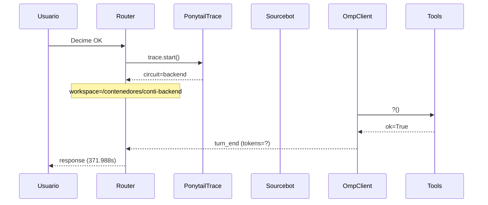

# Traza: Decime OK

- **Circuito**: `backend`
- **Workspace**: `/contenedores/conti-backend`
- **Inicio**: 2026-07-03T18:53:32.334639-03:00
- **Fin**: 2026-07-03T18:59:44.326809-03:00
- **Duración**: 371.992s
- **Eventos**: 17

## Diagrama de Secuencia



## Eventos Detallados

### 1. `start` (2026-07-03T18:53:32.334845-03:00)

```json
{
  "task": "Decime OK",
  "payload_keys": [
    "messages",
    "circuit",
    "_circuit",
    "_session"
  ],
  "circuit": "backend",
  "traces_dir": "/app/logs/ponytail"
}
```

### 2. `circuit_selected` (2026-07-03T18:53:32.336610-03:00)

```json
{
  "id": "backend",
  "workspace": "/contenedores/conti-backend",
  "session_id": "aab5e82d00d4",
  "is_new_session": true
}
```

### 3. `governance_tool` (2026-07-03T18:53:32.339957-03:00)

```json
{
  "tool": "get_onboarding",
  "chars": 195
}
```

### 4. `governance_tool` (2026-07-03T18:53:32.341616-03:00)

```json
{
  "tool": "get_rules",
  "chars": 438
}
```

### 5. `governance_tool` (2026-07-03T18:53:32.343608-03:00)

```json
{
  "tool": "get_config",
  "chars": 3246
}
```

### 6. `governance_injected` (2026-07-03T18:53:32.343622-03:00)

```json
{
  "onboarding_len": 3939,
  "is_new_session": true
}
```

### 7. `openhands_orchestrator_start` (2026-07-03T18:53:32.379685-03:00)

```json
{
  "circuit": "backend",
  "workspace": "/contenedores/conti-backend",
  "is_new_session": false,
  "prompt_len": 9,
  "governance_len": 3939
}
```

### 8. `conversation_created` (2026-07-03T18:54:42.777597-03:00)

```json
{
  "conversation_id": "a528a60d-0076-4ec2-98a9-6ba3e526148d",
  "workspace": "/contenedores/conti-backend"
}
```

### 9. `system_prompt` (2026-07-03T18:54:42.777607-03:00)

```json
{
  "length": 9,
  "is_new_session": false,
  "governance_chars": 3939,
  "circuit": "backend",
  "workspace": "/contenedores/conti-backend"
}
```

### 10. `goal_sent` (2026-07-03T18:54:42.785877-03:00)

```json
{
  "conversation_id": "a528a60d-0076-4ec2-98a9-6ba3e526148d",
  "prompt_len": 9
}
```

### 11. `omp_execution_status` (2026-07-03T18:55:30.952295-03:00)

```json
{
  "status": "running"
}
```

### 12. `omp_tool_start` (2026-07-03T18:55:34.991360-03:00)

```json
{
  "tool": "?",
  "args": {}
}
```

### 13. `omp_tool_end` (2026-07-03T18:55:34.991367-03:00)

```json
{
  "tool": "?",
  "result": "",
  "ok": true
}
```

### 14. `omp_execution_status` (2026-07-03T18:55:34.991396-03:00)

```json
{
  "status": "finished"
}
```

### 15. `omp_turn_end` (2026-07-03T18:56:05.521167-03:00)

```json
{
  "event_type": "turn_end",
  "status": "complete"
}
```

### 16. `openhands_orchestrator_end` (2026-07-03T18:59:44.322404-03:00)

```json
{
  "conversation_id": "a528a60d-0076-4ec2-98a9-6ba3e526148d",
  "response_len": 2,
  "status": "ok"
}
```

### 17. `end` (2026-07-03T18:59:44.322587-03:00)

```json
{
  "duration_s": 371.988
}
```

## Prompt Completo (input del usuario)

```text
Decime OK
```
