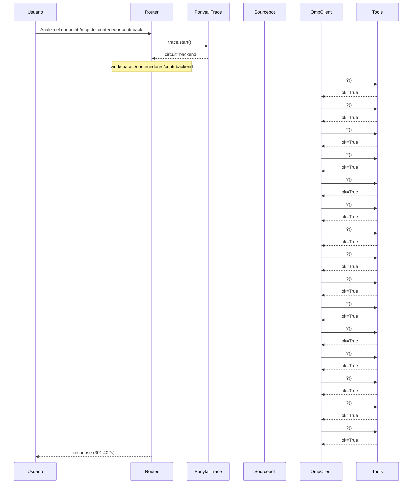

# Traza: Analiza el endpoint /mcp del contenedor conti-backend y documenta todas las tools en un documento mcp_tools_doc.md

- **Circuito**: `backend`
- **Workspace**: `/contenedores/conti-backend`
- **Inicio**: 2026-07-03T19:11:07.439489-03:00
- **Fin**: 2026-07-03T19:16:08.843876-03:00
- **Duración**: 301.404s
- **Eventos**: 43

## Diagrama de Secuencia



## Eventos Detallados

### 1. `start` (2026-07-03T19:11:07.439582-03:00)

```json
{
  "task": "Analiza el endpoint /mcp del contenedor conti-backend y documenta todas las tools en un documento mcp_tools_doc.md",
  "payload_keys": [
    "messages",
    "circuit",
    "_circuit",
    "_session"
  ],
  "circuit": "backend",
  "traces_dir": "/app/logs/ponytail"
}
```

### 2. `circuit_selected` (2026-07-03T19:11:07.441518-03:00)

```json
{
  "id": "backend",
  "workspace": "/contenedores/conti-backend",
  "session_id": "c52d171e5f69",
  "is_new_session": true
}
```

### 3. `governance_tool` (2026-07-03T19:11:07.442839-03:00)

```json
{
  "tool": "get_onboarding",
  "chars": 195
}
```

### 4. `governance_tool` (2026-07-03T19:11:07.444237-03:00)

```json
{
  "tool": "get_rules",
  "chars": 438
}
```

### 5. `governance_tool` (2026-07-03T19:11:07.446591-03:00)

```json
{
  "tool": "get_config",
  "chars": 3246
}
```

### 6. `governance_injected` (2026-07-03T19:11:07.446605-03:00)

```json
{
  "onboarding_len": 3939,
  "is_new_session": true
}
```

### 7. `openhands_orchestrator_start` (2026-07-03T19:11:07.480498-03:00)

```json
{
  "circuit": "backend",
  "workspace": "/contenedores/conti-backend",
  "is_new_session": false,
  "prompt_len": 114,
  "governance_len": 3939
}
```

### 8. `conversation_created` (2026-07-03T19:11:07.522474-03:00)

```json
{
  "conversation_id": "bfbdb1f0-5e51-4ee8-9346-399500c240bc",
  "workspace": "/contenedores/conti-backend"
}
```

### 9. `system_prompt` (2026-07-03T19:11:07.522479-03:00)

```json
{
  "length": 114,
  "is_new_session": false,
  "governance_chars": 3939,
  "circuit": "backend",
  "workspace": "/contenedores/conti-backend"
}
```

### 10. `goal_sent` (2026-07-03T19:11:07.529955-03:00)

```json
{
  "conversation_id": "bfbdb1f0-5e51-4ee8-9346-399500c240bc",
  "prompt_len": 114
}
```

### 11. `omp_execution_status` (2026-07-03T19:11:47.738796-03:00)

```json
{
  "status": "running"
}
```

### 12. `omp_tool_start` (2026-07-03T19:11:55.859280-03:00)

```json
{
  "tool": "?",
  "args": {}
}
```

### 13. `omp_tool_end` (2026-07-03T19:11:55.859287-03:00)

```json
{
  "tool": "?",
  "result": "",
  "ok": true
}
```

### 14. `omp_tool_start` (2026-07-03T19:11:59.943844-03:00)

```json
{
  "tool": "?",
  "args": {}
}
```

### 15. `omp_tool_end` (2026-07-03T19:11:59.943851-03:00)

```json
{
  "tool": "?",
  "result": "",
  "ok": true
}
```

### 16. `omp_tool_start` (2026-07-03T19:12:01.959358-03:00)

```json
{
  "tool": "?",
  "args": {}
}
```

### 17. `omp_tool_end` (2026-07-03T19:12:03.989998-03:00)

```json
{
  "tool": "?",
  "result": "",
  "ok": true
}
```

### 18. `omp_tool_start` (2026-07-03T19:12:06.065572-03:00)

```json
{
  "tool": "?",
  "args": {}
}
```

### 19. `omp_tool_end` (2026-07-03T19:12:06.065579-03:00)

```json
{
  "tool": "?",
  "result": "",
  "ok": true
}
```

### 20. `omp_tool_start` (2026-07-03T19:12:10.186550-03:00)

```json
{
  "tool": "?",
  "args": {}
}
```

### 21. `omp_tool_end` (2026-07-03T19:12:12.233510-03:00)

```json
{
  "tool": "?",
  "result": "",
  "ok": true
}
```

### 22. `omp_tool_start` (2026-07-03T19:12:14.266124-03:00)

```json
{
  "tool": "?",
  "args": {}
}
```

### 23. `omp_tool_end` (2026-07-03T19:12:45.048571-03:00)

```json
{
  "tool": "?",
  "result": "",
  "ok": true
}
```

### 24. `omp_tool_start` (2026-07-03T19:12:49.171981-03:00)

```json
{
  "tool": "?",
  "args": {}
}
```

### 25. `omp_tool_end` (2026-07-03T19:12:55.286085-03:00)

```json
{
  "tool": "?",
  "result": "",
  "ok": true
}
```

### 26. `omp_tool_start` (2026-07-03T19:12:59.375440-03:00)

```json
{
  "tool": "?",
  "args": {}
}
```

### 27. `omp_tool_end` (2026-07-03T19:12:59.375448-03:00)

```json
{
  "tool": "?",
  "result": "",
  "ok": true
}
```

### 28. `omp_tool_start` (2026-07-03T19:13:03.469838-03:00)

```json
{
  "tool": "?",
  "args": {}
}
```

### 29. `omp_tool_end` (2026-07-03T19:13:03.469846-03:00)

```json
{
  "tool": "?",
  "result": "",
  "ok": true
}
```

### 30. `omp_tool_start` (2026-07-03T19:13:07.593646-03:00)

```json
{
  "tool": "?",
  "args": {}
}
```

### 31. `omp_tool_end` (2026-07-03T19:13:07.593654-03:00)

```json
{
  "tool": "?",
  "result": "",
  "ok": true
}
```

### 32. `omp_tool_start` (2026-07-03T19:13:11.734339-03:00)

```json
{
  "tool": "?",
  "args": {}
}
```

### 33. `omp_tool_end` (2026-07-03T19:13:11.734347-03:00)

```json
{
  "tool": "?",
  "result": "",
  "ok": true
}
```

### 34. `omp_tool_start` (2026-07-03T19:13:15.814329-03:00)

```json
{
  "tool": "?",
  "args": {}
}
```

### 35. `omp_tool_end` (2026-07-03T19:13:15.814337-03:00)

```json
{
  "tool": "?",
  "result": "",
  "ok": true
}
```

### 36. `omp_tool_start` (2026-07-03T19:13:21.971734-03:00)

```json
{
  "tool": "?",
  "args": {}
}
```

### 37. `omp_tool_end` (2026-07-03T19:13:21.971743-03:00)

```json
{
  "tool": "?",
  "result": "",
  "ok": true
}
```

### 38. `omp_tool_start` (2026-07-03T19:13:30.198869-03:00)

```json
{
  "tool": "?",
  "args": {}
}
```

### 39. `omp_tool_end` (2026-07-03T19:13:30.198878-03:00)

```json
{
  "tool": "?",
  "result": "",
  "ok": true
}
```

### 40. `omp_tool_start` (2026-07-03T19:13:36.530660-03:00)

```json
{
  "tool": "?",
  "args": {}
}
```

### 41. `omp_tool_end` (2026-07-03T19:13:36.530669-03:00)

```json
{
  "tool": "?",
  "result": "",
  "ok": true
}
```

### 42. `openhands_orchestrator_end` (2026-07-03T19:16:08.839604-03:00)

```json
{
  "conversation_id": "bfbdb1f0-5e51-4ee8-9346-399500c240bc",
  "response_len": 0,
  "status": "ok"
}
```

### 43. `end` (2026-07-03T19:16:08.841108-03:00)

```json
{
  "duration_s": 301.402
}
```

## Prompt Completo (input del usuario)

```text
Analiza el endpoint /mcp del contenedor conti-backend y documenta todas las tools en un documento mcp_tools_doc.md
```
