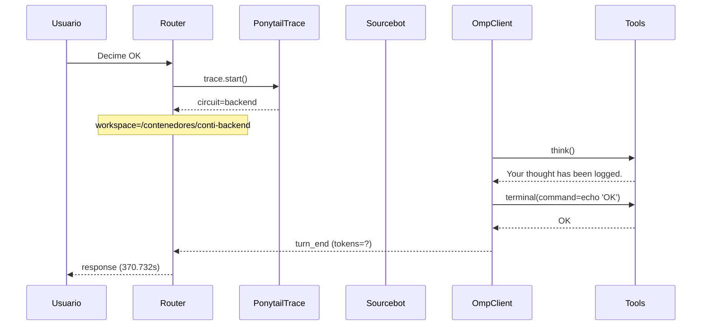

# Traza: Decime OK

- **Circuito**: `backend`
- **Workspace**: `/contenedores/conti-backend`
- **Inicio**: 2026-07-03T22:31:39.781053-03:00
- **Fin**: 2026-07-03T22:37:50.516986-03:00
- **Duración**: 370.736s
- **Eventos**: 19

## Diagrama de Secuencia



## Eventos Detallados

### 1. `start` (2026-07-03T22:31:39.782631-03:00)

```json
{
  "task": "Decime OK",
  "payload_keys": [
    "messages",
    "circuit",
    "_circuit",
    "_session"
  ],
  "circuit": "backend",
  "traces_dir": "/contenedores/conti-backend/.ponytail/traces/2026-07-03_decime_ok_f7d103ffbfd5"
}
```

### 2. `circuit_selected` (2026-07-03T22:31:39.785305-03:00)

```json
{
  "id": "backend",
  "workspace": "/contenedores/conti-backend",
  "session_id": "f7d103ffbfd5",
  "is_new_session": true
}
```

### 3. `governance_tool` (2026-07-03T22:31:39.795509-03:00)

```json
{
  "tool": "get_onboarding",
  "chars": 195
}
```

### 4. `governance_tool` (2026-07-03T22:31:39.809817-03:00)

```json
{
  "tool": "get_rules",
  "chars": 438
}
```

### 5. `governance_tool` (2026-07-03T22:31:39.814306-03:00)

```json
{
  "tool": "get_config",
  "chars": 3246
}
```

### 6. `governance_injected` (2026-07-03T22:31:39.814329-03:00)

```json
{
  "onboarding_len": 3939,
  "is_new_session": true
}
```

### 7. `openhands_orchestrator_start` (2026-07-03T22:31:39.867764-03:00)

```json
{
  "circuit": "backend",
  "workspace": "/contenedores/conti-backend",
  "is_new_session": false,
  "prompt_len": 9,
  "governance_len": 3939
}
```

### 8. `conversation_created` (2026-07-03T22:32:50.161537-03:00)

```json
{
  "conversation_id": "202b2ecf-3283-4674-92cb-04e2b38928d7",
  "workspace": "/contenedores/conti-backend"
}
```

### 9. `system_prompt` (2026-07-03T22:32:50.161546-03:00)

```json
{
  "length": 9,
  "is_new_session": false,
  "governance_chars": 3939,
  "circuit": "backend",
  "workspace": "/contenedores/conti-backend"
}
```

### 10. `goal_sent` (2026-07-03T22:32:50.168707-03:00)

```json
{
  "conversation_id": "202b2ecf-3283-4674-92cb-04e2b38928d7",
  "prompt_len": 9
}
```

### 11. `omp_execution_status` (2026-07-03T22:33:24.403116-03:00)

```json
{
  "status": "running"
}
```

### 12. `omp_tool_start` (2026-07-03T22:33:32.505768-03:00)

```json
{
  "tool": "think",
  "args": {},
  "reasoning": "El usuario me dice \"Decime OK\". Esto parece ser una solicitud simple para responder \"OK\". Sin embargo, debo considerar el contexto: soy un asistente de IA que puede interactuar con una computadora para resolver tareas. El usuario no ha proporcionado ninguna tarea específica, solo pide que diga \"OK\"."
}
```

### 13. `omp_tool_end` (2026-07-03T22:33:32.505781-03:00)

```json
{
  "tool": "think",
  "result": "Your thought has been logged.",
  "ok": true,
  "exit_code": null
}
```

### 14. `omp_tool_start` (2026-07-03T22:33:36.546099-03:00)

```json
{
  "tool": "terminal",
  "args": {
    "command": "echo \"OK\""
  },
  "reasoning": "Perfecto, he registrado mi razonamiento. Ahora responderé al usuario."
}
```

### 15. `omp_tool_end` (2026-07-03T22:33:36.546108-03:00)

```json
{
  "tool": "terminal",
  "result": "OK",
  "ok": true,
  "exit_code": 0
}
```

### 16. `omp_execution_status` (2026-07-03T22:33:40.577594-03:00)

```json
{
  "status": "finished"
}
```

### 17. `omp_turn_end` (2026-07-03T22:33:58.796367-03:00)

```json
{
  "event_type": "turn_end",
  "status": "complete",
  "iteration": 1
}
```

### 18. `openhands_orchestrator_end` (2026-07-03T22:37:50.512882-03:00)

```json
{
  "conversation_id": "202b2ecf-3283-4674-92cb-04e2b38928d7",
  "response_len": 147,
  "status": "ok"
}
```

### 19. `end` (2026-07-03T22:37:50.513064-03:00)

```json
{
  "duration_s": 370.732
}
```

## Prompt Completo (input del usuario)

```text
Decime OK
```
