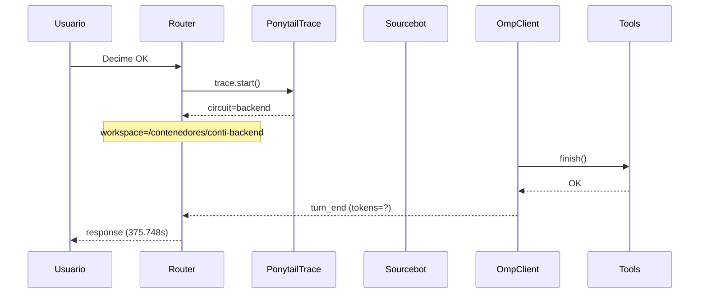

# Traza: Decime OK

- **Circuito**: `backend`
- **Workspace**: `/contenedores/conti-backend`
- **Inicio**: 2026-07-03T22:41:18.658370-03:00
- **Fin**: 2026-07-03T22:47:34.409345-03:00
- **Duración**: 375.751s
- **Eventos**: 17

## Diagrama de Secuencia



## Eventos Detallados

### 1. `start` (2026-07-03T22:41:18.659007-03:00)

```json
{
  "task": "Decime OK",
  "payload_keys": [
    "messages",
    "circuit",
    "_circuit",
    "_session"
  ],
  "circuit": "backend",
  "traces_dir": "/contenedores/conti-backend/.ponytail/traces/2026-07-03_decime_ok_2478206d1244"
}
```

### 2. `circuit_selected` (2026-07-03T22:41:18.663895-03:00)

```json
{
  "id": "backend",
  "workspace": "/contenedores/conti-backend",
  "session_id": "2478206d1244",
  "is_new_session": true
}
```

### 3. `governance_tool` (2026-07-03T22:41:18.670047-03:00)

```json
{
  "tool": "get_onboarding",
  "chars": 195
}
```

### 4. `governance_tool` (2026-07-03T22:41:18.671928-03:00)

```json
{
  "tool": "get_rules",
  "chars": 438
}
```

### 5. `governance_tool` (2026-07-03T22:41:18.676842-03:00)

```json
{
  "tool": "get_config",
  "chars": 3246
}
```

### 6. `governance_injected` (2026-07-03T22:41:18.676862-03:00)

```json
{
  "onboarding_len": 3939,
  "is_new_session": true
}
```

### 7. `openhands_orchestrator_start` (2026-07-03T22:41:18.732133-03:00)

```json
{
  "circuit": "backend",
  "workspace": "/contenedores/conti-backend",
  "is_new_session": false,
  "prompt_len": 9,
  "governance_len": 3939
}
```

### 8. `conversation_created` (2026-07-03T22:42:34.249193-03:00)

```json
{
  "conversation_id": "71fbbfa1-932f-4389-bf35-d1a09e153393",
  "workspace": "/contenedores/conti-backend"
}
```

### 9. `system_prompt` (2026-07-03T22:42:34.249204-03:00)

```json
{
  "length": 9,
  "is_new_session": false,
  "governance_chars": 3939,
  "circuit": "backend",
  "workspace": "/contenedores/conti-backend"
}
```

### 10. `goal_sent` (2026-07-03T22:42:34.267940-03:00)

```json
{
  "conversation_id": "71fbbfa1-932f-4389-bf35-d1a09e153393",
  "prompt_len": 9
}
```

### 11. `omp_execution_status` (2026-07-03T22:43:13.716455-03:00)

```json
{
  "status": "running"
}
```

### 12. `omp_tool_start` (2026-07-03T22:43:50.372311-03:00)

```json
{
  "tool": "finish",
  "args": {},
  "reasoning": "El usuario me pide que diga \"OK\". Parece una solicitud simple. Sin embargo, debo considerar si hay algún contexto o tarea específica que el usuario quiere que realice. Podría ser una verificación de que el sistema está funcionando. Dado que no hay instrucciones adicionales, simplemente responderé co"
}
```

### 13. `omp_tool_end` (2026-07-03T22:43:50.372322-03:00)

```json
{
  "tool": "finish",
  "result": "OK",
  "ok": true,
  "exit_code": null
}
```

### 14. `omp_execution_status` (2026-07-03T22:43:50.372327-03:00)

```json
{
  "status": "finished"
}
```

### 15. `omp_turn_end` (2026-07-03T22:44:22.935197-03:00)

```json
{
  "event_type": "turn_end",
  "status": "complete",
  "iteration": 1
}
```

### 16. `openhands_orchestrator_end` (2026-07-03T22:47:34.406435-03:00)

```json
{
  "conversation_id": "71fbbfa1-932f-4389-bf35-d1a09e153393",
  "response_len": 2,
  "status": "ok"
}
```

### 17. `end` (2026-07-03T22:47:34.406614-03:00)

```json
{
  "duration_s": 375.748
}
```

## Prompt Completo (input del usuario)

```text
Decime OK
```
