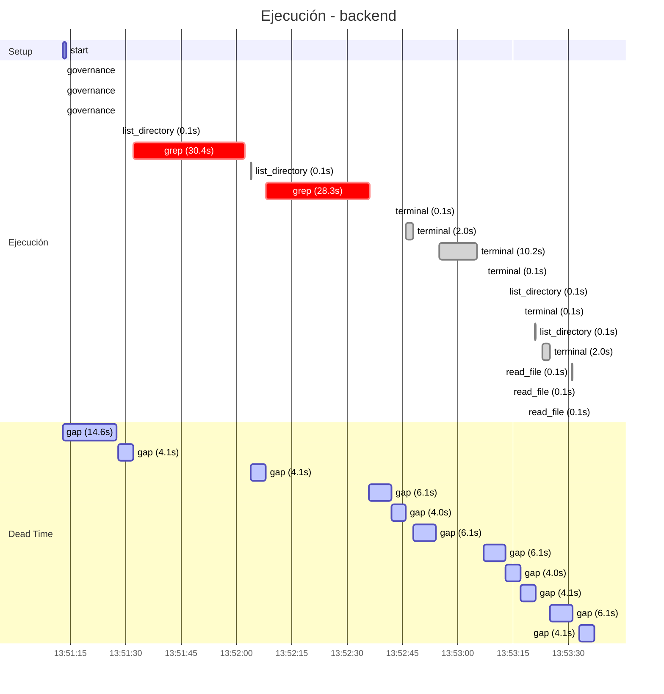

# Traza: Analiza el endpoint /mcp del contenedor conti-backend y documenta todas las tools en un documento mc...[truncated]

- **Circuito**: `backend`
- **Workspace**: `/contenedores/conti-backend`
- **Inicio**: 2026-07-04T13:51:13.399688-03:00
- **Fin**: 2026-07-04T13:56:13.943445-03:00
- **Duración**: 300.544s
- **Eventos**: 43

## Timeline (Gantt)



## Tools Ejecutadas

| # | Tool | Inicio | Duración | OK | Args/Result |
|---|------|--------|----------|-----|-------------|
| 1 | `governance:get_onboarding` | 13:51:13 | 0.0s | ✅ |  |
| 2 | `governance:get_rules` | 13:51:13 | 0.0s | ✅ |  |
| 3 | `governance:get_config` | 13:51:13 | 0.0s | ✅ |  |
| 4 | `list_directory` | 13:51:28 | 0.0s | ✅ | Listed directory: /contenedores/conti-backend (67 entries) |
| 5 | `grep` | 13:51:32 | 30.4s | ❌ | `/contenedores/conti-backend` |
| 6 | `list_directory` | 13:52:04 | 0.0s | ✅ | Listed directory: /contenedores/conti-backend (274 entries) |
| 7 | `grep` | 13:52:08 | 28.3s | ❌ | `/contenedores/conti-backend` |
| 8 | `terminal` | 13:52:42 | 0.0s | ✅ | `find /contenedores/conti-backend -name "*.py" -exec grep -l ...[truncated]` |
| 9 | `terminal` | 13:52:46 | 2.0s | ✅ | `find /contenedores/conti-backend -name "*.py" | xargs grep -...[truncated]` |
| 10 | `terminal` | 13:52:55 | 10.2s | ✅ | `find /contenedores/conti-backend -name "*.py" -not -path "*/...[truncated]` |
| 11 | `terminal` | 13:53:07 | 0.0s | ✅ | `ls -la /contenedores/conti-backend/` |
| 12 | `list_directory` | 13:53:13 | 0.0s | ✅ | Listed directory: /contenedores/conti-backend/app (19 entrie...[truncated] |
| 13 | `terminal` | 13:53:17 | 0.0s | ✅ | `ls -la /contenedores/conti-backend/app/` |
| 14 | `list_directory` | 13:53:21 | 0.0s | ✅ | Listed directory: /contenedores/conti-backend/app/mcp (4 ent...[truncated] |
| 15 | `terminal` | 13:53:23 | 2.0s | ✅ | `find /contenedores/conti-backend/app/mcp -type f -name "*.py...[truncated]` |
| 16 | `read_file` | 13:53:31 | 0.0s | ✅ | Read file: /contenedores/conti-backend/app/mcp/router.py    ...[truncated] |
| 17 | `read_file` | 13:53:33 | 0.0s | ✅ | Read file: /contenedores/conti-backend/app/mcp/schemas.py   ...[truncated] |
| 18 | `read_file` | 13:53:37 | 0.0s | ✅ | Read file: /contenedores/conti-backend/app/services/registry...[truncated] |

## Reasoning del Agente

### 13:51:28 → `list_directory`

> El usuario quiere que analice el endpoint /mcp del contenedor conti-backend y documente todas las tools en un documento mcp_tools_doc.md. Primero necesito explorar el código fuente para entender la estructura del proyecto y encontrar el endpoint /mcp. Voy a empezar listando el directorio actual y bu

### 13:51:32 → `grep`

> Voy a ver el contenido del directorio. Parece que hay muchos archivos. Necesito buscar archivos que contengan "/mcp" o "mcp" en su contenido. Primero veamos la estructura del proyecto.

### 13:52:04 → `list_directory`

> The grep timed out. Let me try more targeted searches.

### 13:52:08 → `grep`

> Let me search more specifically.

### 13:52:42 → `terminal`

> El grep está tardando demasiado. Voy a usar `find` y `grep` de manera más específica.

### 13:52:46 → `terminal`

> Let me try a different approach.

### 13:52:55 → `terminal`

> Interesante, veo un archivo `mcp_router.py` en el caché de uv. Pero también necesito ver la estructura real del proyecto. Déjame buscar en el directorio raíz. Primero veamos la estructura de archivos fuente.

### 13:53:07 → `terminal`

> The find command is timing out because there are too many files. Let me try a more targeted approach.

### 13:53:13 → `list_directory`

> ¡Perfecto! Veo que ya existe un archivo `mcp_tools_doc.md`. El usuario quiere que documente todas las tools del endpoint /mcp. Primero necesito entender la estructura del proyecto. Veo que hay un directorio `app` que probablemente contiene el código fuente principal. También hay un archivo `mcp-loca

### 13:53:17 → `terminal`

> Déjame ver la estructura del directorio app.

### 13:53:21 → `list_directory`

> ¡Excelente! Veo un directorio `mcp`. Voy a explorar ese directorio para entender la estructura del endpoint /mcp. También hay un directorio `tools`. Primero veamos el contenido del directorio mcp.

### 13:53:23 → `terminal`

> Déjame ver qué hay en el directorio mcp.

### 13:53:31 → `read_file`

> Perfecto. Voy a examinar el archivo router.py para entender el endpoint /mcp. También necesito ver schemas.py para entender los modelos de datos. Primero veamos router.py.

### 13:53:33 → `read_file`

> Ahora necesito ver el archivo schemas.py para entender los modelos de datos, y también necesito ver el servicio de registro para entender qué tools están disponibles. Primero veamos schemas.py.

### 13:53:37 → `read_file`

> Ahora necesito ver el servicio de registro para entender qué tools están disponibles. Veamos el archivo registry_service.py.

## Prompt Completo (input del usuario)

```text
Analiza el endpoint /mcp del contenedor conti-backend y documenta todas las tools en un documento mcp_tools_doc.md
```
