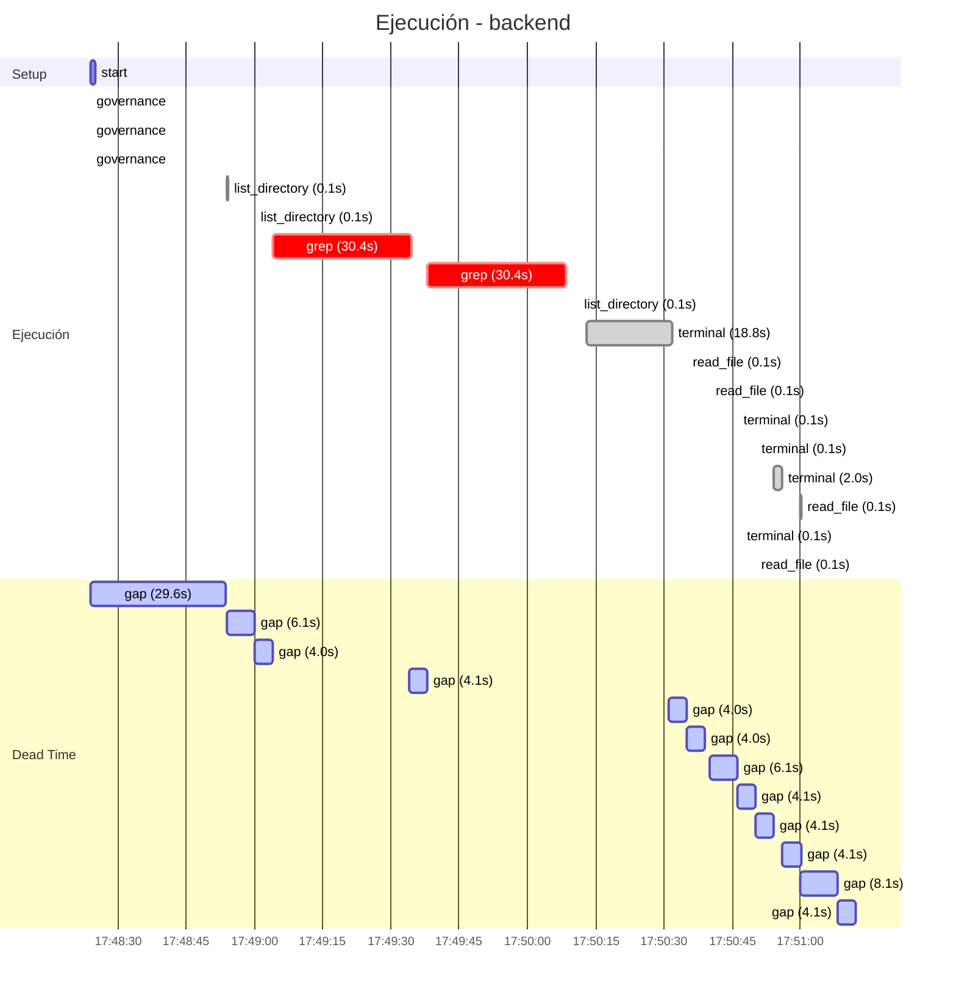

# Traza: Analiza el endpoint /mcp del contenedor conti-backend y documenta todas las tools en un documento mc...[truncated]

- **Circuito**: `backend`
- **Conversación OpenHands**: [`968a1ba5-7d33-4c2d-9f72-cab5a6dcf268`](http://localhost:3012/conversations/968a1ba5-7d33-4c2d-9f72-cab5a6dcf268)
- **Workspace**: `/contenedores/conti-backend`
- **Inicio**: 2026-07-04T17:48:24.455485-03:00
- **Fin**: 2026-07-04T17:58:24.934868-03:00
- **Duración**: 600.479s
- **Eventos**: 56

## Timeline (Gantt)



## Tools Ejecutadas

| # | Tool | Inicio | Duración | OK | Args/Result |
|---|------|--------|----------|-----|-------------|
| 1 | `governance:get_onboarding` | 17:48:24 | 0.0s | ✅ |  |
| 2 | `governance:get_rules` | 17:48:24 | 0.0s | ✅ |  |
| 3 | `governance:get_config` | 17:48:24 | 0.0s | ✅ |  |
| 4 | `list_directory` | 17:48:54 | 0.0s | ✅ | Listed directory: /contenedores/conti-backend (67 entries) |
| 5 | `list_directory` | 17:49:00 | 0.0s | ✅ | Listed directory: /contenedores/conti-backend (274 entries) |
| 6 | `grep` | 17:49:04 | 30.4s | ❌ | `/contenedores/conti-backend` |
| 7 | `grep` | 17:49:38 | 30.4s | ❌ | `/contenedores/conti-backend` |
| 8 | `list_directory` | 17:50:11 | 0.0s | ✅ | Listed directory: /contenedores/conti-backend (67 entries) |
| 9 | `terminal` | 17:50:13 | 18.8s | ✅ | `ls -la /contenedores/conti-backend/` |
| 10 | `read_file` | 17:50:35 | 0.0s | ✅ | Read file: /contenedores/conti-backend/mcp_tools_doc.md (sho...[truncated] |
| 11 | `read_file` | 17:50:40 | 0.0s | ✅ | Read file: /contenedores/conti-backend/mcp_tools_doc.md    1...[truncated] |
| 12 | `terminal` | 17:50:46 | 0.0s | ✅ | `find /contenedores/conti-backend -name "*.py" -type f | head...[truncated]` |
| 13 | `terminal` | 17:50:50 | 0.0s | ✅ | `find /contenedores/conti-backend/app -name "*.py" -type f | ...[truncated]` |
| 14 | `terminal` | 17:50:54 | 2.0s | ✅ | `find /contenedores/conti-backend -name "*mcp*" -type f | gre...[truncated]` |
| 15 | `read_file` | 17:51:00 | 0.0s | ✅ | Read file: /contenedores/conti-backend/app/openhands_agent/r...[truncated] |
| 16 | `terminal` | 17:51:08 | 0.0s | ✅ | `grep -rl "mcp\|MCP" /contenedores/conti-backend/app --includ...[truncated]` |
| 17 | `read_file` | 17:51:12 | 0.0s | ✅ | Read file: /contenedores/conti-backend/app/mcp/router.py    ...[truncated] |

## Reasoning del Agente

### 17:48:54 → `list_directory`

> El usuario quiere que analice el endpoint /mcp del contenedor conti-backend y documente todas las tools en un documento mcp_tools_doc.md. Primero necesito explorar la estructura del proyecto conti-backend para entender dónde está el endpoint /mcp y qué tools están disponibles. Voy a usar el explorad

### 17:49:00 → `list_directory`

> Necesito ver el contenido del directorio para entender la estructura. Usaré list_directory recursivo para ver los archivos principales.

### 17:49:04 → `grep`

> La salida es muy larga. Necesito buscar archivos que contengan "/mcp" o "MCP". Usaré grep para encontrar archivos relevantes.

### 17:49:38 → `grep`

> The timeout suggests a large codebase. Let me try a more targeted search.

### 17:50:11 → `list_directory`

> The search is timing out. Let me look at the directory structure first to understand the project layout.

### 17:50:13 → `terminal`

> It seems the list_directory didn't show the contents. Let me try a different approach.

### 17:50:35 → `read_file`

> Interesante, ya veo que hay un archivo `mcp_tools_doc.md` existente. Voy a revisarlo primero para ver si ya tiene documentación.

### 17:50:40 → `read_file`

> Voy a ver el resto del archivo para tener la documentación completa.

### 17:50:46 → `terminal`

> El archivo ya existe y tiene una documentación bastante completa. Sin embargo, el usuario pide que analice el endpoint /mcp del contenedor conti-backend y documente todas las tools en un documento mcp_tools_doc.md. 

Parece que ya hay un archivo existente. Necesito verificar si está actualizado o si

### 17:50:50 → `terminal`

> Necesito buscar específicamente los archivos del backend MCP. Voy a buscar en el directorio `app`.

### 17:50:54 → `terminal`

> Busco archivos relacionados con MCP. Debe haber un router o módulo para MCP.

### 17:51:00 → `read_file`

> Necesito ver el archivo principal del router MCP. Veamos el archivo `/contenedores/conti-backend/app/openhands_agent/router.py`.

### 17:51:08 → `terminal`

> Let me fix the parameter name.

### 17:51:12 → `read_file`

> Encontré el directorio MCP. Vamos a ver el router y los esquemas.

## Prompt Inyectado (governance + reglas + user)

```text
## get_rules

# Rules — Conti Backend (actualizado PLAN_3 v1.5, 30/jun/2026)

## Reglas de vida o muerte

1. NUNCA ejecutar `git commit`, `git push`, `git merge`, `git reset`,
   `git rebase` directo en el shell del agente.
   Solo usar las tools dedicadas: `run_salvar` (preview), `run_promover`
   (preview), `run_hotfix_sync` (preview). Estas pasan por el Gatekeeper
   (`validate_diff`) antes de aplicar.

2. NUNCA ejecutar `bash /compose/3-despliegue.sh` ni
   `docker compose -f producion.yml up -d`. Solo Luis puede deployar.

3. Toda acción destructiva → preview + confirmación explícita (`confirm=true`).

4. Idioma: siempre Español.

5. `/compose` es RW SOLO para git (commit/push en main, git pull desde
   origin). Cambios de código en producción normalmente van por el flujo
   develop → main. Edición directa en `/compose` solo se permite para
   hotfixes urgentes.

## Reglas operacionales

6. Operar DENTRO del contenedor, sin SSH (los bind-mounts ya conectan el
   host con el working dir del agente).

7. Si la tarea accede a algo FUERA de `/desarrollo`, `/compose`,
   `/contenedores/conti-backend`, `/home/nanobot`: pedir credenciales a
   Luis explícitamente antes de proceder.

8. Acción sobre palabras: nada de "¡Gran pregunta!", "¡Excelente!", etc.
   Respuestas técnicas, directas y concisas.

9. Si Luis modificó archivos en `/compose` directamente, avisar del
   riesgo antes de cualquier operación: `3-despliegue.sh` puede hacer
   `git reset --hard` y borrar archivos uncommitted.

## Reglas MCP

10. Usar solo tools registradas por el backend (`get_rules`, `get_config`,
    `get_onboarding` las lista).
11. No inventar nombres de tools ni schemas.
12. Validar argumentos antes de ejecutar mutaciones.
13. Respetar allowlists de paths y visibilidades del circuito activo.

## Reglas de los 4 circuitos

14. `circuit: desarrollo` (workspace `/desarrollo`, branch `develop`):
    - `run_salvar` commitea y pushea a develop.
    - `run_promover` y `run_hotfix_sync` NO aplican acá.
    - Code editing: editar solo dentro de `/desarrollo`. Validar con
      `validate_python_syntax` y opcionalmente `run_pytest`.
    - **Trazas de Ponytail**: Se guardan en `/desarrollo/.ponytail/traces/`
      con formato `YYYY-MM-DD_desarrollo_tr-<hash>.md`.

15. `circuit: produccion` (workspace operativo `/desarrollo`, branch
    `develop` para promover; `/compose` para hotfix en main):
    - `run_promover` fusiona develop → main (merge --no-ff) + push main.
    - `run_hotfix_sync` commitea cambios en `/compose` (main) y los
      sincroniza a `/desarrollo` (develop) via merge --no-ff.
    - NO corre `3-despliegue.sh` (solo Luis).
    - El deploy real lo hace Luis fuera del agente.
    - Code editing: editar solo dentro de `/compose` (para hotfix) o
      `/desarrollo` (vía `run_promover` después). NO editar código
      en `/compose` para cambios normales — usar flujo develop→main.
    - **Trazas de Ponytail**:
      - Si el usuario edita archivos directamente en `/compose`, las trazas
        se guardan en `/compose/.ponytail/traces/` (rama `main`).
      - Si el usuario trabaja en `/desarrollo` y promueve a `main`, las trazas
        se guardan en `/desarrollo/.ponytail/traces/` (rama `develop`).

16. `circuit: backend` (workspace `/contenedores/conti-backend`, branch
    `main`):
    - `run_salvar` commitea y pushea a main directamente (este repo solo
      tiene main).
    - `run_promover` y `run_hotfix_sync` NO aplican.
    - **Code editing OBLIGATORIO pre-commit**:
      1. `validate_python_syntax(paths=[<archivos>])` → debe pasar.
      2. `run_pytest(circuit="backend", test_path=<módulo_afectado>)` →
         debe pasar.
      3. (Opcional pero recomendado) `run_pytest(circuit="backend")` →
         suite completa verde.
    - Si validate_python_syntax falla → NO commitear, arreglar primero.
    - Si run_pytest falla → NO commitear, arreglar primero.
    - **Trazas de Ponytail**: Se guardan en `/contenedores/conti-backend/.ponytail/traces/`
      con formato `YYYY-MM-DD_backend_tr-<hash>.md`.

17. `circuit: libre` (workspace `/tmp/free-agent`):
    - SIN acceso a repos git. No tools nativas.
    - Categorías MCP permitidas: bootstrap, rag, odoo, documents, sheets,
      catolico, filesystem. **NO** tiene gitops, stack, code_edit.
    - Si Luis pasa una ruta del host no bind-mounted, pedir credenciales.
    - Si la tarea requiere editar código: usar `detect_circuit_from_path`
      primero para saber a qué circuito mandar la edición, y pedirle a
      Luis que la haga explícitamente en ese circuito.

## Reglas del flujo hotfix sync (`run_hotfix_sync`)

18. `run_hotfix_sync` requiere:
    - `/compose` limpio, en rama `main`, con commits adelantados de
      `origin/main` (los del hotfix).
    - `/desarrollo` limpio, en rama `develop`.

19. Si `/desarrollo` tiene commits locales no pusheados que conflictúan
    con main, el merge aborta y reporta. NO forzar — pedir a Luis que
    resuelva el conflicto manualmente.

20. Orden ob
```
