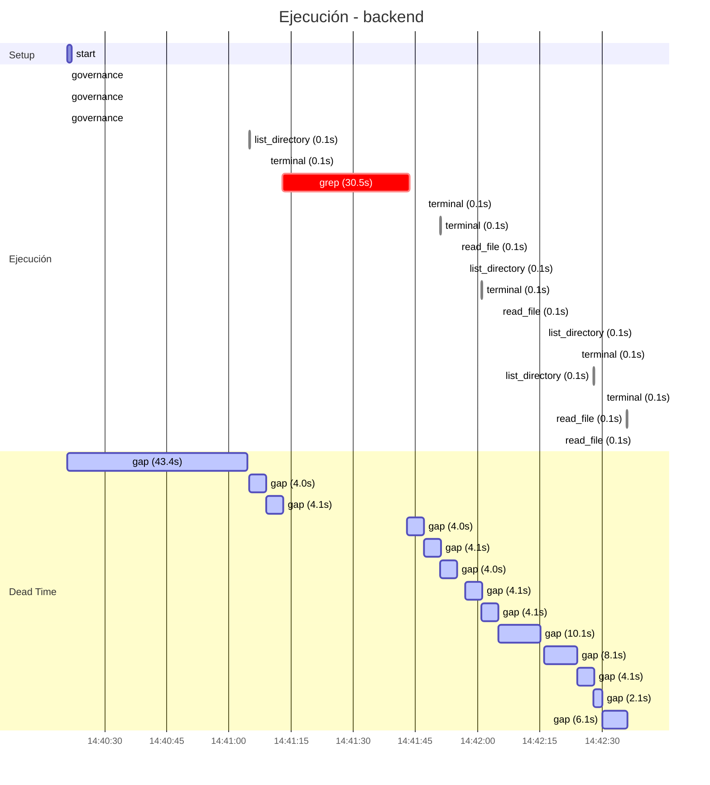

# Traza: Analiza el endpoint /mcp del contenedor conti-backend y documenta todas las tools en un documento mc...[truncated]

- **Circuito**: `backend`
- **Workspace**: `/contenedores/conti-backend`
- **Inicio**: 2026-07-04T14:40:21.683103-03:00
- **Fin**: 2026-07-04T14:50:23.768441-03:00
- **Duración**: 602.085s
- **Eventos**: 59

## Timeline (Gantt)



## Tools Ejecutadas

| # | Tool | Inicio | Duración | OK | Args/Result |
|---|------|--------|----------|-----|-------------|
| 1 | `governance:get_onboarding` | 14:40:21 | 0.0s | ✅ |  |
| 2 | `governance:get_rules` | 14:40:21 | 0.0s | ✅ |  |
| 3 | `governance:get_config` | 14:40:21 | 0.0s | ✅ |  |
| 4 | `list_directory` | 14:41:05 | 0.0s | ✅ | Listed directory: /contenedores/conti-backend (66 entries) |
| 5 | `terminal` | 14:41:09 | 0.0s | ✅ | `find /contenedores/conti-backend -type f -name "*.py" | head...[truncated]` |
| 6 | `grep` | 14:41:13 | 30.5s | ❌ | `/contenedores/conti-backend` |
| 7 | `terminal` | 14:41:47 | 0.0s | ✅ | `find /contenedores/conti-backend -name "requirements*.txt" -...[truncated]` |
| 8 | `terminal` | 14:41:51 | 0.0s | ✅ | `ls -la /contenedores/conti-backend/` |
| 9 | `read_file` | 14:41:55 | 0.0s | ✅ | Read file: /contenedores/conti-backend/requirements.txt     ...[truncated] |
| 10 | `list_directory` | 14:41:57 | 0.0s | ✅ | Listed directory: /contenedores/conti-backend/app (19 entrie...[truncated] |
| 11 | `terminal` | 14:42:01 | 0.0s | ✅ | `find /contenedores/conti-backend/app -type f -name "*.py" | ...[truncated]` |
| 12 | `read_file` | 14:42:05 | 0.0s | ❌ | Error: Path is a directory, not a file: /contenedores/conti-...[truncated] |
| 13 | `list_directory` | 14:42:16 | 0.0s | ✅ | Listed directory: /contenedores/conti-backend/app (126 entri...[truncated] |
| 14 | `terminal` | 14:42:24 | 0.0s | ✅ | `grep -r "/mcp" /contenedores/conti-backend/app --include="*....[truncated]` |
| 15 | `list_directory` | 14:42:28 | 0.0s | ✅ | Listed directory: /contenedores/conti-backend/app/mcp (4 ent...[truncated] |
| 16 | `terminal` | 14:42:30 | 0.0s | ✅ | `find /contenedores/conti-backend/app/mcp -type f -name "*.py...[truncated]` |
| 17 | `read_file` | 14:42:36 | 0.0s | ✅ | Read file: /contenedores/conti-backend/app/mcp/router.py    ...[truncated] |
| 18 | `read_file` | 14:42:38 | 0.0s | ✅ | Read file: /contenedores/conti-backend/app/services/registry...[truncated] |

## Reasoning del Agente

### 14:41:05 → `list_directory`

> El usuario quiere que analice el endpoint `/mcp` del contenedor `conti-backend` y documente todas las tools en un documento `mcp_tools_doc.md`. Primero necesito explorar el repositorio para entender la estructura y encontrar el código relacionado con MCP. Voy a empezar listando el directorio actual.

### 14:41:09 → `terminal`

> Necesito ver la lista completa. Voy a usar un comando bash para listar los archivos.

### 14:41:13 → `grep`

> Necesito buscar específicamente el endpoint `/mcp`. Voy a buscar en el código fuente patrones relacionados con MCP o Model Context Protocol. Primero, déjame ver la estructura del proyecto.

### 14:41:47 → `terminal`

> El grep está tardando. Voy a usar un comando más específico. Primero necesito entender qué framework está usando. Déjame buscar archivos de configuración o requirements.

### 14:41:51 → `terminal`

> No veo archivos de configuración principal. Déjame buscar en el directorio raíz.

### 14:41:55 → `read_file`

> Veo un archivo `requirements.txt`. Déjame verlo para entender las dependencias. También veo una carpeta `app`. Probablemente el código de la aplicación está ahí.

### 14:41:57 → `list_directory`

> Ahora necesito buscar el endpoint `/mcp`. Vamos a explorar la estructura de la aplicación.

### 14:42:01 → `terminal`

> Necesito ver los archivos dentro de `app`. Déjame usar un comando bash para listar los archivos Python.

### 14:42:05 → `read_file`

> Veo que hay un módulo `openhands_agent`. Probablemente el endpoint MCP está ahí. También veo un archivo `router.py`. Déjame ver el contenido del directorio principal de la aplicación.

### 14:42:16 → `list_directory`

> Necesito usar `list_directory` con `recursive=True` para ver la estructura completa.

### 14:42:24 → `terminal`

> Necesito buscar el endpoint `/mcp` en el código. Déjame buscar en los archivos de router. Voy a usar grep de manera más eficiente.

### 14:42:28 → `list_directory`

> ¡Perfecto! Encontré un directorio `app/mcp`. Déjame explorar ese directorio.

### 14:42:30 → `terminal`

> Voy a ver el contenido del directorio MCP.

### 14:42:36 → `read_file`

> Déjame ver el archivo router.py para entender la estructura del endpoint MCP.

### 14:42:38 → `read_file`

> Ahora necesito ver el servicio de registro para entender qué herramientas están disponibles. Déjame ver el archivo registry_service.py.

## Prompt Completo (input del usuario)

```text
Analiza el endpoint /mcp del contenedor conti-backend y documenta todas las tools en un documento mcp_tools_doc.md
```
