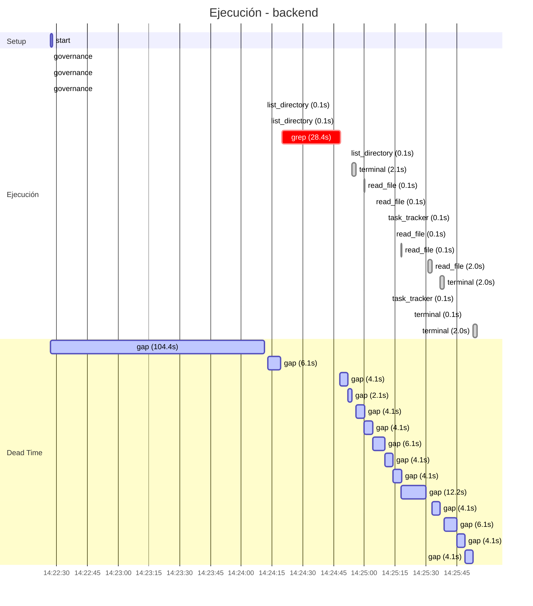

# Traza: Analiza el endpoint /mcp del contenedor conti-backend y documenta todas las tools en un documento mc...[truncated]

- **Circuito**: `backend`
- **Workspace**: `/contenedores/conti-backend`
- **Inicio**: 2026-07-04T14:22:27.573658-03:00
- **Fin**: 2026-07-04T14:33:28.056933-03:00
- **Duración**: 660.483s
- **Eventos**: 59

## Timeline (Gantt)



## Tools Ejecutadas

| # | Tool | Inicio | Duración | OK | Args/Result |
|---|------|--------|----------|-----|-------------|
| 1 | `governance:get_onboarding` | 14:22:27 | 0.0s | ✅ |  |
| 2 | `governance:get_rules` | 14:22:27 | 0.0s | ✅ |  |
| 3 | `governance:get_config` | 14:22:27 | 0.0s | ✅ |  |
| 4 | `list_directory` | 14:24:11 | 0.0s | ✅ | Listed directory: /contenedores/conti-backend (67 entries) |
| 5 | `list_directory` | 14:24:13 | 0.0s | ✅ | Listed directory: /contenedores/conti-backend (274 entries) |
| 6 | `grep` | 14:24:20 | 28.4s | ❌ | Command '['grep', '-R', '-I', '-l', '-i', '/mcp', '/contened...[truncated] |
| 7 | `list_directory` | 14:24:52 | 0.0s | ✅ | Listed directory: /contenedores/conti-backend (67 entries) |
| 8 | `terminal` | 14:24:54 | 2.1s | ✅ | `ls -la` |
| 9 | `read_file` | 14:25:00 | 0.0s | ✅ | Read file: /contenedores/conti-backend/mcp_tools_doc.md (sho...[truncated] |
| 10 | `read_file` | 14:25:04 | 0.0s | ✅ | Read file: /contenedores/conti-backend/mcp_tools_doc.md    1...[truncated] |
| 11 | `task_tracker` | 14:25:10 | 0.0s | ✅ | `plan` |
| 12 | `read_file` | 14:25:14 | 0.0s | ✅ | Read file: /contenedores/conti-backend/app/mcp/router.py    ...[truncated] |
| 13 | `read_file` | 14:25:18 | 0.0s | ✅ | Read file: /contenedores/conti-backend/app/services/registry...[truncated] |
| 14 | `read_file` | 14:25:31 | 2.0s | ✅ | Read file: /contenedores/conti-backend/app/services/registry...[truncated] |
| 15 | `terminal` | 14:25:37 | 2.0s | ✅ | `grep -c "self._registry.register(" app/services/registry_ser...[truncated]` |
| 16 | `task_tracker` | 14:25:45 | 0.0s | ✅ | `plan` |
| 17 | `terminal` | 14:25:49 | 0.0s | ✅ | `grep -o 'name="[^"]*"' app/services/registry_service.py | so...[truncated]` |
| 18 | `terminal` | 14:25:53 | 2.0s | ✅ | `grep -o '#### `[^`]*`' mcp_tools_doc.md | sed 's/#### `//;s/...[truncated]` |

## Reasoning del Agente

### 14:24:11 → `list_directory`

> Voy a analizar el endpoint /mcp del contenedor conti-backend. Primero necesito explorar la estructura del proyecto para entender el código fuente y localizar el endpoint /mcp.

### 14:24:13 → `list_directory`

> Voy a listar los archivos y directorios del proyecto para entender su estructura.

### 14:24:20 → `grep`

> El proyecto parece tener muchos archivos. Voy a buscar archivos específicos que contengan "/mcp" para encontrar el endpoint.

### 14:24:52 → `list_directory`

> Voy a buscar de manera más específica, primero viendo los archivos principales.

### 14:24:54 → `terminal`

> Necesito ver el contenido del directorio principal.

### 14:25:00 → `read_file`

> Veo que ya existe un archivo `mcp_tools_doc.md` en el directorio. Voy a examinarlo primero para ver si ya tiene documentación. También necesito buscar el endpoint /mcp. Voy a buscar archivos que contengan "mcp" en el directorio app.

### 14:25:04 → `read_file`

> El archivo ya existe y tiene 1191 líneas. Voy a ver el resto del archivo para completar el análisis.

### 14:25:10 → `task_tracker`

> Perfecto, ya existe un archivo de documentación completo con 1191 líneas. Sin embargo, debo verificar si el archivo está actualizado y si refleja correctamente el estado actual del endpoint /mcp. Voy a examinar los archivos fuente mencionados en la documentación para verificar la información.

### 14:25:14 → `read_file`

> Voy a explorar los archivos fuente para verificar la documentación. Primero veamos el router MCP.

### 14:25:18 → `read_file`

> Ahora voy a revisar el registry_service.py para ver las tools registradas.

### 14:25:31 → `read_file`

> Voy a ver más del archivo registry_service.py para obtener todas las tools registradas.

### 14:25:37 → `terminal`

> Perfecto, ya tengo el archivo completo del registry_service.py. Ahora voy a contar las tools registradas para verificar si el número 73 es correcto. Voy a hacer un conteo rápido.

### 14:25:45 → `task_tracker`

> Excelente, el número de tools registradas es 73, lo cual coincide con la documentación. Ahora voy a verificar si la documentación está completa y actualizada. Voy a revisar el archivo mcp_tools_doc.md para ver si tiene todas las herramientas. Primero, voy a crear un script para extraer los nombres d

### 14:25:49 → `terminal`

> Voy a extraer los nombres de las herramientas del código fuente y compararlos con la documentación. Primero, voy a crear un script para extraer los nombres.

### 14:25:53 → `terminal`

> Ahora voy a extraer los nombres de las herramientas de la documentación para compararlos.

## Prompt Completo (input del usuario)

```text
Analiza el endpoint /mcp del contenedor conti-backend y documenta todas las tools en un documento mcp_tools_doc.md
```
