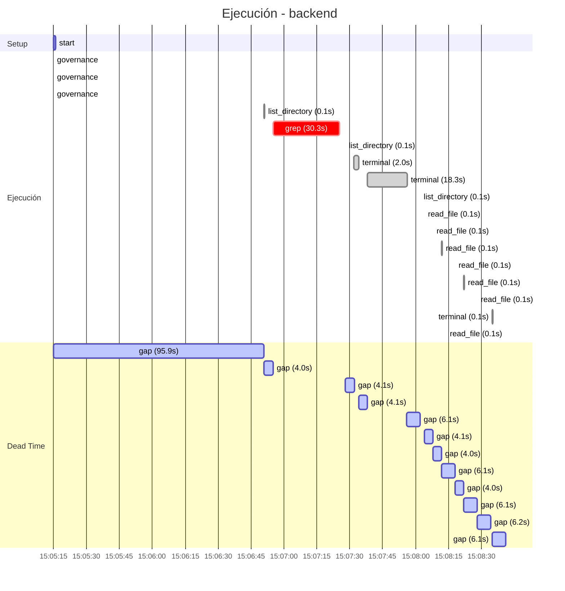

# Traza: Analiza el endpoint /mcp del contenedor conti-backend y documenta todas las tools en un documento mc...[truncated]

- **Circuito**: `backend`
- **Conversación OpenHands**: [`bd44516b-c1ff-4af0-84ef-7b23b86dffdc`](http://localhost:3012/conversations/bd44516b-c1ff-4af0-84ef-7b23b86dffdc)
- **Workspace**: `/contenedores/conti-backend`
- **Inicio**: 2026-07-04T15:05:15.685012-03:00
- **Fin**: 2026-07-04T15:16:08.006179-03:00
- **Duración**: 652.321s
- **Eventos**: 56

## Timeline (Gantt)



## Tools Ejecutadas

| # | Tool | Inicio | Duración | OK | Args/Result |
|---|------|--------|----------|-----|-------------|
| 1 | `governance:get_onboarding` | 15:05:15 | 0.0s | ✅ |  |
| 2 | `governance:get_rules` | 15:05:15 | 0.0s | ✅ |  |
| 3 | `governance:get_config` | 15:05:15 | 0.0s | ✅ |  |
| 4 | `list_directory` | 15:06:51 | 0.0s | ✅ | Listed directory: /contenedores/conti-backend (66 entries) |
| 5 | `grep` | 15:06:55 | 30.3s | ❌ | Command '['grep', '-R', '-I', '-l', '-i', '/mcp', '/contened...[truncated] |
| 6 | `list_directory` | 15:07:28 | 0.0s | ✅ | Listed directory: /contenedores/conti-backend (273 entries) |
| 7 | `terminal` | 15:07:32 | 2.0s | ✅ | `find /contenedores/conti-backend -type f -name "*.py" | head...[truncated]` |
| 8 | `terminal` | 15:07:38 | 18.3s | ✅ | `find /contenedores/conti-backend -type f -name "*.py" -not -...[truncated]` |
| 9 | `list_directory` | 15:08:02 | 0.0s | ✅ | Listed directory: /contenedores/conti-backend/c/Contenedores...[truncated] |
| 10 | `read_file` | 15:08:04 | 0.0s | ✅ | Read file: /contenedores/conti-backend/c/Contenedores/conti-...[truncated] |
| 11 | `read_file` | 15:08:08 | 0.0s | ✅ | Read file: /contenedores/conti-backend/c/Contenedores/conti-...[truncated] |
| 12 | `read_file` | 15:08:12 | 0.0s | ✅ | Read file: /contenedores/conti-backend/c/Contenedores/conti-...[truncated] |
| 13 | `read_file` | 15:08:18 | 0.0s | ✅ | Read file: /contenedores/conti-backend/c/Contenedores/conti-...[truncated] |
| 14 | `read_file` | 15:08:22 | 0.0s | ✅ | Read file: /contenedores/conti-backend/c/Contenedores/conti-...[truncated] |
| 15 | `read_file` | 15:08:28 | 0.0s | ✅ | Read file: /contenedores/conti-backend/c/Contenedores/conti-...[truncated] |
| 16 | `terminal` | 15:08:35 | 0.0s | ✅ | `find /contenedores/conti-backend -maxdepth 3 -name "*.md" -t...[truncated]` |
| 17 | `read_file` | 15:08:41 | 0.0s | ✅ | Read file: /contenedores/conti-backend/mcp-local.md       1 ...[truncated] |

## Reasoning del Agente

### 15:06:51 → `list_directory`

> El usuario quiere que analice el endpoint /mcp del contenedor conti-backend y documente todas las tools en un documento mcp_tools_doc.md. Primero necesito entender la estructura del proyecto y encontrar el código relacionado con /mcp. Voy a explorar el directorio actual.

### 15:06:55 → `grep`

> Voy a ver el contenido del directorio. Necesito buscar archivos que puedan contener el endpoint /mcp. Primero buscaré archivos con grep que contengan "/mcp".

### 15:07:28 → `list_directory`

> Let me try a more targeted search.

### 15:07:32 → `terminal`

> Voy a ver más archivos. Necesito buscar específicamente archivos que contengan "/mcp" o "mcp". Primero veamos los archivos en el directorio raíz.

### 15:07:38 → `terminal`

> Esos archivos parecen ser de OpenHands, no del proyecto conti-backend. Necesito buscar archivos Python que sean del proyecto. Voy a ver la estructura del proyecto.

### 15:08:02 → `list_directory`

> Perfecto, veo que hay un directorio `app/mcp/` que probablemente contiene el código relacionado con el endpoint /mcp. También hay un archivo de test `test_mcp_tools.py`. Primero voy a explorar el directorio `app/mcp/` para entender la estructura.

### 15:08:04 → `read_file`

> Voy a ver los archivos en ese directorio.

### 15:08:08 → `read_file`

> Ahora necesito ver el archivo schemas.py para entender los modelos de datos.

### 15:08:12 → `read_file`

> Ahora necesito ver el archivo `registry_service.py` para entender cómo se registran las tools.

### 15:08:18 → `read_file`

> Necesito ver el resto del archivo registry_service.py para ver todas las herramientas registradas. Continuaré leyendo desde la línea 1000.

### 15:08:22 → `read_file`

> Ahora tengo una buena visión de todas las tools registradas. Necesito crear un documento que documente todas estas herramientas MCP. Voy a crear un documento `mcp_tools_doc.md` en el directorio raíz del proyecto. Primero, déjame ver el archivo test_mcp_tools.py para ver si hay información adicional.

### 15:08:28 → `read_file`

> Ahora tengo toda la información necesaria. Voy a crear un documento completo que documente el endpoint /mcp y todas las tools. Primero, déjame ver el archivo categories.py para entender las categorías.

### 15:08:35 → `terminal`

> I should use `summary` instead of `description`.

### 15:08:41 → `read_file`

> Ya existe un archivo `mcp-local.md` en el directorio raíz. Déjame verlo primero.

## Prompt Inyectado (governance + reglas + user)

```text
Analiza el endpoint /mcp del contenedor conti-backend y documenta todas las tools en un documento mcp_tools_doc.md
```
