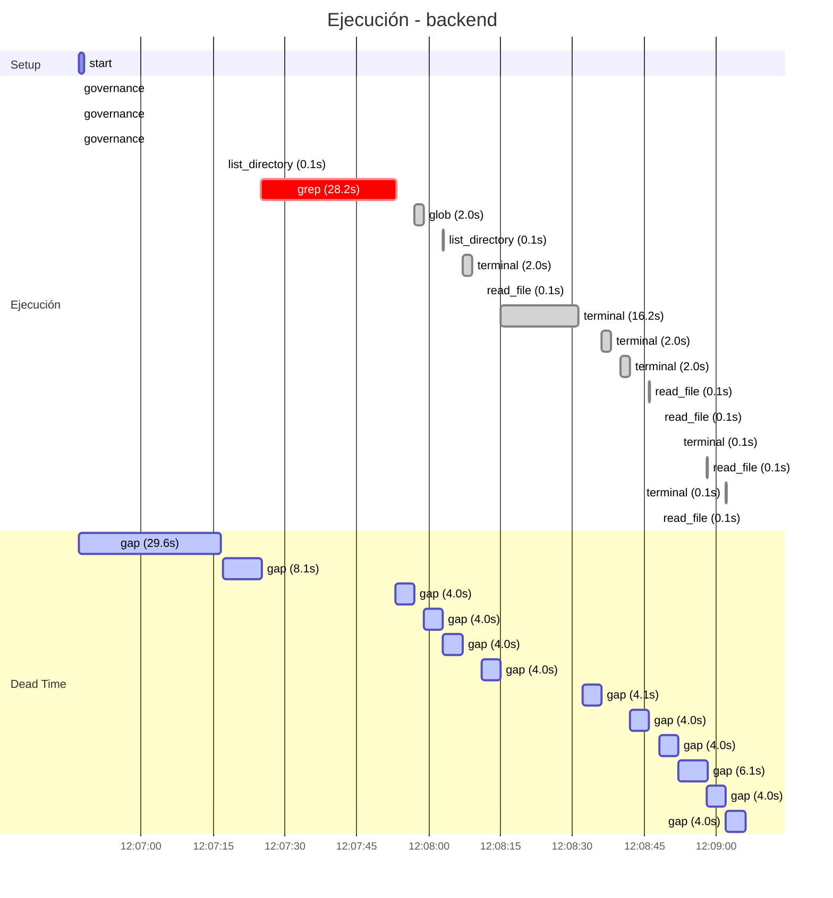

# Traza: Analiza los Agentes Hermes Instalados en este contenedor y genera un reporte de sus configuraciones ...[truncated]

- **Circuito**: `backend`
- **Workspace**: `/contenedores/conti-backend`
- **Inicio**: 2026-07-04T12:06:47.873708-03:00
- **Fin**: 2026-07-04T12:11:48.515889-03:00
- **Duración**: 300.642s
- **Eventos**: 43

## Timeline (Gantt)



## Tools Ejecutadas

| # | Tool | Inicio | Duración | OK | Args/Result |
|---|------|--------|----------|-----|-------------|
| 1 | `governance:get_onboarding` | 12:06:47 | 0.0s | ✅ |  |
| 2 | `governance:get_rules` | 12:06:47 | 0.0s | ✅ |  |
| 3 | `governance:get_config` | 12:06:47 | 0.0s | ✅ |  |
| 4 | `list_directory` | 12:07:17 | 0.0s | ✅ | Listed directory: /contenedores/conti-backend (66 entries) |
| 5 | `grep` | 12:07:25 | 28.2s | ❌ | Command '['grep', '-R', '-I', '-l', '-i', '(?i)hermes', '/co...[truncated] |
| 6 | `glob` | 12:07:57 | 2.0s | ✅ | No files found matching pattern '**/*.{md,txt,json,yaml,yml,...[truncated] |
| 7 | `list_directory` | 12:08:03 | 0.0s | ✅ | Listed directory: /contenedores/conti-backend (66 entries) |
| 8 | `terminal` | 12:08:07 | 2.0s | ✅ | `ls -la /contenedores/conti-backend` |
| 9 | `read_file` | 12:08:11 | 0.0s | ✅ | Read file: /contenedores/conti-backend/hermes-fix.md       1...[truncated] |
| 10 | `terminal` | 12:08:15 | 16.2s | ✅ | `find /contenedores/conti-backend -type f -name "*.yaml" -o -...[truncated]` |
| 11 | `terminal` | 12:08:36 | 2.0s | ✅ | `ls -la /contenedores/conti-backend/app/hermes_profiles/` |
| 12 | `terminal` | 12:08:40 | 2.0s | ✅ | `ls -la /contenedores/conti-backend/app/hermes_profiles/conti...[truncated]` |
| 13 | `read_file` | 12:08:46 | 0.0s | ✅ | Read file: /contenedores/conti-backend/app/hermes_profiles/c...[truncated] |
| 14 | `read_file` | 12:08:48 | 0.0s | ✅ | Read file: /contenedores/conti-backend/app/hermes_profiles/c...[truncated] |
| 15 | `terminal` | 12:08:52 | 0.0s | ✅ | `ls -la /contenedores/conti-backend/app/hermes_profiles/conti...[truncated]` |
| 16 | `read_file` | 12:08:58 | 0.0s | ✅ | Read file: /contenedores/conti-backend/app/hermes_profiles/c...[truncated] |
| 17 | `terminal` | 12:09:02 | 0.0s | ✅ | `ls -la /contenedores/conti-backend/app/hermes_profiles/conti...[truncated]` |
| 18 | `read_file` | 12:09:06 | 0.0s | ✅ | Read file: /contenedores/conti-backend/app/hermes_profiles/c...[truncated] |

## Reasoning del Agente

### 12:07:17 → `list_directory`

> El usuario quiere que analice los "Agentes Hermes" instalados en este contenedor y genere un reporte de sus configuraciones y habilidades en un archivo `Agentes_hermes_doc.md`. Primero necesito explorar el entorno para entender qué es "Hermes". Parece ser un sistema de agentes o framework. Voy a emp

### 12:07:25 → `grep`

> Hay muchos archivos y directorios. Necesito buscar pistas sobre "Hermes". Voy a buscar archivos que contengan "hermes" o "agent". Usaré grep para buscar en el código fuente. Primero, buscaré en archivos de configuración.

### 12:07:57 → `glob`

> El comando tardó demasiado. Probablemente porque hay muchos archivos. Voy a limitar la búsqueda a archivos de configuración comunes (JSON, YAML, MD, txt, etc.). También puedo buscar en el directorio actual de manera más específica. Primero, veamos si hay algún archivo de documentación o configuració

### 12:08:03 → `list_directory`

> No hay archivos de configuración. Probablemente el proyecto es código fuente. Voy a listar directorios principales.

### 12:08:07 → `terminal`

> Necesito ver el contenido. Voy a usar el comando `ls -la` en la terminal.

### 12:08:11 → `read_file`

> Veo archivos como `entrypoint_hermes.sh`, `hermes-fix.md`, y `CHAT.MD` que parecen relacionados con Hermes. También hay un directorio `workspace`. Voy a explorar estos archivos para entender qué son los "Agentes Hermes". Primero, revisaré `hermes-fix.md`.

### 12:08:15 → `terminal`

> Este archivo es un diagnóstico técnico. Parece que Hermes es un agente con múltiples perfiles (como `resto`, `mendoza`, `odoo-mendoza`). Voy a explorar el directorio `hermes_profiles` para ver los perfiles disponibles. Primero, buscaré el directorio.

### 12:08:36 → `terminal`

> Veo que hay múltiples perfiles: odoo-nudo, mendoza, odoo-mendoza, resto, catolico, etc. Cada perfil tiene un `config.yaml` y posiblemente `profile.yaml`. También hay habilidades (skills) como `mlops/inference/obliteratus`. Voy a explorar la estructura del directorio `hermes_profiles`. Primero, veamo

### 12:08:40 → `terminal`

> Solo hay un directorio `contihome`. Veamos dentro.

### 12:08:46 → `read_file`

> Hay muchos archivos y directorios. Veo `profiles` que probablemente contenga los perfiles. También hay `config.yaml` a nivel de contihome. Voy a revisar el archivo `active_profile` para ver qué perfil está activo.

### 12:08:48 → `read_file`

> El perfil activo es `resto`. Ahora voy a revisar el archivo `config.yaml` de contihome para ver la configuración global.

### 12:08:52 → `terminal`

> Ahora tengo una buena visión de la configuración global. Voy a explorar los perfiles individuales. Primero, veamos los perfiles disponibles.

### 12:08:58 → `read_file`

> Hay varios perfiles: catolico, mendoza, odoo, odoo-mendoza, odoo-nudo, odoo-resto, resto. Cada uno tiene su propia configuración. También hay archivos AGENTS.md, CONSTANTS.md, SOUL.md, TOOLS.md que probablemente son documentación. Voy a leer algunos de estos archivos para entender la estructura. Pri

### 12:09:02 → `terminal`

> Ahora tengo una idea de lo que hacen los agentes Hermes. Son agentes de IA que interactúan con Odoo a través de MCP (Model Context Protocol). Cada perfil tiene configuraciones específicas. Voy a explorar algunos perfiles para obtener más detalles. Primero, el perfil activo `resto`.

### 12:09:06 → `read_file`

> Voy a leer el archivo `config.yaml` del perfil `resto` para ver su configuración específica.

## Prompt Completo (input del usuario)

```text
Analiza los Agentes Hermes Instalados en este contenedor y genera un reporte de sus configuraciones y habilidades en un archivo Agentes_hermes_doc.md
```
