# Traza: Decime OK

- **Circuito**: `backend`
- **Workspace**: `/contenedores/conti-backend`
- **Inicio**: 2026-07-04T12:58:56.610864-03:00
- **Fin**: 2026-07-04T13:04:23.421600-03:00
- **Duración**: 326.811s
- **Eventos**: 17

## Timeline (Gantt)

```mermaid
gantt
    title Ejecución - backend
    dateFormat  HH:mm:ss
    axisFormat  %H:%M:%S

    section Setup
    start           :12:58:56, 1s

    section Ejecución
    governance:get_onboarding (0.1s)  :done, 12:58:56, 0.1s
    governance:get_rules (0.1s)  :done, 12:58:56, 0.1s
    governance:get_config (0.1s)  :done, 12:58:56, 0.1s
    terminal (0.1s)  :done, 13:00:04, 0.1s

    section Dead Time
    gap (67.9s)  :active, 12:58:56, 67.9s
```



## Tools Ejecutadas

| # | Tool | Inicio | Duración | OK | Args/Result |
|---|------|--------|----------|-----|-------------|
| 1 | `governance:get_onboarding` | 12:58:56 | 0.0s | ✅ |  |
| 2 | `governance:get_rules` | 12:58:56 | 0.0s | ✅ |  |
| 3 | `governance:get_config` | 12:58:56 | 0.0s | ✅ |  |
| 4 | `terminal` | 13:00:04 | 0.0s | ✅ | `ls -la` |

## Reasoning del Agente

### 13:00:04 → `terminal`

> El usuario me dice "Decime OK". Esto es en español, y significa "Dime OK". Parece que quiere que yo le diga "OK". Sin embargo, como asistente de OpenHands, debo ser útil y no solo repetir lo que el usuario dice. Pero el usuario está pidiendo específicamente que le diga "OK". Tal vez es una prueba o 

## Prompt Completo (input del usuario)

```text
Decime OK
```
