# Traza: Decime OK

- **Circuito**: `backend`
- **Workspace**: `/contenedores/conti-backend`
- **Inicio**: 2026-07-04T11:43:01.158252-03:00
- **Fin**: 2026-07-04T11:48:22.090288-03:00
- **Duración**: 320.932s
- **Eventos**: 17

## Timeline (Gantt)

```mermaid
gantt
    title Ejecución - backend
    dateFormat  HH:mm:ss
    axisFormat  %H:%M:%S

    section Setup
    start           :11:43:01, 1s

    section Ejecución
    governance:get_onboarding (0.1s)  :done, 11:43:01, 0.1s
    governance:get_rules (0.1s)  :done, 11:43:01, 0.1s
    governance:get_config (0.1s)  :done, 11:43:01, 0.1s
    think (0.1s)  :done, 11:44:05, 0.1s

    section Dead Time
    gap (64.2s)  :active, 11:43:01, 64.2s
```



## Tools Ejecutadas

| # | Tool | Inicio | Duración | OK | Args/Result |
|---|------|--------|----------|-----|-------------|
| 1 | `governance:get_onboarding` | 11:43:01 | 0.0s | ✅ |  |
| 2 | `governance:get_rules` | 11:43:01 | 0.0s | ✅ |  |
| 3 | `governance:get_config` | 11:43:01 | 0.0s | ✅ |  |
| 4 | `think` | 11:44:05 | 0.0s | ✅ | Your thought has been logged. |

## Reasoning del Agente

### 11:44:05 → `think`

> El usuario me pide que le diga "OK". Es una solicitud simple y directa. Solo necesito responder con "OK". No hay necesidad de usar herramientas ya que es una respuesta textual simple. Sin embargo, debo considerar que esto podría ser parte de una conversación más grande, pero por ahora solo me piden 

## Prompt Completo (input del usuario)

```text
Decime OK
```
