# Traza: Decime OK

- **Circuito**: `backend`
- **Workspace**: `/contenedores/conti-backend`
- **Inicio**: 2026-07-04T12:57:36.241555-03:00
- **Fin**: 2026-07-04T12:57:36.413160-03:00
- **Duración**: 0.172s
- **Eventos**: 9

## Timeline (Gantt)

```mermaid
gantt
    title Ejecución - backend
    dateFormat  HH:mm:ss
    axisFormat  %H:%M:%S

    section Setup
    start           :12:57:36, 1s

    section Ejecución
    governance:get_onboarding (0.1s)  :done, 12:57:36, 0.1s
    governance:get_rules (0.1s)  :done, 12:57:36, 0.1s
    governance:get_config (0.1s)  :done, 12:57:36, 0.1s

    section Dead Time
```



## Tools Ejecutadas

| # | Tool | Inicio | Duración | OK | Args/Result |
|---|------|--------|----------|-----|-------------|
| 1 | `governance:get_onboarding` | 12:57:36 | 0.0s | ✅ |  |
| 2 | `governance:get_rules` | 12:57:36 | 0.0s | ✅ |  |
| 3 | `governance:get_config` | 12:57:36 | 0.0s | ✅ |  |

## Reasoning del Agente

## Prompt Completo (input del usuario)

```text
Decime OK
```
