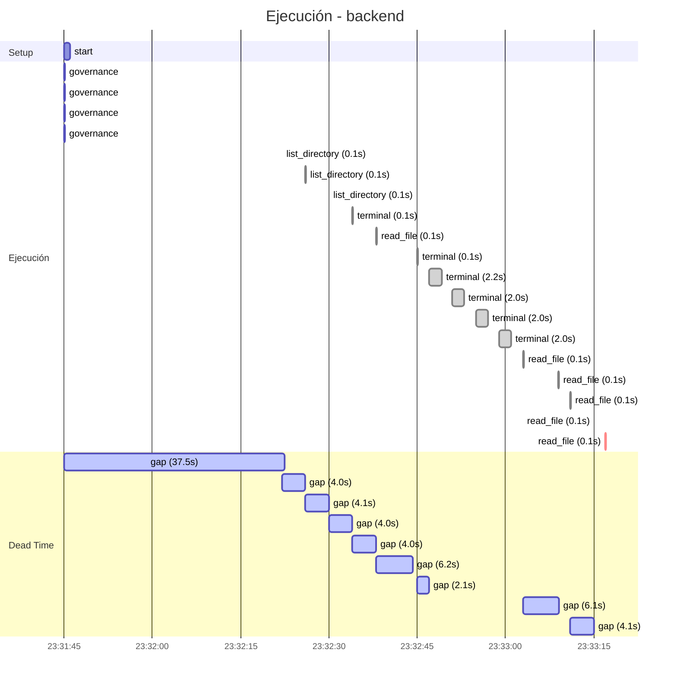

## Turn 1: Analiza los Agentes Hermes Instalados en este contenedor y genera un reporte de sus configuraciones ...[truncated]

- **Circuito**: `backend`
- **Conversación OpenHands**: [`8d2ee6cf-d08e-4ce7-be12-da185af73936`](http://localhost:3012/conversations/8d2ee6cf-d08e-4ce7-be12-da185af73936)
- **Workspace**: `/contenedores/conti-backend`
- **Inicio**: 2026-07-05T23:31:45.245629-03:00
- **Fin**: 2026-07-05T23:41:47.317241-03:00
- **Duración**: 602.072s
- **Eventos**: 60

## Timeline (Gantt)



## Tools Ejecutadas

| # | Tool | Inicio | Duración | OK | Args/Result |
|---|------|--------|----------|-----|-------------|
| 1 | `governance:ponytail_rules` | 23:31:45 | 0.0s | ✅ |  |
| 2 | `governance:get_onboarding` | 23:31:45 | 0.0s | ✅ |  |
| 3 | `governance:get_rules` | 23:31:45 | 0.0s | ✅ |  |
| 4 | `governance:get_config` | 23:31:45 | 0.0s | ✅ |  |
| 5 | `list_directory` | 23:32:22 | 0.0s | ✅ | Listed directory: /contenedores/conti-backend (69 entries) |
| 6 | `list_directory` | 23:32:26 | 0.0s | ✅ | Listed directory: /contenedores/conti-backend (69 entries) |
| 7 | `list_directory` | 23:32:30 | 0.0s | ✅ | Listed directory: /contenedores/conti-backend (69 entries) |
| 8 | `terminal` | 23:32:34 | 0.0s | ✅ | `ls -la /contenedores/conti-backend` |
| 9 | `read_file` | 23:32:38 | 0.0s | ✅ | Read file: /contenedores/conti-backend/Agentes_hermes_doc.md...[truncated] |
| 10 | `terminal` | 23:32:45 | 0.0s | ✅ | `which hermes` |
| 11 | `terminal` | 23:32:47 | 2.2s | ✅ | `ls -la /app/hermes_profiles/` |
| 12 | `terminal` | 23:32:51 | 2.0s | ✅ | `ls -la /app/hermes_profiles/contihome/` |
| 13 | `terminal` | 23:32:55 | 2.0s | ✅ | `ls -la /app/hermes_profiles/contihome/profiles/` |
| 14 | `terminal` | 23:32:59 | 2.0s | ✅ | `cat /app/hermes_profiles/contihome/active_profile` |
| 15 | `read_file` | 23:33:03 | 0.0s | ✅ | Read file: /app/hermes_profiles/contihome/config.yaml       ...[truncated] |
| 16 | `read_file` | 23:33:09 | 0.0s | ✅ | Read file: /app/hermes_profiles/contihome/profiles/resto/SOU...[truncated] |
| 17 | `read_file` | 23:33:11 | 0.0s | ✅ | Read file: /app/hermes_profiles/contihome/profiles/resto/TOO...[truncated] |
| 18 | `read_file` | 23:33:15 | 0.0s | ✅ | Read file: /app/hermes_profiles/contihome/SOUL.md       1  #...[truncated] |
| 19 | `read_file` | 23:33:17 | 0.0s | ❌ | Error: File not found: /app/hermes_profiles/contihome/CONSTA...[truncated] |

## Reasoning del Agente

### 23:32:22 → `list_directory`

> El usuario me pide analizar los Agentes Hermes instalados en el contenedor y generar un reporte de sus configuraciones y habilidades en un archivo específico. Necesito explorar el entorno para entender qué son los "Agentes Hermes" y dónde están configurados.

Primero, voy a explorar el directorio ac

### 23:32:26 → `list_directory`

> Voy a ver más detalles del directorio. Necesito entender la estructura y buscar información sobre Hermes.

### 23:32:30 → `list_directory`

> Necesito ver el contenido real. Voy a usar `list_directory` con el directorio raíz.

### 23:32:34 → `terminal`

> Parece que `list_directory` no está mostrando los archivos. Voy a usar el comando `ls` en el terminal para explorar.

### 23:32:38 → `read_file`

> Veo que ya existe un archivo `Agentes_hermes_doc.md` (10995 bytes). El usuario quiere que analice los Agentes Hermes instalados y genere un reporte. Primero debo ver el contenido de ese archivo existente para entender qué ya hay. Luego explorar qué son los Agentes Hermes. Veamos el archivo existente

### 23:32:45 → `terminal`

> Veo que ya existe un reporte bastante completo. Sin embargo, el usuario me pide que "analice los Agentes Hermes Instalados en este contenedor y genere un reporte de sus configuraciones y habilidades". Esto sugiere que quiere un análisis actualizado o quizás una verificación de que la información es 

### 23:32:47 → `terminal`

> Hermes está instalado. Ahora voy a explorar los directorios de perfiles para verificar la estructura.

### 23:32:51 → `terminal`

> Perfecto. Hay un directorio `contihome`. Voy a explorar su estructura.

### 23:32:55 → `terminal`

> Excelente. Ahora voy a ver los perfiles dentro de `/app/hermes_profiles/contihome/profiles/`.

### 23:32:59 → `terminal`

> Perfecto. Hay 7 perfiles (catolico, mendoza, odoo, odoo-mendoza, odoo-nudo, odoo-resto, resto) más el perfil default (que probablemente está en el directorio raíz de contihome). Voy a verificar el perfil default. Primero, voy a ver el archivo `active_profile` para saber cuál es el perfil activo.

### 23:33:03 → `read_file`

> El perfil activo es `resto`. Ahora voy a explorar algunos archivos de configuración para entender mejor los perfiles. Primero, voy a ver el archivo `config.yaml` en el directorio raíz de contihome.

### 23:33:09 → `read_file`

> Excelente. Ahora tengo la configuración principal. También necesito ver los archivos SOUL.md de cada perfil para entender sus personalidades y propósitos. Voy a empezar con el perfil `resto` que está activo.

### 23:33:11 → `read_file`

> Ahora voy a ver el archivo `TOOLS.md` del perfil resto para entender las herramientas disponibles.

### 23:33:15 → `read_file`

> Ahora voy a explorar los otros perfiles para obtener una visión completa. Primero, voy a ver el perfil `default` (que probablemente está en el directorio raíz de contihome).

### 23:33:17 → `read_file`

> Ahora voy a ver el archivo `CONSTANTS.md` del perfil default para entender las reglas de negocio.

## Prompt Inyectado (governance + reglas + user)

```text
## Ponytail Rules (Reglas Comunes)


---

# Ponytail, lazy senior dev mode

You are a lazy senior developer. Lazy means efficient, not careless. The best code is the code never written.

Before writing any code, stop at the first rung that holds:

1. Does this need to be built at all? (YAGNI)
2. Does it already exist in this codebase? Reuse the helper, util, or pattern that's already here, don't re-write it.
3. Does the standard library already do this? Use it.
4. Does a native platform feature cover it? Use it.
5. Does an already-installed dependency solve it? Use it.
6. Can this be one line? Make it one line.
7. Only then: write the minimum code that works.

The ladder runs after you understand the problem, not instead of it: read the task and the code it touches, trace the real flow end to end, then climb.

Bug fix = root cause, not symptom: a report names a symptom. Grep every caller of the function you touch and fix the shared function once — one guard there is a smaller diff than one per caller, and patching only the path the ticket names leaves a sibling caller still broken.

Rules:

- No abstractions that weren't explicitly requested.
- No new dependency if it can be avoided.
- No boilerplate nobody asked for.
- Deletion over addition. Boring over clever. Fewest files possible.
- Shortest working diff wins, but only once you understand the problem. The smallest change in the wrong place isn't lazy, it's a second bug.
- Question complex requests: "Do you actually need X, or does Y cover it?"
- Pick the edge-case-correct option when two stdlib approaches are the same size, lazy means less code, not the flimsier algorithm.
- Mark intentional simplifications with a `ponytail:` comment. If the shortcut has a known ceiling (global lock, O(n²) scan, naive heuristic), the comment names the ceiling and the upgrade path.

Not lazy about: understanding the problem (read it fully and trace the real flow before picking a rung, a small diff you don't understand is just laziness dressed up as efficiency), input validation at trust boundaries, error handling that prevents data loss, security, accessibility, the calibration real hardware needs (the platform is never the spec ideal, a clock drifts, a sensor reads off), anything explicitly requested. Lazy code without its check is unfinished: non-trivial logic leaves ONE runnable check behind, the smallest thing that fails if the logic breaks (an assert-based demo/self-check or one small test file; no frameworks, no fixtures). Trivial one-liners need no test.

(Yes, this file also applies to agents working on the ponytail repo itself. Especially to them.)

---

## Onboarding (Circuito: backend)

# Onboarding Conti Backend (actualizado PLAN_3 v1.5, 30/jun/2026)

## Stack

- Backend MCP/FastAPI para `conti-backend` (puerto `:9001`).
- OpenHands Agent Server REST API (puerto `:3011` → `:3000` interno).
- OpenHands Agent Canvas — GUI Next.js oficial (puerto `:3012` →
  `:3012` interno).
- OpenHands CLI textual embebido en web (puerto `:3013` → `:3001`
  interno, comando `openhands web`).
- Sourcebot v5.0.4 para RAG sobre código (puerto `:3010`).
- LLM activo: `mistral/mistral-small-latest` vía Mistral API.
- Redis: `redis_odoo:6379`, DB 14 asignada a Sourcebot.
- Postgres: `compose-db-1:5432`, DB `sourcebot`.

## Repos bind-mounted

| Path contenedor | Repo | Rama activa | Uso |
|-----------------|------|-------------|-----|
| `/desarrollo` | contamela-stack (dev) | `develop` | flujo normal |
| `/compose` | contamela-stack (prod) | `main` | hotfix + lectura pasiva |
| `/contenedores/conti-backend` | orquestrador-contamela | `main` | devops backend |
| `/home/nanobot` | (no es repo) | — | HOME persistente del agente |
| `/tmp/free-agent` | (no es repo) | — | workspace del circuito `libre` |

## Circuitos del agente (4)

| ID | Workspace | Branch | Git action permitida |
|----|-----------|--------|---------------------|
| `desarrollo` | `/desarrollo` | `develop` | `run_salvar` (commit + push develop) |
| `produccion` | `/compose` + `/desarrollo` | `main` en /compose, `develop` en /desarrollo | `run_promover` (develop→main+push) + `run_hotfix_sync` (main→develop) |
| `backend` | `/contenedores/conti-backend` | `main` | `run_salvar` directo a main (sin flujo develop↔main) |
| `libre` | `/tmp/free-agent` | — | ninguna (solo MCP de consulta) |

Cada circuito es una conversación persistente (`LocalConversation`) del
OpenHands SDK. Los 4 conviven en memoria del proceso uvicorn.

## Categorías MCP (filtrado real, Sprint 1.5)

Las MCP tools se filtran ahora por categoría al construir la conversación
de cada circuito. Categorías activas:

- **bootstrap**: `health_check`, `get_config`, `get_rules`, `get_onboarding`, `reload_config`
- **stack**: `get_container_health`, `get_container_logs`, `get_vps_status`
- **gitops**: `get_git_*`, `run_salvar`, `run_promover`, `run_hotfix_sync`, `get_pipeline_summary`
- **odoo**: 21 tools (`odoo_*`)
- **rag**: `search_rag*`, `start_rag_ingest*`, `s
```
