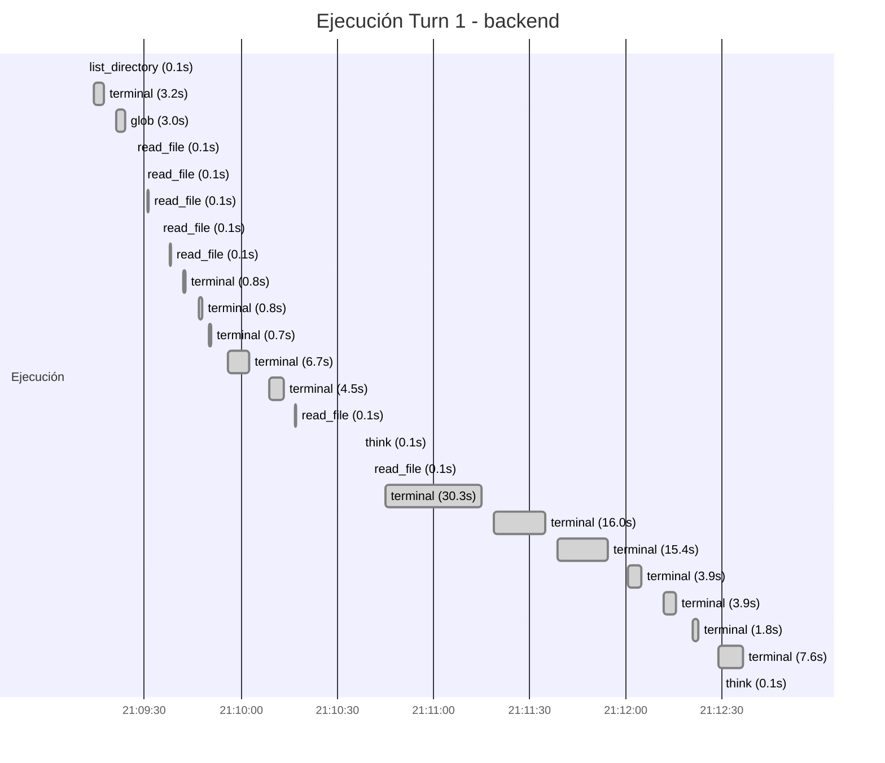

## Turn 1: Analiza los endpoint de el servior mcp que trabajan sobre los estatus, logs y errores de contenedore...

- **Circuito**: `backend`
- **Conversación OpenHands**: [`4e85dd17-f9e3-4b6d-915c-0cb9b000030b`](http://localhost:3012/conversations/4e85dd17-f9e3-4b6d-915c-0cb9b000030b)
- **Workspace**: `/contenedores/conti-backend`
- **Inicio**: 2026-07-06T21:08:16.985678
- **Fin**: 2026-07-06T21:13:26.257517
- **Duración**: 5m 9s
- **Eventos**: 75

## Prompt Completo

```text
Analiza los endpoint de el servior mcp que trabajan sobre los estatus, logs y errores de contenedores verifica si estan actualizados con el entrorno real y dame un informe
```

## Timeline (Gantt)



## Tools Ejecutadas (24)

| # | Tool | Inicio | Duración | OK | Args/Result |
|---|------|--------|----------|-----|-------------|
| 1 | `list_directory` | 21:09:11 | 0.1s | ✅ | Listed directory: /contenedores/conti-backend (70 entries) |
| 2 | `terminal` | 21:09:14 | 3.2s | ✅ | find /contenedores/conti-backend -name "*.py" -type f \| head -20 |
| 3 | `glob` | 21:09:21 | 3.0s | ✅ | Found 2 file(s) matching pattern '**/main.py' in '/contenedores/conti-backend': /contenedores/conti-backend/app/main.py  |
| 4 | `read_file` | 21:09:26 | 0.1s | ✅ | Read file: /contenedores/conti-backend/app/main.py       1  from __future__ import annotations      2        3  from fas |
| 5 | `read_file` | 21:09:29 | 0.1s | ✅ | Read file: /contenedores/conti-backend/app/mcp/router.py       1  from __future__ import annotations      2        3  im |
| 6 | `read_file` | 21:09:31 | 0.1s | ✅ | Read file: /contenedores/conti-backend/app/services/registry_service.py (showing lines 1-1000 of 1738) To read more, use |
| 7 | `read_file` | 21:09:34 | 0.1s | ✅ | Read file: /contenedores/conti-backend/app/tools/container_tools.py       1  from __future__ import annotations      2   |
| 8 | `read_file` | 21:09:38 | 0.1s | ✅ | Read file: /contenedores/conti-backend/docker-compose.conti.yml       1  services:      2    conti-backend:      3       |
| 9 | `terminal` | 21:09:42 | 0.8s | ✅ | docker ps --format "table {{.Names}}\t{{.Status}}\t{{.Image}}" \| head -20 |
| 10 | `terminal` | 21:09:47 | 0.8s | ✅ | docker compose ps |
| 11 | `terminal` | 21:09:50 | 0.7s | ✅ | docker-compose ps |
| 12 | `terminal` | 21:09:56 | 6.7s | ✅ | python3 -c " import docker client = docker.DockerClient(base_url='unix:///var/run/docker.sock') containers = client.cont |
| 13 | `terminal` | 21:10:09 | 4.5s | ✅ | python3 -c " import docker client = docker.DockerClient(base_url='unix:///var/run/docker.sock') containers = client.cont |
| 14 | `read_file` | 21:10:17 | 0.1s | ✅ | Read file: /contenedores/conti-backend/entrypoint_hermes.sh       1  #!/bin/bash      2  set -e      3        4  # ===== |
| 15 | `think` | 21:10:37 | 0.1s | ✅ | Your thought has been logged. |
| 16 | `read_file` | 21:10:40 | 0.1s | ✅ | Read file: /contenedores/conti-backend/docs/mcp_tools_doc.MD (showing lines 1-100 of 1423) To read more, use: read_file( |
| 17 | `terminal` | 21:10:45 | 30.3s | ✅ | curl -s -X POST http://conti-backend:9001/mcp/call \   -H "Content-Type: application/json" \   -d '{"name": "get_contain |
| 18 | `terminal` | 21:11:19 | 16.0s | ✅ | curl -s --connect-timeout 5 --max-time 15 -X POST http://localhost:9001/mcp/call \   -H "Content-Type: application/json" |
| 19 | `terminal` | 21:11:39 | 15.4s | ✅ | curl -s --connect-timeout 5 --max-time 15 -X POST http://127.0.0.1:9001/mcp/call \   -H "Content-Type: application/json" |
| 20 | `terminal` | 21:12:01 | 3.9s | ✅ | python3 -c " from app.tools.container_tools import get_container_health, get_container_logs, get_vps_status, _build_envi |
| 21 | `terminal` | 21:12:12 | 3.9s | ✅ | python3 -c " from app.tools.container_tools import _build_environment_summary env = _build_environment_summary() print(' |
| 22 | `terminal` | 21:12:21 | 1.8s | ✅ | python3 -c " import docker client = docker.DockerClient(base_url='unix:///var/run/docker.sock') containers = client.cont |
| 23 | `terminal` | 21:12:29 | 7.6s | ✅ | python3 -c " import docker client = docker.DockerClient(base_url='unix:///var/run/docker.sock') containers = client.cont |
| 24 | `think` | 21:12:52 | 0.1s | ✅ | Your thought has been logged. |

## Respuesta del Agente

---

## Informe: Endpoints MCP de Contenedores — Análisis vs Entorno Real

### Tools analizadas (categoría `stack`)

| Tool | Endpoint | Descripción |
|------|----------|-------------|
| `get_container_health` | `/mcp/call` | Estado y salud de contenedores Docker |
| `get_container_logs` | `/mcp/call` | Logs con filtro por tiempo, nivel y cantidad |
| `get_vps_status` | `/mcp/call` | Vista consolidada Docker + Git |

---

### 🚨 BUG CRÍTICO: `_container_image()` crashea con imágenes pruned

**Archivo**: `app/tools/container_tools.py`, línea 270-274

```python
def _container_image(container) -> str:
    tags = getattr(container.image, "tags", None) or []  # ← crashea aquí
```

`container.image` dispara una llamada al Docker daemon (`GET /images/<id>/json`). Si la imagen fue eliminada con `docker image prune`, el SDK lanza `ImageNotFound` y **las 3 tools fallan con error 500**.

**Contenedores afectados actualmente**: `django-api`, `django-dev`, `db_dev` — sus imágenes fueron pruned del daemon.

**Impacto**: `get_container_health`, `get_container_logs` y `get_vps_status` están **completamente rotos** en este momento. Cualquier llamada devuelve error.

**Fix**: Usar el atributo directo del attrs en lugar del property que hace round-trip al daemon:

```python
def _container_image(container) -> str:
    # ponytail: usar Config.Image del attrs (no requiere round-trip al daemon)
    return (container.attrs or {}).get("Config", {}).get("Image", container.short_id)
```

---

### 📋 Contenedores EXPECTED (hardcoded) vs REAL

**Producción (`compose_odoo-network`)**

| Contenedor | En código | Estado real | Observación |
|------------|-----------|-------------|-------------|
| `django-api` | ✅ | running | Imagen pruned → crashea tool |
| `odoo18` | ✅ | running | OK |
| `evolution-api-server` | ✅ | **NO EXISTE** | Obsoleto, no debería estar en lista |
| `wppconnect-server` | ✅ | exited | OK (marcado como exited) |
| `n8n` | ✅ | running | OK |
| `chatwoot_web` | ✅ | exited | OK |
| `chatwoot_worker` | ✅ | exited | OK |
| `portainer` | ✅ | running | OK |
| `cloudflared-tunnel` | ✅ | running | OK |
| `ollama` | ✅ | **NO EXISTE** | Obsoleto, no debería estar en lista |
| `compose-db-1` | ✅ | running | OK |
| `redis_odoo` | ✅ | running | OK |
| `conti-omp` | ❌ | running | **Falta en lista hardcoded** |
| `conti-sourcebot` | ❌ | running | **Falta** (deprecated pero sigue vivo) |
| `chatui` | ❌ | running | **Falta en lista hardcoded** |
| `flamehaven` | ❌ | running | **Falta en lista hardcoded** |

**Desarrollo (`desarrollo_odoo-network-dev`)**

| Contenedor | En código | Estado real | Observación |
|------------|-----------|-------------|-------------|
| `conti-backend` | ✅ | running | OK |
| `db_dev` | ✅ | running | Imagen pruned → crashea tool |
| `django-dev` | ✅ | exited | Imagen pruned → crashea tool |
| `odoo_dev` | ✅ | exited | OK |
| `n8n_dev` | ✅ | exited | OK |
| `chatwoot_web_dev` | ✅ | exited | OK |
| `chatwoot_worker_dev` | ✅ | exited | OK |
| `cloudflare-tunnel-dev` | ✅ | exited | OK |
| `redis_odoo_dev` | ✅ | exited | OK |
| `conti-sourcebot` | ❌ | running | **Falta** |
| `flamehaven` | ❌ | running | **Falta** |

---

### 🐛 Otros bugs menores

1. **Dead code en `_since_to_datetime`** (línea 305): `return None` al final de la función es inalcanzable — las ramas anteriores ya retornan.

2. **`get_container_logs` filtra por nivel pero no incluye metadata**: Devuelve logs crudos como string, sin parsear timestamps ni niveles individuales. Para un agente sería más útil tener logs estructurados.

---

### ✅ Lo que funciona bien

- Los regex de `_ERROR_RE` y `_WARN_RE` cubren múltiples formatos (Odoo, Gunicorn, uvicorn, JSON structured logging, Python tracebacks)
- El filtro de nivel funciona correctamente (saca timestamps antes de matchear)
- `_build_environment_summary` agrupa correctamente por red y detecta containers missing/extra
- El esquema de los endpoints es limpio y bien documentado

---

### Resumen de prioridad de fixes

1. **🔴 CRÍTICO**: Fix `_container_image()` — las 3 tools están rotas
2. **🟡 MEDIO**: Actualizar lista EXPECTED (remover `evolution-api-server`, `ollama`; agregar `conti-omp`, `chatui`, `flamehaven`)
3. **🟢 BAJO**: Dead code `_since_to_datetime`

¿Querés que implemente el fix del bug crítico (`_container_image`) y la actualización de la lista de contenedores?

## Reasoning del Agente

### 21:09:11 → `list_directory`

> El usuario quiere que analice los endpoints del servidor MCP que trabajan sobre los estatus, logs y errores de contenedores. Debo verificar si están actualizados con el entorno real y dar un informe.

Primero necesito entender la estructura del proyecto y encontrar el código del servidor MCP. Estoy en /contenedores/conti-backend. Debería explorar el proyecto para entender dónde están los endpoints MCP.

Voy a empezar por ver la estructura del proyecto.

### 21:09:14 → `terminal`

> Voy a ver los archivos en busca del servidor MCP. Probablemente hay un archivo main.py o similar.

### 21:09:21 → `glob`

> Voy a buscar el archivo principal del servidor MCP. Probablemente está en app/ o similar.

### 21:09:26 → `read_file`

> Voy a examinar el archivo principal para entender la estructura del servidor MCP.

### 21:09:29 → `read_file`

> Voy a examinar el router MCP para ver los endpoints específicos sobre contenedores.

### 21:09:31 → `read_file`

> Ahora necesito ver el registro de herramientas para encontrar las que trabajan con contenedores. Voy a buscar el servicio de registro.

### 21:09:34 → `read_file`

> Necesito ver el archivo de herramientas de contenedores para entender los endpoints específicos. Voy a buscar container_tools.py.

### 21:09:38 → `read_file`

> Ahora necesito ver qué contenedores están realmente definidos en el entorno. Voy a examinar los archivos de docker-compose y el entrypoint para entender qué contenedores deberían existir.

### 21:09:42 → `terminal`

> Ahora necesito ver el entrypoint para entender qué contenedores deberían existir según la documentación. También debo verificar el entorno real para comparar. Voy a ejecutar docker ps para ver qué contenedores están corriendo actualmente.

### 21:09:47 → `terminal`

> Parece que el cliente docker es antiguo. Voy a probar con la versión más reciente o usar docker compose ps.

### 21:09:50 → `terminal`

> Voy a intentar con docker-compose (con guión).

### 21:09:56 → `terminal`

> Let me check if I can use the docker API through the socket directly, or use the Python docker library which is already installed for the container_tools.

### 21:10:09 → `terminal`

> Hay un error con el cliente docker. Voy a intentar obtener los contenedores de otra manera.

### 21:10:17 → `read_file`

> Ahora tengo los contenedores reales. También necesito revisar la documentación en el onboarding y el entrypoint para ver qué contenedores se esperan. Veamos el entrypoint.

### 21:10:37 → `think`

> Ahora tengo una visión clara. Voy a comparar los endpoints MCP para contenedores con el entorno real.

## Análisis de endpoints MCP de contenedores

Los endpoints relevantes son:
1. `get_container_health` - Estado y salud de contenedores
2. `get_container_logs` - Logs de contenedores
3. `get_vps_status` - Vista consolidada del estado Docker y Git

## En el código de container_tools.py:

### Contenedores esperados (hardcoded en `_build_environment_summary`):

**Producción** (red `compose_odoo-net

### 21:10:40 → `read_file`

> Now let me also check the documentation referenced in onboarding to see what MCP tools are expected.

### 21:10:45 → `terminal`

> Now let me test the actual MCP endpoints to see if they work correctly and compare with real environment.

### 21:11:19 → `terminal`

> The curl command timed out. Let me try via localhost instead.

### 21:11:39 → `terminal`

> Seems like the response was empty. Let me try with 127.0.0.1.

### 21:12:01 → `terminal`

> Let me try a different approach - test the endpoint directly by calling the Python function.

### 21:12:12 → `terminal`

> There's a bug in `_container_image` - when the image for a container is not found (e.g., it was pruned), the `container.image` property throws `ImageNotFound`. Let me test the environment summary function directly, since it handles this differently.

### 21:12:21 → `terminal`

> There's a bug in `_container_image` — when the image is not found (has been pruned), it throws an exception instead of gracefully handling it. The function `getattr(container.image, "tags", None)` fails because `container.image` tries to fetch the image from the Docker daemon and raises `ImageNotFound` when it's not available.

Let me also check what container has the missing image.

### 21:12:29 → `terminal`

> Now I can see all containers and their images. Let me test which image is causing the 404 error (image not found). The error message shows `94ca66a47c96ea619f7c3f05dcc2d2796528e95f0abade8833fbda1d2cec94d9` - let me check.

### 21:12:52 → `think`

> I see! There are containers whose images have been pruned or are missing. The `_container_image` function crashes because it tries to access `container.image` which triggers a Docker API call that fails with 404. This is a bug — the function should handle this gracefully.

Let me now compile all findings and also look at `get_container_logs` for issues.
