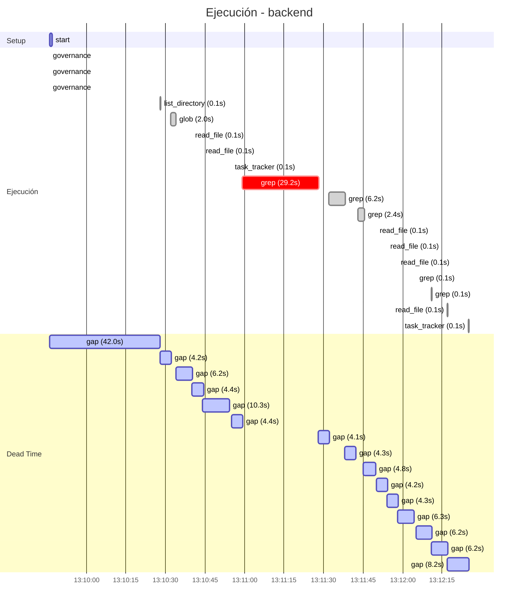

## Turn 1: Analiza los endpoint de el servior mcp que trabajan sobre los estatus, logs y errores de contenedore...[truncated]

- **Circuito**: `backend`
- **Conversación OpenHands**: [`2b2af8cc-0e79-4c3a-9925-92ac58086a76`](http://localhost:3012/conversations/2b2af8cc-0e79-4c3a-9925-92ac58086a76)
- **Workspace**: `/contenedores/conti-backend`
- **Inicio**: 2026-07-06T13:09:46.155514-03:00
- **Fin**: 2026-07-06T13:19:47.634602-03:00
- **Duración**: 601.479s
- **Eventos**: 59

## Timeline (Gantt)



## Tools Ejecutadas

| # | Tool | Inicio | Duración | OK | Args/Result |
|---|------|--------|----------|-----|-------------|
| 1 | `governance:ponytail_rules` | 13:09:46 | 0.0s | ✅ |  |
| 2 | `governance:onboarding_file` | 13:09:46 | 0.0s | ✅ |  |
| 3 | `governance:get_rules` | 13:09:46 | 0.0s | ✅ |  |
| 4 | `list_directory` | 13:10:28 | 0.0s | ✅ | Listed directory: /contenedores/conti-backend (70 entries) |
| 5 | `glob` | 13:10:32 | 2.0s | ✅ | Found 100 file(s) matching pattern '**/*mcp*' in '/contenedo...[truncated] |
| 6 | `read_file` | 13:10:40 | 0.0s | ✅ | Read file: /contenedores/conti-backend/docs/mcp_tools_doc.MD...[truncated] |
| 7 | `read_file` | 13:10:44 | 0.0s | ✅ | Read file: /contenedores/conti-backend/docs/mcp_tools_doc.MD...[truncated] |
| 8 | `task_tracker` | 13:10:55 | 0.0s | ✅ | `plan` |
| 9 | `grep` | 13:10:59 | 29.2s | ❌ | Command '['grep', '-R', '-I', '-l', '-i', 'get_container_hea...[truncated] |
| 10 | `grep` | 13:11:32 | 6.2s | ✅ | `/contenedores/conti-backend/app` |
| 11 | `grep` | 13:11:43 | 2.4s | ✅ | `/contenedores/conti-backend/app` |
| 12 | `read_file` | 13:11:50 | 0.0s | ✅ | Read file: /contenedores/conti-backend/app/tools/container_t...[truncated] |
| 13 | `read_file` | 13:11:54 | 0.0s | ✅ | Read file: /contenedores/conti-backend/app/core/categories.p...[truncated] |
| 14 | `read_file` | 13:11:58 | 0.0s | ✅ | Read file: /contenedores/conti-backend/app/services/registry...[truncated] |
| 15 | `grep` | 13:12:05 | 0.0s | ❌ | `/contenedores/conti-backend/app/services/registry_service.py` |
| 16 | `grep` | 13:12:11 | 0.0s | ✅ | `/contenedores/conti-backend/app/services` |
| 17 | `read_file` | 13:12:17 | 0.0s | ✅ | Read file: /contenedores/conti-backend/app/services/registry...[truncated] |
| 18 | `task_tracker` | 13:12:25 | 0.0s | ✅ | `plan` |

## Reasoning del Agente

### 13:10:28 → `list_directory`

> Voy a analizar los endpoints del servidor MCP que trabajan sobre estatus, logs y errores de contenedores. Primero necesito entender el entorno y la estructura del código. Comenzaré explorando el repositorio para encontrar los endpoints MCP relevantes.

Primero, voy a revisar la estructura del proyec

### 13:10:32 → `glob`

> Necesito ver más detalles. Voy a explorar la estructura del proyecto. Primero, buscaré archivos que contengan "mcp" o "endpoint".

### 13:10:40 → `read_file`

> Necesito buscar específicamente los endpoints MCP relacionados con contenedores, estatus, logs y errores. Primero, revisaré el archivo de documentación de MCP tools para entender qué herramientas están disponibles.

### 13:10:44 → `read_file`

> Necesito ver más del archivo para encontrar las herramientas de la categoría "stack" que se mencionan en la documentación como "Estado y logs de contenedores Docker". Continuaré leyendo el archivo.

### 13:10:55 → `task_tracker`

> Perfecto. Encontré las herramientas de la categoría "stack" que son las que trabajan con contenedores:

1. `get_container_health` - Resume estado y salud de contenedores Docker accesibles desde el backend
2. `get_container_logs` - Lee logs de un contenedor Docker local con filtros por tiempo, nivel 

### 13:10:59 → `grep`

> Ahora necesito buscar la implementación de estas herramientas en el código. Primero, buscaré archivos que contengan "get_container_health" o "get_container_logs".

### 13:11:32 → `grep`

> Let me use the more efficient grep tool instead of the terminal.

### 13:11:43 → `grep`

> Ahora voy a buscar también "get_container_logs" y "get_vps_status".

### 13:11:50 → `read_file`

> Now let me look at the actual implementation of these tools.

### 13:11:54 → `read_file`

> Ahora tengo la implementación completa de las herramientas de contenedores. También necesito ver cómo están registradas y categorizadas. Voy a revisar el archivo de categorías.

### 13:11:58 → `read_file`

> Ahora necesito ver el registro de estas herramientas en el registry_service.py para entender cómo están expuestas.

### 13:12:05 → `grep`

> I need to find the specific registration of the container tools. Let me search for container tools in the registry.

### 13:12:11 → `grep`

> Let me search more specifically in the registry_service.py file:

### 13:12:17 → `read_file`

> Let me check the registry file more carefully:

### 13:12:25 → `task_tracker`

> Perfecto. Ahora tengo la información completa sobre los endpoints MCP de contenedores. Voy a actualizar el task tracker y probar las herramientas en el entorno real.

## Prompt Inyectado (governance + reglas + user)

```text
## Ponytail Rules (Reglas Comunes)


---

# Ponytail, lazy senior dev mode

You are a lazy senior developer. Lazy means efficient, not careless. The best code is the code never written.

Before writing any code, stop at the first rung that holds:

1. Does this need to be built at all? (YAGNI)
2. Does it already exist in this codebase? Reuse the helper, util, or pattern that's already here, don't re-write it.
3. Does the standard library already do this? Use it.
4. Does a native platform feature cover it? Use it.
5. Does an already-installed dependency solve it? Use it.
6. Can this be one line? Make it one line.
7. Only then: write the minimum code that works.

The ladder runs after you understand the problem, not instead of it: read the task and the code it touches, trace the real flow end to end, then climb.

Bug fix = root cause, not symptom: a report names a symptom. Grep every caller of the function you touch and fix the shared function once — one guard there is a smaller diff than one per caller, and patching only the path the ticket names leaves a sibling caller still broken.

Rules:

- No abstractions that weren't explicitly requested.
- No new dependency if it can be avoided.
- No boilerplate nobody asked for.
- Deletion over addition. Boring over clever. Fewest files possible.
- Shortest working diff wins, but only once you understand the problem. The smallest change in the wrong place isn't lazy, it's a second bug.
- Question complex requests: "Do you actually need X, or does Y cover it?"
- Pick the edge-case-correct option when two stdlib approaches are the same size, lazy means less code, not the flimsier algorithm.
- Mark intentional simplifications with a `ponytail:` comment. If the shortcut has a known ceiling (global lock, O(n²) scan, naive heuristic), the comment names the ceiling and the upgrade path.

Not lazy about: understanding the problem (read it fully and trace the real flow before picking a rung, a small diff you don't understand is just laziness dressed up as efficiency), input validation at trust boundaries, error handling that prevents data loss, security, accessibility, the calibration real hardware needs (the platform is never the spec ideal, a clock drifts, a sensor reads off), anything explicitly requested. Lazy code without its check is unfinished: non-trivial logic leaves ONE runnable check behind, the smallest thing that fails if the logic breaks (an assert-based demo/self-check or one small test file; no frameworks, no fixtures). Trivial one-liners need no test.

(Yes, this file also applies to agents working on the ponytail repo itself. Especially to them.)

---

## Onboarding (Circuito: backend)

# Onboarding Conti Backend (actualizado PLAN_3 v1.5, 30/jun/2026)

## Stack

  Estas trabajando sobre /contenedores/conti-backend que es donde estan tus propios contenedores definidos en `/contenedores/conti-backend/docker-compose.conti.yml`

### 🗺️ MAPA DE SERVICIOS - Entorno Conti
Redes Docker: `desarrollo_odoo-network-dev` y `compose_odoo-network`.

| Servicio | Contenedor Interno | Puerto Interno | Dominio / Endpoint | Ruta de Código/Volumen en Host | Estado |
| :--- | :--- | :--- | :--- | :--- | :--- |
| **Conti Backend** | `conti-backend` | 9001, 8766-8770, 8642, 18791, 9119, 3000, 3012, 3001 | N/A (Múltiples APIs y GUIs expuestas) | `./app`, `/compose`, `/desarrollo`, `openhands_workspace`, entre otros | Activo |
| **Conti OMP** | `conti-omp` | 7891, 3000 | N/A | `/desarrollo`, `/compose`, `omp_home`, `omp_data`, entre otros | Activo |
| **Conti OMP Base** | N/A (Solo imagen) | N/A | N/A | `./vendor/oh-my-pi` (Contexto de build) | Solo Build |
| **Sourcebot** (deprecated) | `conti-sourcebot` | N/A | N/A | N/A | *Descontinuado, reemplazado por codebase-memory-mcp* |

Tienes acceso a las dos redes de desarrollo y produccion.

El entrypoint donde estan definidos todos los servicios es `/contenedores/conti-backend/entrypoint_hermes.sh`


- Backend MCP/FastAPI para `conti-backend` (puerto `:9001`).
- OpenHands Agent Server REST API (puerto `:3011` → `:3000` interno).
- OpenHands Agent Canvas — GUI Next.js oficial (puerto `:3012` →
  `:3012` interno).
- OpenHands CLI textual embebido en web (puerto `:3013` → `:3001`
  interno, comando `openhands web`).

Para el MCP :

**Base URL pública**: `https://ai.contamela.com` (via Cloudflare Tunnel → `http://conti-backend:9001`)  
**Base URL interna**: `http://conti-backend:9001`  
**Invocación MCP**: `POST /mcp/call` con body `{"tool": "nombre_tool", "arguments": {...}}`  
**Listado de tools**: `GET /mcp/tools`  

Encontraras una documentacion detallada de las mcp tools del backend en `/contenedores/conti-backend/docs/mcp_tools_doc.MD`

## Categorías MCP 

Las MCP tools se filtran ahora por categoría al construir la conversación
de cada circuito. Categorías activas:

- **bootstrap**: `health_check`, `get_config`, `get_rules`, `get_onboarding`, `reload_config`
- **stack**: `get_container_health`, `get_container_logs`, `get_vps_status`

```
