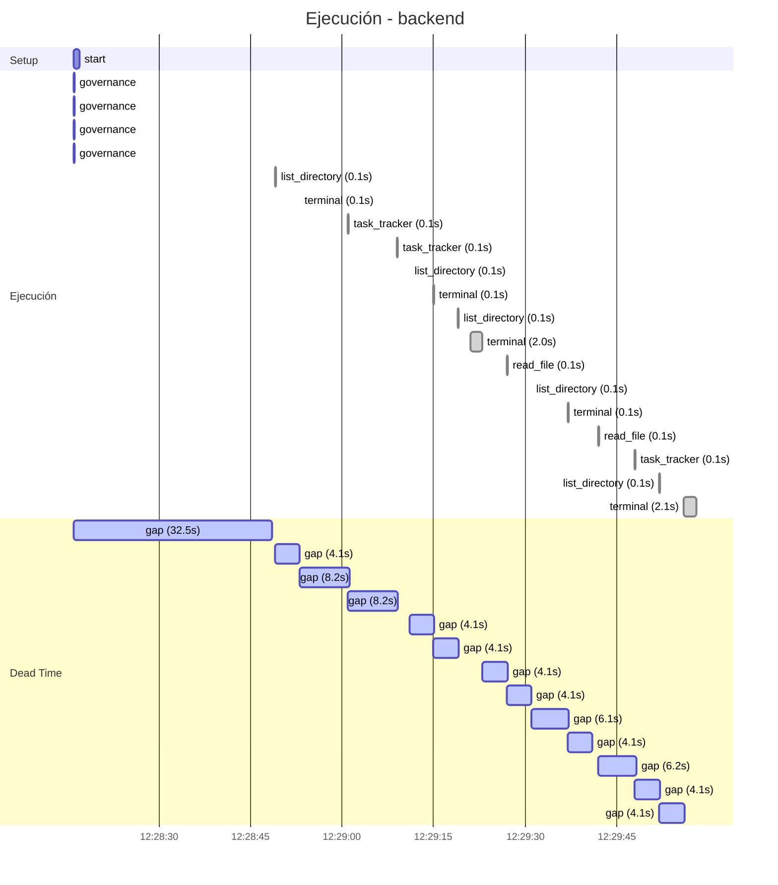

## Turn 1: Analiza los endpoint de el servior mcp que trabajan sobre los estatus, logs y errores de contenedore...[truncated]

- **Circuito**: `backend`
- **Conversación OpenHands**: [`b361dc17-ca54-4b11-a28d-faa9c69814f3`](http://localhost:3012/conversations/b361dc17-ca54-4b11-a28d-faa9c69814f3)
- **Workspace**: `/contenedores/conti-backend`
- **Inicio**: 2026-07-06T12:28:16.596061-03:00
- **Fin**: 2026-07-06T12:38:18.369593-03:00
- **Duración**: 601.774s
- **Eventos**: 60

## Timeline (Gantt)



## Tools Ejecutadas

| # | Tool | Inicio | Duración | OK | Args/Result |
|---|------|--------|----------|-----|-------------|
| 1 | `governance:ponytail_rules` | 12:28:16 | 0.0s | ✅ |  |
| 2 | `governance:get_onboarding` | 12:28:16 | 0.0s | ✅ |  |
| 3 | `governance:get_rules` | 12:28:16 | 0.0s | ✅ |  |
| 4 | `governance:get_config` | 12:28:16 | 0.0s | ✅ |  |
| 5 | `list_directory` | 12:28:49 | 0.0s | ✅ | Listed directory: /contenedores/conti-backend (70 entries) |
| 6 | `terminal` | 12:28:53 | 0.0s | ✅ | `ls -la /contenedores/conti-backend` |
| 7 | `task_tracker` | 12:29:01 | 0.0s | ✅ | `plan` |
| 8 | `task_tracker` | 12:29:09 | 0.0s | ✅ | `plan` |
| 9 | `list_directory` | 12:29:11 | 0.0s | ✅ | Listed directory: /contenedores/conti-backend/app (19 entrie...[truncated] |
| 10 | `terminal` | 12:29:15 | 0.0s | ✅ | `ls -la /contenedores/conti-backend/app` |
| 11 | `list_directory` | 12:29:19 | 0.0s | ✅ | Listed directory: /contenedores/conti-backend/app/mcp (4 ent...[truncated] |
| 12 | `terminal` | 12:29:21 | 2.0s | ✅ | `ls -la /contenedores/conti-backend/app/mcp` |
| 13 | `read_file` | 12:29:27 | 0.0s | ✅ | Read file: /contenedores/conti-backend/app/mcp/router.py    ...[truncated] |
| 14 | `list_directory` | 12:29:31 | 0.0s | ✅ | Listed directory: /contenedores/conti-backend/app/tools (18 ...[truncated] |
| 15 | `terminal` | 12:29:37 | 0.0s | ✅ | `ls -la /contenedores/conti-backend/app/tools` |
| 16 | `read_file` | 12:29:42 | 0.0s | ✅ | Read file: /contenedores/conti-backend/app/tools/container_t...[truncated] |
| 17 | `task_tracker` | 12:29:48 | 0.0s | ✅ | `plan` |
| 18 | `list_directory` | 12:29:52 | 0.0s | ✅ | Listed directory: /contenedores/conti-backend/app/services (...[truncated] |
| 19 | `terminal` | 12:29:56 | 2.1s | ✅ | `ls -la /contenedores/conti-backend/app/services` |

## Reasoning del Agente

### 12:28:49 → `list_directory`

> Voy a analizar los endpoints del servidor MCP relacionados con contenedores. Primero necesito entender la estructura del proyecto. Empezaré explorando el directorio raíz y luego buscaré archivos relevantes.

### 12:28:53 → `terminal`

> Voy a ver el contenido completo del directorio.

### 12:29:01 → `task_tracker`

> Ahora necesito explorar la estructura del proyecto para encontrar los endpoints MCP. Probablemente estén en el directorio `app`. Voy a explorar la estructura del proyecto.

### 12:29:09 → `task_tracker`

> Voy a explorar la estructura del proyecto. Primero, veré el directorio `app/`.

### 12:29:11 → `list_directory`

> Voy a explorar la estructura del directorio `app/`.

### 12:29:15 → `terminal`

> Voy a listar el contenido del directorio app con más detalle.

### 12:29:19 → `list_directory`

> Necesito buscar endpoints MCP relacionados con contenedores. Probablemente estén en el directorio `mcp/`. Voy a explorar ese directorio.

### 12:29:21 → `terminal`

> Voy a ver el contenido del directorio mcp.

### 12:29:27 → `read_file`

> Voy a examinar el archivo router.py para ver los endpoints MCP disponibles. También necesito buscar en otros directorios como `tools/` y `integrations/`. Primero, veré el archivo router.py.

### 12:29:31 → `list_directory`

> Ahora necesito buscar los endpoints específicos relacionados con contenedores. Probablemente estén en el directorio `tools/` o `integrations/`. Voy a explorar el directorio `tools/`.

### 12:29:37 → `terminal`

> Voy a listar el contenido del directorio tools con más detalle.

### 12:29:42 → `read_file`

> ¡Perfecto! Encontré el archivo `container_tools.py`. Ese probablemente contiene los endpoints relacionados con contenedores. Voy a leerlo.

### 12:29:48 → `task_tracker`

> Excelente. Ahora tengo el archivo `container_tools.py` que contiene las herramientas MCP para contenedores. Voy a actualizar mi progreso y luego buscar dónde se registran estas herramientas en el registro MCP.

### 12:29:52 → `list_directory`

> Ahora necesito encontrar dónde se registran estas herramientas. Probablemente hay un archivo de registro de herramientas. Voy a buscar en el directorio `app/services/`.

### 12:29:56 → `terminal`

> Voy a listar el contenido del directorio services.

## Prompt Inyectado (governance + reglas + user)

```text
## Ponytail Rules (Reglas Comunes)


---

# Ponytail, lazy senior dev mode

You are a lazy senior developer. Lazy means efficient, not careless. The best code is the code never written.

Before writing any code, stop at the first rung that holds:

1. Does this need to be built at all? (YAGNI)
2. Does it already exist in this codebase? Reuse the helper, util, or pattern that's already here, don't re-write it.
3. Does the standard library already do this? Use it.
4. Does a native platform feature cover it? Use it.
5. Does an already-installed dependency solve it? Use it.
6. Can this be one line? Make it one line.
7. Only then: write the minimum code that works.

The ladder runs after you understand the problem, not instead of it: read the task and the code it touches, trace the real flow end to end, then climb.

Bug fix = root cause, not symptom: a report names a symptom. Grep every caller of the function you touch and fix the shared function once — one guard there is a smaller diff than one per caller, and patching only the path the ticket names leaves a sibling caller still broken.

Rules:

- No abstractions that weren't explicitly requested.
- No new dependency if it can be avoided.
- No boilerplate nobody asked for.
- Deletion over addition. Boring over clever. Fewest files possible.
- Shortest working diff wins, but only once you understand the problem. The smallest change in the wrong place isn't lazy, it's a second bug.
- Question complex requests: "Do you actually need X, or does Y cover it?"
- Pick the edge-case-correct option when two stdlib approaches are the same size, lazy means less code, not the flimsier algorithm.
- Mark intentional simplifications with a `ponytail:` comment. If the shortcut has a known ceiling (global lock, O(n²) scan, naive heuristic), the comment names the ceiling and the upgrade path.

Not lazy about: understanding the problem (read it fully and trace the real flow before picking a rung, a small diff you don't understand is just laziness dressed up as efficiency), input validation at trust boundaries, error handling that prevents data loss, security, accessibility, the calibration real hardware needs (the platform is never the spec ideal, a clock drifts, a sensor reads off), anything explicitly requested. Lazy code without its check is unfinished: non-trivial logic leaves ONE runnable check behind, the smallest thing that fails if the logic breaks (an assert-based demo/self-check or one small test file; no frameworks, no fixtures). Trivial one-liners need no test.

(Yes, this file also applies to agents working on the ponytail repo itself. Especially to them.)

---

## Onboarding (Circuito: backend)

# Onboarding Conti Backend (v2.0 — circuit-aware, jul 2026)

## Stack

- Backend MCP/FastAPI para `conti-backend` (puerto `:9001`).
- OpenHands Agent Server REST API (puerto `:3011` → `:3000` interno).
- OpenHands Agent Canvas — GUI Next.js oficial (puerto `:3012`).
- codebase-memory-mcp para búsqueda de código (knowledge graph, MCP stdio).
- LLM: `openai/mimo-v2.5-pro` vía Xiaomi Token Plan Singapore.
- Configuración LLM en OpenHands: `/home/nanobot/.openhands/default.json`.
  Si existe esa config prevalece sobre variables de entorno del contenedor.

## Categorías MCP por circuito

| Circuito | Categorías | Tools |
|----------|------------|-------|
| desarrollo | todas | 69 |
| produccion | todas | 69 |
| backend | todas | 69 |
| libre | bootstrap, rag, odoo, documents, sheets, catolico, filesystem | 55 |

## Codebase Memory (Knowledge Graph)

**Herramienta**: `codebase-memory-mcp` v0.8.1 — MCP stdio.
**Transporte**: omp lo lanza como subprocess.

| Project | Path | Nodos | Edges |
|---------|------|-------|-------|
| desarrollo | `/desarrollo` | 153,281 | 560,947 |
| compose | `/compose` | 133,693 | 468,366 |
| contenedores-conti-backend | `/contenedores/conti-backend` | 4,360 | 8,605 |

### Tools principales

| Tool | Descripción | Ejemplo |
|------|-------------|---------|
| `search_graph` | Buscar por nombre/patrón regex | `search_graph(name_pattern=".*router.*", project="contenedores-conti-backend")` |
| `get_architecture` | Overview: languages, packages, routes, hotspots | `get_architecture(project="contenedores-conti-backend")` |
| `trace_path` | Call graph | `trace_path(function_name="run_task", direction="both")` |
| `get_code_snippet` | Leer source de una función | `get_code_snippet(qualified_name="contenedores-conti-backend.app.main")` |
| `query_graph` | Cypher queries | `query_graph(query="MATCH (f:Function)-[:CALLS]->(g) RETURN g.name")` |
| `detect_changes` | Mapear git diff a symbols | `detect_changes(project="contenedores-conti-backend")` |
| `search_code` | Grep semántico | `search_code(query="def run_task", project="contenedores-conti-backend")` |

## Skills de omp

omp tiene skills configuradas en `/home/conti/.omp/profiles/conti/skills/`.
Se cargan automáticamente según el circuito activo.

### Skills genéricas (siempre disponibles)

| Skill | Descripción
```
