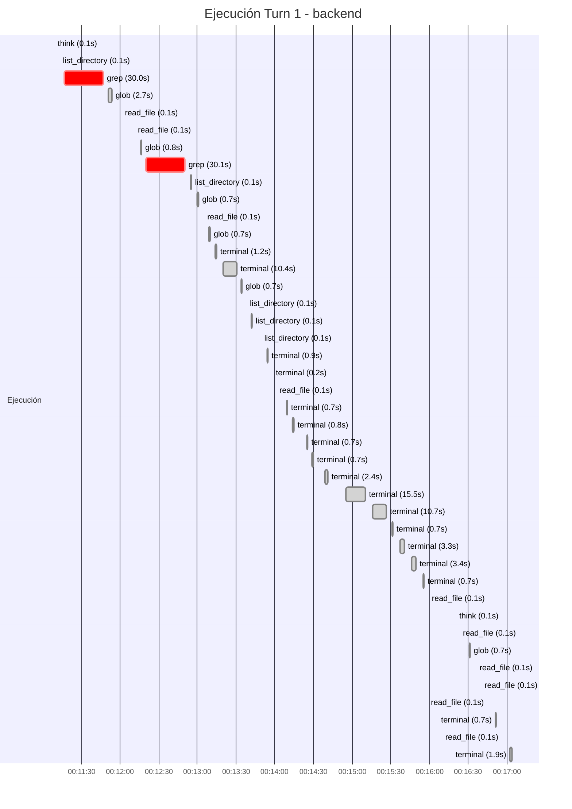

## Turn 1: Analiza los endpoint de el servior mcp que trabajan sobre los estatus, logs y errores de contenedore...

- **Circuito**: `backend`
- **Conversación OpenHands**: [`dec2b9b4-b25a-415a-abc2-f669df23b460`](http://localhost:3012/conversations/dec2b9b4-b25a-415a-abc2-f669df23b460)
- **Workspace**: `/contenedores/conti-backend`
- **Inicio**: 2026-07-07T00:09:58.626339
- **Fin**: 2026-07-07T00:18:33.640597
- **Duración**: 8m 35s
- **Eventos**: 129

## Prompt Completo

```text
Analiza los endpoint de el servior mcp que trabajan sobre los estatus, logs y errores de contenedores verifica si estan actualizados con el entrorno real y dame un informe
```

## Timeline (Gantt)



## Tools Ejecutadas (42)

| # | Tool | Inicio | Duración | OK | Args/Result |
|---|------|--------|----------|-----|-------------|
| 1 | `think` | 00:11:09 | 0.1s | ✅ | Your thought has been logged. |
| 2 | `list_directory` | 00:11:13 | 0.1s | ✅ | Listed directory: /contenedores/conti-backend (70 entries) |
| 3 | `grep` | 00:11:17 | 30.0s | ❌ | /contenedores/conti-backend |
| 4 | `glob` | 00:11:51 | 2.7s | ✅ | Found 100 file(s) matching pattern '**/mcp*' in '/contenedores/conti-backend': /contenedores/conti-backend/docs/mcp_tool |
| 5 | `read_file` | 00:12:01 | 0.1s | ✅ | Read file: /contenedores/conti-backend/docs/mcp_tools_doc.MD (showing lines 1-1000 of 1423) To read more, use: read_file |
| 6 | `read_file` | 00:12:11 | 0.1s | ✅ | Read file: /contenedores/conti-backend/docs/mcp_tools_doc.MD    1001  - **Esquema de Entrada**:   1002    ```json   1003 |
| 7 | `glob` | 00:12:16 | 0.8s | ✅ | No files found matching pattern '**/stack*.py' in directory '/contenedores/conti-backend' |
| 8 | `grep` | 00:12:20 | 30.1s | ❌ | /contenedores/conti-backend |
| 9 | `list_directory` | 00:12:55 | 0.1s | ✅ | Listed directory: /contenedores/conti-backend/app (19 entries) |
| 10 | `glob` | 00:13:00 | 0.7s | ✅ | Found 2 file(s) matching pattern '**/mcp*.py' in '/contenedores/conti-backend': /contenedores/conti-backend/vendor/OpenH |
| 11 | `read_file` | 00:13:05 | 0.1s | ✅ | Read file: /contenedores/conti-backend/vendor/OpenHands/openhands/app_server/mcp/mcp_router.py (showing lines 1-100 of 4 |
| 12 | `glob` | 00:13:09 | 0.7s | ✅ | No files found matching pattern '**/tools*.py' in directory '/contenedores/conti-backend' |
| 13 | `terminal` | 00:13:14 | 1.2s | ✅ | find /contenedores/conti-backend -type f -name "*.py" -exec grep -l "get_container_health" {} \; 2>/dev/null \| head -20 |
| 14 | `terminal` | 00:13:20 | 10.4s | ✅ | grep -r "get_container_health" /contenedores/conti-backend --include="*.py" 2>/dev/null \| head -20 |
| 15 | `glob` | 00:13:34 | 0.7s | ✅ | Found 3 file(s) matching pattern '**/mcp*.json' in '/contenedores/conti-backend': /contenedores/conti-backend/vendor/oh- |
| 16 | `list_directory` | 00:13:38 | 0.1s | ✅ | Listed directory: /contenedores/conti-backend/config (1 entries) |
| 17 | `list_directory` | 00:13:42 | 0.1s | ✅ | Listed directory: /contenedores/conti-backend/config (1 entries) |
| 18 | `list_directory` | 00:13:49 | 0.1s | ✅ | Listed directory: /contenedores/conti-backend/app (19 entries) |
| 19 | `terminal` | 00:13:54 | 0.9s | ✅ | ls -la /contenedores/conti-backend/app/ |
| 20 | `terminal` | 00:13:58 | 0.2s | ✅ | find /contenedores/conti-backend/app/tools -name "*.py" -type f \| head -30 |
| 21 | `read_file` | 00:14:01 | 0.1s | ✅ | Read file: /contenedores/conti-backend/app/tools/container_tools.py       1  from __future__ import annotations      2   |
| 22 | `terminal` | 00:14:09 | 0.7s | ✅ | docker ps --format '{{.Names}}' \| sort |
| 23 | `terminal` | 00:14:14 | 0.8s | ✅ | DOCKER_API_VERSION=1.44 docker ps --format '{{.Names}}' \| sort |
| 24 | `terminal` | 00:14:25 | 0.7s | ✅ | DOCKER_API_VERSION=1.44 docker ps -a --format '{{.Names}}\t{{.Status}}' \| sort |
| 25 | `terminal` | 00:14:29 | 0.7s | ✅ | DOCKER_API_VERSION=1.44 docker network ls --format '{{.Name}}' \| sort |
| 26 | `terminal` | 00:14:39 | 2.4s | ✅ | DOCKER_API_VERSION=1.44 docker ps -a --format '{{.Names}}' \| while read name; do echo "=== $name ==="; DOCKER_API_VERSIO |
| 27 | `terminal` | 00:14:55 | 15.5s | ✅ | curl -s -X POST http://localhost:9001/mcp/call \   -H "Content-Type: application/json" \   -d '{"name": "get_container_h |
| 28 | `terminal` | 00:15:16 | 10.7s | ✅ | curl -s -m 10 http://localhost:9001/mcp 2>&1 \| head -20 |
| 29 | `terminal` | 00:15:31 | 0.7s | ✅ | ss -tlnp \| grep 9001 |
| 30 | `terminal` | 00:15:37 | 3.3s | ✅ | cd /contenedores/conti-backend && python3 -c " import sys sys.path.insert(0, '.') from app.tools.container_tools import  |
| 31 | `terminal` | 00:15:46 | 3.4s | ✅ | find /contenedores/conti-backend -name "docker-compose*.yml" -o -name "docker-compose*.yaml" \| head -10 |
| 32 | `terminal` | 00:15:55 | 0.7s | ✅ | grep -r "container_name" /contenedores/conti-backend/docker-compose.conti.yml 2>/dev/null \| head -30 |
| 33 | `read_file` | 00:15:59 | 0.1s | ✅ | Read file: /contenedores/conti-backend/entrypoint_hermes.sh (showing lines 1-50 of 211) To read more, use: read_file(fil |
| 34 | `think` | 00:16:20 | 0.1s | ✅ | Your thought has been logged. |
| 35 | `read_file` | 00:16:23 | 0.1s | ✅ | Read file: /contenedores/conti-backend/app/tools/system_status.py       1  from __future__ import annotations      2     |
| 36 | `glob` | 00:16:31 | 0.7s | ✅ | No files found matching pattern '**/mcp_server*.py' in directory '/contenedores/conti-backend' |
| 37 | `read_file` | 00:16:36 | 0.1s | ✅ | Read file: /contenedores/conti-backend/app/main.py       1  from __future__ import annotations      2        3  from fas |
| 38 | `read_file` | 00:16:40 | 0.1s | ✅ | Read file: /contenedores/conti-backend/app/mcp/router.py       1  from __future__ import annotations      2        3  im |
| 39 | `read_file` | 00:16:45 | 0.1s | ✅ | Read file: /contenedores/conti-backend/app/services/registry_service.py (showing lines 1-80 of 1738) To read more, use:  |
| 40 | `terminal` | 00:16:51 | 0.7s | ✅ | grep -n "container_tools\\|get_container_health\\|get_container_logs\\|get_vps_status" /contenedores/conti-backend/app/serv |
| 41 | `read_file` | 00:16:56 | 0.1s | ✅ | Read file: /contenedores/conti-backend/app/services/registry_service.py (showing lines 731-810 of 1738) To read more, us |
| 42 | `terminal` | 00:17:02 | 1.9s | ✅ | DOCKER_API_VERSION=1.44 docker ps -a --format 'table {{.Names}}\t{{.Status}}\t{{.Networks}}' \| sort |

## Respuesta del Agente

---

# Informe: Análisis de Endpoints MCP — Categoría `stack` (Contenedores)

## 1. Endpoints analizados

| Tool MCP | Archivo de implementación | Líneas |
|----------|--------------------------|--------|
| `get_container_health` | `app/tools/container_tools.py:12-44` | Resumen de estado/health |
| `get_container_logs` | `app/tools/container_tools.py:47-89` | Logs con filtros por nivel/tiempo |
| `get_vps_status` | `app/tools/container_tools.py:92-105` | Vista combinada Docker + Git |

Registrados en `app/services/registry_service.py:731-793`.

---

## 2. Comparación: Listas Hardcoded vs Entorno Real

### `_build_environment_summary()` (líneas 186-262) tiene listas desactualizadas

#### Producción (`compose_odoo-network`)

| Contenedor | En código hardcoded | En entorno real | Estado real |
|------------|:------------------:|:---------------:|:-----------:|
| `django-api` | ✅ | ✅ | Up |
| `odoo18` | ✅ | ✅ | Up (healthy) |
| `evolution-api-server` | ✅ | ❌ **NO EXISTE** | — |
| `wppconnect-server` | ✅ | ✅ | Exited |
| `n8n` | ✅ | ✅ | Up |
| `chatwoot_web` | ✅ | ✅ | Exited |
| `chatwoot_worker` | ✅ | ✅ | Exited |
| `portainer` | ✅ | ✅ | Up |
| `cloudflared-tunnel` | ✅ | ✅ | Up |
| `ollama` | ✅ | ❌ **NO EXISTE** | — |
| `compose-db-1` | ✅ | ✅ | Up (healthy) |
| `redis_odoo` | ✅ | ✅ | Up |
| `chatui` | ❌ FALTA | ✅ | Up |
| `flamehaven` | ❌ FALTA | ✅ | Up (healthy) |
| `conti-backend` | ❌ FALTA | ✅ | Up (unhealthy) |
| `conti-omp` | ❌ FALTA | ✅ | Up (healthy) |
| `conti-sourcebot` | ❌ FALTA | ✅ | Up (healthy) |

**Resultado**: 2 fantasmas, 5 contenedores reales no listados.

#### Desarrollo (`desarrollo_odoo-network-dev`)

| Contenedor | En código hardcoded | En entorno real | Estado real |
|------------|:------------------:|:---------------:|:-----------:|
| `django-dev` | ✅ | ✅ | Exited |
| `odoo_dev` | ✅ | ✅ | Exited |
| `n8n_dev` | ✅ | ✅ | Exited |
| `chatwoot_web_dev` | ✅ | ✅ | Exited |
| `chatwoot_worker_dev` | ✅ | ✅ | Exited |
| `cloudflare-tunnel-dev` | ✅ | ✅ | Exited |
| `db_dev` | ✅ | ✅ | Up (healthy) |
| `redis_odoo_dev` | ✅ | ✅ | Exited |
| `conti-backend` | ✅ | ✅ | Up |
| `flamehaven` | ❌ FALTA | ✅ | Up (healthy) |
| `conti-sourcebot` | ❌ FALTA | ✅ | Up (healthy) |

**Resultado**: 2 contenedores reales no listados.

#### Contenedores fuera de ambas redes esperadas (agrupados como `other`)

| Contenedor | Red | Estado |
|------------|-----|--------|
| `monitor_netdata` | host | Created |

---

## 3. Bugs y Problemas Encontrados

### BUG 1 — Parámetro `env` ignorado (SEVERIDAD: MEDIA)

Las 3 tools aceptan `env` (`"local" | "dev" | "prod" | "all"`) en su schema, pero **ninguna lo usa para filtrar**. 

```python
# Línea 13: captura el valor pero nunca lo pasa a _docker_ps
requested_env = str(args.get("env", "local") or "local")
containers = _docker_ps(container_name=container_name)  # ← no recibe env
```

`_docker_ps()` lista **todos** los contenedores corriendo sin discriminar red/entorno. El valor `requested_env` solo se copia al output como metadato inútil. Si Luis pide `env="prod"`, igualmente ve `db_dev` y `conti-sourcebot`.

### BUG 2 — `_container_image()` crashea si la imagen fue borrada (SEVERIDAD: MEDIA)

```python
# Línea 271: container.image accede al SDK que busca la imagen por ID
tags = getattr(container.image, "tags", None) or []
```

Docker SDK dispara `images.get(image_id)` que lanza `ImageNotFound` si la imagen fue `docker rmi`'d. Esto **rompe toda la cadena**: `_build_environment_summary()` → `get_container_logs()` → `get_vps_status()`. Confirmado en runtime al ejecutar el código directamente:

```
docker.errors.ImageNotFound: No such image: sha256:94ca66a47c...
```

### BUG 3 — Dead code en `_since_to_datetime` (SEVERIDAD: BAJA)

```python
# Línea 304-305
    return int((datetime.now(timezone.utc) - delta).timestamp())
    return None  # ← unreachable, nunca se ejecuta
```

### BUG 4 — `get_container_health` no filtra por contenedor específico eficientemente (SEVERIDAD: BAJA)

Cuando se pasa `container="odoo18"`, `_docker_ps` hace `client.containers.list(all=False, filters={"name": "odoo18"})` que es correcto. Pero luego `_docker_inspect_health()` hace un segundo `client.containers.get(container)` — una llamada HTTP extra al Docker daemon innecesaria (ya tenemos el objeto del primer listado).

### BUG 5 — Regex de warnings demasiado permisivo (SEVERIDAD: BAJA)

```python
_WARN_RE = _re.compile(
    r'\bWARNING\b'
    r'|\bWARN\b'           # ← matchea "WARN" en cualquier contexto
    ...
)
```

`\bWARN\b` captura tokens como `"WARN"` dentro de JSON sin escapar (e.g., `"message": "WARN: deprecated"`). No es un falso positivo grave pero sí ruidoso en logs estructurados.

---

## 4. Lo que funciona bien

| Aspecto | Evaluación |
|---------|-----------|
| `_filter_log_lines()` — regex ERROR/CRITICAL/FATAL/Traceback | ✅ Sólido, cubre Python, JSON structured logging, bracket style |
| Filtro de timestamps Docker | ✅ Regex `^\S+Z\s+` correcto para Docker timestamps |
| Filtro de nivel por warning | ✅ Funcional, aunque WARN es algo permisivo |
| `_since_to_datetime` — parseo de "24h", "30m", "7d" | ✅ Correcto (salvo dead code al final) |
| `_format_ports` | ✅ Formateo limpio de port mappings |
| `_docker_client()` — socket Unix | ✅ Ruta `unix:///var/run/docker.sock` correcta |
| Documentación MCP (`mcp_tools_doc.MD`) vs implementación | ✅ Schema y descripciones coinciden con el código |

---

## 5. Resumen Ejecutivo

| Hallazgo | Impacto |
|----------|---------|
| **Listas de contenedores hardcoded desactualizadas** | Los reportes de `get_container_health` y `get_vps_status` muestran `missing` para contenedores que sí existen (`chatui`, `flamehaven`, `conti-omp`) y no marcan como `missing` a los que ya no existen (`evolution-api-server`, `ollama`) |
| **Parámetro `env` no implementado** | No se puede filtrar por entorno; siempre devuelve todo mezclado |
| **`_container_image()` falla con imágenes borradas** | Rompe `_build_environment_summary` y cascading a `get_container_logs` y `get_vps_status` |
| **Dead code** | Línea 305 unreachable |

**Conclusión**: Las tools están **funcionalmente desactualizadas con el entorno real**. La documentación MCP (`mcp_tools_doc.MD`) es consistente con el código, pero el código no es consistente con la infraestructura Docker actual. Las listas hardcoded necesitan actualización y el parámetro `env` necesita implementación real.

## Errores

| # | Tool | Error |
|---|------|-------|
| 1 | `grep` | Command '['grep', '-R', '-I', '-l', '-i', 'container\|health\|logs\|error', '/contenedores/conti-backend']' timed out after 30 seconds |
| 2 | `grep` | Command '['grep', '-R', '-I', '-l', '-i', 'get_container_health', '/contenedores/conti-backend']' timed out after 30 seconds |

## Tokens por Llamada LLM

| # | Prompt | Cache Read | Cache % | Nuevos | Completion | Reasoning | Delta |
|---|--------|------------|---------|--------|------------|-----------|-------|
| 1 | 504 | 448 | 88.9% | 56 | 1,292 | 1,283 | 1,796 |
| 2 | 14,895 | 2,496 | 16.8% | 12,399 | 1,422 | 1,333 | 14,521 |
| 3 | 29,433 | 16,832 | 57.2% | 12,601 | 1,487 | 1,368 | 14,603 |
| 4 | 44,063 | 31,360 | 71.2% | 12,703 | 1,611 | 1,423 | 14,754 |
| 5 | 58,878 | 45,952 | 78.0% | 12,926 | 1,706 | 1,481 | 14,910 |
| 6 | 76,673 | 60,544 | 79.0% | 16,129 | 1,789 | 1,529 | 17,878 |
| 7 | 108,690 | 78,336 | 72.1% | 30,354 | 1,888 | 1,570 | 32,116 |
| 8 | 148,228 | 110,336 | 74.4% | 37,892 | 2,070 | 1,710 | 39,720 |
| 9 | 187,980 | 149,824 | 79.7% | 38,156 | 2,152 | 1,729 | 39,834 |
| 10 | 227,871 | 189,568 | 83.2% | 38,303 | 2,232 | 1,767 | 39,971 |
| 11 | 267,870 | 229,312 | 85.6% | 38,558 | 2,295 | 1,789 | 40,062 |
| 12 | 308,017 | 269,184 | 87.4% | 38,833 | 2,367 | 1,809 | 40,219 |
| 13 | 349,580 | 309,120 | 88.4% | 40,460 | 2,464 | 1,866 | 41,660 |
| 14 | 391,272 | 350,656 | 89.6% | 40,616 | 2,566 | 1,881 | 41,794 |
| 15 | 433,128 | 392,320 | 90.6% | 40,808 | 2,653 | 1,890 | 41,943 |
| 16 | 475,157 | 434,112 | 91.4% | 41,045 | 2,730 | 1,924 | 42,106 |
| 17 | 517,385 | 475,904 | 92.0% | 41,481 | 2,818 | 1,970 | 42,316 |
| 18 | 559,728 | 517,888 | 92.5% | 41,840 | 2,869 | 1,979 | 42,394 |
| 19 | 602,149 | 560,064 | 93.0% | 42,085 | 2,955 | 2,020 | 42,507 |
| 20 | 644,684 | 602,368 | 93.4% | 42,316 | 3,047 | 2,050 | 42,627 |
| 21 | 688,018 | 644,736 | 93.7% | 43,282 | 3,125 | 2,070 | 43,412 |
| 22 | 731,721 | 688,064 | 94.0% | 43,657 | 3,177 | 2,089 | 43,755 |
| 23 | 779,714 | 731,712 | 93.8% | 48,002 | 3,407 | 2,252 | 48,223 |
| 24 | 828,027 | 779,648 | 94.2% | 48,379 | 3,483 | 2,269 | 48,389 |
| 25 | 876,521 | 827,904 | 94.5% | 48,617 | 3,557 | 2,281 | 48,568 |
| 26 | 925,437 | 876,352 | 94.7% | 49,085 | 3,616 | 2,288 | 48,975 |
| 27 | 974,519 | 925,248 | 94.9% | 49,271 | 3,737 | 2,300 | 49,203 |
| 28 | 1,024,087 | 974,272 | 95.1% | 49,815 | 4,409 | 2,796 | 50,240 |
| 29 | 1,074,413 | 1,023,808 | 95.3% | 50,605 | 4,507 | 2,833 | 50,424 |
| 30 | 1,124,891 | 1,074,112 | 95.5% | 50,779 | 4,593 | 2,867 | 50,564 |
| 31 | 1,175,517 | 1,124,544 | 95.7% | 50,973 | 4,735 | 2,885 | 50,768 |
| 32 | 1,227,114 | 1,175,104 | 95.8% | 52,010 | 4,873 | 2,956 | 51,735 |
| 33 | 1,279,089 | 1,226,688 | 95.9% | 52,401 | 4,947 | 2,965 | 52,049 |
| 34 | 1,331,219 | 1,278,656 | 96.1% | 52,563 | 5,012 | 2,985 | 52,195 |
| 35 | 1,384,316 | 1,330,752 | 96.1% | 53,564 | 5,983 | 3,028 | 54,068 |
| 36 | 1,438,401 | 1,383,808 | 96.2% | 54,593 | 6,036 | 3,048 | 54,138 |
| 37 | 1,492,724 | 1,437,888 | 96.3% | 54,836 | 6,093 | 3,063 | 54,380 |
| 38 | 1,547,138 | 1,492,160 | 96.4% | 54,978 | 6,137 | 3,076 | 54,458 |
| 39 | 1,602,883 | 1,546,560 | 96.5% | 56,323 | 6,185 | 3,091 | 55,793 |
| 40 | 1,662,683 | 1,602,240 | 96.4% | 60,443 | 6,244 | 3,106 | 59,859 |
| 41 | 1,723,409 | 1,662,016 | 96.4% | 61,393 | 6,324 | 3,115 | 60,806 |
| 42 | 1,784,365 | 1,722,688 | 96.5% | 61,677 | 6,389 | 3,125 | 61,021 |
| 43 | 1,846,496 | 1,783,616 | 96.6% | 62,880 | 6,489 | 3,141 | 62,231 |
| 44 | 1,909,243 | 1,845,696 | 96.7% | 63,547 | 9,326 | 3,966 | 65,584 |
| 45 | 1,964,719 | 1,855,936 | 94.5% | 108,783 | 10,268 | 4,887 | 56,418 |

## Reasoning del Agente

### 00:11:09 → `think`

> Voy a analizar los endpoints del servidor MCP que trabajan sobre estados, logs y errores de contenedores. Primero necesito entender la estructura del proyecto y localizar los endpoints MCP. Empezaré explorando el código.

### 00:11:13 → `list_directory`

> Primero voy a ver el directorio actual y luego buscaré archivos relevantes. El proyecto está en /contenedores/conti-backend. Voy a listar su contenido.

### 00:11:17 → `grep`

> El archivo es demasiado largo (448 líneas). Necesito ver la parte que define los endpoints MCP, especialmente los relacionados con contenedores (estatus, logs, errores). Voy a buscar por "container" o "health" o "logs".

### 00:11:51 → `glob`

> Voy a buscar en el archivo de herramientas MCP usando read_file con un rango específico. Primero necesito ver dónde están definidas las tools MCP. Tal vez en algún archivo de herramientas. Voy a buscar archivos que contengan "tool" o "mcp".

### 00:12:01 → `read_file`

> Veo que hay un archivo de documentación de herramientas MCP: `/contenedores/conti-backend/docs/mcp_tools_doc.MD`. Eso debería tener la lista de todas las herramientas MCP. Voy a leerlo primero.

### 00:12:11 → `read_file`

> Necesito ver más del archivo, especialmente la categoría "stack" que debería contener las herramientas relacionadas con contenedores. Voy a leer desde la línea 1000.

### 00:12:16 → `glob`

> Perfecto. He encontrado la sección "stack" que contiene las herramientas relacionadas con contenedores. Son:

1. `get_container_health` - Resume estado y salud de contenedores Docker
2. `get_container_logs` - Lee logs de un contenedor Docker local con filtros
3. `get_vps_status` - Da una vista consolidada del estado Docker local y del repo Git

Ahora necesito verificar si estas herramientas están actualizadas con el entorno real. Primero, voy a ver el código fuente de estas herramientas para ent

### 00:12:20 → `grep`

> Voy a buscar archivos que contengan "get_container_health" para encontrar la implementación.

### 00:12:55 → `list_directory`

> Voy a buscar en los archivos de configuración MCP. Tal vez hay un archivo de registro de herramientas. Primero voy a ver el directorio `app` o `src`.

### 00:13:00 → `glob`

> Voy a buscar en el directorio app/archivos que contengan "mcp" o "tools".

### 00:13:05 → `read_file`

> Parece que el MCP router está en vendor/OpenHands. Voy a explorar ese archivo.

### 00:13:09 → `glob`

> Este archivo es del OpenHands, no del backend de conti. Necesito buscar las herramientas MCP específicas del backend. Tal vez están en otro lugar. Voy a buscar en el directorio `app` por archivos que contengan "tool" o "mcp".

### 00:13:14 → `terminal`

> Voy a buscar por "container" en todo el proyecto usando find.

### 00:13:20 → `terminal`

> Voy a usar grep de otra manera.

### 00:13:34 → `glob`

> La búsqueda está tardando. Tal vez las herramientas MCP están definidas en un archivo de configuración JSON o YAML. Voy a buscar archivos de configuración MCP.

### 00:13:38 → `list_directory`

> Esos son esquemas, no la configuración real. Voy a buscar archivos de configuración del backend MCP. Tal vez hay un archivo de registro de herramientas. Voy a buscar en el directorio de configuración.

### 00:13:42 → `list_directory`

> Voy a listar el directorio config.

### 00:13:49 → `list_directory`

> Let me look for the main backend code that defines the MCP tools. The MCP server is at port 9001, which is the conti-backend. Let me look at the app directory.

### 00:13:54 → `terminal`

> The listing already shows there's a `mcp_server.py` file in the app directory. Let me look at the directory listing again more carefully.

### 00:13:58 → `terminal`

> There's a `tools` directory and an `mcp` directory. Let me explore both.

### 00:14:01 → `read_file`

> Found it! `container_tools.py` is the file I need. Let me read it.

### 00:14:09 → `terminal`

> Now I have the full implementation of the container tools. Let me analyze what's happening:

1. **`get_container_health`** - Uses Docker SDK to list containers and inspect their health
2. **`get_container_logs`** - Uses Docker SDK to get logs with filtering by level (error/warning)
3. **`get_vps_status`** - Combines container health with git summary

Now I need to check if these tools are aligned with the real environment. Let me:

1. Verify the Docker socket path (`unix:///var/run/docker.sock`)

### 00:14:14 → `terminal`

> I need to use a different API version. Let me try with the Docker SDK.

### 00:14:25 → `terminal`

> Now let me also list all containers (including stopped ones):

### 00:14:29 → `terminal`

> Now let me check the networks:

### 00:14:39 → `terminal`

> Now let me check which containers are connected to which networks:

### 00:14:55 → `terminal`

> Now I have all the information I need. Let me compare the hardcoded list in the code with the real environment.

From the code `_build_environment_summary`:

**Production network** (`compose_odoo-network`):
Expected containers:
- `django-api` ✅ (running, on compose_odoo-network)
- `odoo18` ✅ (running, on compose_odoo-network)
- `evolution-api-server` ❌ NOT FOUND (maybe was renamed/removed?)
- `wppconnect-server` ✅ (stopped, on compose_odoo-network)
- `n8n` ✅ (running, on compose_odoo-network)
- 

### 00:15:16 → `terminal`

> The MCP call timed out. Let me try using the `streamable-http` transport to port 9001. Let me try a different approach - try health check first.

### 00:15:31 → `terminal`

> Let me try a different port. The MCP server is at 9001 but maybe it's listening on a different interface. Let me check what's listening.

### 00:15:37 → `terminal`

> Let me try using Python to call the Docker API directly to simulate what the tool does.

### 00:15:46 → `terminal`

> There's an error because a container has an image that doesn't exist locally. This is a bug in the `_container_image` function. But the important thing is that the code runs and connects to Docker. Let me now compare the hardcoded expected list with reality.

Let me also look at the Docker Compose files to see what containers should be running:

### 00:15:55 → `terminal`

> Let me look at the main compose files:

### 00:15:59 → `read_file`

> Now let me also check the entrypoint file mentioned in the onboarding to understand the full environment:

### 00:16:20 → `think`

> Now I have enough information to compile the report. Let me create a comprehensive analysis of the three MCP tools and their alignment with the real environment.

Let me also check the documentation mentioned in the onboarding for containers:

### 00:16:23 → `read_file`

> Let me also check the `system_status.py` file to see if there are additional tools there:

### 00:16:31 → `glob`

> Now let me also verify how the tools are registered (the MCP registration):

### 00:16:36 → `read_file`

> Let me look at the main.py to understand the MCP registration:

### 00:16:40 → `read_file`

> Now let me look at the MCP router to see how tools are registered:

### 00:16:45 → `read_file`

> Now let me also check the registry service to understand how tools are registered:

### 00:16:51 → `terminal`

> Let me search for the container tools registration:

### 00:16:56 → `read_file`

> Let me see the registration code for container tools:

### 00:17:02 → `terminal`

> Now I have all the information I need. Let me compile the complete report.
